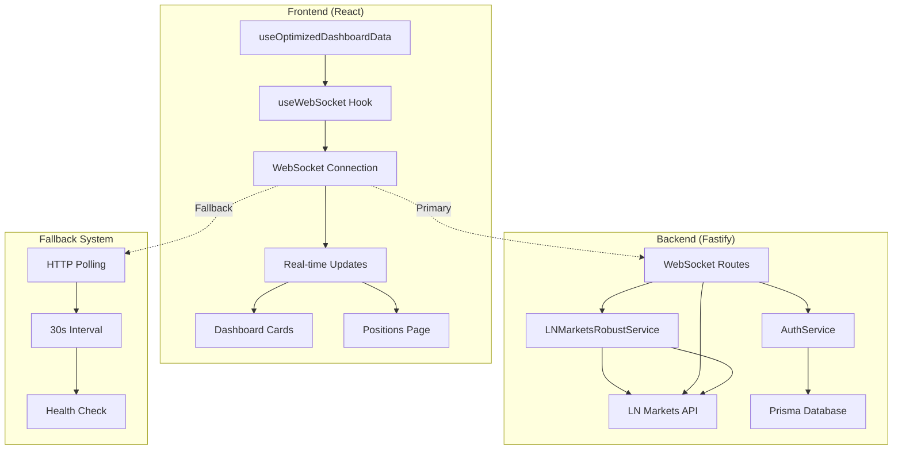
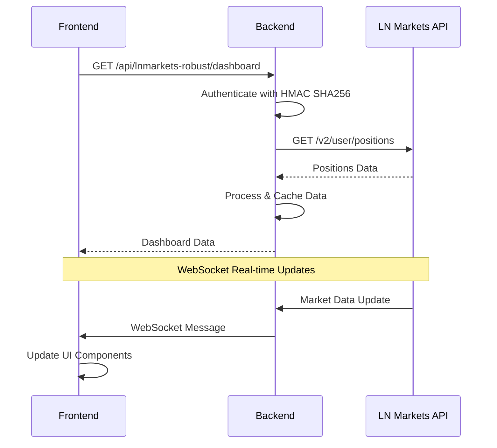

# 🚀 **GUIA COMPLETO DO SISTEMA HUB DEFISATS REFATORADO**

## 📋 **ÍNDICE**

1. [Visão Geral do Sistema](#1-visão-geral-do-sistema)
2. [Arquitetura Pós-Refatoração](#2-arquitetura-pós-refatoração)
3. [Backend - Estrutura e Componentes](#3-backend---estrutura-e-componentes)
4. [Frontend - Hooks e Contextos](#4-frontend---hooks-e-contextos)
5. [Integração LN Markets](#5-integração-ln-markets)
6. [Sistema WebSocket vs HTTP](#6-sistema-websocket-vs-http)
7. [Padrões de Desenvolvimento](#7-padrões-de-desenvolvimento)
8. [Próximos Passos](#8-próximos-passos)

---

## 1. **VISÃO GERAL DO SISTEMA**

### 🎯 **Objetivo do Hub DeFiSats**

O Hub DeFiSats é uma **plataforma de automação de trading** construída com arquitetura de microserviços, projetada para:
- **Alta disponibilidade** e escalabilidade
- **Integração robusta** com LN Markets API v2
- **Monitoramento em tempo real** de posições e margem
- **Automações inteligentes** para trading
- **Dashboard administrativo** completo

### 🛠️ **Stack Tecnológica**

#### **Backend**
- **Node.js 18+** com Fastify
- **PostgreSQL 15+** com Prisma ORM
- **Redis 7+** com BullMQ para filas
- **WebSocket** para comunicação em tempo real
- **Docker** + Docker Compose

#### **Frontend**
- **React 18** com Vite
- **TypeScript** para tipagem forte
- **Zustand** para gerenciamento de estado
- **Axios** para comunicação HTTP
- **Recharts** para visualização de dados

### 🔐 **Autenticação**
- **JWT** + Refresh Tokens
- **HMAC SHA256** para LN Markets API
- **Middleware** de autenticação robusto

---

## 2. **ARQUITETURA PÓS-REFATORAÇÃO**

### 🏗️ **Diagrama de Arquitetura**



### 🎯 **Principais Componentes**

| Componente | Responsabilidade | Localização |
|------------|------------------|-------------|
| **WebSocket Routes** | Gerenciamento de conexões WebSocket | `backend/src/routes/websocket.routes.ts` |
| **useWebSocket Hook** | Conexão e comunicação WebSocket | `frontend/src/hooks/useWebSocket.ts` |
| **LNMarketsRobustService** | Integração com LN Markets API | `backend/src/services/LNMarketsRobustService.ts` |
| **useOptimizedDashboardData** | Hook híbrido WebSocket + HTTP | `frontend/src/hooks/useOptimizedDashboardData.ts` |

---

## 3. **BACKEND - ESTRUTURA E COMPONENTES**

### 📁 **Estrutura de Arquivos**

```
backend/src/
├── config/           # Configurações do sistema
├── controllers/      # Controladores das rotas
├── middleware/       # Middlewares de autenticação e validação
├── routes/          # Definição das rotas
├── services/        # Lógica de negócios
├── utils/           # Utilitários e helpers
└── index.ts         # Ponto de entrada da aplicação
```

### 🔧 **Configurações**

#### **Environment Variables**
```typescript
// backend/src/config/env.ts
const envSchema = z.object({
  PORT: z.string().transform(Number).default(() => 13000),
  DATABASE_URL: z.string(),
  REDIS_URL: z.string(),
  JWT_SECRET: z.string().min(32),
  REFRESH_TOKEN_SECRET: z.string().min(32),
  ENCRYPTION_KEY: z.string().min(32),
});
```

### 🛣️ **Rotas Principais**

#### **LN Markets Routes**
```typescript
// backend/src/routes/lnmarkets-robust.routes.ts
export async function lnmarketsRobustRoutes(fastify: FastifyInstance) {
  // Dashboard unificado
  fastify.get('/dashboard', {
    preHandler: [authenticate],
    handler: dashboardController.getDashboardData
  });
  
  // Posições do usuário
  fastify.get('/positions', {
    preHandler: [authenticate],
    handler: positionsController.getUserPositions
  });
}
```

#### **WebSocket Routes**
```typescript
// backend/src/routes/websocket.routes.ts
export async function websocketRoutes(fastify: FastifyInstance) {
  fastify.register(require('@fastify/websocket'));
  
  fastify.get('/ws', { websocket: true }, (connection, req) => {
    // Gerenciamento de conexões WebSocket
  });
}
```

### 🔐 **Serviços de Autenticação**

#### **LNMarketsRobustService**
```typescript
export class LNMarketsRobustService {
  private authenticateRequest(config: AxiosRequestConfig): AxiosRequestConfig {
    const timestamp = Date.now().toString();
    const method = (config.method || 'GET').toUpperCase();
    const path = config.url || '';
    
    // String de assinatura: timestamp + method + '/v2' + path + params
    const message = timestamp + method + '/v2' + path + params;
    
    // HMAC SHA256 com codificação base64
    const signature = crypto
      .createHmac('sha256', apiSecret)
      .update(message, 'utf8')
      .digest('base64');
    
    // Headers de autenticação
    config.headers = {
      'LNM-ACCESS-KEY': apiKey,
      'LNM-ACCESS-SIGNATURE': signature,
      'LNM-ACCESS-PASSPHRASE': passphrase,
      'LNM-ACCESS-TIMESTAMP': timestamp,
    };
    
    return config;
  }
}
```

### 🗄️ **Middleware**

#### **Auth Middleware**
```typescript
// backend/src/middleware/auth.middleware.ts
export const authMiddleware = async (request: FastifyRequest, reply: FastifyReply) => {
  const token = request.headers.authorization?.replace('Bearer ', '');
  
  if (!token) {
    return reply.status(401).send({ error: 'Token não fornecido' });
  }
  
  try {
    const decoded = jwt.verify(token, process.env.JWT_SECRET!);
    request.user = decoded;
  } catch (error) {
    return reply.status(401).send({ error: 'Token inválido' });
  }
};
```

---

## 4. **FRONTEND - HOOKS E CONTEXTOS**

### 🎣 **Hooks Principais**

#### **useOptimizedDashboardData**
```typescript
export const useOptimizedDashboardData = (): UseOptimizedDashboardDataReturn => {
  const { isAuthenticated, user } = useAuthStore();
  const [data, setData] = useState<DashboardData | null>(null);
  const [isLoading, setIsLoading] = useState(false);
  
  // WebSocket para atualizações em tempo real
  const wsUrl = `ws://localhost:13000/ws?userId=${user?.id || 'anonymous'}`;
  const { isConnected, sendMessage } = useWebSocket({
    url: wsUrl,
    onMessage: useCallback((message) => {
      if (message.type === 'data_update') {
        setData(prev => ({
          ...prev,
          lnMarkets: message.data,
          lastUpdate: Date.now(),
          cacheHit: false
        }));
      }
    }, [])
  });
  
  // Sistema híbrido: WebSocket primário + HTTP fallback
  const refresh = useCallback(async () => {
    if (isConnected && sendMessage) {
      sendMessage({ type: 'refresh_data', userId: user?.id });
    } else {
      await fetchDashboardData();
    }
  }, [isConnected, sendMessage, user?.id]);
  
  return { data, isLoading, refresh, isConnected };
};
```

#### **useWebSocket**
```typescript
export const useWebSocket = ({
  url,
  reconnectInterval = 5000,
  maxReconnectAttempts = 5,
  onMessage,
}: UseWebSocketOptions) => {
  const [isConnected, setIsConnected] = useState(false);
  const wsRef = useRef<WebSocket | null>(null);
  
  const connect = useCallback(() => {
    if (wsRef.current?.readyState === WebSocket.OPEN) return;
    
    const ws = new WebSocket(url);
    wsRef.current = ws;
    
    ws.onopen = () => {
      setIsConnected(true);
      reconnectAttemptsRef.current = 0;
    };
    
    ws.onmessage = (event) => {
      const message: WebSocketMessage = JSON.parse(event.data);
      onMessage?.(message);
    };
    
    ws.onclose = () => {
      setIsConnected(false);
      // Reconexão automática
      if (reconnectAttemptsRef.current < maxReconnectAttempts) {
        setTimeout(connect, reconnectInterval);
        reconnectAttemptsRef.current++;
      }
    };
  }, [url, reconnectInterval, maxReconnectAttempts, onMessage]);
  
  return { isConnected, connect };
};
```

### 🎨 **Componentes Otimizados**

#### **DashboardCard com React.memo**
```typescript
const DashboardCard = memo<DashboardCardProps>(({ 
  title, 
  value, 
  subtitle, 
  icon: Icon, 
  variant = 'default',
  isLoading = false,
  className 
}) => {
  return (
    <Card className={cn(
      getVariantStyles(),
      isLoading ? 'opacity-75' : 'opacity-100',
      className
    )}>
      <CardHeader>
        <CardTitle className="text-sm font-medium flex items-center gap-2">
          <Icon className={cn("h-4 w-4", getIconColor())} />
          {title}
        </CardTitle>
      </CardHeader>
      <CardContent>
        <div className="text-2xl font-bold text-text-primary">
          {isLoading ? '...' : value}
        </div>
        {subtitle && (
          <p className="text-xs text-text-secondary mt-1">
            {subtitle}
          </p>
        )}
      </CardContent>
    </Card>
  );
});
```

---

## 5. **INTEGRAÇÃO LN MARKETS**

### 🔐 **Autenticação HMAC SHA256**

#### **String de Assinatura**
```typescript
// Ordem correta para LN Markets API v2:
const message = timestamp + method + '/v2' + path + params;

// Exemplo:
// timestamp: "1640995200000"
// method: "GET"
// path: "/v2/user/positions"
// params: ""
// message: "1640995200000GET/v2/v2/user/positions"
```

#### **Headers de Autenticação**
```typescript
const headers = {
  'LNM-ACCESS-KEY': apiKey,
  'LNM-ACCESS-SIGNATURE': signature, // HMAC SHA256 em base64
  'LNM-ACCESS-PASSPHRASE': passphrase,
  'LNM-ACCESS-TIMESTAMP': timestamp, // milliseconds
  'Content-Type': 'application/json'
};
```

### 📊 **Endpoints Utilizados**

#### **Market Data**
- `GET /v2/market/index` - Índice de mercado
- `GET /v2/market/ticker` - Ticker de preços
- `GET /v2/market/history` - Histórico de preços

#### **User Data**
- `GET /v2/user/positions` - Posições do usuário
- `GET /v2/user/balance` - Saldo do usuário
- `GET /v2/user/account` - Informações da conta

#### **Trading**
- `POST /v2/trade/order` - Criar ordem
- `DELETE /v2/trade/order/{id}` - Cancelar ordem
- `GET /v2/trade/orders` - Listar ordens

### 🔄 **Fluxo de Dados**



---

## 6. **SISTEMA WEBSOCKET VS HTTP**

### 🔌 **Configuração WebSocket**

#### **Backend WebSocket**
```typescript
// backend/src/routes/websocket.routes.ts
fastify.register(require('@fastify/websocket'));

fastify.get('/ws', { websocket: true }, (connection, req) => {
  const userId = req.query.userId;
  
  connection.socket.on('message', (message) => {
    const data = JSON.parse(message.toString());
    
    if (data.type === 'refresh_data') {
      // Buscar dados atualizados e enviar via WebSocket
      const dashboardData = await getDashboardData(userId);
      connection.socket.send(JSON.stringify({
        type: 'data_update',
        data: dashboardData
      }));
    }
  });
});
```

#### **Frontend WebSocket**
```typescript
// frontend/src/hooks/useWebSocket.ts
const ws = new WebSocket('ws://localhost:13000/ws?userId=123');

ws.onmessage = (event) => {
  const message = JSON.parse(event.data);
  
  if (message.type === 'data_update') {
    // Atualizar estado do componente
    setData(message.data);
  }
};
```

### 🔄 **Sistema Híbrido Otimizado**

#### **Prioridade WebSocket**
```typescript
const refresh = useCallback(async () => {
  // 1. Tentar WebSocket primeiro
  if (isConnected && sendMessage) {
    sendMessage({ type: 'refresh_data', userId: user?.id });
    return;
  }
  
  // 2. Fallback para HTTP
  await fetchDashboardData();
}, [isConnected, sendMessage, user?.id]);
```

#### **Health Check Contínuo**
```typescript
useEffect(() => {
  const healthCheck = setInterval(() => {
    if (isConnected) {
      console.log('💚 WebSocket health check: OK');
    } else {
      console.log('💔 WebSocket health check: DISCONNECTED');
      // Ativar fallback HTTP
      fetchDashboardData();
    }
  }, 10000);
  
  return () => clearInterval(healthCheck);
}, [isConnected]);
```

### ⚡ **Otimizações de UI**

#### **React.memo para Performance**
```typescript
const PositionRow = memo<PositionRowProps>(({ position, index }) => {
  // Componente otimizado que só re-renderiza quando props mudam
  return (
    <TableRow>
      <TableCell>{position.side}</TableCell>
      <TableCell>{position.quantity}</TableCell>
      <TableCell>{position.price}</TableCell>
    </TableRow>
  );
});
```

#### **useCallback para Estabilidade**
```typescript
const fetchDashboardData = useCallback(async () => {
  // Função estável que não causa re-renders desnecessários
  const data = await api.get('/api/lnmarkets-robust/dashboard');
  setData(data.data);
}, []);
```

---

## 7. **PADRÕES DE DESENVOLVIMENTO**

### 🏗️ **Clean Architecture**

#### **Separação de Responsabilidades**
```
backend/src/
├── controllers/     # Lógica de apresentação
├── services/       # Lógica de negócios
├── repositories/   # Acesso a dados
├── middleware/     # Cross-cutting concerns
└── utils/         # Utilitários
```

#### **Dependency Injection**
```typescript
export class LNMarketsController {
  constructor(
    private prisma: PrismaClient,
    private logger: Logger,
    private lnMarketsService: LNMarketsRobustService
  ) {}
  
  async getDashboardData(request: FastifyRequest, reply: FastifyReply) {
    // Lógica do controller
  }
}
```

### 📝 **Padrões de Nomenclatura**

#### **Arquivos e Diretórios**
- **kebab-case**: `lnmarkets-robust.routes.ts`
- **PascalCase**: `LNMarketsRobustService.ts`
- **camelCase**: `useOptimizedDashboardData.ts`

#### **Variáveis e Funções**
```typescript
// ✅ Bom
const userPositions = await getUserPositions();
const isConnected = useWebSocket();

// ❌ Ruim
const user_positions = await getUserPositions();
const is_connected = useWebSocket();
```

### 🛡️ **Tratamento de Erros**

#### **Error Boundaries**
```typescript
class ErrorBoundary extends Component {
  constructor(props) {
    super(props);
    this.state = { hasError: false };
  }
  
  static getDerivedStateFromError(error) {
    return { hasError: true };
  }
  
  componentDidCatch(error, errorInfo) {
    console.error('Error caught by boundary:', error, errorInfo);
  }
}
```

#### **Try-Catch Robusto**
```typescript
try {
  const data = await lnMarketsService.getUserPositions();
  return { success: true, data };
} catch (error) {
  logger.error('Error fetching positions:', error);
  
  if (error.response?.status === 401) {
    return { success: false, error: 'Invalid credentials' };
  }
  
  return { success: false, error: 'Unknown error' };
}
```

### 📊 **Logging Estruturado**

#### **Winston Logger**
```typescript
import { logger } from '../utils/logger';

logger.info('User positions fetched', {
  userId: user.id,
  positionsCount: positions.length,
  timestamp: new Date().toISOString()
});

logger.error('LN Markets API error', {
  error: error.message,
  endpoint: '/v2/user/positions',
  userId: user.id
});
```

### 🧪 **Testes**

#### **Testes de Integração**
```typescript
describe('LN Markets Integration', () => {
  it('should authenticate with LN Markets API', async () => {
    const service = new LNMarketsRobustService(credentials);
    const positions = await service.getUserPositions();
    
    expect(positions).toBeDefined();
    expect(Array.isArray(positions)).toBe(true);
  });
});
```

---

## 8. **PRÓXIMOS PASSOS**

### 🎯 **Dicas para Desenvolvedores**

#### **1. Sempre Use TypeScript**
```typescript
// ✅ Bom - Tipagem forte
interface DashboardData {
  positions: Position[];
  balance: number;
  lastUpdate: number;
}

// ❌ Ruim - Sem tipagem
const data = await fetchDashboardData();
```

#### **2. Implemente Error Boundaries**
```typescript
// Sempre envolva componentes críticos
<ErrorBoundary>
  <Dashboard />
</ErrorBoundary>
```

#### **3. Use React.memo para Performance**
```typescript
// Para componentes que renderizam frequentemente
const ExpensiveComponent = memo(({ data }) => {
  return <div>{data.map(item => <Item key={item.id} {...item} />)}</div>;
});
```

### ⚠️ **Pontos de Atenção**

#### **1. Memory Leaks**
- Sempre limpe intervalos e WebSocket connections
- Use `useEffect` cleanup functions
- Evite referências circulares

#### **2. Rate Limiting**
- LN Markets tem limites de API
- Implemente circuit breakers
- Use cache para reduzir chamadas

#### **3. WebSocket Reconnection**
- Implemente reconexão automática
- Gerencie estado de conexão
- Fallback para HTTP quando necessário

### 🚀 **Melhorias Futuras**

#### **1. Performance**
- Implementar lazy loading
- Otimizar bundle size
- Usar service workers para cache

#### **2. Escalabilidade**
- Implementar load balancing
- Usar Redis Cluster
- Adicionar monitoring avançado

#### **3. Segurança**
- Implementar 2FA
- Adicionar rate limiting por usuário
- Audit logs completos

---

## 📚 **RECURSOS ADICIONAIS**

### 🔗 **Links Úteis**
- [LN Markets API Documentation](https://docs.lnmarkets.com/)
- [Fastify Documentation](https://www.fastify.io/docs/latest/)
- [React Documentation](https://react.dev/)
- [Prisma Documentation](https://www.prisma.io/docs/)

### 📖 **Documentação Relacionada**
- `.system/docs/architecture/overview.md` - Visão geral da arquitetura
- `.system/docs/ln_markets/REFACTORING_PROGRESS_REPORT.md` - Relatório de refatoração
- `.system/docs/VOLATILE_MARKET_SAFETY.md` - Segurança em mercados voláteis

---

**🎉 Este guia serve como fonte de verdade para o desenvolvimento e manutenção do sistema Hub DeFiSats refatorado. Mantenha-o atualizado conforme o sistema evolui.**
