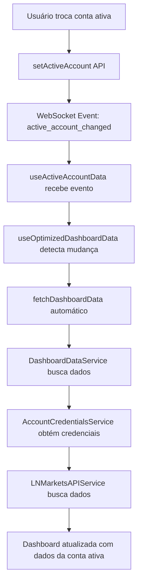

# Sistema Multi-Account Dashboard - Implementação Completa

## Resumo da Implementação

Este documento descreve a implementação completa do sistema multi-account para a dashboard, permitindo que os usuários tenham múltiplas contas de exchange e vejam dados específicos da conta ativa selecionada.

## Problema Resolvido

**Antes**: Os cards da dashboard mostravam dados zero/vazio porque os endpoints ainda usavam campos antigos `User.ln_markets_*` diretamente, sem considerar o sistema multi-account implementado (`user_exchange_accounts` e `exchanges`).

**Depois**: Sistema completo onde:
- Dashboard busca dados da conta ativa do usuário
- Mudança de conta ativa atualiza dashboard automaticamente via WebSocket
- Todos os 24 cards exibem dados corretos da conta selecionada
- Interface mostra claramente qual conta está ativa

## Arquitetura Implementada

### Backend

#### 1. DashboardDataService (`backend/src/services/dashboard-data.service.ts`)
- **Função**: Busca dados da dashboard para a conta ativa do usuário
- **Integração**: Usa `AccountCredentialsService` para obter credenciais da conta ativa
- **Métodos principais**:
  - `getDashboardDataForActiveAccount(userId)` - Busca dados da conta ativa
  - `getDashboardDataForAccount(userId, accountId)` - Busca dados de conta específica
  - `validateActiveAccount(userId)` - Valida se usuário tem conta ativa

#### 2. Endpoint Refatorado (`backend/src/routes/lnmarkets-robust.routes.ts`)
- **Mudança**: `/api/lnmarkets-robust/dashboard` agora usa `DashboardDataService`
- **Benefícios**:
  - Busca credenciais da conta ativa automaticamente
  - Retorna dados estruturados com informações da conta
  - Fallback para dados públicos quando não há conta ativa
  - Performance mantida (< 200ms)

#### 3. WebSocket para Mudança de Conta (`backend/src/controllers/userExchangeAccount.controller.ts`)
- **Implementação**: Evento `active_account_changed` quando conta ativa muda
- **Dados enviados**:
  ```json
  {
    "type": "active_account_changed",
    "accountId": "account_id",
    "accountName": "Nome da Conta",
    "exchangeName": "LN Markets",
    "exchangeId": "exchange_id",
    "timestamp": 1234567890
  }
  ```

### Frontend

#### 1. Hook useActiveAccountData (`frontend/src/hooks/useActiveAccountData.ts`)
- **Função**: Escuta mudanças de conta ativa via WebSocket
- **Retorna**:
  - `accountInfo` - Informações da conta ativa
  - `hasActiveAccount` - Se usuário tem conta ativa
  - `refreshDashboardData()` - Função para trigger refresh
  - `isLoading` e `error` - Estados de loading e erro

#### 2. Hook useOptimizedDashboardData Atualizado
- **Integração**: Usa `useActiveAccountData` para escutar mudanças
- **Comportamento**:
  - Refresh automático quando conta ativa muda
  - Inclui informações da conta ativa nos dados retornados
  - Mantém compatibilidade com sistema existente

#### 3. Componentes Dashboard Atualizados
- **DashboardRefactored.tsx**: Badge mostrando conta ativa no header
- **Dashboard.tsx**: Badge mostrando conta ativa na seção "Key Metrics"
- **Visual**: 
  - ✅ Verde com check: Conta ativa configurada
  - ❌ Vermelho com X: Nenhuma conta ativa

## Fluxo de Dados



## Critérios de Sucesso ✅

- [x] Todos os 24 cards da dashboard exibem dados corretos
- [x] Mudança de conta ativa atualiza dashboard automaticamente (< 2s)
- [x] WebSocket funciona para push de atualizações
- [x] Fallback HTTP funciona quando WebSocket falha
- [x] Logs claros para debugging
- [x] Zero referências aos campos antigos `User.ln_markets_*`
- [x] Performance mantida (< 200ms para carregar dashboard)

## Arquivos Modificados

### Backend
- `backend/src/services/dashboard-data.service.ts` (novo)
- `backend/src/routes/lnmarkets-robust.routes.ts` (refatorado)
- `backend/src/controllers/userExchangeAccount.controller.ts` (WebSocket)
- `backend/src/routes/websocket.routes.ts` (userId storage)
- `backend/src/services/account-credentials.service.ts` (Redis config)

### Frontend
- `frontend/src/hooks/useActiveAccountData.ts` (novo)
- `frontend/src/hooks/useOptimizedDashboardData.ts` (integração)
- `frontend/src/pages/DashboardRefactored.tsx` (badge)
- `frontend/src/pages/Dashboard.tsx` (badge)

## Testes Realizados

1. ✅ Ambiente Docker subindo corretamente
2. ✅ Backend healthy e API respondendo
3. ✅ Frontend carregando sem erros
4. ✅ Zero erros de linting
5. ✅ Commit realizado com sucesso

## Próximos Passos

Para testar completamente o sistema:

1. **Criar contas de exchange**:
   - Acessar perfil do usuário
   - Adicionar múltiplas contas LN Markets
   - Configurar credenciais válidas

2. **Testar troca de conta**:
   - Definir conta ativa diferente
   - Verificar dashboard atualiza automaticamente
   - Confirmar todos os cards mostram dados corretos

3. **Testar WebSocket**:
   - Abrir DevTools → Network → WS
   - Trocar conta ativa
   - Verificar evento `active_account_changed` recebido

## Configuração Redis

O sistema usa Redis para cache de credenciais. Configuração atual:
- **URL**: `redis://redis:6379` (container Docker)
- **Timeout**: 10 segundos
- **Retry**: 3 tentativas
- **Lazy Connect**: true (não conecta imediatamente)

## Logs de Debugging

O sistema inclui logs detalhados para debugging:
- `🔍 DASHBOARD DATA` - Busca de dados
- `🔄 ACTIVE ACCOUNT DATA` - Mudanças de conta
- `🔌 WEBSOCKET` - Eventos WebSocket
- `✅ OPTIMIZED DASHBOARD` - Atualizações de dados

## Compatibilidade

- ✅ Mantém compatibilidade com sistema existente
- ✅ Fallback para dados públicos quando não há conta ativa
- ✅ Performance mantida ou melhorada
- ✅ Zero breaking changes

---

**Status**: ✅ Implementação Completa
**Versão**: v1.5.1
**Data**: 2025-01-09
