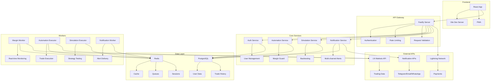
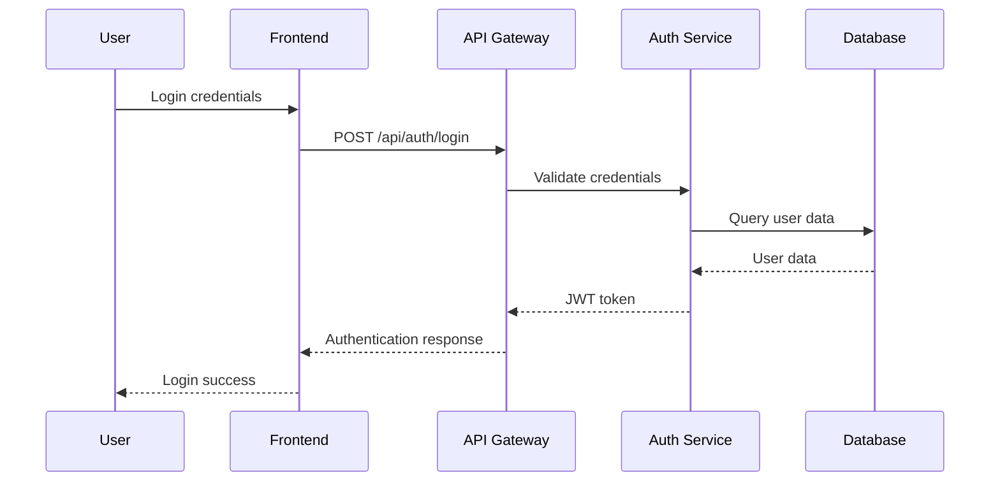
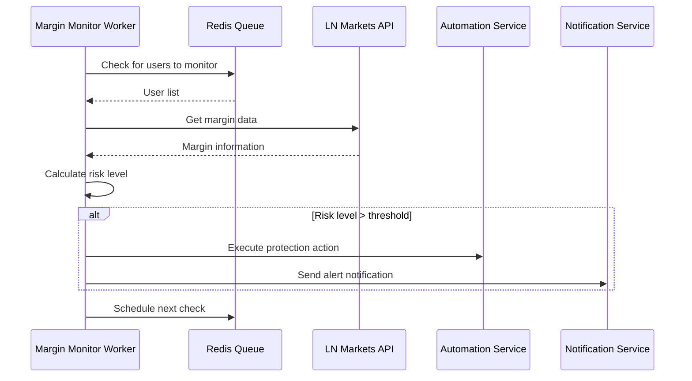
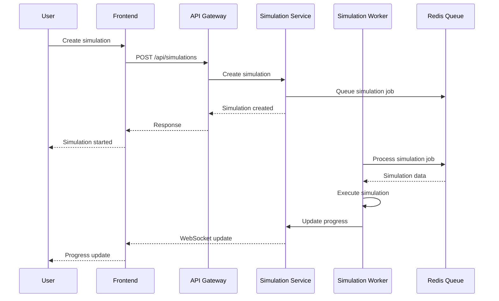

# Arquitetura do Sistema

## Visão Geral

O Hub-defisats é uma plataforma de automação de trading construída com arquitetura de microserviços, projetada para alta disponibilidade, escalabilidade e segurança. O sistema integra com a LN Markets para execução de trades automatizados e proteção contra liquidação.

## Arquitetura de Alto Nível

## Componentes Principais

### 1. Frontend (React + Vite)

**Responsabilidades:**
- Interface do usuário responsiva
- Gerenciamento de estado (Zustand)
- Comunicação em tempo real (WebSocket)
- Visualização de dados (Recharts)

**Tecnologias:**
- React 18 com hooks
- Vite para build e dev server
- Tailwind CSS para estilização
- shadcn/ui para componentes
- Socket.IO Client para WebSocket

### 2. API Gateway (Fastify)

**Responsabilidades:**
- Roteamento de requisições
- Autenticação e autorização
- Rate limiting e validação
- Documentação da API (Swagger)

**Tecnologias:**
- Fastify 4.x
- JWT para autenticação
- Zod para validação
- Swagger para documentação

### 3. Core Services

#### Auth Service
- Gerenciamento de usuários
- Autenticação JWT + Refresh Tokens
- Integração com LN Markets
- Criptografia de credenciais

#### Automation Service
- CRUD de automações
- Configuração de Margin Guard
- Validação de parâmetros
- Histórico de execuções

#### Simulation Service
- Simulações em tempo real
- Cenários de mercado (Bull, Bear, Sideways, Volatile)
- Algoritmos de movimento de preço
- Análise de performance

#### Notification Service
- Envio multi-canal (Email, Telegram, WhatsApp)
- Configuração por usuário
- Templates de mensagens
- Retry logic

### 4. Workers (Background Processing)

#### Margin Monitor Worker
- Monitoramento contínuo de margem
- Verificação a cada 30 segundos
- Cálculo de risco de liquidação
- Execução de ações de proteção

#### Automation Executor Worker
- Execução de automações configuradas
- Integração com LN Markets API
- Logging de todas as ações
- Tratamento de erros

#### Simulation Executor Worker
- Execução de simulações
- Processamento assíncrono
- Geração de métricas
- Dados para gráficos

#### Notification Worker
- Envio de notificações
- Retry automático
- Logs de entrega
- Rate limiting

### 5. Data Layer

#### PostgreSQL
- Dados transacionais
- Relacionamentos complexos
- ACID compliance
- Backup e replicação

#### Redis
- Cache de dados frequentes
- Filas de workers (BullMQ)
- Sessões de usuário
- Rate limiting

## Fluxo de Dados

### 1. Autenticação

### 2. Margin Guard

### 3. Simulação

## Padrões Arquiteturais

### 1. Microserviços
- Separação clara de responsabilidades
- Deploy independente
- Escalabilidade horizontal
- Isolamento de falhas

### 2. Event-Driven Architecture
- Comunicação assíncrona via filas
- Desacoplamento de serviços
- Processamento em background
- Retry automático

### 3. CQRS (Command Query Responsibility Segregation)
- Separação de comandos e consultas
- Otimização de performance
- Escalabilidade independente
- Consistência eventual

### 4. Circuit Breaker
- Proteção contra falhas em cascata
- Fallback gracioso
- Recuperação automática
- Monitoramento de saúde

## Segurança

### 1. Autenticação e Autorização
- JWT com refresh tokens
- 2FA para administradores
- Rate limiting por usuário
- Sessões seguras

### 2. Criptografia
- AES-256 para dados sensíveis
- bcrypt para senhas
- HTTPS em todas as comunicações
- Chaves rotacionadas regularmente

### 3. Validação e Sanitização
- Validação de entrada em todas as APIs
- Sanitização de dados
- Prevenção de SQL injection
- Proteção contra XSS

### 4. Monitoramento
- Logs de segurança
- Alertas de atividades suspeitas
- Auditoria de ações críticas
- Detecção de intrusão

## Escalabilidade

### 1. Horizontal Scaling
- Múltiplas instâncias de workers
- Load balancing
- Distribuição de carga
- Auto-scaling baseado em métricas

### 2. Caching
- Redis para cache de dados frequentes
- CDN para assets estáticos
- Cache de consultas de banco
- Invalidação inteligente

### 3. Database Optimization
- Índices otimizados
- Queries eficientes
- Read replicas
- Particionamento de dados

### 4. Queue Management
- Filas prioritárias
- Dead letter queues
- Retry policies
- Monitoring de filas

## Monitoramento e Observabilidade

### 1. Métricas
- Performance da aplicação
- Uso de recursos
- Taxa de erro
- Throughput

### 2. Logs
- Logs estruturados (JSON)
- Correlação de requests
- Níveis de log configuráveis
- Rotação automática

### 3. Alertas
- Alertas proativos
- Escalação automática
- Integração com Slack/Email
- Runbooks de incidentes

### 4. Dashboards
- Grafana para visualização
- Métricas em tempo real
- Histórico de performance
- Análise de tendências

## Deployment

### 1. Containerização
- Docker para todos os serviços
- Multi-stage builds
- Imagens otimizadas
- Security scanning

### 2. Orquestração
- Kubernetes para produção
- Helm charts para configuração
- Rolling updates
- Blue-green deployment

### 3. CI/CD
- GitHub Actions
- Testes automatizados
- Deploy automático
- Rollback automático

### 4. Infraestrutura
- Cloud provider (AWS/GCP/Azure)
- Managed services
- Auto-scaling
- Disaster recovery

## Considerações de Performance

### 1. Latência
- < 200ms para automações
- Cache de dados frequentes
- Otimização de queries
- CDN para assets

### 2. Throughput
- 1000+ requests/minuto
- Processamento assíncrono
- Rate limiting inteligente
- Load balancing

### 3. Disponibilidade
- 99.5%+ uptime
- Redundância de serviços
- Failover automático
- Health checks

### 4. Recursos
- Uso eficiente de CPU/Memory
- Connection pooling
- Garbage collection otimizado
- Profiling contínuo

---

**Documento**: Arquitetura do Sistema  
**Versão**: 1.3.0  
**Última Atualização**: 2025-01-15  
**Responsável**: Equipe de Desenvolvimento
