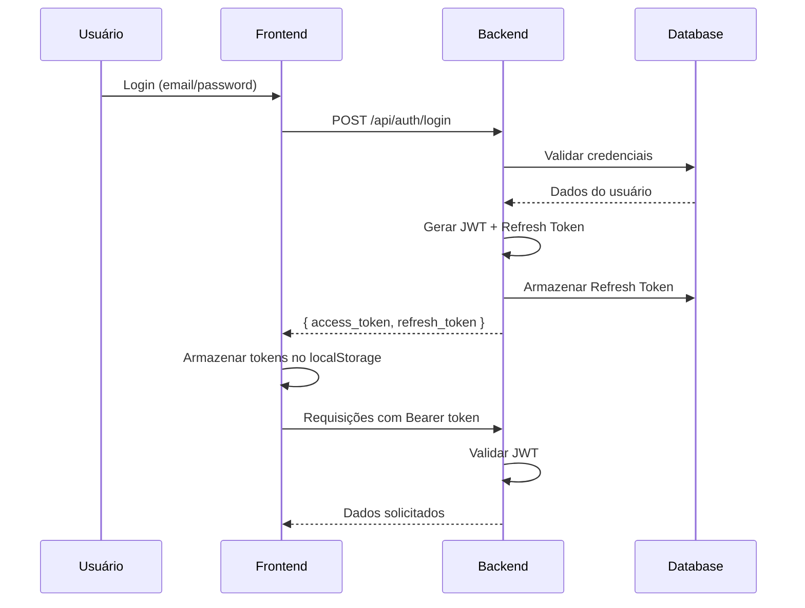

# 🔐 Documentação de Segurança - Hub DeFiSats

## 📋 Visão Geral

O Hub DeFiSats implementa um sistema de segurança robusto e moderno, seguindo as melhores práticas da indústria para plataformas de trading financeiro. Este documento detalha todas as medidas de segurança implementadas.

## 🛡️ Arquitetura de Segurança

### 1. Autenticação e Autorização

#### JWT (JSON Web Tokens)
- **Token de Acesso**: 2 horas de duração (configurável)
- **Refresh Token**: 7 dias de duração (configurável)
- **Algoritmo**: HS256 (HMAC SHA-256)
- **Rotação Automática**: Habilitada por padrão

#### Fluxo de Autenticação


### 2. Criptografia de Dados

#### Credenciais Sensíveis
- **Algoritmo**: AES-256-CBC
- **Chave**: Derivada via PBKDF2 com salt
- **Armazenamento**: Banco de dados criptografado
- **Escopo**: API Keys, Secrets, Passphrases

#### Exemplo de Criptografia
```typescript
// Criptografia de credenciais LN Markets
const encryptedData = encryptData(apiKey, secretKey);
// Resultado: "iv:encrypted_data" (Base64)

// Descriptografia
const decryptedData = decryptData(encryptedData, secretKey);
```

### 3. Sistema de Auditoria

#### Logs de Segurança
- **Todas as ações** são registradas
- **Rastreamento de IP** e User-Agent
- **Timestamp** preciso para cada evento
- **Detalhes contextuais** em JSON

#### Tipos de Eventos Monitorados
- `LOGIN` - Tentativas de login
- `LOGOUT` - Logout de usuários
- `TOKEN_REFRESH` - Renovação de tokens
- `CONFIG_UPDATE` - Alterações de configuração
- `TOKENS_REVOKED` - Revogação de tokens
- `SUSPICIOUS_ACTIVITY` - Atividades suspeitas

### 4. Controle de Acesso

#### Níveis de Permissão
1. **Usuário Padrão**: Acesso às próprias funcionalidades
2. **Admin**: Acesso a configurações e logs
3. **Super Admin**: Controle total do sistema

#### Middleware de Autenticação
```typescript
// Verificação de token JWT
async function authMiddleware(request, reply) {
  const token = extractToken(request);
  const user = await validateToken(token);
  request.user = user;
}

// Verificação de admin
async function adminAuthMiddleware(request, reply) {
  await authMiddleware(request, reply);
  if (!isAdmin(request.user)) {
    throw new Error('Admin access required');
  }
}
```

## 🔧 Configurações de Segurança

### Configurações Dinâmicas

Todas as configurações de segurança são armazenadas no banco de dados e podem ser alteradas sem reinicialização:

| Configuração | Padrão | Descrição | Impacto |
|-------------|--------|-----------|---------|
| `jwt_expires_in` | `2h` | Duração do JWT de acesso | Segurança vs Usabilidade |
| `refresh_token_expires_in` | `7d` | Duração do refresh token | Conveniência do usuário |
| `max_login_attempts` | `5` | Tentativas antes do bloqueio | Proteção contra força bruta |
| `lockout_duration` | `15m` | Duração do bloqueio | Tempo de resfriamento |
| `session_timeout` | `30m` | Timeout por inatividade | Segurança de sessão |
| `require_2fa` | `false` | Obrigar autenticação 2FA | Segurança adicional |
| `token_rotation_enabled` | `true` | Rotação automática | Renovação de segurança |
| `max_concurrent_sessions` | `3` | Sessões simultâneas | Controle de acesso |

### APIs de Configuração

```bash
# Listar todas as configurações
GET /api/admin/security/configs

# Atualizar configuração específica
PUT /api/admin/security/configs/jwt_expires_in
{
  "value": "1h",
  "description": "Reduzir para 1 hora por segurança"
}

# Obter logs de auditoria
GET /api/admin/security/audit-logs?limit=100&offset=0

# Revogar todos os tokens de um usuário
POST /api/admin/security/revoke-tokens/user_id

# Limpar tokens expirados
POST /api/admin/security/cleanup-tokens
```

## 🚨 Monitoramento e Alertas

### Dashboard de Segurança

O painel administrativo fornece visão em tempo real:

- **Usuários Ativos**: Número de sessões ativas
- **Tentativas de Login**: Sucessos e falhas
- **Atividades Suspeitas**: Detecção automática
- **Tokens Expirados**: Limpeza automática
- **Logs Recentes**: Últimas 20 ações

### Detecção de Anomalias

#### Padrões Suspeitos
- Múltiplas tentativas de login falhadas
- Acesso de IPs diferentes simultaneamente
- Uso de User-Agents suspeitos
- Atividade fora do horário normal
- Tentativas de acesso a recursos restritos

#### Respostas Automáticas
- Bloqueio temporário de conta
- Notificação de administradores
- Revogação de tokens suspeitos
- Logs detalhados para investigação

## 🔄 Gerenciamento de Tokens

### Ciclo de Vida dos Tokens

1. **Geração**: Durante login ou refresh
2. **Validação**: A cada requisição autenticada
3. **Rotação**: Automática via refresh token
4. **Revogação**: Manual ou automática
5. **Limpeza**: Automática de tokens expirados

### Refresh Token Strategy

```typescript
// Fluxo de renovação de token
if (accessTokenExpired) {
  const newToken = await refreshAccessToken(refreshToken);
  if (newToken) {
    // Atualizar token e continuar
    updateAccessToken(newToken);
  } else {
    // Redirecionar para login
    redirectToLogin();
  }
}
```

## 🛠️ Implementação Técnica

### Estrutura do Banco de Dados

#### Tabela SecurityConfig
```sql
CREATE TABLE "SecurityConfig" (
  "id" TEXT PRIMARY KEY,
  "key" TEXT UNIQUE NOT NULL,
  "value" TEXT NOT NULL,
  "description" TEXT,
  "category" TEXT DEFAULT 'authentication',
  "is_active" BOOLEAN DEFAULT true,
  "created_at" TIMESTAMP DEFAULT NOW(),
  "updated_at" TIMESTAMP DEFAULT NOW(),
  "updated_by" TEXT REFERENCES "User"("id")
);
```

#### Tabela SecurityAuditLog
```sql
CREATE TABLE "SecurityAuditLog" (
  "id" TEXT PRIMARY KEY,
  "user_id" TEXT REFERENCES "User"("id"),
  "action" TEXT NOT NULL,
  "resource" TEXT,
  "ip_address" TEXT,
  "user_agent" TEXT,
  "success" BOOLEAN DEFAULT true,
  "details" JSONB,
  "created_at" TIMESTAMP DEFAULT NOW()
);
```

#### Tabela RefreshToken
```sql
CREATE TABLE "RefreshToken" (
  "id" TEXT PRIMARY KEY,
  "user_id" TEXT NOT NULL REFERENCES "User"("id"),
  "token" TEXT UNIQUE NOT NULL,
  "expires_at" TIMESTAMP NOT NULL,
  "is_revoked" BOOLEAN DEFAULT false,
  "ip_address" TEXT,
  "user_agent" TEXT,
  "created_at" TIMESTAMP DEFAULT NOW(),
  "last_used_at" TIMESTAMP
);
```

### Serviços de Segurança

#### SecurityConfigService
```typescript
class SecurityConfigService {
  async getConfig(key: string): Promise<string | null>
  async updateConfig(key: string, value: string): Promise<SecurityConfig>
  async getJWTExpiration(): Promise<string>
  async getRefreshTokenExpiration(): Promise<string>
  async logSecurityAction(userId: string, action: string, details: any): Promise<void>
  async revokeAllUserTokens(userId: string): Promise<void>
  async cleanupExpiredTokens(): Promise<number>
}
```

## 📊 Métricas de Segurança

### KPIs Monitorados

- **Taxa de Login Bem-sucedido**: > 95%
- **Tempo Médio de Resposta**: < 200ms
- **Tokens Ativos**: Monitoramento contínuo
- **Tentativas de Acesso Suspeitas**: < 1%
- **Uptime do Sistema**: > 99.9%

### Relatórios de Segurança

#### Relatório Diário
- Resumo de atividades
- Tentativas de acesso suspeitas
- Tokens revogados
- Configurações alteradas

#### Relatório Semanal
- Análise de tendências
- Recomendações de segurança
- Atualizações de configuração
- Treinamento de usuários

## 🚀 Próximos Passos

### Melhorias Planejadas

1. **Autenticação 2FA**
   - TOTP (Google Authenticator)
   - SMS Backup
   - Recovery Codes

2. **Rate Limiting Avançado**
   - Por IP e por usuário
   - Diferentes limites por endpoint
   - Whitelist de IPs confiáveis

3. **Análise de Comportamento**
   - Machine Learning para detecção
   - Padrões de uso normais
   - Alertas inteligentes

4. **Compliance e Auditoria**
   - Relatórios SOC 2
   - Logs imutáveis
   - Backup de segurança

### Monitoramento Contínuo

- Revisão semanal de logs
- Análise mensal de configurações
- Testes de penetração trimestrais
- Atualizações de segurança

## 📞 Contato de Segurança

Para reportar vulnerabilidades ou questões de segurança:

- **Email**: security@hubdefisats.com
- **Processo**: Responsible Disclosure
- **Tempo de Resposta**: 24-48 horas
- **Recompensas**: Bug Bounty Program

---

**Última Atualização**: Janeiro 2025  
**Versão**: 1.0.0  
**Responsável**: Equipe de Segurança Hub DeFiSats
