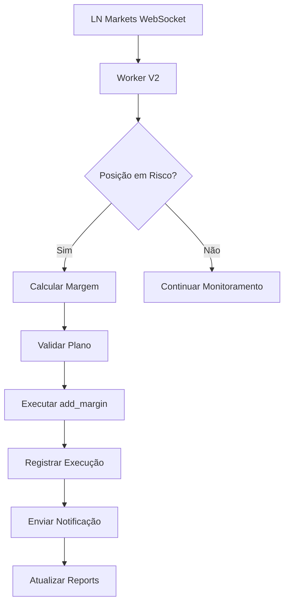

# Margin Guard V2 - Arquitetura

> **Status**: Active  
> **Última Atualização**: 2025-01-12  
> **Versão**: 2.0.0  
> **Responsável**: Sistema de Automação Axisor  

## 🏗️ Visão Geral da Arquitetura

O Margin Guard V2 utiliza uma arquitetura baseada em eventos com WebSocket em tempo real, sistema de notificações centralizado e integração completa com a LN Markets API v2.

## 🔄 Fluxo Principal



## 🧩 Componentes Principais

### 1. Worker V2 (`margin-guard-v2.worker.ts`)

**Localização**: `backend/src/workers/margin-guard-v2.worker.ts`

**Responsabilidades**:
- Escutar eventos do WebSocket Manager
- Calcular distância de liquidação
- Executar ações de proteção
- Registrar execuções

**Estrutura**:
```typescript
class MarginGuardV2Worker {
  private websocketManager: WebSocketManagerService;
  private lnMarketsService: LNMarketsAPIv2;
  private notificationService: NotificationCentralService;
  private automationLogger: AutomationLoggerService;

  async initialize() {
    // Conectar ao websocket
    this.websocketManager.on('positionUpdate', this.handlePositionUpdate);
  }

  private async handlePositionUpdate(userId: string, positionData: PositionData) {
    // 1. Buscar configurações do usuário
    // 2. Verificar se posição está em risco
    // 3. Executar ação se necessário
    // 4. Registrar e notificar
  }
}
```

### 2. WebSocket Manager Service

**Localização**: `backend/src/services/websocket-manager.service.ts`

**Responsabilidades**:
- Gerenciar conexão única com LN Markets WebSocket
- Distribuir eventos para workers
- Manter conexão estável
- Cache de dados de mercado

### 3. Notification Central Service

**Localização**: `backend/src/services/notification-central.service.ts`

**Responsabilidades**:
- Hub centralizado para todas as notificações
- Gerenciar preferências do usuário
- Distribuir para múltiplos canais
- Registrar notificações in-app

**Estrutura**:
```typescript
class NotificationCentralService {
  async notify(data: NotificationData) {
    // 1. Buscar preferências do usuário
    const preferences = await this.getUserPreferences(data.userId);
    
    // 2. Enviar para canais ativados
    for (const channel of preferences.enabledChannels) {
      await this.sendToChannel(channel, data);
    }
    
    // 3. Registrar in-app notification
    await this.createInAppNotification(data);
  }
}
```

### 4. Plan Limits Service

**Localização**: `backend/src/services/plan-limits.service.ts`

**Responsabilidades**:
- Validar limitações por plano
- Sugerir upgrades
- Controlar acesso a funcionalidades

## 📊 Estrutura de Dados

### Configuração do Margin Guard

```typescript
interface MarginGuardConfig {
  id: string;
  user_id: string;
  is_active: boolean;
  mode: 'unitario' | 'global';
  margin_threshold: number; // % de distância para acionar
  add_margin_percentage: number; // % de margem a adicionar
  selected_positions: string[]; // IDs das posições (modo unitário)
  created_at: Date;
  updated_at: Date;
}
```

### Execução de Automação

```typescript
interface MarginGuardExecution {
  id: string;
  user_id: string;
  trade_id: string;
  automation_config_id: string;
  status: 'success' | 'app_error' | 'exchange_error';
  trigger_data: {
    current_price: number;
    liquidation_price: number;
    distance_percentage: number;
    margin_threshold: number;
  };
  execution_result: {
    margin_added: number;
    fees: {
      opening_fee: number;
      closing_fee: number;
      maintenance_margin: number;
      sum_carry_fees: number;
    };
    total_cost: number;
  };
  error_message?: string;
  executed_at: Date;
}
```

### Notificação In-App

```typescript
interface InAppNotification {
  id: string;
  user_id: string;
  type: 'margin_guard' | 'tp_sl' | 'auto_entry';
  title: string;
  message: string;
  metadata: any;
  read: boolean;
  created_at: Date;
}
```

## 🔌 Integração com LN Markets

### WebSocket Events

O worker escuta os seguintes eventos:

```typescript
// Atualização de posição
websocketManager.on('positionUpdate', (userId, positionData) => {
  // positionData contém:
  // - trade_id
  // - current_price
  // - liquidation_price
  // - margin
  // - fees
  // - timestamp
});

// Atualização de preço
websocketManager.on('priceUpdate', (userId, priceData) => {
  // priceData contém:
  // - symbol (BTCUSD)
  // - price
  // - timestamp
});
```

### API Calls

```typescript
// Adicionar margem
const result = await lnMarketsService.futures.addMargin({
  trade_id: position.trade_id,
  margin: calculatedMargin,
  is_testnet: user.is_testnet
});

// Buscar posições
const positions = await lnMarketsService.futures.getPositions({
  user_id: userId,
  is_testnet: user.is_testnet
});
```

## 🛡️ Segurança e Validações

### Validações de Plano

```typescript
const planLimits = {
  'free': {
    maxPositions: 2,
    modes: ['global'],
    features: ['basic_config']
  },
  'basic': {
    maxPositions: -1, // ilimitado
    modes: ['global'],
    features: ['basic_config', 'preview']
  },
  'advanced': {
    maxPositions: -1,
    modes: ['unitario', 'global'],
    features: ['advanced_config', 'preview', 'reports']
  },
  'pro': {
    maxPositions: -1,
    modes: ['unitario', 'global', 'individual'],
    features: ['all_features']
  }
};
```

### Rate Limiting

- **LN Markets API**: 1 request/segundo
- **WebSocket**: Conexão única por usuário
- **Database**: Connection pooling
- **Cache**: 30s máximo para dados de mercado

## 📈 Monitoramento e Logs

### Logs Estruturados

```typescript
// Exemplo de log de execução
console.log('🚀 MARGIN GUARD V2 - Execution started:', {
  userId,
  tradeId,
  currentPrice,
  liquidationPrice,
  distancePercentage,
  marginThreshold,
  calculatedMargin
});

// Exemplo de log de sucesso
console.log('✅ MARGIN GUARD V2 - Margin added successfully:', {
  userId,
  tradeId,
  marginAdded,
  totalCost,
  newLiquidationPrice,
  executionTime
});
```

### Métricas

- Taxa de execução por usuário
- Latência média de execução
- Taxa de erro por tipo
- Distribuição por plano
- Performance do WebSocket

## 🔄 Fluxo de Execução Detalhado

### 1. Recebimento de Evento

```typescript
async handlePositionUpdate(userId: string, positionData: PositionData) {
  // 1. Validar timestamp (não usar dados antigos)
  if (Date.now() - positionData.timestamp > 30000) {
    console.warn('⚠️ MARGIN GUARD V2 - Data too old, skipping');
    return;
  }

  // 2. Buscar configuração ativa do usuário
  const config = await this.getActiveConfig(userId);
  if (!config) return;

  // 3. Verificar se posição está sendo monitorada
  if (!this.isPositionMonitored(config, positionData.trade_id)) return;

  // 4. Calcular risco
  const risk = await this.calculateRisk(positionData);
  if (!risk.isAtRisk) return;

  // 5. Executar proteção
  await this.executeProtection(userId, config, positionData, risk);
}
```

### 2. Cálculo de Risco

```typescript
calculateRisk(positionData: PositionData, config: MarginGuardConfig) {
  const distanceToLiquidation = Math.abs(
    positionData.current_price - positionData.liquidation_price
  );
  
  const distancePercentage = (
    distanceToLiquidation / positionData.liquidation_price
  ) * 100;
  
  const isAtRisk = distancePercentage <= config.margin_threshold;
  
  return {
    isAtRisk,
    distancePercentage,
    distanceToLiquidation,
    triggerPrice: this.calculateTriggerPrice(positionData, config)
  };
}
```

### 3. Execução de Proteção

```typescript
async executeProtection(
  userId: string, 
  config: MarginGuardConfig, 
  positionData: PositionData, 
  risk: RiskData
) {
  try {
    // 1. Calcular margem a adicionar
    const marginToAdd = this.calculateMarginWithFees(
      positionData.margin,
      config.add_margin_percentage,
      positionData.fees
    );

    // 2. Validar saldo
    await this.validateBalance(userId, marginToAdd);

    // 3. Executar na LN Markets
    const result = await this.lnMarketsService.futures.addMargin({
      trade_id: positionData.trade_id,
      margin: marginToAdd
    });

    // 4. Registrar execução
    await this.automationLogger.logExecution({
      userId,
      tradeId: positionData.trade_id,
      status: 'success',
      triggerData: risk,
      executionResult: result
    });

    // 5. Enviar notificação
    await this.notificationService.notify({
      userId,
      type: 'margin_guard',
      priority: 'medium',
      message: `Margem adicionada: ${marginToAdd} sats`,
      metadata: { tradeId: positionData.trade_id, result }
    });

  } catch (error) {
    // Tratar erro e registrar
    await this.handleExecutionError(userId, positionData, error);
  }
}
```

## 🚀 Performance e Escalabilidade

### Otimizações

1. **Connection Pooling**: Reutilizar conexões com LN Markets
2. **Batch Processing**: Processar múltiplas posições em lote
3. **Cache Inteligente**: Cache de configurações e dados de usuário
4. **WebSocket Único**: Uma conexão por usuário, não por automação

### Escalabilidade

- **Horizontal**: Múltiplos workers podem processar diferentes usuários
- **Vertical**: Worker pode processar múltiplas posições simultaneamente
- **Database**: Índices otimizados para consultas frequentes
- **Cache**: Redis para dados temporários

---

**Próximo**: [Boas Práticas](./02-best-practices.md)
