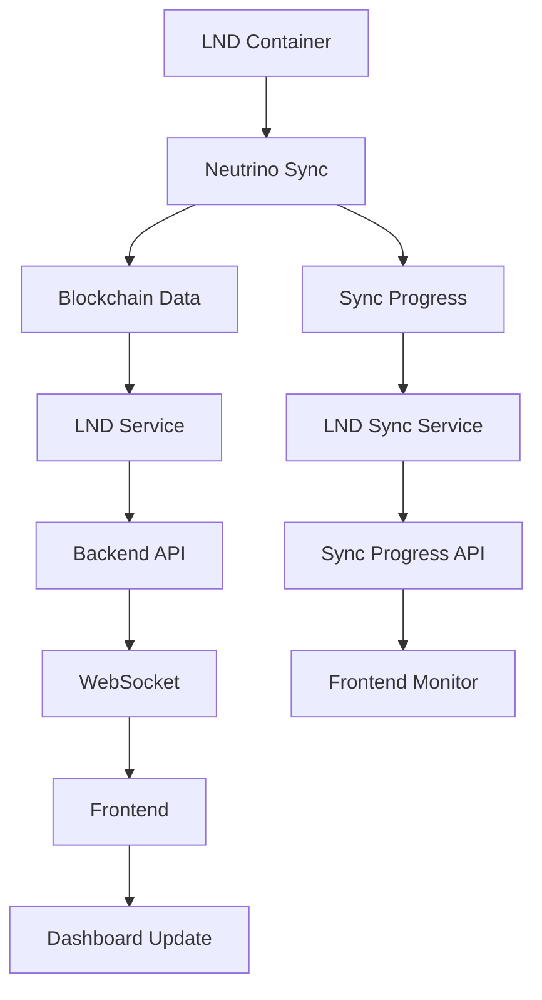
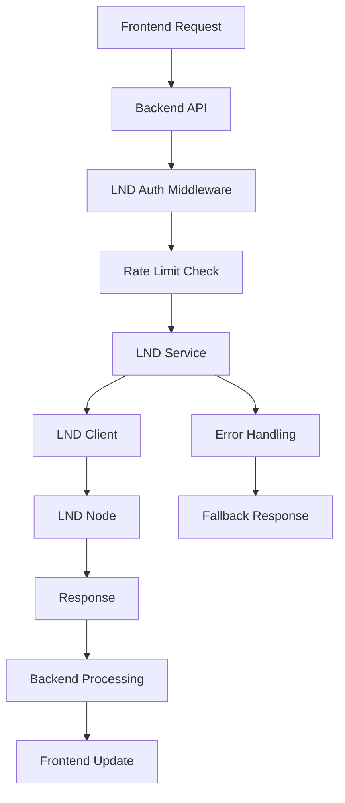
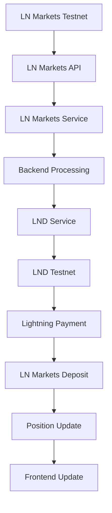

# LND Architecture Overview

**Data de Atualização**: 2025-10-11  
**Versão**: 1.0.0

## 📋 Visão Geral

Esta documentação apresenta a arquitetura completa da integração LND no sistema Axisor, incluindo componentes, fluxos de dados, e padrões arquiteturais utilizados.

## 🏗️ Arquitetura Geral

### Diagrama de Alto Nível

```
┌─────────────────────────────────────────────────────────────────┐
│                        AXISOR SYSTEM                           │
├─────────────────────────────────────────────────────────────────┤
│  Frontend (React)                                              │
│  ├── Dashboard                                                 │
│  ├── Positions                                                 │
│  ├── Wallet                                                    │
│  └── LND Monitor                                               │
├─────────────────────────────────────────────────────────────────┤
│  Backend (Fastify)                                             │
│  ├── API Routes                                                │
│  ├── Services                                                  │
│  ├── Middleware                                                │
│  └── WebSocket                                                 │
├─────────────────────────────────────────────────────────────────┤
│  LND Integration                                               │
│  ├── LND Service                                               │
│  ├── LND Client                                                │
│  ├── Rate Limiting                                             │
│  └── Authentication                                            │
├─────────────────────────────────────────────────────────────────┤
│  External Services                                             │
│  ├── LND Testnet                                               │
│  ├── LND Production                                            │
│  ├── LN Markets Testnet                                        │
│  └── LN Markets Production                                     │
└─────────────────────────────────────────────────────────────────┘
```

## 🔧 Componentes Principais

### 1. **Frontend Layer**

```typescript
// Estrutura de componentes frontend
src/
├── components/
│   ├── lnd/
│   │   ├── LNDMonitor.tsx          // Monitor de sincronização
│   │   ├── WalletBalance.tsx       // Saldo da carteira
│   │   ├── ChannelList.tsx         // Lista de canais
│   │   └── InvoiceManager.tsx      // Gerenciador de invoices
│   ├── dashboard/
│   │   ├── DashboardCards.tsx      // Cards do dashboard
│   │   └── RealtimeData.tsx        // Dados em tempo real
│   └── positions/
│       ├── PositionList.tsx        // Lista de posições
│       └── PositionCard.tsx        // Card de posição
├── hooks/
│   ├── useLND.ts                   // Hook principal LND
│   ├── useWalletBalance.ts         // Hook de saldo
│   ├── useChannels.ts              // Hook de canais
│   └── useInvoices.ts              // Hook de invoices
├── contexts/
│   ├── LNDContext.tsx              // Contexto LND
│   └── WalletContext.tsx           // Contexto de carteira
└── services/
    ├── lnd-api.ts                  // Cliente API LND
    └── websocket-client.ts         // Cliente WebSocket
```

### 2. **Backend Layer**

```typescript
// Estrutura de serviços backend
src/
├── routes/
│   ├── lnd.routes.ts               // Rotas principais LND
│   ├── lnd-sync.routes.ts          // Rotas de sincronização
│   └── testnet-faucet.routes.ts    // Rotas de faucet
├── services/
│   ├── lnd/
│   │   ├── LNDService.ts           // Serviço principal LND
│   │   ├── LNDClient.ts            // Cliente LND
│   │   ├── LNDAuthService.ts       // Autenticação LND
│   │   └── LNDRateLimitService.ts  // Rate limiting
│   ├── testnet-faucet.service.ts   // Serviço de faucet
│   └── dashboard-data.service.ts   // Serviço de dashboard
├── middleware/
│   ├── lnd-auth.middleware.ts      // Middleware de autenticação
│   └── lnd-rate-limit.middleware.ts // Middleware de rate limiting
└── config/
    ├── lnd.config.ts               // Configuração LND
    └── rate-limits.config.ts       // Configuração de rate limits
```

### 3. **LND Integration Layer**

```typescript
// Estrutura de integração LND
src/services/lnd/
├── LNDService.ts                   // Serviço principal
├── LNDClient.ts                    // Cliente HTTP/gRPC
├── LNDAuthService.ts               // Autenticação
├── LNDRateLimitService.ts          // Rate limiting
├── LNDSyncService.ts               // Sincronização
├── LNDWalletService.ts             // Operações de wallet
├── LNDChannelService.ts            // Operações de canal
├── LNDInvoiceService.ts            // Operações de invoice
├── LNDPaymentService.ts            // Operações de pagamento
└── types/
    ├── lnd.types.ts                // Tipos LND
    ├── auth.types.ts               // Tipos de autenticação
    └── rate-limit.types.ts         // Tipos de rate limiting
```

## 🔄 Fluxos de Dados

### 1. **Fluxo de Sincronização**



### 2. **Fluxo de Operações de Wallet**



### 3. **Fluxo de Integração LN Markets**



## 🛡️ Padrões Arquiteturais

### 1. **Service Layer Pattern**

```typescript
// Padrão de camada de serviço
export class LNDService {
  private client: LNDClient;
  private authService: LNDAuthService;
  private rateLimitService: LNDRateLimitService;
  
  constructor(config: LNDConfig, logger: Logger) {
    this.client = new LNDClient(config);
    this.authService = new LNDAuthService(config);
    this.rateLimitService = new LNDRateLimitService(config);
  }
  
  async getInfo(): Promise<LNDInfo> {
    // 1. Verificar autenticação
    await this.authService.validateAuth();
    
    // 2. Verificar rate limiting
    await this.rateLimitService.checkLimit('getInfo');
    
    // 3. Fazer requisição
    return await this.client.getInfo();
  }
}
```

### 2. **Factory Pattern**

```typescript
// Padrão factory para criação de clientes LND
export class LNDClientFactory {
  static createTestnetClient(config: LNDConfig): LNDClient {
    return new LNDClient({
      ...config,
      network: 'testnet',
      baseURL: config.testnet.baseURL
    });
  }
  
  static createProductionClient(config: LNDConfig): LNDClient {
    return new LNDClient({
      ...config,
      network: 'mainnet',
      baseURL: config.production.baseURL
    });
  }
}
```

### 3. **Observer Pattern**

```typescript
// Padrão observer para eventos LND
export class LNDEventManager {
  private observers: Map<string, LNDObserver[]> = new Map();
  
  subscribe(event: string, observer: LNDObserver): void {
    if (!this.observers.has(event)) {
      this.observers.set(event, []);
    }
    this.observers.get(event)!.push(observer);
  }
  
  notify(event: string, data: any): void {
    const eventObservers = this.observers.get(event);
    if (eventObservers) {
      eventObservers.forEach(observer => observer.update(data));
    }
  }
}
```

### 4. **Circuit Breaker Pattern**

```typescript
// Padrão circuit breaker para resiliência
export class LNDCircuitBreaker {
  private state: 'CLOSED' | 'OPEN' | 'HALF_OPEN' = 'CLOSED';
  private failureCount = 0;
  private lastFailureTime = 0;
  
  async execute<T>(operation: () => Promise<T>): Promise<T> {
    if (this.state === 'OPEN') {
      if (Date.now() - this.lastFailureTime > this.timeout) {
        this.state = 'HALF_OPEN';
      } else {
        throw new Error('Circuit breaker is OPEN');
      }
    }
    
    try {
      const result = await operation();
      this.onSuccess();
      return result;
    } catch (error) {
      this.onFailure();
      throw error;
    }
  }
}
```

## 🔐 Segurança

### 1. **Autenticação Multi-Camada**

```typescript
// Sistema de autenticação em camadas
export class LNDSecurityLayer {
  // Camada 1: TLS Certificate
  private tlsAuth: TLSAuthService;
  
  // Camada 2: Macaroon Authentication
  private macaroonAuth: MacaroonAuthService;
  
  // Camada 3: Rate Limiting
  private rateLimit: RateLimitService;
  
  // Camada 4: IP Whitelisting
  private ipWhitelist: IPWhitelistService;
  
  async authenticate(request: AuthenticatedRequest): Promise<boolean> {
    // Verificar TLS
    if (!await this.tlsAuth.validate(request)) {
      return false;
    }
    
    // Verificar Macaroon
    if (!await this.macaroonAuth.validate(request)) {
      return false;
    }
    
    // Verificar Rate Limit
    if (!await this.rateLimit.check(request)) {
      return false;
    }
    
    // Verificar IP
    if (!await this.ipWhitelist.check(request.ip)) {
      return false;
    }
    
    return true;
  }
}
```

### 2. **Criptografia de Dados**

```typescript
// Criptografia de dados sensíveis
export class LNDDataEncryption {
  private encryptionKey: string;
  
  encryptSensitiveData(data: any): string {
    const cipher = crypto.createCipher('aes-256-cbc', this.encryptionKey);
    let encrypted = cipher.update(JSON.stringify(data), 'utf8', 'hex');
    encrypted += cipher.final('hex');
    return encrypted;
  }
  
  decryptSensitiveData(encryptedData: string): any {
    const decipher = crypto.createDecipher('aes-256-cbc', this.encryptionKey);
    let decrypted = decipher.update(encryptedData, 'hex', 'utf8');
    decrypted += decipher.final('utf8');
    return JSON.parse(decrypted);
  }
}
```

## 📊 Monitoramento e Observabilidade

### 1. **Métricas de Sistema**

```typescript
// Coleta de métricas do sistema
export class LNDMetricsCollector {
  private metrics: Map<string, number> = new Map();
  
  collectMetrics(): LNDMetrics {
    return {
      // Métricas de conectividade
      connectedPeers: this.getConnectedPeers(),
      activeChannels: this.getActiveChannels(),
      
      // Métricas de performance
      averageResponseTime: this.getAverageResponseTime(),
      requestSuccessRate: this.getRequestSuccessRate(),
      
      // Métricas de recursos
      memoryUsage: this.getMemoryUsage(),
      cpuUsage: this.getCPUUsage(),
      
      // Métricas de negócio
      totalInvoices: this.getTotalInvoices(),
      totalPayments: this.getTotalPayments(),
      walletBalance: this.getWalletBalance()
    };
  }
}
```

### 2. **Logging Estruturado**

```typescript
// Sistema de logging estruturado
export class LNDLogger {
  private logger: Logger;
  
  logLNDOperation(operation: string, data: any): void {
    this.logger.info(`🔗 LND ${operation}`, {
      operation,
      timestamp: new Date().toISOString(),
      nodeId: this.getNodeId(),
      network: this.getNetwork(),
      data: this.sanitizeData(data)
    });
  }
  
  logLNDError(error: Error, context: any): void {
    this.logger.error(`❌ LND Error`, {
      error: error.message,
      stack: error.stack,
      context,
      timestamp: new Date().toISOString()
    });
  }
}
```

## 🔄 Padrões de Comunicação

### 1. **WebSocket para Tempo Real**

```typescript
// Comunicação WebSocket em tempo real
export class LNDWebSocketService {
  private ws: WebSocket;
  private eventManager: LNDEventManager;
  
  connect(): void {
    this.ws = new WebSocket(this.getWebSocketURL());
    
    this.ws.on('message', (data) => {
      const event = JSON.parse(data);
      this.eventManager.notify(event.type, event.data);
    });
  }
  
  sendEvent(event: LNDEvent): void {
    this.ws.send(JSON.stringify(event));
  }
}
```

### 2. **API REST para Operações**

```typescript
// API REST para operações LND
export class LNDAPIService {
  private client: LNDClient;
  
  async getInfo(): Promise<LNDInfo> {
    return await this.client.get('/v1/getinfo');
  }
  
  async createInvoice(invoice: CreateInvoiceRequest): Promise<Invoice> {
    return await this.client.post('/v1/invoices', invoice);
  }
  
  async getChannels(): Promise<Channel[]> {
    return await this.client.get('/v1/channels');
  }
}
```

## 🧪 Testes

### 1. **Testes Unitários**

```typescript
// Testes unitários para serviços LND
describe('LNDService', () => {
  let lndService: LNDService;
  let mockClient: jest.Mocked<LNDClient>;
  
  beforeEach(() => {
    mockClient = createMockLNDClient();
    lndService = new LNDService(mockClient);
  });
  
  it('should get info successfully', async () => {
    mockClient.getInfo.mockResolvedValue(mockLNDInfo);
    
    const result = await lndService.getInfo();
    
    expect(result).toEqual(mockLNDInfo);
    expect(mockClient.getInfo).toHaveBeenCalledTimes(1);
  });
});
```

### 2. **Testes de Integração**

```typescript
// Testes de integração com LND real
describe('LND Integration Tests', () => {
  let lndService: LNDService;
  
  beforeAll(async () => {
    lndService = new LNDService(realLNDConfig);
    await lndService.initialize();
  });
  
  it('should create and pay invoice', async () => {
    const invoice = await lndService.createInvoice({
      amount: 1000,
      memo: 'Test invoice'
    });
    
    expect(invoice.paymentRequest).toBeDefined();
    
    const payment = await lndService.payInvoice(invoice.paymentRequest);
    
    expect(payment.status).toBe('SUCCEEDED');
  });
});
```

## 📋 Checklist de Arquitetura

### ✅ Design Patterns
- [ ] Service Layer Pattern implementado
- [ ] Factory Pattern para clientes LND
- [ ] Observer Pattern para eventos
- [ ] Circuit Breaker Pattern para resiliência

### ✅ Segurança
- [ ] Autenticação multi-camada
- [ ] Criptografia de dados sensíveis
- [ ] Rate limiting implementado
- [ ] IP whitelisting configurado

### ✅ Monitoramento
- [ ] Métricas de sistema coletadas
- [ ] Logging estruturado implementado
- [ ] Alertas configurados
- [ ] Dashboard de monitoramento

### ✅ Testes
- [ ] Testes unitários implementados
- [ ] Testes de integração funcionando
- [ ] Testes de carga realizados
- [ ] Cobertura de testes adequada

## 🔗 Referências

- **LND Architecture**: https://docs.lightning.engineering/lightning-network-tools/lnd
- **Lightning Network**: https://lightning.network/
- **Design Patterns**: https://refactoring.guru/design-patterns
- **Microservices Patterns**: https://microservices.io/
