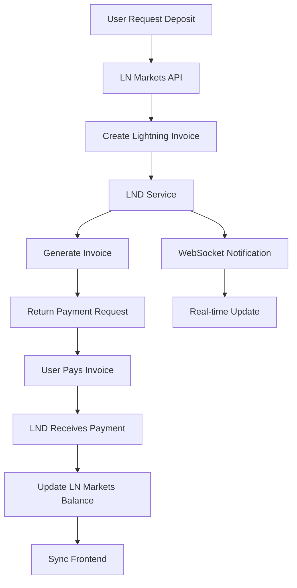
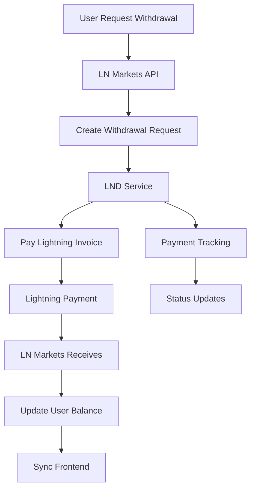
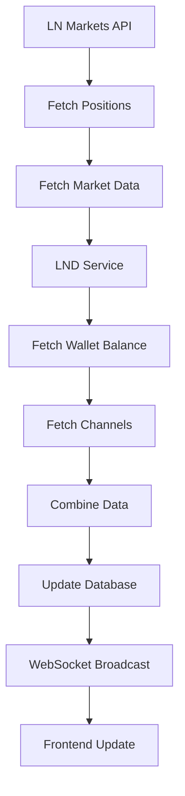

# LND ↔ LN Markets Integration

**Data de Atualização**: 2025-10-11  
**Versão**: 1.0.0

## 📋 Visão Geral

Esta documentação cobre a integração completa entre LND (Lightning Network Daemon) e LN Markets, incluindo fluxos de pagamento, depósitos, saques, e sincronização de dados.

## 🔗 Arquitetura de Integração

### Diagrama de Fluxo

```
┌─────────────────┐    ┌─────────────────┐    ┌─────────────────┐
│   Frontend      │    │    Backend      │    │   LND Node      │
│                 │    │                 │    │                 │
│ ┌─────────────┐ │    │ ┌─────────────┐ │    │ ┌─────────────┐ │
│ │ Dashboard   │ │◄───┤ │ LND Service │ │◄───┤ │ Lightning   │ │
│ │ Positions   │ │    │ │ LN Markets  │ │    │ │ Network     │ │
│ │ Wallet      │ │    │ │ Service     │ │    │ │             │ │
│ └─────────────┘ │    │ └─────────────┘ │    │ └─────────────┘ │
└─────────────────┘    └─────────────────┘    └─────────────────┘
         │                       │                       │
         │                       │                       │
         ▼                       ▼                       ▼
┌─────────────────┐    ┌─────────────────┐    ┌─────────────────┐
│   WebSocket     │    │   Database      │    │   LN Markets    │
│   Real-time     │    │   State Sync    │    │   API           │
│   Updates       │    │                 │    │                 │
└─────────────────┘    └─────────────────┘    └─────────────────┘
```

## 🔄 Fluxos de Integração

### 1. **Fluxo de Depósito LN Markets → LND**



### 2. **Fluxo de Saque LND → LN Markets**



### 3. **Fluxo de Sincronização de Dados**



## 🔧 Implementação

### 1. **Serviço de Integração LN Markets**

```typescript
// backend/src/services/lnmarkets-integration.service.ts
export class LNMarketsIntegrationService {
  private lndService: LNDService;
  private lnMarketsService: LNMarketsAPIv2;
  private eventManager: EventManager;
  
  constructor(
    lndService: LNDService,
    lnMarketsService: LNMarketsAPIv2,
    eventManager: EventManager
  ) {
    this.lndService = lndService;
    this.lnMarketsService = lnMarketsService;
    this.eventManager = eventManager;
  }
  
  /**
   * Criar depósito Lightning para LN Markets
   */
  async createLightningDeposit(
    userId: string,
    amount: number,
    memo?: string
  ): Promise<LightningDepositResult> {
    try {
      // 1. Criar invoice no LND
      const invoice = await this.lndService.createInvoice({
        amount,
        memo: memo || `LN Markets deposit for user ${userId}`
      });
      
      // 2. Registrar depósito no LN Markets
      const deposit = await this.lnMarketsService.createDeposit({
        type: 'lightning',
        amount,
        invoice: invoice.payment_request,
        memo
      });
      
      // 3. Monitorar pagamento
      this.monitorPayment(invoice.payment_hash, deposit.id);
      
      return {
        invoice: invoice.payment_request,
        depositId: deposit.id,
        amount,
        status: 'pending'
      };
      
    } catch (error) {
      this.logger.error('❌ Failed to create lightning deposit:', error);
      throw error;
    }
  }
  
  /**
   * Processar saque Lightning para LN Markets
   */
  async processLightningWithdrawal(
    userId: string,
    amount: number,
    lightningAddress: string
  ): Promise<LightningWithdrawalResult> {
    try {
      // 1. Verificar saldo disponível
      const balance = await this.lndService.getWalletBalance();
      if (balance.total_balance < amount) {
        throw new Error('Insufficient LND balance');
      }
      
      // 2. Criar saque no LN Markets
      const withdrawal = await this.lnMarketsService.createWithdrawal({
        type: 'lightning',
        amount,
        address: lightningAddress
      });
      
      // 3. Processar pagamento Lightning
      const payment = await this.lndService.payInvoice(withdrawal.invoice);
      
      // 4. Atualizar status do saque
      await this.lnMarketsService.updateWithdrawalStatus(
        withdrawal.id,
        payment.status
      );
      
      return {
        withdrawalId: withdrawal.id,
        amount,
        status: payment.status,
        paymentHash: payment.payment_hash
      };
      
    } catch (error) {
      this.logger.error('❌ Failed to process lightning withdrawal:', error);
      throw error;
    }
  }
  
  /**
   * Sincronizar dados entre LND e LN Markets
   */
  async syncData(userId: string): Promise<SyncResult> {
    try {
      // 1. Buscar dados do LN Markets
      const lnMarketsData = await this.lnMarketsService.getUserData();
      
      // 2. Buscar dados do LND
      const lndData = await this.lndService.getInfo();
      const walletBalance = await this.lndService.getWalletBalance();
      const channels = await this.lndService.getChannels();
      
      // 3. Combinar dados
      const combinedData = {
        lnMarkets: {
          balance: lnMarketsData.balance,
          positions: lnMarketsData.positions,
          syntheticUsdBalance: lnMarketsData.synthetic_usd_balance
        },
        lnd: {
          balance: walletBalance.total_balance,
          channels: channels.channels,
          nodeInfo: lndData
        }
      };
      
      // 4. Atualizar banco de dados
      await this.updateUserData(userId, combinedData);
      
      // 5. Notificar frontend
      this.eventManager.emit('data_synced', {
        userId,
        data: combinedData
      });
      
      return {
        success: true,
        data: combinedData,
        timestamp: new Date().toISOString()
      };
      
    } catch (error) {
      this.logger.error('❌ Failed to sync data:', error);
      throw error;
    }
  }
  
  /**
   * Monitorar pagamento Lightning
   */
  private async monitorPayment(
    paymentHash: string,
    depositId: string
  ): Promise<void> {
    const maxAttempts = 30; // 5 minutos
    let attempts = 0;
    
    while (attempts < maxAttempts) {
      try {
        const payment = await this.lndService.getPayment(paymentHash);
        
        if (payment.status === 'SUCCEEDED') {
          // Pagamento confirmado
          await this.lnMarketsService.updateDepositStatus(
            depositId,
            'completed',
            payment.preimage
          );
          
          // Notificar frontend
          this.eventManager.emit('deposit_completed', {
            depositId,
            amount: payment.value,
            paymentHash
          });
          
          break;
        } else if (payment.status === 'FAILED') {
          // Pagamento falhou
          await this.lnMarketsService.updateDepositStatus(
            depositId,
            'failed',
            null
          );
          
          this.eventManager.emit('deposit_failed', {
            depositId,
            error: payment.payment_error
          });
          
          break;
        }
        
        // Aguardar antes da próxima verificação
        await new Promise(resolve => setTimeout(resolve, 10000));
        attempts++;
        
      } catch (error) {
        this.logger.error('❌ Error monitoring payment:', error);
        attempts++;
      }
    }
  }
}
```

### 2. **Hook Frontend para Integração**

```typescript
// frontend/src/hooks/useLNMarketsIntegration.ts
export function useLNMarketsIntegration() {
  const [loading, setLoading] = useState(false);
  const [data, setData] = useState<CombinedData | null>(null);
  const { user } = useAuthStore();
  
  const syncData = async () => {
    setLoading(true);
    try {
      const response = await fetch('/api/lnmarkets-integration/sync', {
        method: 'POST',
        headers: { 'Content-Type': 'application/json' },
        body: JSON.stringify({ userId: user.id })
      });
      
      const result = await response.json();
      if (result.success) {
        setData(result.data);
      }
    } catch (error) {
      console.error('Failed to sync data:', error);
    } finally {
      setLoading(false);
    }
  };
  
  const createDeposit = async (amount: number, memo?: string) => {
    setLoading(true);
    try {
      const response = await fetch('/api/lnmarkets-integration/deposit', {
        method: 'POST',
        headers: { 'Content-Type': 'application/json' },
        body: JSON.stringify({ amount, memo })
      });
      
      const result = await response.json();
      if (result.success) {
        return result.data;
      }
    } catch (error) {
      console.error('Failed to create deposit:', error);
    } finally {
      setLoading(false);
    }
  };
  
  const createWithdrawal = async (amount: number, lightningAddress: string) => {
    setLoading(true);
    try {
      const response = await fetch('/api/lnmarkets-integration/withdrawal', {
        method: 'POST',
        headers: { 'Content-Type': 'application/json' },
        body: JSON.stringify({ amount, lightningAddress })
      });
      
      const result = await response.json();
      if (result.success) {
        return result.data;
      }
    } catch (error) {
      console.error('Failed to create withdrawal:', error);
    } finally {
      setLoading(false);
    }
  };
  
  return {
    data,
    loading,
    syncData,
    createDeposit,
    createWithdrawal
  };
}
```

### 3. **Rotas de Integração**

```typescript
// backend/src/routes/lnmarkets-integration.routes.ts
export async function lnmarketsIntegrationRoutes(fastify: FastifyInstance) {
  const integrationService = new LNMarketsIntegrationService(
    fastify.lndService,
    fastify.lnMarketsService,
    fastify.eventManager
  );
  
  /**
   * POST /api/lnmarkets-integration/sync
   * Sincronizar dados entre LND e LN Markets
   */
  fastify.post('/sync', async (request, reply) => {
    try {
      const { userId } = request.body as { userId: string };
      
      const result = await integrationService.syncData(userId);
      
      return reply.status(200).send({
        success: true,
        data: result
      });
    } catch (error: any) {
      return reply.status(500).send({
        success: false,
        error: error.message
      });
    }
  });
  
  /**
   * POST /api/lnmarkets-integration/deposit
   * Criar depósito Lightning
   */
  fastify.post('/deposit', async (request, reply) => {
    try {
      const { amount, memo } = request.body as {
        amount: number;
        memo?: string;
      };
      
      const result = await integrationService.createLightningDeposit(
        request.user.id,
        amount,
        memo
      );
      
      return reply.status(200).send({
        success: true,
        data: result
      });
    } catch (error: any) {
      return reply.status(500).send({
        success: false,
        error: error.message
      });
    }
  });
  
  /**
   * POST /api/lnmarkets-integration/withdrawal
   * Processar saque Lightning
   */
  fastify.post('/withdrawal', async (request, reply) => {
    try {
      const { amount, lightningAddress } = request.body as {
        amount: number;
        lightningAddress: string;
      };
      
      const result = await integrationService.processLightningWithdrawal(
        request.user.id,
        amount,
        lightningAddress
      );
      
      return reply.status(200).send({
        success: true,
        data: result
      });
    } catch (error: any) {
      return reply.status(500).send({
        success: false,
        error: error.message
      });
    }
  });
  
  /**
   * GET /api/lnmarkets-integration/status
   * Obter status da integração
   */
  fastify.get('/status', async (request, reply) => {
    try {
      const lndStatus = await fastify.lndService.getInfo();
      const lnMarketsStatus = await fastify.lnMarketsService.getUser();
      
      return reply.status(200).send({
        success: true,
        data: {
          lnd: {
            connected: !!lndStatus.identity_pubkey,
            synced: lndStatus.synced_to_chain,
            network: lndStatus.testnet ? 'testnet' : 'mainnet'
          },
          lnMarkets: {
            connected: !!lnMarketsStatus.uid,
            balance: lnMarketsStatus.balance,
            network: lnMarketsStatus.testnet ? 'testnet' : 'mainnet'
          }
        }
      });
    } catch (error: any) {
      return reply.status(500).send({
        success: false,
        error: error.message
      });
    }
  });
}
```

## 📊 Monitoramento e Métricas

### 1. **Métricas de Integração**

```typescript
export interface IntegrationMetrics {
  // Métricas de depósito
  totalDeposits: number;
  successfulDeposits: number;
  failedDeposits: number;
  averageDepositTime: number;
  
  // Métricas de saque
  totalWithdrawals: number;
  successfulWithdrawals: number;
  failedWithdrawals: number;
  averageWithdrawalTime: number;
  
  // Métricas de sincronização
  syncSuccessRate: number;
  averageSyncTime: number;
  lastSyncTime: Date;
  
  // Métricas de conectividade
  lndUptime: number;
  lnMarketsUptime: number;
  connectionErrors: number;
}
```

### 2. **Dashboard de Integração**

```typescript
// frontend/src/components/IntegrationDashboard.tsx
export function IntegrationDashboard() {
  const { data, loading, syncData } = useLNMarketsIntegration();
  const [metrics, setMetrics] = useState<IntegrationMetrics | null>(null);
  
  useEffect(() => {
    // Buscar métricas de integração
    fetch('/api/lnmarkets-integration/metrics')
      .then(res => res.json())
      .then(result => setMetrics(result.data));
  }, []);
  
  return (
    <div className="integration-dashboard">
      <h2>LND ↔ LN Markets Integration</h2>
      
      {/* Status da Integração */}
      <div className="status-cards">
        <StatusCard
          title="LND Status"
          status={data?.lnd.nodeInfo.synced_to_chain ? 'connected' : 'disconnected'}
          value={`${data?.lnd.balance || 0} sats`}
        />
        <StatusCard
          title="LN Markets Status"
          status={data?.lnMarkets.balance !== undefined ? 'connected' : 'disconnected'}
          value={`${data?.lnMarkets.balance || 0} sats`}
        />
      </div>
      
      {/* Métricas */}
      {metrics && (
        <div className="metrics">
          <MetricCard
            title="Deposits"
            value={metrics.successfulDeposits}
            total={metrics.totalDeposits}
            successRate={metrics.successfulDeposits / metrics.totalDeposits}
          />
          <MetricCard
            title="Withdrawals"
            value={metrics.successfulWithdrawals}
            total={metrics.totalWithdrawals}
            successRate={metrics.successfulWithdrawals / metrics.totalWithdrawals}
          />
          <MetricCard
            title="Sync Rate"
            value={`${(metrics.syncSuccessRate * 100).toFixed(1)}%`}
            lastSync={metrics.lastSyncTime}
          />
        </div>
      )}
      
      {/* Ações */}
      <div className="actions">
        <button onClick={syncData} disabled={loading}>
          {loading ? 'Syncing...' : 'Sync Data'}
        </button>
      </div>
    </div>
  );
}
```

## 🔧 Troubleshooting

### Problemas Comuns

#### 1. **Falha na Sincronização**
```bash
# Verificar status dos serviços
curl -s http://localhost:13010/api/lnmarkets-integration/status | jq .

# Verificar logs de integração
docker compose logs backend | grep "integration"

# Verificar conectividade LND
curl -k https://localhost:18080/v1/getinfo \
  --cert ~/.lnd/tls.cert \
  --key ~/.lnd/tls.key \
  --macaroon ~/.lnd/admin.macaroon
```

#### 2. **Falha em Depósitos**
```bash
# Verificar saldo LND
curl -s http://localhost:13010/api/lnd/wallet/balance | jq .

# Verificar invoices pendentes
curl -s http://localhost:13010/api/lnd/invoices | jq '.data.invoices[] | select(.state == "OPEN")'

# Verificar logs de pagamento
docker compose logs lnd-testnet | grep "invoice"
```

#### 3. **Falha em Saques**
```bash
# Verificar saldo disponível
curl -s http://localhost:13010/api/lnd/wallet/balance | jq .

# Verificar canais ativos
curl -s http://localhost:13010/api/lnd/channels | jq '.data.channels[] | select(.active == true)'

# Verificar logs de pagamento
docker compose logs lnd-testnet | grep "payment"
```

## 📋 Checklist de Integração

### ✅ Configuração
- [ ] LND testnet configurado e funcionando
- [ ] LN Markets testnet configurado e funcionando
- [ ] Serviço de integração implementado
- [ ] Rotas de integração funcionando

### ✅ Funcionalidades
- [ ] Sincronização de dados funcionando
- [ ] Depósitos Lightning funcionando
- [ ] Saques Lightning funcionando
- [ ] Monitoramento de pagamentos funcionando

### ✅ Monitoramento
- [ ] Métricas de integração coletadas
- [ ] Dashboard de integração funcionando
- [ ] Alertas configurados
- [ ] Logs estruturados

### ✅ Testes
- [ ] Testes unitários implementados
- [ ] Testes de integração funcionando
- [ ] Testes de carga realizados
- [ ] Cobertura de testes adequada

## 🔗 Referências

- **LND Documentation**: https://docs.lightning.engineering/lightning-network-tools/lnd
- **LN Markets API**: https://docs.lnmarkets.com/api/
- **Lightning Network**: https://lightning.network/
- **BOLT Specifications**: https://github.com/lightningnetwork/lightning-rfc
