# LN Markets API v2 - Diagrama de Arquitetura

> **Status**: Active  
> **Última Atualização**: 2025-01-09  
> **Versão**: 2.0.0  
> **Responsável**: Sistema LN Markets API v2  

## Índice

- [Visão Geral](#visão-geral)
- [Diagrama de Arquitetura](#diagrama-de-arquitetura)
- [Componentes](#componentes)
- [Fluxo de Dados](#fluxo-de-dados)
- [Integração](#integração)

## Visão Geral

Este documento apresenta os diagramas de arquitetura da integração LN Markets API v2, mostrando a estrutura modular e os fluxos de dados.

## Diagrama de Arquitetura

### Arquitetura Geral

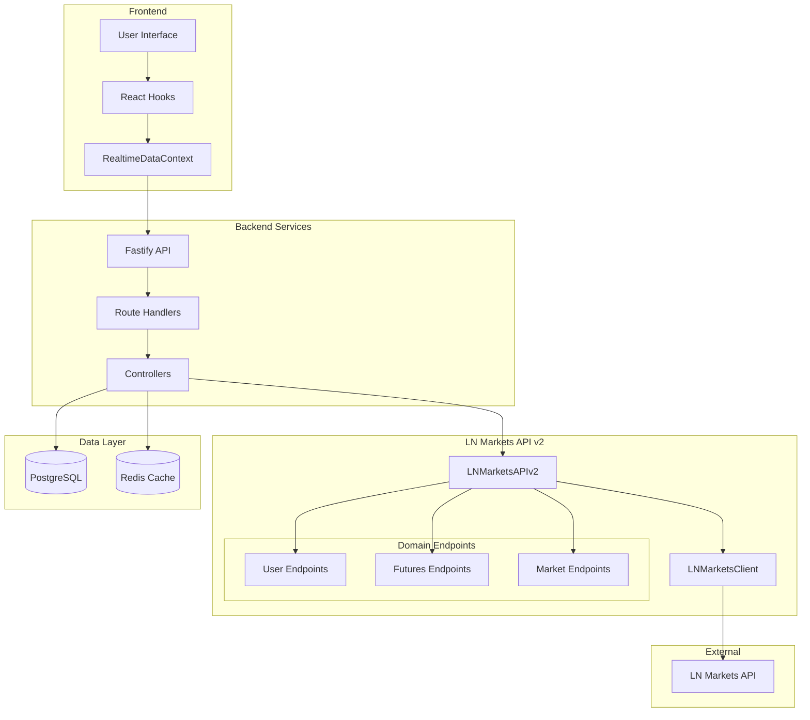

### Arquitetura Detalhada do LNMarketsAPIv2

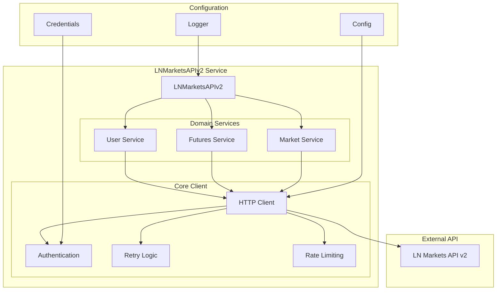

## Componentes

### 1. LNMarketsAPIv2 (Entry Point)

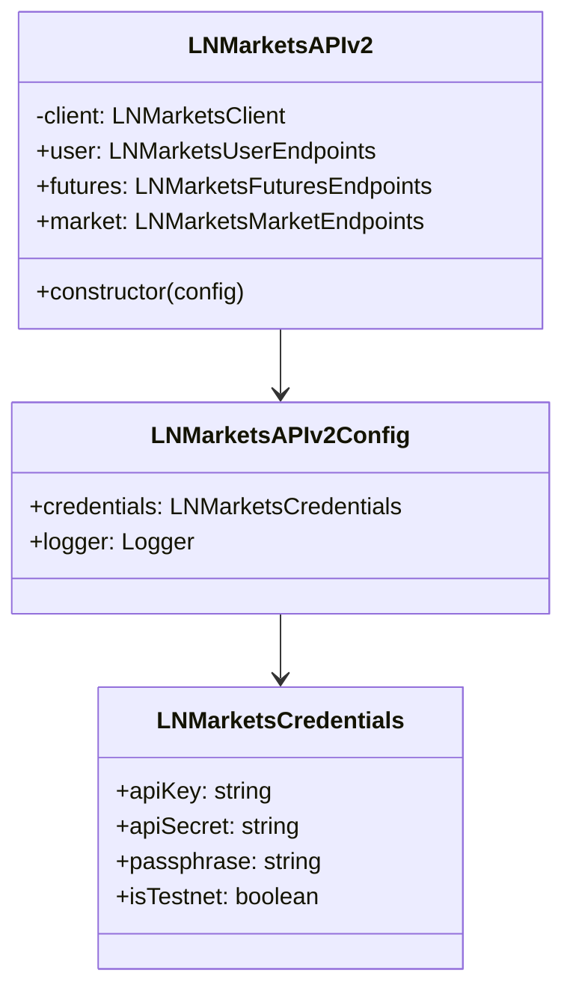

### 2. Domain Endpoints

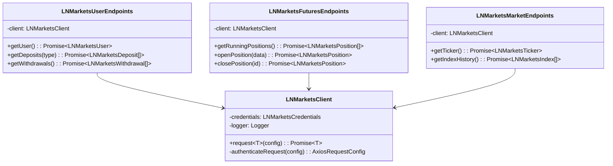

### 3. Data Types

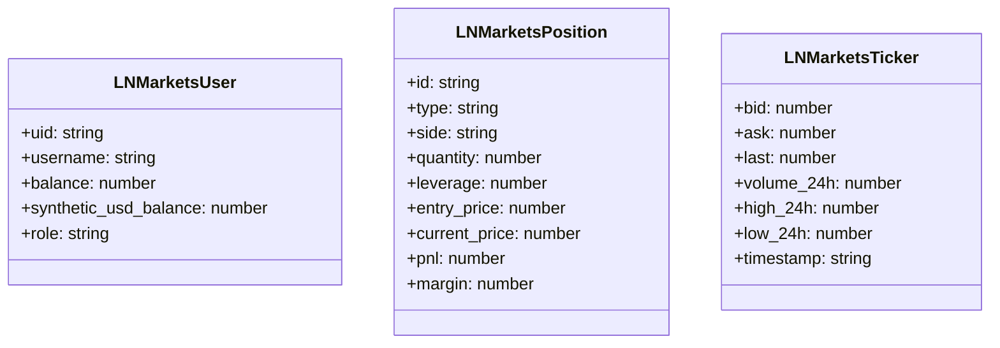

## Fluxo de Dados

### 1. Fluxo de Request

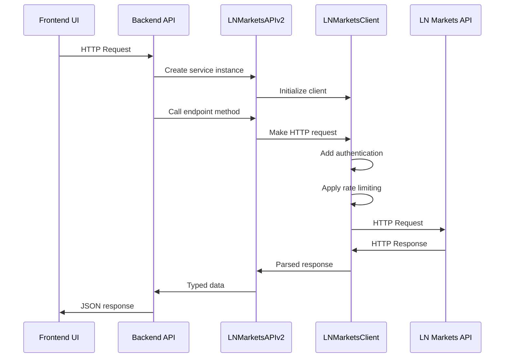

### 2. Fluxo de Autenticação

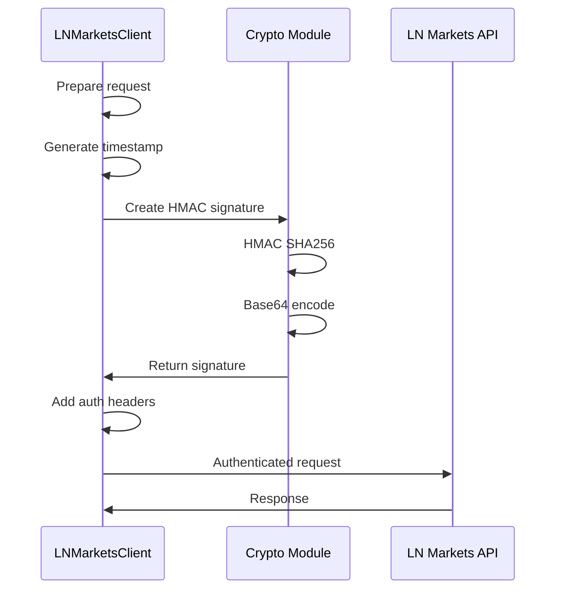

### 3. Fluxo de Error Handling

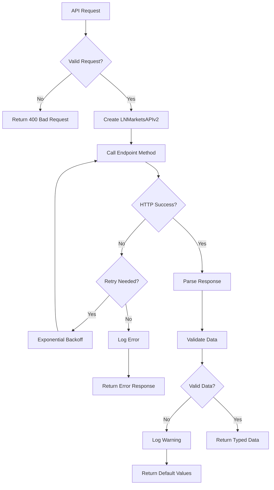

## Integração

### 1. Integração com Dashboard

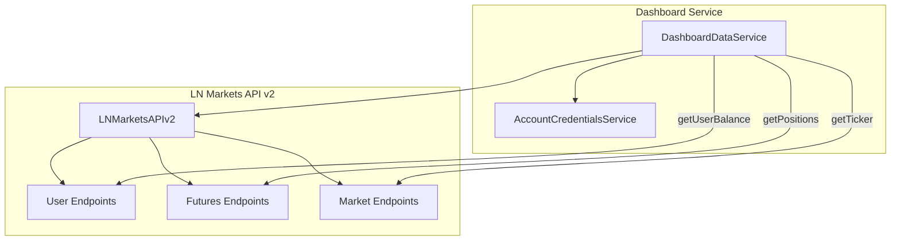

### 2. Integração com Workers

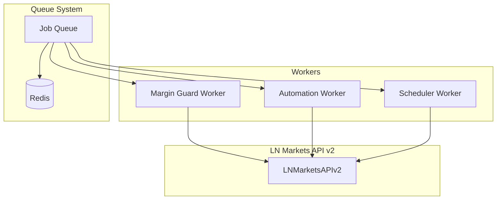

### 3. Integração com Frontend

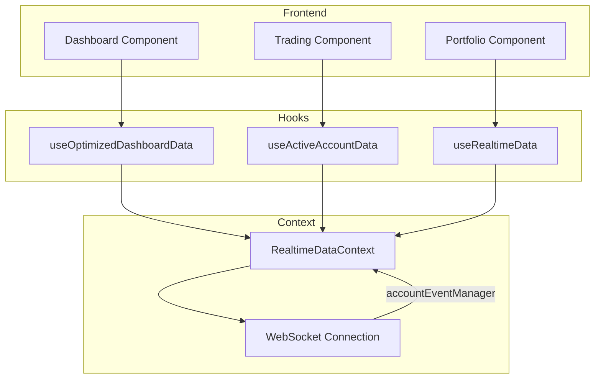

## Referências

- [Arquitetura Interna](../internal-implementation/01-architecture.md)
- [Fluxo de Dados](./02-data-flow.md)
- [Best Practices](../internal-implementation/02-best-practices.md)

---
*Documentação gerada seguindo DOCUMENTATION_STANDARDS.md*
