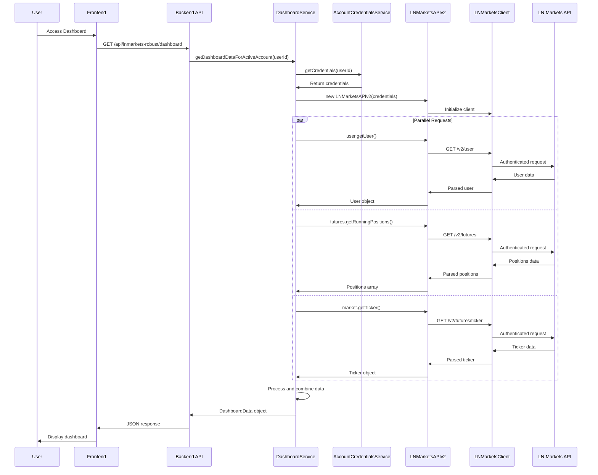
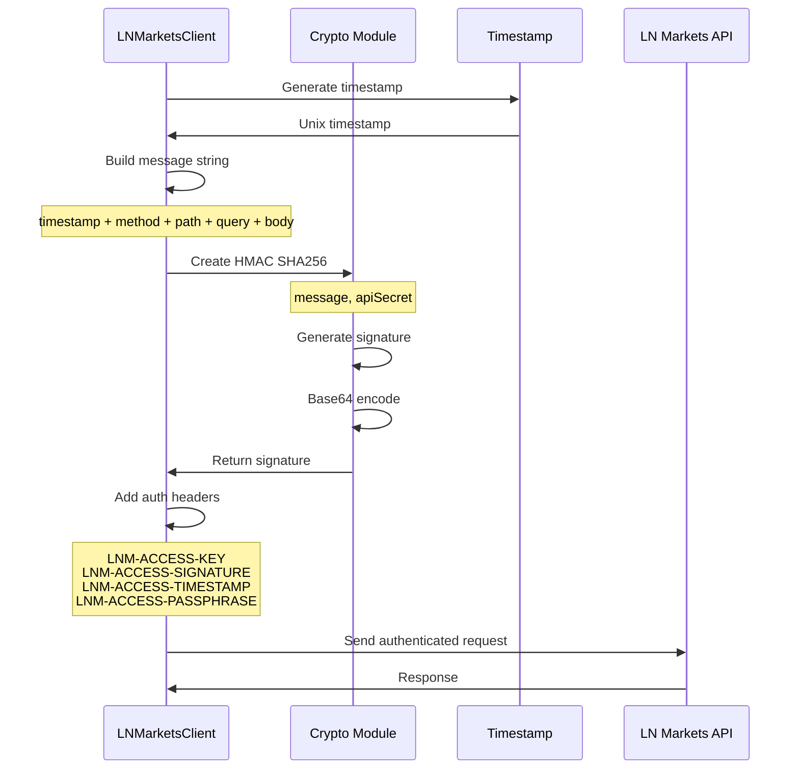
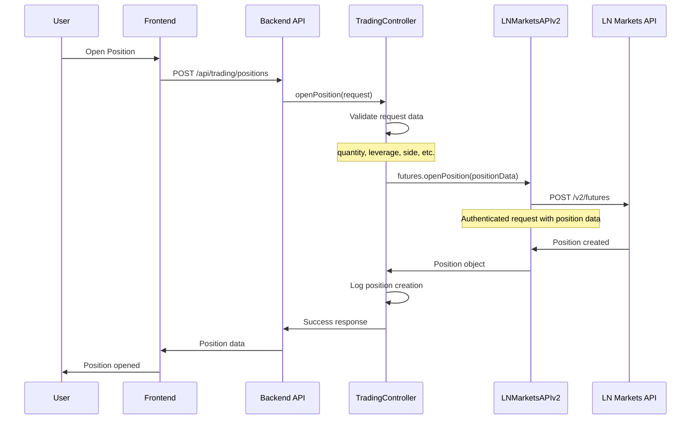
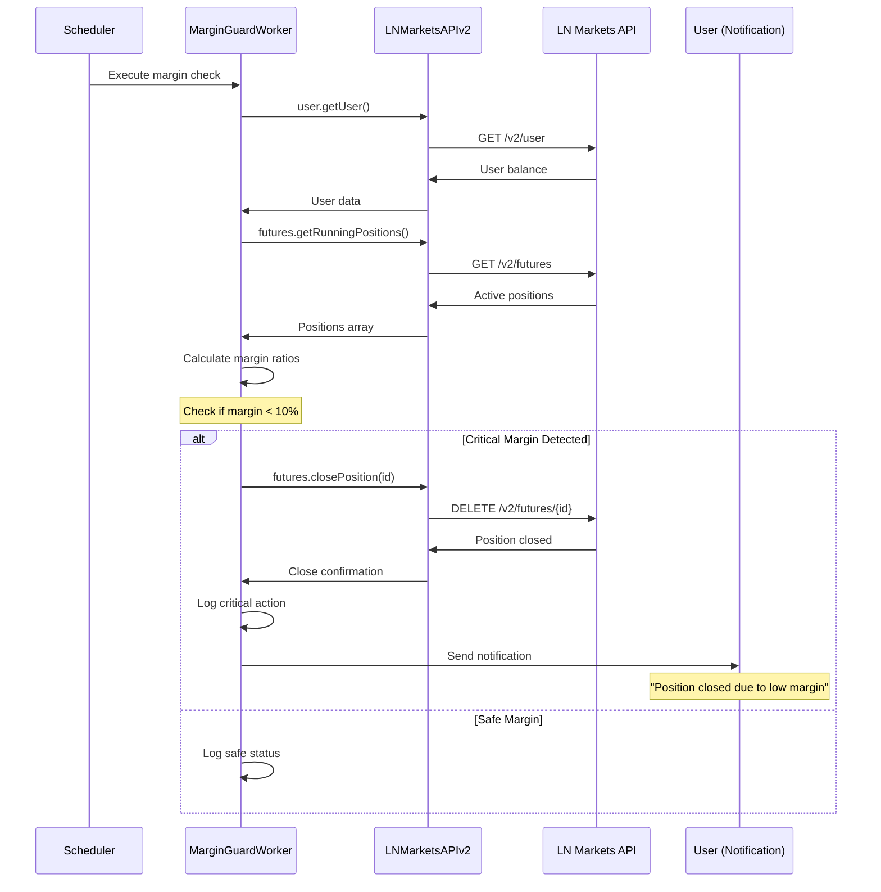
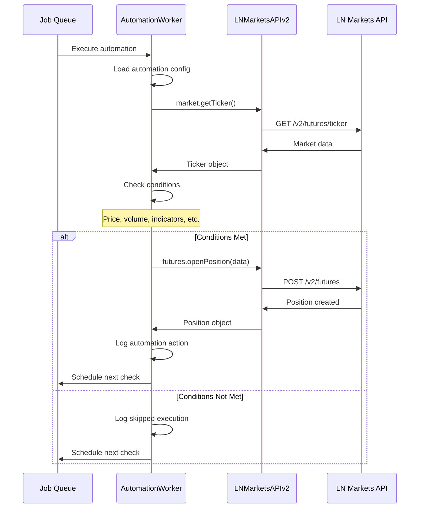
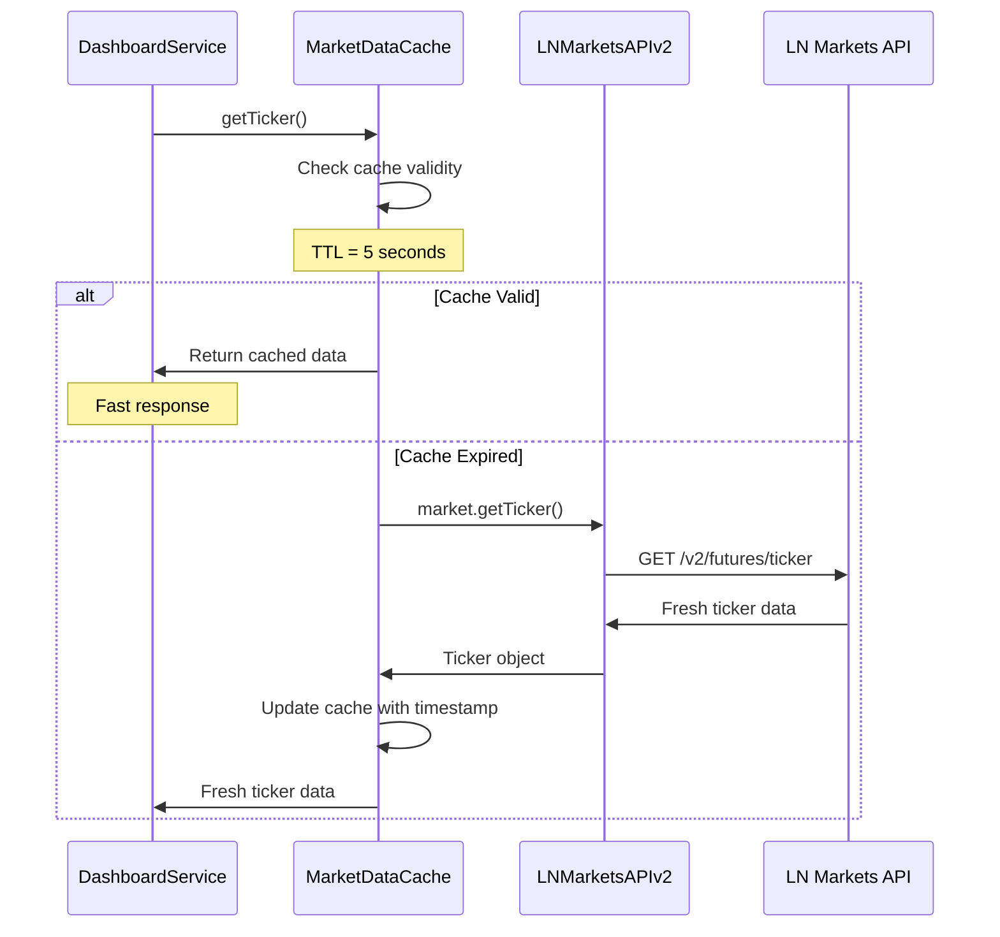
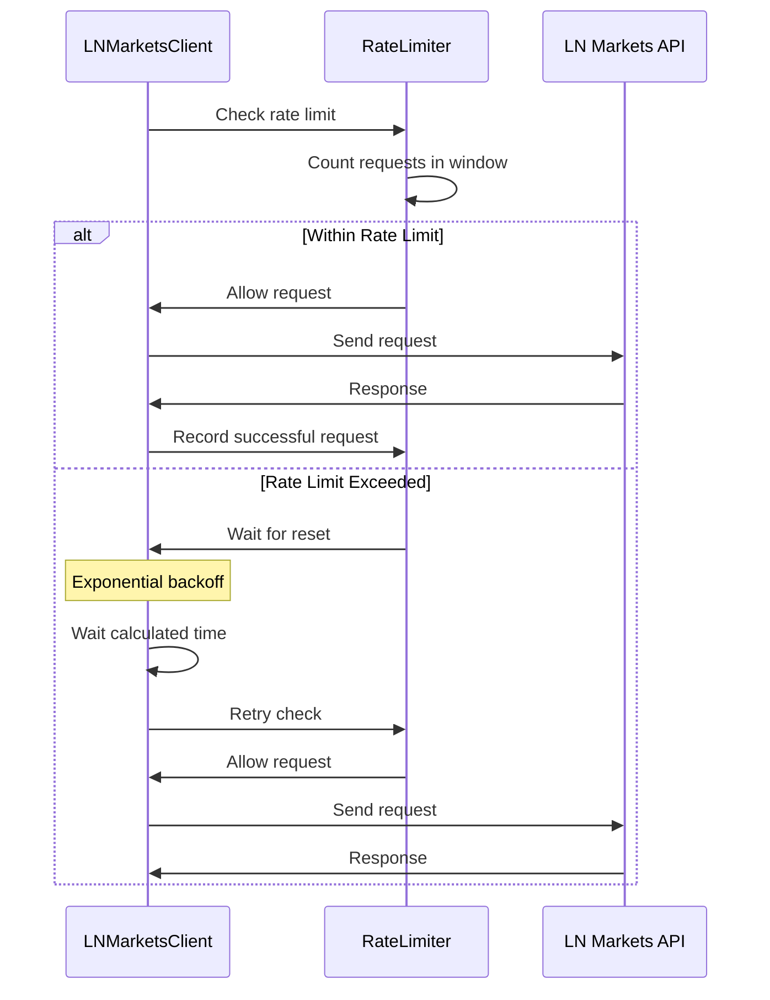
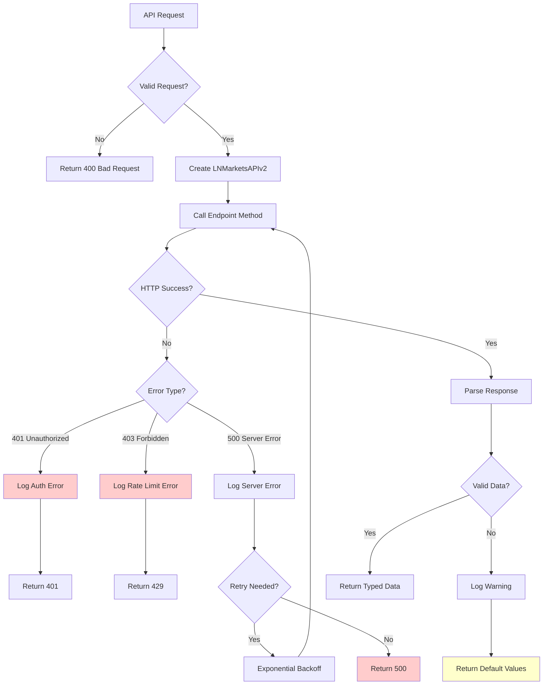
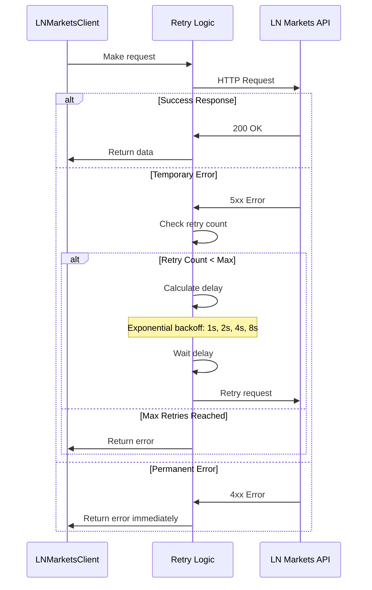
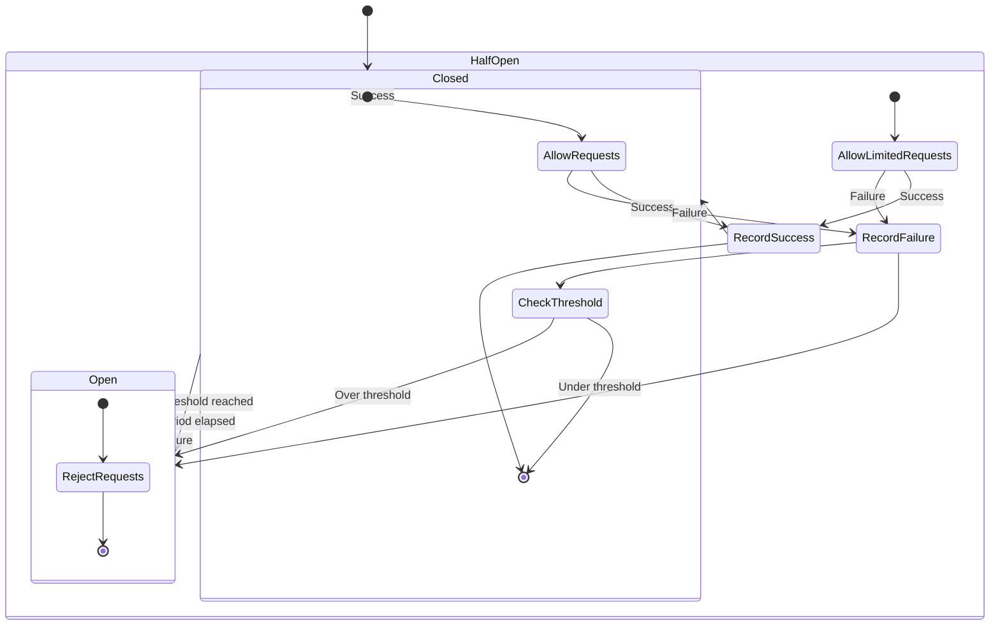

# LN Markets API v2 - Fluxo de Dados

> **Status**: Active  
> **Última Atualização**: 2025-01-09  
> **Versão**: 2.0.0  
> **Responsável**: Sistema LN Markets API v2  

## Índice

- [Visão Geral](#visão-geral)
- [Fluxo de Dados Principal](#fluxo-de-dados-principal)
- [Fluxos Específicos](#fluxos-específicos)
- [Cache e Performance](#cache-e-performance)
- [Error Handling Flow](#error-handling-flow)

## Visão Geral

Este documento detalha os fluxos de dados na integração LN Markets API v2, desde a requisição inicial até a resposta final, incluindo cache, retry logic e error handling.

## Fluxo de Dados Principal

### 1. Fluxo Completo - Dashboard Data

### 2. Fluxo de Autenticação

## Fluxos Específicos

### 1. Fluxo de Trading (Open Position)

### 2. Fluxo de Margin Guard

### 3. Fluxo de Automation

## Cache e Performance

### 1. Fluxo com Cache

### 2. Fluxo de Rate Limiting

## Error Handling Flow

### 1. Fluxo de Error Handling

### 2. Fluxo de Retry Logic

### 3. Fluxo de Circuit Breaker

## Referências

- [Diagrama de Arquitetura](./01-architecture-diagram.md)
- [Arquitetura Interna](../internal-implementation/01-architecture.md)
- [Troubleshooting](../internal-implementation/04-troubleshooting.md)

---
*Documentação gerada seguindo DOCUMENTATION_STANDARDS.md*
