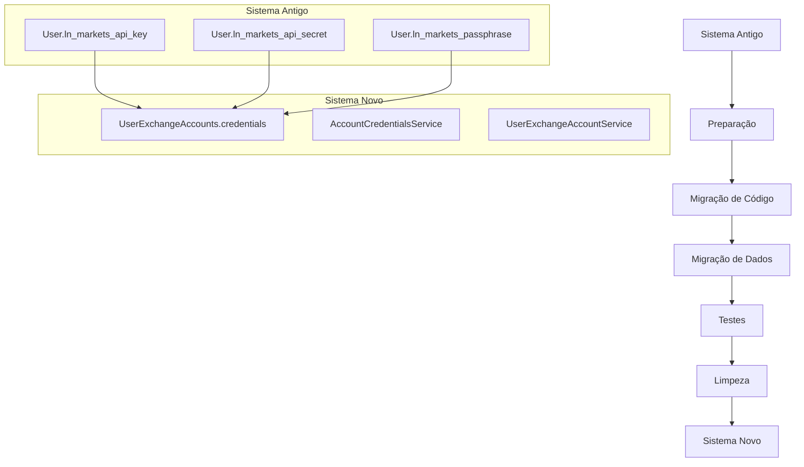
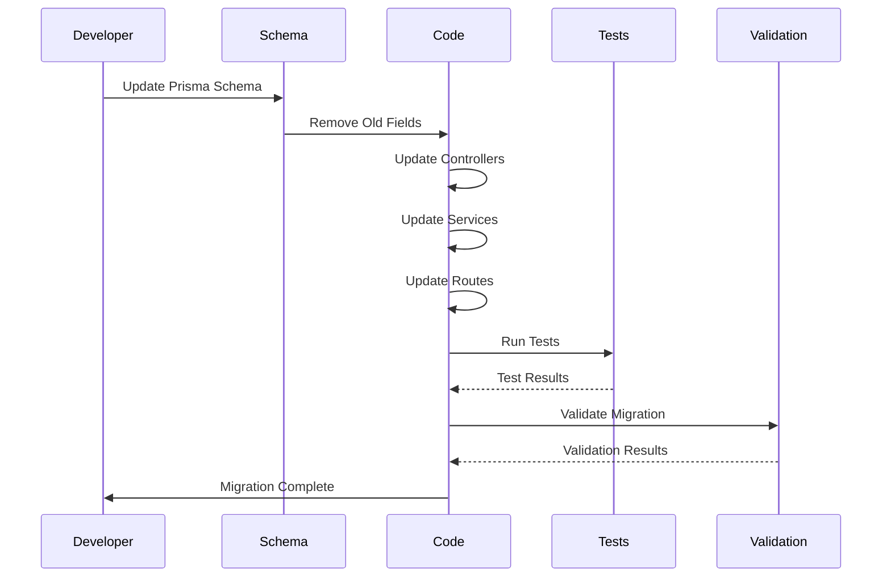
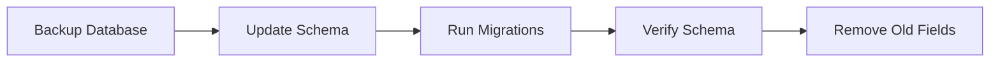
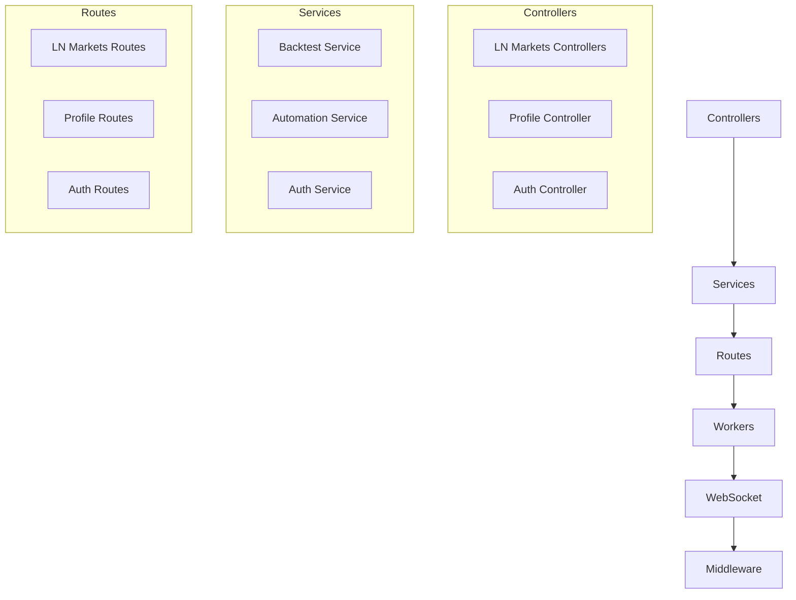
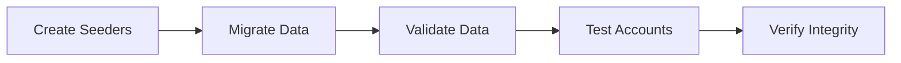
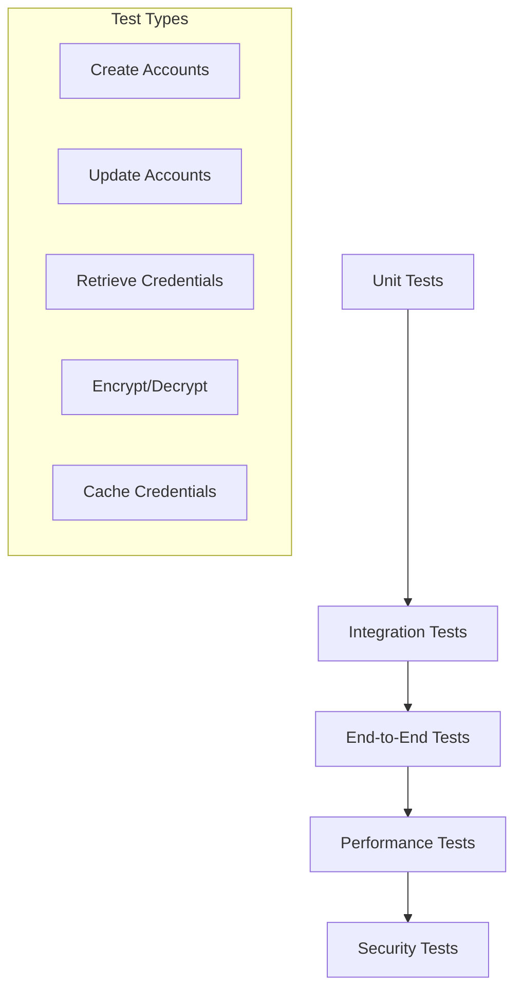
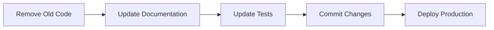
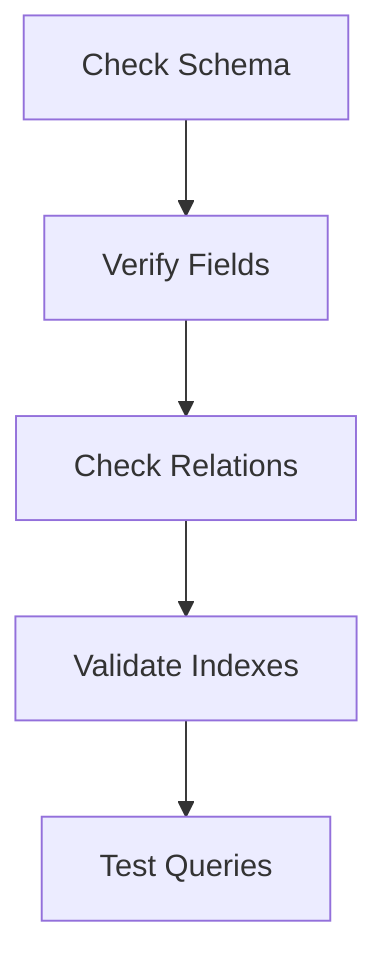
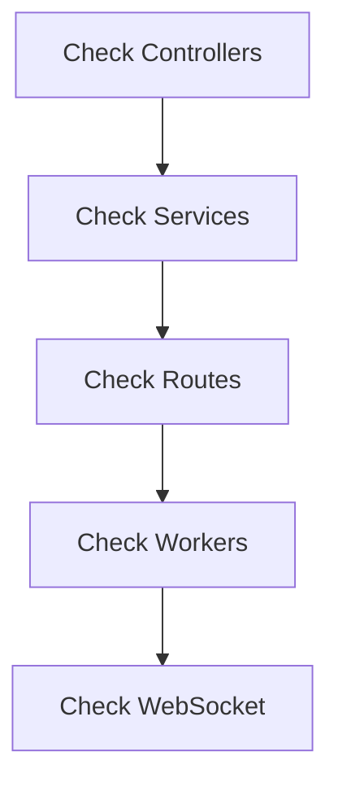
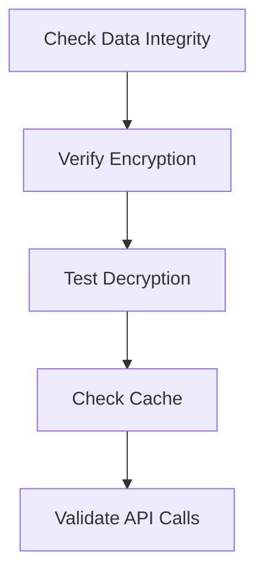

# User Exchange Accounts - Migration Flow

> **Status**: Active  
> **Última Atualização**: 2025-01-14  
> **Versão**: 1.0.0  
> **Responsável**: User Exchange Accounts System  

## Índice

- [Visão Geral](#visão-geral)
- [Fluxo de Migração](#fluxo-de-migração)
- [Fases da Migração](#fases-da-migração)
- [Validação](#validação)
- [Referências](#referências)

## Visão Geral

Este documento detalha o fluxo completo de migração do sistema antigo de credenciais diretas na tabela `User` para o novo sistema de `UserExchangeAccounts`.

## Fluxo de Migração

### 1. Visão Geral da Migração

### 2. Fluxo Detalhado

## Fases da Migração

### Fase 1: Preparação

**Ações:**
1. Backup do banco de dados
2. Atualização do schema Prisma
3. Execução de migrações
4. Verificação da integridade
5. Remoção de campos antigos

### Fase 2: Migração de Código

**Ações:**
1. Migrar todos os controllers LN Markets
2. Migrar todos os services que usam credenciais
3. Migrar todas as rotas que acessam credenciais
4. Migrar workers que usam credenciais
5. Migrar sistema de WebSocket
6. Migrar middlewares de validação

### Fase 3: Migração de Dados

**Ações:**
1. Criar seeders para contas de teste
2. Migrar dados existentes (se necessário)
3. Validar integridade dos dados
4. Testar contas de teste
5. Verificar integridade final

### Fase 4: Testes

**Ações:**
1. Testar criação de contas
2. Testar atualização de contas
3. Testar recuperação de credenciais
4. Testar criptografia/descriptografia
5. Testar cache de credenciais

### Fase 5: Limpeza

**Ações:**
1. Remover campos antigos do schema
2. Remover código antigo
3. Atualizar documentação
4. Atualizar testes
5. Commitar mudanças
6. Deploy em produção

## Validação

### 1. Validação de Schema

**Verificações:**
- Campos antigos removidos
- Novos campos criados
- Relações funcionando
- Índices criados
- Queries funcionando

### 2. Validação de Código

**Verificações:**
- Controllers usando novo sistema
- Services usando AccountCredentialsService
- Rotas atualizadas
- Workers migrados
- WebSocket funcionando

### 3. Validação de Dados

**Verificações:**
- Integridade dos dados
- Criptografia funcionando
- Descriptografia funcionando
- Cache funcionando
- Chamadas de API funcionando

## Referências

- [Arquitetura](../internal-implementation/01-architecture.md)
- [Best Practices](../internal-implementation/02-best-practices.md)
- [Guia de Migração](../internal-implementation/03-migration-guide.md)
- [Troubleshooting](../internal-implementation/04-troubleshooting.md)
- [Exemplos Práticos](../internal-implementation/05-examples.md)

---
*Documentação gerada seguindo DOCUMENTATION_STANDARDS.md*
