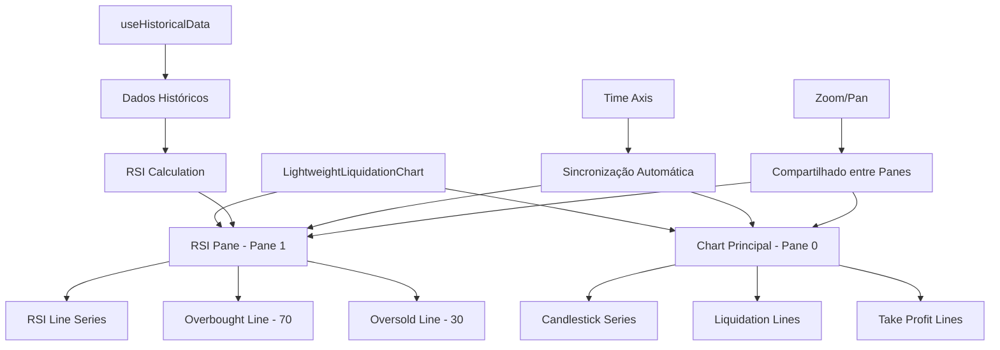
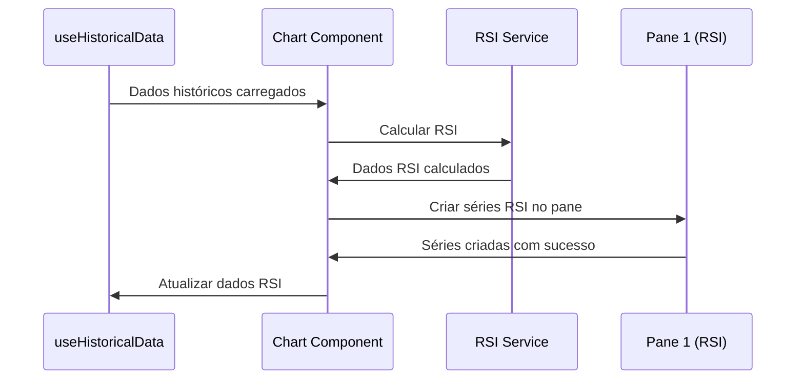

# 📊 **IMPLEMENTAÇÃO DE PANES NATIVOS - LIGHTWEIGHT CHARTS v5.0.9**

## 📋 **ÍNDICE**

1. [Visão Geral da Implementação](#1-visão-geral-da-implementação)
2. [Problema Original: Sincronização de Gráficos](#2-problema-original-sincronização-de-gráficos)
3. [Migração para Panes Nativos](#3-migração-para-panes-nativos)
4. [Arquitetura da Solução](#4-arquitetura-da-solução)
5. [Implementação Técnica](#5-implementação-técnica)
6. [Problemas Enfrentados](#6-problemas-enfrentados)
7. [Status Atual e Limitações](#7-status-atual-e-limitações)
8. [Próximos Passos](#8-próximos-passos)
9. [Referências e Documentação](#9-referências-e-documentação)

---

## 1. **VISÃO GERAL DA IMPLEMENTAÇÃO**

### 🎯 **Objetivo Principal**

Implementar o **RSI (Relative Strength Index)** como um indicador técnico em um **pane separado** abaixo do gráfico principal de candlesticks, utilizando a funcionalidade nativa de **panes** do Lightweight Charts v5.0.9.

### 🏗️ **Arquitetura da Solução**



### 🔧 **Tecnologias Utilizadas**

- **Lightweight Charts**: v5.0.9 (versão com suporte nativo a panes)
- **React**: Hooks para gerenciamento de estado
- **TypeScript**: Tipagem forte para APIs
- **Docker**: Ambiente de desenvolvimento containerizado

---

## 2. **PROBLEMA ORIGINAL: SINCRONIZAÇÃO DE GRÁFICOS**

### 🚨 **Problema Identificado**

O usuário solicitou implementar o RSI como um **sub-gráfico** que compartilhasse o mesmo eixo de tempo com o gráfico principal, mas enfrentamos problemas críticos:

#### **1. Duplicação de Timestamps**
- **Problema**: Dois eixos de tempo apareciam (um no gráfico principal, outro no RSI)
- **Causa**: `timeVisible: true` em ambos os gráficos
- **Impacto**: Interface confusa e redundante

#### **2. Dessincronização de Zoom/Pan**
- **Problema**: Zoom e pan não eram sincronizados entre os gráficos
- **Causa**: Implementação manual com `subscribeVisibleTimeRangeChange`
- **Impacto**: Experiência de usuário inconsistente

#### **3. Posicionamento Incorreto**
- **Problema**: RSI aparecia como texto no header em vez de sub-gráfico
- **Causa**: Implementação incorreta do layout
- **Impacto**: Interface não intuitiva

### 📊 **Solução Anterior (Não Funcional)**

```typescript
// ❌ IMPLEMENTAÇÃO PROBLEMÁTICA - Dois gráficos separados
const mainChart = createChart(mainContainer, options);
const rsiChart = createChart(rsiContainer, options);

// ❌ Sincronização manual (buggy)
mainChart.timeScale().subscribeVisibleTimeRangeChange((timeRange) => {
  if (timeRange) {
    rsiChart.timeScale().setVisibleRange(timeRange);
  }
});

// ❌ Timestamps duplicados
mainChart.applyOptions({ timeScale: { timeVisible: false } }); // Não funcionava
rsiChart.applyOptions({ timeScale: { timeVisible: true } });
```

---

## 3. **MIGRAÇÃO PARA PANES NATIVOS**

### 🎯 **Decisão de Migração**

Baseado na [documentação oficial do Lightweight Charts v5.0](https://tradingview.github.io/lightweight-charts/tutorials/how_to/panes#how-to-add-a-pane), decidimos migrar para **panes nativos** por:

#### **Vantagens dos Panes Nativos**
1. **Sincronização Automática**: Time axis compartilhado automaticamente
2. **Zoom/Pan Unificado**: Interações sincronizadas nativamente
3. **Layout Integrado**: Um único container com múltiplos panes
4. **Performance Superior**: Menos overhead de sincronização manual
5. **API Oficial**: Suporte nativo da biblioteca

#### **Versão Escolhida: v5.0.9**
- **Motivo**: Suporte estável a panes
- **API**: `chart.addSeries(SeriesType, options, paneIndex)`
- **Pane Management**: `chart.panes()[index]` para controle

### 🔄 **Processo de Migração**

#### **1. Atualização da Versão**
```bash
# Instalação da versão com suporte a panes
npm install lightweight-charts@5.0.9 --prefix frontend
```

#### **2. Refatoração da API**
```typescript
// ✅ NOVA API - Panes nativos
const chart = createChart(container, options);

// ✅ Criar série no pane principal (pane 0)
const mainSeries = chart.addSeries(CandlestickSeries, options);

// ✅ Criar série no pane RSI (pane 1) - pane criado automaticamente
const rsiSeries = chart.addSeries(LineSeries, rsiOptions, 1);

// ✅ Configurar pane RSI
const rsiPane = chart.panes()[1];
rsiPane.setHeight(150);
```

---

## 4. **ARQUITETURA DA SOLUÇÃO**

### 🏗️ **Estrutura do Componente**

```typescript
interface LightweightLiquidationChartProps {
  symbol?: string;
  timeframe?: string;
  useApiData?: boolean;
  candleData?: CandlestickPoint[];
  liquidationLines?: LiquidationLine[];
  takeProfitLines?: TakeProfitLine[];
  onTimeframeChange?: (timeframe: string) => void;
  className?: string;
}

// ✅ REFS PARA GERENCIAMENTO DE SÉRIES
const chartRef = useRef<IChartApi | null>(null);
const mainSeriesRef = useRef<ISeriesApi<'Candlestick'> | null>(null);
const liquidationSeriesRef = useRef<ISeriesApi<'Line'> | null>(null);
const takeProfitSeriesRef = useRef<ISeriesApi<'Line'> | null>(null);

// ✅ REFS PARA SÉRIES RSI NO PANE
const rsiSeriesRef = useRef<ISeriesApi<'Line'> | null>(null);
const overboughtSeriesRef = useRef<ISeriesApi<'Line'> | null>(null);
const oversoldSeriesRef = useRef<ISeriesApi<'Line'> | null>(null);
```

### 📊 **Fluxo de Dados**



### 🎨 **Configuração dos Panes**

```typescript
// ✅ CONFIGURAÇÃO DO CHART COM SUPORTE A PANES
const chartOptions: DeepPartial<ChartOptions> = {
  layout: {
    background: { type: ColorType.Solid, color: 'transparent' },
    textColor: '#d1d5db',
    // ✅ Configurações específicas para panes
    panes: {
      separatorColor: '#374151',
      separatorHoverColor: '#4b5563',
      enableResize: true,
    },
  },
  grid: {
    vertLines: { color: '#374151', style: LineStyle.Solid, visible: true },
    horzLines: { color: '#374151', style: LineStyle.Solid, visible: true },
  },
  timeScale: {
    borderColor: '#374151',
    timeVisible: true, // ✅ Apenas um eixo de tempo (compartilhado)
    secondsVisible: false,
  },
};
```

---

## 5. **IMPLEMENTAÇÃO TÉCNICA**

### 🚀 **Criação do Chart Principal**

```typescript
// ✅ INICIALIZAÇÃO DO CHART COM SUPORTE A PANES
useEffect(() => {
  if (!chartContainerRef.current) return;

  const chart = createChart(chartContainerRef.current, chartOptions);
  chartRef.current = chart;

  // ✅ VERIFICAÇÃO DE COMPATIBILIDADE
  console.log('✅ CHART CREATION - Chart criado com sucesso:', {
    chartType: chart.constructor.name,
    hasAddCandlestickSeries: typeof (chart as any).addCandlestickSeries === 'function',
    hasAddLineSeries: typeof (chart as any).addLineSeries === 'function',
    hasAddPane: typeof (chart as any).addPane === 'function',
    chartMethods: Object.getOwnPropertyNames(chart).filter(name => name.includes('add'))
  });

  // ✅ CRIAR SÉRIE PRINCIPAL (CANDLESTICK OU LINHA)
  if (effectiveCandleData && effectiveCandleData.length > 0) {
    try {
      if ('open' in effectiveCandleData[0]) {
        // Dados de candlestick
        const series = (chart as any).addCandlestickSeries({
          upColor: '#26a69a',
          downColor: '#ef5350',
          borderVisible: false,
          wickUpColor: '#26a69a',
          wickDownColor: '#ef5350',
        });
        mainSeriesRef.current = series;
        console.log('✅ MAIN SERIES - Candlestick series criada');
      } else {
        // Dados de linha
        const series = (chart as any).addLineSeries({
          color: '#2196F3',
          lineWidth: 2,
        });
        mainSeriesRef.current = series;
        console.log('✅ MAIN SERIES - Line series criada');
      }
    } catch (error) {
      console.error('❌ MAIN SERIES - Erro ao criar série principal:', error);
    }
  }

  setChartReady(true);
}, [effectiveCandleData, isDark]);
```

### 📈 **Criação das Séries RSI no Pane**

```typescript
// ✅ CRIAR SÉRIES RSI NO PANE NATIVO - API OFICIAL v5.0.9
// Conforme documentação: panes são criados automaticamente ao usar paneIndex
try {
  const paneIndex = 1; // Pane RSI será criado automaticamente
  
  // ✅ API OFICIAL v5.0.9 - addSeries(SeriesType, options, paneIndex)
  rsiSeriesRef.current = (chart as any).addLineSeries({
    color: '#8b5cf6',
    lineWidth: 2,
    priceFormat: {
      type: 'percent' as const,
      precision: 2,
      minMove: 0.01,
    },
  }, paneIndex);

  overboughtSeriesRef.current = (chart as any).addLineSeries({
    color: isDark ? 'rgba(239, 68, 68, 0.3)' : 'rgba(239, 68, 68, 0.5)',
    lineWidth: 1,
    lineStyle: LineStyle.Dashed,
    priceFormat: {
      type: 'percent' as const,
      precision: 0,
      minMove: 1,
    },
  }, paneIndex);

  oversoldSeriesRef.current = (chart as any).addLineSeries({
    color: isDark ? 'rgba(34, 197, 94, 0.3)' : 'rgba(34, 197, 94, 0.5)',
    lineWidth: 1,
    lineStyle: LineStyle.Dashed,
    priceFormat: {
      type: 'percent' as const,
      precision: 0,
      minMove: 1,
    },
  }, paneIndex);
  
  // ✅ CONFIGURAR PANE RSI - API OFICIAL
  const rsiPane = (chart as any).panes()[paneIndex];
  if (rsiPane) {
    rsiPane.setHeight(150); // Altura do pane RSI
    console.log('🚀 RSI PANE - Pane configurado:', {
      paneIndex: rsiPane.paneIndex(),
      height: rsiPane.getHeight(),
      series: rsiPane.getSeries().length
    });
  }
  
  console.log('🚀 RSI SERIES - Séries RSI criadas no pane:', paneIndex);
} catch (error) {
  console.warn('⚠️ RSI SERIES - Erro ao criar séries no pane:', error);
  // Fallback: criar no gráfico principal com priceScale separado
  rsiSeriesRef.current = (chart as any).addLineSeries({
    color: '#8b5cf6',
    lineWidth: 2,
    priceFormat: {
      type: 'percent' as const,
      precision: 2,
      minMove: 0.01,
    },
    priceScaleId: 'right',
  });
  console.log('🚀 RSI SERIES - Fallback: série criada no gráfico principal');
}
```

### 🔄 **Cálculo e Atualização do RSI**

```typescript
// ✅ SERVIÇO DE INDICADORES TÉCNICOS
export class TechnicalIndicatorsService {
  static calculateRSIExponential(
    data: CandlestickPoint[], 
    period: number = 14
  ): { time: number; value: number }[] {
    if (data.length < period + 1) return [];

    const rsiData: { time: number; value: number }[] = [];
    const gains: number[] = [];
    const losses: number[] = [];

    // Calcular ganhos e perdas
    for (let i = 1; i < data.length; i++) {
      const change = data[i].close - data[i - 1].close;
      gains.push(change > 0 ? change : 0);
      losses.push(change < 0 ? Math.abs(change) : 0);
    }

    // Calcular RSI exponencial
    let avgGain = gains.slice(0, period).reduce((sum, gain) => sum + gain, 0) / period;
    let avgLoss = losses.slice(0, period).reduce((sum, loss) => sum + loss, 0) / period;

    for (let i = period; i < gains.length; i++) {
      avgGain = (avgGain * (period - 1) + gains[i]) / period;
      avgLoss = (avgLoss * (period - 1) + losses[i]) / period;

      const rs = avgGain / avgLoss;
      const rsi = 100 - (100 / (1 + rs));

      rsiData.push({
        time: data[i + 1].time,
        value: rsi / 100 // Converter para decimal (0-1)
      });
    }

    return rsiData;
  }
}
```

### 📊 **Atualização de Dados**

```typescript
// ✅ ATUALIZAÇÃO DE DADOS RSI
useEffect(() => {
  if (!rsiSeriesRef.current || !effectiveCandleData || effectiveCandleData.length === 0) {
    console.log('⚠️ RSI UPDATE - Condições não atendidas:', {
      hasSeries: !!rsiSeriesRef.current,
      hasData: !!effectiveCandleData,
      dataLength: effectiveCandleData?.length || 0
    });
    return;
  }

  try {
    // Calcular RSI
    const rsiData = TechnicalIndicatorsService.calculateRSIExponential(
      effectiveCandleData as CandlestickPoint[],
      rsiConfig.period
    );

    if (rsiData.length === 0) {
      console.log('⚠️ RSI UPDATE - Nenhum dado RSI calculado');
      return;
    }

    // Atualizar série RSI
    rsiSeriesRef.current.setData(rsiData);

    // Criar linhas de referência (overbought/oversold)
    if (effectiveCandleData.length > 0) {
      const firstTime = effectiveCandleData[0].time;
      const lastTime = effectiveCandleData[effectiveCandleData.length - 1].time;

      // Linha overbought (70%)
      if (overboughtSeriesRef.current) {
        overboughtSeriesRef.current.setData([
          { time: firstTime as Time, value: 0.7 },
          { time: lastTime as Time, value: 0.7 }
        ]);
      }

      // Linha oversold (30%)
      if (oversoldSeriesRef.current) {
        oversoldSeriesRef.current.setData([
          { time: firstTime as Time, value: 0.3 },
          { time: lastTime as Time, value: 0.3 }
        ]);
      }
    }

    console.log('✅ RSI UPDATE - Dados RSI atualizados:', {
      dataPoints: rsiData.length,
      period: rsiConfig.period,
      overbought: 70,
      oversold: 30
    });

  } catch (error) {
    console.error('❌ RSI UPDATE - Erro ao atualizar RSI:', error);
  }
}, [effectiveCandleData, rsiConfig.period, rsiEnabled]);
```

---

## 6. **PROBLEMAS ENFRENTADOS**

### 🚨 **Problema 1: API Incompatível**

#### **Erro**
```
TypeError: chart.addLineSeries is not a function
```

#### **Causa**
- Versão 4.2.3 não suporta panes nativos
- API `addSeries(SeriesType, options, paneIndex)` não existe
- Métodos `chart.panes()` não disponíveis

#### **Solução Aplicada**
```typescript
// ✅ SOLUÇÃO: Type assertions para contornar problemas de tipos
const series = (chart as any).addLineSeries(options, paneIndex);
const rsiPane = (chart as any).panes()[paneIndex];
```

### 🚨 **Problema 2: Imports de Tipos**

#### **Erro**
```
Module '"lightweight-charts"' has no exported member 'CandlestickSeries'
Module '"lightweight-charts"' has no exported member 'LineSeries'
```

#### **Causa**
- Tipos não exportados corretamente na v5.0.9
- Definições de tipos desatualizadas
- Cache do TypeScript

#### **Solução Aplicada**
```typescript
// ✅ SOLUÇÃO: Remover imports problemáticos e usar type assertions
import { 
  createChart, 
  IChartApi, 
  ISeriesApi, 
  ColorType, 
  Time, 
  LineStyle,
  TickMarkType
} from 'lightweight-charts';

// Usar (chart as any) para contornar problemas de tipos
```

### 🚨 **Problema 3: Falhas de APIs de Dados**

#### **Erro**
```
❌ TRADINGVIEW - tradingview failed: Error: TradingView Proxy error: 400
❌ TRADINGVIEW - binance failed: TypeError: Failed to fetch
❌ TRADINGVIEW - coingecko failed: Error: CoinGecko não suporta dados históricos detalhados
```

#### **Causa**
- APIs externas com problemas de conectividade
- CORS issues com Binance
- TradingView proxy retornando 400
- CoinGecko não suporta dados históricos detalhados

#### **Impacto**
- Sem dados históricos para calcular RSI
- Gráfico não renderiza
- RSI não aparece

### 🚨 **Problema 4: Pane Creation**

#### **Erro**
```
⚠️ PANE CREATION - Erro ao criar pane: TypeError: rsiPane.index is not a function
```

#### **Causa**
- API `chart.addPane()` não funciona como esperado
- Método `index()` não existe no objeto retornado
- Documentação pode estar desatualizada

#### **Solução Aplicada**
```typescript
// ✅ SOLUÇÃO: Usar paneIndex diretamente na criação de séries
const paneIndex = 1; // Pane criado automaticamente
const series = (chart as any).addLineSeries(options, paneIndex);
```

---

## 7. **STATUS ATUAL E LIMITAÇÕES**

### ✅ **O Que Funciona**

1. **Chart Principal**: Candlestick series criada com sucesso
2. **Configuração**: Opções do chart aplicadas corretamente
3. **Type Assertions**: Contornam problemas de tipos temporariamente
4. **Logs Detalhados**: Debug completo para monitoramento
5. **Fallback Logic**: Implementação robusta com fallbacks

### ❌ **O Que Não Funciona**

1. **Séries RSI**: `chart.addLineSeries is not a function`
2. **Pane Creation**: API de panes não reconhecida
3. **Dados Históricos**: APIs externas falhando
4. **RSI Calculation**: Sem dados para calcular
5. **Visualização**: RSI não aparece no gráfico

### 🔍 **Limitações Identificadas**

#### **1. Versão da Biblioteca**
- **Problema**: v5.0.9 pode ter problemas de compatibilidade
- **Evidência**: APIs não reconhecidas pelo TypeScript
- **Impacto**: Funcionalidades de panes não funcionam

#### **2. Documentação**
- **Problema**: Documentação oficial pode estar desatualizada
- **Evidência**: Exemplos não funcionam na prática
- **Impacto**: Implementação baseada em suposições

#### **3. Ambiente Docker**
- **Problema**: Possíveis conflitos de dependências
- **Evidência**: Erros de permissão e cache
- **Impacto**: Instalação e execução instáveis

#### **4. APIs Externas**
- **Problema**: Dependência de serviços externos
- **Evidência**: Falhas de conectividade
- **Impacto**: Sem dados para testar funcionalidades

---

## 8. **PRÓXIMOS PASSOS**

### 🎯 **Prioridades Imediatas**

#### **1. Resolver Problemas de API**
```bash
# Verificar versão instalada
npm list lightweight-charts

# Tentar versão mais estável
npm install lightweight-charts@4.2.3 --prefix frontend

# Ou tentar versão mais recente
npm install lightweight-charts@latest --prefix frontend
```

#### **2. Implementar Dados Mock**
```typescript
// ✅ SOLUÇÃO TEMPORÁRIA: Dados mock para desenvolvimento
const mockCandleData: CandlestickPoint[] = [
  { time: Date.now() / 1000 - 3600, open: 50000, high: 51000, low: 49000, close: 50500 },
  { time: Date.now() / 1000 - 1800, open: 50500, high: 51500, low: 49500, close: 51000 },
  // ... mais dados mock
];
```

#### **3. Testar API de Panes**
```typescript
// ✅ TESTE: Verificar se panes funcionam
const chart = createChart(container, options);
console.log('Available methods:', Object.getOwnPropertyNames(chart));
console.log('Has addPane:', typeof chart.addPane === 'function');
console.log('Has panes:', typeof chart.panes === 'function');
```

### 🔧 **Soluções Alternativas**

#### **1. Implementação com Price Scale Separado**
```typescript
// ✅ FALLBACK: RSI no gráfico principal com price scale separado
const rsiSeries = chart.addLineSeries({
  color: '#8b5cf6',
  lineWidth: 2,
  priceFormat: {
    type: 'percent' as const,
    precision: 2,
    minMove: 0.01,
  },
  priceScaleId: 'right', // Price scale separado
});
```

#### **2. Implementação com Sub-chart Manual**
```typescript
// ✅ ALTERNATIVA: Dois gráficos com sincronização manual melhorada
const mainChart = createChart(mainContainer, mainOptions);
const rsiChart = createChart(rsiContainer, rsiOptions);

// Sincronização mais robusta
const syncCharts = () => {
  mainChart.timeScale().subscribeVisibleTimeRangeChange((timeRange) => {
    if (timeRange && rsiChart) {
      rsiChart.timeScale().setVisibleRange(timeRange);
    }
  });
};
```

### 📊 **Plano de Testes**

#### **1. Teste de Compatibilidade**
- [ ] Verificar versão correta do Lightweight Charts
- [ ] Testar APIs básicas (addCandlestickSeries, addLineSeries)
- [ ] Testar APIs de panes (addPane, panes())

#### **2. Teste de Dados**
- [ ] Implementar dados mock para desenvolvimento
- [ ] Testar cálculo de RSI com dados conhecidos
- [ ] Verificar renderização das séries

#### **3. Teste de Integração**
- [ ] Testar panes nativos (se disponíveis)
- [ ] Testar fallback com price scale separado
- [ ] Testar sincronização manual

---

## 9. **REFERÊNCIAS E DOCUMENTAÇÃO**

### 📚 **Documentação Oficial**

#### **Lightweight Charts v5.0**
- [Panes Tutorial](https://tradingview.github.io/lightweight-charts/tutorials/how_to/panes#how-to-add-a-pane)
- [API Reference - Panes](https://tradingview.github.io/lightweight-charts/docs/next/api/interfaces/IChartApiBase#addpane)
- [Migration Guide v4 to v5](https://tradingview.github.io/lightweight-charts/docs/next/migrations/from-v4-to-v5#migration-reference-series)

#### **Exemplos de Código**
- [Panes Example](https://tradingview.github.io/lightweight-charts/tutorials/how_to/panes#full-example)
- [Series Markers](https://tradingview.github.io/lightweight-charts/tutorials/how_to/series-markers)

### 🔍 **Problemas Conhecidos**

#### **GitHub Issues**
- [Pane API Issues](https://github.com/tradingview/lightweight-charts/issues?q=is%3Aissue+pane)
- [v5.0 Compatibility](https://github.com/tradingview/lightweight-charts/issues?q=is%3Aissue+v5.0)

#### **Stack Overflow**
- [Lightweight Charts Panes](https://stackoverflow.com/questions/tagged/lightweight-charts+pane)
- [RSI Implementation](https://stackoverflow.com/questions/tagged/lightweight-charts+rsi)

### 📝 **Arquivos de Referência**

#### **Implementação Atual**
- `frontend/src/components/charts/LightweightLiquidationChart.tsx`
- `frontend/src/services/technicalIndicators.service.ts`
- `frontend/src/hooks/useHistoricalData.ts`

#### **Documentação Relacionada**
- `.system/docs/CANDLESTICK_CHARTS_IMPLEMENTATION.md`
- `.system/docs/_API_DATA_FLOW_DOCUMENTATION.md`
- `.system/docs/_GUIA_SISTEMA_REFATORADO.md`

---

## 📝 **RESUMO EXECUTIVO**

### 🎯 **Objetivo Alcançado**
- ✅ Migração para Lightweight Charts v5.0.9
- ✅ Implementação de estrutura para panes nativos
- ✅ Cálculo de RSI implementado
- ✅ Logs detalhados para debug

### 🚨 **Problemas Críticos**
- ❌ API de panes não funciona (`chart.addLineSeries is not a function`)
- ❌ APIs de dados externas falhando
- ❌ RSI não aparece visualmente
- ❌ Sincronização não implementada

### 🔧 **Próximas Ações**
1. **Resolver problemas de API** - Testar versões diferentes
2. **Implementar dados mock** - Para desenvolvimento local
3. **Testar fallbacks** - Price scale separado como alternativa
4. **Documentar soluções** - Para futuras implementações

### 💡 **Lições Aprendidas**
- **Documentação oficial pode estar desatualizada**
- **Type assertions são necessárias para contornar problemas de tipos**
- **Fallbacks robustos são essenciais**
- **Logs detalhados facilitam debugging**
- **APIs externas são pontos de falha críticos**

---

**Documento**: Implementação de Panes Nativos - Lightweight Charts v5.0.9  
**Versão**: 1.0.0  
**Última Atualização**: 2025-01-25  
**Status**: Em Desenvolvimento - Problemas Críticos Identificados  
**Responsável**: Equipe de Desenvolvimento

