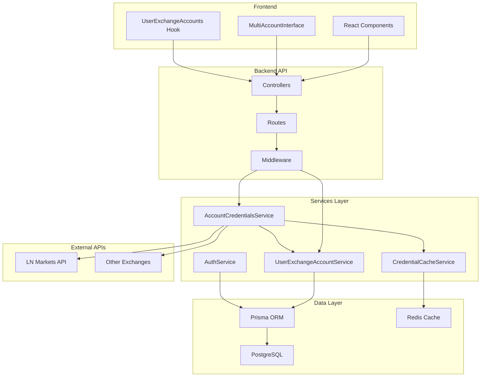
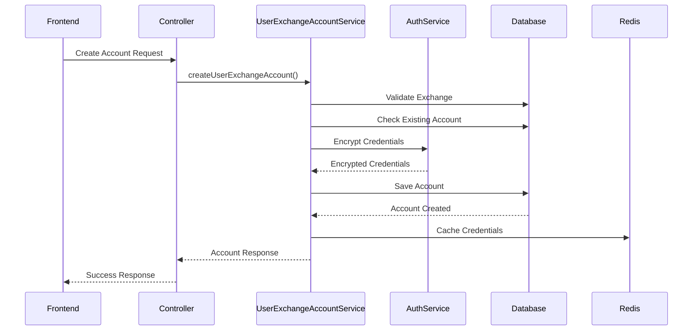
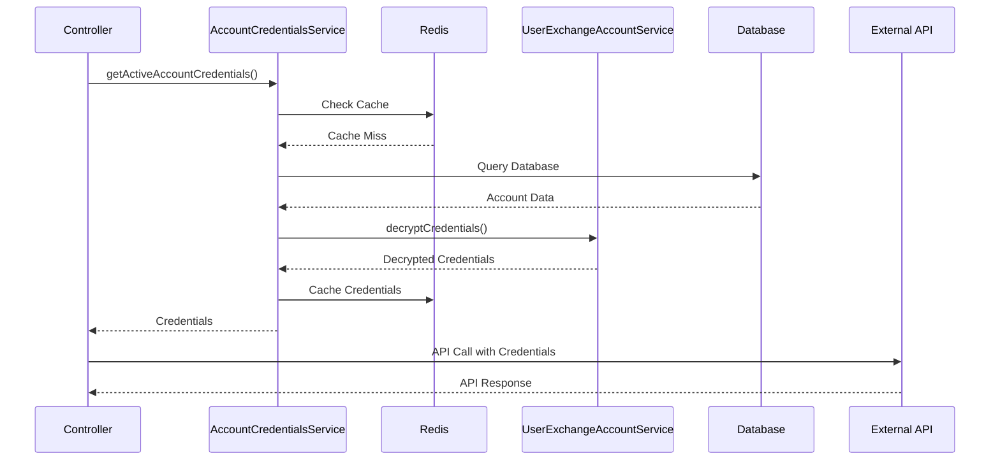
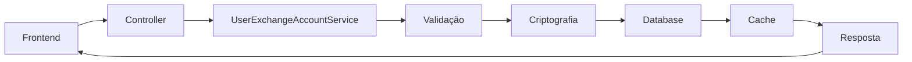
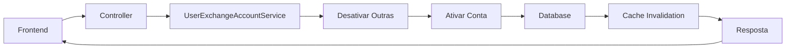
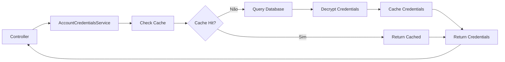
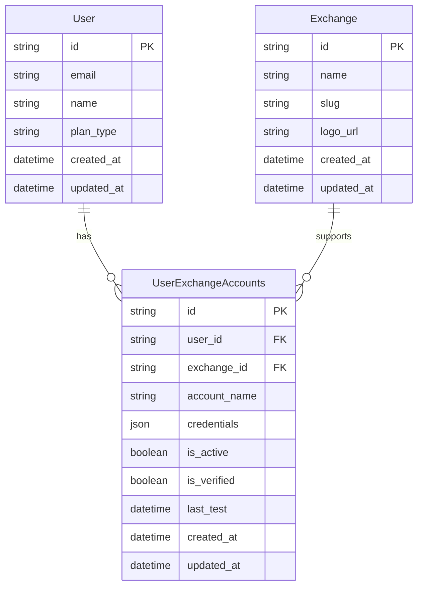

# User Exchange Accounts - Architecture Diagram

> **Status**: Active  
> **Última Atualização**: 2025-01-14  
> **Versão**: 1.0.0  
> **Responsável**: User Exchange Accounts System  

## Índice

- [Visão Geral](#visão-geral)
- [Diagrama de Arquitetura](#diagrama-de-arquitetura)
- [Fluxo de Dados](#fluxo-de-dados)
- [Componentes](#componentes)
- [Referências](#referências)

## Visão Geral

Este documento contém diagramas da arquitetura do sistema de User Exchange Accounts, mostrando a interação entre componentes e o fluxo de dados.

## Diagrama de Arquitetura

### Arquitetura Geral do Sistema

### Fluxo de Criação de Conta

### Fluxo de Recuperação de Credenciais

## Fluxo de Dados

### 1. Criação de Conta

### 2. Ativação de Conta

### 3. Recuperação de Credenciais

## Componentes

### 1. UserExchangeAccountService

**Responsabilidades:**
- CRUD operations para contas de exchange
- Criptografia/descriptografia de credenciais
- Validação de dados
- Gerenciamento de estado das contas

**Métodos Principais:**
- `getUserExchangeAccounts(userId: string)`
- `createUserExchangeAccount(userId: string, data: CreateUserExchangeAccountData)`
- `updateUserExchangeAccount(accountId: string, data: UpdateUserExchangeAccountData)`
- `deleteUserExchangeAccount(accountId: string)`

### 2. AccountCredentialsService

**Responsabilidades:**
- Gerenciamento centralizado de credenciais ativas
- Cache de credenciais
- Validação de credenciais
- Integração com Redis

**Métodos Principais:**
- `getActiveAccountCredentials(userId: string)`
- `getAccountCredentials(userId: string, accountId: string)`
- `validateCredentials(credentials: Record<string, string>)`

### 3. CredentialCacheService

**Responsabilidades:**
- Cache de credenciais com Redis
- Invalidação de cache
- Fallback para database

**Métodos Principais:**
- `get(key: string)`
- `set(key: string, credentials: Record<string, string>, ttl: number)`
- `del(key: string)`

### 4. Database Schema

## Referências

- [Arquitetura](../internal-implementation/01-architecture.md)
- [Best Practices](../internal-implementation/02-best-practices.md)
- [Guia de Migração](../internal-implementation/03-migration-guide.md)
- [Troubleshooting](../internal-implementation/04-troubleshooting.md)
- [Exemplos Práticos](../internal-implementation/05-examples.md)

---
*Documentação gerada seguindo DOCUMENTATION_STANDARDS.md*
