# User Exchange Accounts - Encryption Flow

> **Status**: Active  
> **Última Atualização**: 2025-01-14  
> **Versão**: 1.0.0  
> **Responsável**: User Exchange Accounts System  

## Índice

- [Visão Geral](#visão-geral)
- [Fluxo de Criptografia](#fluxo-de-criptografia)
- [Fluxo de Descriptografia](#fluxo-de-descriptografia)
- [Segurança](#segurança)
- [Referências](#referências)

## Visão Geral

Este documento detalha o fluxo de criptografia e descriptografia das credenciais no sistema de User Exchange Accounts.

## Fluxo de Criptografia

### 1. Criptografia de Credenciais

```mermaid
graph TB
    A[Credenciais em Texto Plano] --> B[Validação de Dados]
    B --> C[Geração de IV Aleatório]
    C --> D[Derivação de Chave]
    D --> E[Criptografia AES-256-CBC]
    E --> F[Formato: IV:Encrypted]
    F --> G[Armazenamento no Database]
    G --> H[Cache no Redis]
```



### 2. Processo de Criptografia


### 3. Código de Criptografia

```typescript
// Exemplo de criptografia de credenciais
Object.entries(data.credentials).forEach(([key, value]) => {
  if (value && value.trim() !== '') {
    try {
      const crypto = require('crypto');
      const { securityConfig } = require('../config/env');
      const algorithm = 'aes-256-cbc';
      const key = crypto.scryptSync(securityConfig.encryption.key, 'salt', 32);
      const iv = crypto.randomBytes(16);
      
      const cipher = crypto.createCipheriv(algorithm, key, iv);
      let encrypted = cipher.update(value, 'utf8', 'hex');
      encrypted += cipher.final('hex');
      
      encryptedCredentials[key] = `${iv.toString('hex')}:${encrypted}`;
      console.log(`✅ USER EXCHANGE ACCOUNT SERVICE - Encrypted credential ${key}`);
    } catch (error) {
      console.warn(`⚠️ USER EXCHANGE ACCOUNT SERVICE - Failed to encrypt credential ${key}:`, error);
      encryptedCredentials[key] = value; // Fallback para valor não criptografado
    }
  }
});
```

## Fluxo de Descriptografia

### 1. Descriptografia de Credenciais

```mermaid
graph TB
    A[Credenciais Criptografadas] --> B[Validação de Formato]
    B --> C[Extrair IV e Dados]
    C --> D[Derivação de Chave]
    D --> E[Descriptografia AES-256-CBC]
    E --> F[Credenciais em Texto Plano]
    F --> G[Retorno para Controller]
```



### 2. Processo de Descriptografia


### 3. Código de Descriptografia

```typescript
// Exemplo de descriptografia de credenciais
Object.entries(credentials).forEach(([key, value]) => {
  if (value && typeof value === 'string') {
    try {
      const crypto = require('crypto');
      const { securityConfig } = require('../config/env');
      const algorithm = 'aes-256-cbc';
      const key = crypto.scryptSync(securityConfig.encryption.key, 'salt', 32);
      
      // Extrair IV e dados criptografados
      const [ivHex, encryptedHex] = value.split(':');
      if (!ivHex || !encryptedHex) {
        console.warn(`⚠️ USER EXCHANGE ACCOUNT SERVICE - Invalid encrypted format for ${key}`);
        decryptedCredentials[key] = '';
        return;
      }
      
      const iv = Buffer.from(ivHex, 'hex');
      const encrypted = Buffer.from(encryptedHex, 'hex');
      
      const decipher = crypto.createDecipheriv(algorithm, key, iv);
      let decrypted = decipher.update(encrypted, null, 'utf8');
      decrypted += decipher.final('utf8');
      
      decryptedCredentials[key] = decrypted;
      console.log(`✅ USER EXCHANGE ACCOUNT SERVICE - Decrypted ${key}: ${decrypted}`);
    } catch (error) {
      console.warn(`⚠️ USER EXCHANGE ACCOUNT SERVICE - Failed to decrypt credential ${key}:`, error);
      decryptedCredentials[key] = ''; // Fallback para string vazia
    }
  } else {
    decryptedCredentials[key] = '';
  }
});
```

## Segurança

### 1. Configuração de Segurança

```typescript
// backend/src/config/env.ts
export const securityConfig = {
  encryption: {
    key: process.env.SECURITY_ENCRYPTION_KEY!, // Chave de 32 bytes
    algorithm: 'aes-256-cbc' // Algoritmo de criptografia
  }
};
```

### 2. Validação de Formato

```typescript
// Validação do formato de credencial criptografada
const [ivHex, encryptedHex] = value.split(':');
if (!ivHex || !encryptedHex) {
  console.warn(`⚠️ Invalid encrypted format for ${key}`);
  decryptedCredentials[key] = '';
  return;
}
```

### 3. Fallback Seguro

```typescript
// Fallback em caso de erro de criptografia
try {
  // Tentativa de descriptografia
  const decrypted = decipher.final('utf8');
  decryptedCredentials[key] = decrypted;
} catch (error) {
  console.warn(`⚠️ Failed to decrypt credential ${key}:`, error);
  decryptedCredentials[key] = ''; // Fallback seguro
}
```

### 4. Logs de Segurança

```typescript
// Logs para auditoria de segurança
console.log(`🔍 USER EXCHANGE ACCOUNT SERVICE - Decrypting credentials:`, credentials);
console.log(`✅ USER EXCHANGE ACCOUNT SERVICE - Encrypted credential ${key}`);
console.warn(`⚠️ USER EXCHANGE ACCOUNT SERVICE - Failed to encrypt credential ${key}:`, error);
```

## Referências

- [Arquitetura](../internal-implementation/01-architecture.md)
- [Best Practices](../internal-implementation/02-best-practices.md)
- [Guia de Migração](../internal-implementation/03-migration-guide.md)
- [Troubleshooting](../internal-implementation/04-troubleshooting.md)
- [Exemplos Práticos](../internal-implementation/05-examples.md)

---
*Documentação gerada seguindo DOCUMENTATION_STANDARDS.md*
