# Dashboard Analytics

## Summary

Comprehensive dashboard analytics system for the Axisor admin panel, providing real-time KPIs, performance metrics, user analytics, and business intelligence. This system enables administrators to monitor system health, user behavior, and business performance through interactive dashboards and detailed reports.

## Dashboard Analytics Architecture

```mermaid
graph TB
    A[Dashboard Analytics] --> B[Real-time KPIs]
    A --> C[User Analytics]
    A --> D[Business Metrics]
    A --> E[System Performance]
    A --> F[Visualization Engine]
    
    B --> G[Active Users]
    B --> H[Revenue Metrics]
    B --> I[Trade Volume]
    B --> J[System Health]
    
    C --> K[User Growth]
    C --> L[Plan Distribution]
    C --> M[Activity Patterns]
    C --> N[Engagement Metrics]
    
    D --> O[Revenue Analysis]
    D --> P[Conversion Rates]
    D --> Q[Customer Lifetime Value]
    D --> R[Market Performance]
    
    E --> S[Response Times]
    E --> T[Error Rates]
    E --> U[Resource Usage]
    E --> V[Uptime Metrics]
    
    F --> W[Charts & Graphs]
    F --> X[Interactive Filters]
    F --> Y[Export Functionality]
    F --> Z[Real-time Updates]
```



## Analytics Data Collection

### Real-time Metrics Collection

```typescript
// backend/src/controllers/admin.controller.ts
export class AdminController {
  /**
   * Get advanced dashboard KPIs with detailed metrics
   */
  async getAdvancedDashboard(request: FastifyRequest<{ Querystring: { period: string } }>, reply: FastifyReply) {
    const { period = '24h' } = request.query;

    try {
      const now = new Date();
      const periods = {
        '1h': new Date(now.getTime() - 60 * 60 * 1000),
        '24h': new Date(now.getTime() - 24 * 60 * 60 * 1000),
        '7d': new Date(now.getTime() - 7 * 24 * 60 * 60 * 1000),
        '30d': new Date(now.getTime() - 30 * 24 * 60 * 60 * 1000),
      };
      const startDate = periods[period as keyof typeof periods];

      // Get comprehensive metrics
      const [
        userMetrics,
        tradeMetrics,
        paymentMetrics,
        automationMetrics,
        notificationMetrics,
        systemMetrics
      ] = await Promise.all([
        this.getUserMetrics(startDate),
        this.getTradeMetrics(startDate),
        this.getPaymentMetrics(startDate),
        this.getAutomationMetrics(startDate),
        this.getNotificationMetrics(startDate),
        this.getSystemMetrics()
      ]);

      // Calculate growth rates
      const previousPeriod = new Date(startDate.getTime() - (now.getTime() - startDate.getTime()));
      const previousMetrics = await this.getUserMetrics(previousPeriod);

      const growthRate = previousMetrics.total_users > 0
        ? ((userMetrics.total_users - previousMetrics.total_users) / previousMetrics.total_users) * 100
        : 0;

      reply.send({
        success: true,
        data: {
          period,
          kpis: {
            ...userMetrics,
            ...tradeMetrics,
            ...paymentMetrics,
            ...automationMetrics,
            ...notificationMetrics,
            ...systemMetrics,
            growth_rate: Math.round(growthRate * 100) / 100,
          },
          charts: await this.getDashboardCharts(startDate, now),
          alerts: await this.getRecentAlerts(10),
        },
      });
    } catch (error: any) {
      console.error('Error getting advanced dashboard:', error);
      reply.code(500).send({
        success: false,
        error: 'Failed to fetch dashboard data',
      });
    }
  }

  /**
   * Get dashboard charts data
   */
  private async getDashboardCharts(startDate: Date, endDate: Date) {
    // Get hourly trade data for the period
    const hourlyTrades = await prisma.tradeLog.groupBy({
      by: ['executed_at'],
      where: {
        executed_at: { gte: startDate, lte: endDate },
        status: 'completed',
      },
      _count: { executed_at: true },
      orderBy: { executed_at: 'asc' },
    });

    // Get daily user registrations
    const dailyUsers = await prisma.user.groupBy({
      by: ['created_at'],
      where: { created_at: { gte: startDate, lte: endDate } },
      _count: { created_at: true },
      orderBy: { created_at: 'asc' },
    });

    // Get daily revenue
    const dailyRevenue = await prisma.payment.groupBy({
      by: ['paid_at'],
      where: {
        paid_at: { gte: startDate, lte: endDate },
        status: 'paid',
      },
      _sum: { amount_sats: true },
      orderBy: { paid_at: 'asc' },
    });

    return {
      trades_over_time: hourlyTrades.map(t => ({
        time: t.executed_at,
        count: t._count.executed_at,
      })),
      users_over_time: dailyUsers.map(u => ({
        date: u.created_at.toISOString().split('T')[0],
        count: u._count.created_at,
      })),
      revenue_over_time: dailyRevenue.map(r => ({
        date: r.paid_at?.toISOString().split('T')[0],
        amount: r._sum.amount_sats || 0,
      })),
    };
  }
}
```

### User Analytics

```typescript
// backend/src/controllers/admin.controller.ts
export class AdminController {
  /**
   * Get user-related metrics
   */
  private async getUserMetrics(startDate: Date) {
    const [
      totalUsers,
      activeUsers,
      newUsers,
      usersByPlan,
      topUsers
    ] = await Promise.all([
      prisma.user.count(),
      prisma.user.count({
        where: { last_activity_at: { gte: startDate } },
      }),
      prisma.user.count({
        where: { created_at: { gte: startDate } },
      }),
      prisma.user.groupBy({
        by: ['plan_type'],
        _count: { plan_type: true },
      }),
      prisma.user.findMany({
        take: 5,
        orderBy: { created_at: 'desc' },
        select: {
          id: true,
          email: true,
          username: true,
          plan_type: true,
          created_at: true,
        },
      }),
    ]);

    return {
      total_users: totalUsers,
      active_users: activeUsers,
      new_users: newUsers,
      users_by_plan: usersByPlan.map(p => ({
        plan: p.plan_type,
        count: p._count.plan_type,
      })),
      top_users: topUsers,
    };
  }

  /**
   * Get trading analytics with filtering
   */
  async getTradingAnalytics(request: FastifyRequest<{ Querystring: any }>, reply: FastifyReply) {
    try {
      const query = request.query as {
        search?: string;
        planType?: string;
        dateFrom?: string;
        dateTo?: string;
        sortBy?: string;
        sortOrder?: string;
        page?: string;
        limit?: string;
      };

      const {
        search,
        planType,
        dateFrom,
        dateTo,
        sortBy = 'createdAt',
        sortOrder = 'desc',
        page = '1',
        limit = '50'
      } = query;

      const pageNum = parseInt(page);
      const limitNum = parseInt(limit);
      const offset = (pageNum - 1) * limitNum;

      // Build where clause
      const whereClause: any = {};
      
      if (search) {
        whereClause.OR = [
          { username: { contains: search, mode: 'insensitive' } },
          { email: { contains: search, mode: 'insensitive' } }
        ];
      }

      if (planType) {
        whereClause.plan_type = planType;
      }

      if (dateFrom || dateTo) {
        whereClause.created_at = {};
        if (dateFrom) whereClause.created_at.gte = new Date(dateFrom);
        if (dateTo) whereClause.created_at.lte = new Date(dateTo);
      }

      // Get users with trading data
      const [users, total] = await Promise.all([
        prisma.user.findMany({
          where: whereClause,
          skip: offset,
          take: limitNum,
          orderBy: { [sortBy]: sortOrder },
          include: {
            _count: {
              select: {
                tradeLogs: {
                  where: { status: 'completed' }
                },
                automations: true
              }
            },
            tradeLogs: {
              where: { status: 'completed' },
              select: {
                pnl: true,
                executed_at: true
              },
              orderBy: { executed_at: 'desc' },
              take: 1
            }
          }
        }),
        prisma.user.count({ where: whereClause })
      ]);

      // Calculate metrics for each user
      const usersWithMetrics = await Promise.all(
        users.map(async (user) => {
          const tradeStats = await prisma.tradeLog.groupBy({
            by: ['status'],
            where: { user_id: user.id },
            _count: { status: true }
          });

          const successTrades = tradeStats.find(t => t.status === 'completed')?._count.status || 0;
          const failedTrades = tradeStats.filter(t => t.status === 'failed').reduce((sum, t) => sum + t._count.status, 0);
          const totalTrades = successTrades + failedTrades;
          const winRate = totalTrades > 0 ? (successTrades / totalTrades) * 100 : 0;

          const pnlStats = await prisma.tradeLog.aggregate({
            where: { 
              user_id: user.id,
              status: 'completed'
            },
            _sum: { pnl: true },
            _avg: { pnl: true }
          });

          return {
            userId: user.id,
            username: user.username,
            email: user.email,
            planType: user.plan_type,
            totalTrades,
            winningTrades: successTrades,
            losingTrades: failedTrades,
            winRate: Math.round(winRate * 100) / 100,
            totalPnL: pnlStats._sum.pnl || 0,
            avgPnL: Math.round((pnlStats._avg.pnl || 0) * 100) / 100,
            lastTradeAt: user.tradeLogs[0]?.executed_at?.toISOString(),
            createdAt: user.created_at.toISOString(),
            automationCount: user._count.automations
          };
        })
      );

      // Get overall metrics
      const overallMetrics = await this.getOverallTradingMetrics();

      reply.send({
        success: true,
        data: usersWithMetrics,
        pagination: {
          page: pageNum,
          limit: limitNum,
          total,
          totalPages: Math.ceil(total / limitNum)
        },
        metrics: overallMetrics
      });

    } catch (error: any) {
      console.error('Error getting trading analytics:', error);
      reply.code(500).send({
        success: false,
        error: 'Failed to fetch trading analytics',
      });
    }
  }

  /**
   * Get overall trading metrics
   */
  private async getOverallTradingMetrics() {
    const [
      totalUsers,
      activeUsers,
      totalTrades,
      totalPnL,
      avgWinRate
    ] = await Promise.all([
      prisma.user.count(),
      prisma.user.count({
        where: { last_activity_at: { gte: new Date(Date.now() - 24 * 60 * 60 * 1000) } }
      }),
      prisma.tradeLog.count({
        where: { status: 'completed' }
      }),
      prisma.tradeLog.aggregate({
        where: { status: 'completed' },
        _sum: { pnl: true }
      }),
      this.calculateAverageWinRate()
    ]);

    return {
      totalUsers,
      activeUsers,
      totalTrades,
      totalPnL: totalPnL._sum.pnl || 0,
      avgWinRate: Math.round(avgWinRate * 100) / 100
    };
  }

  /**
   * Calculate average win rate across all users
   */
  private async calculateAverageWinRate(): Promise<number> {
    const users = await prisma.user.findMany({
      include: {
        _count: {
          select: {
            tradeLogs: true
          }
        }
      }
    });

    let totalWinRate = 0;
    let userCount = 0;

    for (const user of users) {
      if (user._count.tradeLogs > 0) {
        const tradeStats = await prisma.tradeLog.groupBy({
          by: ['status'],
          where: { user_id: user.id },
          _count: { status: true }
        });

        const successTrades = tradeStats.find(t => t.status === 'completed')?._count.status || 0;
        const failedTrades = tradeStats.filter(t => t.status === 'failed').reduce((sum, t) => sum + t._count.status, 0);
        const totalTrades = successTrades + failedTrades;
        
        if (totalTrades > 0) {
          totalWinRate += (successTrades / totalTrades) * 100;
          userCount++;
        }
      }
    }

    return userCount > 0 ? totalWinRate / userCount : 0;
  }
}
```

### Payment Analytics

```typescript
// backend/src/controllers/admin.controller.ts
export class AdminController {
  /**
   * Get payment-related metrics
   */
  private async getPaymentMetrics(startDate: Date) {
    const [
      totalRevenue,
      paymentsByStatus,
      recentPayments
    ] = await Promise.all([
      prisma.payment.aggregate({
        where: {
          status: 'paid',
          paid_at: { gte: startDate },
        },
        _sum: { amount_sats: true },
      }),
      prisma.payment.groupBy({
        by: ['status'],
        where: { created_at: { gte: startDate } },
        _count: { status: true },
        _sum: { amount_sats: true },
      }),
      prisma.payment.findMany({
        where: { created_at: { gte: startDate } },
        take: 5,
        orderBy: { created_at: 'desc' },
        select: {
          id: true,
          amount_sats: true,
          status: true,
          plan_type: true,
          user: {
            select: { email: true, username: true },
          },
        },
      }),
    ]);

    return {
      total_revenue: totalRevenue._sum.amount_sats || 0,
      payments_by_status: paymentsByStatus.map(p => ({
        status: p.status,
        count: p._count.status,
        amount: p._sum.amount_sats || 0,
      })),
      recent_payments: recentPayments,
    };
  }

  /**
   * Get payment analytics with filtering
   */
  async getPaymentAnalytics(request: FastifyRequest<{ Querystring: any }>, reply: FastifyReply) {
    try {
      const query = request.query as {
        search?: string;
        status?: string;
        paymentMethod?: string;
        planType?: string;
        dateFrom?: string;
        dateTo?: string;
        sortBy?: string;
        sortOrder?: string;
        page?: string;
        limit?: string;
      };

      const {
        search,
        status,
        paymentMethod,
        planType,
        dateFrom,
        dateTo,
        sortBy = 'createdAt',
        sortOrder = 'desc',
        page = '1',
        limit = '50'
      } = query;

      const pageNum = parseInt(page);
      const limitNum = parseInt(limit);
      const offset = (pageNum - 1) * limitNum;

      // Build where clause
      const whereClause: any = {};
      
      if (search) {
        whereClause.OR = [
          { user: { username: { contains: search, mode: 'insensitive' } } },
          { user: { email: { contains: search, mode: 'insensitive' } } }
        ];
      }

      if (status) {
        whereClause.status = status;
      }

      if (paymentMethod) {
        whereClause.payment_method = paymentMethod;
      }

      if (planType) {
        whereClause.plan_type = planType;
      }

      if (dateFrom || dateTo) {
        whereClause.created_at = {};
        if (dateFrom) whereClause.created_at.gte = new Date(dateFrom);
        if (dateTo) whereClause.created_at.lte = new Date(dateTo);
      }

      // Get payments with user data
      const [payments, total] = await Promise.all([
        prisma.payment.findMany({
          where: whereClause,
          skip: offset,
          take: limitNum,
          orderBy: { [sortBy]: sortOrder },
          include: {
            user: {
              select: { email: true, username: true }
            }
          }
        }),
        prisma.payment.count({ where: whereClause })
      ]);

      // Get payment metrics
      const paymentMetrics = await this.getPaymentMetricsSummary(whereClause);

      reply.send({
        success: true,
        data: payments.map(payment => ({
          id: payment.id,
          userId: payment.user_id,
          username: payment.user.username,
          email: payment.user.email,
          amountSats: payment.amount_sats,
          amount: payment.amount,
          status: payment.status,
          paymentMethod: payment.payment_method,
          planType: payment.plan_type,
          description: payment.description,
          paidAt: payment.paid_at?.toISOString(),
          createdAt: payment.created_at.toISOString()
        })),
        pagination: {
          page: pageNum,
          limit: limitNum,
          total,
          totalPages: Math.ceil(total / limitNum)
        },
        metrics: paymentMetrics
      });

    } catch (error: any) {
      console.error('Error getting payment analytics:', error);
      reply.code(500).send({
        success: false,
        error: 'Failed to fetch payment analytics',
      });
    }
  }

  /**
   * Get payment metrics summary
   */
  private async getPaymentMetricsSummary(whereClause: any) {
    const [
      totalRevenue,
      totalTransactions,
      completedPayments,
      pendingPayments,
      failedPayments
    ] = await Promise.all([
      prisma.payment.aggregate({
        where: { ...whereClause, status: 'paid' },
        _sum: { amount_sats: true }
      }),
      prisma.payment.count({ where: whereClause }),
      prisma.payment.count({ where: { ...whereClause, status: 'paid' } }),
      prisma.payment.count({ where: { ...whereClause, status: 'pending' } }),
      prisma.payment.count({ where: { ...whereClause, status: 'failed' } })
    ]);

    const conversionRate = totalTransactions > 0 ? (completedPayments / totalTransactions) * 100 : 0;
    const avgTransactionValue = completedPayments > 0 ? (totalRevenue._sum.amount_sats || 0) / completedPayments : 0;

    return {
      totalRevenue: totalRevenue._sum.amount_sats || 0,
      totalTransactions,
      conversionRate: Math.round(conversionRate * 100) / 100,
      avgTransactionValue: Math.round(avgTransactionValue * 100) / 100,
      completedPayments,
      pendingPayments,
      failedPayments
    };
  }
}
```

## Responsibilities

### Analytics Data Collection

- **Real-time Metrics**: Continuous collection of system and user metrics
- **Historical Data**: Long-term storage and analysis of trends
- **Performance Monitoring**: System health and response time tracking
- **Business Intelligence**: Revenue, user growth, and conversion analytics

### Dashboard Visualization

- **Interactive Charts**: Real-time charts with filtering and drill-down capabilities
- **KPI Cards**: Key performance indicators with trend indicators
- **Alert System**: Real-time alerts for critical metrics and thresholds
- **Export Functionality**: Data export for external analysis and reporting

## Critical Points

### Performance & Scalability

- **Caching Strategy**: Aggressive caching of computed metrics for dashboard performance
- **Database Optimization**: Efficient queries with proper indexing for large datasets
- **Real-time Updates**: WebSocket connections for live dashboard updates
- **Pagination**: Proper pagination for large data sets to maintain performance

### Data Accuracy & Consistency

- **Data Validation**: Ensure all metrics are calculated consistently
- **Error Handling**: Graceful handling of data collection failures
- **Audit Trail**: Track changes to metrics calculations and configurations
- **Data Integrity**: Regular validation of analytics data accuracy

## Evaluation Checklist

- [ ] Dashboard loads quickly with real-time data
- [ ] All KPIs are accurate and up-to-date
- [ ] Charts and visualizations render correctly
- [ ] Filtering and search functionality works properly
- [ ] Export functionality generates valid data
- [ ] Real-time updates work without performance issues
- [ ] Historical data is preserved and accessible
- [ ] Alert system triggers correctly for thresholds
- [ ] Mobile responsive design for admin access
- [ ] Error handling provides clear feedback for issues

## How to Use This Document

- **For Dashboard Setup**: Use the analytics collection sections to understand data flow
- **For Metrics Analysis**: Use the KPI and metrics sections for business intelligence
- **For Performance Monitoring**: Use the system performance sections for health monitoring
- **For Troubleshooting**: Use the error handling sections for issue resolution
