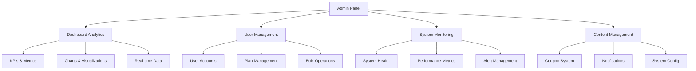

# Admin Panel Overview

## Summary

Comprehensive overview of the Axisor admin panel system, covering dashboard analytics, user management, system monitoring, and administrative controls. This document details the admin panel architecture, features, and operational procedures.

## Admin Panel Architecture



## Admin Panel Components

### Dashboard Analytics

```typescript
// backend/src/controllers/admin.controller.ts
export class AdminController {
  /**
   * Get advanced dashboard KPIs with detailed metrics
   */
  async getAdvancedDashboard(request: FastifyRequest<{ Querystring: { period: string } }>, reply: FastifyReply) {
    const { period = '24h' } = request.query;

    try {
      const now = new Date();
      const periods = {
        '1h': new Date(now.getTime() - 60 * 60 * 1000),
        '24h': new Date(now.getTime() - 24 * 60 * 60 * 1000),
        '7d': new Date(now.getTime() - 7 * 24 * 60 * 60 * 1000),
        '30d': new Date(now.getTime() - 30 * 24 * 60 * 60 * 1000),
      };
      const startDate = periods[period as keyof typeof periods];

      // Get comprehensive metrics
      const [
        userMetrics,
        tradeMetrics,
        paymentMetrics,
        automationMetrics,
        notificationMetrics,
        systemMetrics
      ] = await Promise.all([
        this.getUserMetrics(startDate),
        this.getTradeMetrics(startDate),
        this.getPaymentMetrics(startDate),
        this.getAutomationMetrics(startDate),
        this.getNotificationMetrics(startDate),
        this.getSystemMetrics()
      ]);

      // Calculate growth rates
      const previousPeriod = new Date(startDate.getTime() - (now.getTime() - startDate.getTime()));
      const previousMetrics = await this.getUserMetrics(previousPeriod);

      const growthRate = previousMetrics.total_users > 0
        ? ((userMetrics.total_users - previousMetrics.total_users) / previousMetrics.total_users) * 100
        : 0;

      reply.send({
        success: true,
        data: {
          period,
          kpis: {
            ...userMetrics,
            ...tradeMetrics,
            ...paymentMetrics,
            ...automationMetrics,
            ...notificationMetrics,
            ...systemMetrics,
            growth_rate: Math.round(growthRate * 100) / 100,
          },
          charts: await this.getDashboardCharts(startDate, now),
          alerts: await this.getRecentAlerts(10),
        },
      });
    } catch (error: any) {
      console.error('Error getting advanced dashboard:', error);
      reply.code(500).send({
        success: false,
        error: 'Failed to fetch dashboard data',
      });
    }
  }

  /**
   * Get user-related metrics
   */
  private async getUserMetrics(startDate: Date) {
    const [
      totalUsers,
      activeUsers,
      newUsers,
      usersByPlan,
      topUsers
    ] = await Promise.all([
      prisma.user.count(),
      prisma.user.count({
        where: { last_activity_at: { gte: startDate } },
      }),
      prisma.user.count({
        where: { created_at: { gte: startDate } },
      }),
      prisma.user.groupBy({
        by: ['plan_type'],
        _count: { plan_type: true },
      }),
      prisma.user.findMany({
        take: 5,
        orderBy: { created_at: 'desc' },
        select: {
          id: true,
          email: true,
          username: true,
          plan_type: true,
          created_at: true,
        },
      }),
    ]);

    return {
      total_users: totalUsers,
      active_users: activeUsers,
      new_users: newUsers,
      users_by_plan: usersByPlan.map(p => ({
        plan: p.plan_type,
        count: p._count.plan_type,
      })),
      top_users: topUsers,
    };
  }

  /**
   * Get trade-related metrics
   */
  private async getTradeMetrics(startDate: Date) {
    const tradeStats = await prisma.tradeLog.groupBy({
      by: ['status'],
      where: { executed_at: { gte: startDate } },
      _count: { status: true },
    });

    const successTrades = tradeStats.find(t => t.status === 'completed')?._count.status || 0;
    const failedTrades = tradeStats.filter(t => t.status === 'failed').reduce((sum, t) => sum + t._count.status, 0);
    const totalTrades = successTrades + failedTrades;
    const successRate = totalTrades > 0 ? (successTrades / totalTrades) * 100 : 0;

    return {
      total_trades: totalTrades,
      successful_trades: successTrades,
      failed_trades: failedTrades,
      success_rate: Math.round(successRate * 100) / 100,
    };
  }

  /**
   * Get payment-related metrics
   */
  private async getPaymentMetrics(startDate: Date) {
    const [
      totalRevenue,
      paymentsByStatus,
      recentPayments
    ] = await Promise.all([
      prisma.payment.aggregate({
        where: {
          status: 'paid',
          paid_at: { gte: startDate },
        },
        _sum: { amount_sats: true },
      }),
      prisma.payment.groupBy({
        by: ['status'],
        where: { created_at: { gte: startDate } },
        _count: { status: true },
        _sum: { amount_sats: true },
      }),
      prisma.payment.findMany({
        where: { created_at: { gte: startDate } },
        take: 5,
        orderBy: { created_at: 'desc' },
        select: {
          id: true,
          amount_sats: true,
          status: true,
          plan_type: true,
          user: {
            select: { email: true, username: true },
          },
        },
      }),
    ]);

    return {
      total_revenue: totalRevenue._sum.amount_sats || 0,
      payments_by_status: paymentsByStatus.map(p => ({
        status: p.status,
        count: p._count.status,
        amount: p._sum.amount_sats || 0,
      })),
      recent_payments: recentPayments,
    };
  }
}
```

### User Management System

```typescript
// backend/src/controllers/admin.controller.ts
export class AdminController {
  /**
   * Bulk user operations
   */
  async bulkUserOperation(request: FastifyRequest<{ Body: { operation: string; userIds: string[]; data?: any } }>, reply: FastifyReply) {
    try {
      const body = request.body as {
        operation: string;
        userIds: string[];
        data?: {
          plan_type?: string;
        };
      };
      const { operation, userIds, data } = body;

      let result;

      switch (operation) {
        case 'activate':
          result = await prisma.user.updateMany({
            where: { id: { in: userIds } },
            data: { is_active: true },
          });
          break;

        case 'deactivate':
          result = await prisma.user.updateMany({
            where: { id: { in: userIds } },
            data: { is_active: false },
          });
          break;

        case 'change_plan':
          if (!data.plan_type) {
            return reply.code(400).send({
              success: false,
              error: 'Plan type required for plan change operation',
            });
          }
          result = await prisma.user.updateMany({
            where: { id: { in: userIds } },
            data: { plan_type: data.plan_type },
          });
          break;

        default:
          return reply.code(400).send({
            success: false,
            error: 'Invalid operation',
          });
      }

      // Log bulk operation
      await prisma.systemAlert.create({
        data: {
          message: `Bulk ${operation} operation performed on ${result.count} users`,
          severity: 'info',
          is_global: true,
        },
      });

      reply.send({
        success: true,
        data: {
          operation,
          affected_users: result.count,
        },
      });
    } catch (error: any) {
      console.error('Error performing bulk operation:', error);
      reply.code(500).send({
        success: false,
        error: 'Failed to perform bulk operation',
      });
    }
  }

  /**
   * Export data for backup/reporting
   */
  async exportData(request: FastifyRequest<{ Body: { type: string; format: string; filters?: any } }>, reply: FastifyReply) {
    try {
      const body = request.body as {
        type: string;
        format: string;
        filters?: {
          plan_type?: string;
          start_date?: string;
        };
      };
      const { type, format = 'json', filters } = body;

      let data;

      switch (type) {
        case 'users':
          data = await prisma.user.findMany({
            select: {
              id: true,
              email: true,
              username: true,
              plan_type: true,
              created_at: true,
              last_activity_at: true,
            },
            ...(filters?.plan_type && { where: { plan_type: filters.plan_type } }),
          });
          break;

        case 'trades':
          data = await prisma.tradeLog.findMany({
            include: {
              user: {
                select: { email: true, username: true },
              },
              automation: {
                select: { type: true },
              },
            },
            ...(filters?.start_date && {
              where: { executed_at: { gte: new Date(filters.start_date) } },
            }),
          });
          break;

        case 'payments':
          data = await prisma.payment.findMany({
            include: {
              user: {
                select: { email: true, username: true },
              },
            },
          });
          break;

        default:
          return reply.code(400).send({
            success: false,
            error: 'Invalid export type',
          });
      }

      reply.send({
        success: true,
        data: {
          type,
          format,
          count: data.length,
          exported_data: data,
          export_timestamp: new Date().toISOString(),
        },
      });
    } catch (error: any) {
      console.error('Error exporting data:', error);
      reply.code(500).send({
        success: false,
        error: 'Failed to export data',
      });
    }
  }
}
```

### Admin Routes Configuration

```typescript
// backend/src/routes/admin.routes.ts
export async function adminRoutes(fastify: FastifyInstance) {
  // Dashboard Metrics
  fastify.get('/dashboard/metrics', {
    preHandler: [adminAuthMiddleware],
    schema: {
      tags: ['admin', 'dashboard'],
      response: {
        200: {
          type: 'object',
          properties: {
            totalUsers: { type: 'number' },
            activeUsers: { type: 'number' },
            monthlyRevenue: { type: 'number' },
            totalTrades: { type: 'number' },
            systemUptime: { type: 'number' },
            uptimePercentage: { type: 'number' }
          }
        }
      }
    }
  }, getDashboardMetrics);

  // Trading Analytics
  fastify.get('/trading/analytics', {
    preHandler: [adminAuthMiddleware],
    schema: {
      tags: ['admin', 'trading'],
      querystring: {
        type: 'object',
        properties: {
          search: { type: 'string' },
          planType: { type: 'string' },
          dateFrom: { type: 'string', format: 'date' },
          dateTo: { type: 'string', format: 'date' },
          sortBy: { type: 'string', enum: ['totalTrades', 'winRate', 'pnl', 'createdAt'] },
          sortOrder: { type: 'string', enum: ['asc', 'desc'] },
          page: { type: 'number', minimum: 1 },
          limit: { type: 'number', minimum: 1, maximum: 100 }
        }
      }
    }
  }, getTradingAnalytics);

  // Payment Analytics
  fastify.get('/payments/analytics', {
    preHandler: [adminAuthMiddleware],
    schema: {
      tags: ['admin', 'payments'],
      querystring: {
        type: 'object',
        properties: {
          search: { type: 'string' },
          status: { type: 'string' },
          paymentMethod: { type: 'string' },
          planType: { type: 'string' },
          dateFrom: { type: 'string', format: 'date' },
          dateTo: { type: 'string', format: 'date' },
          sortBy: { type: 'string', enum: ['createdAt', 'paidAt', 'amount', 'amountSats'] },
          sortOrder: { type: 'string', enum: ['asc', 'desc'] },
          page: { type: 'number', minimum: 1 },
          limit: { type: 'number', minimum: 1, maximum: 100 }
        }
      }
    }
  }, getPaymentAnalytics);

  // Audit Logs
  fastify.get('/audit/logs', {
    preHandler: [adminAuthMiddleware],
    schema: {
      tags: ['admin', 'audit'],
      querystring: {
        type: 'object',
        properties: {
          search: { type: 'string' },
          action: { type: 'string' },
          resource: { type: 'string' },
          severity: { type: 'string' },
          userId: { type: 'string' },
          dateFrom: { type: 'string', format: 'date' },
          dateTo: { type: 'string', format: 'date' },
          sortBy: { type: 'string', enum: ['createdAt', 'action', 'severity', 'userId'] },
          sortOrder: { type: 'string', enum: ['asc', 'desc'] },
          page: { type: 'number', minimum: 1 },
          limit: { type: 'number', minimum: 1, maximum: 100 }
        }
      }
    }
  }, getAuditLogs);
}
```

## Responsibilities

### Admin Panel Components

- **Dashboard Analytics**: Real-time KPIs, metrics visualization, and performance monitoring
- **User Management**: Account administration, plan management, and bulk operations
- **System Monitoring**: Health checks, performance metrics, and alert management
- **Content Management**: Coupon system, notifications, and system configuration
- **Audit & Compliance**: Activity logging, security monitoring, and compliance reporting

### Admin Authentication & Authorization

- **Role-based Access**: Admin, Super Admin, and limited admin roles
- **Permission System**: Granular permissions for different admin functions
- **Audit Trail**: Complete logging of all admin actions and changes
- **Session Management**: Secure admin sessions with timeout and validation

## Critical Points

### Security & Access Control

- **Multi-layer Authentication**: Admin accounts require additional verification
- **IP Restrictions**: Admin access limited to specific IP ranges
- **Action Logging**: All admin actions are logged with user, timestamp, and details
- **Permission Validation**: Every admin action is validated against user permissions

### Performance & Scalability

- **Caching Strategy**: Dashboard metrics cached for improved performance
- **Pagination**: All data lists use pagination to handle large datasets
- **Background Processing**: Heavy operations run in background with progress tracking
- **Real-time Updates**: WebSocket connections for live dashboard updates

### Data Management

- **Export Functionality**: Comprehensive data export for reporting and backup
- **Bulk Operations**: Efficient bulk user and system operations
- **Data Validation**: All admin inputs are validated and sanitized
- **Backup Integration**: Automated backup triggers for critical operations

## Evaluation Checklist

- [ ] Admin panel accessible and functional
- [ ] Dashboard metrics accurate and real-time
- [ ] User management operations working correctly
- [ ] Bulk operations handle large datasets efficiently
- [ ] Audit logging captures all admin actions
- [ ] Export functionality generates valid data files
- [ ] Security controls prevent unauthorized access
- [ ] Performance optimized for large user bases
- [ ] Error handling provides clear feedback
- [ ] Mobile responsive design for admin access

## How to Use This Document

- **For Admin Setup**: Use the authentication and authorization sections for admin account configuration
- **For Operations**: Use the dashboard analytics and user management sections for daily admin tasks
- **For Troubleshooting**: Use the audit logs and system monitoring sections for issue investigation
- **For Reporting**: Use the export functionality and metrics sections for generating reports
