# Audit Logs System

## Summary

Comprehensive audit logging system for the Axisor platform, covering user actions, administrative operations, security events, and system changes. This system provides complete traceability of all platform activities for compliance, security monitoring, and operational analysis.

## Audit System Architecture

```mermaid
graph TB
    A[Audit System] --> B[Log Collection]
    A --> C[Event Processing]
    A --> D[Storage Management]
    A --> E[Query Interface]
    A --> F[Analytics]
    
    B --> G[User Actions]
    B --> H[Admin Operations]
    B --> I[Security Events]
    B --> J[System Changes]
    B --> K[API Calls]
    
    C --> L[Event Filtering]
    C --> M[Data Enrichment]
    C --> N[Classification]
    C --> O[Correlation]
    
    D --> P[Structured Storage]
    D --> Q[Indexing]
    D --> R[Retention Policy]
    D --> S[Archival]
    
    E --> T[Search Interface]
    E --> U[Filtering]
    E --> V[Export]
    E --> W[Real-time Monitoring]
    
    F --> X[Security Analytics]
    F --> Y[Compliance Reports]
    F --> Z[Behavior Analysis]
    F --> AA[Anomaly Detection]
```



## Audit Log Management

### Core Audit Logging

```typescript
// backend/src/services/audit-log.service.ts
export interface AuditLogEntry {
  id: string;
  user_id?: string;
  action: string;
  resource: string;
  resource_id?: string;
  details: any;
  severity: 'low' | 'medium' | 'high' | 'critical';
  ip_address?: string;
  user_agent?: string;
  timestamp: Date;
  session_id?: string;
  correlation_id?: string;
}

export enum AuditAction {
  // User Actions
  USER_LOGIN = 'USER_LOGIN',
  USER_LOGOUT = 'USER_LOGOUT',
  USER_REGISTER = 'USER_REGISTER',
  USER_UPDATE_PROFILE = 'USER_UPDATE_PROFILE',
  USER_CHANGE_PASSWORD = 'USER_CHANGE_PASSWORD',
  
  // Admin Actions
  ADMIN_LOGIN = 'ADMIN_LOGIN',
  ADMIN_UPDATE_USER = 'ADMIN_UPDATE_USER',
  ADMIN_DELETE_USER = 'ADMIN_DELETE_USER',
  ADMIN_CHANGE_USER_PLAN = 'ADMIN_CHANGE_USER_PLAN',
  ADMIN_CREATE_COUPON = 'ADMIN_CREATE_COUPON',
  ADMIN_SEND_NOTIFICATION = 'ADMIN_SEND_NOTIFICATION',
  
  // Security Events
  LOGIN_FAILED = 'LOGIN_FAILED',
  UNAUTHORIZED_ACCESS = 'UNAUTHORIZED_ACCESS',
  SUSPICIOUS_ACTIVITY = 'SUSPICIOUS_ACTIVITY',
  PASSWORD_RESET = 'PASSWORD_RESET',
  TWO_FACTOR_ENABLED = 'TWO_FACTOR_ENABLED',
  
  // System Events
  SYSTEM_STARTUP = 'SYSTEM_STARTUP',
  SYSTEM_SHUTDOWN = 'SYSTEM_SHUTDOWN',
  CONFIGURATION_CHANGE = 'CONFIGURATION_CHANGE',
  DATABASE_BACKUP = 'DATABASE_BACKUP',
  
  // Trading Events
  TRADE_EXECUTED = 'TRADE_EXECUTED',
  AUTOMATION_CREATED = 'AUTOMATION_CREATED',
  MARGIN_GUARD_TRIGGERED = 'MARGIN_GUARD_TRIGGERED',
  SIMULATION_STARTED = 'SIMULATION_STARTED'
}

export class AuditLogService {
  private prisma: PrismaClient;

  constructor(prisma: PrismaClient) {
    this.prisma = prisma;
  }

  /**
   * Log audit event
   */
  async logEvent(data: {
    userId?: string;
    action: AuditAction | string;
    resource: string;
    resourceId?: string;
    details?: any;
    severity?: 'low' | 'medium' | 'high' | 'critical';
    ipAddress?: string;
    userAgent?: string;
    sessionId?: string;
    correlationId?: string;
  }): Promise<void> {
    try {
      const auditEntry = await this.prisma.auditLog.create({
        data: {
          user_id: data.userId,
          action: data.action,
          resource: data.resource,
          resource_id: data.resourceId,
          details: data.details || {},
          severity: data.severity || 'medium',
          ip_address: data.ipAddress,
          user_agent: data.userAgent,
          session_id: data.sessionId,
          correlation_id: data.correlationId,
          created_at: new Date()
        }
      });

      console.log('📋 AUDIT LOG - Event logged:', {
        id: auditEntry.id,
        action: data.action,
        resource: data.resource,
        userId: data.userId
      });

    } catch (error) {
      console.error('❌ AUDIT LOG - Failed to log event:', error);
      // Don't throw error to avoid breaking main functionality
    }
  }

  /**
   * Log user action
   */
  async logUserAction(
    userId: string,
    action: AuditAction | string,
    resource: string,
    resourceId?: string,
    details?: any,
    request?: any
  ): Promise<void> {
    await this.logEvent({
      userId,
      action,
      resource,
      resourceId,
      details,
      severity: this.determineSeverity(action),
      ipAddress: request?.ip,
      userAgent: request?.headers?.['user-agent'],
      sessionId: request?.session?.id,
      correlationId: request?.headers?.['x-correlation-id']
    });
  }

  /**
   * Log admin action
   */
  async logAdminAction(
    adminUserId: string,
    action: AuditAction | string,
    resource: string,
    resourceId?: string,
    details?: any,
    request?: any
  ): Promise<void> {
    await this.logEvent({
      userId: adminUserId,
      action,
      resource,
      resourceId,
      details: {
        ...details,
        admin_action: true,
        admin_user: adminUserId
      },
      severity: 'high',
      ipAddress: request?.ip,
      userAgent: request?.headers?.['user-agent'],
      sessionId: request?.session?.id,
      correlationId: request?.headers?.['x-correlation-id']
    });
  }

  /**
   * Log security event
   */
  async logSecurityEvent(
    action: AuditAction | string,
    resource: string,
    resourceId?: string,
    details?: any,
    severity: 'medium' | 'high' | 'critical' = 'high',
    request?: any
  ): Promise<void> {
    await this.logEvent({
      action,
      resource,
      resourceId,
      details: {
        ...details,
        security_event: true,
        timestamp: new Date().toISOString()
      },
      severity,
      ipAddress: request?.ip,
      userAgent: request?.headers?.['user-agent'],
      sessionId: request?.session?.id,
      correlationId: request?.headers?.['x-correlation-id']
    });
  }

  /**
   * Log system event
   */
  async logSystemEvent(
    action: AuditAction | string,
    resource: string,
    details?: any,
    severity: 'low' | 'medium' | 'high' = 'medium'
  ): Promise<void> {
    await this.logEvent({
      action,
      resource,
      details: {
        ...details,
        system_event: true,
        timestamp: new Date().toISOString()
      },
      severity
    });
  }

  /**
   * Get audit logs with filtering
   */
  async getAuditLogs(filters: {
    userId?: string;
    action?: string;
    resource?: string;
    severity?: string;
    dateFrom?: Date;
    dateTo?: Date;
    page?: number;
    limit?: number;
    sortBy?: string;
    sortOrder?: 'asc' | 'desc';
  }): Promise<{
    logs: AuditLogEntry[];
    total: number;
    page: number;
    limit: number;
    totalPages: number;
  }> {
    const {
      userId,
      action,
      resource,
      severity,
      dateFrom,
      dateTo,
      page = 1,
      limit = 50,
      sortBy = 'created_at',
      sortOrder = 'desc'
    } = filters;

    // Build where clause
    const whereClause: any = {};

    if (userId) {
      whereClause.user_id = userId;
    }

    if (action) {
      whereClause.action = action;
    }

    if (resource) {
      whereClause.resource = resource;
    }

    if (severity) {
      whereClause.severity = severity;
    }

    if (dateFrom || dateTo) {
      whereClause.created_at = {};
      if (dateFrom) whereClause.created_at.gte = dateFrom;
      if (dateTo) whereClause.created_at.lte = dateTo;
    }

    // Get logs with pagination
    const offset = (page - 1) * limit;

    const [logs, total] = await Promise.all([
      this.prisma.auditLog.findMany({
        where: whereClause,
        skip: offset,
        take: limit,
        orderBy: { [sortBy]: sortOrder }
      }),
      this.prisma.auditLog.count({ where: whereClause })
    ]);

    return {
      logs: logs.map(log => ({
        id: log.id,
        user_id: log.user_id,
        action: log.action,
        resource: log.resource,
        resource_id: log.resource_id,
        details: log.details,
        severity: log.severity,
        ip_address: log.ip_address,
        user_agent: log.user_agent,
        timestamp: log.created_at,
        session_id: log.session_id,
        correlation_id: log.correlation_id
      })),
      total,
      page,
      limit,
      totalPages: Math.ceil(total / limit)
    };
  }

  /**
   * Get audit statistics
   */
  async getAuditStatistics(dateFrom?: Date, dateTo?: Date): Promise<{
    total_events: number;
    events_by_action: Array<{ action: string; count: number }>;
    events_by_severity: Array<{ severity: string; count: number }>;
    events_by_resource: Array<{ resource: string; count: number }>;
    top_users: Array<{ user_id: string; count: number }>;
    security_events: number;
    admin_events: number;
  }> {
    const whereClause: any = {};
    
    if (dateFrom || dateTo) {
      whereClause.created_at = {};
      if (dateFrom) whereClause.created_at.gte = dateFrom;
      if (dateTo) whereClause.created_at.lte = dateTo;
    }

    const [
      totalEvents,
      eventsByAction,
      eventsBySeverity,
      eventsByResource,
      topUsers,
      securityEvents,
      adminEvents
    ] = await Promise.all([
      this.prisma.auditLog.count({ where: whereClause }),
      
      this.prisma.auditLog.groupBy({
        by: ['action'],
        where: whereClause,
        _count: { action: true },
        orderBy: { _count: { action: 'desc' } },
        take: 10
      }),
      
      this.prisma.auditLog.groupBy({
        by: ['severity'],
        where: whereClause,
        _count: { severity: true }
      }),
      
      this.prisma.auditLog.groupBy({
        by: ['resource'],
        where: whereClause,
        _count: { resource: true },
        orderBy: { _count: { resource: 'desc' } },
        take: 10
      }),
      
      this.prisma.auditLog.groupBy({
        by: ['user_id'],
        where: {
          ...whereClause,
          user_id: { not: null }
        },
        _count: { user_id: true },
        orderBy: { _count: { user_id: 'desc' } },
        take: 10
      }),
      
      this.prisma.auditLog.count({
        where: {
          ...whereClause,
          OR: [
            { severity: 'critical' },
            { action: { contains: 'SECURITY' } },
            { action: { contains: 'UNAUTHORIZED' } }
          ]
        }
      }),
      
      this.prisma.auditLog.count({
        where: {
          ...whereClause,
          details: {
            path: ['admin_action'],
            equals: true
          }
        }
      })
    ]);

    return {
      total_events: totalEvents,
      events_by_action: eventsByAction.map(event => ({
        action: event.action,
        count: event._count.action
      })),
      events_by_severity: eventsBySeverity.map(event => ({
        severity: event.severity,
        count: event._count.severity
      })),
      events_by_resource: eventsByResource.map(event => ({
        resource: event.resource,
        count: event._count.resource
      })),
      top_users: topUsers.map(user => ({
        user_id: user.user_id || 'anonymous',
        count: user._count.user_id
      })),
      security_events: securityEvents,
      admin_events: adminEvents
    };
  }

  /**
   * Determine severity level for action
   */
  private determineSeverity(action: string): 'low' | 'medium' | 'high' | 'critical' {
    const criticalActions = [
      'ADMIN_DELETE_USER',
      'ADMIN_CHANGE_USER_PLAN',
      'UNAUTHORIZED_ACCESS',
      'SUSPICIOUS_ACTIVITY',
      'PASSWORD_RESET'
    ];

    const highActions = [
      'ADMIN_LOGIN',
      'ADMIN_UPDATE_USER',
      'USER_CHANGE_PASSWORD',
      'TWO_FACTOR_ENABLED',
      'CONFIGURATION_CHANGE'
    ];

    const mediumActions = [
      'USER_LOGIN',
      'USER_UPDATE_PROFILE',
      'ADMIN_CREATE_COUPON',
      'TRADE_EXECUTED',
      'AUTOMATION_CREATED'
    ];

    if (criticalActions.includes(action)) {
      return 'critical';
    } else if (highActions.includes(action)) {
      return 'high';
    } else if (mediumActions.includes(action)) {
      return 'medium';
    } else {
      return 'low';
    }
  }

  /**
   * Clean up old audit logs
   */
  async cleanupOldLogs(retentionDays: number = 365): Promise<number> {
    const cutoffDate = new Date();
    cutoffDate.setDate(cutoffDate.getDate() - retentionDays);

    const result = await this.prisma.auditLog.deleteMany({
      where: {
        created_at: {
          lt: cutoffDate
        }
      }
    });

    console.log(`🧹 AUDIT LOG - Cleaned up ${result.count} old audit logs`);
    return result.count;
  }

  /**
   * Export audit logs
   */
  async exportAuditLogs(
    filters: {
      dateFrom?: Date;
      dateTo?: Date;
      userId?: string;
      action?: string;
      resource?: string;
      severity?: string;
    },
    format: 'json' | 'csv' = 'json'
  ): Promise<string> {
    const logs = await this.getAuditLogs({
      ...filters,
      page: 1,
      limit: 10000 // Large limit for export
    });

    if (format === 'csv') {
      const csvHeaders = [
        'ID', 'User ID', 'Action', 'Resource', 'Resource ID',
        'Severity', 'IP Address', 'User Agent', 'Timestamp'
      ].join(',');

      const csvRows = logs.logs.map(log => [
        log.id,
        log.user_id || '',
        log.action,
        log.resource,
        log.resource_id || '',
        log.severity,
        log.ip_address || '',
        log.user_agent || '',
        log.timestamp.toISOString()
      ].map(field => `"${field}"`).join(','));

      return [csvHeaders, ...csvRows].join('\n');
    } else {
      return JSON.stringify(logs.logs, null, 2);
    }
  }
}
```

### Admin Audit Interface

```typescript
// backend/src/controllers/admin.controller.ts
export class AdminController {
  /**
   * Get audit logs with advanced filtering
   */
  async getAuditLogs(request: FastifyRequest<{ Querystring: any }>, reply: FastifyReply) {
    try {
      const query = request.query as {
        search?: string;
        action?: string;
        resource?: string;
        severity?: string;
        userId?: string;
        dateFrom?: string;
        dateTo?: string;
        sortBy?: string;
        sortOrder?: string;
        page?: string;
        limit?: string;
      };

      const {
        search,
        action,
        resource,
        severity,
        userId,
        dateFrom,
        dateTo,
        sortBy = 'createdAt',
        sortOrder = 'desc',
        page = '1',
        limit = '50'
      } = query;

      const pageNum = parseInt(page);
      const limitNum = parseInt(limit);

      const auditLogService = new AuditLogService(prisma);
      
      const result = await auditLogService.getAuditLogs({
        userId,
        action,
        resource,
        severity,
        dateFrom: dateFrom ? new Date(dateFrom) : undefined,
        dateTo: dateTo ? new Date(dateTo) : undefined,
        page: pageNum,
        limit: limitNum,
        sortBy,
        sortOrder: sortOrder as 'asc' | 'desc'
      });

      reply.send({
        success: true,
        data: result.logs,
        pagination: {
          page: result.page,
          limit: result.limit,
          total: result.total,
          totalPages: result.totalPages
        }
      });

    } catch (error: any) {
      console.error('Error getting audit logs:', error);
      reply.code(500).send({
        success: false,
        error: 'Failed to fetch audit logs',
      });
    }
  }

  /**
   * Get audit statistics
   */
  async getAuditStatistics(request: FastifyRequest<{ Querystring: any }>, reply: FastifyReply) {
    try {
      const query = request.query as {
        dateFrom?: string;
        dateTo?: string;
      };

      const { dateFrom, dateTo } = query;

      const auditLogService = new AuditLogService(prisma);
      
      const statistics = await auditLogService.getAuditStatistics(
        dateFrom ? new Date(dateFrom) : undefined,
        dateTo ? new Date(dateTo) : undefined
      );

      reply.send({
        success: true,
        data: statistics
      });

    } catch (error: any) {
      console.error('Error getting audit statistics:', error);
      reply.code(500).send({
        success: false,
        error: 'Failed to fetch audit statistics',
      });
    }
  }

  /**
   * Export audit logs
   */
  async exportAuditLogs(request: FastifyRequest<{ 
    Querystring: any;
    Body: any 
  }>, reply: FastifyReply) {
    try {
      const query = request.query as {
        dateFrom?: string;
        dateTo?: string;
        userId?: string;
        action?: string;
        resource?: string;
        severity?: string;
        format?: string;
      };

      const {
        dateFrom,
        dateTo,
        userId,
        action,
        resource,
        severity,
        format = 'json'
      } = query;

      const auditLogService = new AuditLogService(prisma);
      
      const exportData = await auditLogService.exportAuditLogs({
        dateFrom: dateFrom ? new Date(dateFrom) : undefined,
        dateTo: dateTo ? new Date(dateTo) : undefined,
        userId,
        action,
        resource,
        severity
      }, format as 'json' | 'csv');

      // Set appropriate headers
      if (format === 'csv') {
        reply.header('Content-Type', 'text/csv');
        reply.header('Content-Disposition', 'attachment; filename=audit_logs.csv');
      } else {
        reply.header('Content-Type', 'application/json');
        reply.header('Content-Disposition', 'attachment; filename=audit_logs.json');
      }

      reply.send(exportData);

    } catch (error: any) {
      console.error('Error exporting audit logs:', error);
      reply.code(500).send({
        success: false,
        error: 'Failed to export audit logs',
      });
    }
  }

  /**
   * Clean up old audit logs
   */
  async cleanupAuditLogs(request: FastifyRequest<{ Body: any }>, reply: FastifyReply) {
    try {
      const { retentionDays = 365 } = request.body as { retentionDays?: number };

      const auditLogService = new AuditLogService(prisma);
      
      const deletedCount = await auditLogService.cleanupOldLogs(retentionDays);

      // Log cleanup action
      await auditLogService.logAdminAction(
        (request as any).user.id,
        'CLEANUP_AUDIT_LOGS',
        'audit_log',
        undefined,
        {
          retention_days: retentionDays,
          deleted_count: deletedCount
        },
        request
      );

      reply.send({
        success: true,
        message: `Cleaned up ${deletedCount} old audit logs`,
        data: {
          deleted_count: deletedCount,
          retention_days: retentionDays
        }
      });

    } catch (error: any) {
      console.error('Error cleaning up audit logs:', error);
      reply.code(500).send({
        success: false,
        error: 'Failed to cleanup audit logs',
      });
    }
  }
}
```

## Responsibilities

### Audit Log Collection

- **Event Capture**: Capture all significant events across the platform
- **Data Enrichment**: Add contextual information like IP address, user agent, and session data
- **Classification**: Classify events by severity and type for easy analysis
- **Correlation**: Link related events using correlation IDs

### Compliance & Security

- **Regulatory Compliance**: Meet audit requirements for financial and data protection regulations
- **Security Monitoring**: Track security events and suspicious activities
- **Access Control**: Monitor administrative actions and privilege escalations
- **Data Integrity**: Ensure audit logs cannot be tampered with

## Critical Points

### Performance & Storage

- **Asynchronous Logging**: Non-blocking audit log writes to avoid performance impact
- **Storage Optimization**: Efficient storage and indexing for large volumes of audit data
- **Retention Policies**: Automated cleanup of old audit logs based on retention policies
- **Compression**: Compress old audit logs to save storage space

### Security & Integrity

- **Immutable Logs**: Ensure audit logs cannot be modified or deleted
- **Access Control**: Restrict access to audit logs to authorized personnel only
- **Encryption**: Encrypt sensitive audit log data
- **Backup**: Regular backup of audit logs for disaster recovery

## Evaluation Checklist

- [ ] All significant events are properly logged with complete context
- [ ] Audit logs are immutable and cannot be tampered with
- [ ] Performance impact of audit logging is minimal
- [ ] Search and filtering capabilities work efficiently
- [ ] Export functionality generates accurate data
- [ ] Retention policies are properly enforced
- [ ] Security events are properly classified and monitored
- [ ] Admin actions are comprehensively tracked
- [ ] Compliance requirements are met
- [ ] Audit log storage is optimized for long-term retention

## How to Use This Document

- **For Event Logging**: Use the audit service sections to implement proper event logging
- **For Compliance**: Use the compliance sections to meet regulatory requirements
- **For Security Monitoring**: Use the security sections to track and analyze security events
- **For Operations**: Use the admin interface sections for audit log management and analysis
