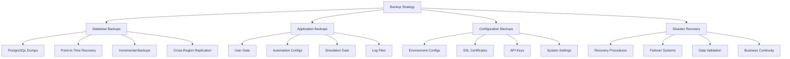

# Backup & Restore Strategy

## Summary

Comprehensive backup and restore strategy for the Axisor platform, covering database backups, application data, configuration files, and disaster recovery procedures. This strategy ensures data protection, business continuity, and rapid recovery from various failure scenarios.

## Backup Architecture



## Backup Service

### Core Backup Management

```typescript
// backend/src/services/backup-restore.service.ts
export interface BackupConfig {
  database: DatabaseBackupConfig;
  application: ApplicationBackupConfig;
  configuration: ConfigBackupConfig;
  storage: StorageConfig;
  schedule: ScheduleConfig;
}

export interface DatabaseBackupConfig {
  enabled: boolean;
  frequency: 'hourly' | 'daily' | 'weekly';
  retention_days: number;
  compression: boolean;
  encryption: boolean;
  incremental: boolean;
}

export interface ApplicationBackupConfig {
  user_data: boolean;
  automation_configs: boolean;
  simulation_data: boolean;
  log_files: boolean;
  retention_days: number;
}

export interface ConfigBackupConfig {
  environment_vars: boolean;
  ssl_certificates: boolean;
  api_keys: boolean;
  system_settings: boolean;
  retention_days: number;
}

export interface StorageConfig {
  local_path: string;
  remote_storage: RemoteStorageConfig[];
  encryption_key: string;
  compression: boolean;
}

export interface RemoteStorageConfig {
  provider: 'aws-s3' | 'gcp-storage' | 'azure-blob' | 'ftp' | 'sftp';
  bucket_name?: string;
  endpoint?: string;
  access_key?: string;
  secret_key?: string;
  region?: string;
  path_prefix: string;
}

export interface ScheduleConfig {
  enabled: boolean;
  cron_expression: string;
  timezone: string;
  parallel_backups: boolean;
  max_concurrent: number;
}

export interface BackupJob {
  id: string;
  type: 'full' | 'incremental' | 'differential';
  status: 'pending' | 'running' | 'completed' | 'failed' | 'cancelled';
  start_time: Date;
  end_time?: Date;
  size_bytes?: number;
  backup_path?: string;
  error_message?: string;
  metadata: BackupMetadata;
}

export interface BackupMetadata {
  database_version: string;
  application_version: string;
  total_tables: number;
  total_records: number;
  compression_ratio: number;
  checksum: string;
}

export class BackupRestoreService {
  private prisma: PrismaClient;
  private config: BackupConfig;
  private backupJobs: Map<string, BackupJob> = new Map();

  constructor(prisma: PrismaClient, config: BackupConfig) {
    this.prisma = prisma;
    this.config = config;
    this.startScheduledBackups();
  }

  /**
   * Perform full system backup
   */
  async performFullBackup(): Promise<BackupJob> {
    const jobId = this.generateJobId();
    const job: BackupJob = {
      id: jobId,
      type: 'full',
      status: 'pending',
      start_time: new Date(),
      metadata: {} as BackupMetadata
    };

    this.backupJobs.set(jobId, job);

    try {
      job.status = 'running';
      console.log(`Starting full backup job: ${jobId}`);

      // Perform backup components in parallel
      const [
        databaseBackup,
        applicationBackup,
        configBackup
      ] = await Promise.all([
        this.backupDatabase(jobId),
        this.backupApplicationData(jobId),
        this.backupConfiguration(jobId)
      ]);

      // Compress and encrypt backup
      const compressedBackup = await this.compressAndEncryptBackup(jobId, {
        database: databaseBackup,
        application: applicationBackup,
        configuration: configBackup
      });

      // Upload to remote storage
      await this.uploadToRemoteStorage(jobId, compressedBackup);

      // Update job status
      job.status = 'completed';
      job.end_time = new Date();
      job.backup_path = compressedBackup.path;
      job.size_bytes = compressedBackup.size;
      job.metadata = await this.generateBackupMetadata(jobId);

      console.log(`Full backup completed: ${jobId}`);

      // Cleanup old backups
      await this.cleanupOldBackups();

      return job;

    } catch (error) {
      job.status = 'failed';
      job.end_time = new Date();
      job.error_message = error.message;
      console.error(`Full backup failed: ${jobId}`, error);
      throw error;
    }
  }

  /**
   * Perform incremental backup
   */
  async performIncrementalBackup(): Promise<BackupJob> {
    const jobId = this.generateJobId();
    const job: BackupJob = {
      id: jobId,
      type: 'incremental',
      status: 'pending',
      start_time: new Date(),
      metadata: {} as BackupMetadata
    };

    this.backupJobs.set(jobId, job);

    try {
      job.status = 'running';
      console.log(`Starting incremental backup job: ${jobId}`);

      // Get last full backup timestamp
      const lastBackup = await this.getLastBackup('full');
      if (!lastBackup) {
        throw new Error('No full backup found. Incremental backup requires a full backup.');
      }

      // Perform incremental database backup
      const databaseBackup = await this.backupDatabaseIncremental(jobId, lastBackup.start_time);

      // Backup changed application data
      const applicationBackup = await this.backupChangedApplicationData(jobId, lastBackup.start_time);

      // Compress and encrypt
      const compressedBackup = await this.compressAndEncryptBackup(jobId, {
        database: databaseBackup,
        application: applicationBackup,
        configuration: null // Configuration rarely changes
      });

      // Upload to remote storage
      await this.uploadToRemoteStorage(jobId, compressedBackup);

      // Update job status
      job.status = 'completed';
      job.end_time = new Date();
      job.backup_path = compressedBackup.path;
      job.size_bytes = compressedBackup.size;
      job.metadata = await this.generateBackupMetadata(jobId);

      console.log(`Incremental backup completed: ${jobId}`);

      return job;

    } catch (error) {
      job.status = 'failed';
      job.end_time = new Date();
      job.error_message = error.message;
      console.error(`Incremental backup failed: ${jobId}`, error);
      throw error;
    }
  }

  /**
   * Backup PostgreSQL database
   */
  private async backupDatabase(jobId: string): Promise<any> {
    try {
      const timestamp = new Date().toISOString().replace(/[:.]/g, '-');
      const backupPath = `${this.config.storage.local_path}/database/${jobId}_${timestamp}.sql`;

      // Create backup directory if it doesn't exist
      await this.ensureDirectoryExists(`${this.config.storage.local_path}/database`);

      // Perform PostgreSQL dump
      const dumpCommand = this.buildPgDumpCommand(backupPath);
      await this.executeCommand(dumpCommand);

      // Verify backup file
      const stats = await fs.stat(backupPath);
      if (stats.size === 0) {
        throw new Error('Database backup file is empty');
      }

      console.log(`Database backup completed: ${backupPath} (${stats.size} bytes)`);

      return {
        path: backupPath,
        size: stats.size,
        timestamp: new Date()
      };

    } catch (error) {
      console.error('Database backup failed:', error);
      throw error;
    }
  }

  /**
   * Backup database incrementally
   */
  private async backupDatabaseIncremental(jobId: string, sinceTimestamp: Date): Promise<any> {
    try {
      const timestamp = new Date().toISOString().replace(/[:.]/g, '-');
      const backupPath = `${this.config.storage.local_path}/database/${jobId}_incremental_${timestamp}.sql`;

      // Create backup directory if it doesn't exist
      await this.ensureDirectoryExists(`${this.config.storage.local_path}/database`);

      // Get changed data since last backup
      const changedData = await this.getChangedDataSince(sinceTimestamp);

      // Write incremental backup
      await fs.writeFile(backupPath, changedData);

      // Verify backup file
      const stats = await fs.stat(backupPath);
      if (stats.size === 0) {
        throw new Error('Incremental backup file is empty');
      }

      console.log(`Incremental database backup completed: ${backupPath} (${stats.size} bytes)`);

      return {
        path: backupPath,
        size: stats.size,
        timestamp: new Date()
      };

    } catch (error) {
      console.error('Incremental database backup failed:', error);
      throw error;
    }
  }

  /**
   * Backup application data
   */
  private async backupApplicationData(jobId: string): Promise<any> {
    try {
      const timestamp = new Date().toISOString().replace(/[:.]/g, '-');
      const backupDir = `${this.config.storage.local_path}/application/${jobId}_${timestamp}`;

      // Create backup directory
      await this.ensureDirectoryExists(backupDir);

      const backupTasks = [];

      // Backup user data if enabled
      if (this.config.application.user_data) {
        backupTasks.push(this.backupUserData(backupDir));
      }

      // Backup automation configs if enabled
      if (this.config.application.automation_configs) {
        backupTasks.push(this.backupAutomationConfigs(backupDir));
      }

      // Backup simulation data if enabled
      if (this.config.application.simulation_data) {
        backupTasks.push(this.backupSimulationData(backupDir));
      }

      // Backup log files if enabled
      if (this.config.application.log_files) {
        backupTasks.push(this.backupLogFiles(backupDir));
      }

      // Execute backup tasks in parallel
      const results = await Promise.all(backupTasks);

      // Calculate total size
      const totalSize = await this.calculateDirectorySize(backupDir);

      console.log(`Application data backup completed: ${backupDir} (${totalSize} bytes)`);

      return {
        path: backupDir,
        size: totalSize,
        timestamp: new Date(),
        components: results
      };

    } catch (error) {
      console.error('Application data backup failed:', error);
      throw error;
    }
  }

  /**
   * Backup changed application data
   */
  private async backupChangedApplicationData(jobId: string, sinceTimestamp: Date): Promise<any> {
    try {
      const timestamp = new Date().toISOString().replace(/[:.]/g, '-');
      const backupDir = `${this.config.storage.local_path}/application/${jobId}_incremental_${timestamp}`;

      // Create backup directory
      await this.ensureDirectoryExists(backupDir);

      const backupTasks = [];

      // Get changed user data
      if (this.config.application.user_data) {
        backupTasks.push(this.backupChangedUserData(backupDir, sinceTimestamp));
      }

      // Get changed automation configs
      if (this.config.application.automation_configs) {
        backupTasks.push(this.backupChangedAutomationConfigs(backupDir, sinceTimestamp));
      }

      // Execute backup tasks in parallel
      const results = await Promise.all(backupTasks);

      // Calculate total size
      const totalSize = await this.calculateDirectorySize(backupDir);

      console.log(`Changed application data backup completed: ${backupDir} (${totalSize} bytes)`);

      return {
        path: backupDir,
        size: totalSize,
        timestamp: new Date(),
        components: results
      };

    } catch (error) {
      console.error('Changed application data backup failed:', error);
      throw error;
    }
  }

  /**
   * Backup configuration files
   */
  private async backupConfiguration(jobId: string): Promise<any> {
    try {
      const timestamp = new Date().toISOString().replace(/[:.]/g, '-');
      const backupDir = `${this.config.storage.local_path}/configuration/${jobId}_${timestamp}`;

      // Create backup directory
      await this.ensureDirectoryExists(backupDir);

      const backupTasks = [];

      // Backup environment variables if enabled
      if (this.config.configuration.environment_vars) {
        backupTasks.push(this.backupEnvironmentVariables(backupDir));
      }

      // Backup SSL certificates if enabled
      if (this.config.configuration.ssl_certificates) {
        backupTasks.push(this.backupSSLCertificates(backupDir));
      }

      // Backup API keys if enabled
      if (this.config.configuration.api_keys) {
        backupTasks.push(this.backupAPIKeys(backupDir));
      }

      // Backup system settings if enabled
      if (this.config.configuration.system_settings) {
        backupTasks.push(this.backupSystemSettings(backupDir));
      }

      // Execute backup tasks in parallel
      const results = await Promise.all(backupTasks);

      // Calculate total size
      const totalSize = await this.calculateDirectorySize(backupDir);

      console.log(`Configuration backup completed: ${backupDir} (${totalSize} bytes)`);

      return {
        path: backupDir,
        size: totalSize,
        timestamp: new Date(),
        components: results
      };

    } catch (error) {
      console.error('Configuration backup failed:', error);
      throw error;
    }
  }

  /**
   * Restore from backup
   */
  async restoreFromBackup(backupId: string, restoreOptions: RestoreOptions): Promise<RestoreJob> {
    const restoreJobId = this.generateJobId();
    const restoreJob: RestoreJob = {
      id: restoreJobId,
      backup_id: backupId,
      status: 'pending',
      start_time: new Date(),
      restore_options: restoreOptions
    };

    try {
      restoreJob.status = 'running';
      console.log(`Starting restore job: ${restoreJobId} from backup: ${backupId}`);

      // Download backup from remote storage
      const backupPath = await this.downloadBackupFromRemote(backupId, restoreJobId);

      // Decrypt and decompress backup
      const decryptedBackup = await this.decryptAndDecompressBackup(backupPath, restoreJobId);

      // Restore components based on options
      const restoreTasks = [];

      if (restoreOptions.restore_database) {
        restoreTasks.push(this.restoreDatabase(decryptedBackup.database, restoreJobId));
      }

      if (restoreOptions.restore_application_data) {
        restoreTasks.push(this.restoreApplicationData(decryptedBackup.application, restoreJobId));
      }

      if (restoreOptions.restore_configuration) {
        restoreTasks.push(this.restoreConfiguration(decryptedBackup.configuration, restoreJobId));
      }

      // Execute restore tasks
      await Promise.all(restoreTasks);

      // Validate restore
      await this.validateRestore(restoreJobId, restoreOptions);

      // Update restore job status
      restoreJob.status = 'completed';
      restoreJob.end_time = new Date();

      console.log(`Restore job completed: ${restoreJobId}`);

      return restoreJob;

    } catch (error) {
      restoreJob.status = 'failed';
      restoreJob.end_time = new Date();
      restoreJob.error_message = error.message;
      console.error(`Restore job failed: ${restoreJobId}`, error);
      throw error;
    }
  }

  /**
   * List available backups
   */
  async listBackups(): Promise<BackupInfo[]> {
    try {
      const backups: BackupInfo[] = [];

      // Get local backups
      const localBackups = await this.getLocalBackups();
      backups.push(...localBackups);

      // Get remote backups
      const remoteBackups = await this.getRemoteBackups();
      backups.push(...remoteBackups);

      // Sort by creation time (newest first)
      return backups.sort((a, b) => b.created_at.getTime() - a.created_at.getTime());

    } catch (error) {
      console.error('Error listing backups:', error);
      throw error;
    }
  }

  /**
   * Verify backup integrity
   */
  async verifyBackup(backupId: string): Promise<BackupVerification> {
    try {
      console.log(`Verifying backup: ${backupId}`);

      // Download backup from remote storage
      const backupPath = await this.downloadBackupFromRemote(backupId, `verify_${backupId}`);

      // Verify file integrity
      const fileIntegrity = await this.verifyFileIntegrity(backupPath);

      // Verify database backup if present
      const databaseIntegrity = await this.verifyDatabaseBackup(backupPath);

      // Verify application data if present
      const applicationIntegrity = await this.verifyApplicationData(backupPath);

      const verification: BackupVerification = {
        backup_id: backupId,
        verified: fileIntegrity && databaseIntegrity && applicationIntegrity,
        file_integrity: fileIntegrity,
        database_integrity: databaseIntegrity,
        application_integrity: applicationIntegrity,
        verified_at: new Date()
      };

      console.log(`Backup verification completed: ${backupId} - ${verification.verified ? 'PASSED' : 'FAILED'}`);

      return verification;

    } catch (error) {
      console.error(`Backup verification failed: ${backupId}`, error);
      throw error;
    }
  }

  /**
   * Helper methods
   */
  private generateJobId(): string {
    return `backup_${Date.now()}_${Math.random().toString(36).substr(2, 9)}`;
  }

  private async ensureDirectoryExists(path: string): Promise<void> {
    try {
      await fs.mkdir(path, { recursive: true });
    } catch (error) {
      if (error.code !== 'EEXIST') {
        throw error;
      }
    }
  }

  private buildPgDumpCommand(outputPath: string): string {
    const dbUrl = process.env.DATABASE_URL;
    const options = [
      '--verbose',
      '--no-owner',
      '--no-privileges',
      '--format=plain',
      '--encoding=UTF8'
    ];

    if (this.config.database.compression) {
      options.push('--compress=9');
    }

    return `pg_dump ${options.join(' ')} "${dbUrl}" > "${outputPath}"`;
  }

  private async executeCommand(command: string): Promise<void> {
    return new Promise((resolve, reject) => {
      exec(command, (error, stdout, stderr) => {
        if (error) {
          reject(new Error(`Command failed: ${error.message}`));
          return;
        }
        if (stderr && !stderr.includes('NOTICE')) {
          reject(new Error(`Command stderr: ${stderr}`));
          return;
        }
        resolve();
      });
    });
  }

  private async calculateDirectorySize(path: string): Promise<number> {
    let totalSize = 0;
    const files = await fs.readdir(path, { withFileTypes: true });

    for (const file of files) {
      const filePath = `${path}/${file.name}`;
      if (file.isDirectory()) {
        totalSize += await this.calculateDirectorySize(filePath);
      } else {
        const stats = await fs.stat(filePath);
        totalSize += stats.size;
      }
    }

    return totalSize;
  }

  private startScheduledBackups(): void {
    if (!this.config.schedule.enabled) {
      return;
    }

    const cron = require('node-cron');
    cron.schedule(this.config.schedule.cron_expression, async () => {
      try {
        if (this.config.schedule.parallel_backups) {
          await this.performScheduledBackup();
        } else {
          await this.performFullBackup();
        }
      } catch (error) {
        console.error('Scheduled backup failed:', error);
      }
    }, {
      timezone: this.config.schedule.timezone
    });
  }

  private async performScheduledBackup(): Promise<void> {
    // Determine backup type based on schedule
    const now = new Date();
    const lastFullBackup = await this.getLastBackup('full');
    
    if (!lastFullBackup || this.shouldPerformFullBackup(lastFullBackup.start_time, now)) {
      await this.performFullBackup();
    } else {
      await this.performIncrementalBackup();
    }
  }

  private shouldPerformFullBackup(lastFullBackup: Date, now: Date): boolean {
    // Perform full backup weekly
    const daysSinceLastFull = (now.getTime() - lastFullBackup.getTime()) / (1000 * 60 * 60 * 24);
    return daysSinceLastFull >= 7;
  }

  private async cleanupOldBackups(): Promise<void> {
    try {
      const retentionDays = Math.min(
        this.config.database.retention_days,
        this.config.application.retention_days,
        this.config.configuration.retention_days
      );

      const cutoffDate = new Date(Date.now() - retentionDays * 24 * 60 * 60 * 1000);

      // Cleanup local backups
      await this.cleanupLocalBackups(cutoffDate);

      // Cleanup remote backups
      await this.cleanupRemoteBackups(cutoffDate);

    } catch (error) {
      console.error('Backup cleanup failed:', error);
    }
  }

  // Additional helper methods would be implemented here...
}

interface RestoreOptions {
  restore_database: boolean;
  restore_application_data: boolean;
  restore_configuration: boolean;
  restore_to_timestamp?: Date;
  skip_validation?: boolean;
}

interface RestoreJob {
  id: string;
  backup_id: string;
  status: 'pending' | 'running' | 'completed' | 'failed' | 'cancelled';
  start_time: Date;
  end_time?: Date;
  restore_options: RestoreOptions;
  error_message?: string;
}

interface BackupInfo {
  id: string;
  type: 'full' | 'incremental' | 'differential';
  created_at: Date;
  size_bytes: number;
  location: 'local' | 'remote';
  path: string;
  metadata: BackupMetadata;
}

interface BackupVerification {
  backup_id: string;
  verified: boolean;
  file_integrity: boolean;
  database_integrity: boolean;
  application_integrity: boolean;
  verified_at: Date;
}
```

## Responsibilities

### Backup Management

- **Scheduled Backups**: Automatically perform backups based on schedule
- **Multiple Backup Types**: Support full, incremental, and differential backups
- **Data Compression**: Compress backups to save storage space
- **Encryption**: Encrypt backups for security

### Restore Operations

- **Point-in-Time Recovery**: Restore to specific timestamps
- **Selective Restore**: Restore specific components or data
- **Validation**: Validate restored data integrity
- **Rollback Support**: Support rollback operations

## Critical Points

### Data Protection

- **Regular Backups**: Ensure backups are performed regularly
- **Multiple Storage Locations**: Store backups in multiple locations
- **Encryption**: Encrypt sensitive backup data
- **Access Control**: Control access to backup files

### Recovery Procedures

- **Fast Recovery**: Minimize recovery time objectives
- **Data Integrity**: Ensure restored data is complete and accurate
- **Testing**: Regularly test restore procedures
- **Documentation**: Maintain clear recovery procedures

## Evaluation Checklist

- [ ] Backup strategy covers all critical data
- [ ] Backups are performed automatically on schedule
- [ ] Multiple backup types are supported
- [ ] Backup data is encrypted and secure
- [ ] Restore procedures are tested and documented
- [ ] Recovery time objectives are met
- [ ] Backup integrity is verified regularly
- [ ] Old backups are cleaned up appropriately
- [ ] Backup storage is monitored and managed
- [ ] Disaster recovery procedures are comprehensive

## How to Use This Document

- **For Backup Configuration**: Use the backup config sections to set up automated backups
- **For Manual Backups**: Use the backup methods to perform manual backups
- **For Restore Operations**: Use the restore sections to recover from backups
- **For Disaster Recovery**: Use the disaster recovery sections for emergency procedures
