# Coupon Management System

## Summary

Comprehensive coupon management system for the Axisor platform, covering coupon creation, validation, usage tracking, analytics, and promotional campaigns. This system enables administrators to create discount coupons, track their performance, and analyze their impact on user acquisition and revenue.

## Coupon System Architecture

```mermaid
graph TB
    A[Coupon System] --> B[Coupon Creation]
    A --> C[Validation Engine]
    A --> D[Usage Tracking]
    A --> E[Analytics Dashboard]
    A --> F[Campaign Management]
    
    B --> G[Coupon Types]
    B --> H[Value Configuration]
    B --> I[Expiration Settings]
    B --> J[Usage Limits]
    
    C --> K[Code Validation]
    C --> L[Plan Compatibility]
    C --> M[Usage Limits Check]
    C --> N[Expiration Check]
    
    D --> O[Usage Analytics]
    D --> P[Revenue Tracking]
    D --> Q[User Attribution]
    D --> R[Performance Metrics]
    
    E --> S[Coupon Performance]
    E --> T[Conversion Rates]
    E --> U[Revenue Impact]
    E --> V[User Behavior]
    
    F --> W[Campaign Creation]
    F --> X[Targeting Rules]
    F --> Y[Automated Distribution]
    F --> Z[Campaign Analytics]
```



## Coupon Management Service

### Core Coupon Operations

```typescript
// backend/src/services/coupon.service.ts
export class CouponService {
  private prisma: PrismaClient;

  constructor(prisma: PrismaClient) {
    this.prisma = prisma;
  }

  /**
   * Create a new coupon with comprehensive validation
   */
  async createCoupon(data: CreateCouponRequest, createdBy?: string): Promise<CouponResponse> {
    try {
      console.log('🔍 COUPON SERVICE - Starting createCoupon...');
      console.log('📤 COUPON SERVICE - Received data:', JSON.stringify(data, null, 2));
      console.log('📤 COUPON SERVICE - Created by:', createdBy);
      
      const { 
        code, 
        plan_type, 
        usage_limit, 
        expires_at,
        value_type,
        value_amount,
        time_type,
        time_days,
        description,
        is_active = true
      } = data as { 
        code: string; 
        plan_type: string; 
        usage_limit?: number; 
        expires_at?: string;
        value_type: string;
        value_amount: number;
        time_type: string;
        time_days?: number;
        description?: string;
        is_active?: boolean;
      };

      console.log('🔍 COUPON SERVICE - Extracted fields:', {
        code,
        plan_type,
        usage_limit,
        expires_at,
        value_type,
        value_amount,
        time_type,
        time_days,
        description,
        is_active
      });

      // Check if coupon code already exists
      console.log('🔍 COUPON SERVICE - Checking if coupon code exists...');
      const existingCoupon = await this.prisma.coupon.findUnique({
        where: { code },
      });

      if (existingCoupon) {
        console.log('❌ COUPON SERVICE - Coupon code already exists:', code);
        throw new Error('Coupon code already exists');
      }

      console.log('✅ COUPON SERVICE - Coupon code is available');

      // Validate coupon configuration
      console.log('🔍 COUPON SERVICE - Validating coupon configuration...');
      this.validateCouponConfiguration({
        value_type,
        value_amount,
        time_type,
        ...(time_days !== undefined && { time_days })
      });

      console.log('✅ COUPON SERVICE - Configuration validated');

      // Create coupon
      console.log('🔍 COUPON SERVICE - Creating coupon in database...');
      const coupon = await this.prisma.coupon.create({
        data: {
          code,
          plan_type: plan_type as PlanType,
          usage_limit: usage_limit ?? null,
          expires_at: expires_at ? new Date(expires_at) : null,
          value_type,
          value_amount,
          time_type,
          time_days: time_type === 'fixed' ? (time_days ?? null) : null,
          description: description ?? null,
          is_active,
          created_by: createdBy ?? null,
        },
      });

      console.log('✅ COUPON SERVICE - Coupon created in database:', coupon.id);

      const response = this.mapCouponToResponse(coupon);
      console.log('✅ COUPON SERVICE - Mapped response:', response);
      
      return response;
    } catch (error: any) {
      console.error('❌ COUPON SERVICE - Error in createCoupon:', error);
      console.error('❌ COUPON SERVICE - Error type:', typeof error);
      console.error('❌ COUPON SERVICE - Error message:', error.message);
      console.error('❌ COUPON SERVICE - Error stack:', error.stack);
      throw error;
    }
  }

  /**
   * Validate coupon configuration
   */
  private validateCouponConfiguration(config: {
    value_type: string;
    value_amount: number;
    time_type: string;
    time_days?: number;
  }): void {
    const { value_type, value_amount, time_type, time_days } = config;

    // Validate value type and amount
    if (value_type === 'percentage' && (value_amount < 1 || value_amount > 100)) {
      throw new Error('Percentage value must be between 1 and 100');
    }

    if (value_type === 'fixed' && (value_amount < 1 || value_amount > 1000000)) {
      throw new Error('Fixed value must be between 1 and 1,000,000 sats');
    }

    // Validate time type and days
    if (time_type === 'fixed' && (!time_days || time_days < 1 || time_days > 3650)) {
      throw new Error('Fixed time type requires time_days between 1 and 3650');
    }

    if (time_type === 'lifetime' && time_days) {
      throw new Error('Lifetime time type cannot have time_days');
    }
  }

  /**
   * Get coupon dashboard metrics
   */
  async getCouponDashboard(): Promise<any> {
    const [
      totalCoupons,
      activeCoupons,
      inactiveCoupons,
      totalUses,
      totalRevenueSaved,
      totalNewUsers,
      topCoupons,
      recentActivity,
      dailyMetrics
    ] = await Promise.all([
      // Total coupons
      this.prisma.coupon.count(),
      
      // Active coupons
      this.prisma.coupon.count({
        where: { is_active: true }
      }),
      
      // Inactive coupons
      this.prisma.coupon.count({
        where: { is_active: false }
      }),
      
      // Total uses
      this.prisma.userCoupon.count(),
      
      // Total revenue saved
      this.prisma.coupon.aggregate({
        _sum: { total_revenue_saved: true }
      }),
      
      // Total new users
      this.prisma.coupon.aggregate({
        _sum: { new_users_count: true }
      }),
      
      // Top coupons by usage
      this.prisma.coupon.findMany({
        orderBy: { used_count: 'desc' },
        take: 5,
        select: {
          id: true,
          code: true,
          used_count: true,
          total_revenue_saved: true,
          conversion_rate: true,
        }
      }),
      
      // Recent activity (simplified for now)
      this.prisma.coupon.findMany({
        orderBy: { updated_at: 'desc' },
        take: 10,
        select: {
          id: true,
          code: true,
          updated_at: true,
        }
      }),
      
      // Daily metrics for last 30 days
      this.prisma.couponAnalytics.findMany({
        where: {
          date: {
            gte: new Date(Date.now() - 30 * 24 * 60 * 60 * 1000)
          }
        },
        orderBy: { date: 'asc' },
        select: {
          date: true,
          views_count: true,
          clicks_count: true,
          uses_count: true,
          new_users_count: true,
          revenue_saved: true,
        }
      })
    ]);

    // Calculate average conversion rate
    const averageConversionRate = totalCoupons > 0 
      ? await this.prisma.coupon.aggregate({
          _avg: { conversion_rate: true }
        }).then(result => result._avg.conversion_rate || 0)
      : 0;

    return {
      total_coupons: totalCoupons,
      active_coupons: activeCoupons,
      inactive_coupons: inactiveCoupons,
      total_uses: totalUses,
      total_revenue_saved: totalRevenueSaved._sum.total_revenue_saved || 0,
      total_new_users: totalNewUsers._sum.new_users_count || 0,
      average_conversion_rate: averageConversionRate,
      top_coupons: topCoupons,
      recent_activity: recentActivity.map(activity => ({
        id: activity.id,
        code: activity.code,
        action: 'updated',
        timestamp: activity.updated_at.toISOString(),
      })),
      daily_metrics: dailyMetrics.map(metric => ({
        date: metric.date.toISOString(),
        views: metric.views_count,
        clicks: metric.clicks_count,
        uses: metric.uses_count,
        new_users: metric.new_users_count,
        revenue_saved: metric.revenue_saved,
      })),
    };
  }

  /**
   * Track coupon analytics
   */
  async trackCouponAnalytics(couponId: string, event: 'view' | 'click' | 'use', newUser = false, revenueSaved = 0): Promise<void> {
    const today = new Date();
    today.setHours(0, 0, 0, 0);

    // Get or create analytics record for today
    let analytics = await this.prisma.couponAnalytics.findUnique({
      where: {
        coupon_id_date: {
          coupon_id: couponId,
          date: today,
        }
      }
    });

    if (!analytics) {
      analytics = await this.prisma.couponAnalytics.create({
        data: {
          coupon_id: couponId,
          date: today,
          views_count: 0,
          clicks_count: 0,
          uses_count: 0,
          new_users_count: 0,
          revenue_saved: 0,
          conversion_rate: 0,
          click_through_rate: 0,
        }
      });
    }

    // Update metrics based on event
    const updateData: any = {};
    
    switch (event) {
      case 'view':
        updateData.views_count = { increment: 1 };
        break;
      case 'click':
        updateData.clicks_count = { increment: 1 };
        break;
      case 'use':
        updateData.uses_count = { increment: 1 };
        updateData.revenue_saved = { increment: revenueSaved };
        if (newUser) {
          updateData.new_users_count = { increment: 1 };
        }
        break;
    }

    // Update analytics
    await this.prisma.couponAnalytics.update({
      where: { id: analytics.id },
      data: updateData,
    });

    // Recalculate conversion rates
    const updatedAnalytics = await this.prisma.couponAnalytics.findUnique({
      where: { id: analytics.id },
    });

    if (updatedAnalytics) {
      const conversionRate = updatedAnalytics.views_count > 0 
        ? (updatedAnalytics.uses_count / updatedAnalytics.views_count) * 100 
        : 0;
      
      const clickThroughRate = updatedAnalytics.views_count > 0 
        ? (updatedAnalytics.clicks_count / updatedAnalytics.views_count) * 100 
        : 0;

      await this.prisma.couponAnalytics.update({
        where: { id: analytics.id },
        data: {
          conversion_rate: conversionRate,
          click_through_rate: clickThroughRate,
        }
      });
    }

    // Update coupon totals
    await this.prisma.coupon.update({
      where: { id: couponId },
      data: {
        total_revenue_saved: { increment: revenueSaved },
        ...(newUser && { new_users_count: { increment: 1 } }),
        conversion_rate: await this.calculateCouponConversionRate(couponId),
      }
    });
  }

  /**
   * Validate coupon code
   */
  async validateCoupon(code: string): Promise<{
    valid: boolean;
    coupon?: CouponResponse;
    error?: string;
  }> {
    try {
      const coupon = await this.getCouponByCode(code);

      if (!coupon) {
        return {
          valid: false,
          error: 'Coupon code not found',
        };
      }

      // Check if coupon has expired
      if (coupon.expires_at && new Date(coupon.expires_at) < new Date()) {
        return {
          valid: false,
          error: 'Coupon has expired',
        };
      }

      // Check if usage limit has been reached
      if ((coupon.used_count ?? 0) >= (coupon.usage_limit ?? 0)) {
        return {
          valid: false,
          error: 'Coupon usage limit exceeded',
        };
      }

      return {
        valid: true,
        coupon,
      };
    } catch (error) {
      return {
        valid: false,
        error: error instanceof Error ? error.message : 'Unknown error',
      };
    }
  }

  /**
   * Use coupon (increment usage count)
   */
  async useCoupon(code: string, userId: string): Promise<CouponResponse> {
    // Validate coupon first
    const validation = await this.validateCoupon(code);
    if (!validation.valid) {
      throw new Error(validation.error || 'Invalid coupon');
    }

    // Check if user has already used this coupon
    const existingUsage = await this.prisma.userCoupon.findUnique({
      where: {
        user_id_coupon_id: {
          user_id: userId,
          coupon_id: validation.coupon!.id,
        },
      },
    });

    if (existingUsage) {
      throw new Error('User has already used this coupon');
    }

    // Use coupon
    const [updatedCoupon] = await this.prisma.$transaction([
      // Update coupon usage count
      this.prisma.coupon.update({
        where: { code },
        data: {
          used_count: {
            increment: 1,
          },
        },
      }),
      // Create user coupon record
      this.prisma.userCoupon.create({
        data: {
          user_id: userId,
          coupon_id: validation.coupon!.id,
        },
      }),
    ]);

    return this.mapCouponToResponse(updatedCoupon);
  }

  /**
   * Generate random coupon code
   */
  generateCouponCode(prefix: string = '', length: number = 8): string {
    const chars = 'ABCDEFGHIJKLMNOPQRSTUVWXYZ0123456789';
    let result = prefix;

    for (let i = 0; i < length; i++) {
      result += chars.charAt(Math.floor(Math.random() * chars.length));
    }

    return result;
  }

  /**
   * Create testers coupon (for MVP)
   */
  async createTestersCoupon(
    planType: PlanType = PlanType.PRO,
    usageLimit: number = 30
  ): Promise<CouponResponse> {
    const code = this.generateCouponCode('TESTER', 6);

    return this.createCoupon({
      code,
      plan_type: planType,
      usage_limit: usageLimit,
      expires_at: undefined, // No expiration for testers
      value_type: 'PERCENTAGE' as any,
      value_amount: 100,
      time_type: 'LIFETIME' as any,
      is_active: true,
    });
  }

  /**
   * Get coupon analytics
   */
  async getCouponAnalytics(): Promise<{
    total_coupons: number;
    active_coupons: number;
    expired_coupons: number;
    total_uses: number;
    most_popular_plan: PlanType | null;
    recent_activity: Array<{
      coupon_code: string;
      plan_type: PlanType;
      used_count: number;
      created_at: string;
    }>;
  }> {
    const [
      totalCoupons,
      activeCoupons,
      expiredCoupons,
      totalUses,
      recentCoupons,
    ] = await Promise.all([
      this.prisma.coupon.count(),
      this.prisma.coupon.count({
        where: {
          OR: [{ expires_at: null }, { expires_at: { gt: new Date() } }],
        },
      }),
      this.prisma.coupon.count({
        where: {
          expires_at: { lt: new Date() },
        },
      }),
      this.prisma.coupon.aggregate({
        _sum: { used_count: true },
      }),
      this.prisma.coupon.findMany({
        orderBy: { created_at: 'desc' },
        take: 10,
        select: {
          code: true,
          plan_type: true,
          used_count: true,
          created_at: true,
        },
      }),
    ]);

    // Get most popular plan
    const planStats = await this.prisma.coupon.groupBy({
      by: ['plan_type'],
      _sum: { used_count: true },
      orderBy: { _sum: { used_count: 'desc' } },
      take: 1,
    });

    const mostPopularPlan = (planStats[0]?.plan_type as PlanType) || null;

    return {
      total_coupons: totalCoupons,
      active_coupons: activeCoupons,
      expired_coupons: expiredCoupons,
      total_uses: totalUses._sum.used_count || 0,
      most_popular_plan: mostPopularPlan,
      recent_activity: recentCoupons.map(coupon => ({
        coupon_code: coupon.code,
        plan_type: coupon.plan_type as PlanType,
        used_count: coupon.used_count ?? 0,
        created_at: coupon.created_at.toISOString(),
      })),
    };
  }
}
```

### Coupon Analytics Dashboard

```typescript
// backend/src/controllers/admin.controller.ts
export class AdminController {
  /**
   * Advanced coupon management
   */
  async createCoupon(request: FastifyRequest<{ Body: any }>, reply: FastifyReply) {
    try {
      const couponData = request.body as {
        code: string;
        plan_type: string;
        usage_limit: number;
        expires_at?: string;
        value_type?: string;
        value_amount?: number;
        time_type?: string;
        time_days?: number;
        description?: string;
        is_active?: boolean;
      };

      const coupon = await prisma.coupon.create({
        data: {
          code: couponData.code,
          plan_type: couponData.plan_type as any,
          usage_limit: couponData.usage_limit,
          expires_at: couponData.expires_at ? new Date(couponData.expires_at) : null,
          value_type: couponData.value_type || 'fixed',
          value_amount: couponData.value_amount || 0,
          time_type: couponData.time_type || 'fixed',
          time_days: couponData.time_days,
          description: couponData.description,
          is_active: couponData.is_active ?? true,
        },
      });

      reply.send({
        success: true,
        data: coupon,
      });
    } catch (error: any) {
      console.error('Error creating coupon:', error);
      reply.code(500).send({
        success: false,
        error: 'Failed to create coupon',
      });
    }
  }

  /**
   * Get coupon analytics
   */
  async getCouponAnalytics(request: FastifyRequest<{ Params: { id: string } }>, reply: FastifyReply) {
    try {
      const { id } = request.params;

      const [coupon, usageStats, recentUses] = await Promise.all([
        prisma.coupon.findUnique({
          where: { id },
          include: { _count: { select: { user_coupons: true } } },
        }),
        prisma.userCoupon.groupBy({
          by: ['used_at'],
          where: { coupon_id: id },
          _count: { used_at: true },
          orderBy: { used_at: 'desc' },
          take: 30,
        }),
        prisma.userCoupon.findMany({
          where: { coupon_id: id },
          take: 10,
          orderBy: { used_at: 'desc' },
          include: {
            user: {
              select: { email: true, username: true },
            },
          },
        }),
      ]);

      if (!coupon) {
        return reply.code(404).send({
          success: false,
          error: 'Coupon not found',
        });
      }

      const totalUses = coupon._count.user_coupons;
      const conversionRate = coupon.usage_limit > 0 ? (totalUses / coupon.usage_limit) * 100 : 0;

      reply.send({
        success: true,
        data: {
          coupon: {
            ...coupon,
            usage_count: totalUses,
            remaining_uses: coupon.usage_limit - totalUses,
            conversion_rate: Math.round(conversionRate * 100) / 100,
          },
          usage_stats: usageStats.map(stat => ({
            date: stat.used_at,
            uses: stat._count.used_at,
          })),
          recent_uses: recentUses,
        },
      });
    } catch (error: any) {
      console.error('Error getting coupon analytics:', error);
      reply.code(500).send({
        success: false,
        error: 'Failed to get coupon analytics',
      });
    }
  }

  /**
   * Update coupon
   */
  async updateCoupon(request: FastifyRequest<{ Params: { id: string }; Body: any }>, reply: FastifyReply) {
    try {
      const { id } = request.params;
      const updateData = request.body as {
        usage_limit?: number;
        expires_at?: string;
        is_active?: boolean;
        description?: string;
      };

      const coupon = await prisma.coupon.update({
        where: { id },
        data: {
          ...(updateData.usage_limit && { usage_limit: updateData.usage_limit }),
          ...(updateData.expires_at && { expires_at: new Date(updateData.expires_at) }),
          ...(updateData.is_active !== undefined && { is_active: updateData.is_active }),
          ...(updateData.description !== undefined && { description: updateData.description }),
          updated_at: new Date(),
        },
      });

      reply.send({
        success: true,
        data: coupon,
      });
    } catch (error: any) {
      console.error('Error updating coupon:', error);
      reply.code(500).send({
        success: false,
        error: 'Failed to update coupon',
      });
    }
  }
}
```

## Responsibilities

### Coupon Creation & Management

- **Coupon Configuration**: Create coupons with various discount types and expiration rules
- **Code Generation**: Generate unique coupon codes with customizable prefixes and formats
- **Validation Logic**: Comprehensive validation of coupon codes and usage eligibility
- **Usage Tracking**: Track coupon usage, conversion rates, and revenue impact

### Analytics & Reporting

- **Performance Metrics**: Track coupon performance including views, clicks, and conversions
- **Revenue Analytics**: Monitor revenue saved and user acquisition through coupons
- **Campaign Analysis**: Analyze coupon campaign effectiveness and ROI
- **User Behavior**: Track how coupons influence user behavior and plan upgrades

## Critical Points

### Security & Validation

- **Code Uniqueness**: Ensure coupon codes are unique and cannot be duplicated
- **Usage Limits**: Enforce usage limits and prevent abuse of coupon codes
- **Expiration Handling**: Proper handling of expired coupons with clear error messages
- **User Validation**: Prevent users from using the same coupon multiple times

### Performance & Analytics

- **Real-time Tracking**: Efficient tracking of coupon events without performance impact
- **Analytics Accuracy**: Accurate calculation of conversion rates and revenue metrics
- **Data Retention**: Proper storage and retention of coupon analytics data
- **Campaign Optimization**: Data-driven insights for improving coupon effectiveness

## Evaluation Checklist

- [ ] Coupon creation process works correctly with all validation rules
- [ ] Coupon codes are unique and cannot be duplicated
- [ ] Usage limits are enforced properly across all scenarios
- [ ] Expiration dates are handled correctly with proper validation
- [ ] Analytics tracking captures all relevant metrics accurately
- [ ] Revenue calculations are correct and match actual savings
- [ ] Conversion rate calculations are accurate and meaningful
- [ ] Admin interface allows full coupon management capabilities
- [ ] Performance is optimized for high-volume coupon usage
- [ ] Error handling provides clear feedback for all failure scenarios

## How to Use This Document

- **For Coupon Creation**: Use the coupon creation sections to set up new discount campaigns
- **For Analytics**: Use the analytics sections to monitor coupon performance and ROI
- **For Campaign Management**: Use the campaign sections to manage promotional activities
- **For Troubleshooting**: Use the validation sections to debug coupon-related issues
