# Administrative Notification System

## Summary

Comprehensive administrative notification system for the Axisor platform, covering system alerts, user notifications, admin communications, and automated monitoring. This system enables administrators to send targeted notifications, monitor system events, and maintain effective communication with users.

## Notification System Architecture

```mermaid
graph TB
    A[Notification System] --> B[Central Service]
    A --> C[Channel Management]
    A --> D[Template Engine]
    A --> E[Delivery Engine]
    A --> F[Analytics]
    
    B --> G[Notification Central]
    B --> H[Event Processing]
    B --> I[Queue Management]
    B --> J[Retry Logic]
    
    C --> K[In-App Notifications]
    C --> L[Email Notifications]
    C --> M[Push Notifications]
    C --> N[SMS Notifications]
    C --> O[Webhook Notifications]
    
    D --> P[Template Library]
    D --> Q[Variable Substitution]
    D --> R[Localization]
    D --> S[Custom Templates]
    
    E --> T[Delivery Scheduling]
    E --> U[Rate Limiting]
    E --> V[Failure Handling]
    E --> W[Delivery Tracking]
    
    F --> X[Delivery Analytics]
    F --> Y[Performance Metrics]
    F --> Z[User Engagement]
    F --> AA[Campaign Analysis]
```



## Notification Central Service

### Core Notification Management

```typescript
// backend/src/services/notification-central.service.ts
export interface NotificationData {
  userId: string;
  type: 'margin_guard' | 'tp_sl' | 'auto_entry' | 'system' | 'security';
  priority: 'low' | 'medium' | 'high' | 'critical';
  title: string;
  message: string;
  metadata?: any;
}

export interface UserNotificationPreferences {
  userId: string;
  enabledChannels: NotificationChannel[];
  preferences: {
    push: boolean;
    email: boolean;
    sms: boolean;
    inApp: boolean;
  };
}

export type NotificationChannel = 'push' | 'email' | 'sms' | 'in_app';

export interface InAppNotification {
  id: string;
  user_id: string;
  type: string;
  title: string;
  message: string;
  metadata: any;
  read: boolean;
  created_at: Date;
}

export class NotificationCentralService extends EventEmitter {
  private prisma: PrismaClient;
  private preferencesCache: Map<string, UserNotificationPreferences> = new Map();
  private cacheExpiry: Map<string, number> = new Map();
  private readonly CACHE_DURATION = 300000; // 5 minutes

  constructor(prisma: PrismaClient) {
    super();
    this.prisma = prisma;
  }

  /**
   * Método principal para enviar notificações
   */
  async notify(data: NotificationData): Promise<void> {
    try {
      console.log('📢 NOTIFICATION CENTRAL - Sending notification:', {
        userId: data.userId,
        type: data.type,
        priority: data.priority,
        title: data.title
      });

      // 1. Buscar preferências do usuário
      const preferences = await this.getUserNotificationPreferences(data.userId);

      // 2. Enviar para canais ativados
      for (const channel of preferences.enabledChannels) {
        try {
          await this.sendToChannel(channel, data);
        } catch (error) {
          console.error(`❌ NOTIFICATION CENTRAL - Failed to send to ${channel}:`, error);
          // Continue com outros canais mesmo se um falhar
        }
      }

      // 3. Registrar notificação in-app (sempre)
      await this.createInAppNotification(data);

      // 4. Emitir evento para outros serviços
      this.emit('notificationSent', data);

      console.log('✅ NOTIFICATION CENTRAL - Notification sent successfully');

    } catch (error) {
      console.error('❌ NOTIFICATION CENTRAL - Failed to send notification:', error);
      throw error;
    }
  }

  /**
   * Buscar preferências de notificação do usuário
   */
  private async getUserNotificationPreferences(userId: string): Promise<UserNotificationPreferences> {
    // Verificar cache primeiro
    const cached = this.preferencesCache.get(userId);
    const cacheTime = this.cacheExpiry.get(userId);
    
    if (cached && cacheTime && Date.now() - cacheTime < this.CACHE_DURATION) {
      return cached;
    }

    try {
      // Buscar do banco de dados
      const userPreferences = await this.prisma.userNotificationPreferences.findUnique({
        where: { user_id: userId }
      });

      if (!userPreferences) {
        // Criar preferências padrão se não existirem
        const defaultPreferences = await this.createDefaultPreferences(userId);
        return defaultPreferences;
      }

      const preferences: UserNotificationPreferences = {
        userId,
        enabledChannels: this.parseEnabledChannels(userPreferences.enabled_channels),
        preferences: {
          push: userPreferences.push_enabled,
          email: userPreferences.email_enabled,
          sms: userPreferences.sms_enabled,
          inApp: userPreferences.in_app_enabled
        }
      };

      // Atualizar cache
      this.preferencesCache.set(userId, preferences);
      this.cacheExpiry.set(userId, Date.now());

      return preferences;

    } catch (error) {
      console.error('❌ NOTIFICATION CENTRAL - Failed to get user preferences:', error);
      
      // Retornar preferências padrão em caso de erro
      return {
        userId,
        enabledChannels: ['in_app', 'push'],
        preferences: {
          push: true,
          email: false,
          sms: false,
          inApp: true
        }
      };
    }
  }

  /**
   * Enviar notificação para canal específico
   */
  private async sendToChannel(channel: NotificationChannel, data: NotificationData): Promise<void> {
    switch (channel) {
      case 'push':
        await this.sendPushNotification(data);
        break;
      case 'email':
        await this.sendEmailNotification(data);
        break;
      case 'sms':
        await this.sendSMSNotification(data);
        break;
      case 'in_app':
        // In-app é sempre enviado no método principal
        break;
      default:
        console.warn(`⚠️ NOTIFICATION CENTRAL - Unknown channel: ${channel}`);
    }
  }

  /**
   * Enviar notificação push
   */
  private async sendPushNotification(data: NotificationData): Promise<void> {
    try {
      // Buscar tokens de push do usuário
      const pushTokens = await this.prisma.userPushTokens.findMany({
        where: { 
          user_id: data.userId,
          is_active: true 
        }
      });

      if (pushTokens.length === 0) {
        console.log('📱 NOTIFICATION CENTRAL - No push tokens found for user:', data.userId);
        return;
      }

      // Enviar push para cada token
      for (const token of pushTokens) {
        try {
          await this.sendPushToToken(token.token, data);
        } catch (error) {
          console.error(`❌ NOTIFICATION CENTRAL - Failed to send push to token ${token.id}:`, error);
        }
      }

      console.log(`📱 NOTIFICATION CENTRAL - Push notification sent to ${pushTokens.length} devices`);

    } catch (error) {
      console.error('❌ NOTIFICATION CENTRAL - Failed to send push notification:', error);
      throw error;
    }
  }

  /**
   * Enviar notificação por email
   */
  private async sendEmailNotification(data: NotificationData): Promise<void> {
    try {
      // Buscar email do usuário
      const user = await this.prisma.user.findUnique({
        where: { id: data.userId },
        select: { email: true }
      });

      if (!user?.email) {
        console.warn('📧 NOTIFICATION CENTRAL - No email found for user:', data.userId);
        return;
      }

      // Implementar envio de email (SendGrid, SES, etc.)
      console.log('📧 NOTIFICATION CENTRAL - Email sent:', {
        to: user.email,
        title: data.title,
        message: data.message
      });

    } catch (error) {
      console.error('❌ NOTIFICATION CENTRAL - Failed to send email:', error);
      throw error;
    }
  }

  /**
   * Criar notificação in-app
   */
  private async createInAppNotification(data: NotificationData): Promise<void> {
    try {
      const notification = await this.prisma.inAppNotification.create({
        data: {
          user_id: data.userId,
          type: data.type,
          title: data.title,
          message: data.message,
          metadata: data.metadata || {},
          read: false,
          created_at: new Date()
        }
      });

      console.log('📱 NOTIFICATION CENTRAL - In-app notification created:', {
        id: notification.id,
        userId: data.userId,
        type: data.type
      });

      // Emitir evento para WebSocket (se implementado)
      this.emit('inAppNotificationCreated', notification);

    } catch (error) {
      console.error('❌ NOTIFICATION CENTRAL - Failed to create in-app notification:', error);
      throw error;
    }
  }

  /**
   * Buscar notificações in-app do usuário
   */
  async getInAppNotifications(
    userId: string, 
    limit: number = 50, 
    unreadOnly: boolean = false
  ): Promise<InAppNotification[]> {
    try {
      const whereClause: any = { user_id: userId };
      
      if (unreadOnly) {
        whereClause.read = false;
      }

      const notifications = await this.prisma.inAppNotification.findMany({
        where: whereClause,
        orderBy: { created_at: 'desc' },
        take: limit
      });

      return notifications.map(notif => ({
        id: notif.id,
        user_id: notif.user_id,
        type: notif.type,
        title: notif.title,
        message: notif.message,
        metadata: notif.metadata,
        read: notif.read,
        created_at: notif.created_at
      }));

    } catch (error) {
      console.error('❌ NOTIFICATION CENTRAL - Failed to get in-app notifications:', error);
      throw error;
    }
  }

  /**
   * Atualizar preferências do usuário
   */
  async updateUserPreferences(
    userId: string, 
    preferences: Partial<UserNotificationPreferences>
  ): Promise<void> {
    try {
      const updateData: any = {};

      if (preferences.enabledChannels) {
        updateData.enabled_channels = preferences.enabledChannels;
      }

      if (preferences.preferences) {
        updateData.push_enabled = preferences.preferences.push;
        updateData.email_enabled = preferences.preferences.email;
        updateData.sms_enabled = preferences.preferences.sms;
        updateData.in_app_enabled = preferences.preferences.inApp;
      }

      updateData.updated_at = new Date();

      await this.prisma.userNotificationPreferences.upsert({
        where: { user_id: userId },
        update: updateData,
        create: {
          user_id: userId,
          enabled_channels: preferences.enabledChannels || ['in_app', 'push'],
          push_enabled: preferences.preferences?.push ?? true,
          email_enabled: preferences.preferences?.email ?? false,
          sms_enabled: preferences.preferences?.sms ?? false,
          in_app_enabled: preferences.preferences?.inApp ?? true,
          created_at: new Date(),
          updated_at: new Date()
        }
      });

      // Invalidar cache
      this.preferencesCache.delete(userId);
      this.cacheExpiry.delete(userId);

      console.log('✅ NOTIFICATION CENTRAL - User preferences updated:', userId);

    } catch (error) {
      console.error('❌ NOTIFICATION CENTRAL - Failed to update user preferences:', error);
      throw error;
    }
  }

  /**
   * Limpar cache
   */
  clearCache(): void {
    this.preferencesCache.clear();
    this.cacheExpiry.clear();
    console.log('🧹 NOTIFICATION CENTRAL - Cache cleared');
  }
}
```

### Admin Notification Management

```typescript
// backend/src/controllers/admin.controller.ts
export class AdminController {
  /**
   * Get notification management analytics
   */
  async getNotificationManagement(request: FastifyRequest<{ Querystring: any }>, reply: FastifyReply) {
    try {
      const query = request.query as {
        search?: string;
        channel?: string;
        category?: string;
        isActive?: boolean;
        dateFrom?: string;
        dateTo?: string;
        sortBy?: string;
        sortOrder?: string;
        page?: string;
        limit?: string;
      };

      const {
        search,
        channel,
        category,
        isActive,
        dateFrom,
        dateTo,
        sortBy = 'createdAt',
        sortOrder = 'desc',
        page = '1',
        limit = '50'
      } = query;

      const pageNum = parseInt(page);
      const limitNum = parseInt(limit);
      const offset = (pageNum - 1) * limitNum;

      // Build where clause for templates
      const templateWhereClause: any = {};
      
      if (search) {
        templateWhereClause.OR = [
          { name: { contains: search, mode: 'insensitive' } },
          { description: { contains: search, mode: 'insensitive' } }
        ];
      }

      if (channel) {
        templateWhereClause.channel = channel;
      }

      if (category) {
        templateWhereClause.category = category;
      }

      if (isActive !== undefined) {
        templateWhereClause.is_active = isActive;
      }

      if (dateFrom || dateTo) {
        templateWhereClause.created_at = {};
        if (dateFrom) templateWhereClause.created_at.gte = new Date(dateFrom);
        if (dateTo) templateWhereClause.created_at.lte = new Date(dateTo);
      }

      // Get notification templates
      const [templates, total] = await Promise.all([
        prisma.notificationTemplate.findMany({
          where: templateWhereClause,
          skip: offset,
          take: limitNum,
          orderBy: { [sortBy]: sortOrder }
        }),
        prisma.notificationTemplate.count({ where: templateWhereClause })
      ]);

      // Get notification metrics
      const notificationMetrics = await this.getNotificationMetrics();

      reply.send({
        success: true,
        data: templates.map(template => ({
          id: template.id,
          name: template.name,
          description: template.description,
          channel: template.channel,
          category: template.category,
          isActive: template.is_active,
          createdAt: template.created_at.toISOString(),
          updatedAt: template.updated_at.toISOString()
        })),
        pagination: {
          page: pageNum,
          limit: limitNum,
          total,
          totalPages: Math.ceil(total / limitNum)
        },
        metrics: notificationMetrics
      });

    } catch (error: any) {
      console.error('Error getting notification management:', error);
      reply.code(500).send({
        success: false,
        error: 'Failed to fetch notification management',
      });
    }
  }

  /**
   * Send broadcast notification
   */
  async sendBroadcastNotification(request: FastifyRequest<{ Body: any }>, reply: FastifyReply) {
    try {
      const broadcastData = request.body as {
        title: string;
        message: string;
        type: string;
        priority: string;
        targetUsers?: string[];
        targetPlan?: string;
        channels: string[];
        scheduledAt?: string;
      };

      const {
        title,
        message,
        type,
        priority,
        targetUsers,
        targetPlan,
        channels,
        scheduledAt
      } = broadcastData;

      // Validate broadcast data
      if (!title || !message || !type || !priority || !channels || channels.length === 0) {
        return reply.code(400).send({
          success: false,
          error: 'Missing required fields for broadcast notification',
        });
      }

      // Determine target users
      let targetUserIds: string[] = [];

      if (targetUsers && targetUsers.length > 0) {
        // Specific users
        targetUserIds = targetUsers;
      } else if (targetPlan) {
        // Users with specific plan
        const users = await prisma.user.findMany({
          where: { plan_type: targetPlan },
          select: { id: true }
        });
        targetUserIds = users.map(user => user.id);
      } else {
        // All active users
        const users = await prisma.user.findMany({
          where: { is_active: true },
          select: { id: true }
        });
        targetUserIds = users.map(user => user.id);
      }

      if (targetUserIds.length === 0) {
        return reply.code(400).send({
          success: false,
          error: 'No target users found for broadcast',
        });
      }

      // Create notification data
      const notificationData: NotificationData = {
        userId: '', // Will be set for each user
        type: type as any,
        priority: priority as any,
        title,
        message,
        metadata: {
          broadcast: true,
          sent_by: (request as any).user.id,
          sent_at: new Date().toISOString(),
          target_count: targetUserIds.length
        }
      };

      // Send notifications
      const notificationCentralService = new NotificationCentralService(prisma);
      let successCount = 0;
      let failureCount = 0;

      for (const userId of targetUserIds) {
        try {
          notificationData.userId = userId;
          await notificationCentralService.notify(notificationData);
          successCount++;
        } catch (error) {
          console.error(`Failed to send notification to user ${userId}:`, error);
          failureCount++;
        }
      }

      // Log broadcast action
      await prisma.auditLog.create({
        data: {
          user_id: (request as any).user.id,
          action: 'SEND_BROADCAST_NOTIFICATION',
          resource: 'notification',
          resource_id: `broadcast_${Date.now()}`,
          details: {
            title,
            message,
            type,
            priority,
            target_users: targetUsers,
            target_plan: targetPlan,
            channels,
            success_count: successCount,
            failure_count: failureCount
          },
          ip_address: (request as any).ip,
          user_agent: (request as any).headers['user-agent'],
          created_at: new Date()
        }
      });

      reply.send({
        success: true,
        message: 'Broadcast notification sent successfully',
        data: {
          target_users: targetUserIds.length,
          success_count: successCount,
          failure_count: failureCount,
          channels: channels
        }
      });

    } catch (error: any) {
      console.error('Error sending broadcast notification:', error);
      reply.code(500).send({
        success: false,
        error: 'Failed to send broadcast notification',
      });
    }
  }

  /**
   * Get notification metrics
   */
  private async getNotificationMetrics() {
    const [
      totalTemplates,
      activeTemplates,
      totalNotifications,
      sentNotifications,
      failedNotifications
    ] = await Promise.all([
      prisma.notificationTemplate.count(),
      prisma.notificationTemplate.count({
        where: { is_active: true }
      }),
      prisma.inAppNotification.count(),
      prisma.inAppNotification.count({
        where: { read: true }
      }),
      prisma.inAppNotification.count({
        where: { read: false }
      })
    ]);

    const successRate = totalNotifications > 0 ? (sentNotifications / totalNotifications) * 100 : 0;

    return {
      total_templates: totalTemplates,
      active_templates: activeTemplates,
      total_notifications: totalNotifications,
      sent_notifications: sentNotifications,
      failed_notifications: failedNotifications,
      success_rate: Math.round(successRate * 100) / 100
    };
  }

  /**
   * Create notification template
   */
  async createNotificationTemplate(request: FastifyRequest<{ Body: any }>, reply: FastifyReply) {
    try {
      const templateData = request.body as {
        name: string;
        description: string;
        channel: string;
        category: string;
        subject?: string;
        content: string;
        variables?: string[];
        is_active?: boolean;
      };

      const template = await prisma.notificationTemplate.create({
        data: {
          name: templateData.name,
          description: templateData.description,
          channel: templateData.channel,
          category: templateData.category,
          subject: templateData.subject,
          content: templateData.content,
          variables: templateData.variables || [],
          is_active: templateData.is_active ?? true,
          created_at: new Date(),
          updated_at: new Date()
        }
      });

      reply.send({
        success: true,
        data: template
      });

    } catch (error: any) {
      console.error('Error creating notification template:', error);
      reply.code(500).send({
        success: false,
        error: 'Failed to create notification template',
      });
    }
  }
}
```

## Responsibilities

### Notification Delivery

- **Multi-channel Support**: Deliver notifications through in-app, email, push, and SMS channels
- **Preference Management**: Respect user notification preferences and channel settings
- **Retry Logic**: Implement retry mechanisms for failed notification deliveries
- **Rate Limiting**: Prevent notification spam and respect service limits

### Template Management

- **Template Library**: Manage reusable notification templates with variable substitution
- **Localization**: Support multiple languages and regional preferences
- **Custom Templates**: Allow custom notification templates for specific use cases
- **Template Analytics**: Track template performance and engagement metrics

## Critical Points

### Performance & Reliability

- **Asynchronous Processing**: Use queues for high-volume notification processing
- **Caching Strategy**: Cache user preferences to reduce database load
- **Error Handling**: Graceful handling of notification delivery failures
- **Monitoring**: Track notification delivery rates and failure patterns

### User Experience

- **Preference Control**: Give users full control over notification preferences
- **Relevant Content**: Ensure notifications are relevant and timely
- **Opt-out Mechanisms**: Provide easy ways to unsubscribe from notifications
- **Delivery Confirmation**: Confirm successful notification delivery

## Evaluation Checklist

- [ ] Notification delivery works across all configured channels
- [ ] User preferences are respected and properly cached
- [ ] Template system supports variable substitution correctly
- [ ] Broadcast notifications reach all target users successfully
- [ ] Analytics accurately track notification performance
- [ ] Error handling provides clear feedback for failures
- [ ] Rate limiting prevents notification spam
- [ ] Retry logic handles temporary delivery failures
- [ ] Admin interface allows full notification management
- [ ] Performance is optimized for high-volume scenarios

## How to Use This Document

- **For Notification Setup**: Use the notification service sections to configure delivery channels
- **For Template Management**: Use the template sections to create and manage notification templates
- **For Broadcast Campaigns**: Use the broadcast sections for mass notification campaigns
- **For Analytics**: Use the analytics sections to monitor notification performance and engagement
