# Plan Management System

## Summary

Comprehensive plan management system for the Axisor platform, covering subscription plans, feature limitations, billing integration, and plan-based access control. This system enables administrators to manage different subscription tiers, configure feature access, and handle plan upgrades/downgrades.

## Plan Management Architecture

```mermaid
graph TB
    A[Plan Management] --> B[Plan Types]
    A --> C[Feature Access]
    A --> D[Billing Integration]
    A --> E[User Management]
    A --> F[Analytics]
    
    B --> G[Free Plan]
    B --> H[Basic Plan]
    B --> I[Advanced Plan]
    B --> J[Pro Plan]
    B --> K[Lifetime Plan]
    
    C --> L[Margin Guard]
    C --> M[Automations]
    C --> N[Simulations]
    C --> O[API Access]
    C --> P[Support Level]
    
    D --> Q[Payment Processing]
    D --> R[Invoice Generation]
    D --> S[Renewal Management]
    D --> T[Refund Handling]
    
    E --> U[Plan Assignment]
    E --> V[Upgrade/Downgrade]
    E --> W[Feature Limits]
    E --> X[Usage Tracking]
    
    F --> Y[Plan Analytics]
    F --> Z[Revenue Tracking]
    F --> AA[User Behavior]
    F --> BB[Churn Analysis]
```



## Plan Configuration System

### Plan Types and Features

```typescript
// backend/src/services/plan-limits.service.ts
export enum PlanType {
  FREE = 'FREE',
  BASIC = 'BASIC',
  ADVANCED = 'ADVANCED',
  PRO = 'PRO',
  LIFETIME = 'LIFETIME'
}

export interface PlanLimits {
  planType: PlanType;
  features: {
    marginGuard: {
      enabled: boolean;
      maxPositions: number;
      checkInterval: number;
      notifications: boolean;
    };
    automations: {
      enabled: boolean;
      maxAutomations: number;
      types: string[];
      advancedFeatures: boolean;
    };
    simulations: {
      enabled: boolean;
      maxSimulations: number;
      maxDuration: number;
      historicalData: boolean;
    };
    api: {
      enabled: boolean;
      rateLimit: number;
      endpoints: string[];
    };
    support: {
      level: string;
      responseTime: string;
      channels: string[];
    };
  };
  pricing: {
    monthly: number;
    yearly: number;
    currency: string;
  };
}

export class PlanLimitsService {
  private prisma: PrismaClient;

  constructor(prisma: PrismaClient) {
    this.prisma = prisma;
  }

  /**
   * Get plan limits configuration
   */
  getPlanLimits(planType: PlanType): PlanLimits {
    const plans: Record<PlanType, PlanLimits> = {
      [PlanType.FREE]: {
        planType: PlanType.FREE,
        features: {
          marginGuard: {
            enabled: false,
            maxPositions: 0,
            checkInterval: 0,
            notifications: false
          },
          automations: {
            enabled: false,
            maxAutomations: 0,
            types: [],
            advancedFeatures: false
          },
          simulations: {
            enabled: true,
            maxSimulations: 3,
            maxDuration: 7, // days
            historicalData: false
          },
          api: {
            enabled: false,
            rateLimit: 0,
            endpoints: []
          },
          support: {
            level: 'community',
            responseTime: 'N/A',
            channels: ['documentation']
          }
        },
        pricing: {
          monthly: 0,
          yearly: 0,
          currency: 'SAT'
        }
      },
      [PlanType.BASIC]: {
        planType: PlanType.BASIC,
        features: {
          marginGuard: {
            enabled: true,
            maxPositions: 5,
            checkInterval: 300, // 5 minutes
            notifications: true
          },
          automations: {
            enabled: true,
            maxAutomations: 3,
            types: ['take_profit', 'stop_loss'],
            advancedFeatures: false
          },
          simulations: {
            enabled: true,
            maxSimulations: 10,
            maxDuration: 30, // days
            historicalData: true
          },
          api: {
            enabled: false,
            rateLimit: 0,
            endpoints: []
          },
          support: {
            level: 'email',
            responseTime: '48h',
            channels: ['email', 'documentation']
          }
        },
        pricing: {
          monthly: 5000, // sats
          yearly: 50000,
          currency: 'SAT'
        }
      },
      [PlanType.ADVANCED]: {
        planType: PlanType.ADVANCED,
        features: {
          marginGuard: {
            enabled: true,
            maxPositions: 20,
            checkInterval: 60, // 1 minute
            notifications: true
          },
          automations: {
            enabled: true,
            maxAutomations: 10,
            types: ['take_profit', 'stop_loss', 'auto_entry'],
            advancedFeatures: true
          },
          simulations: {
            enabled: true,
            maxSimulations: 50,
            maxDuration: 90, // days
            historicalData: true
          },
          api: {
            enabled: true,
            rateLimit: 100, // per hour
            endpoints: ['market_data', 'positions']
          },
          support: {
            level: 'priority',
            responseTime: '24h',
            channels: ['email', 'telegram', 'documentation']
          }
        },
        pricing: {
          monthly: 15000, // sats
          yearly: 150000,
          currency: 'SAT'
        }
      },
      [PlanType.PRO]: {
        planType: PlanType.PRO,
        features: {
          marginGuard: {
            enabled: true,
            maxPositions: 100,
            checkInterval: 30, // 30 seconds
            notifications: true
          },
          automations: {
            enabled: true,
            maxAutomations: 50,
            types: ['take_profit', 'stop_loss', 'auto_entry', 'custom'],
            advancedFeatures: true
          },
          simulations: {
            enabled: true,
            maxSimulations: 200,
            maxDuration: 365, // days
            historicalData: true
          },
          api: {
            enabled: true,
            rateLimit: 1000, // per hour
            endpoints: ['market_data', 'positions', 'trading', 'automations']
          },
          support: {
            level: 'dedicated',
            responseTime: '4h',
            channels: ['email', 'telegram', 'phone', 'documentation']
          }
        },
        pricing: {
          monthly: 50000, // sats
          yearly: 500000,
          currency: 'SAT'
        }
      },
      [PlanType.LIFETIME]: {
        planType: PlanType.LIFETIME,
        features: {
          marginGuard: {
            enabled: true,
            maxPositions: -1, // unlimited
            checkInterval: 15, // 15 seconds
            notifications: true
          },
          automations: {
            enabled: true,
            maxAutomations: -1, // unlimited
            types: ['take_profit', 'stop_loss', 'auto_entry', 'custom', 'advanced'],
            advancedFeatures: true
          },
          simulations: {
            enabled: true,
            maxSimulations: -1, // unlimited
            maxDuration: -1, // unlimited
            historicalData: true
          },
          api: {
            enabled: true,
            rateLimit: -1, // unlimited
            endpoints: ['market_data', 'positions', 'trading', 'automations', 'admin']
          },
          support: {
            level: 'premium',
            responseTime: '1h',
            channels: ['email', 'telegram', 'phone', 'dedicated_channel', 'documentation']
          }
        },
        pricing: {
          monthly: 0,
          yearly: 0,
          currency: 'SAT'
        }
      }
    };

    return plans[planType];
  }

  /**
   * Validate user access to feature
   */
  async validateFeatureAccess(
    userId: string, 
    feature: string, 
    action?: string
  ): Promise<ValidationResult> {
    try {
      const user = await this.prisma.user.findUnique({
        where: { id: userId },
        select: { plan_type: true }
      });

      if (!user) {
        return {
          allowed: false,
          reason: 'User not found',
          upgradeRequired: false
        };
      }

      const planLimits = this.getPlanLimits(user.plan_type as PlanType);
      
      switch (feature) {
        case 'margin_guard':
          return this.validateMarginGuardAccess(planLimits, userId, action);
        case 'automations':
          return this.validateAutomationAccess(planLimits, userId, action);
        case 'simulations':
          return this.validateSimulationAccess(planLimits, userId, action);
        case 'api':
          return this.validateApiAccess(planLimits, userId, action);
        default:
          return {
            allowed: false,
            reason: 'Unknown feature',
            upgradeRequired: false
          };
      }

    } catch (error) {
      console.error('Error validating feature access:', error);
      return {
        allowed: false,
        reason: 'Validation error',
        upgradeRequired: false
      };
    }
  }

  /**
   * Validate Margin Guard access
   */
  private async validateMarginGuardAccess(
    planLimits: PlanLimits,
    userId: string,
    action?: string
  ): Promise<ValidationResult> {
    if (!planLimits.features.marginGuard.enabled) {
      return {
        allowed: false,
        reason: 'Margin Guard not available in your plan',
        upgradeRequired: true,
        suggestedPlan: PlanType.BASIC
      };
    }

    if (action === 'create_position') {
      const currentPositions = await this.prisma.marginGuardConfig.count({
        where: { user_id: userId, is_active: true }
      });

      if (planLimits.features.marginGuard.maxPositions > 0 && 
          currentPositions >= planLimits.features.marginGuard.maxPositions) {
        return {
          allowed: false,
          reason: `Maximum positions limit reached (${planLimits.features.marginGuard.maxPositions})`,
          upgradeRequired: true,
          suggestedPlan: PlanType.ADVANCED
        };
      }
    }

    return {
      allowed: true,
      reason: 'Access granted',
      upgradeRequired: false
    };
  }

  /**
   * Validate Automation access
   */
  private async validateAutomationAccess(
    planLimits: PlanLimits,
    userId: string,
    action?: string
  ): Promise<ValidationResult> {
    if (!planLimits.features.automations.enabled) {
      return {
        allowed: false,
        reason: 'Automations not available in your plan',
        upgradeRequired: true,
        suggestedPlan: PlanType.BASIC
      };
    }

    if (action === 'create_automation') {
      const currentAutomations = await this.prisma.automation.count({
        where: { user_id: userId, is_active: true }
      });

      if (planLimits.features.automations.maxAutomations > 0 && 
          currentAutomations >= planLimits.features.automations.maxAutomations) {
        return {
          allowed: false,
          reason: `Maximum automations limit reached (${planLimits.features.automations.maxAutomations})`,
          upgradeRequired: true,
          suggestedPlan: PlanType.ADVANCED
        };
      }
    }

    return {
      allowed: true,
      reason: 'Access granted',
      upgradeRequired: false
    };
  }

  /**
   * Validate Simulation access
   */
  private async validateSimulationAccess(
    planLimits: PlanLimits,
    userId: string,
    action?: string
  ): Promise<ValidationResult> {
    if (!planLimits.features.simulations.enabled) {
      return {
        allowed: false,
        reason: 'Simulations not available in your plan',
        upgradeRequired: true,
        suggestedPlan: PlanType.FREE
      };
    }

    if (action === 'create_simulation') {
      const currentSimulations = await this.prisma.simulation.count({
        where: { user_id: userId }
      });

      if (planLimits.features.simulations.maxSimulations > 0 && 
          currentSimulations >= planLimits.features.simulations.maxSimulations) {
        return {
          allowed: false,
          reason: `Maximum simulations limit reached (${planLimits.features.simulations.maxSimulations})`,
          upgradeRequired: true,
          suggestedPlan: PlanType.BASIC
        };
      }
    }

    return {
      allowed: true,
      reason: 'Access granted',
      upgradeRequired: false
    };
  }

  /**
   * Validate API access
   */
  private async validateApiAccess(
    planLimits: PlanLimits,
    userId: string,
    action?: string
  ): Promise<ValidationResult> {
    if (!planLimits.features.api.enabled) {
      return {
        allowed: false,
        reason: 'API access not available in your plan',
        upgradeRequired: true,
        suggestedPlan: PlanType.ADVANCED
      };
    }

    if (action && !planLimits.features.api.endpoints.includes(action)) {
      return {
        allowed: false,
        reason: `API endpoint '${action}' not available in your plan`,
        upgradeRequired: true,
        suggestedPlan: PlanType.PRO
      };
    }

    return {
      allowed: true,
      reason: 'Access granted',
      upgradeRequired: false
    };
  }

  /**
   * Get plan upgrade suggestions
   */
  async getPlanUpgradeSuggestions(userId: string): Promise<PlanUpgradeSuggestion[]> {
    try {
      const user = await this.prisma.user.findUnique({
        where: { id: userId },
        select: { plan_type: true }
      });

      if (!user) {
        return [];
      }

      const currentPlan = user.plan_type as PlanType;
      const suggestions: PlanUpgradeSuggestion[] = [];

      // Check usage against limits
      const [automations, marginGuards, simulations] = await Promise.all([
        this.prisma.automation.count({ where: { user_id: userId, is_active: true } }),
        this.prisma.marginGuardConfig.count({ where: { user_id: userId, is_active: true } }),
        this.prisma.simulation.count({ where: { user_id: userId } })
      ]);

      const currentLimits = this.getPlanLimits(currentPlan);

      // Check if user is approaching limits
      if (currentLimits.features.automations.maxAutomations > 0 && 
          automations >= currentLimits.features.automations.maxAutomations * 0.8) {
        const nextPlan = this.getNextPlan(currentPlan);
        if (nextPlan) {
          suggestions.push({
            feature: 'automations',
            currentUsage: automations,
            currentLimit: currentLimits.features.automations.maxAutomations,
            suggestedPlan: nextPlan,
            reason: 'Approaching automation limit'
          });
        }
      }

      if (currentLimits.features.marginGuard.maxPositions > 0 && 
          marginGuards >= currentLimits.features.marginGuard.maxPositions * 0.8) {
        const nextPlan = this.getNextPlan(currentPlan);
        if (nextPlan) {
          suggestions.push({
            feature: 'margin_guard',
            currentUsage: marginGuards,
            currentLimit: currentLimits.features.marginGuard.maxPositions,
            suggestedPlan: nextPlan,
            reason: 'Approaching margin guard limit'
          });
        }
      }

      return suggestions;

    } catch (error) {
      console.error('Error getting plan upgrade suggestions:', error);
      return [];
    }
  }

  /**
   * Get next plan in hierarchy
   */
  private getNextPlan(currentPlan: PlanType): PlanType | null {
    const planHierarchy = [PlanType.FREE, PlanType.BASIC, PlanType.ADVANCED, PlanType.PRO, PlanType.LIFETIME];
    const currentIndex = planHierarchy.indexOf(currentPlan);
    return currentIndex < planHierarchy.length - 1 ? planHierarchy[currentIndex + 1] : null;
  }
}

interface ValidationResult {
  allowed: boolean;
  reason: string;
  upgradeRequired: boolean;
  suggestedPlan?: PlanType;
}

interface PlanUpgradeSuggestion {
  feature: string;
  currentUsage: number;
  currentLimit: number;
  suggestedPlan: PlanType;
  reason: string;
}
```

### Plan Management Admin Interface

```typescript
// backend/src/controllers/admin.controller.ts
export class AdminController {
  /**
   * Get plan analytics and statistics
   */
  async getPlanAnalytics(request: FastifyRequest<{ Querystring: any }>, reply: FastifyReply) {
    try {
      const query = request.query as {
        period?: string;
        planType?: string;
      };

      const { period = '30d', planType } = query;

      const now = new Date();
      const startDate = new Date(now.getTime() - this.getPeriodDays(period) * 24 * 60 * 60 * 1000);

      // Get plan distribution
      const planDistribution = await prisma.user.groupBy({
        by: ['plan_type'],
        _count: { plan_type: true },
        ...(planType && { where: { plan_type: planType } })
      });

      // Get plan upgrades/downgrades
      const planChanges = await prisma.userUpgradeHistory.findMany({
        where: {
          created_at: { gte: startDate },
          ...(planType && { new_plan: planType })
        },
        include: {
          user: {
            select: { email: true, username: true }
          }
        },
        orderBy: { created_at: 'desc' }
      });

      // Get revenue by plan
      const revenueByPlan = await prisma.payment.groupBy({
        by: ['plan_type'],
        where: {
          status: 'paid',
          paid_at: { gte: startDate }
        },
        _sum: { amount_sats: true },
        _count: { plan_type: true }
      });

      // Get feature usage statistics
      const featureUsage = await this.getFeatureUsageStats(startDate, planType);

      reply.send({
        success: true,
        data: {
          period,
          plan_distribution: planDistribution.map(p => ({
            plan_type: p.plan_type,
            user_count: p._count.plan_type,
            percentage: 0 // Will be calculated on frontend
          })),
          plan_changes: planChanges.map(change => ({
            id: change.id,
            user_id: change.user_id,
            user_email: change.user.email,
            user_username: change.user.username,
            old_plan: change.old_plan,
            new_plan: change.new_plan,
            change_type: change.change_type,
            created_at: change.created_at.toISOString()
          })),
          revenue_by_plan: revenueByPlan.map(revenue => ({
            plan_type: revenue.plan_type,
            total_revenue: revenue._sum.amount_sats || 0,
            transaction_count: revenue._count.plan_type
          })),
          feature_usage: featureUsage
        }
      });

    } catch (error: any) {
      console.error('Error getting plan analytics:', error);
      reply.code(500).send({
        success: false,
        error: 'Failed to fetch plan analytics',
      });
    }
  }

  /**
   * Update user plan (admin operation)
   */
  async updateUserPlan(request: FastifyRequest<{ 
    Params: { userId: string }; 
    Body: { new_plan: string; reason?: string } 
  }>, reply: FastifyReply) {
    try {
      const { userId } = request.params;
      const { new_plan, reason } = request.body;

      // Validate user exists
      const user = await prisma.user.findUnique({
        where: { id: userId }
      });

      if (!user) {
        return reply.code(404).send({
          success: false,
          error: 'User not found',
        });
      }

      // Validate plan type
      const validPlans = Object.values(PlanType);
      if (!validPlans.includes(new_plan as PlanType)) {
        return reply.code(400).send({
          success: false,
          error: 'Invalid plan type',
        });
      }

      const oldPlan = user.plan_type;

      // Update user plan
      await prisma.user.update({
        where: { id: userId },
        data: {
          plan_type: new_plan,
          updated_at: new Date()
        }
      });

      // Record plan change history
      await prisma.userUpgradeHistory.create({
        data: {
          user_id: userId,
          old_plan: oldPlan,
          new_plan: new_plan,
          change_type: this.determineChangeType(oldPlan, new_plan),
          reason: reason || 'Admin initiated',
          created_at: new Date()
        }
      });

      // Log admin action
      await prisma.auditLog.create({
        data: {
          user_id: (request as any).user.id,
          action: 'UPDATE_USER_PLAN',
          resource: 'user',
          resource_id: userId,
          details: {
            old_plan: oldPlan,
            new_plan: new_plan,
            reason: reason || 'Admin initiated'
          },
          ip_address: (request as any).ip,
          user_agent: (request as any).headers['user-agent'],
          created_at: new Date()
        }
      });

      reply.send({
        success: true,
        message: 'User plan updated successfully',
        data: {
          user_id: userId,
          old_plan: oldPlan,
          new_plan: new_plan
        }
      });

    } catch (error: any) {
      console.error('Error updating user plan:', error);
      reply.code(500).send({
        success: false,
        error: 'Failed to update user plan',
      });
    }
  }

  /**
   * Get feature usage statistics
   */
  private async getFeatureUsageStats(startDate: Date, planType?: string) {
    const whereClause: any = { created_at: { gte: startDate } };
    
    if (planType) {
      whereClause.user = { plan_type: planType };
    }

    const [automations, marginGuards, simulations] = await Promise.all([
      prisma.automation.count({ where: whereClause }),
      prisma.marginGuardConfig.count({ where: whereClause }),
      prisma.simulation.count({ where: whereClause })
    ]);

    return {
      automations,
      margin_guards: marginGuards,
      simulations
    };
  }

  /**
   * Determine change type for plan changes
   */
  private determineChangeType(oldPlan: string, newPlan: string): string {
    const planHierarchy = ['FREE', 'BASIC', 'ADVANCED', 'PRO', 'LIFETIME'];
    const oldIndex = planHierarchy.indexOf(oldPlan);
    const newIndex = planHierarchy.indexOf(newPlan);

    if (newIndex > oldIndex) {
      return 'upgrade';
    } else if (newIndex < oldIndex) {
      return 'downgrade';
    } else {
      return 'change';
    }
  }

  /**
   * Get period days from period string
   */
  private getPeriodDays(period: string): number {
    switch (period) {
      case '1d': return 1;
      case '7d': return 7;
      case '30d': return 30;
      case '90d': return 90;
      case '1y': return 365;
      default: return 30;
    }
  }
}
```

## Responsibilities

### Plan Configuration

- **Feature Access Control**: Manage feature availability per plan type
- **Usage Limits**: Enforce plan-based usage limitations
- **Billing Integration**: Handle subscription and payment processing
- **Plan Analytics**: Track plan performance and user behavior

### User Plan Management

- **Plan Assignment**: Assign and update user subscription plans
- **Upgrade/Downgrade**: Handle plan changes with proper validation
- **Feature Validation**: Ensure users can only access features allowed by their plan
- **Usage Tracking**: Monitor feature usage against plan limits

## Critical Points

### Plan Enforcement

- **Real-time Validation**: All feature access validated against current plan
- **Graceful Degradation**: Proper handling when users exceed plan limits
- **Upgrade Prompts**: Clear upgrade suggestions when limits are reached
- **Feature Gating**: Secure feature access control based on plan type

### Revenue Management

- **Accurate Billing**: Precise tracking of plan revenue and usage
- **Churn Analysis**: Monitor plan downgrades and cancellations
- **Conversion Tracking**: Track free-to-paid conversions
- **Pricing Strategy**: Data-driven insights for plan optimization

## Evaluation Checklist

- [ ] Plan limits are enforced correctly across all features
- [ ] Feature access validation works for all plan types
- [ ] Plan upgrade/downgrade processes function properly
- [ ] Usage tracking accurately monitors plan limits
- [ ] Revenue analytics provide accurate financial data
- [ ] Plan change history is properly recorded
- [ ] Upgrade suggestions are relevant and timely
- [ ] Billing integration handles all plan types correctly
- [ ] Admin plan management interface is intuitive
- [ ] Plan analytics provide actionable insights

## How to Use This Document

- **For Plan Configuration**: Use the plan limits sections to configure feature access
- **For Feature Validation**: Use the validation sections to implement access control
- **For Admin Operations**: Use the admin interface sections for plan management
- **For Analytics**: Use the analytics sections for business intelligence and reporting
