# Business Reports & Analytics

## Summary

Comprehensive business reporting and analytics system for the Axisor platform, covering key performance indicators (KPIs), business metrics, user analytics, and revenue reporting. This system provides administrators and stakeholders with actionable insights for business decision-making.

## Business Reporting Architecture

```mermaid
graph TB
    A[Business Reports] --> B[KPI Dashboard]
    A --> C[Revenue Analytics]
    A --> D[User Analytics]
    A --> E[Operational Metrics]
    A --> F[Custom Reports]
    
    B --> G[User Growth]
    B --> H[Revenue Metrics]
    B --> I[Engagement Rates]
    B --> J[Conversion Funnel]
    
    C --> K[Monthly Recurring Revenue]
    C --> L[Customer Lifetime Value]
    C --> M[Churn Analysis]
    C --> N[Revenue Forecasting]
    
    D --> O[User Acquisition]
    D --> P[User Retention]
    D --> Q[User Behavior]
    D --> R[Plan Distribution]
    
    E --> S[System Performance]
    E --> T[Support Metrics]
    E --> U[Feature Usage]
    E --> V[Error Rates]
    
    F --> W[Report Builder]
    F --> X[Data Export]
    F --> Y[Scheduled Reports]
    F --> Z[Custom Dashboards]
```



## Business Reporting Service

### Core Reporting Engine

```typescript
// backend/src/services/business-reports.service.ts
export interface BusinessMetrics {
  period: string;
  users: UserMetrics;
  revenue: RevenueMetrics;
  engagement: EngagementMetrics;
  operations: OperationalMetrics;
}

export interface UserMetrics {
  total_users: number;
  new_users: number;
  active_users: number;
  churned_users: number;
  users_by_plan: PlanDistribution[];
  user_growth_rate: number;
  retention_rate: number;
}

export interface RevenueMetrics {
  total_revenue: number;
  monthly_recurring_revenue: number;
  average_revenue_per_user: number;
  customer_lifetime_value: number;
  churn_rate: number;
  revenue_by_plan: PlanRevenue[];
  payment_success_rate: number;
}

export interface EngagementMetrics {
  daily_active_users: number;
  weekly_active_users: number;
  monthly_active_users: number;
  feature_usage: FeatureUsage[];
  automation_usage: AutomationMetrics;
  simulation_usage: SimulationMetrics;
}

export interface OperationalMetrics {
  system_uptime: number;
  response_time: number;
  error_rate: number;
  support_tickets: number;
  api_calls: number;
  database_performance: number;
}

export interface PlanDistribution {
  plan_type: string;
  user_count: number;
  percentage: number;
}

export interface PlanRevenue {
  plan_type: string;
  revenue: number;
  user_count: number;
  average_revenue_per_user: number;
}

export interface FeatureUsage {
  feature: string;
  usage_count: number;
  unique_users: number;
  usage_rate: number;
}

export interface AutomationMetrics {
  total_automations: number;
  active_automations: number;
  automation_executions: number;
  success_rate: number;
}

export interface SimulationMetrics {
  total_simulations: number;
  completed_simulations: number;
  simulation_execution_time: number;
  success_rate: number;
}

export class BusinessReportsService {
  private prisma: PrismaClient;

  constructor(prisma: PrismaClient) {
    this.prisma = prisma;
  }

  /**
   * Get comprehensive business metrics
   */
  async getBusinessMetrics(period: string = '30d'): Promise<BusinessMetrics> {
    try {
      const now = new Date();
      const startDate = this.getStartDate(now, period);
      const previousPeriodStart = this.getStartDate(startDate, period);

      const [
        userMetrics,
        revenueMetrics,
        engagementMetrics,
        operationalMetrics
      ] = await Promise.all([
        this.getUserMetrics(startDate, now),
        this.getRevenueMetrics(startDate, now),
        this.getEngagementMetrics(startDate, now),
        this.getOperationalMetrics(startDate, now)
      ]);

      return {
        period,
        users: userMetrics,
        revenue: revenueMetrics,
        engagement: engagementMetrics,
        operations: operationalMetrics
      };

    } catch (error) {
      console.error('Error getting business metrics:', error);
      throw error;
    }
  }

  /**
   * Get user metrics
   */
  private async getUserMetrics(startDate: Date, endDate: Date): Promise<UserMetrics> {
    const [
      totalUsers,
      newUsers,
      activeUsers,
      churnedUsers,
      usersByPlan
    ] = await Promise.all([
      this.prisma.user.count(),
      this.prisma.user.count({
        where: { created_at: { gte: startDate, lte: endDate } }
      }),
      this.prisma.user.count({
        where: { last_activity_at: { gte: new Date(Date.now() - 30 * 24 * 60 * 60 * 1000) } }
      }),
      this.getChurnedUsers(startDate, endDate),
      this.prisma.user.groupBy({
        by: ['plan_type'],
        _count: { plan_type: true }
      })
    ]);

    // Calculate previous period metrics for growth rate
    const previousStartDate = new Date(startDate.getTime() - (endDate.getTime() - startDate.getTime()));
    const previousTotalUsers = await this.prisma.user.count({
      where: { created_at: { lt: startDate } }
    });

    const userGrowthRate = previousTotalUsers > 0 
      ? ((totalUsers - previousTotalUsers) / previousTotalUsers) * 100 
      : 0;

    const retentionRate = await this.calculateRetentionRate(startDate, endDate);

    return {
      total_users: totalUsers,
      new_users: newUsers,
      active_users: activeUsers,
      churned_users: churnedUsers,
      users_by_plan: usersByPlan.map(plan => ({
        plan_type: plan.plan_type,
        user_count: plan._count.plan_type,
        percentage: totalUsers > 0 ? (plan._count.plan_type / totalUsers) * 100 : 0
      })),
      user_growth_rate: Math.round(userGrowthRate * 100) / 100,
      retention_rate: Math.round(retentionRate * 100) / 100
    };
  }

  /**
   * Get revenue metrics
   */
  private async getRevenueMetrics(startDate: Date, endDate: Date): Promise<RevenueMetrics> {
    const [
      totalRevenue,
      monthlyRecurringRevenue,
      revenueByPlan,
      paymentSuccessRate
    ] = await Promise.all([
      this.prisma.payment.aggregate({
        where: {
          status: 'paid',
          paid_at: { gte: startDate, lte: endDate }
        },
        _sum: { amount_sats: true }
      }),
      this.calculateMonthlyRecurringRevenue(),
      this.getRevenueByPlan(startDate, endDate),
      this.calculatePaymentSuccessRate(startDate, endDate)
    ]);

    const totalUsers = await this.prisma.user.count();
    const averageRevenuePerUser = totalUsers > 0 
      ? (totalRevenue._sum.amount_sats || 0) / totalUsers 
      : 0;

    const customerLifetimeValue = await this.calculateCustomerLifetimeValue();
    const churnRate = await this.calculateChurnRate(startDate, endDate);

    return {
      total_revenue: totalRevenue._sum.amount_sats || 0,
      monthly_recurring_revenue: monthlyRecurringRevenue,
      average_revenue_per_user: Math.round(averageRevenuePerUser * 100) / 100,
      customer_lifetime_value: Math.round(customerLifetimeValue * 100) / 100,
      churn_rate: Math.round(churnRate * 100) / 100,
      revenue_by_plan: revenueByPlan,
      payment_success_rate: Math.round(paymentSuccessRate * 100) / 100
    };
  }

  /**
   * Get engagement metrics
   */
  private async getEngagementMetrics(startDate: Date, endDate: Date): Promise<EngagementMetrics> {
    const [
      dailyActiveUsers,
      weeklyActiveUsers,
      monthlyActiveUsers,
      featureUsage,
      automationMetrics,
      simulationMetrics
    ] = await Promise.all([
      this.getDailyActiveUsers(),
      this.getWeeklyActiveUsers(),
      this.getMonthlyActiveUsers(),
      this.getFeatureUsage(startDate, endDate),
      this.getAutomationMetrics(startDate, endDate),
      this.getSimulationMetrics(startDate, endDate)
    ]);

    return {
      daily_active_users: dailyActiveUsers,
      weekly_active_users: weeklyActiveUsers,
      monthly_active_users: monthlyActiveUsers,
      feature_usage: featureUsage,
      automation_usage: automationMetrics,
      simulation_usage: simulationMetrics
    };
  }

  /**
   * Get operational metrics
   */
  private async getOperationalMetrics(startDate: Date, endDate: Date): Promise<OperationalMetrics> {
    const [
      systemUptime,
      responseTime,
      errorRate,
      supportTickets,
      apiCalls,
      databasePerformance
    ] = await Promise.all([
      this.calculateSystemUptime(startDate, endDate),
      this.calculateAverageResponseTime(startDate, endDate),
      this.calculateErrorRate(startDate, endDate),
      this.getSupportTicketCount(startDate, endDate),
      this.getApiCallCount(startDate, endDate),
      this.calculateDatabasePerformance(startDate, endDate)
    ]);

    return {
      system_uptime: Math.round(systemUptime * 100) / 100,
      response_time: Math.round(responseTime * 100) / 100,
      error_rate: Math.round(errorRate * 100) / 100,
      support_tickets: supportTickets,
      api_calls: apiCalls,
      database_performance: Math.round(databasePerformance * 100) / 100
    };
  }

  /**
   * Generate executive summary report
   */
  async generateExecutiveSummary(period: string = '30d'): Promise<{
    summary: string;
    key_metrics: any;
    trends: any;
    recommendations: string[];
  }> {
    try {
      const metrics = await this.getBusinessMetrics(period);
      
      // Generate AI-powered summary
      const summary = await this.generateAISummary(metrics);
      
      // Identify trends
      const trends = await this.identifyTrends(metrics);
      
      // Generate recommendations
      const recommendations = await this.generateRecommendations(metrics, trends);

      return {
        summary,
        key_metrics: {
          total_users: metrics.users.total_users,
          new_users: metrics.users.new_users,
          total_revenue: metrics.revenue.total_revenue,
          monthly_recurring_revenue: metrics.revenue.monthly_recurring_revenue,
          user_growth_rate: metrics.users.user_growth_rate,
          churn_rate: metrics.revenue.churn_rate,
          system_uptime: metrics.operations.system_uptime
        },
        trends,
        recommendations
      };

    } catch (error) {
      console.error('Error generating executive summary:', error);
      throw error;
    }
  }

  /**
   * Export business data
   */
  async exportBusinessData(
    type: 'users' | 'revenue' | 'engagement' | 'operations',
    format: 'json' | 'csv' | 'excel',
    period: string = '30d'
  ): Promise<string> {
    try {
      const startDate = this.getStartDate(new Date(), period);
      const endDate = new Date();

      let data: any;

      switch (type) {
        case 'users':
          data = await this.getUserExportData(startDate, endDate);
          break;
        case 'revenue':
          data = await this.getRevenueExportData(startDate, endDate);
          break;
        case 'engagement':
          data = await this.getEngagementExportData(startDate, endDate);
          break;
        case 'operations':
          data = await this.getOperationsExportData(startDate, endDate);
          break;
      }

      return this.formatExportData(data, format);

    } catch (error) {
      console.error('Error exporting business data:', error);
      throw error;
    }
  }

  /**
   * Helper methods
   */
  private getStartDate(endDate: Date, period: string): Date {
    const days = this.getPeriodDays(period);
    return new Date(endDate.getTime() - days * 24 * 60 * 60 * 1000);
  }

  private getPeriodDays(period: string): number {
    switch (period) {
      case '7d': return 7;
      case '30d': return 30;
      case '90d': return 90;
      case '1y': return 365;
      default: return 30;
    }
  }

  private async getChurnedUsers(startDate: Date, endDate: Date): Promise<number> {
    // Users who were active before the period but not active during the period
    const activeBefore = await this.prisma.user.count({
      where: {
        last_activity_at: {
          gte: new Date(startDate.getTime() - 30 * 24 * 60 * 60 * 1000),
          lt: startDate
        }
      }
    });

    const activeDuring = await this.prisma.user.count({
      where: {
        last_activity_at: {
          gte: startDate,
          lte: endDate
        }
      }
    });

    return Math.max(0, activeBefore - activeDuring);
  }

  private async calculateRetentionRate(startDate: Date, endDate: Date): Promise<number> {
    const cohortStart = new Date(startDate.getTime() - 30 * 24 * 60 * 60 * 1000);
    const cohortEnd = startDate;

    const cohortUsers = await this.prisma.user.count({
      where: {
        created_at: {
          gte: cohortStart,
          lte: cohortEnd
        }
      }
    });

    const retainedUsers = await this.prisma.user.count({
      where: {
        created_at: {
          gte: cohortStart,
          lte: cohortEnd
        },
        last_activity_at: {
          gte: endDate
        }
      }
    });

    return cohortUsers > 0 ? (retainedUsers / cohortUsers) * 100 : 0;
  }

  private async calculateMonthlyRecurringRevenue(): Promise<number> {
    // Calculate MRR based on active subscriptions
    const activeSubscriptions = await this.prisma.payment.groupBy({
      by: ['plan_type'],
      where: {
        status: 'paid',
        paid_at: {
          gte: new Date(Date.now() - 30 * 24 * 60 * 60 * 1000)
        }
      },
      _sum: { amount_sats: true },
      _count: { plan_type: true }
    });

    return activeSubscriptions.reduce((total, sub) => total + (sub._sum.amount_sats || 0), 0);
  }

  private async getRevenueByPlan(startDate: Date, endDate: Date): Promise<PlanRevenue[]> {
    const revenueByPlan = await this.prisma.payment.groupBy({
      by: ['plan_type'],
      where: {
        status: 'paid',
        paid_at: { gte: startDate, lte: endDate }
      },
      _sum: { amount_sats: true },
      _count: { plan_type: true }
    });

    return revenueByPlan.map(plan => ({
      plan_type: plan.plan_type,
      revenue: plan._sum.amount_sats || 0,
      user_count: plan._count.plan_type,
      average_revenue_per_user: plan._count.plan_type > 0 
        ? (plan._sum.amount_sats || 0) / plan._count.plan_type 
        : 0
    }));
  }

  private async calculatePaymentSuccessRate(startDate: Date, endDate: Date): Promise<number> {
    const [totalPayments, successfulPayments] = await Promise.all([
      this.prisma.payment.count({
        where: { created_at: { gte: startDate, lte: endDate } }
      }),
      this.prisma.payment.count({
        where: {
          status: 'paid',
          created_at: { gte: startDate, lte: endDate }
        }
      })
    ]);

    return totalPayments > 0 ? (successfulPayments / totalPayments) : 0;
  }

  private async calculateCustomerLifetimeValue(): Promise<number> {
    // Calculate CLV based on average revenue per user and retention rate
    const totalRevenue = await this.prisma.payment.aggregate({
      where: { status: 'paid' },
      _sum: { amount_sats: true }
    });

    const totalUsers = await this.prisma.user.count();
    const averageRevenuePerUser = totalUsers > 0 
      ? (totalRevenue._sum.amount_sats || 0) / totalUsers 
      : 0;

    const retentionRate = await this.calculateRetentionRate(
      new Date(Date.now() - 30 * 24 * 60 * 60 * 1000),
      new Date()
    );

    const monthlyChurnRate = 100 - retentionRate;
    const customerLifetimeMonths = monthlyChurnRate > 0 ? 100 / monthlyChurnRate : 12;

    return averageRevenuePerUser * customerLifetimeMonths;
  }

  private async calculateChurnRate(startDate: Date, endDate: Date): Promise<number> {
    const churnedUsers = await this.getChurnedUsers(startDate, endDate);
    const totalUsers = await this.prisma.user.count();

    return totalUsers > 0 ? (churnedUsers / totalUsers) * 100 : 0;
  }

  // Additional helper methods for engagement and operational metrics...
  // (Implementation would continue with similar patterns)

  private async generateAISummary(metrics: BusinessMetrics): Promise<string> {
    // This would integrate with an AI service to generate natural language summaries
    return `Business Summary: The platform shows ${metrics.users.user_growth_rate > 0 ? 'positive' : 'negative'} user growth of ${metrics.users.user_growth_rate}% with ${metrics.users.total_users} total users. Revenue stands at ${metrics.revenue.total_revenue} sats with a ${metrics.revenue.churn_rate}% churn rate.`;
  }

  private async identifyTrends(metrics: BusinessMetrics): Promise<any> {
    // This would analyze historical data to identify trends
    return {
      user_growth_trend: 'increasing',
      revenue_trend: 'stable',
      engagement_trend: 'increasing'
    };
  }

  private async generateRecommendations(metrics: BusinessMetrics, trends: any): Promise<string[]> {
    const recommendations: string[] = [];

    if (metrics.revenue.churn_rate > 10) {
      recommendations.push('High churn rate detected. Consider improving user onboarding and support.');
    }

    if (metrics.users.user_growth_rate < 5) {
      recommendations.push('User growth is below target. Consider marketing initiatives.');
    }

    if (metrics.operations.error_rate > 5) {
      recommendations.push('High error rate detected. Review system stability.');
    }

    return recommendations;
  }
}
```

## Responsibilities

### Business Intelligence

- **KPI Monitoring**: Track and report on key performance indicators
- **Trend Analysis**: Identify trends and patterns in business data
- **Forecasting**: Provide revenue and user growth forecasts
- **Benchmarking**: Compare performance against industry standards

### Reporting & Analytics

- **Executive Reports**: Generate high-level business summaries
- **Operational Reports**: Provide detailed operational metrics
- **Custom Reports**: Allow creation of custom reports and dashboards
- **Data Export**: Export data in various formats for external analysis

## Critical Points

### Data Accuracy & Integrity

- **Real-time Data**: Ensure reports reflect current business state
- **Data Validation**: Validate data accuracy and consistency
- **Historical Accuracy**: Maintain accurate historical data for trend analysis
- **Privacy Compliance**: Ensure reporting complies with data protection regulations

### Performance & Scalability

- **Efficient Queries**: Optimize database queries for large datasets
- **Caching Strategy**: Cache frequently accessed reports for performance
- **Background Processing**: Generate complex reports in background
- **Data Aggregation**: Pre-aggregate data for faster report generation

## Evaluation Checklist

- [ ] Business metrics accurately reflect platform performance
- [ ] KPI calculations are correct and consistent
- [ ] Trend analysis provides actionable insights
- [ ] Executive reports are clear and comprehensive
- [ ] Data export functionality works correctly
- [ ] Report generation performance is acceptable
- [ ] Custom reporting capabilities meet business needs
- [ ] Data privacy and security requirements are met
- [ ] Historical data is preserved and accessible
- [ ] Recommendations are relevant and actionable

## How to Use This Document

- **For Business Analysis**: Use the metrics sections to understand platform performance
- **For Executive Reporting**: Use the executive summary sections for high-level reporting
- **For Data Export**: Use the export sections to extract data for external analysis
- **For Trend Analysis**: Use the trend identification sections to understand business patterns
