# System Health & Monitoring

## Summary

Comprehensive system health monitoring and diagnostics system for the Axisor platform. This system provides real-time monitoring of system components, performance metrics, health checks, and automated alerting for administrators to maintain optimal platform performance and reliability.

## System Health Architecture

```mermaid
graph TB
    A[System Health Monitor] --> B[Health Checks]
    A --> C[Performance Metrics]
    A --> D[Resource Monitoring]
    A --> E[Alert System]
    A --> F[Diagnostic Tools]
    
    B --> G[Application Health]
    B --> H[Database Health]
    B --> I[External Services]
    B --> J[Worker Health]
    
    C --> K[Response Time]
    C --> L[Throughput]
    C --> M[Error Rate]
    C --> N[Latency]
    
    D --> O[CPU Usage]
    D --> P[Memory Usage]
    D --> Q[Disk Space]
    D --> R[Network I/O]
    
    E --> S[Critical Alerts]
    E --> T[Warning Alerts]
    E --> U[Info Notifications]
    E --> V[Escalation Rules]
    
    F --> W[Health Dashboard]
    F --> X[Diagnostic Reports]
    F --> Y[Performance Analysis]
    F --> Z[Troubleshooting Guides]
```



## System Health Service

### Core Health Monitoring

```typescript
// backend/src/services/system-health.service.ts
export interface SystemHealthStatus {
  overall: 'healthy' | 'warning' | 'critical';
  components: ComponentHealth[];
  metrics: SystemMetrics;
  alerts: SystemAlert[];
  last_updated: Date;
}

export interface ComponentHealth {
  name: string;
  status: 'healthy' | 'warning' | 'critical' | 'unknown';
  message: string;
  response_time?: number;
  last_check: Date;
  dependencies?: string[];
}

export interface SystemMetrics {
  cpu_usage: number;
  memory_usage: number;
  disk_usage: number;
  network_io: NetworkMetrics;
  database_connections: number;
  cache_hit_rate: number;
  api_response_time: number;
  error_rate: number;
  throughput: number;
}

export interface NetworkMetrics {
  bytes_sent: number;
  bytes_received: number;
  packets_sent: number;
  packets_received: number;
  connection_count: number;
}

export interface SystemAlert {
  id: string;
  level: 'critical' | 'warning' | 'info';
  component: string;
  message: string;
  timestamp: Date;
  acknowledged: boolean;
  resolved: boolean;
  escalation_level: number;
}

export class SystemHealthService {
  private prisma: PrismaClient;
  private redis: Redis;
  private alertThresholds: AlertThresholds;
  private healthCheckInterval: NodeJS.Timeout;

  constructor(prisma: PrismaClient, redis: Redis) {
    this.prisma = prisma;
    this.redis = redis;
    this.alertThresholds = this.getDefaultThresholds();
    this.startHealthMonitoring();
  }

  /**
   * Get comprehensive system health status
   */
  async getSystemHealth(): Promise<SystemHealthStatus> {
    try {
      const [
        components,
        metrics,
        alerts
      ] = await Promise.all([
        this.checkAllComponents(),
        this.getSystemMetrics(),
        this.getActiveAlerts()
      ]);

      const overall = this.calculateOverallHealth(components, metrics);

      return {
        overall,
        components,
        metrics,
        alerts,
        last_updated: new Date()
      };

    } catch (error) {
      console.error('Error getting system health:', error);
      throw error;
    }
  }

  /**
   * Check health of all system components
   */
  private async checkAllComponents(): Promise<ComponentHealth[]> {
    const components = [
      'database',
      'redis',
      'lnmarkets-api',
      'lnd-node',
      'workers',
      'notification-service',
      'payment-service',
      'authentication-service'
    ];

    const healthChecks = await Promise.allSettled(
      components.map(component => this.checkComponentHealth(component))
    );

    return healthChecks.map((result, index) => {
      if (result.status === 'fulfilled') {
        return result.value;
      } else {
        return {
          name: components[index],
          status: 'critical' as const,
          message: `Health check failed: ${result.reason}`,
          last_check: new Date()
        };
      }
    });
  }

  /**
   * Check health of a specific component
   */
  private async checkComponentHealth(component: string): Promise<ComponentHealth> {
    const startTime = Date.now();

    try {
      switch (component) {
        case 'database':
          return await this.checkDatabaseHealth(startTime);
        case 'redis':
          return await this.checkRedisHealth(startTime);
        case 'lnmarkets-api':
          return await this.checkLNMarketsHealth(startTime);
        case 'lnd-node':
          return await this.checkLNDHealth(startTime);
        case 'workers':
          return await this.checkWorkersHealth(startTime);
        case 'notification-service':
          return await this.checkNotificationHealth(startTime);
        case 'payment-service':
          return await this.checkPaymentHealth(startTime);
        case 'authentication-service':
          return await this.checkAuthHealth(startTime);
        default:
          throw new Error(`Unknown component: ${component}`);
      }
    } catch (error) {
      return {
        name: component,
        status: 'critical',
        message: `Health check failed: ${error.message}`,
        last_check: new Date()
      };
    }
  }

  /**
   * Check database health
   */
  private async checkDatabaseHealth(startTime: number): Promise<ComponentHealth> {
    try {
      // Test database connection
      await this.prisma.$queryRaw`SELECT 1`;
      
      // Check database performance
      const queryStart = Date.now();
      await this.prisma.user.findFirst();
      const queryTime = Date.now() - queryStart;

      // Check connection pool
      const connectionCount = await this.getDatabaseConnectionCount();

      let status: 'healthy' | 'warning' | 'critical' = 'healthy';
      let message = 'Database is healthy';

      if (queryTime > 1000) {
        status = 'warning';
        message = 'Database queries are slow';
      }

      if (connectionCount > 80) {
        status = status === 'critical' ? 'critical' : 'warning';
        message = 'High database connection count';
      }

      return {
        name: 'database',
        status,
        message,
        response_time: Date.now() - startTime,
        last_check: new Date(),
        dependencies: ['postgresql']
      };

    } catch (error) {
      return {
        name: 'database',
        status: 'critical',
        message: `Database connection failed: ${error.message}`,
        last_check: new Date(),
        dependencies: ['postgresql']
      };
    }
  }

  /**
   * Check Redis health
   */
  private async checkRedisHealth(startTime: number): Promise<ComponentHealth> {
    try {
      // Test Redis connection
      await this.redis.ping();
      
      // Check Redis memory usage
      const memoryInfo = await this.redis.memory('usage');
      const maxMemory = await this.redis.config('get', 'maxmemory');
      const memoryUsagePercent = maxMemory[1] !== '0' 
        ? (parseInt(memoryInfo) / parseInt(maxMemory[1])) * 100 
        : 0;

      let status: 'healthy' | 'warning' | 'critical' = 'healthy';
      let message = 'Redis is healthy';

      if (memoryUsagePercent > 80) {
        status = 'warning';
        message = 'Redis memory usage is high';
      }

      if (memoryUsagePercent > 95) {
        status = 'critical';
        message = 'Redis memory usage is critical';
      }

      return {
        name: 'redis',
        status,
        message,
        response_time: Date.now() - startTime,
        last_check: new Date(),
        dependencies: ['redis-server']
      };

    } catch (error) {
      return {
        name: 'redis',
        status: 'critical',
        message: `Redis connection failed: ${error.message}`,
        last_check: new Date(),
        dependencies: ['redis-server']
      };
    }
  }

  /**
   * Check LN Markets API health
   */
  private async checkLNMarketsHealth(startTime: number): Promise<ComponentHealth> {
    try {
      // Make a simple API call to check connectivity
      const response = await fetch('https://api.lnmarkets.com/v2/user', {
        method: 'GET',
        headers: {
          'Accept': 'application/json'
        },
        timeout: 5000
      });

      const statusCode = response.status;
      let status: 'healthy' | 'warning' | 'critical' = 'healthy';
      let message = 'LN Markets API is healthy';

      if (statusCode >= 500) {
        status = 'critical';
        message = 'LN Markets API is experiencing server errors';
      } else if (statusCode >= 400) {
        status = 'warning';
        message = 'LN Markets API is experiencing client errors';
      } else if (Date.now() - startTime > 3000) {
        status = 'warning';
        message = 'LN Markets API response is slow';
      }

      return {
        name: 'lnmarkets-api',
        status,
        message,
        response_time: Date.now() - startTime,
        last_check: new Date(),
        dependencies: ['lnmarkets.com']
      };

    } catch (error) {
      return {
        name: 'lnmarkets-api',
        status: 'critical',
        message: `LN Markets API connection failed: ${error.message}`,
        last_check: new Date(),
        dependencies: ['lnmarkets.com']
      };
    }
  }

  /**
   * Check LND node health
   */
  private async checkLNDHealth(startTime: number): Promise<ComponentHealth> {
    try {
      // Check if LND service is available
      const lndService = new LNDService();
      const info = await lndService.getInfo();

      let status: 'healthy' | 'warning' | 'critical' = 'healthy';
      let message = 'LND node is healthy';

      if (!info.synced_to_chain) {
        status = 'warning';
        message = 'LND node is not synced to blockchain';
      }

      if (info.num_active_channels === 0) {
        status = status === 'critical' ? 'critical' : 'warning';
        message = 'LND node has no active channels';
      }

      return {
        name: 'lnd-node',
        status,
        message,
        response_time: Date.now() - startTime,
        last_check: new Date(),
        dependencies: ['lnd', 'bitcoin-core']
      };

    } catch (error) {
      return {
        name: 'lnd-node',
        status: 'critical',
        message: `LND node connection failed: ${error.message}`,
        last_check: new Date(),
        dependencies: ['lnd', 'bitcoin-core']
      };
    }
  }

  /**
   * Check workers health
   */
  private async checkWorkersHealth(startTime: number): Promise<ComponentHealth> {
    try {
      const workerManager = new WorkerManagerService();
      const workerStatus = await workerManager.getWorkerStatus();

      const activeWorkers = workerStatus.filter(w => w.status === 'active').length;
      const totalWorkers = workerStatus.length;

      let status: 'healthy' | 'warning' | 'critical' = 'healthy';
      let message = 'All workers are healthy';

      if (activeWorkers < totalWorkers) {
        status = 'warning';
        message = `${totalWorkers - activeWorkers} workers are inactive`;
      }

      if (activeWorkers === 0) {
        status = 'critical';
        message = 'All workers are down';
      }

      return {
        name: 'workers',
        status,
        message,
        response_time: Date.now() - startTime,
        last_check: new Date(),
        dependencies: ['bullmq', 'redis']
      };

    } catch (error) {
      return {
        name: 'workers',
        status: 'critical',
        message: `Worker health check failed: ${error.message}`,
        last_check: new Date(),
        dependencies: ['bullmq', 'redis']
      };
    }
  }

  /**
   * Get system metrics
   */
  private async getSystemMetrics(): Promise<SystemMetrics> {
    try {
      const [
        cpuUsage,
        memoryUsage,
        diskUsage,
        networkIO,
        dbConnections,
        cacheHitRate,
        apiResponseTime,
        errorRate,
        throughput
      ] = await Promise.all([
        this.getCPUUsage(),
        this.getMemoryUsage(),
        this.getDiskUsage(),
        this.getNetworkIO(),
        this.getDatabaseConnectionCount(),
        this.getCacheHitRate(),
        this.getAPIResponseTime(),
        this.getErrorRate(),
        this.getThroughput()
      ]);

      return {
        cpu_usage: cpuUsage,
        memory_usage: memoryUsage,
        disk_usage: diskUsage,
        network_io: networkIO,
        database_connections: dbConnections,
        cache_hit_rate: cacheHitRate,
        api_response_time: apiResponseTime,
        error_rate: errorRate,
        throughput
      };

    } catch (error) {
      console.error('Error getting system metrics:', error);
      throw error;
    }
  }

  /**
   * Start health monitoring
   */
  private startHealthMonitoring(): void {
    this.healthCheckInterval = setInterval(async () => {
      try {
        const health = await this.getSystemHealth();
        await this.processHealthAlerts(health);
        await this.storeHealthMetrics(health);
      } catch (error) {
        console.error('Health monitoring error:', error);
      }
    }, 60000); // Check every minute
  }

  /**
   * Process health alerts
   */
  private async processHealthAlerts(health: SystemHealthStatus): Promise<void> {
    for (const component of health.components) {
      if (component.status === 'critical' || component.status === 'warning') {
        await this.createAlert({
          level: component.status === 'critical' ? 'critical' : 'warning',
          component: component.name,
          message: component.message,
          timestamp: new Date()
        });
      }
    }

    // Check system metrics for alerts
    await this.checkMetricAlerts(health.metrics);
  }

  /**
   * Check metric-based alerts
   */
  private async checkMetricAlerts(metrics: SystemMetrics): Promise<void> {
    const alerts = [];

    if (metrics.cpu_usage > this.alertThresholds.cpu_critical) {
      alerts.push({
        level: 'critical',
        component: 'system',
        message: `CPU usage is critical: ${metrics.cpu_usage}%`,
        timestamp: new Date()
      });
    } else if (metrics.cpu_usage > this.alertThresholds.cpu_warning) {
      alerts.push({
        level: 'warning',
        component: 'system',
        message: `CPU usage is high: ${metrics.cpu_usage}%`,
        timestamp: new Date()
      });
    }

    if (metrics.memory_usage > this.alertThresholds.memory_critical) {
      alerts.push({
        level: 'critical',
        component: 'system',
        message: `Memory usage is critical: ${metrics.memory_usage}%`,
        timestamp: new Date()
      });
    } else if (metrics.memory_usage > this.alertThresholds.memory_warning) {
      alerts.push({
        level: 'warning',
        component: 'system',
        message: `Memory usage is high: ${metrics.memory_usage}%`,
        timestamp: new Date()
      });
    }

    if (metrics.disk_usage > this.alertThresholds.disk_critical) {
      alerts.push({
        level: 'critical',
        component: 'system',
        message: `Disk usage is critical: ${metrics.disk_usage}%`,
        timestamp: new Date()
      });
    } else if (metrics.disk_usage > this.alertThresholds.disk_warning) {
      alerts.push({
        level: 'warning',
        component: 'system',
        message: `Disk usage is high: ${metrics.disk_usage}%`,
        timestamp: new Date()
      });
    }

    if (metrics.error_rate > this.alertThresholds.error_critical) {
      alerts.push({
        level: 'critical',
        component: 'api',
        message: `Error rate is critical: ${metrics.error_rate}%`,
        timestamp: new Date()
      });
    } else if (metrics.error_rate > this.alertThresholds.error_warning) {
      alerts.push({
        level: 'warning',
        component: 'api',
        message: `Error rate is high: ${metrics.error_rate}%`,
        timestamp: new Date()
      });
    }

    if (metrics.api_response_time > this.alertThresholds.response_critical) {
      alerts.push({
        level: 'critical',
        component: 'api',
        message: `API response time is critical: ${metrics.api_response_time}ms`,
        timestamp: new Date()
      });
    } else if (metrics.api_response_time > this.alertThresholds.response_warning) {
      alerts.push({
        level: 'warning',
        component: 'api',
        message: `API response time is slow: ${metrics.api_response_time}ms`,
        timestamp: new Date()
      });
    }

    // Create alerts
    for (const alert of alerts) {
      await this.createAlert(alert);
    }
  }

  /**
   * Create system alert
   */
  private async createAlert(alertData: Omit<SystemAlert, 'id' | 'acknowledged' | 'resolved' | 'escalation_level'>): Promise<void> {
    try {
      const alert: SystemAlert = {
        id: `alert_${Date.now()}_${Math.random().toString(36).substr(2, 9)}`,
        ...alertData,
        acknowledged: false,
        resolved: false,
        escalation_level: 0
      };

      // Store alert in database
      await this.prisma.systemAlert.create({
        data: {
          level: alert.level,
          component: alert.component,
          message: alert.message,
          created_at: alert.timestamp
        }
      });

      // Store in Redis for real-time access
      await this.redis.setex(`alert:${alert.id}`, 86400, JSON.stringify(alert));

      // Send notification if critical
      if (alert.level === 'critical') {
        await this.sendCriticalAlert(alert);
      }

    } catch (error) {
      console.error('Error creating alert:', error);
    }
  }

  /**
   * Send critical alert notification
   */
  private async sendCriticalAlert(alert: SystemAlert): Promise<void> {
    try {
      const notificationService = new NotificationCentralService(this.prisma);
      
      // Send to all admins
      const admins = await this.prisma.adminUser.findMany({
        where: { is_active: true }
      });

      for (const admin of admins) {
        await notificationService.sendNotification({
          user_id: admin.user_id,
          type: 'critical_alert',
          title: 'Critical System Alert',
          message: `[${alert.component}] ${alert.message}`,
          priority: 'high',
          channels: ['push', 'email', 'in_app']
        });
      }

    } catch (error) {
      console.error('Error sending critical alert:', error);
    }
  }

  /**
   * Get active alerts
   */
  private async getActiveAlerts(): Promise<SystemAlert[]> {
    try {
      const alerts = await this.prisma.systemAlert.findMany({
        where: {
          resolved: false,
          created_at: {
            gte: new Date(Date.now() - 24 * 60 * 60 * 1000) // Last 24 hours
          }
        },
        orderBy: { created_at: 'desc' },
        take: 50
      });

      return alerts.map(alert => ({
        id: alert.id.toString(),
        level: alert.level as 'critical' | 'warning' | 'info',
        component: alert.component,
        message: alert.message,
        timestamp: alert.created_at,
        acknowledged: false, // Would be stored in a separate field
        resolved: alert.resolved || false,
        escalation_level: 0 // Would be calculated based on time and level
      }));

    } catch (error) {
      console.error('Error getting active alerts:', error);
      return [];
    }
  }

  /**
   * Helper methods for system metrics
   */
  private async getCPUUsage(): Promise<number> {
    // Implementation would use system monitoring libraries
    return Math.random() * 100; // Placeholder
  }

  private async getMemoryUsage(): Promise<number> {
    // Implementation would use system monitoring libraries
    return Math.random() * 100; // Placeholder
  }

  private async getDiskUsage(): Promise<number> {
    // Implementation would use system monitoring libraries
    return Math.random() * 100; // Placeholder
  }

  private async getNetworkIO(): Promise<NetworkMetrics> {
    // Implementation would use system monitoring libraries
    return {
      bytes_sent: Math.floor(Math.random() * 1000000),
      bytes_received: Math.floor(Math.random() * 1000000),
      packets_sent: Math.floor(Math.random() * 10000),
      packets_received: Math.floor(Math.random() * 10000),
      connection_count: Math.floor(Math.random() * 100)
    };
  }

  private async getDatabaseConnectionCount(): Promise<number> {
    try {
      const result = await this.prisma.$queryRaw`
        SELECT count(*) as connection_count 
        FROM pg_stat_activity 
        WHERE state = 'active'
      ` as any[];
      return parseInt(result[0]?.connection_count || '0');
    } catch (error) {
      return 0;
    }
  }

  private async getCacheHitRate(): Promise<number> {
    try {
      const stats = await this.redis.info('stats');
      // Parse Redis stats to get hit rate
      return 95.5; // Placeholder
    } catch (error) {
      return 0;
    }
  }

  private async getAPIResponseTime(): Promise<number> {
    // This would be calculated from request logs
    return Math.random() * 500; // Placeholder
  }

  private async getErrorRate(): Promise<number> {
    // This would be calculated from error logs
    return Math.random() * 5; // Placeholder
  }

  private async getThroughput(): Promise<number> {
    // This would be calculated from request logs
    return Math.floor(Math.random() * 1000); // Placeholder
  }

  private calculateOverallHealth(components: ComponentHealth[], metrics: SystemMetrics): 'healthy' | 'warning' | 'critical' {
    // If any component is critical, overall is critical
    if (components.some(c => c.status === 'critical')) {
      return 'critical';
    }

    // If any component is warning or metrics are in warning range, overall is warning
    if (components.some(c => c.status === 'warning') || 
        metrics.cpu_usage > 80 || 
        metrics.memory_usage > 80 || 
        metrics.disk_usage > 80) {
      return 'warning';
    }

    return 'healthy';
  }

  private getDefaultThresholds(): AlertThresholds {
    return {
      cpu_warning: 70,
      cpu_critical: 90,
      memory_warning: 80,
      memory_critical: 95,
      disk_warning: 85,
      disk_critical: 95,
      error_warning: 5,
      error_critical: 10,
      response_warning: 1000,
      response_critical: 3000
    };
  }

  private async storeHealthMetrics(health: SystemHealthStatus): Promise<void> {
    try {
      // Store metrics in time-series database or cache
      await this.redis.setex(
        'system:health:latest',
        300, // 5 minutes
        JSON.stringify(health)
      );
    } catch (error) {
      console.error('Error storing health metrics:', error);
    }
  }
}

interface AlertThresholds {
  cpu_warning: number;
  cpu_critical: number;
  memory_warning: number;
  memory_critical: number;
  disk_warning: number;
  disk_critical: number;
  error_warning: number;
  error_critical: number;
  response_warning: number;
  response_critical: number;
}
```

## Responsibilities

### Health Monitoring

- **Component Health**: Monitor health of all system components
- **Performance Metrics**: Track system performance indicators
- **Resource Monitoring**: Monitor CPU, memory, disk, and network usage
- **Dependency Checks**: Verify health of external dependencies

### Alerting & Notifications

- **Threshold Monitoring**: Monitor metrics against configurable thresholds
- **Alert Generation**: Generate alerts for critical conditions
- **Escalation Management**: Escalate alerts based on severity and time
- **Notification Delivery**: Send alerts via multiple channels

## Critical Points

### Real-time Monitoring

- **Continuous Monitoring**: Monitor system health continuously
- **Fast Detection**: Detect issues quickly to minimize impact
- **Accurate Metrics**: Ensure metrics accurately reflect system state
- **Low Overhead**: Minimize monitoring impact on system performance

### Alert Management

- **Appropriate Thresholds**: Set thresholds that balance sensitivity and noise
- **Alert Deduplication**: Prevent alert spam for recurring issues
- **Escalation Procedures**: Define clear escalation procedures
- **Resolution Tracking**: Track alert resolution and follow-up actions

## Evaluation Checklist

- [ ] System health monitoring covers all critical components
- [ ] Health checks provide accurate status information
- [ ] Performance metrics are collected and analyzed
- [ ] Alert thresholds are appropriately configured
- [ ] Critical alerts are escalated promptly
- [ ] Health dashboard provides clear visibility
- [ ] Diagnostic tools help troubleshoot issues
- [ ] Monitoring overhead is minimal
- [ ] Historical data is preserved for analysis
- [ ] Health reports are comprehensive and actionable

## How to Use This Document

- **For System Monitoring**: Use the health check sections to understand system status
- **For Performance Analysis**: Use the metrics sections to analyze system performance
- **For Alert Management**: Use the alerting sections to configure and manage alerts
- **For Troubleshooting**: Use the diagnostic sections to identify and resolve issues
