# System Configuration & Settings

## Summary

Comprehensive system configuration and settings management for the Axisor platform, covering environment configuration, security settings, performance tuning, and system parameters. This document provides administrators with the knowledge needed to properly configure and maintain the system.

## System Configuration Architecture

```mermaid
graph TB
    A[System Configuration] --> B[Environment Settings]
    A --> C[Security Configuration]
    A --> D[Performance Settings]
    A --> E[Feature Flags]
    A --> F[Integration Settings]
    
    B --> G[Database Config]
    B --> H[Redis Config]
    B --> I[API Settings]
    B --> J[Logging Config]
    
    C --> K[Authentication]
    C --> L[Authorization]
    C --> M[Encryption]
    C --> N[Rate Limiting]
    
    D --> O[Cache Settings]
    D --> P[Connection Pools]
    D --> Q[Worker Config]
    D --> R[Memory Management]
    
    E --> S[Feature Toggles]
    E --> T[Plan Features]
    E --> U[Experimental Features]
    E --> V[Maintenance Mode]
    
    F --> W[External APIs]
    F --> X[Notification Channels]
    F --> Y[Payment Gateways]
    F --> Z[Monitoring Tools]
```



## System Configuration Management

### Configuration Service

```typescript
// backend/src/services/system-config.service.ts
export interface SystemConfig {
  id: string;
  key: string;
  value: any;
  type: 'string' | 'number' | 'boolean' | 'json' | 'array';
  category: string;
  description: string;
  is_sensitive: boolean;
  is_readonly: boolean;
  validation_rules?: ValidationRule[];
  default_value: any;
  created_at: Date;
  updated_at: Date;
}

export interface ValidationRule {
  type: 'required' | 'min' | 'max' | 'pattern' | 'enum';
  value: any;
  message: string;
}

export interface SystemConfigUpdate {
  key: string;
  value: any;
  updated_by: string;
  reason?: string;
}

export class SystemConfigService {
  private prisma: PrismaClient;
  private configCache: Map<string, SystemConfig> = new Map();
  private cacheExpiry: Map<string, number> = new Map();
  private readonly CACHE_DURATION = 300000; // 5 minutes

  constructor(prisma: PrismaClient) {
    this.prisma = prisma;
  }

  /**
   * Get system configuration value
   */
  async getConfig(key: string): Promise<any> {
    // Check cache first
    const cached = this.configCache.get(key);
    const cacheTime = this.cacheExpiry.get(key);
    
    if (cached && cacheTime && Date.now() - cacheTime < this.CACHE_DURATION) {
      return this.parseConfigValue(cached);
    }

    try {
      const config = await this.prisma.systemConfig.findUnique({
        where: { key }
      });

      if (!config) {
        // Return default value if config doesn't exist
        return this.getDefaultValue(key);
      }

      // Update cache
      this.configCache.set(key, config);
      this.cacheExpiry.set(key, Date.now());

      return this.parseConfigValue(config);

    } catch (error) {
      console.error(`Error getting config ${key}:`, error);
      return this.getDefaultValue(key);
    }
  }

  /**
   * Set system configuration value
   */
  async setConfig(key: string, value: any, updatedBy: string, reason?: string): Promise<void> {
    try {
      // Validate the configuration
      await this.validateConfig(key, value);

      // Get existing config
      const existingConfig = await this.prisma.systemConfig.findUnique({
        where: { key }
      });

      if (existingConfig?.is_readonly) {
        throw new Error(`Configuration ${key} is read-only`);
      }

      // Update or create config
      await this.prisma.systemConfig.upsert({
        where: { key },
        update: {
          value: this.serializeConfigValue(value),
          updated_at: new Date()
        },
        create: {
          key,
          value: this.serializeConfigValue(value),
          type: this.detectConfigType(value),
          category: this.getConfigCategory(key),
          description: this.getConfigDescription(key),
          is_sensitive: this.isSensitiveConfig(key),
          is_readonly: false,
          default_value: this.getDefaultValue(key),
          created_at: new Date(),
          updated_at: new Date()
        }
      });

      // Update cache
      this.configCache.set(key, await this.prisma.systemConfig.findUnique({ where: { key } }) as SystemConfig);
      this.cacheExpiry.set(key, Date.now());

      // Log configuration change
      await this.logConfigChange(key, value, updatedBy, reason);

      console.log(`✅ CONFIG - Updated ${key}: ${this.maskSensitiveValue(key, value)}`);

    } catch (error) {
      console.error(`❌ CONFIG - Failed to update ${key}:`, error);
      throw error;
    }
  }

  /**
   * Get all configurations by category
   */
  async getConfigsByCategory(category: string): Promise<SystemConfig[]> {
    try {
      const configs = await this.prisma.systemConfig.findMany({
        where: { category },
        orderBy: { key: 'asc' }
      });

      return configs.map(config => ({
        ...config,
        value: config.is_sensitive ? '[HIDDEN]' : this.parseConfigValue(config)
      }));

    } catch (error) {
      console.error(`Error getting configs for category ${category}:`, error);
      return [];
    }
  }

  /**
   * Get all configurations
   */
  async getAllConfigs(): Promise<SystemConfig[]> {
    try {
      const configs = await this.prisma.systemConfig.findMany({
        orderBy: [{ category: 'asc' }, { key: 'asc' }]
      });

      return configs.map(config => ({
        ...config,
        value: config.is_sensitive ? '[HIDDEN]' : this.parseConfigValue(config)
      }));

    } catch (error) {
      console.error('Error getting all configs:', error);
      return [];
    }
  }

  /**
   * Reset configuration to default
   */
  async resetConfigToDefault(key: string, updatedBy: string): Promise<void> {
    try {
      const config = await this.prisma.systemConfig.findUnique({
        where: { key }
      });

      if (!config) {
        throw new Error(`Configuration ${key} not found`);
      }

      if (config.is_readonly) {
        throw new Error(`Configuration ${key} is read-only`);
      }

      const defaultValue = config.default_value;

      await this.prisma.systemConfig.update({
        where: { key },
        data: {
          value: this.serializeConfigValue(defaultValue),
          updated_at: new Date()
        }
      });

      // Update cache
      this.configCache.set(key, await this.prisma.systemConfig.findUnique({ where: { key } }) as SystemConfig);
      this.cacheExpiry.set(key, Date.now());

      // Log configuration change
      await this.logConfigChange(key, defaultValue, updatedBy, 'Reset to default');

      console.log(`✅ CONFIG - Reset ${key} to default value`);

    } catch (error) {
      console.error(`❌ CONFIG - Failed to reset ${key}:`, error);
      throw error;
    }
  }

  /**
   * Validate configuration value
   */
  private async validateConfig(key: string, value: any): Promise<void> {
    const config = await this.prisma.systemConfig.findUnique({
      where: { key }
    });

    if (config?.validation_rules) {
      for (const rule of config.validation_rules) {
        await this.validateRule(key, value, rule);
      }
    }

    // Built-in validations for known configs
    await this.validateBuiltInConfig(key, value);
  }

  /**
   * Validate built-in configurations
   */
  private async validateBuiltInConfig(key: string, value: any): Promise<void> {
    switch (key) {
      case 'jwt_secret':
        if (typeof value !== 'string' || value.length < 32) {
          throw new Error('JWT secret must be at least 32 characters long');
        }
        break;

      case 'rate_limit_max':
        if (typeof value !== 'number' || value < 1 || value > 10000) {
          throw new Error('Rate limit must be between 1 and 10000');
        }
        break;

      case 'session_timeout':
        if (typeof value !== 'number' || value < 300 || value > 86400) {
          throw new Error('Session timeout must be between 300 and 86400 seconds');
        }
        break;

      case 'max_file_size':
        if (typeof value !== 'number' || value < 1024 || value > 10485760) {
          throw new Error('Max file size must be between 1KB and 10MB');
        }
        break;

      case 'database_pool_size':
        if (typeof value !== 'number' || value < 1 || value > 100) {
          throw new Error('Database pool size must be between 1 and 100');
        }
        break;
    }
  }

  /**
   * Parse configuration value based on type
   */
  private parseConfigValue(config: SystemConfig): any {
    switch (config.type) {
      case 'string':
        return String(config.value);
      case 'number':
        return Number(config.value);
      case 'boolean':
        return Boolean(config.value);
      case 'json':
        try {
          return JSON.parse(config.value);
        } catch {
          return config.value;
        }
      case 'array':
        try {
          return JSON.parse(config.value);
        } catch {
          return [config.value];
        }
      default:
        return config.value;
    }
  }

  /**
   * Serialize configuration value for storage
   */
  private serializeConfigValue(value: any): string {
    if (typeof value === 'object') {
      return JSON.stringify(value);
    }
    return String(value);
  }

  /**
   * Detect configuration type from value
   */
  private detectConfigType(value: any): 'string' | 'number' | 'boolean' | 'json' | 'array' {
    if (Array.isArray(value)) {
      return 'array';
    } else if (typeof value === 'boolean') {
      return 'boolean';
    } else if (typeof value === 'number') {
      return 'number';
    } else if (typeof value === 'object') {
      return 'json';
    } else {
      return 'string';
    }
  }

  /**
   * Get configuration category
   */
  private getConfigCategory(key: string): string {
    if (key.startsWith('jwt_') || key.startsWith('auth_')) {
      return 'authentication';
    } else if (key.startsWith('db_') || key.startsWith('database_')) {
      return 'database';
    } else if (key.startsWith('redis_') || key.startsWith('cache_')) {
      return 'cache';
    } else if (key.startsWith('rate_') || key.startsWith('limit_')) {
      return 'rate_limiting';
    } else if (key.startsWith('email_') || key.startsWith('smtp_')) {
      return 'email';
    } else if (key.startsWith('payment_') || key.startsWith('stripe_')) {
      return 'payments';
    } else if (key.startsWith('feature_') || key.startsWith('enable_')) {
      return 'features';
    } else {
      return 'general';
    }
  }

  /**
   * Get configuration description
   */
  private getConfigDescription(key: string): string {
    const descriptions: Record<string, string> = {
      'jwt_secret': 'Secret key for JWT token generation and validation',
      'jwt_expires_in': 'JWT token expiration time in seconds',
      'rate_limit_max': 'Maximum number of requests per time window',
      'session_timeout': 'User session timeout in seconds',
      'max_file_size': 'Maximum file upload size in bytes',
      'database_pool_size': 'Maximum number of database connections in pool',
      'redis_url': 'Redis connection URL for caching',
      'email_enabled': 'Enable email notifications',
      'payment_enabled': 'Enable payment processing',
      'maintenance_mode': 'Enable maintenance mode'
    };

    return descriptions[key] || `Configuration for ${key}`;
  }

  /**
   * Check if configuration is sensitive
   */
  private isSensitiveConfig(key: string): boolean {
    const sensitiveKeys = [
      'jwt_secret',
      'database_password',
      'redis_password',
      'email_password',
      'stripe_secret_key',
      'api_key',
      'secret'
    ];

    return sensitiveKeys.some(sensitive => key.toLowerCase().includes(sensitive));
  }

  /**
   * Get default value for configuration
   */
  private getDefaultValue(key: string): any {
    const defaults: Record<string, any> = {
      'jwt_expires_in': 3600,
      'rate_limit_max': 100,
      'session_timeout': 1800,
      'max_file_size': 5242880,
      'database_pool_size': 10,
      'email_enabled': false,
      'payment_enabled': false,
      'maintenance_mode': false
    };

    return defaults[key];
  }

  /**
   * Mask sensitive values for logging
   */
  private maskSensitiveValue(key: string, value: any): string {
    if (this.isSensitiveConfig(key)) {
      return '[HIDDEN]';
    }
    return String(value);
  }

  /**
   * Log configuration change
   */
  private async logConfigChange(key: string, value: any, updatedBy: string, reason?: string): Promise<void> {
    try {
      await this.prisma.auditLog.create({
        data: {
          user_id: updatedBy,
          action: 'UPDATE_SYSTEM_CONFIG',
          resource: 'system_config',
          resource_id: key,
          details: {
            key,
            old_value: '[HIDDEN]', // Would get from previous value
            new_value: this.maskSensitiveValue(key, value),
            reason: reason || 'Configuration updated'
          },
          severity: 'medium',
          created_at: new Date()
        }
      });
    } catch (error) {
      console.error('Failed to log configuration change:', error);
    }
  }

  /**
   * Clear configuration cache
   */
  clearCache(): void {
    this.configCache.clear();
    this.cacheExpiry.clear();
    console.log('🧹 CONFIG - Cache cleared');
  }
}
```

### Environment Configuration

```typescript
// backend/src/config/environment.config.ts
export interface EnvironmentConfig {
  nodeEnv: 'development' | 'production' | 'test';
  port: number;
  database: {
    url: string;
    poolSize: number;
    ssl: boolean;
  };
  redis: {
    url: string;
    password?: string;
    db: number;
  };
  jwt: {
    secret: string;
    expiresIn: string;
    refreshExpiresIn: string;
  };
  cors: {
    origin: string[];
    credentials: boolean;
  };
  rateLimit: {
    max: number;
    windowMs: number;
  };
  email: {
    enabled: boolean;
    host: string;
    port: number;
    secure: boolean;
    username: string;
    password: string;
  };
  payments: {
    enabled: boolean;
    stripeSecretKey?: string;
    stripeWebhookSecret?: string;
  };
  features: {
    marginGuard: boolean;
    automations: boolean;
    simulations: boolean;
    api: boolean;
  };
  monitoring: {
    enabled: boolean;
    prometheusPort: number;
    sentryDsn?: string;
  };
}

export class EnvironmentConfigService {
  private config: EnvironmentConfig;

  constructor() {
    this.config = this.loadEnvironmentConfig();
  }

  /**
   * Load environment configuration
   */
  private loadEnvironmentConfig(): EnvironmentConfig {
    return {
      nodeEnv: (process.env.NODE_ENV as any) || 'development',
      port: parseInt(process.env.PORT || '3000'),
      database: {
        url: process.env.DATABASE_URL || 'postgresql://localhost:5432/axisor',
        poolSize: parseInt(process.env.DATABASE_POOL_SIZE || '10'),
        ssl: process.env.DATABASE_SSL === 'true'
      },
      redis: {
        url: process.env.REDIS_URL || 'redis://localhost:6379',
        password: process.env.REDIS_PASSWORD,
        db: parseInt(process.env.REDIS_DB || '0')
      },
      jwt: {
        secret: process.env.JWT_SECRET || 'your-secret-key',
        expiresIn: process.env.JWT_EXPIRES_IN || '1h',
        refreshExpiresIn: process.env.JWT_REFRESH_EXPIRES_IN || '7d'
      },
      cors: {
        origin: process.env.CORS_ORIGIN?.split(',') || ['http://localhost:3000'],
        credentials: process.env.CORS_CREDENTIALS === 'true'
      },
      rateLimit: {
        max: parseInt(process.env.RATE_LIMIT_MAX || '100'),
        windowMs: parseInt(process.env.RATE_LIMIT_WINDOW_MS || '900000')
      },
      email: {
        enabled: process.env.EMAIL_ENABLED === 'true',
        host: process.env.EMAIL_HOST || 'localhost',
        port: parseInt(process.env.EMAIL_PORT || '587'),
        secure: process.env.EMAIL_SECURE === 'true',
        username: process.env.EMAIL_USERNAME || '',
        password: process.env.EMAIL_PASSWORD || ''
      },
      payments: {
        enabled: process.env.PAYMENTS_ENABLED === 'true',
        stripeSecretKey: process.env.STRIPE_SECRET_KEY,
        stripeWebhookSecret: process.env.STRIPE_WEBHOOK_SECRET
      },
      features: {
        marginGuard: process.env.FEATURE_MARGIN_GUARD !== 'false',
        automations: process.env.FEATURE_AUTOMATIONS !== 'false',
        simulations: process.env.FEATURE_SIMULATIONS !== 'false',
        api: process.env.FEATURE_API !== 'false'
      },
      monitoring: {
        enabled: process.env.MONITORING_ENABLED === 'true',
        prometheusPort: parseInt(process.env.PROMETHEUS_PORT || '9090'),
        sentryDsn: process.env.SENTRY_DSN
      }
    };
  }

  /**
   * Get configuration value
   */
  get<K extends keyof EnvironmentConfig>(key: K): EnvironmentConfig[K] {
    return this.config[key];
  }

  /**
   * Get nested configuration value
   */
  getNested<K extends keyof EnvironmentConfig, T extends keyof EnvironmentConfig[K]>(
    key: K,
    nestedKey: T
  ): EnvironmentConfig[K][T] {
    return this.config[key][nestedKey];
  }

  /**
   * Validate configuration
   */
  validate(): void {
    const errors: string[] = [];

    // Validate required configurations
    if (!this.config.jwt.secret || this.config.jwt.secret === 'your-secret-key') {
      errors.push('JWT secret must be set and different from default');
    }

    if (!this.config.database.url) {
      errors.push('Database URL must be set');
    }

    if (this.config.email.enabled && (!this.config.email.host || !this.config.email.username)) {
      errors.push('Email host and username must be set when email is enabled');
    }

    if (this.config.payments.enabled && !this.config.payments.stripeSecretKey) {
      errors.push('Stripe secret key must be set when payments are enabled');
    }

    if (errors.length > 0) {
      throw new Error(`Configuration validation failed:\n${errors.join('\n')}`);
    }
  }

  /**
   * Check if feature is enabled
   */
  isFeatureEnabled(feature: keyof EnvironmentConfig['features']): boolean {
    return this.config.features[feature];
  }

  /**
   * Check if running in production
   */
  isProduction(): boolean {
    return this.config.nodeEnv === 'production';
  }

  /**
   * Check if running in development
   */
  isDevelopment(): boolean {
    return this.config.nodeEnv === 'development';
  }

  /**
   * Check if running in test
   */
  isTest(): boolean {
    return this.config.nodeEnv === 'test';
  }
}
```

## Responsibilities

### Configuration Management

- **System Settings**: Manage all system configuration parameters
- **Environment Management**: Handle different environment configurations
- **Feature Flags**: Control feature availability and behavior
- **Security Settings**: Manage security-related configuration parameters

### Configuration Validation

- **Input Validation**: Validate configuration values before applying
- **Type Safety**: Ensure configuration values match expected types
- **Business Rules**: Enforce business logic constraints on configurations
- **Default Values**: Provide sensible defaults for all configurations

## Critical Points

### Security & Access Control

- **Sensitive Data**: Properly handle and mask sensitive configuration values
- **Access Control**: Restrict configuration changes to authorized personnel
- **Audit Trail**: Log all configuration changes with reasons and timestamps
- **Validation**: Validate all configuration changes before applying

### Performance & Reliability

- **Caching**: Cache frequently accessed configurations for performance
- **Hot Reloading**: Support configuration changes without service restart
- **Fallback Values**: Provide fallback values for missing configurations
- **Error Handling**: Graceful handling of configuration errors

## Evaluation Checklist

- [ ] All system configurations are properly managed and validated
- [ ] Environment-specific configurations are correctly applied
- [ ] Feature flags control feature availability appropriately
- [ ] Security settings are properly configured and protected
- [ ] Configuration changes are logged and audited
- [ ] Default values are provided for all configurations
- [ ] Configuration validation prevents invalid values
- [ ] Performance is optimized with proper caching
- [ ] Error handling provides clear feedback for configuration issues
- [ ] Configuration management interface is intuitive and secure

## How to Use This Document

- **For System Setup**: Use the environment configuration sections for initial system setup
- **For Configuration Management**: Use the configuration service sections for runtime configuration
- **For Security**: Use the security configuration sections for security-related settings
- **For Troubleshooting**: Use the validation sections to diagnose configuration issues
