# System Maintenance Operations

## Summary

Comprehensive system maintenance operations guide for the Axisor platform, covering routine maintenance tasks, system health monitoring, performance optimization, and operational procedures. This document provides administrators with the knowledge and procedures needed to maintain system reliability and performance.

## Maintenance Operations Architecture

```mermaid
graph TB
    A[System Maintenance] --> B[Routine Operations]
    A --> C[Health Monitoring]
    A --> D[Performance Optimization]
    A --> E[Backup & Recovery]
    A --> F[Security Maintenance]
    
    B --> G[Database Maintenance]
    B --> H[Cache Management]
    B --> I[Log Rotation]
    B --> J[Resource Cleanup]
    
    C --> K[System Metrics]
    C --> L[Service Health]
    C --> M[Error Monitoring]
    C --> N[Alert Management]
    
    D --> O[Performance Tuning]
    D --> P[Resource Optimization]
    D --> Q[Capacity Planning]
    D --> R[Load Balancing]
    
    E --> S[Data Backup]
    E --> T[Configuration Backup]
    E --> U[Disaster Recovery]
    E --> V[Recovery Testing]
    
    F --> W[Security Updates]
    F --> X[Access Review]
    F --> Y[Vulnerability Scanning]
    F --> Z[Compliance Checks]
```



## Maintenance Operations Service

### System Health Monitoring

```typescript
// backend/src/services/advanced-health.service.ts
export interface SystemHealthMetrics {
  timestamp: Date;
  services: {
    database: ServiceHealth;
    redis: ServiceHealth;
    api: ServiceHealth;
    workers: ServiceHealth[];
  };
  resources: {
    cpu: ResourceUsage;
    memory: ResourceUsage;
    disk: ResourceUsage;
    network: NetworkMetrics;
  };
  performance: {
    response_time: number;
    throughput: number;
    error_rate: number;
    uptime: number;
  };
}

export interface ServiceHealth {
  name: string;
  status: 'healthy' | 'degraded' | 'unhealthy';
  response_time?: number;
  last_check: Date;
  details?: any;
}

export interface ResourceUsage {
  current: number;
  max: number;
  percentage: number;
  trend: 'increasing' | 'stable' | 'decreasing';
}

export class AdvancedHealthService {
  private prisma: PrismaClient;

  constructor(prisma: PrismaClient) {
    this.prisma = prisma;
  }

  /**
   * Get comprehensive system health metrics
   */
  async getSystemHealth(): Promise<SystemHealthMetrics> {
    try {
      const [
        databaseHealth,
        redisHealth,
        apiHealth,
        workerHealth,
        resourceMetrics,
        performanceMetrics
      ] = await Promise.all([
        this.checkDatabaseHealth(),
        this.checkRedisHealth(),
        this.checkApiHealth(),
        this.checkWorkerHealth(),
        this.getResourceMetrics(),
        this.getPerformanceMetrics()
      ]);

      return {
        timestamp: new Date(),
        services: {
          database: databaseHealth,
          redis: redisHealth,
          api: apiHealth,
          workers: workerHealth
        },
        resources: resourceMetrics,
        performance: performanceMetrics
      };

    } catch (error) {
      console.error('Error getting system health:', error);
      throw error;
    }
  }

  /**
   * Check database health
   */
  private async checkDatabaseHealth(): Promise<ServiceHealth> {
    try {
      const startTime = Date.now();
      
      // Test database connection and query performance
      await this.prisma.$queryRaw`SELECT 1`;
      
      const responseTime = Date.now() - startTime;
      
      // Check connection pool status
      const connectionCount = await this.getDatabaseConnectionCount();
      
      return {
        name: 'database',
        status: responseTime < 1000 ? 'healthy' : responseTime < 3000 ? 'degraded' : 'unhealthy',
        response_time: responseTime,
        last_check: new Date(),
        details: {
          connection_count: connectionCount,
          response_time_ms: responseTime
        }
      };

    } catch (error) {
      return {
        name: 'database',
        status: 'unhealthy',
        last_check: new Date(),
        details: {
          error: error instanceof Error ? error.message : 'Unknown error'
        }
      };
    }
  }

  /**
   * Check Redis health
   */
  private async checkRedisHealth(): Promise<ServiceHealth> {
    try {
      const startTime = Date.now();
      
      // Test Redis connection
      // This would require Redis client implementation
      // const redis = new Redis(process.env.REDIS_URL);
      // await redis.ping();
      
      const responseTime = Date.now() - startTime;
      
      return {
        name: 'redis',
        status: responseTime < 100 ? 'healthy' : responseTime < 500 ? 'degraded' : 'unhealthy',
        response_time: responseTime,
        last_check: new Date(),
        details: {
          response_time_ms: responseTime
        }
      };

    } catch (error) {
      return {
        name: 'redis',
        status: 'unhealthy',
        last_check: new Date(),
        details: {
          error: error instanceof Error ? error.message : 'Unknown error'
        }
      };
    }
  }

  /**
   * Check API health
   */
  private async checkApiHealth(): Promise<ServiceHealth> {
    try {
      const startTime = Date.now();
      
      // Check if API is responsive
      // This would typically involve a health check endpoint
      const responseTime = Date.now() - startTime;
      
      // Check recent error rate
      const errorRate = await this.getRecentErrorRate();
      
      return {
        name: 'api',
        status: responseTime < 500 && errorRate < 0.05 ? 'healthy' : 'degraded',
        response_time: responseTime,
        last_check: new Date(),
        details: {
          response_time_ms: responseTime,
          error_rate: errorRate
        }
      };

    } catch (error) {
      return {
        name: 'api',
        status: 'unhealthy',
        last_check: new Date(),
        details: {
          error: error instanceof Error ? error.message : 'Unknown error'
        }
      };
    }
  }

  /**
   * Check worker health
   */
  private async checkWorkerHealth(): Promise<ServiceHealth[]> {
    const workers = ['margin-monitor', 'automation-executor', 'notification-worker', 'payment-validator'];
    const workerHealth: ServiceHealth[] = [];

    for (const workerName of workers) {
      try {
        // Check if worker is running and processing jobs
        const isHealthy = await this.checkWorkerStatus(workerName);
        
        workerHealth.push({
          name: workerName,
          status: isHealthy ? 'healthy' : 'unhealthy',
          last_check: new Date(),
          details: {
            is_running: isHealthy
          }
        });

      } catch (error) {
        workerHealth.push({
          name: workerName,
          status: 'unhealthy',
          last_check: new Date(),
          details: {
            error: error instanceof Error ? error.message : 'Unknown error'
          }
        });
      }
    }

    return workerHealth;
  }

  /**
   * Get resource metrics
   */
  private async getResourceMetrics(): Promise<{
    cpu: ResourceUsage;
    memory: ResourceUsage;
    disk: ResourceUsage;
    network: NetworkMetrics;
  }> {
    // This would integrate with system monitoring tools
    // For now, return mock data
    return {
      cpu: {
        current: 45,
        max: 100,
        percentage: 45,
        trend: 'stable'
      },
      memory: {
        current: 2048, // MB
        max: 4096,
        percentage: 50,
        trend: 'stable'
      },
      disk: {
        current: 50, // GB
        max: 100,
        percentage: 50,
        trend: 'increasing'
      },
      network: {
        bytes_in: 1024000,
        bytes_out: 512000,
        packets_in: 1000,
        packets_out: 800
      }
    };
  }

  /**
   * Get performance metrics
   */
  private async getPerformanceMetrics(): Promise<{
    response_time: number;
    throughput: number;
    error_rate: number;
    uptime: number;
  }> {
    const now = Date.now();
    const startOfDay = new Date();
    startOfDay.setHours(0, 0, 0, 0);

    // Get recent request metrics
    const [totalRequests, errorRequests, avgResponseTime] = await Promise.all([
      this.getRequestCount(startOfDay, now),
      this.getErrorRequestCount(startOfDay, now),
      this.getAverageResponseTime(startOfDay, now)
    ]);

    const errorRate = totalRequests > 0 ? errorRequests / totalRequests : 0;
    const throughput = totalRequests / ((now - startOfDay.getTime()) / 1000 / 3600); // requests per hour

    return {
      response_time: avgResponseTime,
      throughput: Math.round(throughput),
      error_rate: Math.round(errorRate * 100) / 100,
      uptime: this.getSystemUptime()
    };
  }

  /**
   * Perform system maintenance tasks
   */
  async performMaintenanceTasks(): Promise<MaintenanceResult> {
    const results: MaintenanceResult = {
      timestamp: new Date(),
      tasks: [],
      success: true,
      errors: []
    };

    try {
      // Database maintenance
      const dbMaintenance = await this.performDatabaseMaintenance();
      results.tasks.push(dbMaintenance);

      // Cache cleanup
      const cacheMaintenance = await this.performCacheMaintenance();
      results.tasks.push(cacheMaintenance);

      // Log rotation
      const logMaintenance = await this.performLogRotation();
      results.tasks.push(logMaintenance);

      // Resource cleanup
      const resourceMaintenance = await this.performResourceCleanup();
      results.tasks.push(resourceMaintenance);

      // Check for any failures
      results.success = results.tasks.every(task => task.success);

    } catch (error) {
      results.success = false;
      results.errors.push({
        task: 'maintenance_orchestration',
        error: error instanceof Error ? error.message : 'Unknown error'
      });
    }

    return results;
  }

  /**
   * Perform database maintenance
   */
  private async performDatabaseMaintenance(): Promise<MaintenanceTask> {
    try {
      console.log('🔧 MAINTENANCE - Starting database maintenance...');

      // Analyze tables for optimization
      await this.prisma.$executeRaw`ANALYZE`;
      
      // Clean up old audit logs (older than 1 year)
      const deletedAuditLogs = await this.cleanupOldAuditLogs(365);
      
      // Clean up old notification logs (older than 6 months)
      const deletedNotificationLogs = await this.cleanupOldNotificationLogs(180);

      console.log('✅ MAINTENANCE - Database maintenance completed');

      return {
        name: 'database_maintenance',
        success: true,
        duration_ms: 0, // Would be calculated
        details: {
          deleted_audit_logs: deletedAuditLogs,
          deleted_notification_logs: deletedNotificationLogs
        }
      };

    } catch (error) {
      console.error('❌ MAINTENANCE - Database maintenance failed:', error);
      
      return {
        name: 'database_maintenance',
        success: false,
        duration_ms: 0,
        error: error instanceof Error ? error.message : 'Unknown error'
      };
    }
  }

  /**
   * Perform cache maintenance
   */
  private async performCacheMaintenance(): Promise<MaintenanceTask> {
    try {
      console.log('🔧 MAINTENANCE - Starting cache maintenance...');

      // Clear expired cache entries
      // This would integrate with Redis or other cache system
      // await redis.flushExpired();

      // Warm up frequently accessed cache entries
      await this.warmupCache();

      console.log('✅ MAINTENANCE - Cache maintenance completed');

      return {
        name: 'cache_maintenance',
        success: true,
        duration_ms: 0,
        details: {
          cache_cleared: true,
          cache_warmed: true
        }
      };

    } catch (error) {
      console.error('❌ MAINTENANCE - Cache maintenance failed:', error);
      
      return {
        name: 'cache_maintenance',
        success: false,
        duration_ms: 0,
        error: error instanceof Error ? error.message : 'Unknown error'
      };
    }
  }

  /**
   * Clean up old audit logs
   */
  private async cleanupOldAuditLogs(retentionDays: number): Promise<number> {
    const cutoffDate = new Date();
    cutoffDate.setDate(cutoffDate.getDate() - retentionDays);

    const result = await this.prisma.auditLog.deleteMany({
      where: {
        created_at: {
          lt: cutoffDate
        }
      }
    });

    return result.count;
  }

  /**
   * Clean up old notification logs
   */
  private async cleanupOldNotificationLogs(retentionDays: number): Promise<number> {
    const cutoffDate = new Date();
    cutoffDate.setDate(cutoffDate.getDate() - retentionDays);

    const result = await this.prisma.notificationLog.deleteMany({
      where: {
        created_at: {
          lt: cutoffDate
        }
      }
    });

    return result.count;
  }

  /**
   * Warm up cache with frequently accessed data
   */
  private async warmupCache(): Promise<void> {
    // Cache frequently accessed data like plan limits, system configs, etc.
    console.log('🔥 MAINTENANCE - Warming up cache...');
    
    // This would implement actual cache warming logic
    // For now, just log the action
    console.log('✅ MAINTENANCE - Cache warmed up');
  }

  /**
   * Get database connection count
   */
  private async getDatabaseConnectionCount(): Promise<number> {
    try {
      // This would query the database for active connections
      // For PostgreSQL: SELECT count(*) FROM pg_stat_activity;
      return 10; // Mock value
    } catch (error) {
      return 0;
    }
  }

  /**
   * Get recent error rate
   */
  private async getRecentErrorRate(): Promise<number> {
    try {
      const oneHourAgo = new Date(Date.now() - 60 * 60 * 1000);
      
      const [totalRequests, errorRequests] = await Promise.all([
        this.getRequestCount(oneHourAgo, Date.now()),
        this.getErrorRequestCount(oneHourAgo, Date.now())
      ]);

      return totalRequests > 0 ? errorRequests / totalRequests : 0;
    } catch (error) {
      return 0;
    }
  }

  /**
   * Get request count for time period
   */
  private async getRequestCount(startTime: Date, endTime: Date): Promise<number> {
    // This would query actual request logs
    // For now, return mock value
    return 1000;
  }

  /**
   * Get error request count for time period
   */
  private async getErrorRequestCount(startTime: Date, endTime: Date): Promise<number> {
    // This would query actual error logs
    // For now, return mock value
    return 50;
  }

  /**
   * Get average response time for time period
   */
  private async getAverageResponseTime(startTime: Date, endTime: Date): Promise<number> {
    // This would calculate from actual metrics
    // For now, return mock value
    return 150; // ms
  }

  /**
   * Get system uptime
   */
  private getSystemUptime(): number {
    // This would calculate actual uptime
    // For now, return mock value
    return 99.9; // percentage
  }

  /**
   * Check worker status
   */
  private async checkWorkerStatus(workerName: string): Promise<boolean> {
    // This would check actual worker status
    // For now, return mock value
    return true;
  }
}

interface NetworkMetrics {
  bytes_in: number;
  bytes_out: number;
  packets_in: number;
  packets_out: number;
}

interface MaintenanceResult {
  timestamp: Date;
  tasks: MaintenanceTask[];
  success: boolean;
  errors: MaintenanceError[];
}

interface MaintenanceTask {
  name: string;
  success: boolean;
  duration_ms: number;
  details?: any;
  error?: string;
}

interface MaintenanceError {
  task: string;
  error: string;
}
```

## Responsibilities

### System Health Monitoring

- **Service Health**: Monitor all system services and components
- **Resource Usage**: Track CPU, memory, disk, and network utilization
- **Performance Metrics**: Monitor response times, throughput, and error rates
- **Alert Management**: Generate alerts for system issues and anomalies

### Maintenance Operations

- **Routine Maintenance**: Perform regular system maintenance tasks
- **Database Optimization**: Optimize database performance and clean up old data
- **Cache Management**: Manage cache systems and optimize performance
- **Log Management**: Rotate and clean up system logs

## Critical Points

### Performance & Reliability

- **Non-blocking Operations**: Ensure maintenance tasks don't impact system performance
- **Automated Scheduling**: Schedule maintenance tasks during low-traffic periods
- **Rollback Procedures**: Have procedures to rollback failed maintenance operations
- **Monitoring**: Monitor system health during and after maintenance operations

### Data Integrity

- **Backup Before Changes**: Always backup data before performing maintenance
- **Atomic Operations**: Ensure maintenance operations are atomic and consistent
- **Validation**: Validate system state after maintenance operations
- **Recovery Procedures**: Have procedures to recover from maintenance failures

## Evaluation Checklist

- [ ] System health monitoring captures all critical metrics
- [ ] Maintenance operations are performed without service disruption
- [ ] Database maintenance optimizes performance and cleans up old data
- [ ] Cache maintenance improves performance and reduces memory usage
- [ ] Log rotation prevents disk space issues
- [ ] Resource cleanup frees up unused system resources
- [ ] Error handling provides clear feedback for maintenance failures
- [ ] Monitoring detects issues during maintenance operations
- [ ] Rollback procedures work correctly for failed operations
- [ ] Maintenance schedules align with business requirements

## How to Use This Document

- **For System Monitoring**: Use the health monitoring sections to set up system monitoring
- **For Routine Maintenance**: Use the maintenance operations sections for regular system upkeep
- **For Performance Optimization**: Use the optimization sections to improve system performance
- **For Troubleshooting**: Use the monitoring sections to diagnose system issues
