# User Account Management

## Summary

Comprehensive user account management system for the Axisor platform, covering user registration, authentication, profile management, plan assignments, and administrative controls. This system provides administrators with tools to manage user accounts, monitor activity, and enforce platform policies.

## User Management Architecture

```mermaid
graph TB
    A[User Management] --> B[Account Lifecycle]
    A --> C[Authentication System]
    A --> D[Authorization Control]
    A --> E[Profile Management]
    A --> F[Admin Operations]
    
    B --> G[Registration]
    B --> H[Verification]
    B --> I[Activation]
    B --> J[Suspension]
    B --> K[Deletion]
    
    C --> L[Login/Logout]
    C --> M[Password Management]
    C --> N[Two-Factor Auth]
    C --> O[Session Management]
    
    D --> P[Role Assignment]
    D --> Q[Permission Management]
    D --> R[Plan-based Access]
    D --> S[Resource Limits]
    
    E --> T[Profile Updates]
    E --> U[Preferences]
    E --> V[Notification Settings]
    E --> W[Security Settings]
    
    F --> X[Bulk Operations]
    F --> Y[User Search]
    F --> Z[Activity Monitoring]
    F --> AA[Account Actions]
```



## User Account System

### User Registration & Onboarding

```typescript
// backend/src/services/auth.service.ts
export class AuthService {
  /**
   * Register new user with validation and plan assignment
   */
  async registerUser(userData: {
    email: string;
    username: string;
    password: string;
    plan_type?: string;
    coupon_code?: string;
  }): Promise<UserRegistrationResult> {
    try {
      console.log('🔍 AUTH SERVICE - Starting user registration...');
      console.log('📤 AUTH SERVICE - User data:', { 
        email: userData.email, 
        username: userData.username,
        plan_type: userData.plan_type 
      });

      // Validate input data
      await this.validateRegistrationData(userData);

      // Check if user already exists
      const existingUser = await this.prisma.user.findFirst({
        where: {
          OR: [
            { email: userData.email },
            { username: userData.username }
          ]
        }
      });

      if (existingUser) {
        throw new Error('User with this email or username already exists');
      }

      // Validate coupon if provided
      let couponData = null;
      if (userData.coupon_code) {
        couponData = await this.validateCoupon(userData.coupon_code);
      }

      // Hash password
      const hashedPassword = await bcrypt.hash(userData.password, 12);

      // Create user account
      const user = await this.prisma.user.create({
        data: {
          email: userData.email,
          username: userData.username,
          password_hash: hashedPassword,
          plan_type: userData.plan_type || 'FREE',
          is_active: true,
          email_verified: false,
          created_at: new Date(),
          last_activity_at: new Date()
        }
      });

      // Apply coupon benefits if valid
      if (couponData) {
        await this.applyCouponToUser(user.id, couponData);
      }

      // Generate JWT tokens
      const tokens = await this.generateTokens(user.id);

      // Create default user preferences
      await this.createDefaultUserPreferences(user.id);

      // Send welcome email
      await this.sendWelcomeEmail(user.email, user.username);

      console.log('✅ AUTH SERVICE - User registered successfully:', user.id);

      return {
        success: true,
        user: {
          id: user.id,
          email: user.email,
          username: user.username,
          plan_type: user.plan_type,
          is_active: user.is_active,
          created_at: user.created_at
        },
        tokens,
        coupon_applied: !!couponData
      };

    } catch (error: any) {
      console.error('❌ AUTH SERVICE - Registration failed:', error);
      throw error;
    }
  }

  /**
   * Validate registration data
   */
  private async validateRegistrationData(userData: {
    email: string;
    username: string;
    password: string;
  }): Promise<void> {
    // Email validation
    const emailRegex = /^[^\s@]+@[^\s@]+\.[^\s@]+$/;
    if (!emailRegex.test(userData.email)) {
      throw new Error('Invalid email format');
    }

    // Username validation
    const usernameRegex = /^[a-zA-Z0-9_]{3,20}$/;
    if (!usernameRegex.test(userData.username)) {
      throw new Error('Username must be 3-20 characters, alphanumeric and underscores only');
    }

    // Password validation
    if (userData.password.length < 8) {
      throw new Error('Password must be at least 8 characters long');
    }

    // Check password strength
    const passwordStrength = this.calculatePasswordStrength(userData.password);
    if (passwordStrength.score < 2) {
      throw new Error('Password is too weak. Please include uppercase, lowercase, numbers, and special characters');
    }
  }

  /**
   * Create default user preferences
   */
  private async createDefaultUserPreferences(userId: string): Promise<void> {
    await this.prisma.userPreferences.create({
      data: {
        user_id: userId,
        theme: 'system',
        language: 'pt-BR',
        timezone: 'America/Sao_Paulo',
        notifications: {
          email: true,
          push: true,
          sms: false,
          in_app: true
        },
        trading: {
          default_risk_level: 'medium',
          auto_save_charts: true,
          show_tooltips: true
        },
        privacy: {
          profile_visibility: 'private',
          show_activity: false
        },
        created_at: new Date(),
        updated_at: new Date()
      }
    });
  }
}
```

### User Profile Management

```typescript
// backend/src/services/user-profile.service.ts
export class UserProfileService {
  private prisma: PrismaClient;

  constructor(prisma: PrismaClient) {
    this.prisma = prisma;
  }

  /**
   * Get user profile with preferences
   */
  async getUserProfile(userId: string): Promise<UserProfile> {
    try {
      const user = await this.prisma.user.findUnique({
        where: { id: userId },
        include: {
          userPreferences: true,
          userExchangeAccounts: {
            select: {
              id: true,
              exchange_name: true,
              is_active: true,
              created_at: true
            }
          },
          _count: {
            select: {
              automations: true,
              tradeLogs: true,
              payments: true
            }
          }
        }
      });

      if (!user) {
        throw new Error('User not found');
      }

      return {
        id: user.id,
        email: user.email,
        username: user.username,
        plan_type: user.plan_type,
        is_active: user.is_active,
        email_verified: user.email_verified,
        created_at: user.created_at,
        last_activity_at: user.last_activity_at,
        preferences: user.userPreferences,
        exchange_accounts: user.userExchangeAccounts,
        statistics: {
          automations_count: user._count.automations,
          trades_count: user._count.tradeLogs,
          payments_count: user._count.payments
        }
      };

    } catch (error) {
      console.error('Error getting user profile:', error);
      throw error;
    }
  }

  /**
   * Update user profile
   */
  async updateUserProfile(
    userId: string, 
    updates: Partial<UserProfileUpdate>
  ): Promise<UserProfile> {
    try {
      // Validate updates
      await this.validateProfileUpdates(updates);

      // Update user data
      const updateData: any = {};
      
      if (updates.username) {
        // Check if username is available
        const existingUser = await this.prisma.user.findFirst({
          where: {
            username: updates.username,
            id: { not: userId }
          }
        });

        if (existingUser) {
          throw new Error('Username is already taken');
        }
        updateData.username = updates.username;
      }

      if (updates.email) {
        // Validate email format
        const emailRegex = /^[^\s@]+@[^\s@]+\.[^\s@]+$/;
        if (!emailRegex.test(updates.email)) {
          throw new Error('Invalid email format');
        }

        // Check if email is available
        const existingUser = await this.prisma.user.findFirst({
          where: {
            email: updates.email,
            id: { not: userId }
          }
        });

        if (existingUser) {
          throw new Error('Email is already in use');
        }
        updateData.email = updates.email;
        updateData.email_verified = false; // Require re-verification
      }

      if (Object.keys(updateData).length > 0) {
        updateData.updated_at = new Date();
        
        await this.prisma.user.update({
          where: { id: userId },
          data: updateData
        });
      }

      // Update preferences if provided
      if (updates.preferences) {
        await this.updateUserPreferences(userId, updates.preferences);
      }

      // Return updated profile
      return await this.getUserProfile(userId);

    } catch (error) {
      console.error('Error updating user profile:', error);
      throw error;
    }
  }

  /**
   * Update user preferences
   */
  async updateUserPreferences(
    userId: string,
    preferences: Partial<UserPreferences>
  ): Promise<void> {
    try {
      await this.prisma.userPreferences.upsert({
        where: { user_id: userId },
        update: {
          ...preferences,
          updated_at: new Date()
        },
        create: {
          user_id: userId,
          ...preferences,
          created_at: new Date(),
          updated_at: new Date()
        }
      });

    } catch (error) {
      console.error('Error updating user preferences:', error);
      throw error;
    }
  }

  /**
   * Validate profile updates
   */
  private async validateProfileUpdates(updates: Partial<UserProfileUpdate>): Promise<void> {
    if (updates.username) {
      const usernameRegex = /^[a-zA-Z0-9_]{3,20}$/;
      if (!usernameRegex.test(updates.username)) {
        throw new Error('Username must be 3-20 characters, alphanumeric and underscores only');
      }
    }

    if (updates.email) {
      const emailRegex = /^[^\s@]+@[^\s@]+\.[^\s@]+$/;
      if (!emailRegex.test(updates.email)) {
        throw new Error('Invalid email format');
      }
    }
  }
}

interface UserProfile {
  id: string;
  email: string;
  username: string;
  plan_type: string;
  is_active: boolean;
  email_verified: boolean;
  created_at: Date;
  last_activity_at: Date;
  preferences: UserPreferences;
  exchange_accounts: ExchangeAccount[];
  statistics: {
    automations_count: number;
    trades_count: number;
    payments_count: number;
  };
}

interface UserProfileUpdate {
  username?: string;
  email?: string;
  preferences?: Partial<UserPreferences>;
}

interface UserPreferences {
  theme: string;
  language: string;
  timezone: string;
  notifications: {
    email: boolean;
    push: boolean;
    sms: boolean;
    in_app: boolean;
  };
  trading: {
    default_risk_level: string;
    auto_save_charts: boolean;
    show_tooltips: boolean;
  };
  privacy: {
    profile_visibility: string;
    show_activity: boolean;
  };
}
```

### Admin User Management

```typescript
// backend/src/controllers/admin.controller.ts
export class AdminController {
  /**
   * Get users with filtering and pagination
   */
  async getUsers(request: FastifyRequest<{ Querystring: any }>, reply: FastifyReply) {
    try {
      const query = request.query as {
        search?: string;
        planType?: string;
        status?: string;
        dateFrom?: string;
        dateTo?: string;
        sortBy?: string;
        sortOrder?: string;
        page?: string;
        limit?: string;
      };

      const {
        search,
        planType,
        status,
        dateFrom,
        dateTo,
        sortBy = 'created_at',
        sortOrder = 'desc',
        page = '1',
        limit = '50'
      } = query;

      const pageNum = parseInt(page);
      const limitNum = parseInt(limit);
      const offset = (pageNum - 1) * limitNum;

      // Build where clause
      const whereClause: any = {};
      
      if (search) {
        whereClause.OR = [
          { username: { contains: search, mode: 'insensitive' } },
          { email: { contains: search, mode: 'insensitive' } }
        ];
      }

      if (planType) {
        whereClause.plan_type = planType;
      }

      if (status) {
        if (status === 'active') {
          whereClause.is_active = true;
        } else if (status === 'inactive') {
          whereClause.is_active = false;
        } else if (status === 'verified') {
          whereClause.email_verified = true;
        } else if (status === 'unverified') {
          whereClause.email_verified = false;
        }
      }

      if (dateFrom || dateTo) {
        whereClause.created_at = {};
        if (dateFrom) whereClause.created_at.gte = new Date(dateFrom);
        if (dateTo) whereClause.created_at.lte = new Date(dateTo);
      }

      // Get users with statistics
      const [users, total] = await Promise.all([
        prisma.user.findMany({
          where: whereClause,
          skip: offset,
          take: limitNum,
          orderBy: { [sortBy]: sortOrder },
          include: {
            _count: {
              select: {
                automations: true,
                tradeLogs: true,
                payments: true,
                userExchangeAccounts: true
              }
            },
            userPreferences: {
              select: {
                theme: true,
                language: true,
                timezone: true
              }
            }
          }
        }),
        prisma.user.count({ where: whereClause })
      ]);

      // Format user data
      const formattedUsers = users.map(user => ({
        id: user.id,
        email: user.email,
        username: user.username,
        plan_type: user.plan_type,
        is_active: user.is_active,
        email_verified: user.email_verified,
        created_at: user.created_at.toISOString(),
        last_activity_at: user.last_activity_at?.toISOString(),
        statistics: {
          automations: user._count.automations,
          trades: user._count.tradeLogs,
          payments: user._count.payments,
          exchange_accounts: user._count.userExchangeAccounts
        },
        preferences: user.userPreferences
      }));

      reply.send({
        success: true,
        data: formattedUsers,
        pagination: {
          page: pageNum,
          limit: limitNum,
          total,
          totalPages: Math.ceil(total / limitNum)
        }
      });

    } catch (error: any) {
      console.error('Error getting users:', error);
      reply.code(500).send({
        success: false,
        error: 'Failed to fetch users',
      });
    }
  }

  /**
   * Update user account (admin operation)
   */
  async updateUser(request: FastifyRequest<{ 
    Params: { id: string }; 
    Body: any 
  }>, reply: FastifyReply) {
    try {
      const { id } = request.params;
      const updates = request.body as {
        plan_type?: string;
        is_active?: boolean;
        email_verified?: boolean;
        username?: string;
        email?: string;
      };

      // Validate user exists
      const existingUser = await prisma.user.findUnique({
        where: { id }
      });

      if (!existingUser) {
        return reply.code(404).send({
          success: false,
          error: 'User not found',
        });
      }

      // Validate updates
      if (updates.email) {
        const emailRegex = /^[^\s@]+@[^\s@]+\.[^\s@]+$/;
        if (!emailRegex.test(updates.email)) {
          return reply.code(400).send({
            success: false,
            error: 'Invalid email format',
          });
        }

        // Check if email is available
        const emailExists = await prisma.user.findFirst({
          where: {
            email: updates.email,
            id: { not: id }
          }
        });

        if (emailExists) {
          return reply.code(400).send({
            success: false,
            error: 'Email is already in use',
          });
        }
      }

      if (updates.username) {
        const usernameRegex = /^[a-zA-Z0-9_]{3,20}$/;
        if (!usernameRegex.test(updates.username)) {
          return reply.code(400).send({
            success: false,
            error: 'Invalid username format',
          });
        }

        // Check if username is available
        const usernameExists = await prisma.user.findFirst({
          where: {
            username: updates.username,
            id: { not: id }
          }
        });

        if (usernameExists) {
          return reply.code(400).send({
            success: false,
            error: 'Username is already taken',
          });
        }
      }

      // Update user
      const updatedUser = await prisma.user.update({
        where: { id },
        data: {
          ...updates,
          updated_at: new Date()
        }
      });

      // Log admin action
      await prisma.auditLog.create({
        data: {
          user_id: (request as any).user.id,
          action: 'UPDATE_USER',
          resource: 'user',
          resource_id: id,
          details: {
            updates,
            previous_data: {
              plan_type: existingUser.plan_type,
              is_active: existingUser.is_active,
              email_verified: existingUser.email_verified,
              username: existingUser.username,
              email: existingUser.email
            }
          },
          ip_address: (request as any).ip,
          user_agent: (request as any).headers['user-agent'],
          created_at: new Date()
        }
      });

      reply.send({
        success: true,
        data: updatedUser
      });

    } catch (error: any) {
      console.error('Error updating user:', error);
      reply.code(500).send({
        success: false,
        error: 'Failed to update user',
      });
    }
  }

  /**
   * Delete user account (admin operation)
   */
  async deleteUser(request: FastifyRequest<{ Params: { id: string } }>, reply: FastifyReply) {
    try {
      const { id } = request.params;

      // Validate user exists
      const existingUser = await prisma.user.findUnique({
        where: { id },
        include: {
          _count: {
            select: {
              automations: true,
              tradeLogs: true,
              payments: true
            }
          }
        }
      });

      if (!existingUser) {
        return reply.code(404).send({
          success: false,
          error: 'User not found',
        });
      }

      // Check if user has active data
      const hasActiveData = existingUser._count.automations > 0 || 
                           existingUser._count.tradeLogs > 0 || 
                           existingUser._count.payments > 0;

      if (hasActiveData) {
        // Soft delete - deactivate instead of hard delete
        await prisma.user.update({
          where: { id },
          data: {
            is_active: false,
            deleted_at: new Date(),
            updated_at: new Date()
          }
        });

        reply.send({
          success: true,
          message: 'User deactivated successfully',
          action: 'soft_delete'
        });
      } else {
        // Hard delete for users with no active data
        await prisma.user.delete({
          where: { id }
        });

        reply.send({
          success: true,
          message: 'User deleted successfully',
          action: 'hard_delete'
        });
      }

      // Log admin action
      await prisma.auditLog.create({
        data: {
          user_id: (request as any).user.id,
          action: 'DELETE_USER',
          resource: 'user',
          resource_id: id,
          details: {
            user_email: existingUser.email,
            user_username: existingUser.username,
            had_active_data: hasActiveData
          },
          ip_address: (request as any).ip,
          user_agent: (request as any).headers['user-agent'],
          created_at: new Date()
        }
      });

    } catch (error: any) {
      console.error('Error deleting user:', error);
      reply.code(500).send({
        success: false,
        error: 'Failed to delete user',
      });
    }
  }
}
```

## Responsibilities

### User Account Lifecycle

- **Registration**: User account creation with validation and verification
- **Authentication**: Secure login/logout with session management
- **Profile Management**: User profile updates and preference management
- **Account Actions**: Activation, suspension, and deletion of accounts

### Administrative Controls

- **User Search**: Advanced filtering and search capabilities for user management
- **Bulk Operations**: Efficient bulk user operations for administrative tasks
- **Activity Monitoring**: Track user activity and behavior patterns
- **Account Moderation**: Administrative actions on user accounts

## Critical Points

### Security & Privacy

- **Data Protection**: Secure handling of user personal information
- **Access Control**: Role-based access to user management functions
- **Audit Logging**: Complete audit trail of all user management actions
- **Privacy Compliance**: GDPR and privacy regulation compliance

### Performance & Scalability

- **Efficient Queries**: Optimized database queries for large user datasets
- **Caching Strategy**: Appropriate caching for frequently accessed user data
- **Pagination**: Proper pagination for user lists and search results
- **Background Processing**: Heavy operations run asynchronously

## Evaluation Checklist

- [ ] User registration process works correctly
- [ ] Profile management allows appropriate updates
- [ ] Admin user search and filtering functions properly
- [ ] Bulk operations handle large datasets efficiently
- [ ] Account activation/suspension works correctly
- [ ] Audit logging captures all user management actions
- [ ] Security controls prevent unauthorized access
- [ ] Performance optimized for large user bases
- [ ] Error handling provides clear feedback
- [ ] Privacy controls comply with regulations

## How to Use This Document

- **For User Onboarding**: Use the registration sections for setting up new user accounts
- **For Profile Management**: Use the profile management sections for user self-service
- **For Admin Operations**: Use the admin management sections for administrative tasks
- **For Security**: Use the security sections for access control and audit requirements
