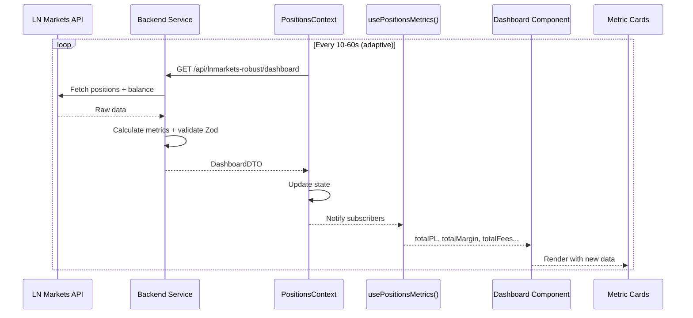

# Dashboard Implementation - Component Architecture

## Visão Geral

O Dashboard é o componente principal da aplicação, responsável por exibir métricas em tempo real das posições do usuário na LN Markets. Implementa um sistema de cards responsivos com dados sincronizados via `PositionsContext`.

## Arquitetura do Componente

### Estrutura de Arquivos

```
frontend/src/
├── pages/Dashboard.tsx                    # Componente principal
├── components/dashboard/
│   ├── MetricCard.tsx                     # Card de métrica individual
│   ├── PnLCard.tsx                        # Card de P&L com badge
│   └── LightweightLiquidationChart.tsx    # Gráfico de liquidação
├── contexts/PositionsContext.tsx          # Context de dados
└── hooks/
    ├── usePositionsMetrics.ts             # Hook principal
    └── useActiveAccountData.ts            # Dados da conta ativa
```

### Consumo de Dados

O Dashboard consome dados diretamente do `PositionsContext`:

```typescript
// frontend/src/pages/Dashboard.tsx
import { usePositionsMetrics } from '@/contexts/PositionsContext';

export default function Dashboard() {
  // Consumo direto das métricas
  const positionsMetrics = usePositionsMetrics();
  
  const contextTotalPL = positionsMetrics.totalPL || 0;
  const contextTotalMargin = positionsMetrics.totalMargin || 0;
  const contextEstimatedBalance = positionsMetrics.estimatedBalance || 0;
  const contextTotalFees = positionsMetrics.totalFees || 0;
  const contextPositionCount = positionsMetrics.positionCount || 0;
  const contextLastUpdate = positionsMetrics.lastUpdate || Date.now();
}
```

## Cards Implementados

### 1. Total P&L Card

```typescript
<PnLCard
  title="Total P&L"
  value={formatSats(contextTotalPL)}
  subtitle={`${contextPositionCount} posições`}
  variant={contextTotalPL >= 0 ? 'success' : 'danger'}
  icon={contextTotalPL >= 0 ? TrendingUp : TrendingDown}
  data-testid="dashboard-total-pl"
/>
```

**Características:**
- Badge dinâmico (verde/vermelho) baseado no valor
- Ícone que muda conforme P&L positivo/negativo
- Contador de posições ativas
- Formatação em sats com separadores

### 2. Total Margin Card

```typescript
<MetricCard
  title="Total Margin"
  value={formatSats(contextTotalMargin)}
  subtitle="Margem total"
  icon={Target}
  data-testid="dashboard-total-margin"
/>
```

### 3. Estimated Balance Card

```typescript
<MetricCard
  title="Estimated Balance"
  value={formatSats(contextEstimatedBalance)}
  subtitle="Saldo estimado"
  icon={Wallet}
  data-testid="dashboard-estimated-balance"
/>
```

### 4. Total Fees Card

```typescript
<MetricCard
  title="Total Fees"
  value={formatSats(contextTotalFees)}
  subtitle="Taxas totais"
  icon={Activity}
  data-testid="dashboard-total-fees"
/>
```

### 5. Position Count Card

```typescript
<MetricCard
  title="Positions"
  value={contextPositionCount.toString()}
  subtitle="Posições abertas"
  icon={BarChart3}
  data-testid="dashboard-position-count"
/>
```

## Gráfico de Liquidação

### LightweightLiquidationChart

```typescript
<LightweightLiquidationChart
  data={marketData}
  liquidationLines={liquidationLines}
  takeProfitLines={takeProfitLines}
  currentPrice={currentPrice}
  height={300}
/>
```

**Funcionalidades:**
- Linhas de liquidação por posição
- Linhas de take profit (quando aplicável)
- Preço atual do Bitcoin
- Responsivo e otimizado para performance

### Cálculo de Linhas

```typescript
const liquidationLines = useMemo(() => {
  return positions
    .filter(p => p.liquidation && p.liquidation > 0)
    .map((pos, idx) => ({
      price: pos.liquidation,
      label: `Liquidation ${idx + 1}`,
      color: pos.side === 'long' ? '#ef4444' : '#22c55e'
    }));
}, [positions]);
```

## Data Flow



## Performance

### Otimizações Implementadas

1. **React.memo** em componentes de card:
```typescript
const MetricCard = memo<MetricCardProps>(({ title, value, subtitle, icon: Icon }) => {
  // Component implementation
});
```

2. **useMemo** para cálculos pesados:
```typescript
const liquidationLines = useMemo(() => {
  return positions
    .filter(p => p.liquidation && p.liquidation > 0)
    .map((pos, idx) => ({
      price: pos.liquidation,
      label: `Liquidation ${idx + 1}`,
      color: pos.side === 'long' ? '#ef4444' : '#22c55e'
    }));
}, [positions]);
```

3. **useCallback** para funções estáveis:
```typescript
const handleRefresh = useCallback(() => {
  refreshPositions();
}, [refreshPositions]);
```

### Atualização em Tempo Real

- **Polling Adaptativo**: 10s → 30s → 60s baseado na atividade
- **Rate Limiting**: 1 request por segundo máximo
- **Sincronização**: Dashboard, Title e Header usam mesma fonte
- **Validação**: Zod schema validation em DEV

## Responsividade

### Grid Layout

```typescript
<div className="grid grid-cols-2 sm:grid-cols-3 lg:grid-cols-4 xl:grid-cols-5 gap-4">
  {/* Cards */}
</div>
```

**Breakpoints:**
- Mobile: 2 colunas
- Small: 3 colunas  
- Large: 4 colunas
- XL: 5 colunas

### Cards Adaptativos

```typescript
<Card className={cn(
  "transition-all duration-300",
  isScrolled ? "opacity-90" : "opacity-100"
)}>
```

## Estados de Loading

### Loading State

```typescript
{isLoading ? (
  <div className="flex items-center justify-center h-32">
    <Loader2 className="h-8 w-8 animate-spin" />
    <span className="ml-2">Carregando dados...</span>
  </div>
) : (
  <div className="grid grid-cols-2 sm:grid-cols-3 lg:grid-cols-4 xl:grid-cols-5 gap-4">
    {/* Cards */}
  </div>
)}
```

### Error State

```typescript
{error && (
  <Alert variant="destructive">
    <AlertTriangle className="h-4 w-4" />
    <AlertDescription>
      Erro ao carregar dados: {error}
    </AlertDescription>
  </Alert>
)}
```

## Integração com Outros Componentes

### Sincronização com Title

```typescript
// usePageTitle.ts
export const useTotalPL = () => {
  const { totalPL } = usePositionsMetrics();
  return totalPL || 0;
};
```

### Sincronização com Header

```typescript
// LNMarketsHeader.tsx
const { totalFees, totalTradingFees, totalFundingCost } = usePositionsMetrics();
```

## Troubleshooting

### Problemas Comuns

1. **Cards não atualizando**
   - Verificar se `usePositionsMetrics()` retorna dados
   - Confirmar que PositionsContext está ativo
   - Validar polling interval

2. **Valores zerados**
   - Verificar credenciais LN Markets
   - Confirmar conta ativa selecionada
   - Validar dados do backend

3. **Performance degradada**
   - Verificar re-renders desnecessários
   - Confirmar memoização adequada
   - Analisar polling frequency

### Logs de Debug

```typescript
// Ativar logs detalhados
if (import.meta.env.DEV) {
  console.log('🔍 DASHBOARD - Metrics:', {
    totalPL: contextTotalPL,
    totalMargin: contextTotalMargin,
    totalFees: contextTotalFees,
    positionCount: contextPositionCount
  });
}
```

## Referências

- [PositionsContext Documentation](../data-architecture/frontend-state-management.md)
- [Dashboard State Refactoring](../../migrations/code-migrations/dashboard-state-refactoring.md)
- [React Performance Optimization](https://react.dev/learn/render-and-commit)
- [Responsive Design Patterns](https://tailwindcss.com/docs/responsive-design)
