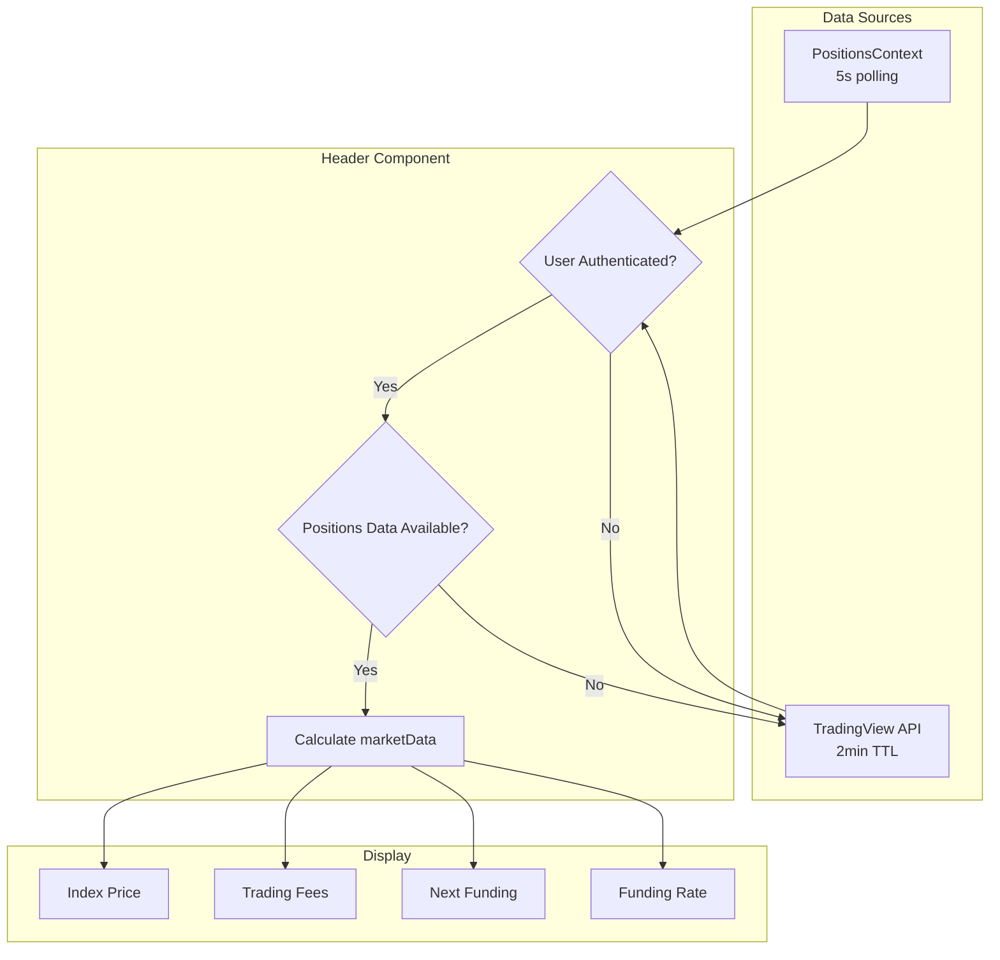

# Header Implementation - LNMarketsHeader Component

## Visão Geral

O LNMarketsHeader é o componente de cabeçalho que exibe dados de mercado em tempo real, incluindo preço do Bitcoin, taxas de trading, próximo funding e taxa de funding. Após uma refatoração significativa, agora utiliza o mesmo padrão de consumo direto do Dashboard e Title.

## Evolução da Implementação

### Versão 1.0: Sistema Híbrido Complexo

**Problemas identificados:**
- Sistema híbrido WebSocket + REST + cache
- Múltiplas fontes de dados conflitantes
- Re-rendering issues constantes
- Complexidade desnecessária com debounce
- Não sincronizava com Dashboard/Title

**Arquitetura problemática:**
```typescript
// ❌ Sistema complexo (removido)
const { data: realtimeData } = useUserPositions();
const { data: positionsData } = usePositionsMetrics();
const debouncedTradingFees = useDebouncedHeader(tradingFees);
const memoizedMarketData = useMemo(() => {
  // Cálculos complexos...
}, [dependencies]);
```

### Versão 2.0: Simplificado (Atual)

**Solução implementada:**
- Consumo direto do `usePositionsMetrics()`
- Eliminação de cache/debounce desnecessário
- Alinhamento com padrão Dashboard/Title
- Single Source of Truth
- Sincronização garantida

## Implementação Atual (v2.0)

### Estrutura do Componente

```typescript
// frontend/src/components/layout/LNMarketsHeader.tsx
import { usePositionsMetrics } from '@/contexts/PositionsContext';
import { usePublicMarketData } from '@/hooks/usePublicMarketData';

const LNMarketsHeader: React.FC = () => {
  const { isAuthenticated } = useAuthStore();
  
  // Consumo direto das métricas (mesmo padrão do Dashboard)
  const { 
    totalFees,
    totalTradingFees,
    totalFundingCost,
    lastUpdate
  } = usePositionsMetrics();
  
  // TradingView como fallback (2min TTL)
  const { data: publicData } = usePublicMarketData();
```

### Cálculo de Dados

```typescript
// Calculate data directly in render (Dashboard pattern)
const marketData = isAuthenticated && totalFees !== undefined ? {
  index: publicData?.index || 0,
  index24hChange: publicData?.index24hChange || 0,
  tradingFees: totalFees, // direto, sem cache/debounce
  nextFunding: publicData?.nextFunding || 'N/A',
  rate: publicData?.rate || 0,
  rateChange: 0,
  lastUpdate: new Date(lastUpdate),
  source: 'lnmarkets'
} : (publicData ? {
  index: publicData.index,
  index24hChange: publicData.index24hChange,
  tradingFees: publicData.tradingFees,
  nextFunding: publicData.nextFunding,
  rate: publicData.rate,
  rateChange: 0,
  lastUpdate: new Date(publicData.timestamp),
  source: publicData.source
} : null);
```

## Campos Exibidos

### 1. Index (Bitcoin Price)

```typescript
<div className="flex items-center space-x-1">
  <TrendingUp className="text-text-secondary w-3 h-3" />
  <span className="text-text-secondary font-mono text-xs font-semibold">Index:</span>
  <span className="text-text-primary font-mono text-xs font-bold">
    {marketData?.index ? `$${marketData.index.toLocaleString()}` : 'N/A'}
  </span>
</div>
```

### 2. Index 24h Change

```typescript
<div className="flex items-center space-x-1">
  {marketData?.index24hChange && marketData.index24hChange >= 0 ? (
    <TrendingUp className="text-green-500 w-3 h-3" />
  ) : (
    <TrendingDown className="text-red-500 w-3 h-3" />
  )}
  <span className="text-text-secondary font-mono text-xs font-semibold">24h:</span>
  <span className={cn(
    "font-mono text-xs font-bold",
    marketData?.index24hChange && marketData.index24hChange >= 0 
      ? "text-green-500" 
      : "text-red-500"
  )}>
    {marketData?.index24hChange ? 
      `${marketData.index24hChange >= 0 ? '+' : ''}${marketData.index24hChange.toFixed(2)}%` 
      : 'N/A'
    }
  </span>
</div>
```

### 3. Trading Fees

**Formato:** `0.271%` (percentual)

```typescript
<div className="flex items-center space-x-1">
  <Percent className="text-text-secondary w-3 h-3" />
  <span className="text-text-secondary font-mono text-xs font-semibold">Fees:</span>
  <span className="text-text-primary font-mono text-xs font-bold">
    {marketData?.tradingFees ? formatTradingFees(marketData.tradingFees) : 'N/A'}
  </span>
</div>
```

**Função de formatação:**
```typescript
const formatTradingFees = (value: number): string => {
  return (value / 1000).toFixed(3) + '%';
};
```

### 4. Next Funding

**Formato:** `02:54:33` (HH:MM:SS)

```typescript
<div className="flex items-center space-x-1">
  <Clock className="text-text-secondary w-3 h-3" />
  <span className="text-text-secondary font-mono text-xs font-semibold">Funding:</span>
  <span className="text-text-primary font-mono text-xs font-bold">
    {marketData?.nextFunding || 'N/A'}
  </span>
</div>
```

### 5. Rate

**Formato:** `0.0060%` (percentual)

```typescript
<div className="flex items-center space-x-1">
  <Activity className="text-text-secondary w-3 h-3" />
  <span className="text-text-secondary font-mono text-xs font-semibold">Rate:</span>
  <span className="text-text-primary font-mono text-xs font-bold">
    {marketData?.rate ? formatRate(marketData.rate) : 'N/A'}
  </span>
</div>
```

**Função de formatação:**
```typescript
const formatRate = (value: number): string => {
  return value.toFixed(4) + '%';
};
```

## Decisão de Arquitetura

### Por que foi Simplificado?

1. **Eliminou Complexidade Desnecessária**
   - Sistema híbrido era over-engineering
   - Cache/debounce não era necessário
   - Múltiplas fontes causavam inconsistências

2. **Alinhamento com Dashboard e Title**
   - Mesmo padrão de consumo direto
   - Single Source of Truth
   - Sincronização garantida

3. **Resolução de Re-rendering Issues**
   - `useMemo` desnecessário removido
   - `useRef` problemático eliminado
   - Re-mounting constante resolvido

4. **Manutenibilidade**
   - Código mais simples
   - Menos pontos de falha
   - Debugging facilitado

### Comparação: Antes vs Depois

#### Antes (v1.0) - Complexo
```typescript
// ❌ Sistema complexo
const { data: realtimeData } = useUserPositions();
const { data: positionsData } = usePositionsMetrics();
const debouncedTradingFees = useDebouncedHeader(tradingFees);
const memoizedMarketData = useMemo(() => {
  // Cálculos complexos com múltiplas dependências
}, [realtimeData, positionsData, debouncedTradingFees, forceUpdate]);

// Re-rendering issues
const prevMarketData = React.useRef(marketData);
```

#### Depois (v2.0) - Simples
```typescript
// ✅ Sistema simples
const { totalFees, totalTradingFees, totalFundingCost, lastUpdate } = usePositionsMetrics();
const { data: publicData } = usePublicMarketData();

// Cálculo direto no render
const marketData = isAuthenticated && totalFees !== undefined ? {
  tradingFees: totalFees, // direto, sem cache/debounce
  // ...
} : publicData;
```

## Data Flow



## Performance

### Otimizações Implementadas

1. **Eliminação de Re-renders Desnecessários**
   - Removido `useMemo` complexo
   - Removido `useRef` problemático
   - Cálculo direto no render

2. **Consumo Direto**
   - Sem cache intermediário
   - Sem debounce desnecessário
   - Sincronização automática

3. **Scroll Detection Otimizado**
```typescript
useEffect(() => {
  const handleScroll = () => {
    setIsScrolled(window.scrollY > 50);
  };
  
  window.addEventListener('scroll', handleScroll);
  return () => window.removeEventListener('scroll', handleScroll);
}, []);
```

## Responsividade

### Layout Adaptativo

```typescript
<div className={cn(
  "flex items-center justify-between w-full transition-all duration-300",
  isScrolled ? "text-sm" : "text-base"
)}>
  {/* Content */}
</div>
```

### Mobile Layout

```typescript
{/* Desktop Layout - Three columns */}
<div className="hidden md:flex items-center justify-between w-full text-xs">
  {/* Desktop content */}
</div>

{/* Mobile Layout - Two columns */}
<div className="md:hidden flex items-center justify-between w-full text-xs">
  {/* Mobile content */}
</div>
```

## Estados de Loading

### Loading State

```typescript
{isLoading ? (
  <div className="flex items-center space-x-1">
    <Loader2 className="w-3 h-3 animate-spin" />
    <span className="text-xs">Carregando...</span>
  </div>
) : (
  <div className="flex items-center space-x-1">
    {/* Content */}
  </div>
)}
```

### Error State

```typescript
{error && (
  <div className="flex items-center space-x-1">
    <AlertTriangle className="w-3 h-3 text-red-500" />
    <span className="text-xs text-red-500">Erro</span>
  </div>
)}
```

## Integração com Outros Componentes

### Sincronização com Dashboard

```typescript
// Ambos usam usePositionsMetrics()
const { totalFees } = usePositionsMetrics(); // Header
const { totalFees } = usePositionsMetrics(); // Dashboard
```

### Sincronização com Title

```typescript
// Title usa useTotalPL() que é wrapper de usePositionsMetrics()
const totalPL = useTotalPL(); // Title
const { totalPL } = usePositionsMetrics(); // Header (se necessário)
```

## Troubleshooting

### Problemas Comuns

1. **Header não atualiza em tempo real**
   - **Causa**: Usando fonte de dados diferente do Dashboard
   - **Solução**: Garantir que ambos usam `usePositionsMetrics()`

2. **Valores zerados**
   - **Causa**: Credenciais inválidas ou conta inativa
   - **Solução**: Verificar autenticação e conta ativa

3. **Re-rendering excessivo**
   - **Causa**: `useMemo` com dependências instáveis
   - **Solução**: Usar consumo direto (implementação atual)

### Logs de Debug

```typescript
// Logs removidos na versão 2.0 para produção limpa
// Em desenvolvimento, usar React DevTools para debugging
```

## Migração

### Arquivos Removidos

- `frontend/src/hooks/useDebouncedHeader.ts`

### Mudanças Breaking

- Removido `usePositionsSelector` do Header
- Removido sistema de debounce
- Simplificado consumo de dados

### Compatibilidade

- Mantida compatibilidade com `usePositionsMetrics()`
- Sem breaking changes em outros componentes
- Migração transparente

## Referências

- [PositionsContext Documentation](../data-architecture/frontend-state-management.md)
- [Dashboard Implementation](./dashboard-implementation.md)
- [Dashboard State Refactoring](../../migrations/code-migrations/dashboard-state-refactoring.md)
- [React Performance Optimization](https://react.dev/learn/render-and-commit)
