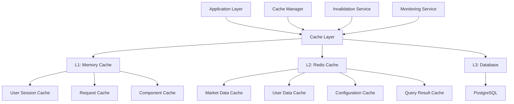

# Caching Strategy - Data Architecture

> **Status**: Active  
> **Última Atualização**: 2025-01-26  
> **Versão**: 1.0.0  
> **Responsável**: Axisor Data Team  

## Índice

- [Visão Geral](#visão-geral)
- [Cache Architecture](#cache-architecture)
- [Cache Layers](#cache-layers)
- [Cache Policies](#cache-policies)
- [Data Invalidation](#data-invalidation)
- [Performance Optimization](#performance-optimization)
- [Cache Monitoring](#cache-monitoring)
- [Troubleshooting](#troubleshooting)
- [Referências](#referências)

## Visão Geral

O sistema Axisor implementa uma estratégia de cache multicamadas usando Redis como cache principal, com diferentes políticas de TTL para diferentes tipos de dados. A estratégia visa otimizar performance, reduzir carga no banco de dados e melhorar a experiência do usuário.

## Cache Architecture

### Cache System Overview



### Cache Manager Implementation

```typescript
// Cache Manager Core
class CacheManager {
  private redis: Redis;
  private memoryCache: Map<string, CacheEntry> = new Map();
  private logger: Logger;
  private readonly MEMORY_CACHE_SIZE = 1000;
  private readonly MEMORY_CACHE_TTL = 300000; // 5 minutes

  constructor(config: CacheConfig) {
    this.redis = new Redis(config.redisUrl);
    this.logger = config.logger;
    
    // Setup memory cache cleanup
    setInterval(() => {
      this.cleanupMemoryCache();
    }, 60000); // Every minute
  }

  async get<T>(key: string, options: CacheOptions = {}): Promise<T | null> {
    // 1. Check memory cache first
    if (!options.skipMemoryCache) {
      const memoryResult = this.getFromMemoryCache<T>(key);
      if (memoryResult !== null) {
        this.logger.debug('Cache hit (memory)', { key });
        return memoryResult;
      }
    }

    // 2. Check Redis cache
    const redisResult = await this.getFromRedisCache<T>(key);
    if (redisResult !== null) {
      this.logger.debug('Cache hit (redis)', { key });
      
      // Promote to memory cache if requested
      if (options.promoteToMemory) {
        this.setMemoryCache(key, redisResult, options.ttl);
      }
      
      return redisResult;
    }

    this.logger.debug('Cache miss', { key });
    return null;
  }

  async set<T>(
    key: string, 
    value: T, 
    options: CacheOptions = {}
  ): Promise<void> {
    const ttl = options.ttl || this.getDefaultTTL(key);
    
    // Set in Redis
    await this.setRedisCache(key, value, ttl);
    
    // Set in memory cache if requested
    if (options.setInMemory) {
      this.setMemoryCache(key, value, ttl);
    }
    
    this.logger.debug('Cache set', { key, ttl });
  }

  async invalidate(pattern: string): Promise<void> {
    // Invalidate memory cache
    this.invalidateMemoryCache(pattern);
    
    // Invalidate Redis cache
    await this.invalidateRedisCache(pattern);
    
    this.logger.info('Cache invalidated', { pattern });
  }

  private getFromMemoryCache<T>(key: string): T | null {
    const entry = this.memoryCache.get(key);
    
    if (!entry) {
      return null;
    }
    
    // Check if expired
    if (Date.now() > entry.expiresAt) {
      this.memoryCache.delete(key);
      return null;
    }
    
    // Update access time
    entry.lastAccessed = Date.now();
    
    return entry.value as T;
  }

  private async getFromRedisCache<T>(key: string): Promise<T | null> {
    try {
      const value = await this.redis.get(key);
      
      if (!value) {
        return null;
      }
      
      return JSON.parse(value);
    } catch (error) {
      this.logger.error('Redis cache get error', { key, error: error.message });
      return null;
    }
  }

  private setMemoryCache<T>(key: string, value: T, ttl: number): void {
    // Remove oldest entries if cache is full
    if (this.memoryCache.size >= this.MEMORY_CACHE_SIZE) {
      const oldestKey = this.getOldestCacheKey();
      this.memoryCache.delete(oldestKey);
    }
    
    this.memoryCache.set(key, {
      value,
      createdAt: Date.now(),
      lastAccessed: Date.now(),
      expiresAt: Date.now() + ttl
    });
  }

  private async setRedisCache<T>(key: string, value: T, ttl: number): Promise<void> {
    try {
      await this.redis.setex(key, Math.floor(ttl / 1000), JSON.stringify(value));
    } catch (error) {
      this.logger.error('Redis cache set error', { key, error: error.message });
      throw error;
    }
  }
}
```

## Cache Layers

### L1: Memory Cache

```typescript
// Memory Cache Implementation
class MemoryCache {
  private cache: Map<string, MemoryCacheEntry> = new Map();
  private readonly MAX_SIZE: number;
  private readonly DEFAULT_TTL: number;

  constructor(maxSize: number = 1000, defaultTtl: number = 300000) {
    this.MAX_SIZE = maxSize;
    this.DEFAULT_TTL = defaultTtl;
  }

  get<T>(key: string): T | null {
    const entry = this.cache.get(key);
    
    if (!entry || this.isExpired(entry)) {
      if (entry) {
        this.cache.delete(key);
      }
      return null;
    }
    
    // Update access time for LRU
    entry.lastAccessed = Date.now();
    entry.accessCount++;
    
    return entry.value as T;
  }

  set<T>(key: string, value: T, ttl?: number): void {
    const expiresAt = Date.now() + (ttl || this.DEFAULT_TTL);
    
    // Check if we need to evict
    if (this.cache.size >= this.MAX_SIZE && !this.cache.has(key)) {
      this.evictLeastRecentlyUsed();
    }
    
    this.cache.set(key, {
      value,
      createdAt: Date.now(),
      lastAccessed: Date.now(),
      expiresAt,
      accessCount: 0
    });
  }

  private isExpired(entry: MemoryCacheEntry): boolean {
    return Date.now() > entry.expiresAt;
  }

  private evictLeastRecentlyUsed(): void {
    let oldestKey = '';
    let oldestTime = Infinity;
    
    for (const [key, entry] of this.cache.entries()) {
      if (entry.lastAccessed < oldestTime) {
        oldestTime = entry.lastAccessed;
        oldestKey = key;
      }
    }
    
    if (oldestKey) {
      this.cache.delete(oldestKey);
    }
  }

  private getOldestCacheKey(): string {
    let oldestKey = '';
    let oldestTime = Infinity;
    
    for (const [key, entry] of this.cache.entries()) {
      if (entry.lastAccessed < oldestTime) {
        oldestTime = entry.lastAccessed;
        oldestKey = key;
      }
    }
    
    return oldestKey;
  }
}
```

### L2: Redis Cache

```typescript
// Redis Cache Implementation
class RedisCache {
  private redis: Redis;
  private logger: Logger;

  constructor(redisUrl: string, logger: Logger) {
    this.redis = new Redis(redisUrl);
    this.logger = logger;
  }

  async get<T>(key: string): Promise<T | null> {
    try {
      const value = await this.redis.get(key);
      return value ? JSON.parse(value) : null;
    } catch (error) {
      this.logger.error('Redis get error', { key, error: error.message });
      return null;
    }
  }

  async set<T>(key: string, value: T, ttlSeconds: number): Promise<void> {
    try {
      await this.redis.setex(key, ttlSeconds, JSON.stringify(value));
    } catch (error) {
      this.logger.error('Redis set error', { key, error: error.message });
      throw error;
    }
  }

  async mget<T>(keys: string[]): Promise<(T | null)[]> {
    try {
      const values = await this.redis.mget(...keys);
      return values.map(value => value ? JSON.parse(value) : null);
    } catch (error) {
      this.logger.error('Redis mget error', { keys, error: error.message });
      return keys.map(() => null);
    }
  }

  async mset<T>(entries: Array<{ key: string; value: T; ttl?: number }>): Promise<void> {
    try {
      const pipeline = this.redis.pipeline();
      
      for (const { key, value, ttl } of entries) {
        if (ttl) {
          pipeline.setex(key, ttl, JSON.stringify(value));
        } else {
          pipeline.set(key, JSON.stringify(value));
        }
      }
      
      await pipeline.exec();
    } catch (error) {
      this.logger.error('Redis mset error', { error: error.message });
      throw error;
    }
  }

  async del(pattern: string): Promise<number> {
    try {
      if (pattern.includes('*')) {
        const keys = await this.redis.keys(pattern);
        return keys.length > 0 ? await this.redis.del(...keys) : 0;
      } else {
        return await this.redis.del(pattern);
      }
    } catch (error) {
      this.logger.error('Redis del error', { pattern, error: error.message });
      return 0;
    }
  }

  async exists(key: string): Promise<boolean> {
    try {
      const result = await this.redis.exists(key);
      return result === 1;
    } catch (error) {
      this.logger.error('Redis exists error', { key, error: error.message });
      return false;
    }
  }
}
```

## Cache Policies

### TTL Policies by Data Type

```typescript
// Cache TTL Policies
class CacheTTLPolicies {
  private static readonly POLICIES: Record<string, number> = {
    // Market data - short TTL for real-time data
    'market_data:current': 30 * 1000,           // 30 seconds
    'market_data:historical': 5 * 60 * 1000,    // 5 minutes
    'market_data:indicators': 2 * 60 * 1000,    // 2 minutes
    
    // User data - medium TTL
    'user:profile': 10 * 60 * 1000,             // 10 minutes
    'user:preferences': 30 * 60 * 1000,         // 30 minutes
    'user:accounts': 5 * 60 * 1000,             // 5 minutes
    'user:sessions': 60 * 60 * 1000,            // 1 hour
    
    // Trading data - short TTL for accuracy
    'trading:positions': 30 * 1000,             // 30 seconds
    'trading:orders': 15 * 1000,                // 15 seconds
    'trading:balance': 60 * 1000,               // 1 minute
    
    // Automation data - medium TTL
    'automation:configs': 5 * 60 * 1000,        // 5 minutes
    'automation:status': 30 * 1000,             // 30 seconds
    'automation:results': 10 * 60 * 1000,       // 10 minutes
    
    // System data - long TTL
    'system:config': 60 * 60 * 1000,            // 1 hour
    'system:health': 30 * 1000,                 // 30 seconds
    'system:metrics': 2 * 60 * 1000,            // 2 minutes
    
    // Query results - variable TTL
    'query:user_stats': 5 * 60 * 1000,          // 5 minutes
    'query:market_analysis': 2 * 60 * 1000,     // 2 minutes
    'query:performance_report': 10 * 60 * 1000, // 10 minutes
  };

  static getTTL(key: string): number {
    // Try exact match first
    if (this.POLICIES[key]) {
      return this.POLICIES[key];
    }
    
    // Try pattern matching
    for (const [pattern, ttl] of Object.entries(this.POLICIES)) {
      if (key.startsWith(pattern.split(':')[0] + ':')) {
        return ttl;
      }
    }
    
    // Default TTL
    return 5 * 60 * 1000; // 5 minutes
  }

  static getCacheLevel(key: string): 'memory' | 'redis' | 'both' {
    const memoryOnlyKeys = [
      'user:sessions',
      'request:temp'
    ];
    
    const redisOnlyKeys = [
      'market_data:historical',
      'query:large_results'
    ];
    
    if (memoryOnlyKeys.some(pattern => key.startsWith(pattern))) {
      return 'memory';
    }
    
    if (redisOnlyKeys.some(pattern => key.startsWith(pattern))) {
      return 'redis';
    }
    
    return 'both';
  }
}
```

### Cache Warming Strategy

```typescript
// Cache Warming Implementation
class CacheWarmer {
  private cacheManager: CacheManager;
  private dataService: DataService;
  private logger: Logger;

  async warmCache(): Promise<void> {
    this.logger.info('Starting cache warming');
    
    const warmingTasks = [
      this.warmMarketDataCache(),
      this.warmUserDataCache(),
      this.warmSystemConfigCache(),
      this.warmQueryResultCache()
    ];
    
    await Promise.allSettled(warmingTasks);
    
    this.logger.info('Cache warming completed');
  }

  private async warmMarketDataCache(): Promise<void> {
    try {
      // Warm current market data
      const symbols = ['BTCUSD', 'ETHUSD', 'LTCUSD'];
      
      for (const symbol of symbols) {
        const marketData = await this.dataService.getCurrentMarketData(symbol);
        await this.cacheManager.set(
          `market_data:current:${symbol}`,
          marketData,
          { ttl: 30000 }
        );
      }
      
      // Warm popular historical data
      const historicalData = await this.dataService.getPopularHistoricalData();
      await this.cacheManager.set(
        'market_data:historical:popular',
        historicalData,
        { ttl: 300000 }
      );
      
      this.logger.info('Market data cache warmed');
    } catch (error) {
      this.logger.error('Failed to warm market data cache', { error: error.message });
    }
  }

  private async warmUserDataCache(): Promise<void> {
    try {
      // Warm active user sessions
      const activeUsers = await this.dataService.getActiveUsers();
      
      for (const user of activeUsers) {
        const userData = await this.dataService.getUserData(user.id);
        await this.cacheManager.set(
          `user:data:${user.id}`,
          userData,
          { ttl: 600000 }
        );
      }
      
      this.logger.info('User data cache warmed');
    } catch (error) {
      this.logger.error('Failed to warm user data cache', { error: error.message });
    }
  }

  private async warmSystemConfigCache(): Promise<void> {
    try {
      // Warm system configuration
      const config = await this.dataService.getSystemConfig();
      await this.cacheManager.set(
        'system:config',
        config,
        { ttl: 3600000 }
      );
      
      this.logger.info('System config cache warmed');
    } catch (error) {
      this.logger.error('Failed to warm system config cache', { error: error.message });
    }
  }
}
```

## Data Invalidation

### Invalidation Service

```typescript
// Cache Invalidation Service
class CacheInvalidationService {
  private cacheManager: CacheManager;
  private redis: Redis;
  private logger: Logger;

  async invalidateUserData(userId: string): Promise<void> {
    this.logger.info('Invalidating user data cache', { userId });
    
    const patterns = [
      `user:data:${userId}`,
      `user:profile:${userId}`,
      `user:preferences:${userId}`,
      `user:accounts:${userId}`,
      `user:sessions:${userId}`,
      `trading:positions:${userId}`,
      `trading:orders:${userId}`,
      `automation:configs:${userId}`
    ];
    
    await this.invalidatePatterns(patterns);
  }

  async invalidateMarketData(symbol?: string): Promise<void> {
    this.logger.info('Invalidating market data cache', { symbol });
    
    const patterns = symbol 
      ? [`market_data:*:${symbol}`]
      : ['market_data:*'];
    
    await this.invalidatePatterns(patterns);
  }

  async invalidateTradingData(userId?: string): Promise<void> {
    this.logger.info('Invalidating trading data cache', { userId });
    
    const patterns = userId
      ? [`trading:*:${userId}`]
      : ['trading:*'];
    
    await this.invalidatePatterns(patterns);
  }

  async invalidateAutomationData(automationId?: string): Promise<void> {
    this.logger.info('Invalidating automation data cache', { automationId });
    
    const patterns = automationId
      ? [`automation:*:${automationId}`]
      : ['automation:*'];
    
    await this.invalidatePatterns(patterns);
  }

  async invalidateSystemData(): Promise<void> {
    this.logger.info('Invalidating system data cache');
    
    const patterns = [
      'system:config',
      'system:health',
      'system:metrics'
    ];
    
    await this.invalidatePatterns(patterns);
  }

  private async invalidatePatterns(patterns: string[]): Promise<void> {
    for (const pattern of patterns) {
      try {
        await this.cacheManager.invalidate(pattern);
      } catch (error) {
        this.logger.error('Failed to invalidate cache pattern', { 
          pattern, 
          error: error.message 
        });
      }
    }
  }

  // Event-driven invalidation
  async onUserUpdated(userId: string): Promise<void> {
    await this.invalidateUserData(userId);
  }

  async onMarketDataUpdated(symbol: string): Promise<void> {
    await this.invalidateMarketData(symbol);
  }

  async onTradingDataUpdated(userId: string): Promise<void> {
    await this.invalidateTradingData(userId);
  }

  async onAutomationUpdated(automationId: string): Promise<void> {
    await this.invalidateAutomationData(automationId);
  }
}
```

### Smart Invalidation

```typescript
// Smart Cache Invalidation
class SmartInvalidationService {
  private cacheManager: CacheManager;
  private dependencyGraph: Map<string, string[]>;
  private logger: Logger;

  constructor() {
    this.dependencyGraph = new Map([
      // User data dependencies
      ['user:profile', ['user:data', 'user:preferences']],
      ['user:preferences', ['user:data']],
      
      // Trading data dependencies
      ['trading:positions', ['trading:balance', 'user:accounts']],
      ['trading:orders', ['trading:positions']],
      
      // Market data dependencies
      ['market_data:current', ['market_data:indicators']],
      ['market_data:indicators', ['market_data:historical']],
      
      // Automation dependencies
      ['automation:configs', ['automation:status']],
      ['automation:status', ['automation:results']]
    ]);
  }

  async smartInvalidate(key: string): Promise<void> {
    this.logger.info('Smart cache invalidation', { key });
    
    // Get dependencies
    const dependencies = this.getDependencies(key);
    
    // Invalidate key and all dependencies
    const keysToInvalidate = [key, ...dependencies];
    
    for (const keyToInvalidate of keysToInvalidate) {
      await this.cacheManager.invalidate(keyToInvalidate);
    }
    
    this.logger.info('Smart invalidation completed', { 
      key, 
      dependencies: dependencies.length 
    });
  }

  private getDependencies(key: string): string[] {
    const dependencies: string[] = [];
    const visited = new Set<string>();
    
    const collectDependencies = (currentKey: string) => {
      if (visited.has(currentKey)) {
        return;
      }
      
      visited.add(currentKey);
      
      const directDeps = this.dependencyGraph.get(currentKey) || [];
      dependencies.push(...directDeps);
      
      // Recursively collect dependencies of dependencies
      for (const dep of directDeps) {
        collectDependencies(dep);
      }
    };
    
    collectDependencies(key);
    return dependencies;
  }

  // Batch invalidation for related changes
  async batchInvalidate(keys: string[]): Promise<void> {
    this.logger.info('Batch cache invalidation', { keyCount: keys.length });
    
    const allKeysToInvalidate = new Set<string>();
    
    // Collect all keys and their dependencies
    for (const key of keys) {
      allKeysToInvalidate.add(key);
      const dependencies = this.getDependencies(key);
      dependencies.forEach(dep => allKeysToInvalidate.add(dep));
    }
    
    // Invalidate all collected keys
    const invalidationPromises = Array.from(allKeysToInvalidate).map(key =>
      this.cacheManager.invalidate(key)
    );
    
    await Promise.allSettled(invalidationPromises);
    
    this.logger.info('Batch invalidation completed', { 
      originalKeys: keys.length,
      totalInvalidated: allKeysToInvalidate.size 
    });
  }
}
```

## Performance Optimization

### Cache Performance Optimizer

```typescript
// Cache Performance Optimizer
class CachePerformanceOptimizer {
  private cacheManager: CacheManager;
  private metrics: CacheMetrics;
  private logger: Logger;

  async optimizeCache(): Promise<void> {
    this.logger.info('Starting cache optimization');
    
    // Analyze cache performance
    const analysis = await this.analyzeCachePerformance();
    
    // Optimize based on analysis
    await this.applyOptimizations(analysis);
    
    this.logger.info('Cache optimization completed', { analysis });
  }

  private async analyzeCachePerformance(): Promise<CacheAnalysis> {
    const metrics = await this.getCacheMetrics();
    
    return {
      hitRate: metrics.hits / (metrics.hits + metrics.misses),
      averageAccessTime: metrics.totalAccessTime / metrics.totalAccesses,
      memoryUsage: metrics.memoryUsage,
      topKeys: await this.getTopAccessedKeys(10),
      lowHitRateKeys: await this.getLowHitRateKeys(),
      oversizedKeys: await this.getOversizedKeys()
    };
  }

  private async applyOptimizations(analysis: CacheAnalysis): Promise<void> {
    // Optimize TTL for low hit rate keys
    for (const key of analysis.lowHitRateKeys) {
      const currentTTL = CacheTTLPolicies.getTTL(key);
      const newTTL = Math.min(currentTTL * 2, 3600000); // Max 1 hour
      
      await this.updateKeyTTL(key, newTTL);
    }
    
    // Compress oversized keys
    for (const key of analysis.oversizedKeys) {
      await this.compressKey(key);
    }
    
    // Preload frequently accessed data
    await this.preloadFrequentData(analysis.topKeys);
  }

  private async updateKeyTTL(key: string, newTTL: number): Promise<void> {
    const value = await this.cacheManager.get(key);
    if (value) {
      await this.cacheManager.set(key, value, { ttl: newTTL });
      this.logger.info('Updated key TTL', { key, newTTL });
    }
  }

  private async compressKey(key: string): Promise<void> {
    const value = await this.cacheManager.get(key);
    if (value && typeof value === 'object') {
      const compressed = await this.compressData(value);
      await this.cacheManager.set(key, compressed);
      this.logger.info('Compressed key', { key, originalSize: JSON.stringify(value).length });
    }
  }

  private async compressData(data: any): Promise<any> {
    // Simple compression - remove null values, optimize arrays
    if (Array.isArray(data)) {
      return data.filter(item => item !== null && item !== undefined);
    }
    
    if (typeof data === 'object' && data !== null) {
      const compressed: any = {};
      for (const [key, value] of Object.entries(data)) {
        if (value !== null && value !== undefined) {
          compressed[key] = value;
        }
      }
      return compressed;
    }
    
    return data;
  }
}
```

### Cache Preloading

```typescript
// Cache Preloading Service
class CachePreloadingService {
  private cacheManager: CacheManager;
  private dataService: DataService;
  private logger: Logger;

  async preloadCriticalData(): Promise<void> {
    this.logger.info('Preloading critical data');
    
    const preloadTasks = [
      this.preloadMarketData(),
      this.preloadUserSessions(),
      this.preloadSystemConfig(),
      this.preloadPopularQueries()
    ];
    
    await Promise.allSettled(preloadTasks);
    
    this.logger.info('Critical data preloading completed');
  }

  private async preloadMarketData(): Promise<void> {
    try {
      // Preload current prices for major symbols
      const symbols = ['BTCUSD', 'ETHUSD', 'LTCUSD', 'XRPUSD'];
      
      for (const symbol of symbols) {
        const marketData = await this.dataService.getCurrentMarketData(symbol);
        await this.cacheManager.set(
          `market_data:current:${symbol}`,
          marketData,
          { ttl: 30000, setInMemory: true }
        );
      }
      
      this.logger.info('Market data preloaded', { symbols });
    } catch (error) {
      this.logger.error('Failed to preload market data', { error: error.message });
    }
  }

  private async preloadUserSessions(): Promise<void> {
    try {
      // Preload active user sessions
      const activeSessions = await this.dataService.getActiveSessions();
      
      for (const session of activeSessions) {
        await this.cacheManager.set(
          `user:session:${session.id}`,
          session,
          { ttl: 3600000, setInMemory: true }
        );
      }
      
      this.logger.info('User sessions preloaded', { count: activeSessions.length });
    } catch (error) {
      this.logger.error('Failed to preload user sessions', { error: error.message });
    }
  }

  private async preloadPopularQueries(): Promise<void> {
    try {
      // Preload common query results
      const popularQueries = [
        'user_stats',
        'market_overview',
        'system_health'
      ];
      
      for (const query of popularQueries) {
        const result = await this.dataService.executeQuery(query);
        await this.cacheManager.set(
          `query:${query}`,
          result,
          { ttl: 300000 }
        );
      }
      
      this.logger.info('Popular queries preloaded', { queries: popularQueries });
    } catch (error) {
      this.logger.error('Failed to preload popular queries', { error: error.message });
    }
  }
}
```

## Cache Monitoring

### Cache Metrics Collection

```typescript
// Cache Metrics Collector
class CacheMetricsCollector {
  private metrics: CacheMetrics;
  private logger: Logger;

  constructor() {
    this.metrics = {
      hits: 0,
      misses: 0,
      sets: 0,
      deletes: 0,
      totalAccessTime: 0,
      totalAccesses: 0,
      memoryUsage: 0,
      redisUsage: 0,
      keyStats: new Map()
    };
  }

  recordHit(key: string, accessTime: number): void {
    this.metrics.hits++;
    this.metrics.totalAccessTime += accessTime;
    this.metrics.totalAccesses++;
    
    this.updateKeyStats(key, 'hit', accessTime);
  }

  recordMiss(key: string, accessTime: number): void {
    this.metrics.misses++;
    this.metrics.totalAccessTime += accessTime;
    this.metrics.totalAccesses++;
    
    this.updateKeyStats(key, 'miss', accessTime);
  }

  recordSet(key: string, size: number): void {
    this.metrics.sets++;
    this.updateKeyStats(key, 'set', 0);
  }

  recordDelete(key: string): void {
    this.metrics.deletes++;
    this.updateKeyStats(key, 'delete', 0);
  }

  private updateKeyStats(key: string, operation: string, accessTime: number): void {
    const keyStat = this.metrics.keyStats.get(key) || {
      hits: 0,
      misses: 0,
      sets: 0,
      deletes: 0,
      totalAccessTime: 0,
      lastAccessed: Date.now()
    };

    switch (operation) {
      case 'hit':
        keyStat.hits++;
        keyStat.totalAccessTime += accessTime;
        break;
      case 'miss':
        keyStat.misses++;
        keyStat.totalAccessTime += accessTime;
        break;
      case 'set':
        keyStat.sets++;
        break;
      case 'delete':
        keyStat.deletes++;
        break;
    }

    keyStat.lastAccessed = Date.now();
    this.metrics.keyStats.set(key, keyStat);
  }

  getMetrics(): CacheMetrics {
    return {
      ...this.metrics,
      hitRate: this.metrics.hits / (this.metrics.hits + this.metrics.misses),
      averageAccessTime: this.metrics.totalAccessTime / this.metrics.totalAccesses
    };
  }

  getKeyStats(key: string): KeyStats | null {
    return this.metrics.keyStats.get(key) || null;
  }

  getTopKeys(limit: number = 10): Array<{ key: string; stats: KeyStats }> {
    return Array.from(this.metrics.keyStats.entries())
      .map(([key, stats]) => ({ key, stats }))
      .sort((a, b) => (b.stats.hits + b.stats.misses) - (a.stats.hits + a.stats.misses))
      .slice(0, limit);
  }

  resetMetrics(): void {
    this.metrics = {
      hits: 0,
      misses: 0,
      sets: 0,
      deletes: 0,
      totalAccessTime: 0,
      totalAccesses: 0,
      memoryUsage: 0,
      redisUsage: 0,
      keyStats: new Map()
    };
  }
}
```

## Troubleshooting

### Common Cache Issues

#### Cache Miss Rate High

```typescript
// Debug high cache miss rate
async function debugHighMissRate(): Promise<void> {
  console.log('Debugging high cache miss rate:');
  
  const metrics = await cacheMetricsCollector.getMetrics();
  console.log('Cache metrics:', {
    hitRate: (metrics.hitRate * 100).toFixed(2) + '%',
    totalAccesses: metrics.totalAccesses,
    averageAccessTime: metrics.averageAccessTime.toFixed(2) + 'ms'
  });
  
  // Get top missed keys
  const topKeys = await cacheMetricsCollector.getTopKeys(20);
  console.log('Top accessed keys:');
  
  for (const { key, stats } of topKeys) {
    const hitRate = stats.hits / (stats.hits + stats.misses);
    console.log(`- ${key}: ${(hitRate * 100).toFixed(2)}% hit rate`);
  }
  
  // Check TTL policies
  console.log('TTL policies:');
  for (const { key } of topKeys) {
    const ttl = CacheTTLPolicies.getTTL(key);
    console.log(`- ${key}: ${ttl / 1000}s`);
  }
  
  // Recommendations
  if (metrics.hitRate < 0.7) {
    console.log('Recommendations:');
    console.log('- Increase TTL for frequently missed keys');
    console.log('- Implement cache warming for critical data');
    console.log('- Review cache key patterns');
  }
}
```

#### Memory Usage Issues

```typescript
// Debug memory usage
async function debugMemoryUsage(): Promise<void> {
  console.log('Debugging memory usage:');
  
  // Check memory cache size
  const memoryCacheSize = memoryCache.size;
  console.log(`Memory cache entries: ${memoryCacheSize}`);
  
  // Check Redis memory usage
  const redisInfo = await redis.info('memory');
  console.log('Redis memory info:', redisInfo);
  
  // Find largest keys
  const keySizes = await getKeySizes();
  const largestKeys = keySizes
    .sort((a, b) => b.size - a.size)
    .slice(0, 10);
  
  console.log('Largest keys:');
  for (const { key, size } of largestKeys) {
    console.log(`- ${key}: ${(size / 1024).toFixed(2)}KB`);
  }
  
  // Memory optimization recommendations
  console.log('Optimization recommendations:');
  console.log('- Compress large objects');
  console.log('- Implement data pagination');
  console.log('- Review TTL policies');
  console.log('- Consider data archiving');
}

async function getKeySizes(): Promise<Array<{ key: string; size: number }>> {
  const keys = await redis.keys('*');
  const keySizes: Array<{ key: string; size: number }> = [];
  
  for (const key of keys) {
    const size = await redis.memory('usage', key);
    keySizes.push({ key, size: parseInt(size) });
  }
  
  return keySizes;
}
```

## Referências

- [Database Design](./database-design.md)
- [Data Persistence](./data-persistence.md)
- [Performance Monitoring](../monitoring/performance-monitoring.md)
- [System Architecture](../system-overview/system-architecture.md)

## Como Usar Este Documento

• **Para Desenvolvedores**: Use como referência para implementar cache em novos serviços e otimizar performance.

• **Para DevOps**: Utilize para monitorar e otimizar o sistema de cache em produção.

• **Para Arquitetos**: Use para entender a estratégia de cache e planejar melhorias na arquitetura.
