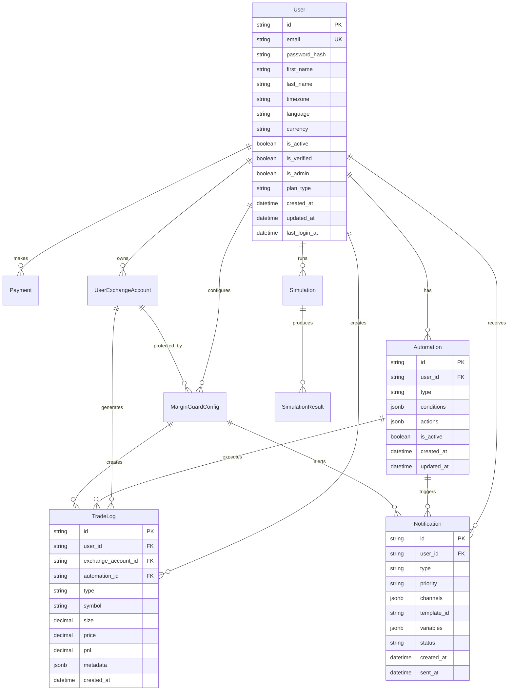

# Data Persistence - Data Architecture

> **Status**: Active  
> **Última Atualização**: 2025-01-26  
> **Versão**: 1.0.0  
> **Responsável**: Axisor Data Team  

## Índice

- [Visão Geral](#visão-geral)
- [Database Architecture](#database-architecture)
- [Data Models](#data-models)
- [Transaction Management](#transaction-management)
- [Data Migration](#data-migration)
- [Backup & Recovery](#backup--recovery)
- [Performance Optimization](#performance-optimization)
- [Data Integrity](#data-integrity)
- [Troubleshooting](#troubleshooting)
- [Referências](#referências)

## Visão Geral

O sistema Axisor utiliza PostgreSQL como banco de dados principal com Prisma ORM para gerenciamento de dados. A arquitetura implementa padrões de persistência robustos incluindo transações ACID, migrações versionadas, backup automático e estratégias de otimização de performance.

## Database Architecture

### Database Schema Overview



### Database Configuration

```typescript
// Database Configuration
interface DatabaseConfig {
  host: string;
  port: number;
  database: string;
  username: string;
  password: string;
  ssl: boolean;
  pool: {
    min: number;
    max: number;
    idleTimeoutMillis: number;
    connectionTimeoutMillis: number;
  };
  logging: boolean;
}

class DatabaseManager {
  private prisma: PrismaClient;
  private config: DatabaseConfig;
  private logger: Logger;
  private connectionPool: Pool;

  constructor(config: DatabaseConfig, logger: Logger) {
    this.config = config;
    this.logger = logger;
    
    // Initialize Prisma
    this.prisma = new PrismaClient({
      datasources: {
        db: {
          url: this.buildConnectionString()
        }
      },
      log: config.logging ? ['query', 'info', 'warn', 'error'] : ['error']
    });
    
    // Initialize connection pool
    this.connectionPool = new Pool({
      host: config.host,
      port: config.port,
      database: config.database,
      user: config.username,
      password: config.password,
      ssl: config.ssl,
      min: config.pool.min,
      max: config.pool.max,
      idleTimeoutMillis: config.pool.idleTimeoutMillis,
      connectionTimeoutMillis: config.pool.connectionTimeoutMillis
    });
  }

  private buildConnectionString(): string {
    const { host, port, database, username, password, ssl } = this.config;
    const sslParam = ssl ? '?sslmode=require' : '';
    
    return `postgresql://${username}:${password}@${host}:${port}/${database}${sslParam}`;
  }

  async initialize(): Promise<void> {
    this.logger.info('Initializing database connection');
    
    try {
      // Test connection
      await this.prisma.$connect();
      await this.testConnectionPool();
      
      this.logger.info('Database connection established');
    } catch (error) {
      this.logger.error('Failed to connect to database', { error: error.message });
      throw error;
    }
  }

  private async testConnectionPool(): Promise<void> {
    const client = await this.connectionPool.connect();
    try {
      await client.query('SELECT 1');
      this.logger.info('Connection pool test successful');
    } finally {
      client.release();
    }
  }

  async close(): Promise<void> {
    this.logger.info('Closing database connections');
    
    await Promise.all([
      this.prisma.$disconnect(),
      this.connectionPool.end()
    ]);
    
    this.logger.info('Database connections closed');
  }

  getPrismaClient(): PrismaClient {
    return this.prisma;
  }

  getConnectionPool(): Pool {
    return this.connectionPool;
  }
}
```

## Data Models

### Core Data Models

```typescript
// User Model
interface UserModel {
  id: string;
  email: string;
  password_hash?: string;
  first_name?: string;
  last_name?: string;
  avatar_url?: string;
  phone?: string;
  timezone: string;
  language: string;
  currency: string;
  is_active: boolean;
  is_verified: boolean;
  is_admin: boolean;
  plan_type: PlanType;
  created_at: Date;
  updated_at: Date;
  last_login_at?: Date;
  email_verified_at?: Date;
  
  // Security fields
  two_factor_enabled: boolean;
  two_factor_secret?: string;
  failed_login_attempts: number;
  locked_until?: Date;
  
  // Relations
  automations: Automation[];
  trade_logs: TradeLog[];
  notifications: Notification[];
  payments: Payment[];
  refresh_tokens: RefreshToken[];
  exchange_accounts: UserExchangeAccount[];
  simulations: Simulation[];
  margin_guard_config: MarginGuardConfig[];
}

// Automation Model
interface AutomationModel {
  id: string;
  user_id: string;
  type: AutomationType;
  name: string;
  description?: string;
  conditions: Record<string, any>;
  actions: Record<string, any>;
  is_active: boolean;
  priority: number;
  execution_count: number;
  last_executed_at?: Date;
  created_at: Date;
  updated_at: Date;
  
  // Relations
  user: User;
  trade_logs: TradeLog[];
}

// Trade Log Model
interface TradeLogModel {
  id: string;
  user_id: string;
  exchange_account_id: string;
  automation_id?: string;
  margin_guard_config_id?: string;
  simulation_id?: string;
  
  // Trade details
  type: TradeType;
  symbol: string;
  side: 'BUY' | 'SELL';
  size: number;
  price: number;
  leverage?: number;
  
  // Results
  pnl?: number;
  pnl_percentage?: number;
  fees?: number;
  status: TradeStatus;
  
  // Metadata
  metadata: Record<string, any>;
  executed_at: Date;
  created_at: Date;
  
  // Relations
  user: User;
  exchange_account: UserExchangeAccount;
  automation?: Automation;
  margin_guard_config?: MarginGuardConfig;
  simulation?: Simulation;
}

// Notification Model
interface NotificationModel {
  id: string;
  user_id: string;
  type: NotificationType;
  priority: NotificationPriority;
  channels: NotificationChannel[];
  template_id: string;
  variables: Record<string, any>;
  metadata: Record<string, any>;
  status: NotificationStatus;
  created_at: Date;
  updated_at: Date;
  scheduled_at?: Date;
  sent_at?: Date;
  expires_at?: Date;
  
  // Relations
  user: User;
  deliveries: NotificationDelivery[];
}
```

### Repository Pattern Implementation

```typescript
// Base Repository
abstract class BaseRepository<T, CreateInput, UpdateInput> {
  protected prisma: PrismaClient;
  protected modelName: string;
  protected logger: Logger;

  constructor(prisma: PrismaClient, modelName: string, logger: Logger) {
    this.prisma = prisma;
    this.modelName = modelName;
    this.logger = logger;
  }

  async findById(id: string): Promise<T | null> {
    try {
      const result = await (this.prisma as any)[this.modelName].findUnique({
        where: { id }
      });
      
      return result as T | null;
    } catch (error) {
      this.logger.error(`Error finding ${this.modelName} by ID`, { id, error: error.message });
      throw error;
    }
  }

  async findMany(where: any, options?: QueryOptions): Promise<T[]> {
    try {
      const query: any = { where };
      
      if (options) {
        if (options.select) query.select = options.select;
        if (options.include) query.include = options.include;
        if (options.orderBy) query.orderBy = options.orderBy;
        if (options.take) query.take = options.take;
        if (options.skip) query.skip = options.skip;
      }
      
      const results = await (this.prisma as any)[this.modelName].findMany(query);
      return results as T[];
    } catch (error) {
      this.logger.error(`Error finding ${this.modelName}`, { where, error: error.message });
      throw error;
    }
  }

  async create(data: CreateInput): Promise<T> {
    try {
      const result = await (this.prisma as any)[this.modelName].create({
        data
      });
      
      this.logger.info(`${this.modelName} created`, { id: result.id });
      return result as T;
    } catch (error) {
      this.logger.error(`Error creating ${this.modelName}`, { data, error: error.message });
      throw error;
    }
  }

  async update(id: string, data: UpdateInput): Promise<T> {
    try {
      const result = await (this.prisma as any)[this.modelName].update({
        where: { id },
        data
      });
      
      this.logger.info(`${this.modelName} updated`, { id });
      return result as T;
    } catch (error) {
      this.logger.error(`Error updating ${this.modelName}`, { id, data, error: error.message });
      throw error;
    }
  }

  async delete(id: string): Promise<void> {
    try {
      await (this.prisma as any)[this.modelName].delete({
        where: { id }
      });
      
      this.logger.info(`${this.modelName} deleted`, { id });
    } catch (error) {
      this.logger.error(`Error deleting ${this.modelName}`, { id, error: error.message });
      throw error;
    }
  }
}

// User Repository
class UserRepository extends BaseRepository<UserModel, CreateUserInput, UpdateUserInput> {
  constructor(prisma: PrismaClient, logger: Logger) {
    super(prisma, 'user', logger);
  }

  async findByEmail(email: string): Promise<UserModel | null> {
    try {
      const user = await this.prisma.user.findUnique({
        where: { email },
        include: {
          preferences: true,
          exchange_accounts: {
            select: {
              id: true,
              exchange_name: true,
              is_active: true
            }
          }
        }
      });
      
      return user as UserModel | null;
    } catch (error) {
      this.logger.error('Error finding user by email', { email, error: error.message });
      throw error;
    }
  }

  async findActiveUsers(): Promise<UserModel[]> {
    try {
      const users = await this.prisma.user.findMany({
        where: { is_active: true },
        include: {
          preferences: true
        }
      });
      
      return users as UserModel[];
    } catch (error) {
      this.logger.error('Error finding active users', { error: error.message });
      throw error;
    }
  }

  async updateLastLogin(userId: string): Promise<void> {
    try {
      await this.prisma.user.update({
        where: { id: userId },
        data: { 
          last_login_at: new Date(),
          failed_login_attempts: 0
        }
      });
    } catch (error) {
      this.logger.error('Error updating last login', { userId, error: error.message });
      throw error;
    }
  }
}

// Trade Log Repository
class TradeLogRepository extends BaseRepository<TradeLogModel, CreateTradeLogInput, UpdateTradeLogInput> {
  constructor(prisma: PrismaClient, logger: Logger) {
    super(prisma, 'tradeLog', logger);
  }

  async findByUser(userId: string, options?: TradeLogQueryOptions): Promise<TradeLogModel[]> {
    try {
      const query: any = {
        where: { user_id: userId }
      };

      if (options) {
        if (options.symbol) query.where.symbol = options.symbol;
        if (options.type) query.where.type = options.type;
        if (options.dateFrom) query.where.executed_at = { gte: options.dateFrom };
        if (options.dateTo) query.where.executed_at = { ...query.where.executed_at, lte: options.dateTo };
        if (options.limit) query.take = options.limit;
        if (options.offset) query.skip = options.offset;
      }

      query.orderBy = { executed_at: 'desc' };

      const trades = await this.prisma.tradeLog.findMany(query);
      return trades as TradeLogModel[];
    } catch (error) {
      this.logger.error('Error finding trades by user', { userId, options, error: error.message });
      throw error;
    }
  }

  async getTradingStats(userId: string, period: DateRange): Promise<TradingStats> {
    try {
      const trades = await this.prisma.tradeLog.findMany({
        where: {
          user_id: userId,
          executed_at: {
            gte: period.start,
            lte: period.end
          }
        }
      });

      const stats: TradingStats = {
        totalTrades: trades.length,
        winningTrades: trades.filter(t => (t.pnl || 0) > 0).length,
        losingTrades: trades.filter(t => (t.pnl || 0) < 0).length,
        totalPnL: trades.reduce((sum, t) => sum + (t.pnl || 0), 0),
        totalFees: trades.reduce((sum, t) => sum + (t.fees || 0), 0),
        averageTradeSize: trades.reduce((sum, t) => sum + t.size, 0) / trades.length,
        winRate: 0,
        profitFactor: 0
      };

      if (stats.totalTrades > 0) {
        stats.winRate = stats.winningTrades / stats.totalTrades;
        
        const grossProfit = trades.filter(t => (t.pnl || 0) > 0).reduce((sum, t) => sum + (t.pnl || 0), 0);
        const grossLoss = Math.abs(trades.filter(t => (t.pnl || 0) < 0).reduce((sum, t) => sum + (t.pnl || 0), 0));
        
        stats.profitFactor = grossLoss > 0 ? grossProfit / grossLoss : 0;
      }

      return stats;
    } catch (error) {
      this.logger.error('Error calculating trading stats', { userId, period, error: error.message });
      throw error;
    }
  }
}
```

## Transaction Management

### Transaction Service

```typescript
// Transaction Service
class TransactionService {
  private prisma: PrismaClient;
  private logger: Logger;

  constructor(prisma: PrismaClient, logger: Logger) {
    this.prisma = prisma;
    this.logger = logger;
  }

  async executeTransaction<T>(
    operations: (tx: PrismaClient) => Promise<T>,
    options?: TransactionOptions
  ): Promise<T> {
    const startTime = Date.now();
    
    try {
      this.logger.info('Starting database transaction');
      
      const result = await this.prisma.$transaction(
        operations,
        {
          timeout: options?.timeout || 10000,
          isolationLevel: options?.isolationLevel || 'ReadCommitted'
        }
      );
      
      const duration = Date.now() - startTime;
      this.logger.info('Transaction completed successfully', { duration });
      
      return result;
    } catch (error) {
      const duration = Date.now() - startTime;
      this.logger.error('Transaction failed', { error: error.message, duration });
      throw error;
    }
  }

  async executeBatchTransaction<T>(
    operations: Array<(tx: PrismaClient) => Promise<T>>,
    options?: BatchTransactionOptions
  ): Promise<T[]> {
    const startTime = Date.now();
    
    try {
      this.logger.info('Starting batch transaction', { operationCount: operations.length });
      
      const results = await this.prisma.$transaction(
        async (tx) => {
          const promises = operations.map(operation => operation(tx));
          return Promise.all(promises);
        },
        {
          timeout: options?.timeout || 30000,
          isolationLevel: options?.isolationLevel || 'ReadCommitted'
        }
      );
      
      const duration = Date.now() - startTime;
      this.logger.info('Batch transaction completed successfully', { 
        operationCount: operations.length, 
        duration 
      });
      
      return results;
    } catch (error) {
      const duration = Date.now() - startTime;
      this.logger.error('Batch transaction failed', { 
        error: error.message, 
        operationCount: operations.length,
        duration 
      });
      throw error;
    }
  }

  // Example: User registration transaction
  async registerUser(userData: CreateUserInput): Promise<UserModel> {
    return this.executeTransaction(async (tx) => {
      // Create user
      const user = await tx.user.create({
        data: userData
      });

      // Create default preferences
      await tx.userPreferences.create({
        data: {
          user_id: user.id,
          ...this.getDefaultPreferences()
        }
      });

      // Create default margin guard config
      await tx.marginGuardConfig.create({
        data: {
          user_id: user.id,
          ...this.getDefaultMarginGuardConfig()
        }
      });

      // Send welcome notification
      await tx.notification.create({
        data: {
          user_id: user.id,
          type: 'WELCOME',
          priority: 'NORMAL',
          channels: ['EMAIL', 'IN_APP'],
          template_id: 'welcome_template',
          variables: {
            user_name: user.first_name || 'User'
          },
          status: 'PENDING'
        }
      });

      return user as UserModel;
    });
  }

  // Example: Trade execution transaction
  async executeTrade(tradeData: CreateTradeLogInput): Promise<TradeLogModel> {
    return this.executeTransaction(async (tx) => {
      // Create trade log
      const trade = await tx.tradeLog.create({
        data: tradeData
      });

      // Update user balance if needed
      if (tradeData.type === 'CLOSE' && tradeData.pnl) {
        await tx.user.update({
          where: { id: tradeData.user_id },
          data: {
            // Update balance logic here
          }
        });
      }

      // Update automation execution count
      if (tradeData.automation_id) {
        await tx.automation.update({
          where: { id: tradeData.automation_id },
          data: {
            execution_count: {
              increment: 1
            },
            last_executed_at: new Date()
          }
        });
      }

      // Create notification for trade
      await tx.notification.create({
        data: {
          user_id: tradeData.user_id,
          type: tradeData.type === 'OPEN' ? 'TRADE_OPENED' : 'TRADE_CLOSED',
          priority: 'NORMAL',
          channels: ['PUSH', 'IN_APP'],
          template_id: `trade_${tradeData.type.toLowerCase()}_template`,
          variables: {
            symbol: tradeData.symbol,
            size: tradeData.size,
            price: tradeData.price,
            pnl: tradeData.pnl
          },
          status: 'PENDING'
        }
      });

      return trade as TradeLogModel;
    });
  }
}
```

## Data Migration

### Migration Service

```typescript
// Migration Service
class MigrationService {
  private prisma: PrismaClient;
  private logger: Logger;

  constructor(prisma: PrismaClient, logger: Logger) {
    this.prisma = prisma;
    this.logger = logger;
  }

  async runMigrations(): Promise<void> {
    this.logger.info('Starting database migrations');
    
    try {
      // Run Prisma migrations
      const { execSync } = require('child_process');
      execSync('npx prisma migrate deploy', { stdio: 'inherit' });
      
      this.logger.info('Prisma migrations completed');
      
      // Run custom data migrations
      await this.runCustomMigrations();
      
      this.logger.info('All migrations completed successfully');
    } catch (error) {
      this.logger.error('Migration failed', { error: error.message });
      throw error;
    }
  }

  private async runCustomMigrations(): Promise<void> {
    // Get current migration version
    const currentVersion = await this.getCurrentMigrationVersion();
    
    // Define migrations
    const migrations = [
      { version: '001', name: 'migrate_user_preferences', fn: this.migrateUserPreferences },
      { version: '002', name: 'migrate_automation_conditions', fn: this.migrateAutomationConditions },
      { version: '003', name: 'migrate_notification_templates', fn: this.migrateNotificationTemplates }
    ];
    
    // Run pending migrations
    for (const migration of migrations) {
      if (this.shouldRunMigration(currentVersion, migration.version)) {
        this.logger.info(`Running migration: ${migration.name}`);
        
        try {
          await migration.fn.call(this);
          await this.updateMigrationVersion(migration.version);
          this.logger.info(`Migration completed: ${migration.name}`);
        } catch (error) {
          this.logger.error(`Migration failed: ${migration.name}`, { error: error.message });
          throw error;
        }
      }
    }
  }

  private async migrateUserPreferences(): Promise<void> {
    // Find users without preferences
    const usersWithoutPreferences = await this.prisma.user.findMany({
      where: {
        preferences: null
      }
    });

    // Create default preferences for users without them
    for (const user of usersWithoutPreferences) {
      await this.prisma.userPreferences.create({
        data: {
          user_id: user.id,
          ...this.getDefaultUserPreferences()
        }
      });
    }

    this.logger.info(`Migrated preferences for ${usersWithoutPreferences.length} users`);
  }

  private async migrateAutomationConditions(): Promise<void> {
    // Update automation conditions format
    const automations = await this.prisma.automation.findMany({
      where: {
        conditions: {
          path: ['old_format'],
          not: null
        }
      }
    });

    for (const automation of automations) {
      const updatedConditions = this.transformAutomationConditions(automation.conditions);
      
      await this.prisma.automation.update({
        where: { id: automation.id },
        data: { conditions: updatedConditions }
      });
    }

    this.logger.info(`Migrated conditions for ${automations.length} automations`);
  }

  private async migrateNotificationTemplates(): Promise<void> {
    // Create default notification templates
    const templates = [
      {
        id: 'welcome_template',
        name: 'Welcome Template',
        subject: 'Welcome to Axisor!',
        content: 'Welcome {{user_name}}! Your account has been created successfully.',
        type: 'WELCOME',
        language: 'en-US'
      },
      {
        id: 'trade_opened_template',
        name: 'Trade Opened Template',
        subject: 'Trade Opened - {{symbol}}',
        content: 'A new {{type}} position has been opened for {{symbol}} at {{price}}.',
        type: 'TRADE_OPENED',
        language: 'en-US'
      },
      {
        id: 'trade_closed_template',
        name: 'Trade Closed Template',
        subject: 'Trade Closed - {{symbol}}',
        content: 'Your {{type}} position for {{symbol}} has been closed. PnL: {{pnl}}.',
        type: 'TRADE_CLOSED',
        language: 'en-US'
      }
    ];

    for (const template of templates) {
      await this.prisma.notificationTemplate.upsert({
        where: { id: template.id },
        update: template,
        create: template
      });
    }

    this.logger.info(`Created ${templates.length} notification templates`);
  }

  private async getCurrentMigrationVersion(): Promise<string> {
    try {
      const result = await this.prisma.$queryRaw`
        SELECT version FROM _migrations ORDER BY created_at DESC LIMIT 1
      ` as Array<{ version: string }>;
      
      return result.length > 0 ? result[0].version : '000';
    } catch (error) {
      // Table doesn't exist, start from beginning
      await this.createMigrationTable();
      return '000';
    }
  }

  private async createMigrationTable(): Promise<void> {
    await this.prisma.$executeRaw`
      CREATE TABLE IF NOT EXISTS _migrations (
        id SERIAL PRIMARY KEY,
        version VARCHAR(10) NOT NULL,
        name VARCHAR(255) NOT NULL,
        executed_at TIMESTAMP DEFAULT CURRENT_TIMESTAMP
      )
    `;
  }

  private async updateMigrationVersion(version: string): Promise<void> {
    await this.prisma.$executeRaw`
      INSERT INTO _migrations (version, name) VALUES (${version}, 'custom_migration')
    `;
  }

  private shouldRunMigration(currentVersion: string, migrationVersion: string): boolean {
    return migrationVersion > currentVersion;
  }
}
```

## Backup & Recovery

### Backup Service

```typescript
// Backup Service
class BackupService {
  private prisma: PrismaClient;
  private config: BackupConfig;
  private logger: Logger;

  constructor(prisma: PrismaClient, config: BackupConfig, logger: Logger) {
    this.prisma = prisma;
    this.config = config;
    this.logger = logger;
  }

  async createBackup(type: BackupType = 'FULL'): Promise<BackupResult> {
    const backupId = this.generateBackupId();
    const startTime = Date.now();
    
    this.logger.info('Starting database backup', { backupId, type });
    
    try {
      let result: BackupResult;
      
      switch (type) {
        case 'FULL':
          result = await this.createFullBackup(backupId);
          break;
        case 'INCREMENTAL':
          result = await this.createIncrementalBackup(backupId);
          break;
        case 'SCHEMA_ONLY':
          result = await this.createSchemaBackup(backupId);
          break;
        default:
          throw new Error(`Unknown backup type: ${type}`);
      }
      
      const duration = Date.now() - startTime;
      this.logger.info('Backup completed successfully', { 
        backupId, 
        type, 
        duration,
        size: result.size 
      });
      
      return result;
    } catch (error) {
      const duration = Date.now() - startTime;
      this.logger.error('Backup failed', { 
        backupId, 
        type, 
        error: error.message,
        duration 
      });
      throw error;
    }
  }

  private async createFullBackup(backupId: string): Promise<BackupResult> {
    const timestamp = new Date().toISOString().replace(/[:.]/g, '-');
    const filename = `backup_full_${timestamp}_${backupId}.sql`;
    const filepath = path.join(this.config.backupDirectory, filename);
    
    // Create pg_dump command
    const command = [
      'pg_dump',
      `--host=${this.config.database.host}`,
      `--port=${this.config.database.port}`,
      `--username=${this.config.database.username}`,
      `--dbname=${this.config.database.database}`,
      '--verbose',
      '--clean',
      '--no-owner',
      '--no-privileges',
      '--format=plain',
      `--file=${filepath}`
    ];
    
    // Execute backup
    await this.executeBackupCommand(command, this.config.database.password);
    
    // Compress backup
    const compressedFile = await this.compressBackup(filepath);
    
    // Get file size
    const stats = await fs.stat(compressedFile);
    
    // Upload to storage if configured
    if (this.config.storage) {
      await this.uploadBackup(compressedFile, filename);
    }
    
    return {
      id: backupId,
      type: 'FULL',
      filename,
      filepath: compressedFile,
      size: stats.size,
      created_at: new Date(),
      status: 'COMPLETED'
    };
  }

  private async createIncrementalBackup(backupId: string): Promise<BackupResult> {
    const timestamp = new Date().toISOString().replace(/[:.]/g, '-');
    const filename = `backup_incremental_${timestamp}_${backupId}.sql`;
    const filepath = path.join(this.config.backupDirectory, filename);
    
    // Get last backup timestamp
    const lastBackup = await this.getLastBackup();
    const sinceTimestamp = lastBackup?.created_at || new Date(Date.now() - 24 * 60 * 60 * 1000);
    
    // Create incremental backup command
    const command = [
      'pg_dump',
      `--host=${this.config.database.host}`,
      `--port=${this.config.database.port}`,
      `--username=${this.config.database.username}`,
      `--dbname=${this.config.database.database}`,
      '--verbose',
      '--clean',
      '--no-owner',
      '--no-privileges',
      '--format=plain',
      `--file=${filepath}`
    ];
    
    // Execute backup
    await this.executeBackupCommand(command, this.config.database.password);
    
    // Compress backup
    const compressedFile = await this.compressBackup(filepath);
    
    // Get file size
    const stats = await fs.stat(compressedFile);
    
    return {
      id: backupId,
      type: 'INCREMENTAL',
      filename,
      filepath: compressedFile,
      size: stats.size,
      created_at: new Date(),
      status: 'COMPLETED'
    };
  }

  private async executeBackupCommand(command: string[], password: string): Promise<void> {
    return new Promise((resolve, reject) => {
      const env = { ...process.env, PGPASSWORD: password };
      
      const child = spawn(command[0], command.slice(1), { env });
      
      child.stdout.on('data', (data) => {
        this.logger.debug('Backup stdout', { data: data.toString() });
      });
      
      child.stderr.on('data', (data) => {
        this.logger.debug('Backup stderr', { data: data.toString() });
      });
      
      child.on('close', (code) => {
        if (code === 0) {
          resolve();
        } else {
          reject(new Error(`Backup command failed with code ${code}`));
        }
      });
      
      child.on('error', (error) => {
        reject(error);
      });
    });
  }

  private async compressBackup(filepath: string): Promise<string> {
    const compressedPath = `${filepath}.gz`;
    
    return new Promise((resolve, reject) => {
      const gzip = createGzip();
      const input = fs.createReadStream(filepath);
      const output = fs.createWriteStream(compressedPath);
      
      input.pipe(gzip).pipe(output);
      
      output.on('finish', () => {
        // Remove original file
        fs.unlink(filepath, (err) => {
          if (err) {
            this.logger.warn('Failed to remove original backup file', { filepath, error: err.message });
          }
        });
        resolve(compressedPath);
      });
      
      output.on('error', reject);
      input.on('error', reject);
    });
  }

  async restoreBackup(backupId: string): Promise<void> {
    this.logger.info('Starting database restore', { backupId });
    
    try {
      // Find backup file
      const backup = await this.findBackup(backupId);
      if (!backup) {
        throw new Error(`Backup not found: ${backupId}`);
      }
      
      // Download from storage if needed
      let filepath = backup.filepath;
      if (this.config.storage && !fs.existsSync(filepath)) {
        filepath = await this.downloadBackup(backup.filename);
      }
      
      // Restore database
      await this.restoreFromFile(filepath);
      
      this.logger.info('Database restore completed successfully', { backupId });
    } catch (error) {
      this.logger.error('Database restore failed', { backupId, error: error.message });
      throw error;
    }
  }

  private async restoreFromFile(filepath: string): Promise<void> {
    const command = [
      'psql',
      `--host=${this.config.database.host}`,
      `--port=${this.config.database.port}`,
      `--username=${this.config.database.username}`,
      `--dbname=${this.config.database.database}`,
      '--verbose',
      `--file=${filepath}`
    ];
    
    await this.executeRestoreCommand(command, this.config.database.password);
  }

  private async executeRestoreCommand(command: string[], password: string): Promise<void> {
    return new Promise((resolve, reject) => {
      const env = { ...process.env, PGPASSWORD: password };
      
      const child = spawn(command[0], command.slice(1), { env });
      
      child.stdout.on('data', (data) => {
        this.logger.debug('Restore stdout', { data: data.toString() });
      });
      
      child.stderr.on('data', (data) => {
        this.logger.debug('Restore stderr', { data: data.toString() });
      });
      
      child.on('close', (code) => {
        if (code === 0) {
          resolve();
        } else {
          reject(new Error(`Restore command failed with code ${code}`));
        }
      });
      
      child.on('error', (error) => {
        reject(error);
      });
    });
  }
}
```

## Performance Optimization

### Query Optimization

```typescript
// Query Optimization Service
class QueryOptimizationService {
  private prisma: PrismaClient;
  private logger: Logger;

  constructor(prisma: PrismaClient, logger: Logger) {
    this.prisma = prisma;
    this.logger = logger;
  }

  async optimizeQueries(): Promise<void> {
    this.logger.info('Starting query optimization');
    
    // Analyze slow queries
    const slowQueries = await this.analyzeSlowQueries();
    
    // Create missing indexes
    await this.createMissingIndexes(slowQueries);
    
    // Update table statistics
    await this.updateTableStatistics();
    
    this.logger.info('Query optimization completed');
  }

  private async analyzeSlowQueries(): Promise<SlowQuery[]> {
    const result = await this.prisma.$queryRaw`
      SELECT 
        query,
        calls,
        total_time,
        mean_time,
        rows
      FROM pg_stat_statements 
      WHERE mean_time > 100
      ORDER BY mean_time DESC
      LIMIT 20
    ` as Array<{
      query: string;
      calls: number;
      total_time: number;
      mean_time: number;
      rows: number;
    }>;
    
    return result.map(row => ({
      query: row.query,
      calls: row.calls,
      totalTime: row.total_time,
      meanTime: row.mean_time,
      rows: row.rows
    }));
  }

  private async createMissingIndexes(slowQueries: SlowQuery[]): Promise<void> {
    for (const query of slowQueries) {
      const indexes = this.analyzeQueryForIndexes(query.query);
      
      for (const index of indexes) {
        try {
          await this.prisma.$executeRawUnsafe(`CREATE INDEX CONCURRENTLY IF NOT EXISTS ${index.name} ON ${index.table} (${index.columns.join(', ')})`);
          this.logger.info('Created index', { name: index.name, table: index.table });
        } catch (error) {
          this.logger.warn('Failed to create index', { name: index.name, error: error.message });
        }
      }
    }
  }

  private analyzeQueryForIndexes(query: string): IndexSuggestion[] {
    const indexes: IndexSuggestion[] = [];
    
    // Simple analysis - in real implementation, use a proper SQL parser
    const whereMatches = query.match(/WHERE\s+(.+?)(?:\s+ORDER|\s+GROUP|\s+LIMIT|$)/gi);
    
    if (whereMatches) {
      for (const whereClause of whereMatches) {
        const columnMatches = whereClause.match(/(\w+)\s*[=<>]/g);
        
        if (columnMatches) {
          const columns = columnMatches.map(match => match.split(/\s/)[0]);
          const table = this.extractTableFromQuery(query);
          
          if (table && columns.length > 0) {
            indexes.push({
              name: `idx_${table}_${columns.join('_')}`,
              table,
              columns
            });
          }
        }
      }
    }
    
    return indexes;
  }

  private extractTableFromQuery(query: string): string | null {
    const fromMatch = query.match(/FROM\s+(\w+)/i);
    return fromMatch ? fromMatch[1] : null;
  }

  private async updateTableStatistics(): Promise<void> {
    const tables = ['User', 'Automation', 'TradeLog', 'Notification', 'Payment'];
    
    for (const table of tables) {
      try {
        await this.prisma.$executeRawUnsafe(`ANALYZE "${table}"`);
        this.logger.debug('Updated table statistics', { table });
      } catch (error) {
        this.logger.warn('Failed to update table statistics', { table, error: error.message });
      }
    }
  }
}
```

## Data Integrity

### Data Validation Service

```typescript
// Data Validation Service
class DataValidationService {
  private prisma: PrismaClient;
  private logger: Logger;

  constructor(prisma: PrismaClient, logger: Logger) {
    this.prisma = prisma;
    this.logger = logger;
  }

  async validateDataIntegrity(): Promise<ValidationResult> {
    this.logger.info('Starting data integrity validation');
    
    const results: ValidationResult = {
      passed: true,
      errors: [],
      warnings: [],
      checkedAt: new Date()
    };
    
    // Validate foreign key constraints
    await this.validateForeignKeyConstraints(results);
    
    // Validate data consistency
    await this.validateDataConsistency(results);
    
    // Validate business rules
    await this.validateBusinessRules(results);
    
    results.passed = results.errors.length === 0;
    
    this.logger.info('Data integrity validation completed', { 
      passed: results.passed,
      errors: results.errors.length,
      warnings: results.warnings.length
    });
    
    return results;
  }

  private async validateForeignKeyConstraints(results: ValidationResult): Promise<void> {
    // Check for orphaned automation records
    const orphanedAutomations = await this.prisma.$queryRaw`
      SELECT id FROM "Automation" 
      WHERE user_id NOT IN (SELECT id FROM "User")
    ` as Array<{ id: string }>;
    
    if (orphanedAutomations.length > 0) {
      results.errors.push({
        type: 'FOREIGN_KEY',
        message: `Found ${orphanedAutomations.length} orphaned automation records`,
        details: { table: 'Automation', field: 'user_id', count: orphanedAutomations.length }
      });
    }
    
    // Check for orphaned trade log records
    const orphanedTradeLogs = await this.prisma.$queryRaw`
      SELECT id FROM "TradeLog" 
      WHERE user_id NOT IN (SELECT id FROM "User")
    ` as Array<{ id: string }>;
    
    if (orphanedTradeLogs.length > 0) {
      results.errors.push({
        type: 'FOREIGN_KEY',
        message: `Found ${orphanedTradeLogs.length} orphaned trade log records`,
        details: { table: 'TradeLog', field: 'user_id', count: orphanedTradeLogs.length }
      });
    }
  }

  private async validateDataConsistency(results: ValidationResult): Promise<void> {
    // Check for negative trade sizes
    const negativeTradeSizes = await this.prisma.tradeLog.count({
      where: { size: { lt: 0 } }
    });
    
    if (negativeTradeSizes > 0) {
      results.errors.push({
        type: 'DATA_CONSISTENCY',
        message: `Found ${negativeTradeSizes} trades with negative size`,
        details: { table: 'TradeLog', field: 'size', count: negativeTradeSizes }
      });
    }
    
    // Check for future timestamps
    const futureTimestamps = await this.prisma.tradeLog.count({
      where: { executed_at: { gt: new Date() } }
    });
    
    if (futureTimestamps > 0) {
      results.warnings.push({
        type: 'DATA_CONSISTENCY',
        message: `Found ${futureTimestamps} trades with future timestamps`,
        details: { table: 'TradeLog', field: 'executed_at', count: futureTimestamps }
      });
    }
  }

  private async validateBusinessRules(results: ValidationResult): Promise<void> {
    // Check for users with invalid plan types
    const invalidPlanTypes = await this.prisma.$queryRaw`
      SELECT id, plan_type FROM "User" 
      WHERE plan_type NOT IN ('FREE', 'BASIC', 'ADVANCED', 'PRO', 'LIFETIME')
    ` as Array<{ id: string; plan_type: string }>;
    
    if (invalidPlanTypes.length > 0) {
      results.errors.push({
        type: 'BUSINESS_RULE',
        message: `Found ${invalidPlanTypes.length} users with invalid plan types`,
        details: { table: 'User', field: 'plan_type', invalidValues: invalidPlanTypes.map(u => u.plan_type) }
      });
    }
    
    // Check for automation execution count consistency
    const inconsistentExecutionCounts = await this.prisma.$queryRaw`
      SELECT a.id, a.execution_count, COUNT(t.id) as actual_count
      FROM "Automation" a
      LEFT JOIN "TradeLog" t ON a.id = t.automation_id
      GROUP BY a.id, a.execution_count
      HAVING a.execution_count != COUNT(t.id)
    ` as Array<{ id: string; execution_count: number; actual_count: number }>;
    
    if (inconsistentExecutionCounts.length > 0) {
      results.errors.push({
        type: 'BUSINESS_RULE',
        message: `Found ${inconsistentExecutionCounts.length} automations with inconsistent execution counts`,
        details: { table: 'Automation', field: 'execution_count', count: inconsistentExecutionCounts.length }
      });
    }
  }

  async fixDataIntegrityIssues(results: ValidationResult): Promise<void> {
    this.logger.info('Starting data integrity fixes');
    
    for (const error of results.errors) {
      try {
        switch (error.type) {
          case 'FOREIGN_KEY':
            await this.fixForeignKeyIssues(error);
            break;
          case 'DATA_CONSISTENCY':
            await this.fixDataConsistencyIssues(error);
            break;
          case 'BUSINESS_RULE':
            await this.fixBusinessRuleIssues(error);
            break;
        }
        
        this.logger.info('Fixed data integrity issue', { type: error.type, message: error.message });
      } catch (fixError) {
        this.logger.error('Failed to fix data integrity issue', { 
          type: error.type, 
          error: fixError.message 
        });
      }
    }
    
    this.logger.info('Data integrity fixes completed');
  }

  private async fixForeignKeyIssues(error: ValidationError): Promise<void> {
    // Implementation for fixing foreign key issues
    // This would depend on the specific issue
  }

  private async fixDataConsistencyIssues(error: ValidationError): Promise<void> {
    // Implementation for fixing data consistency issues
    // This would depend on the specific issue
  }

  private async fixBusinessRuleIssues(error: ValidationError): Promise<void> {
    // Implementation for fixing business rule issues
    // This would depend on the specific issue
  }
}
```

## Troubleshooting

### Common Database Issues

#### Connection Pool Exhaustion

```typescript
// Debug connection pool issues
async function debugConnectionPool(): Promise<void> {
  console.log('Debugging connection pool:');
  
  // Check current connections
  const connections = await prisma.$queryRaw`
    SELECT 
      state,
      COUNT(*) as count
    FROM pg_stat_activity 
    WHERE datname = current_database()
    GROUP BY state
  `;
  
  console.log('Current connections:', connections);
  
  // Check for long-running queries
  const longQueries = await prisma.$queryRaw`
    SELECT 
      pid,
      state,
      query_start,
      query,
      state_change
    FROM pg_stat_activity 
    WHERE datname = current_database()
      AND state = 'active'
      AND query_start < NOW() - INTERVAL '30 seconds'
  `;
  
  console.log('Long-running queries:', longQueries);
  
  // Check pool configuration
  const poolConfig = await prisma.$queryRaw`
    SELECT name, setting 
    FROM pg_settings 
    WHERE name IN ('max_connections', 'shared_buffers', 'work_mem')
  `;
  
  console.log('Pool configuration:', poolConfig);
}
```

#### Performance Issues

```typescript
// Debug database performance
async function debugDatabasePerformance(): Promise<void> {
  console.log('Debugging database performance:');
  
  // Check slow queries
  const slowQueries = await prisma.$queryRaw`
    SELECT 
      query,
      calls,
      total_time,
      mean_time,
      rows
    FROM pg_stat_statements 
    WHERE mean_time > 100
    ORDER BY mean_time DESC
    LIMIT 10
  `;
  
  console.log('Slow queries:', slowQueries);
  
  // Check table sizes
  const tableSizes = await prisma.$queryRaw`
    SELECT 
      schemaname,
      tablename,
      pg_size_pretty(pg_total_relation_size(schemaname||'.'||tablename)) as size
    FROM pg_tables 
    WHERE schemaname = 'public'
    ORDER BY pg_total_relation_size(schemaname||'.'||tablename) DESC
  `;
  
  console.log('Table sizes:', tableSizes);
  
  // Check index usage
  const indexUsage = await prisma.$queryRaw`
    SELECT 
      schemaname,
      tablename,
      indexname,
      idx_tup_read,
      idx_tup_fetch
    FROM pg_stat_user_indexes 
    WHERE idx_tup_read = 0
    ORDER BY tablename, indexname
  `;
  
  console.log('Unused indexes:', indexUsage);
}
```

## Referências

- [Database Design](./database-design.md)
- [Caching Strategy](./caching-strategy.md)
- [Backup Recovery](./backup-recovery.md)
- [Performance Monitoring](../monitoring/performance-monitoring.md)

## Como Usar Este Documento

• **Para Desenvolvedores**: Use como referência para implementar operações de banco de dados seguras e eficientes.

• **Para DevOps**: Utilize para configurar e monitorar o banco de dados em produção.

• **Para DBAs**: Use para entender a arquitetura de dados e implementar melhorias de performance.
