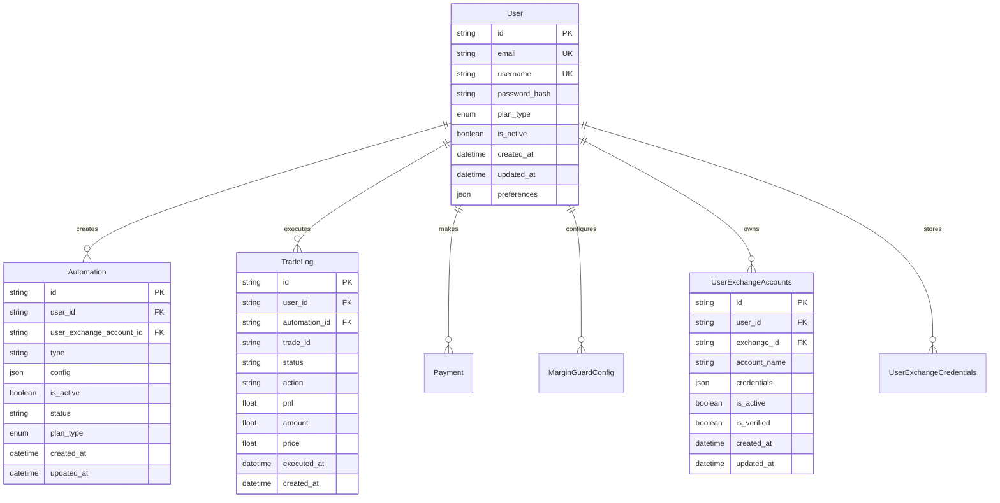

# Database Design - Data Architecture

> **Status**: Active  
> **Última Atualização**: 2025-01-26  
> **Versão**: 1.0.0  
> **Responsável**: Axisor Database Architecture  

## Índice

- [Visão Geral](#visão-geral)
- [Schema Design](#schema-design)
- [Entity Relationships](#entity-relationships)
- [Indexing Strategy](#indexing-strategy)
- [Data Types & Constraints](#data-types--constraints)
- [Migration Strategy](#migration-strategy)
- [Performance Optimization](#performance-optimization)
- [Security & Compliance](#security--compliance)
- [Backup & Recovery](#backup--recovery)
- [Referências](#referências)

## Visão Geral

O banco de dados do Axisor é projetado para suportar uma plataforma de trading automatizado com foco em performance, escalabilidade e integridade de dados. Utiliza PostgreSQL com Prisma ORM para type-safety e migrações automáticas.

## Schema Design

### Core Entities



### Authentication & Security

```prisma
model User {
  id                         String                    @id @default(dbgenerated("(gen_random_uuid())::text"))
  email                      String                    @unique
  username                   String                    @unique
  password_hash              String?
  social_provider            String?
  social_id                  String?
  plan_type                  PlanType                  @default(free)
  is_active                  Boolean                   @default(true)
  email_verified             Boolean?                  @default(false)
  two_factor_enabled         Boolean?                  @default(false)
  two_factor_secret          String?
  two_factor_backup_codes    Json?
  login_attempts             Int?                      @default(0)
  locked_until               DateTime?                 @db.Timestamp(6)
  last_login_ip              String?
  last_login_user_agent      String?
  last_login_at              DateTime?                 @db.Timestamp(6)
  created_at                 DateTime                  @default(now()) @db.Timestamp(6)
  updated_at                 DateTime                  @default(now()) @db.Timestamp(6)
  
  // Relations
  refresh_tokens             RefreshToken[]
  security_audit_logs        SecurityAuditLog[]
  audit_logs                 AuditLog[]
  
  @@index([email], map: "idx_user_email")
  @@index([email_verification_token], map: "idx_user_email_verification_token")
  @@index([password_reset_token], map: "idx_user_password_reset_token")
}

model RefreshToken {
  id           String    @id @default(dbgenerated("(gen_random_uuid())::text"))
  user_id      String
  token        String    @unique
  expires_at   DateTime  @db.Timestamp(6)
  is_revoked   Boolean   @default(false)
  ip_address   String?
  user_agent   String?
  created_at   DateTime  @default(now()) @db.Timestamp(6)
  last_used_at DateTime? @db.Timestamp(6)
  user         User      @relation(fields: [user_id], references: [id], onDelete: Cascade)

  @@index([user_id], map: "idx_refresh_token_user_id")
  @@index([expires_at], map: "idx_refresh_token_expires_at")
  @@index([is_revoked], map: "idx_refresh_token_revoked")
}

model SecurityAuditLog {
  id         String   @id @default(dbgenerated("(gen_random_uuid())::text"))
  user_id    String?
  action     String
  resource   String?
  ip_address String?
  user_agent String?
  success    Boolean  @default(true)
  details    Json?
  created_at DateTime @default(now()) @db.Timestamp(6)
  user       User?    @relation(fields: [user_id], references: [id])

  @@index([user_id], map: "idx_security_audit_user_id")
  @@index([action], map: "idx_security_audit_action")
  @@index([created_at], map: "idx_security_audit_created_at")
}
```

### Trading & Automation

```prisma
model Automation {
  id                       String                @id @default(dbgenerated("(gen_random_uuid())::text"))
  user_id                  String
  user_exchange_account_id String
  type                     String
  config                   Json
  is_active                Boolean               @default(true)
  status                   String                @default("active")
  risk_level               String?
  plan_type                PlanType?
  created_at               DateTime              @default(now()) @db.Timestamp(6)
  updated_at               DateTime              @default(now()) @db.Timestamp(6)
  
  // Relations
  user                     User                  @relation(fields: [user_id], references: [id], onDelete: Cascade)
  user_exchange_account    UserExchangeAccounts  @relation(fields: [user_exchange_account_id], references: [id])
  automation_type          AutomationType?       @relation(fields: [type], references: [slug])
  trade_logs               TradeLog[]

  @@index([user_id], map: "idx_automation_user_id")
  @@index([user_exchange_account_id], map: "idx_automation_account_id")
  @@index([type], map: "idx_automation_type")
  @@index([status], map: "idx_automation_status")
  @@index([risk_level], map: "idx_automation_risk_level")
  @@index([plan_type], map: "idx_automation_plan_type")
}

model TradeLog {
  id            String      @id @default(dbgenerated("(gen_random_uuid())::text"))
  user_id       String
  automation_id String?
  trade_id      String      // LN Markets trade ID
  status        String
  action        String?
  plan_type     PlanType?
  pnl           Float?
  amount        Float?
  price         Float?
  error_message String?
  executed_at   DateTime    @db.Timestamp(6)
  created_at    DateTime    @default(now()) @db.Timestamp(6)
  
  // Relations
  user          User        @relation(fields: [user_id], references: [id], onDelete: Cascade)
  automation    Automation? @relation(fields: [automation_id], references: [id])

  @@index([user_id], map: "idx_tradelog_user_id")
  @@index([automation_id], map: "idx_tradelog_automation_id")
  @@index([status], map: "idx_tradelog_status")
  @@index([action], map: "idx_tradelog_action")
  @@index([executed_at], map: "idx_tradelog_executed_at")
}
```

### Multi-Account System

```prisma
model Exchange {
  id               String                    @id @default(dbgenerated("(gen_random_uuid())::text"))
  name             String                    @unique
  slug             String                    @unique
  description      String?
  website          String?
  logo_url         String?
  is_active        Boolean                   @default(true)
  api_version      String?
  created_at       DateTime                  @default(now()) @db.Timestamp(6)
  updated_at       DateTime                  @default(now()) @db.Timestamp(6)
  
  // Relations
  credential_types ExchangeCredentialType[]
  user_accounts    UserExchangeAccounts[]
  user_credentials UserExchangeCredentials[]

  @@index([slug], map: "idx_exchange_slug")
  @@index([is_active], map: "idx_exchange_active")
}

model UserExchangeCredentials {
  id          String    @id @default(dbgenerated("(gen_random_uuid())::text"))
  user_id     String
  exchange_id String
  credentials Json      // Encrypted credentials
  is_active   Boolean   @default(true)
  is_verified Boolean   @default(false)
  last_test   DateTime? @db.Timestamp(6)
  created_at  DateTime  @default(now()) @db.Timestamp(6)
  updated_at  DateTime  @default(now()) @db.Timestamp(6)
  
  // Relations
  user        User      @relation(fields: [user_id], references: [id], onDelete: Cascade)
  exchange    Exchange  @relation(fields: [exchange_id], references: [id], onDelete: Cascade)

  @@unique([user_id, exchange_id], map: "idx_user_exchange_credentials_unique")
  @@index([user_id], map: "idx_user_exchange_credentials_user_id")
  @@index([exchange_id], map: "idx_user_exchange_credentials_exchange_id")
  @@index([is_active], map: "idx_user_exchange_credentials_active")
  @@index([is_verified], map: "idx_user_exchange_credentials_verified")
}

model UserExchangeAccounts {
  id           String       @id @default(dbgenerated("(gen_random_uuid())::text"))
  user_id      String
  exchange_id  String
  account_name String       @default("Account 01")
  credentials  Json         // Encrypted credentials
  is_active    Boolean      @default(false)
  is_verified  Boolean      @default(false)
  last_test    DateTime?    @db.Timestamp(6)
  created_at   DateTime     @default(now()) @db.Timestamp(6)
  updated_at   DateTime     @default(now()) @db.Timestamp(6)
  
  // Relations
  user         User         @relation(fields: [user_id], references: [id], onDelete: Cascade)
  exchange     Exchange     @relation(fields: [exchange_id], references: [id], onDelete: Cascade)
  automations  Automation[]

  @@index([user_id], map: "idx_user_exchange_accounts_user_id")
  @@index([exchange_id], map: "idx_user_exchange_accounts_exchange_id")
  @@index([is_active], map: "idx_user_exchange_accounts_active")
  @@index([is_verified], map: "idx_user_exchange_accounts_verified")
}
```

### Margin Guard System

```prisma
model MarginGuardConfig {
  id                    String   @id @default(dbgenerated("(gen_random_uuid())::text"))
  user_id               String   @unique
  is_active             Boolean  @default(false)
  mode                  String   @default("global") // 'global' | 'individual' | 'unit'
  margin_threshold      Float    @default(10) // % de distância para acionar
  add_margin_percentage Float    @default(20) // % de margem a adicionar
  selected_positions    String[] // IDs das posições (modo unitário)
  individual_configs    Json?    // Configurações individuais por posição
  created_at            DateTime @default(now()) @db.Timestamp(6)
  updated_at            DateTime @default(now()) @db.Timestamp(6)

  // Relations
  user                  User     @relation(fields: [user_id], references: [id], onDelete: Cascade)

  @@index([user_id], map: "idx_margin_guard_config_user_id")
  @@index([is_active], map: "idx_margin_guard_config_active")
}
```

### Payment & Subscription

```prisma
model Payment {
  id                String    @id @default(dbgenerated("(gen_random_uuid())::text"))
  user_id           String
  amount_sats       Int
  lightning_invoice String
  status            String
  paid_at           DateTime? @db.Timestamp(6)
  created_at        DateTime  @default(now()) @db.Timestamp(6)
  updated_at        DateTime  @default(now()) @db.Timestamp(6)
  plan_type         PlanType
  description       String?
  expires_at        DateTime? @db.Timestamp(6)
  payment_hash      String?
  preimage          String?
  expiry_seconds    Int?
  payment_method    String?
  amount            Float?
  
  // Relations
  user              User      @relation(fields: [user_id], references: [id], onDelete: Cascade)

  @@index([user_id], map: "idx_payment_user_id")
  @@index([payment_hash], map: "idx_payment_hash")
  @@index([status], map: "idx_payment_status")
  @@index([expires_at], map: "idx_payment_expires_at")
  @@index([plan_type], map: "idx_payment_plan_type")
}

model Plan {
  id                String      @id @default(dbgenerated("(gen_random_uuid())::text"))
  name              String      @unique
  slug              String      @unique
  description       String?
  price_sats        Int         @default(0)
  price_monthly     Int?
  price_yearly      Int?
  features          Json?
  is_active         Boolean     @default(true)
  sort_order        Int         @default(0)
  stripe_price_id   String?
  has_api_access    Boolean     @default(false)
  has_advanced      Boolean     @default(false)
  has_priority      Boolean     @default(false)
  max_notifications Int         @default(0)
  created_at        DateTime    @default(now()) @db.Timestamp(6)
  updated_at        DateTime    @default(now()) @db.Timestamp(6)
  
  // Relations
  plan_limits       PlanLimits[]

  @@index([slug], map: "idx_plan_slug")
  @@index([is_active], map: "idx_plan_active")
  @@index([sort_order], map: "idx_plan_sort_order")
}

model PlanLimits {
  id                    String   @id @default(dbgenerated("(gen_random_uuid())::text"))
  plan_id               String   @unique
  max_exchange_accounts Int      @default(1)
  max_automations       Int      @default(5)
  max_indicators        Int      @default(10)
  max_simulations       Int      @default(3)
  max_backtests         Int      @default(5)
  created_at            DateTime @default(now()) @db.Timestamp(6)
  updated_at            DateTime @default(now()) @db.Timestamp(6)
  
  // Relations
  plan                  Plan     @relation(fields: [plan_id], references: [id], onDelete: Cascade)

  @@index([plan_id], map: "idx_plan_limits_plan_id")
}
```

## Entity Relationships

### Relationship Diagram

```mermaid
erDiagram
    User ||--o{ Automation : "creates"
    User ||--o{ TradeLog : "executes"
    User ||--o{ Payment : "makes"
    User ||--o{ MarginGuardConfig : "configures"
    User ||--o{ UserExchangeCredentials : "stores"
    User ||--o{ UserExchangeAccounts : "owns"
    User ||--o{ RefreshToken : "has"
    User ||--o{ SecurityAuditLog : "generates"
    User ||--o{ AuditLog : "creates"
    User ||--o{ Notification : "receives"
    User ||--o{ BacktestReport : "runs"
    User ||--o{ Simulation : "creates"
    
    UserExchangeAccounts ||--o{ Automation : "runs"
    Exchange ||--o{ UserExchangeCredentials : "authenticates"
    Exchange ||--o{ UserExchangeAccounts : "manages"
    Automation ||--o{ TradeLog : "generates"
    AutomationType ||--o{ Automation : "categorizes"
    Plan ||--o{ PlanLimits : "defines"
    
    User {
        string id PK
        string email UK
        string username UK
        enum plan_type
        boolean is_active
        datetime created_at
        datetime updated_at
    }
    
    Automation {
        string id PK
        string user_id FK
        string user_exchange_account_id FK
        string type FK
        json config
        boolean is_active
        string status
        datetime created_at
        datetime updated_at
    }
    
    TradeLog {
        string id PK
        string user_id FK
        string automation_id FK
        string trade_id
        string status
        float pnl
        datetime executed_at
        datetime created_at
    }
    
    UserExchangeAccounts {
        string id PK
        string user_id FK
        string exchange_id FK
        string account_name
        json credentials
        boolean is_active
        boolean is_verified
    }
    
    Exchange {
        string id PK
        string name UK
        string slug UK
        boolean is_active
        datetime created_at
        datetime updated_at
    }
    
    MarginGuardConfig {
        string id PK
        string user_id FK UK
        boolean is_active
        string mode
        float margin_threshold
        string[] selected_positions
        json individual_configs
    }
```

## Indexing Strategy

### Primary Indexes

```sql
-- User table indexes
CREATE INDEX CONCURRENTLY idx_user_email ON "User" (email);
CREATE INDEX CONCURRENTLY idx_user_username ON "User" (username);
CREATE INDEX CONCURRENTLY idx_user_plan_type ON "User" (plan_type);
CREATE INDEX CONCURRENTLY idx_user_is_active ON "User" (is_active);
CREATE INDEX CONCURRENTLY idx_user_created_at ON "User" (created_at);

-- Authentication indexes
CREATE INDEX CONCURRENTLY idx_user_email_verification_token ON "User" (email_verification_token);
CREATE INDEX CONCURRENTLY idx_user_password_reset_token ON "User" (password_reset_token);
CREATE INDEX CONCURRENTLY idx_refresh_token_user_id ON "RefreshToken" (user_id);
CREATE INDEX CONCURRENTLY idx_refresh_token_expires_at ON "RefreshToken" (expires_at);
CREATE INDEX CONCURRENTLY idx_refresh_token_revoked ON "RefreshToken" (is_revoked);

-- Trading indexes
CREATE INDEX CONCURRENTLY idx_automation_user_id ON "Automation" (user_id);
CREATE INDEX CONCURRENTLY idx_automation_account_id ON "Automation" (user_exchange_account_id);
CREATE INDEX CONCURRENTLY idx_automation_type ON "Automation" (type);
CREATE INDEX CONCURRENTLY idx_automation_status ON "Automation" (status);
CREATE INDEX CONCURRENTLY idx_automation_is_active ON "Automation" (is_active);
CREATE INDEX CONCURRENTLY idx_tradelog_user_id ON "TradeLog" (user_id);
CREATE INDEX CONCURRENTLY idx_tradelog_automation_id ON "TradeLog" (automation_id);
CREATE INDEX CONCURRENTLY idx_tradelog_executed_at ON "TradeLog" (executed_at);
CREATE INDEX CONCURRENTLY idx_tradelog_status ON "TradeLog" (status);

-- Multi-account indexes
CREATE INDEX CONCURRENTLY idx_user_exchange_accounts_user_id ON "UserExchangeAccounts" (user_id);
CREATE INDEX CONCURRENTLY idx_user_exchange_accounts_exchange_id ON "UserExchangeAccounts" (exchange_id);
CREATE INDEX CONCURRENTLY idx_user_exchange_accounts_active ON "UserExchangeAccounts" (is_active);
CREATE INDEX CONCURRENTLY idx_user_exchange_credentials_user_id ON "UserExchangeCredentials" (user_id);
CREATE INDEX CONCURRENTLY idx_user_exchange_credentials_exchange_id ON "UserExchangeCredentials" (exchange_id);

-- Payment indexes
CREATE INDEX CONCURRENTLY idx_payment_user_id ON "Payment" (user_id);
CREATE INDEX CONCURRENTLY idx_payment_status ON "Payment" (status);
CREATE INDEX CONCURRENTLY idx_payment_plan_type ON "Payment" (plan_type);
CREATE INDEX CONCURRENTLY idx_payment_created_at ON "Payment" (created_at);
CREATE INDEX CONCURRENTLY idx_payment_hash ON "Payment" (payment_hash);

-- Audit and security indexes
CREATE INDEX CONCURRENTLY idx_security_audit_log_user_id ON "SecurityAuditLog" (user_id);
CREATE INDEX CONCURRENTLY idx_security_audit_log_created_at ON "SecurityAuditLog" (created_at);
CREATE INDEX CONCURRENTLY idx_audit_log_user_id ON "AuditLog" (user_id);
CREATE INDEX CONCURRENTLY idx_audit_log_created_at ON "AuditLog" (created_at);
```

### Composite Indexes

```sql
-- Composite indexes for common query patterns
CREATE INDEX CONCURRENTLY idx_automation_user_active ON "Automation" (user_id, is_active);
CREATE INDEX CONCURRENTLY idx_automation_account_active ON "Automation" (user_exchange_account_id, is_active);
CREATE INDEX CONCURRENTLY idx_tradelog_user_executed ON "TradeLog" (user_id, executed_at);
CREATE INDEX CONCURRENTLY idx_tradelog_automation_executed ON "TradeLog" (automation_id, executed_at);
CREATE INDEX CONCURRENTLY idx_payment_user_status ON "Payment" (user_id, status);
CREATE INDEX CONCURRENTLY idx_security_audit_user_action ON "SecurityAuditLog" (user_id, action);
CREATE INDEX CONCURRENTLY idx_audit_log_user_action ON "AuditLog" (user_id, action);
```

### Partial Indexes

```sql
-- Partial indexes for better performance on filtered data
CREATE INDEX CONCURRENTLY idx_automation_active_only ON "Automation" (user_id, status) WHERE is_active = true;
CREATE INDEX CONCURRENTLY idx_tradelog_successful ON "TradeLog" (user_id, executed_at) WHERE status = 'success';
CREATE INDEX CONCURRENTLY idx_payment_pending ON "Payment" (user_id, created_at) WHERE status = 'pending';
CREATE INDEX CONCURRENTLY idx_security_audit_failed ON "SecurityAuditLog" (user_id, created_at) WHERE success = false;
```

## Data Types & Constraints

### Custom Types

```sql
-- Custom enum types
CREATE TYPE "PlanType" AS ENUM ('free', 'basic', 'advanced', 'pro', 'lifetime');

-- Custom constraints
ALTER TABLE "User" ADD CONSTRAINT chk_user_email_format 
  CHECK (email ~* '^[A-Za-z0-9._%+-]+@[A-Za-z0-9.-]+\.[A-Za-z]{2,}$');

ALTER TABLE "User" ADD CONSTRAINT chk_user_username_length 
  CHECK (char_length(username) >= 3 AND char_length(username) <= 50);

ALTER TABLE "Payment" ADD CONSTRAINT chk_payment_amount_positive 
  CHECK (amount_sats > 0);

ALTER TABLE "MarginGuardConfig" ADD CONSTRAINT chk_margin_threshold_range 
  CHECK (margin_threshold >= 1 AND margin_threshold <= 50);
```

### JSON Schema Validation

```typescript
// JSON schema validation for complex fields
const automationConfigSchema = {
  type: 'object',
  required: ['strategy', 'parameters'],
  properties: {
    strategy: { type: 'string', enum: ['take_profit', 'stop_loss', 'auto_entry'] },
    parameters: {
      type: 'object',
      properties: {
        trigger_price: { type: 'number', minimum: 0 },
        amount: { type: 'number', minimum: 0 },
        leverage: { type: 'number', minimum: 1, maximum: 100 }
      }
    }
  }
};

const marginGuardConfigSchema = {
  type: 'object',
  properties: {
    selected_positions: {
      type: 'array',
      items: { type: 'string' }
    },
    individual_configs: {
      type: 'object',
      patternProperties: {
        '^[a-f0-9-]+$': {
          type: 'object',
          properties: {
            enabled: { type: 'boolean' },
            threshold: { type: 'number', minimum: 1, maximum: 50 }
          }
        }
      }
    }
  }
};
```

## Migration Strategy

### Prisma Migration Workflow

```typescript
// Migration workflow
export class DatabaseMigrationService {
  async runMigrations(): Promise<void> {
    try {
      console.log('🔄 Running database migrations...');
      
      // Generate migration files
      await this.generateMigration();
      
      // Apply migrations
      await this.applyMigrations();
      
      // Verify schema
      await this.verifySchema();
      
      console.log('✅ Database migrations completed successfully');
    } catch (error) {
      console.error('❌ Migration failed:', error);
      await this.rollbackMigration();
      throw error;
    }
  }

  private async generateMigration(): Promise<void> {
    const { execSync } = require('child_process');
    execSync('npx prisma migrate dev --name migration_name', { stdio: 'inherit' });
  }

  private async applyMigrations(): Promise<void> {
    const { execSync } = require('child_process');
    execSync('npx prisma migrate deploy', { stdio: 'inherit' });
  }

  private async verifySchema(): Promise<void> {
    const prisma = new PrismaClient();
    await prisma.$queryRaw`SELECT 1`;
    await prisma.$disconnect();
  }

  private async rollbackMigration(): Promise<void> {
    // Implementation for rollback logic
    console.log('🔄 Rolling back migration...');
  }
}
```

### Safe Migration Patterns

```sql
-- Safe column addition
ALTER TABLE "User" ADD COLUMN IF NOT EXISTS "new_field" TEXT;

-- Safe column removal (with data migration first)
-- Step 1: Create backup
CREATE TABLE "User_backup" AS SELECT * FROM "User";

-- Step 2: Remove column
ALTER TABLE "User" DROP COLUMN IF EXISTS "old_field";

-- Safe index creation
CREATE INDEX CONCURRENTLY IF NOT EXISTS "idx_new_index" ON "User" (new_field);

-- Safe constraint addition
ALTER TABLE "User" ADD CONSTRAINT IF NOT EXISTS "chk_new_constraint" 
  CHECK (new_field IS NOT NULL);
```

## Performance Optimization

### Query Optimization

```typescript
// Optimized queries with proper indexing
class OptimizedQueries {
  // Get user with active automations
  async getUserWithActiveAutomations(userId: string) {
    return this.prisma.user.findUnique({
      where: { id: userId },
      include: {
        automations: {
          where: { is_active: true },
          include: {
            user_exchange_account: {
              include: { exchange: true }
            }
          }
        }
      }
    });
  }

  // Get trading statistics with pagination
  async getTradingStats(userId: string, limit: number = 100, offset: number = 0) {
    return this.prisma.tradeLog.findMany({
      where: { user_id: userId },
      orderBy: { executed_at: 'desc' },
      take: limit,
      skip: offset,
      select: {
        id: true,
        trade_id: true,
        status: true,
        action: true,
        pnl: true,
        amount: true,
        price: true,
        executed_at: true
      }
    });
  }

  // Bulk operations for better performance
  async bulkCreateTradeLogs(logs: CreateTradeLogData[]) {
    return this.prisma.tradeLog.createMany({
      data: logs,
      skipDuplicates: true
    });
  }
}
```

### Connection Pooling

```typescript
// Prisma connection pooling configuration
const prisma = new PrismaClient({
  datasources: {
    db: {
      url: process.env.DATABASE_URL
    }
  },
  log: ['query', 'info', 'warn', 'error'],
  // Connection pooling
  __internal: {
    engine: {
      connection_limit: 20,
      pool_timeout: 10,
      connect_timeout: 60
    }
  }
});
```

## Security & Compliance

### Data Encryption

```typescript
// Encryption service for sensitive data
class DataEncryptionService {
  private readonly algorithm = 'aes-256-gcm';
  private readonly key: Buffer;

  constructor() {
    this.key = crypto.scryptSync(process.env.ENCRYPTION_KEY!, 'salt', 32);
  }

  encrypt(text: string): string {
    const iv = crypto.randomBytes(16);
    const cipher = crypto.createCipher(this.algorithm, this.key);
    cipher.setAAD(Buffer.from('axisor'));
    
    let encrypted = cipher.update(text, 'utf8', 'hex');
    encrypted += cipher.final('hex');
    
    const authTag = cipher.getAuthTag();
    return `${iv.toString('hex')}:${authTag.toString('hex')}:${encrypted}`;
  }

  decrypt(encryptedText: string): string {
    const [ivHex, authTagHex, encrypted] = encryptedText.split(':');
    const iv = Buffer.from(ivHex, 'hex');
    const authTag = Buffer.from(authTagHex, 'hex');
    
    const decipher = crypto.createDecipher(this.algorithm, this.key);
    decipher.setAAD(Buffer.from('axisor'));
    decipher.setAuthTag(authTag);
    
    let decrypted = decipher.update(encrypted, 'hex', 'utf8');
    decrypted += decipher.final('utf8');
    
    return decrypted;
  }
}
```

### Row Level Security

```sql
-- Enable RLS on sensitive tables
ALTER TABLE "User" ENABLE ROW LEVEL SECURITY;
ALTER TABLE "UserExchangeCredentials" ENABLE ROW LEVEL SECURITY;
ALTER TABLE "Payment" ENABLE ROW LEVEL SECURITY;

-- Create policies
CREATE POLICY "Users can only see their own data" ON "User"
  FOR ALL TO authenticated
  USING (id = current_setting('app.current_user_id'));

CREATE POLICY "Users can only access their own credentials" ON "UserExchangeCredentials"
  FOR ALL TO authenticated
  USING (user_id = current_setting('app.current_user_id'));
```

## Backup & Recovery

### Backup Strategy

```bash
#!/bin/bash
# Database backup script

BACKUP_DIR="/backups/postgresql"
DATE=$(date +%Y%m%d_%H%M%S)
BACKUP_FILE="axisor_backup_${DATE}.sql"

# Create backup directory
mkdir -p $BACKUP_DIR

# Full backup
pg_dump -h localhost -U postgres -d axisor \
  --verbose \
  --clean \
  --no-acl \
  --no-owner \
  --format=custom \
  --file="${BACKUP_DIR}/${BACKUP_FILE}"

# Compress backup
gzip "${BACKUP_DIR}/${BACKUP_FILE}"

# Keep only last 30 days of backups
find $BACKUP_DIR -name "*.gz" -mtime +30 -delete

echo "Backup completed: ${BACKUP_FILE}.gz"
```

### Point-in-Time Recovery

```bash
#!/bin/bash
# Point-in-time recovery script

BACKUP_FILE=$1
TARGET_TIME=$2

# Restore from backup
pg_restore -h localhost -U postgres -d axisor \
  --verbose \
  --clean \
  --no-acl \
  --no-owner \
  $BACKUP_FILE

# Apply WAL files up to target time
pg_receivewal -h localhost -U postgres \
  --directory=/backups/wal \
  --until="$TARGET_TIME"
```

## Referências

- [Prisma Schema](../../../backend/prisma/schema.prisma)
- [Database Migrations](../../../backend/prisma/migrations/)
- [High Level Architecture](../system-overview/high-level-architecture.md)
- [Caching Strategy](./caching-strategy.md)
- [Data Flow Diagrams](../system-overview/data-flow-diagrams.md)

## Como Usar Este Documento

• **Para Desenvolvedores**: Use como referência para entender o schema do banco e implementar queries otimizadas.

• **Para DevOps**: Utilize para configurar backups, monitoramento e otimização de performance do banco.

• **Para Arquitetos**: Use para entender as decisões de design e planejar evoluções do schema.
