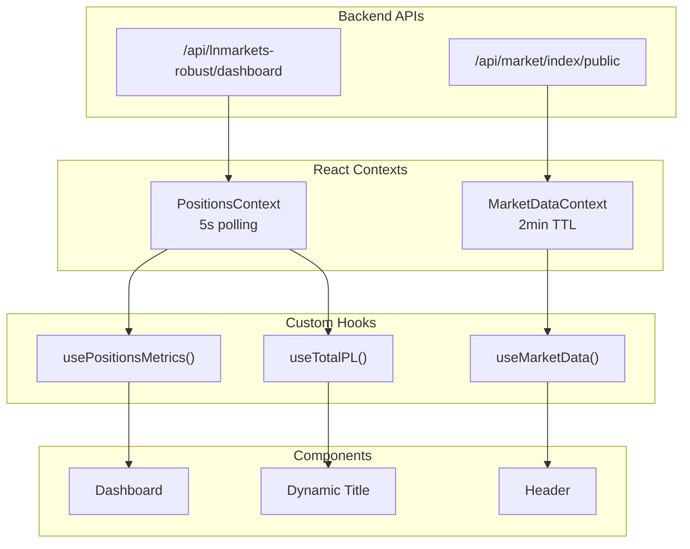
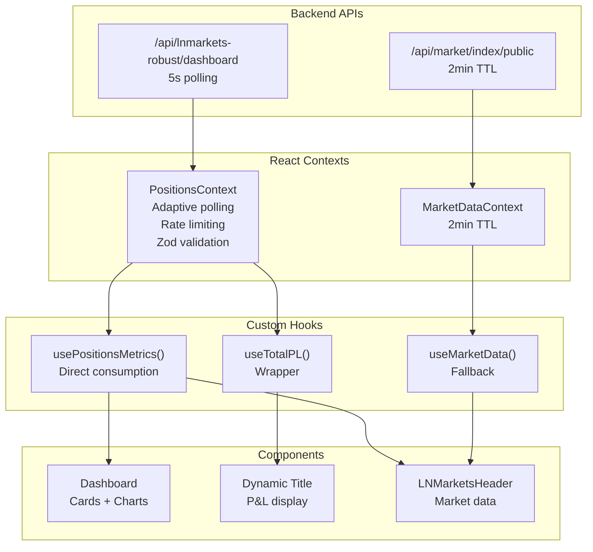

# Frontend State Management - Data Architecture

## Visão Geral

O sistema de gerenciamento de estado do frontend utiliza React Context API para centralizar dados de posições e métricas do usuário. A arquitetura prioriza **Single Source of Truth** para evitar inconsistências entre componentes.

## Arquitetura do Sistema



## Componentes Principais

### PositionsContext

**Arquivo**: `frontend/src/contexts/PositionsContext.tsx`

**Responsabilidade**: Gerenciar posições do usuário e métricas derivadas

**Características**:
- Update interval: 5 segundos
- Dependências: RealtimeDataContext, AuthStore
- Expõe: totalPL, totalMargin, estimatedBalance, positionCount, totalFees

**Interface**:
```typescript
interface PositionsContextData {
  positions: Position[];
  totalPL: number;
  totalMargin: number;
  estimatedBalance: number;
  positionCount: number;
  totalFees: number;
  totalTradingFees: number;
  totalFundingCost: number;
  estimatedFees: number;
  lastUpdate: string;
}
```

### MarketDataContext

**Arquivo**: `frontend/src/contexts/MarketDataContext.tsx`

**Responsabilidade**: Gerenciar dados de mercado públicos

**Características**:
- TTL: 2 minutos
- Dependências: CentralizedDataStore
- Dados: preços, índices, estatísticas públicas

### usePositionsMetrics

**Hook derivado** que expõe métricas calculadas do PositionsContext

**Uso**:
```typescript
const {
  totalPL,
  totalMargin,
  estimatedBalance,
  positionCount,
  totalFees
} = usePositionsMetrics();
```

**Consumido por**:
- Dashboard (cards principais)
- Dynamic Title (P&L no título)
- Header (Trading Fees)

## Fluxo de Dados

```mermaid
sequenceDiagram
    participant Backend
    participant PositionsContext
    participant Dashboard
    participant Title
    
    Backend->>PositionsContext: Fetch positions (5s interval)
    PositionsContext->>PositionsContext: Calculate metrics
    PositionsContext->>Dashboard: usePositionsMetrics()
    PositionsContext->>Title: useTotalPL()
    Dashboard->>Dashboard: Render with data
    Title->>Title: Update title
```

## Padrões de Design

### Context Provider Pattern
- Cada contexto encapsula lógica específica
- Providers aninhados para hierarquia de dados
- Hooks customizados para acesso simplificado

### Custom Hooks Pattern
- `usePositionsMetrics()`: Métricas de posições
- `useTotalPL()`: P&L total para título
- `useMarketData()`: Dados de mercado

### Single Source of Truth
- PositionsContext como fonte única para dados de posições
- Evita polling duplicado
- Garante consistência entre componentes

### Polling Strategy
- useEffect + setInterval para atualizações periódicas
- Cleanup automático em unmount
- Intervalos otimizados por tipo de dados

## Performance

### Cache de Métricas
- Cálculos memoizados
- Dependências otimizadas
- Re-renders minimizados

### Polling Otimizado
- 5s para dados de posições (críticos)
- 2min para dados de mercado (menos críticos)
- Cleanup automático em mudanças de conta

### Memoization
- useMemo para cálculos complexos
- useCallback para funções estáveis
- React.memo para componentes puros

## Configuração de Intervalos

```typescript
// PositionsContext - 5 segundos
useEffect(() => {
  const interval = setInterval(() => {
    fetchRealPositions();
  }, 5000);
  return () => clearInterval(interval);
}, [fetchRealPositions]);

// MarketDataContext - 2 minutos
const TTL = 2 * 60 * 1000; // 2 minutes
```

## Invalidação de Cache

### Automática
- Logout do usuário
- Mudança de conta ativa
- Erro de autenticação

### Manual
- Refresh de página
- Reconexão de WebSocket
- Ação do usuário

## Debugging

### Logs Estruturados
```typescript
console.log('🔍 usePositionsMetrics - Raw data:', {
  totalPL: data.totalPL,
  totalMargin: data.totalMargin,
  estimatedBalance: data.estimatedBalance,
  positionCount: data.positions?.length,
  hasData: !!data
});
```

### Trace de Dados
- Logs em cada etapa do fluxo
- Identificação de fontes de dados
- Validação de consistência

## Troubleshooting

### Problemas Comuns

1. **Dados não atualizando**
   - Verificar se PositionsContext está ativo
   - Confirmar polling interval
   - Validar dependências do useEffect

2. **Inconsistência entre componentes**
   - Verificar se todos usam mesma fonte
   - Confirmar que não há polling duplicado
   - Validar mapeamento de campos

3. **Performance degradada**
   - Verificar intervalos de polling
   - Analisar re-renders desnecessários
   - Confirmar cleanup de listeners

### Logs de Debug
```typescript
// Ativar logs detalhados
const DEBUG_POSITIONS = process.env.NODE_ENV === 'development';

if (DEBUG_POSITIONS) {
  console.log('🔄 POSITIONS CONTEXT - Periodic update');
}
```

## PositionsContext - Implementação Atual

### Polling Adaptativo
O PositionsContext implementa polling inteligente que se adapta à atividade do usuário:

```typescript
// Polling adaptativo: 10s → 30s → 60s
const adaptiveInterval = useMemo(() => {
  if (isActive) return 10000;  // 10s quando ativo
  if (hasRecentActivity) return 30000; // 30s com atividade recente
  return 60000; // 60s quando inativo
}, [isActive, hasRecentActivity]);
```

### Rate Limiting Integrado
Sistema de rate limiting para evitar sobrecarga da API:

```typescript
const { canMakeRequest, recordRequest } = useRateLimiter({
  maxRequests: 1,
  windowMs: 1000, // 1 request por segundo
  circuitBreaker: true
});
```

### Validação Zod em DEV
Validação client-side para detectar regressões:

```typescript
// DEV-only validation
if (import.meta.env.DEV) {
  try {
    const dashboardDTO = {
      totalPL: metrics.totalPL,
      totalMargin: metrics.totalMargin,
      totalFees: metrics.totalFees,
      totalTradingFees: metrics.totalTradingFees,
      totalFundingCost: metrics.totalFundingCost,
      lastUpdate: Date.now()
    };
    DashboardSchema.parse(dashboardDTO);
  } catch (err) {
    console.error('❌ REGRESSION: Dashboard DTO validation failed', err);
  }
}
```

### Hooks Disponíveis

#### `usePositionsMetrics()`
Hook principal para consumir métricas agregadas:

```typescript
const {
  totalPL,
  totalMargin,
  totalFees,
  totalTradingFees,
  totalFundingCost,
  estimatedBalance,
  positionCount,
  lastUpdate
} = usePositionsMetrics();
```

#### `usePositionsSelector()`
Hook otimizado para seletores específicos:

```typescript
const tradingFees = usePositionsSelector(m => m.totalFees);
const fundingCost = usePositionsSelector(m => m.totalFundingCost);
```

## Padrão de Consumo Direto

### Dashboard
Consumo direto sem transformações:

```typescript
const positionsMetrics = usePositionsMetrics();
const contextTotalPL = positionsMetrics.totalPL || 0;
const contextTotalMargin = positionsMetrics.totalMargin || 0;
```

### Dynamic Title
Wrapper simples para P&L:

```typescript
export const useTotalPL = () => {
  const { totalPL } = usePositionsMetrics();
  return totalPL || 0;
};
```

### Header (LNMarketsHeader)
Consumo direto simplificado:

```typescript
const { 
  totalFees,
  totalTradingFees,
  totalFundingCost,
  lastUpdate
} = usePositionsMetrics();
```

## Diagrama de Fluxo Atualizado



## Migração e Evolução

### Versionamento
- Contextos versionados via interface
- Backward compatibility mantida
- Migration guides para mudanças breaking

### Extensibilidade
- Novos campos adicionados via interface
- Hooks customizados para casos específicos
- Padrão consistente para novos contextos

## Referências

- [React Context API](https://react.dev/reference/react/createContext)
- [Custom Hooks Pattern](https://react.dev/learn/reusing-logic-with-custom-hooks)
- [Performance Optimization](https://react.dev/learn/render-and-commit)
- [Dashboard State Refactoring](../migrations/code-migrations/dashboard-state-refactoring.md)
