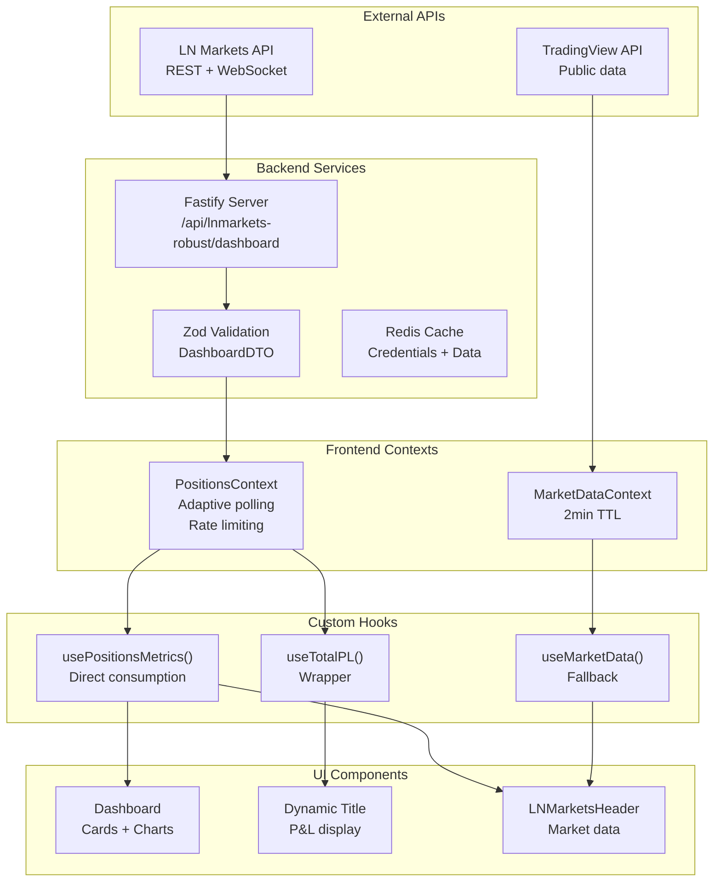

# Real-time Updates Flow - Data Architecture

## Visão Geral

Este documento descreve o fluxo completo de dados em tempo real no sistema, desde a API da LN Markets até a exibição nos componentes frontend. O sistema implementa polling adaptativo, rate limiting e sincronização automática entre Dashboard, Header e Title dinâmico.

## Arquitetura do Sistema

### Componentes Principais



## Fluxo de Dados Detalhado

### 1. Polling Adaptativo

```typescript
// PositionsContext implementa polling inteligente
const adaptiveInterval = useMemo(() => {
  if (isActive) return 10000;  // 10s quando ativo
  if (hasRecentActivity) return 30000; // 30s com atividade recente
  return 60000; // 60s quando inativo
}, [isActive, hasRecentActivity]);
```

### 2. Rate Limiting

```typescript
// Sistema de rate limiting integrado
const { canMakeRequest, recordRequest } = useRateLimiter({
  maxRequests: 1,
  windowMs: 1000, // 1 request por segundo
  circuitBreaker: true
});
```

### 3. Validação Zod

```typescript
// Validação client-side em DEV
if (import.meta.env.DEV) {
  try {
    const dashboardDTO = {
      totalPL: metrics.totalPL,
      totalMargin: metrics.totalMargin,
      totalFees: metrics.totalFees,
      totalTradingFees: metrics.totalTradingFees,
      totalFundingCost: metrics.totalFundingCost,
      lastUpdate: Date.now()
    };
    DashboardSchema.parse(dashboardDTO);
  } catch (err) {
    console.error('❌ REGRESSION: Dashboard DTO validation failed', err);
  }
}
```

## Sequence Diagram

```mermaid
sequenceDiagram
    participant API as LN Markets API
    participant Backend as Backend Service
    participant Context as PositionsContext
    participant Hook as usePositionsMetrics()
    participant Dash as Dashboard
    participant Title as Dynamic Title
    participant Header as LNMarketsHeader
    
    loop Every 10-60s (adaptive)
        Context->>Backend: GET /api/lnmarkets-robust/dashboard
        Backend->>API: Fetch positions + balance
        API-->>Backend: Raw data
        Backend->>Backend: Calculate metrics + validate Zod
        Backend-->>Context: DashboardDTO
        Context->>Context: Update state
        Context-->>Hook: Notify subscribers
        Hook-->>Dash: totalPL, totalMargin, totalFees...
        Hook-->>Title: totalPL
        Hook-->>Header: totalFees, lastUpdate...
    end
```

## Implementação por Componente

### Dashboard

```typescript
// frontend/src/pages/Dashboard.tsx
const positionsMetrics = usePositionsMetrics();

const contextTotalPL = positionsMetrics.totalPL || 0;
const contextTotalMargin = positionsMetrics.totalMargin || 0;
const contextTotalFees = positionsMetrics.totalFees || 0;

// Cards atualizam automaticamente quando PositionsContext muda
<MetricCard
  title="Total P&L"
  value={formatSats(contextTotalPL)}
  variant={contextTotalPL >= 0 ? 'success' : 'danger'}
/>
```

### Dynamic Title

```typescript
// frontend/src/hooks/usePageTitle.ts
export const useTotalPL = () => {
  const { totalPL } = usePositionsMetrics();
  return totalPL || 0;
};

// Title atualiza automaticamente
useEffect(() => {
  document.title = `Axisor - P&L: ${formatSats(totalPL)}`;
}, [totalPL]);
```

### Header (LNMarketsHeader)

```typescript
// frontend/src/components/layout/LNMarketsHeader.tsx
const { 
  totalFees,
  totalTradingFees,
  totalFundingCost,
  lastUpdate
} = usePositionsMetrics();

// Cálculo direto no render (sem cache intermediário)
const marketData = isAuthenticated && totalFees !== undefined ? {
  tradingFees: totalFees, // direto, sem debounce
  nextFunding: publicData?.nextFunding || 'N/A',
  rate: publicData?.rate || 0,
  lastUpdate: new Date(lastUpdate),
  source: 'lnmarkets'
} : publicData;
```

## Estados do Sistema

### 1. Estado Inicial

```typescript
// Posições iniciais
const initialState = {
  positions: [],
  totalPL: 0,
  totalMargin: 0,
  totalFees: 0,
  totalTradingFees: 0,
  totalFundingCost: 0,
  estimatedBalance: 0,
  positionCount: 0,
  lastUpdate: Date.now(),
  isLoading: true,
  error: null
};
```

### 2. Estado de Loading

```typescript
// Durante fetch de dados
const loadingState = {
  ...initialState,
  isLoading: true,
  error: null
};
```

### 3. Estado de Sucesso

```typescript
// Dados carregados com sucesso
const successState = {
  positions: [...],
  totalPL: 1412,
  totalMargin: 26504,
  totalFees: 867,
  totalTradingFees: 271,
  totalFundingCost: 596,
  estimatedBalance: 50000,
  positionCount: 3,
  lastUpdate: 1698123456789,
  isLoading: false,
  error: null
};
```

### 4. Estado de Erro

```typescript
// Erro no fetch
const errorState = {
  ...initialState,
  isLoading: false,
  error: "Invalid credentials"
};
```

## Sincronização entre Componentes

### Padrão de Consumo Direto

```typescript
// Todos os componentes usam a mesma fonte
const Component1 = () => {
  const { totalPL } = usePositionsMetrics();
  return <div>P&L: {totalPL}</div>;
};

const Component2 = () => {
  const { totalPL } = usePositionsMetrics();
  return <div>P&L: {totalPL}</div>;
};

// Ambos mostram o mesmo valor, sincronizados automaticamente
```

### Eliminação de Cache Intermediário

```typescript
// ❌ Evitar cache intermediário
const cachedData = useMemo(() => {
  return { totalPL, totalMargin };
}, [totalPL, totalMargin]);

// ✅ Usar dados diretos
const { totalPL, totalMargin } = usePositionsMetrics();
```

## Performance e Otimizações

### 1. Polling Inteligente

```typescript
// Polling adaptativo baseado na atividade
const getPollingInterval = (isActive: boolean, hasRecentActivity: boolean) => {
  if (isActive) return 10000;  // 10s quando ativo
  if (hasRecentActivity) return 30000; // 30s com atividade
  return 60000; // 60s quando inativo
};
```

### 2. Rate Limiting

```typescript
// Evitar sobrecarga da API
const rateLimiter = {
  maxRequests: 1,
  windowMs: 1000,
  circuitBreaker: true,
  retryAfter: 5000
};
```

### 3. Validação Eficiente

```typescript
// Validação apenas em desenvolvimento
if (import.meta.env.DEV) {
  DashboardSchema.parse(dashboardDTO);
}
```

## Troubleshooting

### 1. Dados não Atualizando

```typescript
// Verificar se PositionsContext está ativo
console.log('🔍 CONTEXT - Is active:', !!context);
console.log('🔍 CONTEXT - Last update:', context?.lastUpdate);
console.log('🔍 CONTEXT - Polling interval:', interval);
```

### 2. Inconsistência entre Componentes

```typescript
// Verificar se todos usam mesma fonte
const dashboardPL = usePositionsMetrics().totalPL;
const titlePL = useTotalPL();
const headerPL = usePositionsMetrics().totalPL;

console.log('🔍 SYNC - Dashboard PL:', dashboardPL);
console.log('🔍 SYNC - Title PL:', titlePL);
console.log('🔍 SYNC - Header PL:', headerPL);
```

### 3. Performance Degradada

```typescript
// Verificar re-renders desnecessários
const Component = () => {
  console.log('🔄 RENDER - Component re-rendering');
  const { totalPL } = usePositionsMetrics();
  return <div>{totalPL}</div>;
};
```

## Monitoramento

### 1. Logs de Sistema

```typescript
// Logs estruturados para monitoramento
console.log('📊 SYSTEM - Data flow:', {
  timestamp: new Date().toISOString(),
  component: 'PositionsContext',
  action: 'fetch_data',
  interval: pollingInterval,
  success: true,
  dataSize: Object.keys(data).length
});
```

### 2. Métricas de Performance

```typescript
// Métricas de performance
const performanceMetrics = {
  fetchTime: Date.now() - startTime,
  dataSize: JSON.stringify(data).length,
  componentUpdates: renderCount,
  memoryUsage: performance.memory?.usedJSHeapSize
};
```

### 3. Health Checks

```typescript
// Verificação de saúde do sistema
const healthCheck = {
  positionsContext: !!context,
  lastUpdate: context?.lastUpdate,
  timeSinceUpdate: Date.now() - (context?.lastUpdate || 0),
  isHealthy: (Date.now() - (context?.lastUpdate || 0)) < 60000
};
```

## Evolução Futura

### 1. WebSocket Integration

```typescript
// Futura integração com WebSocket
const useWebSocketData = () => {
  const [data, setData] = useState(null);
  
  useEffect(() => {
    const ws = new WebSocket('wss://api.lnmarkets.com/ws');
    ws.onmessage = (event) => {
      setData(JSON.parse(event.data));
    };
    
    return () => ws.close();
  }, []);
  
  return data;
};
```

### 2. Offline Support

```typescript
// Suporte para modo offline
const useOfflineData = () => {
  const [isOnline, setIsOnline] = useState(navigator.onLine);
  const [cachedData, setCachedData] = useState(null);
  
  useEffect(() => {
    const handleOnline = () => setIsOnline(true);
    const handleOffline = () => setIsOnline(false);
    
    window.addEventListener('online', handleOnline);
    window.addEventListener('offline', handleOffline);
    
    return () => {
      window.removeEventListener('online', handleOnline);
      window.removeEventListener('offline', handleOffline);
    };
  }, []);
  
  return isOnline ? data : cachedData;
};
```

## Referências

- [Frontend State Management](../data-architecture/frontend-state-management.md)
- [Dashboard Implementation](../components/dashboard-implementation.md)
- [Header Implementation](../components/header-implementation.md)
- [Direct Context Consumption Pattern](../patterns/direct-context-consumption.md)
- [Dashboard Header Sync Issues](../../troubleshooting/dashboard-header-sync-issues.md)
- [React Context API](https://react.dev/reference/react/createContext)
- [WebSocket API](https://developer.mozilla.org/en-US/docs/Web/API/WebSocket)
- [Performance Monitoring](https://developer.mozilla.org/en-US/docs/Web/API/Performance)
