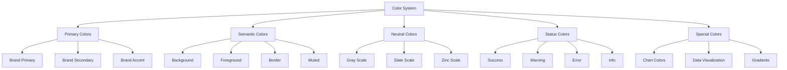

# Color Palette - Design System

> **Status**: Active  
> **Última Atualização**: 2025-01-26  
> **Versão**: 1.0.0  
> **Responsável**: Axisor Design Team  

## Índice

- [Visão Geral](#visão-geral)
- [Color System Architecture](#color-system-architecture)
- [Primary Colors](#primary-colors)
- [Semantic Colors](#semantic-colors)
- [Neutral Colors](#neutral-colors)
- [Status Colors](#status-colors)
- [Dark Mode Colors](#dark-mode-colors)
- [Color Usage Guidelines](#color-usage-guidelines)
- [Accessibility](#accessibility)
- [Implementation](#implementation)
- [Troubleshooting](#troubleshooting)
- [Referências](#referências)

## Visão Geral

O sistema de cores do Axisor é baseado em Tailwind CSS com uma paleta customizada otimizada para aplicações financeiras. O sistema implementa cores semânticas, suporte completo a modo escuro, e garante acessibilidade WCAG AA em todos os componentes.

## Color System Architecture

### Color Token Structure



### Color Configuration

```typescript
// Color System Configuration
interface ColorSystem {
  primary: ColorScale;
  secondary: ColorScale;
  accent: ColorScale;
  neutral: ColorScale;
  semantic: SemanticColors;
  status: StatusColors;
  special: SpecialColors;
}

interface ColorScale {
  50: string;
  100: string;
  200: string;
  300: string;
  400: string;
  500: string;
  600: string;
  700: string;
  800: string;
  900: string;
  950: string;
}

interface SemanticColors {
  background: string;
  foreground: string;
  card: string;
  cardForeground: string;
  popover: string;
  popoverForeground: string;
  primary: string;
  primaryForeground: string;
  secondary: string;
  secondaryForeground: string;
  muted: string;
  mutedForeground: string;
  accent: string;
  accentForeground: string;
  destructive: string;
  destructiveForeground: string;
  border: string;
  input: string;
  ring: string;
}

interface StatusColors {
  success: ColorScale;
  warning: ColorScale;
  error: ColorScale;
  info: ColorScale;
}

interface SpecialColors {
  chart: ChartColors;
  gradients: GradientColors;
  trading: TradingColors;
}
```

## Primary Colors

### Brand Colors

```typescript
// Primary Brand Colors
const primaryColors: ColorScale = {
  50: '#eff6ff',   // Very light blue
  100: '#dbeafe',  // Light blue
  200: '#bfdbfe',  // Lighter blue
  300: '#93c5fd',  // Light blue
  400: '#60a5fa',  // Medium light blue
  500: '#3b82f6',  // Primary blue (main brand color)
  600: '#2563eb',  // Medium blue
  700: '#1d4ed8',  // Dark blue
  800: '#1e40af',  // Darker blue
  900: '#1e3a8a',  // Very dark blue
  950: '#172554'   // Darkest blue
};

// Secondary Brand Colors
const secondaryColors: ColorScale = {
  50: '#f8fafc',   // Very light slate
  100: '#f1f5f9',  // Light slate
  200: '#e2e8f0',  // Lighter slate
  300: '#cbd5e1',  // Light slate
  400: '#94a3b8',  // Medium light slate
  500: '#64748b',  // Medium slate
  600: '#475569',  // Medium dark slate
  700: '#334155',  // Dark slate
  800: '#1e293b',  // Darker slate
  900: '#0f172a',  // Very dark slate
  950: '#020617'   // Darkest slate
};

// Accent Colors
const accentColors: ColorScale = {
  50: '#fef2f2',   // Very light red
  100: '#fee2e2',  // Light red
  200: '#fecaca',  // Lighter red
  300: '#fca5a5',  // Light red
  400: '#f87171',  // Medium light red
  500: '#ef4444',  // Medium red
  600: '#dc2626',  // Medium dark red
  700: '#b91c1c',  // Dark red
  800: '#991b1b',  // Darker red
  900: '#7f1d1d',  // Very dark red
  950: '#450a0a'   // Darkest red
};

// Usage in Components
const ButtonPrimary: React.FC = () => (
  <button className="bg-primary-500 hover:bg-primary-600 text-white">
    Primary Button
  </button>
);
```

### Color Variations

```css
/* CSS Custom Properties for Dynamic Colors */
:root {
  /* Primary Colors */
  --color-primary-50: #eff6ff;
  --color-primary-100: #dbeafe;
  --color-primary-200: #bfdbfe;
  --color-primary-300: #93c5fd;
  --color-primary-400: #60a5fa;
  --color-primary-500: #3b82f6;
  --color-primary-600: #2563eb;
  --color-primary-700: #1d4ed8;
  --color-primary-800: #1e40af;
  --color-primary-900: #1e3a8a;
  --color-primary-950: #172554;

  /* Dynamic Primary (changes based on theme) */
  --color-primary: var(--color-primary-500);
  --color-primary-foreground: #ffffff;
  --color-primary-hover: var(--color-primary-600);
  --color-primary-active: var(--color-primary-700);
  --color-primary-disabled: var(--color-primary-300);
}

/* Dark mode overrides */
[data-theme="dark"] {
  --color-primary: var(--color-primary-400);
  --color-primary-foreground: var(--color-primary-950);
  --color-primary-hover: var(--color-primary-300);
  --color-primary-active: var(--color-primary-200);
}
```

## Semantic Colors

### Background and Foreground

```typescript
// Semantic Color System
const semanticColors: SemanticColors = {
  // Background colors
  background: 'hsl(0 0% 100%)',           // White
  foreground: 'hsl(222.2 84% 4.9%)',      // Very dark blue
  
  // Card colors
  card: 'hsl(0 0% 100%)',                 // White
  cardForeground: 'hsl(222.2 84% 4.9%)',  // Very dark blue
  
  // Popover colors
  popover: 'hsl(0 0% 100%)',              // White
  popoverForeground: 'hsl(222.2 84% 4.9%)', // Very dark blue
  
  // Primary colors
  primary: 'hsl(221.2 83.2% 53.3%)',      // Blue
  primaryForeground: 'hsl(210 40% 98%)',   // Light blue
  
  // Secondary colors
  secondary: 'hsl(210 40% 96%)',          // Very light blue
  secondaryForeground: 'hsl(222.2 84% 4.9%)', // Very dark blue
  
  // Muted colors
  muted: 'hsl(210 40% 96%)',              // Very light blue
  mutedForeground: 'hsl(215.4 16.3% 46.9%)', // Medium gray
  
  // Accent colors
  accent: 'hsl(210 40% 96%)',             // Very light blue
  accentForeground: 'hsl(222.2 84% 4.9%)', // Very dark blue
  
  // Destructive colors
  destructive: 'hsl(0 84.2% 60.2%)',      // Red
  destructiveForeground: 'hsl(210 40% 98%)', // Light blue
  
  // Border and input colors
  border: 'hsl(214.3 31.8% 91.4%)',       // Light gray
  input: 'hsl(214.3 31.8% 91.4%)',        // Light gray
  ring: 'hsl(221.2 83.2% 53.3%)'          // Blue
};

// Dark mode semantic colors
const darkModeSemanticColors: SemanticColors = {
  background: 'hsl(222.2 84% 4.9%)',      // Very dark blue
  foreground: 'hsl(210 40% 98%)',         // Light blue
  
  card: 'hsl(222.2 84% 4.9%)',            // Very dark blue
  cardForeground: 'hsl(210 40% 98%)',     // Light blue
  
  popover: 'hsl(222.2 84% 4.9%)',         // Very dark blue
  popoverForeground: 'hsl(210 40% 98%)',  // Light blue
  
  primary: 'hsl(217.2 91.2% 59.8%)',      // Light blue
  primaryForeground: 'hsl(222.2 84% 4.9%)', // Very dark blue
  
  secondary: 'hsl(217.2 32.6% 17.5%)',    // Dark blue
  secondaryForeground: 'hsl(210 40% 98%)', // Light blue
  
  muted: 'hsl(217.2 32.6% 17.5%)',        // Dark blue
  mutedForeground: 'hsl(215 20.2% 65.1%)', // Medium gray
  
  accent: 'hsl(217.2 32.6% 17.5%)',       // Dark blue
  accentForeground: 'hsl(210 40% 98%)',   // Light blue
  
  destructive: 'hsl(0 62.8% 30.6%)',      // Dark red
  destructiveForeground: 'hsl(210 40% 98%)', // Light blue
  
  border: 'hsl(217.2 32.6% 17.5%)',       // Dark blue
  input: 'hsl(217.2 32.6% 17.5%)',        // Dark blue
  ring: 'hsl(224.3 76.3% 94.1%)'          // Very light blue
};
```

## Neutral Colors

### Gray Scale System

```typescript
// Neutral Color Scales
const neutralColors = {
  // Standard gray scale
  gray: {
    50: '#f9fafb',
    100: '#f3f4f6',
    200: '#e5e7eb',
    300: '#d1d5db',
    400: '#9ca3af',
    500: '#6b7280',
    600: '#4b5563',
    700: '#374151',
    800: '#1f2937',
    900: '#111827',
    950: '#030712'
  },
  
  // Slate scale (cooler grays)
  slate: {
    50: '#f8fafc',
    100: '#f1f5f9',
    200: '#e2e8f0',
    300: '#cbd5e1',
    400: '#94a3b8',
    500: '#64748b',
    600: '#475569',
    700: '#334155',
    800: '#1e293b',
    900: '#0f172a',
    950: '#020617'
  },
  
  // Zinc scale (neutral grays)
  zinc: {
    50: '#fafafa',
    100: '#f4f4f5',
    200: '#e4e4e7',
    300: '#d4d4d8',
    400: '#a1a1aa',
    500: '#71717a',
    600: '#52525b',
    700: '#3f3f46',
    800: '#27272a',
    900: '#18181b',
    950: '#09090b'
  }
};

// Usage in Tailwind CSS
const neutralUsage = {
  text: {
    primary: 'text-gray-900',        // Dark text
    secondary: 'text-gray-600',      // Medium text
    muted: 'text-gray-500',          // Muted text
    disabled: 'text-gray-400'        // Disabled text
  },
  
  background: {
    primary: 'bg-white',             // White background
    secondary: 'bg-gray-50',         // Light gray background
    tertiary: 'bg-gray-100',         // Medium light gray
    elevated: 'bg-white shadow-sm'   // Elevated background
  },
  
  border: {
    light: 'border-gray-200',        // Light borders
    medium: 'border-gray-300',       // Medium borders
    strong: 'border-gray-400'        // Strong borders
  }
};
```

## Status Colors

### Success, Warning, Error, Info

```typescript
// Status Color System
const statusColors: StatusColors = {
  // Success colors (green)
  success: {
    50: '#f0fdf4',
    100: '#dcfce7',
    200: '#bbf7d0',
    300: '#86efac',
    400: '#4ade80',
    500: '#22c55e',    // Primary success color
    600: '#16a34a',
    700: '#15803d',
    800: '#166534',
    900: '#14532d',
    950: '#052e16'
  },
  
  // Warning colors (yellow/amber)
  warning: {
    50: '#fffbeb',
    100: '#fef3c7',
    200: '#fde68a',
    300: '#fcd34d',
    400: '#fbbf24',
    500: '#f59e0b',    // Primary warning color
    600: '#d97706',
    700: '#b45309',
    800: '#92400e',
    900: '#78350f',
    950: '#451a03'
  },
  
  // Error colors (red)
  error: {
    50: '#fef2f2',
    100: '#fee2e2',
    200: '#fecaca',
    300: '#fca5a5',
    400: '#f87171',
    500: '#ef4444',    // Primary error color
    600: '#dc2626',
    700: '#b91c1c',
    800: '#991b1b',
    900: '#7f1d1d',
    950: '#450a0a'
  },
  
  // Info colors (blue)
  info: {
    50: '#eff6ff',
    100: '#dbeafe',
    200: '#bfdbfe',
    300: '#93c5fd',
    400: '#60a5fa',
    500: '#3b82f6',    // Primary info color
    600: '#2563eb',
    700: '#1d4ed8',
    800: '#1e40af',
    900: '#1e3a8a',
    950: '#172554'
  }
};

// Status Color Usage
const statusUsage = {
  // Success states
  success: {
    background: 'bg-success-50',
    text: 'text-success-700',
    border: 'border-success-200',
    icon: 'text-success-500'
  },
  
  // Warning states
  warning: {
    background: 'bg-warning-50',
    text: 'text-warning-700',
    border: 'border-warning-200',
    icon: 'text-warning-500'
  },
  
  // Error states
  error: {
    background: 'bg-error-50',
    text: 'text-error-700',
    border: 'border-error-200',
    icon: 'text-error-500'
  },
  
  // Info states
  info: {
    background: 'bg-info-50',
    text: 'text-info-700',
    border: 'border-info-200',
    icon: 'text-info-500'
  }
};
```

## Dark Mode Colors

### Dark Theme Implementation

```typescript
// Dark Mode Color System
const darkModeColors = {
  // Background colors
  background: {
    primary: '#0f172a',      // Very dark blue
    secondary: '#1e293b',    // Dark blue
    tertiary: '#334155',     // Medium dark blue
    elevated: '#1e293b'      // Elevated dark blue
  },
  
  // Text colors
  text: {
    primary: '#f8fafc',      // Light blue
    secondary: '#cbd5e1',    // Medium light blue
    muted: '#94a3b8',        // Medium blue
    disabled: '#64748b'      // Medium dark blue
  },
  
  // Border colors
  border: {
    primary: '#334155',      // Medium dark blue
    secondary: '#475569',    // Dark blue
    focus: '#60a5fa'         // Light blue for focus states
  },
  
  // Status colors (adjusted for dark mode)
  status: {
    success: '#22c55e',      // Green
    warning: '#f59e0b',      // Amber
    error: '#ef4444',        // Red
    info: '#3b82f6'          // Blue
  }
};

// Dark Mode Implementation
const DarkModeProvider: React.FC<{ children: React.ReactNode }> = ({ children }) => {
  const [isDarkMode, setIsDarkMode] = useState(false);
  
  useEffect(() => {
    // Apply dark mode classes
    if (isDarkMode) {
      document.documentElement.classList.add('dark');
    } else {
      document.documentElement.classList.remove('dark');
    }
  }, [isDarkMode]);
  
  return (
    <DarkModeContext.Provider value={{ isDarkMode, setIsDarkMode }}>
      {children}
    </DarkModeContext.Provider>
  );
};

// Usage in Components
const DarkModeButton: React.FC = () => {
  const { isDarkMode, setIsDarkMode } = useDarkMode();
  
  return (
    <button
      onClick={() => setIsDarkMode(!isDarkMode)}
      className="bg-gray-200 dark:bg-gray-700 text-gray-800 dark:text-gray-200 px-4 py-2 rounded"
    >
      {isDarkMode ? 'Light Mode' : 'Dark Mode'}
    </button>
  );
};
```

## Color Usage Guidelines

### Do's and Don'ts

```typescript
// Color Usage Guidelines
const colorGuidelines = {
  // Primary Color Usage
  primary: {
    do: [
      'Use primary-500 for main actions and links',
      'Use primary-600 for hover states',
      'Use primary-700 for active states',
      'Use primary-100 for light backgrounds',
      'Ensure sufficient contrast with text'
    ],
    dont: [
      'Don\'t use primary colors for large background areas',
      'Don\'t use multiple primary color variations in the same component',
      'Don\'t use primary colors for error states',
      'Don\'t use primary colors without proper contrast'
    ]
  },
  
  // Status Color Usage
  status: {
    do: [
      'Use success colors for positive actions and confirmations',
      'Use warning colors for cautionary messages',
      'Use error colors for destructive actions and errors',
      'Use info colors for informational messages',
      'Combine with appropriate icons'
    ],
    dont: [
      'Don\'t use status colors for decorative purposes',
      'Don\'t mix status colors in the same context',
      'Don\'t use status colors without proper semantic meaning',
      'Don\'t use error colors for warnings'
    ]
  },
  
  // Neutral Color Usage
  neutral: {
    do: [
      'Use gray-900 for primary text',
      'Use gray-600 for secondary text',
      'Use gray-100 for subtle backgrounds',
      'Use gray-200 for borders and dividers',
      'Maintain consistent text hierarchy'
    ],
    dont: [
      'Don\'t use too many gray variations in one interface',
      'Don\'t use gray colors for interactive elements',
      'Don\'t use gray-500 or darker for small text',
      'Don\'t use gray colors without considering accessibility'
    ]
  }
};

// Color Combination Examples
const colorCombinations = {
  // Good combinations
  good: [
    {
      background: 'bg-white',
      text: 'text-gray-900',
      accent: 'text-primary-600',
      description: 'High contrast, accessible'
    },
    {
      background: 'bg-success-50',
      text: 'text-success-800',
      accent: 'text-success-600',
      description: 'Semantic success state'
    },
    {
      background: 'bg-gray-50',
      text: 'text-gray-700',
      accent: 'text-primary-500',
      description: 'Subtle background with clear hierarchy'
    }
  ],
  
  // Bad combinations
  bad: [
    {
      background: 'bg-primary-100',
      text: 'text-primary-200',
      accent: 'text-primary-300',
      description: 'Low contrast, hard to read'
    },
    {
      background: 'bg-gray-400',
      text: 'text-gray-500',
      accent: 'text-gray-600',
      description: 'Too similar, no hierarchy'
    },
    {
      background: 'bg-error-500',
      text: 'text-success-500',
      accent: 'text-warning-500',
      description: 'Conflicting semantic meanings'
    }
  ]
};
```

## Accessibility

### WCAG Compliance

```typescript
// Accessibility Color Utilities
class ColorAccessibility {
  // Check color contrast ratio
  static getContrastRatio(color1: string, color2: string): number {
    const luminance1 = this.getLuminance(color1);
    const luminance2 = this.getLuminance(color2);
    
    const lighter = Math.max(luminance1, luminance2);
    const darker = Math.min(luminance1, luminance2);
    
    return (lighter + 0.05) / (darker + 0.05);
  }
  
  // Get relative luminance
  private static getLuminance(color: string): number {
    const rgb = this.hexToRgb(color);
    const [r, g, b] = rgb.map(c => {
      c = c / 255;
      return c <= 0.03928 ? c / 12.92 : Math.pow((c + 0.055) / 1.055, 2.4);
    });
    
    return 0.2126 * r + 0.7152 * g + 0.0722 * b;
  }
  
  // Convert hex to RGB
  private static hexToRgb(hex: string): [number, number, number] {
    const result = /^#?([a-f\d]{2})([a-f\d]{2})([a-f\d]{2})$/i.exec(hex);
    return result ? [
      parseInt(result[1], 16),
      parseInt(result[2], 16),
      parseInt(result[3], 16)
    ] : [0, 0, 0];
  }
  
  // Check if color combination meets WCAG AA
  static meetsWCAGAA(foreground: string, background: string): boolean {
    const ratio = this.getContrastRatio(foreground, background);
    return ratio >= 4.5; // WCAG AA standard
  }
  
  // Check if color combination meets WCAG AAA
  static meetsWCAGAAA(foreground: string, background: string): boolean {
    const ratio = this.getContrastRatio(foreground, background);
    return ratio >= 7; // WCAG AAA standard
  }
  
  // Get accessible color recommendations
  static getAccessibleColors(background: string, desiredForeground?: string): string[] {
    const accessibleColors: string[] = [];
    
    // Test common foreground colors
    const testColors = [
      '#000000', '#ffffff', '#333333', '#666666',
      '#999999', '#cccccc', '#f5f5f5', '#e5e5e5'
    ];
    
    for (const color of testColors) {
      if (this.meetsWCAGAA(color, background)) {
        accessibleColors.push(color);
      }
    }
    
    return accessibleColors;
  }
}

// Accessibility Color Tests
const accessibilityTests = [
  {
    name: 'Primary Button',
    background: '#3b82f6',
    foreground: '#ffffff',
    ratio: ColorAccessibility.getContrastRatio('#ffffff', '#3b82f6'),
    meetsAA: ColorAccessibility.meetsWCAGAA('#ffffff', '#3b82f6'),
    meetsAAA: ColorAccessibility.meetsWCAGAAA('#ffffff', '#3b82f6')
  },
  {
    name: 'Error Text',
    background: '#ffffff',
    foreground: '#ef4444',
    ratio: ColorAccessibility.getContrastRatio('#ef4444', '#ffffff'),
    meetsAA: ColorAccessibility.meetsWCAGAA('#ef4444', '#ffffff'),
    meetsAAA: ColorAccessibility.meetsWCAGAAA('#ef4444', '#ffffff')
  },
  {
    name: 'Muted Text',
    background: '#ffffff',
    foreground: '#6b7280',
    ratio: ColorAccessibility.getContrastRatio('#6b7280', '#ffffff'),
    meetsAA: ColorAccessibility.meetsWCAGAA('#6b7280', '#ffffff'),
    meetsAAA: ColorAccessibility.meetsWCAGAAA('#6b7280', '#ffffff')
  }
];
```

## Implementation

### Tailwind CSS Configuration

```javascript
// tailwind.config.js
module.exports = {
  content: [
    './src/**/*.{js,ts,jsx,tsx}',
    './public/index.html'
  ],
  darkMode: 'class',
  theme: {
    extend: {
      colors: {
        // Primary colors
        primary: {
          50: '#eff6ff',
          100: '#dbeafe',
          200: '#bfdbfe',
          300: '#93c5fd',
          400: '#60a5fa',
          500: '#3b82f6',
          600: '#2563eb',
          700: '#1d4ed8',
          800: '#1e40af',
          900: '#1e3a8a',
          950: '#172554'
        },
        
        // Semantic colors
        background: 'hsl(var(--background))',
        foreground: 'hsl(var(--foreground))',
        card: {
          DEFAULT: 'hsl(var(--card))',
          foreground: 'hsl(var(--card-foreground))'
        },
        popover: {
          DEFAULT: 'hsl(var(--popover))',
          foreground: 'hsl(var(--popover-foreground))'
        },
        primary: {
          DEFAULT: 'hsl(var(--primary))',
          foreground: 'hsl(var(--primary-foreground))'
        },
        secondary: {
          DEFAULT: 'hsl(var(--secondary))',
          foreground: 'hsl(var(--secondary-foreground))'
        },
        muted: {
          DEFAULT: 'hsl(var(--muted))',
          foreground: 'hsl(var(--muted-foreground))'
        },
        accent: {
          DEFAULT: 'hsl(var(--accent))',
          foreground: 'hsl(var(--accent-foreground))'
        },
        destructive: {
          DEFAULT: 'hsl(var(--destructive))',
          foreground: 'hsl(var(--destructive-foreground))'
        },
        border: 'hsl(var(--border))',
        input: 'hsl(var(--input))',
        ring: 'hsl(var(--ring))',
        
        // Status colors
        success: {
          50: '#f0fdf4',
          100: '#dcfce7',
          200: '#bbf7d0',
          300: '#86efac',
          400: '#4ade80',
          500: '#22c55e',
          600: '#16a34a',
          700: '#15803d',
          800: '#166534',
          900: '#14532d',
          950: '#052e16'
        },
        warning: {
          50: '#fffbeb',
          100: '#fef3c7',
          200: '#fde68a',
          300: '#fcd34d',
          400: '#fbbf24',
          500: '#f59e0b',
          600: '#d97706',
          700: '#b45309',
          800: '#92400e',
          900: '#78350f',
          950: '#451a03'
        },
        error: {
          50: '#fef2f2',
          100: '#fee2e2',
          200: '#fecaca',
          300: '#fca5a5',
          400: '#f87171',
          500: '#ef4444',
          600: '#dc2626',
          700: '#b91c1c',
          800: '#991b1b',
          900: '#7f1d1d',
          950: '#450a0a'
        }
      },
      
      // CSS Variables for theming
      keyframes: {
        'accordion-down': 'accordion-down 0.2s ease-out',
        'accordion-up': 'accordion-up 0.2s ease-out'
      },
      animation: {
        'accordion-down': 'accordion-down 0.2s ease-out',
        'accordion-up': 'accordion-up 0.2s ease-out'
      }
    }
  },
  plugins: [
    require('@tailwindcss/forms'),
    require('@tailwindcss/typography')
  ]
};

// CSS Variables for Light Theme
:root {
  --background: 0 0% 100%;
  --foreground: 222.2 84% 4.9%;
  --card: 0 0% 100%;
  --card-foreground: 222.2 84% 4.9%;
  --popover: 0 0% 100%;
  --popover-foreground: 222.2 84% 4.9%;
  --primary: 221.2 83.2% 53.3%;
  --primary-foreground: 210 40% 98%;
  --secondary: 210 40% 96%;
  --secondary-foreground: 222.2 84% 4.9%;
  --muted: 210 40% 96%;
  --muted-foreground: 215.4 16.3% 46.9%;
  --accent: 210 40% 96%;
  --accent-foreground: 222.2 84% 4.9%;
  --destructive: 0 84.2% 60.2%;
  --destructive-foreground: 210 40% 98%;
  --border: 214.3 31.8% 91.4%;
  --input: 214.3 31.8% 91.4%;
  --ring: 221.2 83.2% 53.3%;
}

// CSS Variables for Dark Theme
.dark {
  --background: 222.2 84% 4.9%;
  --foreground: 210 40% 98%;
  --card: 222.2 84% 4.9%;
  --card-foreground: 210 40% 98%;
  --popover: 222.2 84% 4.9%;
  --popover-foreground: 210 40% 98%;
  --primary: 217.2 91.2% 59.8%;
  --primary-foreground: 222.2 84% 4.9%;
  --secondary: 217.2 32.6% 17.5%;
  --secondary-foreground: 210 40% 98%;
  --muted: 217.2 32.6% 17.5%;
  --muted-foreground: 215 20.2% 65.1%;
  --accent: 217.2 32.6% 17.5%;
  --accent-foreground: 210 40% 98%;
  --destructive: 0 62.8% 30.6%;
  --destructive-foreground: 210 40% 98%;
  --border: 217.2 32.6% 17.5%;
  --input: 217.2 32.6% 17.5%;
  --ring: 224.3 76.3% 94.1%;
}
```

## Troubleshooting

### Common Color Issues

#### Color Contrast Problems

```typescript
// Debug color contrast issues
function debugColorContrast(): void {
  console.log('Debugging color contrast issues:');
  
  // Test common color combinations
  const colorPairs = [
    { foreground: '#6b7280', background: '#ffffff', name: 'Muted text on white' },
    { foreground: '#9ca3af', background: '#ffffff', name: 'Light gray on white' },
    { foreground: '#3b82f6', background: '#f3f4f6', name: 'Blue on light gray' },
    { foreground: '#ef4444', background: '#ffffff', name: 'Red on white' }
  ];
  
  colorPairs.forEach(pair => {
    const ratio = ColorAccessibility.getContrastRatio(pair.foreground, pair.background);
    const meetsAA = ColorAccessibility.meetsWCAGAA(pair.foreground, pair.background);
    const meetsAAA = ColorAccessibility.meetsWCAGAAA(pair.foreground, pair.background);
    
    console.log(`${pair.name}:`);
    console.log(`- Contrast ratio: ${ratio.toFixed(2)}`);
    console.log(`- Meets WCAG AA: ${meetsAA}`);
    console.log(`- Meets WCAG AAA: ${meetsAAA}`);
    
    if (!meetsAA) {
      console.warn(`⚠️ ${pair.name} does not meet WCAG AA standards`);
    }
  });
}
```

#### Dark Mode Issues

```typescript
// Debug dark mode color issues
function debugDarkModeColors(): void {
  console.log('Debugging dark mode color issues:');
  
  // Check if dark mode classes are applied
  const hasDarkClass = document.documentElement.classList.contains('dark');
  console.log(`Dark mode active: ${hasDarkClass}`);
  
  // Check CSS variables
  const computedStyle = getComputedStyle(document.documentElement);
  const background = computedStyle.getPropertyValue('--background');
  const foreground = computedStyle.getPropertyValue('--foreground');
  
  console.log(`Background: ${background}`);
  console.log(`Foreground: ${foreground}`);
  
  // Check for color contrast in dark mode
  const darkModePairs = [
    { foreground: '#f8fafc', background: '#0f172a', name: 'Light text on dark background' },
    { foreground: '#cbd5e1', background: '#1e293b', name: 'Medium text on dark background' },
    { foreground: '#3b82f6', background: '#0f172a', name: 'Blue on dark background' }
  ];
  
  darkModePairs.forEach(pair => {
    const ratio = ColorAccessibility.getContrastRatio(pair.foreground, pair.background);
    const meetsAA = ColorAccessibility.meetsWCAGAA(pair.foreground, pair.background);
    
    console.log(`${pair.name}:`);
    console.log(`- Contrast ratio: ${ratio.toFixed(2)}`);
    console.log(`- Meets WCAG AA: ${meetsAA}`);
  });
}
```

## Referências

- [UI Components](./ui-components.md)
- [Typography](./typography.md)
- [Interaction Patterns](./interaction-patterns.md)
- [System Architecture](../system-overview/system-architecture.md)

## Como Usar Este Documento

• **Para Designers**: Use como referência para criar interfaces consistentes e acessíveis.

• **Para Desenvolvedores**: Utilize para implementar o sistema de cores em componentes React.

• **Para QA**: Use para validar a acessibilidade e consistência das cores na aplicação.
