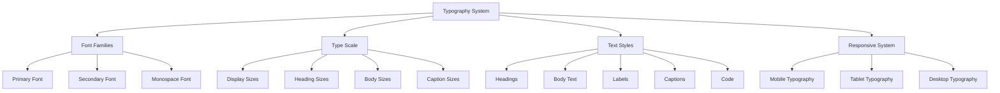

# Typography - Design System

> **Status**: Active  
> **Última Atualização**: 2025-01-26  
> **Versão**: 1.0.0  
> **Responsável**: Axisor Design Team  

## Índice

- [Visão Geral](#visão-geral)
- [Font System Architecture](#font-system-architecture)
- [Type Scale](#type-scale)
- [Font Families](#font-families)
- [Text Styles](#text-styles)
- [Heading System](#heading-system)
- [Body Text System](#body-text-system)
- [Special Text Elements](#special-text-elements)
- [Responsive Typography](#responsive-typography)
- [Accessibility](#accessibility)
- [Implementation](#implementation)
- [Troubleshooting](#troubleshooting)
- [Referências](#referências)

## Visão Geral

O sistema tipográfico do Axisor é baseado em uma hierarquia clara e consistente, utilizando fontes web otimizadas para aplicações financeiras. O sistema implementa escalas responsivas, suporte a múltiplos idiomas e garante excelente legibilidade em todos os dispositivos.

## Font System Architecture

### Typography Hierarchy



### Typography Configuration

```typescript
// Typography System Configuration
interface TypographySystem {
  fontFamilies: FontFamilies;
  typeScale: TypeScale;
  textStyles: TextStyles;
  responsive: ResponsiveTypography;
  accessibility: AccessibilitySettings;
}

interface FontFamilies {
  primary: string;
  secondary: string;
  monospace: string;
  display?: string;
}

interface TypeScale {
  display: FontSize[];
  heading: FontSize[];
  body: FontSize[];
  caption: FontSize[];
}

interface FontSize {
  name: string;
  size: string;
  lineHeight: string;
  letterSpacing?: string;
  fontWeight?: string;
}

interface TextStyles {
  headings: HeadingStyles;
  body: BodyStyles;
  labels: LabelStyles;
  captions: CaptionStyles;
  code: CodeStyles;
}
```

## Type Scale

### Modular Scale System

```typescript
// Type Scale Configuration
const typeScale: TypeScale = {
  // Display sizes (large headings)
  display: [
    {
      name: 'display-2xl',
      size: '4.5rem',      // 72px
      lineHeight: '1.1',
      letterSpacing: '-0.025em',
      fontWeight: '800'
    },
    {
      name: 'display-xl',
      size: '3.75rem',     // 60px
      lineHeight: '1.1',
      letterSpacing: '-0.025em',
      fontWeight: '800'
    },
    {
      name: 'display-lg',
      size: '3rem',        // 48px
      lineHeight: '1.2',
      letterSpacing: '-0.025em',
      fontWeight: '700'
    }
  ],
  
  // Heading sizes
  heading: [
    {
      name: 'heading-xl',
      size: '2.25rem',     // 36px
      lineHeight: '1.2',
      letterSpacing: '-0.025em',
      fontWeight: '700'
    },
    {
      name: 'heading-lg',
      size: '1.875rem',    // 30px
      lineHeight: '1.3',
      letterSpacing: '-0.025em',
      fontWeight: '600'
    },
    {
      name: 'heading-md',
      size: '1.5rem',      // 24px
      lineHeight: '1.3',
      letterSpacing: '-0.025em',
      fontWeight: '600'
    },
    {
      name: 'heading-sm',
      size: '1.25rem',     // 20px
      lineHeight: '1.4',
      letterSpacing: '-0.025em',
      fontWeight: '600'
    },
    {
      name: 'heading-xs',
      size: '1.125rem',    // 18px
      lineHeight: '1.4',
      letterSpacing: '-0.025em',
      fontWeight: '600'
    }
  ],
  
  // Body text sizes
  body: [
    {
      name: 'body-xl',
      size: '1.25rem',     // 20px
      lineHeight: '1.6',
      letterSpacing: '0',
      fontWeight: '400'
    },
    {
      name: 'body-lg',
      size: '1.125rem',    // 18px
      lineHeight: '1.6',
      letterSpacing: '0',
      fontWeight: '400'
    },
    {
      name: 'body-md',
      size: '1rem',        // 16px
      lineHeight: '1.5',
      letterSpacing: '0',
      fontWeight: '400'
    },
    {
      name: 'body-sm',
      size: '0.875rem',    // 14px
      lineHeight: '1.5',
      letterSpacing: '0',
      fontWeight: '400'
    },
    {
      name: 'body-xs',
      size: '0.75rem',     // 12px
      lineHeight: '1.4',
      letterSpacing: '0',
      fontWeight: '400'
    }
  ],
  
  // Caption sizes
  caption: [
    {
      name: 'caption-lg',
      size: '0.875rem',    // 14px
      lineHeight: '1.4',
      letterSpacing: '0.025em',
      fontWeight: '500'
    },
    {
      name: 'caption-md',
      size: '0.75rem',     // 12px
      lineHeight: '1.4',
      letterSpacing: '0.025em',
      fontWeight: '500'
    },
    {
      name: 'caption-sm',
      size: '0.6875rem',   // 11px
      lineHeight: '1.4',
      letterSpacing: '0.025em',
      fontWeight: '500'
    }
  ]
};

// CSS Custom Properties for Type Scale
const typeScaleCSS = `
:root {
  /* Display sizes */
  --font-size-display-2xl: 4.5rem;
  --font-size-display-xl: 3.75rem;
  --font-size-display-lg: 3rem;
  
  /* Heading sizes */
  --font-size-heading-xl: 2.25rem;
  --font-size-heading-lg: 1.875rem;
  --font-size-heading-md: 1.5rem;
  --font-size-heading-sm: 1.25rem;
  --font-size-heading-xs: 1.125rem;
  
  /* Body sizes */
  --font-size-body-xl: 1.25rem;
  --font-size-body-lg: 1.125rem;
  --font-size-body-md: 1rem;
  --font-size-body-sm: 0.875rem;
  --font-size-body-xs: 0.75rem;
  
  /* Caption sizes */
  --font-size-caption-lg: 0.875rem;
  --font-size-caption-md: 0.75rem;
  --font-size-caption-sm: 0.6875rem;
  
  /* Line heights */
  --line-height-tight: 1.1;
  --line-height-snug: 1.2;
  --line-height-normal: 1.3;
  --line-height-relaxed: 1.4;
  --line-height-loose: 1.5;
  --line-height-extra-loose: 1.6;
  
  /* Letter spacing */
  --letter-spacing-tighter: -0.05em;
  --letter-spacing-tight: -0.025em;
  --letter-spacing-normal: 0;
  --letter-spacing-wide: 0.025em;
  --letter-spacing-wider: 0.05em;
}
`;
```

## Font Families

### Font Stack Configuration

```typescript
// Font Families Configuration
const fontFamilies: FontFamilies = {
  // Primary font family (UI text)
  primary: '"Inter", -apple-system, BlinkMacSystemFont, "Segoe UI", Roboto, "Helvetica Neue", Arial, sans-serif',
  
  // Secondary font family (display text)
  secondary: '"Inter", -apple-system, BlinkMacSystemFont, "Segoe UI", Roboto, "Helvetica Neue", Arial, sans-serif',
  
  // Monospace font family (code, data)
  monospace: '"JetBrains Mono", "Fira Code", "Monaco", "Consolas", "Liberation Mono", "Courier New", monospace',
  
  // Display font family (large headings)
  display: '"Inter", -apple-system, BlinkMacSystemFont, "Segoe UI", Roboto, "Helvetica Neue", Arial, sans-serif'
};

// Font Loading Strategy
const fontLoadingStrategy = {
  // Preload critical fonts
  preload: [
    {
      href: 'https://fonts.googleapis.com/css2?family=Inter:wght@300;400;500;600;700;800&display=swap',
      as: 'style',
      crossorigin: 'anonymous'
    },
    {
      href: 'https://fonts.googleapis.com/css2?family=JetBrains+Mono:wght@300;400;500;600&display=swap',
      as: 'style',
      crossorigin: 'anonymous'
    }
  ],
  
  // Font display strategy
  display: 'swap', // Show fallback font while loading
  
  // Font feature settings
  features: {
    Inter: [
      'cv01', // Single-storey 'a'
      'cv02', // Single-storey 'g'
      'cv03', // Single-storey 'l'
      'cv04', // Single-storey 't'
      'ss01', // Alternate 'i'
      'ss02', // Alternate 'l'
      'ss03', // Alternate 'r'
      'ss04', // Alternate 's'
      'ss05', // Alternate 't'
      'ss06', // Alternate 'u'
      'ss07', // Alternate 'y'
      'ss08', // Alternate 'z'
      'ss09', // Alternate 'A'
      'ss10', // Alternate 'C'
      'ss11', // Alternate 'E'
      'ss12', // Alternate 'F'
      'ss13', // Alternate 'G'
      'ss14', // Alternate 'I'
      'ss15', // Alternate 'J'
      'ss16', // Alternate 'K'
      'ss17', // Alternate 'L'
      'ss18', // Alternate 'M'
      'ss19', // Alternate 'N'
      'ss20', // Alternate 'O'
      'ss21', // Alternate 'P'
      'ss22', // Alternate 'Q'
      'ss23', // Alternate 'R'
      'ss24', // Alternate 'S'
      'ss25', // Alternate 'T'
      'ss26', // Alternate 'U'
      'ss27', // Alternate 'V'
      'ss28', // Alternate 'W'
      'ss29', // Alternate 'X'
      'ss30', // Alternate 'Y'
      'ss31', // Alternate 'Z'
      'liga', // Standard ligatures
      'calt', // Contextual alternates
      'kern'  // Kerning
    ],
    'JetBrains Mono': [
      'liga', // Standard ligatures
      'calt', // Contextual alternates
      'kern'  // Kerning
    ]
  }
};

// Font Loading Implementation
const FontLoader: React.FC = () => {
  useEffect(() => {
    // Preload fonts
    fontLoadingStrategy.preload.forEach(font => {
      const link = document.createElement('link');
      link.rel = 'preload';
      link.href = font.href;
      link.as = font.as;
      if (font.crossorigin) {
        link.crossOrigin = font.crossorigin;
      }
      document.head.appendChild(link);
    });
    
    // Load fonts with display swap
    const style = document.createElement('style');
    style.textContent = `
      @import url('https://fonts.googleapis.com/css2?family=Inter:wght@300;400;500;600;700;800&display=swap');
      @import url('https://fonts.googleapis.com/css2?family=JetBrains+Mono:wght@300;400;500;600&display=swap');
    `;
    document.head.appendChild(style);
  }, []);
  
  return null;
};
```

## Text Styles

### Heading Styles

```typescript
// Heading Styles Configuration
interface HeadingStyles {
  h1: TextStyle;
  h2: TextStyle;
  h3: TextStyle;
  h4: TextStyle;
  h5: TextStyle;
  h6: TextStyle;
}

interface TextStyle {
  fontSize: string;
  lineHeight: string;
  fontWeight: string;
  letterSpacing?: string;
  marginBottom?: string;
  color?: string;
}

const headingStyles: HeadingStyles = {
  h1: {
    fontSize: 'var(--font-size-display-xl)',
    lineHeight: 'var(--line-height-tight)',
    fontWeight: '800',
    letterSpacing: 'var(--letter-spacing-tight)',
    marginBottom: '1.5rem',
    color: 'var(--color-foreground)'
  },
  h2: {
    fontSize: 'var(--font-size-display-lg)',
    lineHeight: 'var(--line-height-tight)',
    fontWeight: '700',
    letterSpacing: 'var(--letter-spacing-tight)',
    marginBottom: '1.25rem',
    color: 'var(--color-foreground)'
  },
  h3: {
    fontSize: 'var(--font-size-heading-xl)',
    lineHeight: 'var(--line-height-snug)',
    fontWeight: '600',
    letterSpacing: 'var(--letter-spacing-tight)',
    marginBottom: '1rem',
    color: 'var(--color-foreground)'
  },
  h4: {
    fontSize: 'var(--font-size-heading-lg)',
    lineHeight: 'var(--line-height-snug)',
    fontWeight: '600',
    letterSpacing: 'var(--letter-spacing-tight)',
    marginBottom: '0.875rem',
    color: 'var(--color-foreground)'
  },
  h5: {
    fontSize: 'var(--font-size-heading-md)',
    lineHeight: 'var(--line-height-normal)',
    fontWeight: '600',
    letterSpacing: 'var(--letter-spacing-tight)',
    marginBottom: '0.75rem',
    color: 'var(--color-foreground)'
  },
  h6: {
    fontSize: 'var(--font-size-heading-sm)',
    lineHeight: 'var(--line-height-normal)',
    fontWeight: '600',
    letterSpacing: 'var(--letter-spacing-tight)',
    marginBottom: '0.5rem',
    color: 'var(--color-foreground)'
  }
};

// Heading Components
export const Heading: React.FC<{
  level: 1 | 2 | 3 | 4 | 5 | 6;
  children: React.ReactNode;
  className?: string;
  id?: string;
}> = ({ level, children, className, id, ...props }) => {
  const HeadingTag = `h${level}` as keyof JSX.IntrinsicElements;
  const style = headingStyles[`h${level}` as keyof HeadingStyles];
  
  const classes = [
    'font-heading',
    'text-foreground',
    className
  ].filter(Boolean).join(' ');
  
  return (
    <HeadingTag
      className={classes}
      id={id}
      style={style}
      {...props}
    >
      {children}
    </HeadingTag>
  );
};

// Usage Examples
const HeadingExamples: React.FC = () => (
  <div className="space-y-4">
    <Heading level={1}>Display Heading</Heading>
    <Heading level={2}>Section Heading</Heading>
    <Heading level={3}>Subsection Heading</Heading>
    <Heading level={4}>Card Heading</Heading>
    <Heading level={5}>Small Heading</Heading>
    <Heading level={6}>Caption Heading</Heading>
  </div>
);
```

### Body Text Styles

```typescript
// Body Text Styles Configuration
interface BodyStyles {
  lead: TextStyle;
  body: TextStyle;
  small: TextStyle;
  muted: TextStyle;
}

const bodyStyles: BodyStyles = {
  lead: {
    fontSize: 'var(--font-size-body-xl)',
    lineHeight: 'var(--line-height-extra-loose)',
    fontWeight: '400',
    letterSpacing: 'var(--letter-spacing-normal)',
    marginBottom: '1.5rem',
    color: 'var(--color-foreground)'
  },
  body: {
    fontSize: 'var(--font-size-body-md)',
    lineHeight: 'var(--line-height-loose)',
    fontWeight: '400',
    letterSpacing: 'var(--letter-spacing-normal)',
    marginBottom: '1rem',
    color: 'var(--color-foreground)'
  },
  small: {
    fontSize: 'var(--font-size-body-sm)',
    lineHeight: 'var(--line-height-loose)',
    fontWeight: '400',
    letterSpacing: 'var(--letter-spacing-normal)',
    marginBottom: '0.75rem',
    color: 'var(--color-foreground)'
  },
  muted: {
    fontSize: 'var(--font-size-body-md)',
    lineHeight: 'var(--line-height-loose)',
    fontWeight: '400',
    letterSpacing: 'var(--letter-spacing-normal)',
    marginBottom: '1rem',
    color: 'var(--color-muted-foreground)'
  }
};

// Body Text Components
export const Text: React.FC<{
  variant?: 'lead' | 'body' | 'small' | 'muted';
  children: React.ReactNode;
  className?: string;
  as?: keyof JSX.IntrinsicElements;
}> = ({ variant = 'body', children, className, as: Component = 'p', ...props }) => {
  const style = bodyStyles[variant];
  
  const classes = [
    'font-body',
    variant === 'muted' ? 'text-muted-foreground' : 'text-foreground',
    className
  ].filter(Boolean).join(' ');
  
  return (
    <Component
      className={classes}
      style={style}
      {...props}
    >
      {children}
    </Component>
  );
};

// Usage Examples
const TextExamples: React.FC = () => (
  <div className="space-y-4">
    <Text variant="lead">
      This is lead text, used for introductory paragraphs or important content that needs to stand out.
    </Text>
    
    <Text variant="body">
      This is regular body text, used for most content throughout the application.
    </Text>
    
    <Text variant="small">
      This is small text, used for secondary information or fine print.
    </Text>
    
    <Text variant="muted">
      This is muted text, used for less important information or placeholder text.
    </Text>
  </div>
);
```

## Heading System

### Semantic Heading Components

```typescript
// Semantic Heading System
interface SemanticHeadingProps {
  children: React.ReactNode;
  className?: string;
  id?: string;
  size?: 'xs' | 'sm' | 'md' | 'lg' | 'xl' | '2xl';
  weight?: 'normal' | 'medium' | 'semibold' | 'bold' | 'extrabold';
  color?: 'default' | 'muted' | 'primary' | 'success' | 'warning' | 'error';
}

export const PageTitle: React.FC<SemanticHeadingProps> = ({
  children,
  className,
  id,
  size = '2xl',
  weight = 'extrabold',
  color = 'default',
  ...props
}) => {
  const sizeClasses = {
    xs: 'text-heading-xs',
    sm: 'text-heading-sm',
    md: 'text-heading-md',
    lg: 'text-heading-lg',
    xl: 'text-heading-xl',
    '2xl': 'text-display-xl'
  };
  
  const weightClasses = {
    normal: 'font-normal',
    medium: 'font-medium',
    semibold: 'font-semibold',
    bold: 'font-bold',
    extrabold: 'font-extrabold'
  };
  
  const colorClasses = {
    default: 'text-foreground',
    muted: 'text-muted-foreground',
    primary: 'text-primary',
    success: 'text-success-600',
    warning: 'text-warning-600',
    error: 'text-error-600'
  };
  
  const classes = [
    'font-heading',
    'leading-tight',
    'tracking-tight',
    sizeClasses[size],
    weightClasses[weight],
    colorClasses[color],
    className
  ].filter(Boolean).join(' ');
  
  return (
    <h1
      className={classes}
      id={id}
      {...props}
    >
      {children}
    </h1>
  );
};

export const SectionTitle: React.FC<SemanticHeadingProps> = ({
  children,
  className,
  id,
  size = 'lg',
  weight = 'semibold',
  color = 'default',
  ...props
}) => {
  const sizeClasses = {
    xs: 'text-heading-xs',
    sm: 'text-heading-sm',
    md: 'text-heading-md',
    lg: 'text-heading-lg',
    xl: 'text-heading-xl',
    '2xl': 'text-display-lg'
  };
  
  const weightClasses = {
    normal: 'font-normal',
    medium: 'font-medium',
    semibold: 'font-semibold',
    bold: 'font-bold',
    extrabold: 'font-extrabold'
  };
  
  const colorClasses = {
    default: 'text-foreground',
    muted: 'text-muted-foreground',
    primary: 'text-primary',
    success: 'text-success-600',
    warning: 'text-warning-600',
    error: 'text-error-600'
  };
  
  const classes = [
    'font-heading',
    'leading-snug',
    'tracking-tight',
    sizeClasses[size],
    weightClasses[weight],
    colorClasses[color],
    className
  ].filter(Boolean).join(' ');
  
  return (
    <h2
      className={classes}
      id={id}
      {...props}
    >
      {children}
    </h2>
  );
};

export const CardTitle: React.FC<SemanticHeadingProps> = ({
  children,
  className,
  id,
  size = 'md',
  weight = 'semibold',
  color = 'default',
  ...props
}) => {
  const sizeClasses = {
    xs: 'text-heading-xs',
    sm: 'text-heading-sm',
    md: 'text-heading-md',
    lg: 'text-heading-lg',
    xl: 'text-heading-xl',
    '2xl': 'text-display-md'
  };
  
  const weightClasses = {
    normal: 'font-normal',
    medium: 'font-medium',
    semibold: 'font-semibold',
    bold: 'font-bold',
    extrabold: 'font-extrabold'
  };
  
  const colorClasses = {
    default: 'text-foreground',
    muted: 'text-muted-foreground',
    primary: 'text-primary',
    success: 'text-success-600',
    warning: 'text-warning-600',
    error: 'text-error-600'
  };
  
  const classes = [
    'font-heading',
    'leading-normal',
    'tracking-tight',
    sizeClasses[size],
    weightClasses[weight],
    colorClasses[color],
    className
  ].filter(Boolean).join(' ');
  
  return (
    <h3
      className={classes}
      id={id}
      {...props}
    >
      {children}
    </h3>
  );
};

// Usage Examples
const SemanticHeadingExamples: React.FC = () => (
  <div className="space-y-6">
    <PageTitle size="2xl" weight="extrabold">
      Trading Dashboard
    </PageTitle>
    
    <SectionTitle size="lg" weight="semibold">
      Recent Trades
    </SectionTitle>
    
    <CardTitle size="md" weight="semibold">
      Position Details
    </CardTitle>
  </div>
);
```

## Special Text Elements

### Code and Data Display

```typescript
// Code Text Component
export const Code: React.FC<{
  children: React.ReactNode;
  className?: string;
  variant?: 'inline' | 'block' | 'pre';
  language?: string;
}> = ({ children, className, variant = 'inline', language, ...props }) => {
  const baseClasses = 'font-mono text-sm';
  
  const variantClasses = {
    inline: 'bg-muted px-1.5 py-0.5 rounded text-sm',
    block: 'bg-muted p-3 rounded-md text-sm block',
    pre: 'bg-muted p-4 rounded-md text-sm block overflow-x-auto'
  };
  
  const classes = [
    baseClasses,
    variantClasses[variant],
    className
  ].filter(Boolean).join(' ');
  
  if (variant === 'pre') {
    return (
      <pre className={classes} {...props}>
        <code className={language ? `language-${language}` : ''}>
          {children}
        </code>
      </pre>
    );
  }
  
  if (variant === 'block') {
    return (
      <code className={classes} {...props}>
        {children}
      </code>
    );
  }
  
  return (
    <code className={classes} {...props}>
      {children}
    </code>
  );
};

// Data Display Components
export const DataValue: React.FC<{
  value: string | number;
  label?: string;
  variant?: 'default' | 'success' | 'warning' | 'error' | 'muted';
  size?: 'sm' | 'md' | 'lg';
  className?: string;
}> = ({ value, label, variant = 'default', size = 'md', className, ...props }) => {
  const sizeClasses = {
    sm: 'text-sm',
    md: 'text-base',
    lg: 'text-lg'
  };
  
  const variantClasses = {
    default: 'text-foreground',
    success: 'text-success-600',
    warning: 'text-warning-600',
    error: 'text-error-600',
    muted: 'text-muted-foreground'
  };
  
  const classes = [
    'font-mono font-medium',
    sizeClasses[size],
    variantClasses[variant],
    className
  ].filter(Boolean).join(' ');
  
  return (
    <div className="space-y-1" {...props}>
      {label && (
        <div className="text-xs text-muted-foreground font-medium">
          {label}
        </div>
      )}
      <div className={classes}>
        {value}
      </div>
    </div>
  );
};

export const CurrencyValue: React.FC<{
  value: number;
  currency?: string;
  precision?: number;
  showSign?: boolean;
  variant?: 'default' | 'success' | 'warning' | 'error';
  size?: 'sm' | 'md' | 'lg';
  className?: string;
}> = ({ 
  value, 
  currency = 'USD', 
  precision = 2, 
  showSign = false,
  variant = 'default',
  size = 'md',
  className,
  ...props 
}) => {
  const formattedValue = new Intl.NumberFormat('en-US', {
    style: 'currency',
    currency,
    minimumFractionDigits: precision,
    maximumFractionDigits: precision
  }).format(Math.abs(value));
  
  const displayValue = showSign && value !== 0 
    ? `${value >= 0 ? '+' : '-'}${formattedValue}`
    : formattedValue;
  
  const sizeClasses = {
    sm: 'text-sm',
    md: 'text-base',
    lg: 'text-lg'
  };
  
  const variantClasses = {
    default: 'text-foreground',
    success: 'text-success-600',
    warning: 'text-warning-600',
    error: 'text-error-600'
  };
  
  const classes = [
    'font-mono font-medium',
    sizeClasses[size],
    variantClasses[variant],
    className
  ].filter(Boolean).join(' ');
  
  return (
    <span className={classes} {...props}>
      {displayValue}
    </span>
  );
};

// Usage Examples
const SpecialTextExamples: React.FC = () => (
  <div className="space-y-4">
    {/* Inline code */}
    <p>
      Use the <Code>useState</Code> hook to manage component state.
    </p>
    
    {/* Code block */}
    <Code variant="block">
      const greeting = "Hello, World!";
      console.log(greeting);
    </Code>
    
    {/* Preformatted code */}
    <Code variant="pre" language="javascript">
      {`function calculateProfit(loss, profit) {
  return profit - loss;
}`}
    </Code>
    
    {/* Data values */}
    <div className="grid grid-cols-3 gap-4">
      <DataValue value="1,234.56" label="Balance" variant="success" />
      <DataValue value="89.2%" label="Success Rate" variant="default" />
      <DataValue value="-45.67" label="Loss" variant="error" />
    </div>
    
    {/* Currency values */}
    <div className="space-y-2">
      <CurrencyValue value={1234.56} currency="USD" showSign />
      <CurrencyValue value={-89.23} currency="BTC" precision={8} showSign />
      <CurrencyValue value={0.001234} currency="ETH" precision={6} />
    </div>
  </div>
);
```

## Responsive Typography

### Responsive Type System

```typescript
// Responsive Typography Configuration
interface ResponsiveTypography {
  breakpoints: {
    sm: string;
    md: string;
    lg: string;
    xl: string;
  };
  scales: {
    mobile: TypeScale;
    tablet: TypeScale;
    desktop: TypeScale;
  };
}

const responsiveTypography: ResponsiveTypography = {
  breakpoints: {
    sm: '640px',
    md: '768px',
    lg: '1024px',
    xl: '1280px'
  },
  scales: {
    // Mobile scale (smaller sizes)
    mobile: {
      display: [
        { name: 'display-2xl', size: '2.5rem', lineHeight: '1.1' },
        { name: 'display-xl', size: '2rem', lineHeight: '1.1' },
        { name: 'display-lg', size: '1.75rem', lineHeight: '1.2' }
      ],
      heading: [
        { name: 'heading-xl', size: '1.5rem', lineHeight: '1.2' },
        { name: 'heading-lg', size: '1.25rem', lineHeight: '1.3' },
        { name: 'heading-md', size: '1.125rem', lineHeight: '1.3' },
        { name: 'heading-sm', size: '1rem', lineHeight: '1.4' },
        { name: 'heading-xs', size: '0.875rem', lineHeight: '1.4' }
      ],
      body: [
        { name: 'body-xl', size: '1rem', lineHeight: '1.6' },
        { name: 'body-lg', size: '0.875rem', lineHeight: '1.6' },
        { name: 'body-md', size: '0.875rem', lineHeight: '1.5' },
        { name: 'body-sm', size: '0.75rem', lineHeight: '1.5' },
        { name: 'body-xs', size: '0.6875rem', lineHeight: '1.4' }
      ],
      caption: [
        { name: 'caption-lg', size: '0.75rem', lineHeight: '1.4' },
        { name: 'caption-md', size: '0.6875rem', lineHeight: '1.4' },
        { name: 'caption-sm', size: '0.625rem', lineHeight: '1.4' }
      ]
    },
    
    // Tablet scale (medium sizes)
    tablet: {
      display: [
        { name: 'display-2xl', size: '3.5rem', lineHeight: '1.1' },
        { name: 'display-xl', size: '3rem', lineHeight: '1.1' },
        { name: 'display-lg', size: '2.5rem', lineHeight: '1.2' }
      ],
      heading: [
        { name: 'heading-xl', size: '2rem', lineHeight: '1.2' },
        { name: 'heading-lg', size: '1.75rem', lineHeight: '1.3' },
        { name: 'heading-md', size: '1.5rem', lineHeight: '1.3' },
        { name: 'heading-sm', size: '1.25rem', lineHeight: '1.4' },
        { name: 'heading-xs', size: '1.125rem', lineHeight: '1.4' }
      ],
      body: [
        { name: 'body-xl', size: '1.125rem', lineHeight: '1.6' },
        { name: 'body-lg', size: '1rem', lineHeight: '1.6' },
        { name: 'body-md', size: '0.875rem', lineHeight: '1.5' },
        { name: 'body-sm', size: '0.75rem', lineHeight: '1.5' },
        { name: 'body-xs', size: '0.6875rem', lineHeight: '1.4' }
      ],
      caption: [
        { name: 'caption-lg', size: '0.875rem', lineHeight: '1.4' },
        { name: 'caption-md', size: '0.75rem', lineHeight: '1.4' },
        { name: 'caption-sm', size: '0.6875rem', lineHeight: '1.4' }
      ]
    },
    
    // Desktop scale (full sizes)
    desktop: typeScale
  }
};

// Responsive Typography CSS
const responsiveTypographyCSS = `
/* Mobile First Approach */
:root {
  /* Mobile sizes (default) */
  --font-size-display-2xl: 2.5rem;
  --font-size-display-xl: 2rem;
  --font-size-display-lg: 1.75rem;
  
  --font-size-heading-xl: 1.5rem;
  --font-size-heading-lg: 1.25rem;
  --font-size-heading-md: 1.125rem;
  --font-size-heading-sm: 1rem;
  --font-size-heading-xs: 0.875rem;
  
  --font-size-body-xl: 1rem;
  --font-size-body-lg: 0.875rem;
  --font-size-body-md: 0.875rem;
  --font-size-body-sm: 0.75rem;
  --font-size-body-xs: 0.6875rem;
  
  --font-size-caption-lg: 0.75rem;
  --font-size-caption-md: 0.6875rem;
  --font-size-caption-sm: 0.625rem;
}

/* Tablet sizes */
@media (min-width: 768px) {
  :root {
    --font-size-display-2xl: 3.5rem;
    --font-size-display-xl: 3rem;
    --font-size-display-lg: 2.5rem;
    
    --font-size-heading-xl: 2rem;
    --font-size-heading-lg: 1.75rem;
    --font-size-heading-md: 1.5rem;
    --font-size-heading-sm: 1.25rem;
    --font-size-heading-xs: 1.125rem;
    
    --font-size-body-xl: 1.125rem;
    --font-size-body-lg: 1rem;
    --font-size-body-md: 0.875rem;
    --font-size-body-sm: 0.75rem;
    --font-size-body-xs: 0.6875rem;
    
    --font-size-caption-lg: 0.875rem;
    --font-size-caption-md: 0.75rem;
    --font-size-caption-sm: 0.6875rem;
  }
}

/* Desktop sizes */
@media (min-width: 1024px) {
  :root {
    --font-size-display-2xl: 4.5rem;
    --font-size-display-xl: 3.75rem;
    --font-size-display-lg: 3rem;
    
    --font-size-heading-xl: 2.25rem;
    --font-size-heading-lg: 1.875rem;
    --font-size-heading-md: 1.5rem;
    --font-size-heading-sm: 1.25rem;
    --font-size-heading-xs: 1.125rem;
    
    --font-size-body-xl: 1.25rem;
    --font-size-body-lg: 1.125rem;
    --font-size-body-md: 1rem;
    --font-size-body-sm: 0.875rem;
    --font-size-body-xs: 0.75rem;
    
    --font-size-caption-lg: 0.875rem;
    --font-size-caption-md: 0.75rem;
    --font-size-caption-sm: 0.6875rem;
  }
}
`;

// Responsive Typography Hook
export const useResponsiveTypography = () => {
  const [currentScale, setCurrentScale] = useState<keyof ResponsiveTypography['scales']>('mobile');
  
  useEffect(() => {
    const updateScale = () => {
      const width = window.innerWidth;
      
      if (width >= 1024) {
        setCurrentScale('desktop');
      } else if (width >= 768) {
        setCurrentScale('tablet');
      } else {
        setCurrentScale('mobile');
      }
    };
    
    updateScale();
    window.addEventListener('resize', updateScale);
    
    return () => window.removeEventListener('resize', updateScale);
  }, []);
  
  return currentScale;
};
```

## Accessibility

### Typography Accessibility

```typescript
// Typography Accessibility Utilities
class TypographyAccessibility {
  // Check if text size meets accessibility standards
  static isAccessibleSize(fontSize: string, lineHeight: string): boolean {
    const sizeInPx = this.parseSizeToPx(fontSize);
    const lineHeightInPx = this.parseSizeToPx(lineHeight);
    
    // WCAG guidelines: minimum 16px for body text
    return sizeInPx >= 16 || lineHeightInPx >= 24;
  }
  
  // Parse CSS size to pixels
  private static parseSizeToPx(size: string): number {
    const num = parseFloat(size);
    
    if (size.includes('rem')) {
      return num * 16; // Assuming 16px base font size
    }
    
    if (size.includes('em')) {
      return num * 16; // Assuming 16px base font size
    }
    
    return num;
  }
  
  // Check line height for readability
  static getOptimalLineHeight(fontSize: string): string {
    const sizeInPx = this.parseSizeToPx(fontSize);
    
    // Optimal line height is 1.4-1.6 times the font size
    const optimalRatio = 1.5;
    const optimalLineHeight = sizeInPx * optimalRatio;
    
    return `${optimalLineHeight}px`;
  }
  
  // Check letter spacing for readability
  static getOptimalLetterSpacing(fontSize: string, fontWeight: string): string {
    const sizeInPx = this.parseSizeToPx(fontSize);
    const weight = parseInt(fontWeight);
    
    // Heavier fonts need more letter spacing
    if (weight >= 700) {
      return sizeInPx >= 24 ? '-0.025em' : '-0.01em';
    }
    
    return '0';
  }
}

// Accessible Typography Component
export const AccessibleText: React.FC<{
  children: React.ReactNode;
  variant?: 'heading' | 'body' | 'caption';
  size?: 'sm' | 'md' | 'lg';
  className?: string;
  as?: keyof JSX.IntrinsicElements;
}> = ({ 
  children, 
  variant = 'body', 
  size = 'md', 
  className,
  as: Component = 'p',
  ...props 
}) => {
  const fontSize = variant === 'heading' 
    ? size === 'lg' ? '1.5rem' : size === 'sm' ? '1rem' : '1.25rem'
    : size === 'lg' ? '1rem' : size === 'sm' ? '0.875rem' : '0.875rem';
  
  const lineHeight = TypographyAccessibility.getOptimalLineHeight(fontSize);
  const letterSpacing = TypographyAccessibility.getOptimalLetterSpacing(fontSize, '400');
  
  const isAccessible = TypographyAccessibility.isAccessibleSize(fontSize, lineHeight);
  
  if (!isAccessible) {
    console.warn(`Text size ${fontSize} may not meet accessibility standards`);
  }
  
  const classes = [
    'text-foreground',
    variant === 'heading' ? 'font-semibold' : 'font-normal',
    className
  ].filter(Boolean).join(' ');
  
  return (
    <Component
      className={classes}
      style={{
        fontSize,
        lineHeight,
        letterSpacing
      }}
      {...props}
    >
      {children}
    </Component>
  );
};
```

## Implementation

### Tailwind CSS Typography Configuration

```javascript
// tailwind.config.js
module.exports = {
  theme: {
    extend: {
      fontFamily: {
        sans: ['Inter', 'system-ui', 'sans-serif'],
        mono: ['JetBrains Mono', 'Monaco', 'Consolas', 'monospace'],
        display: ['Inter', 'system-ui', 'sans-serif']
      },
      
      fontSize: {
        // Display sizes
        'display-2xl': ['4.5rem', { lineHeight: '1.1', letterSpacing: '-0.025em' }],
        'display-xl': ['3.75rem', { lineHeight: '1.1', letterSpacing: '-0.025em' }],
        'display-lg': ['3rem', { lineHeight: '1.2', letterSpacing: '-0.025em' }],
        
        // Heading sizes
        'heading-xl': ['2.25rem', { lineHeight: '1.2', letterSpacing: '-0.025em' }],
        'heading-lg': ['1.875rem', { lineHeight: '1.3', letterSpacing: '-0.025em' }],
        'heading-md': ['1.5rem', { lineHeight: '1.3', letterSpacing: '-0.025em' }],
        'heading-sm': ['1.25rem', { lineHeight: '1.4', letterSpacing: '-0.025em' }],
        'heading-xs': ['1.125rem', { lineHeight: '1.4', letterSpacing: '-0.025em' }],
        
        // Body sizes
        'body-xl': ['1.25rem', { lineHeight: '1.6', letterSpacing: '0' }],
        'body-lg': ['1.125rem', { lineHeight: '1.6', letterSpacing: '0' }],
        'body-md': ['1rem', { lineHeight: '1.5', letterSpacing: '0' }],
        'body-sm': ['0.875rem', { lineHeight: '1.5', letterSpacing: '0' }],
        'body-xs': ['0.75rem', { lineHeight: '1.4', letterSpacing: '0' }],
        
        // Caption sizes
        'caption-lg': ['0.875rem', { lineHeight: '1.4', letterSpacing: '0.025em' }],
        'caption-md': ['0.75rem', { lineHeight: '1.4', letterSpacing: '0.025em' }],
        'caption-sm': ['0.6875rem', { lineHeight: '1.4', letterSpacing: '0.025em' }]
      },
      
      fontWeight: {
        thin: '100',
        extralight: '200',
        light: '300',
        normal: '400',
        medium: '500',
        semibold: '600',
        bold: '700',
        extrabold: '800',
        black: '900'
      },
      
      lineHeight: {
        'extra-tight': '1.1',
        tight: '1.2',
        snug: '1.3',
        normal: '1.4',
        relaxed: '1.5',
        loose: '1.6'
      },
      
      letterSpacing: {
        tighter: '-0.05em',
        tight: '-0.025em',
        normal: '0',
        wide: '0.025em',
        wider: '0.05em'
      }
    }
  },
  
  plugins: [
    require('@tailwindcss/typography')
  ]
};
```

## Troubleshooting

### Common Typography Issues

#### Font Loading Problems

```typescript
// Debug font loading issues
function debugFontLoading(): void {
  console.log('Debugging font loading:');
  
  // Check if fonts are loaded
  const fontCheck = document.fonts.check('1em Inter');
  console.log(`Inter font loaded: ${fontCheck}`);
  
  const monoFontCheck = document.fonts.check('1em JetBrains Mono');
  console.log(`JetBrains Mono font loaded: ${monoFontCheck}`);
  
  // Check font fallbacks
  const computedStyle = getComputedStyle(document.body);
  const fontFamily = computedStyle.fontFamily;
  console.log(`Current font family: ${fontFamily}`);
  
  // Check font loading status
  document.fonts.ready.then(() => {
    console.log('All fonts loaded');
  });
  
  // Check for font display issues
  const elements = document.querySelectorAll('*');
  elements.forEach(element => {
    const style = getComputedStyle(element);
    if (style.fontFamily.includes('Inter') && !fontCheck) {
      console.warn(`Element using Inter font but not loaded:`, element);
    }
  });
}
```

#### Responsive Typography Issues

```typescript
// Debug responsive typography
function debugResponsiveTypography(): void {
  console.log('Debugging responsive typography:');
  
  // Check current breakpoint
  const width = window.innerWidth;
  let breakpoint = 'mobile';
  
  if (width >= 1024) {
    breakpoint = 'desktop';
  } else if (width >= 768) {
    breakpoint = 'tablet';
  }
  
  console.log(`Current breakpoint: ${breakpoint} (${width}px)`);
  
  // Check font sizes
  const headings = document.querySelectorAll('h1, h2, h3, h4, h5, h6');
  headings.forEach((heading, index) => {
    const style = getComputedStyle(heading);
    console.log(`H${index + 1} font size: ${style.fontSize}`);
  });
  
  // Check line heights
  const textElements = document.querySelectorAll('p, span, div');
  textElements.forEach((element, index) => {
    const style = getComputedStyle(element);
    if (style.fontSize && style.lineHeight) {
      const fontSize = parseFloat(style.fontSize);
      const lineHeight = parseFloat(style.lineHeight);
      const ratio = lineHeight / fontSize;
      
      if (ratio < 1.4 || ratio > 1.8) {
        console.warn(`Element has suboptimal line height ratio: ${ratio.toFixed(2)}`, element);
      }
    }
  });
}
```

## Referências

- [UI Components](./ui-components.md)
- [Color Palette](./color-palette.md)
- [Interaction Patterns](./interaction-patterns.md)
- [System Architecture](../system-overview/system-architecture.md)

## Como Usar Este Documento

• **Para Designers**: Use como referência para criar hierarquias tipográficas consistentes e acessíveis.

• **Para Desenvolvedores**: Utilize para implementar o sistema tipográfico em componentes React.

• **Para QA**: Use para validar a implementação correta da tipografia e acessibilidade.
