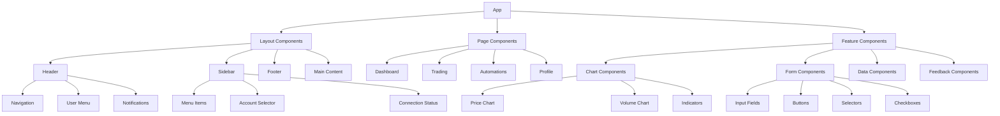

# UI Components - Design System

> **Status**: Active  
> **Última Atualização**: 2025-01-26  
> **Versão**: 1.0.0  
> **Responsável**: Axisor Frontend Team  

## Índice

- [Visão Geral](#visão-geral)
- [Component Architecture](#component-architecture)
- [Core Components](#core-components)
- [Layout Components](#layout-components)
- [Form Components](#form-components)
- [Data Display Components](#data-display-components)
- [Navigation Components](#navigation-components)
- [Feedback Components](#feedback-components)
- [Component Composition](#component-composition)
- [Accessibility](#accessibility)
- [Troubleshooting](#troubleshooting)
- [Referências](#referências)

## Visão Geral

O sistema de componentes UI do Axisor é construído com React, TypeScript, Tailwind CSS e shadcn/ui. O design system implementa uma arquitetura modular, reutilizável e acessível, seguindo os princípios de atomic design e garantindo consistência visual em toda a aplicação.

## Component Architecture

### Component Hierarchy



### Component Structure

```typescript
// Base Component Interface
interface BaseComponentProps {
  className?: string;
  children?: React.ReactNode;
  testId?: string;
  id?: string;
}

// Component Variants
type ComponentVariant = 'default' | 'primary' | 'secondary' | 'destructive';
type ComponentSize = 'sm' | 'md' | 'lg' | 'xl';

// Base Component
abstract class BaseComponent<P extends BaseComponentProps> extends React.Component<P> {
  protected getClassName(additionalClasses?: string): string {
    const baseClasses = this.getBaseClasses();
    const variantClasses = this.getVariantClasses();
    const sizeClasses = this.getSizeClasses();
    
    return [
      baseClasses,
      variantClasses,
      sizeClasses,
      this.props.className,
      additionalClasses
    ].filter(Boolean).join(' ');
  }

  protected abstract getBaseClasses(): string;
  protected abstract getVariantClasses(): string;
  protected abstract getSizeClasses(): string;
}
```

## Core Components

### Button Component

```typescript
// Button Component
interface ButtonProps extends BaseComponentProps {
  variant?: ComponentVariant;
  size?: ComponentSize;
  disabled?: boolean;
  loading?: boolean;
  icon?: React.ReactNode;
  iconPosition?: 'left' | 'right';
  onClick?: (event: React.MouseEvent<HTMLButtonElement>) => void;
  type?: 'button' | 'submit' | 'reset';
  fullWidth?: boolean;
}

export const Button: React.FC<ButtonProps> = ({
  variant = 'default',
  size = 'md',
  disabled = false,
  loading = false,
  icon,
  iconPosition = 'left',
  children,
  className,
  onClick,
  type = 'button',
  fullWidth = false,
  testId,
  ...props
}) => {
  const baseClasses = 'inline-flex items-center justify-center rounded-md font-medium transition-colors focus-visible:outline-none focus-visible:ring-2 focus-visible:ring-ring focus-visible:ring-offset-2 disabled:opacity-50 disabled:pointer-events-none ring-offset-background';
  
  const variantClasses = {
    default: 'bg-primary text-primary-foreground hover:bg-primary/90',
    primary: 'bg-blue-600 text-white hover:bg-blue-700',
    secondary: 'bg-secondary text-secondary-foreground hover:bg-secondary/80',
    destructive: 'bg-destructive text-destructive-foreground hover:bg-destructive/90'
  };
  
  const sizeClasses = {
    sm: 'h-9 px-3 text-sm',
    md: 'h-10 py-2 px-4',
    lg: 'h-11 px-8',
    xl: 'h-12 px-10 text-lg'
  };
  
  const classes = [
    baseClasses,
    variantClasses[variant],
    sizeClasses[size],
    fullWidth ? 'w-full' : '',
    className
  ].filter(Boolean).join(' ');
  
  const iconElement = loading ? (
    <Loader2 className="animate-spin" />
  ) : icon;
  
  return (
    <button
      type={type}
      className={classes}
      disabled={disabled || loading}
      onClick={onClick}
      data-testid={testId}
      {...props}
    >
      {iconElement && iconPosition === 'left' && (
        <span className="mr-2">{iconElement}</span>
      )}
      {children}
      {iconElement && iconPosition === 'right' && (
        <span className="ml-2">{iconElement}</span>
      )}
    </button>
  );
};

// Usage Examples
const ButtonExamples: React.FC = () => (
  <div className="space-y-4">
    {/* Basic buttons */}
    <div className="flex gap-2">
      <Button>Default</Button>
      <Button variant="primary">Primary</Button>
      <Button variant="secondary">Secondary</Button>
      <Button variant="destructive">Destructive</Button>
    </div>
    
    {/* Button sizes */}
    <div className="flex items-center gap-2">
      <Button size="sm">Small</Button>
      <Button size="md">Medium</Button>
      <Button size="lg">Large</Button>
    </div>
    
    {/* Button with icons */}
    <div className="flex gap-2">
      <Button icon={<Plus />} iconPosition="left">
        Add Item
      </Button>
      <Button icon={<ArrowRight />} iconPosition="right">
        Next
      </Button>
    </div>
    
    {/* Loading button */}
    <Button loading>Loading...</Button>
  </div>
);
```

### Input Component

```typescript
// Input Component
interface InputProps extends Omit<React.InputHTMLAttributes<HTMLInputElement>, 'size'> {
  label?: string;
  error?: string;
  helperText?: string;
  size?: ComponentSize;
  variant?: 'default' | 'filled' | 'outlined';
  leftIcon?: React.ReactNode;
  rightIcon?: React.ReactNode;
  fullWidth?: boolean;
}

export const Input: React.FC<InputProps> = ({
  label,
  error,
  helperText,
  size = 'md',
  variant = 'default',
  leftIcon,
  rightIcon,
  fullWidth = false,
  className,
  id,
  ...props
}) => {
  const inputId = id || `input-${Math.random().toString(36).substr(2, 9)}`;
  
  const baseClasses = 'flex w-full rounded-md border border-input bg-transparent px-3 py-2 text-sm ring-offset-background file:border-0 file:bg-transparent file:text-sm file:font-medium placeholder:text-muted-foreground focus-visible:outline-none focus-visible:ring-2 focus-visible:ring-ring focus-visible:ring-offset-2 disabled:cursor-not-allowed disabled:opacity-50';
  
  const variantClasses = {
    default: 'bg-background',
    filled: 'bg-muted',
    outlined: 'border-2'
  };
  
  const sizeClasses = {
    sm: 'h-8 px-2 text-xs',
    md: 'h-10 px-3 py-2 text-sm',
    lg: 'h-12 px-4 text-base',
    xl: 'h-14 px-5 text-lg'
  };
  
  const inputClasses = [
    baseClasses,
    variantClasses[variant],
    sizeClasses[size],
    error ? 'border-destructive' : '',
    leftIcon ? 'pl-10' : '',
    rightIcon ? 'pr-10' : '',
    fullWidth ? 'w-full' : '',
    className
  ].filter(Boolean).join(' ');
  
  return (
    <div className={`space-y-2 ${fullWidth ? 'w-full' : ''}`}>
      {label && (
        <label htmlFor={inputId} className="text-sm font-medium leading-none peer-disabled:cursor-not-allowed peer-disabled:opacity-70">
          {label}
        </label>
      )}
      
      <div className="relative">
        {leftIcon && (
          <div className="absolute left-3 top-1/2 transform -translate-y-1/2 text-muted-foreground">
            {leftIcon}
          </div>
        )}
        
        <input
          id={inputId}
          className={inputClasses}
          {...props}
        />
        
        {rightIcon && (
          <div className="absolute right-3 top-1/2 transform -translate-y-1/2 text-muted-foreground">
            {rightIcon}
          </div>
        )}
      </div>
      
      {error && (
        <p className="text-sm text-destructive">{error}</p>
      )}
      
      {helperText && !error && (
        <p className="text-sm text-muted-foreground">{helperText}</p>
      )}
    </div>
  );
};

// Usage Examples
const InputExamples: React.FC = () => (
  <div className="space-y-6 max-w-md">
    {/* Basic inputs */}
    <Input label="Email" placeholder="Enter your email" />
    
    <Input 
      label="Password" 
      type="password" 
      placeholder="Enter your password"
      leftIcon={<Lock />}
    />
    
    {/* Input with error */}
    <Input 
      label="Username" 
      placeholder="Enter username"
      error="Username is required"
    />
    
    {/* Input with helper text */}
    <Input 
      label="Amount" 
      placeholder="0.00"
      helperText="Enter the amount in BTC"
      rightIcon={<Bitcoin />}
    />
  </div>
);
```

### Card Component

```typescript
// Card Component
interface CardProps extends BaseComponentProps {
  variant?: 'default' | 'elevated' | 'outlined' | 'filled';
  padding?: 'none' | 'sm' | 'md' | 'lg';
  hoverable?: boolean;
}

export const Card: React.FC<CardProps> = ({
  variant = 'default',
  padding = 'md',
  hoverable = false,
  children,
  className,
  ...props
}) => {
  const baseClasses = 'rounded-lg border bg-card text-card-foreground shadow-sm';
  
  const variantClasses = {
    default: 'border-border',
    elevated: 'shadow-md',
    outlined: 'border-2',
    filled: 'bg-muted border-muted'
  };
  
  const paddingClasses = {
    none: '',
    sm: 'p-3',
    md: 'p-6',
    lg: 'p-8'
  };
  
  const classes = [
    baseClasses,
    variantClasses[variant],
    paddingClasses[padding],
    hoverable ? 'hover:shadow-md transition-shadow cursor-pointer' : '',
    className
  ].filter(Boolean).join(' ');
  
  return (
    <div className={classes} {...props}>
      {children}
    </div>
  );
};

// Card Sub-components
export const CardHeader: React.FC<BaseComponentProps> = ({ children, className, ...props }) => (
  <div className={`flex flex-col space-y-1.5 p-6 ${className || ''}`} {...props}>
    {children}
  </div>
);

export const CardTitle: React.FC<BaseComponentProps> = ({ children, className, ...props }) => (
  <h3 className={`text-2xl font-semibold leading-none tracking-tight ${className || ''}`} {...props}>
    {children}
  </h3>
);

export const CardDescription: React.FC<BaseComponentProps> = ({ children, className, ...props }) => (
  <p className={`text-sm text-muted-foreground ${className || ''}`} {...props}>
    {children}
  </p>
);

export const CardContent: React.FC<BaseComponentProps> = ({ children, className, ...props }) => (
  <div className={`p-6 pt-0 ${className || ''}`} {...props}>
    {children}
  </div>
);

export const CardFooter: React.FC<BaseComponentProps> = ({ children, className, ...props }) => (
  <div className={`flex items-center p-6 pt-0 ${className || ''}`} {...props}>
    {children}
  </div>
);

// Usage Examples
const CardExamples: React.FC = () => (
  <div className="space-y-4 max-w-sm">
    {/* Basic card */}
    <Card>
      <CardHeader>
        <CardTitle>Card Title</CardTitle>
        <CardDescription>Card description goes here.</CardDescription>
      </CardHeader>
      <CardContent>
        <p>Card content goes here.</p>
      </CardContent>
      <CardFooter>
        <Button>Action</Button>
      </CardFooter>
    </Card>
    
    {/* Elevated card */}
    <Card variant="elevated" hoverable>
      <CardHeader>
        <CardTitle>Elevated Card</CardTitle>
      </CardHeader>
      <CardContent>
        <p>This card has elevation and hover effects.</p>
      </CardContent>
    </Card>
  </div>
);
```

## Layout Components

### Container Component

```typescript
// Container Component
interface ContainerProps extends BaseComponentProps {
  size?: 'sm' | 'md' | 'lg' | 'xl' | 'full';
  padding?: boolean;
  centered?: boolean;
}

export const Container: React.FC<ContainerProps> = ({
  size = 'lg',
  padding = true,
  centered = true,
  children,
  className,
  ...props
}) => {
  const sizeClasses = {
    sm: 'max-w-2xl',
    md: 'max-w-4xl',
    lg: 'max-w-6xl',
    xl: 'max-w-7xl',
    full: 'max-w-full'
  };
  
  const classes = [
    sizeClasses[size],
    padding ? 'px-4 sm:px-6 lg:px-8' : '',
    centered ? 'mx-auto' : '',
    className
  ].filter(Boolean).join(' ');
  
  return (
    <div className={classes} {...props}>
      {children}
    </div>
  );
};
```

### Grid Component

```typescript
// Grid Component
interface GridProps extends BaseComponentProps {
  cols?: 1 | 2 | 3 | 4 | 5 | 6 | 12;
  gap?: 'none' | 'sm' | 'md' | 'lg' | 'xl';
  responsive?: boolean;
}

export const Grid: React.FC<GridProps> = ({
  cols = 3,
  gap = 'md',
  responsive = true,
  children,
  className,
  ...props
}) => {
  const gapClasses = {
    none: 'gap-0',
    sm: 'gap-2',
    md: 'gap-4',
    lg: 'gap-6',
    xl: 'gap-8'
  };
  
  const baseClasses = 'grid';
  const colsClasses = responsive 
    ? `grid-cols-1 sm:grid-cols-2 lg:grid-cols-${cols}`
    : `grid-cols-${cols}`;
  
  const classes = [
    baseClasses,
    colsClasses,
    gapClasses[gap],
    className
  ].filter(Boolean).join(' ');
  
  return (
    <div className={classes} {...props}>
      {children}
    </div>
  );
};

// Grid Item Component
interface GridItemProps extends BaseComponentProps {
  span?: 1 | 2 | 3 | 4 | 5 | 6 | 12;
  start?: number;
  end?: number;
}

export const GridItem: React.FC<GridItemProps> = ({
  span,
  start,
  end,
  children,
  className,
  ...props
}) => {
  const classes = [
    span ? `col-span-${span}` : '',
    start ? `col-start-${start}` : '',
    end ? `col-end-${end}` : '',
    className
  ].filter(Boolean).join(' ');
  
  return (
    <div className={classes} {...props}>
      {children}
    </div>
  );
};
```

## Form Components

### Form Component

```typescript
// Form Component
interface FormProps extends BaseComponentProps {
  onSubmit: (data: FormData) => void | Promise<void>;
  validationSchema?: any; // Yup or Zod schema
  defaultValues?: Record<string, any>;
}

export const Form: React.FC<FormProps> = ({
  onSubmit,
  validationSchema,
  defaultValues,
  children,
  className,
  ...props
}) => {
  const form = useForm({
    resolver: validationSchema ? yupResolver(validationSchema) : undefined,
    defaultValues
  });
  
  const handleSubmit = async (data: any) => {
    try {
      await onSubmit(data);
    } catch (error) {
      console.error('Form submission error:', error);
    }
  };
  
  return (
    <form 
      onSubmit={form.handleSubmit(handleSubmit)}
      className={className}
      {...props}
    >
      <FormProvider {...form}>
        {children}
      </FormProvider>
    </form>
  );
};

// Form Field Component
interface FormFieldProps {
  name: string;
  label?: string;
  required?: boolean;
  children: (field: any) => React.ReactNode;
}

export const FormField: React.FC<FormFieldProps> = ({
  name,
  label,
  required = false,
  children
}) => {
  const { control } = useFormContext();
  
  return (
    <Controller
      name={name}
      control={control}
      render={({ field, fieldState }) => (
        <div className="space-y-2">
          {label && (
            <label className="text-sm font-medium leading-none">
              {label}
              {required && <span className="text-destructive ml-1">*</span>}
            </label>
          )}
          {children({ field, fieldState })}
          {fieldState.error && (
            <p className="text-sm text-destructive">{fieldState.error.message}</p>
          )}
        </div>
      )}
    />
  );
};
```

## Data Display Components

### Table Component

```typescript
// Table Component
interface TableProps<T = any> extends BaseComponentProps {
  data: T[];
  columns: Column<T>[];
  sortable?: boolean;
  pagination?: boolean;
  pageSize?: number;
  loading?: boolean;
  onRowClick?: (row: T) => void;
}

interface Column<T> {
  key: string;
  title: string;
  dataIndex?: keyof T;
  render?: (value: any, record: T, index: number) => React.ReactNode;
  sortable?: boolean;
  width?: string;
  align?: 'left' | 'center' | 'right';
}

export const Table = <T extends Record<string, any>>({
  data,
  columns,
  sortable = false,
  pagination = false,
  pageSize = 10,
  loading = false,
  onRowClick,
  className,
  ...props
}: TableProps<T>) => {
  const [sortConfig, setSortConfig] = useState<{ key: string; direction: 'asc' | 'desc' } | null>(null);
  const [currentPage, setCurrentPage] = useState(1);
  
  const sortedData = useMemo(() => {
    if (!sortConfig || !sortable) return data;
    
    return [...data].sort((a, b) => {
      const aValue = a[sortConfig.key];
      const bValue = b[sortConfig.key];
      
      if (aValue < bValue) {
        return sortConfig.direction === 'asc' ? -1 : 1;
      }
      if (aValue > bValue) {
        return sortConfig.direction === 'asc' ? 1 : -1;
      }
      return 0;
    });
  }, [data, sortConfig, sortable]);
  
  const paginatedData = useMemo(() => {
    if (!pagination) return sortedData;
    
    const startIndex = (currentPage - 1) * pageSize;
    return sortedData.slice(startIndex, startIndex + pageSize);
  }, [sortedData, currentPage, pageSize, pagination]);
  
  const handleSort = (key: string) => {
    if (!sortable) return;
    
    setSortConfig(prev => ({
      key,
      direction: prev?.key === key && prev.direction === 'asc' ? 'desc' : 'asc'
    }));
  };
  
  return (
    <div className={`space-y-4 ${className || ''}`} {...props}>
      <div className="rounded-md border">
        <table className="w-full">
          <thead>
            <tr className="border-b bg-muted/50">
              {columns.map((column) => (
                <th
                  key={column.key}
                  className={`px-4 py-3 text-left text-sm font-medium ${column.width ? `w-[${column.width}]` : ''} ${column.align === 'center' ? 'text-center' : column.align === 'right' ? 'text-right' : ''} ${sortable && column.sortable !== false ? 'cursor-pointer hover:bg-muted' : ''}`}
                  onClick={() => column.sortable !== false && handleSort(column.key)}
                >
                  <div className="flex items-center gap-2">
                    {column.title}
                    {sortable && column.sortable !== false && (
                      <ChevronsUpDown className="h-4 w-4" />
                    )}
                  </div>
                </th>
              ))}
            </tr>
          </thead>
          <tbody>
            {loading ? (
              <tr>
                <td colSpan={columns.length} className="px-4 py-8 text-center">
                  <div className="flex items-center justify-center">
                    <Loader2 className="h-6 w-6 animate-spin mr-2" />
                    Loading...
                  </div>
                </td>
              </tr>
            ) : paginatedData.length === 0 ? (
              <tr>
                <td colSpan={columns.length} className="px-4 py-8 text-center text-muted-foreground">
                  No data available
                </td>
              </tr>
            ) : (
              paginatedData.map((row, index) => (
                <tr
                  key={index}
                  className={`border-b ${onRowClick ? 'cursor-pointer hover:bg-muted/50' : ''}`}
                  onClick={() => onRowClick?.(row)}
                >
                  {columns.map((column) => (
                    <td
                      key={column.key}
                      className={`px-4 py-3 text-sm ${column.align === 'center' ? 'text-center' : column.align === 'right' ? 'text-right' : ''}`}
                    >
                      {column.render
                        ? column.render(row[column.dataIndex || column.key], row, index)
                        : row[column.dataIndex || column.key]
                      }
                    </td>
                  ))}
                </tr>
              ))
            )}
          </tbody>
        </table>
      </div>
      
      {pagination && (
        <div className="flex items-center justify-between">
          <div className="text-sm text-muted-foreground">
            Showing {((currentPage - 1) * pageSize) + 1} to {Math.min(currentPage * pageSize, data.length)} of {data.length} entries
          </div>
          <div className="flex items-center gap-2">
            <Button
              variant="outline"
              size="sm"
              disabled={currentPage === 1}
              onClick={() => setCurrentPage(prev => prev - 1)}
            >
              Previous
            </Button>
            <span className="text-sm">
              Page {currentPage} of {Math.ceil(data.length / pageSize)}
            </span>
            <Button
              variant="outline"
              size="sm"
              disabled={currentPage === Math.ceil(data.length / pageSize)}
              onClick={() => setCurrentPage(prev => prev + 1)}
            >
              Next
            </Button>
          </div>
        </div>
      )}
    </div>
  );
};
```

## Navigation Components

### Navigation Menu Component

```typescript
// Navigation Menu Component
interface NavigationItem {
  id: string;
  label: string;
  href?: string;
  icon?: React.ReactNode;
  badge?: string | number;
  children?: NavigationItem[];
  disabled?: boolean;
  external?: boolean;
}

interface NavigationMenuProps extends BaseComponentProps {
  items: NavigationItem[];
  orientation?: 'horizontal' | 'vertical';
  variant?: 'default' | 'pills' | 'tabs';
  activeItem?: string;
  onItemClick?: (item: NavigationItem) => void;
}

export const NavigationMenu: React.FC<NavigationMenuProps> = ({
  items,
  orientation = 'horizontal',
  variant = 'default',
  activeItem,
  onItemClick,
  className,
  ...props
}) => {
  const baseClasses = orientation === 'horizontal' ? 'flex space-x-1' : 'flex flex-col space-y-1';
  
  const variantClasses = {
    default: 'border-b',
    pills: 'bg-muted p-1 rounded-lg',
    tabs: 'border-b border-border'
  };
  
  const classes = [
    baseClasses,
    variantClasses[variant],
    className
  ].filter(Boolean).join(' ');
  
  return (
    <nav className={classes} {...props}>
      {items.map((item) => (
        <NavigationMenuItem
          key={item.id}
          item={item}
          isActive={activeItem === item.id}
          onClick={onItemClick}
          orientation={orientation}
          variant={variant}
        />
      ))}
    </nav>
  );
};

// Navigation Menu Item Component
interface NavigationMenuItemProps {
  item: NavigationItem;
  isActive: boolean;
  onClick?: (item: NavigationItem) => void;
  orientation: 'horizontal' | 'vertical';
  variant: 'default' | 'pills' | 'tabs';
}

const NavigationMenuItem: React.FC<NavigationMenuItemProps> = ({
  item,
  isActive,
  onClick,
  orientation,
  variant
}) => {
  const [isOpen, setIsOpen] = useState(false);
  
  const handleClick = () => {
    if (item.disabled) return;
    onClick?.(item);
    if (item.children) {
      setIsOpen(!isOpen);
    }
  };
  
  const baseClasses = 'flex items-center px-3 py-2 text-sm font-medium rounded-md transition-colors';
  
  const stateClasses = {
    active: variant === 'pills' ? 'bg-primary text-primary-foreground' : 'text-primary border-b-2 border-primary',
    inactive: 'text-muted-foreground hover:text-foreground hover:bg-muted',
    disabled: 'opacity-50 cursor-not-allowed'
  };
  
  const classes = [
    baseClasses,
    item.disabled ? stateClasses.disabled : isActive ? stateClasses.active : stateClasses.inactive,
    variant === 'pills' ? 'justify-start' : '',
    orientation === 'vertical' ? 'w-full' : ''
  ].filter(Boolean).join(' ');
  
  const content = (
    <>
      {item.icon && <span className="mr-2">{item.icon}</span>}
      {item.label}
      {item.badge && (
        <span className="ml-2 px-2 py-1 text-xs bg-primary text-primary-foreground rounded-full">
          {item.badge}
        </span>
      )}
      {item.children && (
        <ChevronDown className={`ml-auto h-4 w-4 transition-transform ${isOpen ? 'rotate-180' : ''}`} />
      )}
    </>
  );
  
  if (item.href && !item.children) {
    return (
      <Link
        to={item.href}
        className={classes}
        onClick={handleClick}
      >
        {content}
      </Link>
    );
  }
  
  return (
    <div className="relative">
      <button
        className={classes}
        onClick={handleClick}
        disabled={item.disabled}
      >
        {content}
      </button>
      
      {item.children && isOpen && (
        <div className={`absolute ${orientation === 'horizontal' ? 'top-full left-0' : 'left-full top-0'} mt-1 w-48 bg-popover border rounded-md shadow-lg z-50`}>
          {item.children.map((child) => (
            <NavigationMenuItem
              key={child.id}
              item={child}
              isActive={false}
              onClick={onClick}
              orientation="vertical"
              variant={variant}
            />
          ))}
        </div>
      )}
    </div>
  );
};
```

## Feedback Components

### Alert Component

```typescript
// Alert Component
interface AlertProps extends BaseComponentProps {
  variant?: 'default' | 'destructive' | 'warning' | 'success';
  title?: string;
  description?: string;
  icon?: React.ReactNode;
  dismissible?: boolean;
  onDismiss?: () => void;
}

export const Alert: React.FC<AlertProps> = ({
  variant = 'default',
  title,
  description,
  icon,
  dismissible = false,
  onDismiss,
  children,
  className,
  ...props
}) => {
  const [isVisible, setIsVisible] = useState(true);
  
  const baseClasses = 'relative w-full rounded-lg border px-4 py-3 text-sm';
  
  const variantClasses = {
    default: 'bg-background text-foreground border-border',
    destructive: 'bg-destructive/15 text-destructive border-destructive/20',
    warning: 'bg-yellow-50 text-yellow-800 border-yellow-200',
    success: 'bg-green-50 text-green-800 border-green-200'
  };
  
  const defaultIcons = {
    default: <Info className="h-4 w-4" />,
    destructive: <AlertCircle className="h-4 w-4" />,
    warning: <AlertTriangle className="h-4 w-4" />,
    success: <CheckCircle className="h-4 w-4" />
  };
  
  const classes = [
    baseClasses,
    variantClasses[variant],
    className
  ].filter(Boolean).join(' ');
  
  const handleDismiss = () => {
    setIsVisible(false);
    onDismiss?.();
  };
  
  if (!isVisible) return null;
  
  return (
    <div className={classes} {...props}>
      <div className="flex items-start">
        {(icon || defaultIcons[variant]) && (
          <span className="mr-3 mt-0.5 flex-shrink-0">
            {icon || defaultIcons[variant]}
          </span>
        )}
        
        <div className="flex-1">
          {title && (
            <h4 className="font-medium">{title}</h4>
          )}
          {description && (
            <p className={`${title ? 'mt-1' : ''}`}>{description}</p>
          )}
          {children && (
            <div className={`${title || description ? 'mt-2' : ''}`}>
              {children}
            </div>
          )}
        </div>
        
        {dismissible && (
          <button
            onClick={handleDismiss}
            className="ml-3 flex-shrink-0 text-muted-foreground hover:text-foreground"
          >
            <X className="h-4 w-4" />
          </button>
        )}
      </div>
    </div>
  );
};

// Usage Examples
const AlertExamples: React.FC = () => (
  <div className="space-y-4 max-w-md">
    <Alert title="Info" description="This is an informational alert." />
    
    <Alert 
      variant="success" 
      title="Success!" 
      description="Your action was completed successfully." 
    />
    
    <Alert 
      variant="warning" 
      title="Warning" 
      description="Please check your input before proceeding." 
    />
    
    <Alert 
      variant="destructive" 
      title="Error" 
      description="Something went wrong. Please try again." 
      dismissible 
    />
  </div>
);
```

## Component Composition

### Compound Components Pattern

```typescript
// Modal Component with Compound Pattern
interface ModalProps extends BaseComponentProps {
  open: boolean;
  onClose: () => void;
  size?: 'sm' | 'md' | 'lg' | 'xl' | 'full';
}

interface ModalContextType {
  open: boolean;
  onClose: () => void;
  size: string;
}

const ModalContext = createContext<ModalContextType | null>(null);

const useModalContext = () => {
  const context = useContext(ModalContext);
  if (!context) {
    throw new Error('Modal components must be used within a Modal');
  }
  return context;
};

export const Modal: React.FC<ModalProps> & {
  Header: React.FC<BaseComponentProps>;
  Title: React.FC<BaseComponentProps>;
  Description: React.FC<BaseComponentProps>;
  Body: React.FC<BaseComponentProps>;
  Footer: React.FC<BaseComponentProps>;
  CloseButton: React.FC<BaseComponentProps>;
} = ({
  open,
  onClose,
  size = 'md',
  children,
  className,
  ...props
}) => {
  const sizeClasses = {
    sm: 'max-w-md',
    md: 'max-w-lg',
    lg: 'max-w-2xl',
    xl: 'max-w-4xl',
    full: 'max-w-full mx-4'
  };
  
  if (!open) return null;
  
  return (
    <div className="fixed inset-0 z-50 flex items-center justify-center">
      {/* Backdrop */}
      <div 
        className="fixed inset-0 bg-black/50 backdrop-blur-sm"
        onClick={onClose}
      />
      
      {/* Modal */}
      <div className={`relative bg-background rounded-lg shadow-lg ${sizeClasses[size]} ${className || ''}`} {...props}>
        <ModalContext.Provider value={{ open, onClose, size }}>
          {children}
        </ModalContext.Provider>
      </div>
    </div>
  );
};

// Modal Sub-components
Modal.Header = ({ children, className, ...props }) => (
  <div className={`flex items-center justify-between p-6 border-b ${className || ''}`} {...props}>
    {children}
  </div>
);

Modal.Title = ({ children, className, ...props }) => (
  <h2 className={`text-lg font-semibold ${className || ''}`} {...props}>
    {children}
  </h2>
);

Modal.Description = ({ children, className, ...props }) => (
  <p className={`text-sm text-muted-foreground ${className || ''}`} {...props}>
    {children}
  </p>
);

Modal.Body = ({ children, className, ...props }) => (
  <div className={`p-6 ${className || ''}`} {...props}>
    {children}
  </div>
);

Modal.Footer = ({ children, className, ...props }) => (
  <div className={`flex items-center justify-end gap-2 p-6 border-t ${className || ''}`} {...props}>
    {children}
  </div>
);

Modal.CloseButton = ({ className, ...props }) => {
  const { onClose } = useModalContext();
  
  return (
    <button
      onClick={onClose}
      className={`text-muted-foreground hover:text-foreground ${className || ''}`}
      {...props}
    >
      <X className="h-4 w-4" />
    </button>
  );
};

// Usage Example
const ModalExample: React.FC = () => {
  const [open, setOpen] = useState(false);
  
  return (
    <>
      <Button onClick={() => setOpen(true)}>Open Modal</Button>
      
      <Modal open={open} onClose={() => setOpen(false)} size="md">
        <Modal.Header>
          <Modal.Title>Confirm Action</Modal.Title>
          <Modal.CloseButton />
        </Modal.Header>
        
        <Modal.Body>
          <Modal.Description>
            Are you sure you want to perform this action? This cannot be undone.
          </Modal.Description>
        </Modal.Body>
        
        <Modal.Footer>
          <Button variant="secondary" onClick={() => setOpen(false)}>
            Cancel
          </Button>
          <Button onClick={() => setOpen(false)}>
            Confirm
          </Button>
        </Modal.Footer>
      </Modal>
    </>
  );
};
```

## Accessibility

### Accessibility Utilities

```typescript
// Accessibility Hook
export const useAccessibility = () => {
  const [focusVisible, setFocusVisible] = useState(false);
  
  useEffect(() => {
    const handleKeyDown = (event: KeyboardEvent) => {
      if (event.key === 'Tab') {
        setFocusVisible(true);
      }
    };
    
    const handleMouseDown = () => {
      setFocusVisible(false);
    };
    
    document.addEventListener('keydown', handleKeyDown);
    document.addEventListener('mousedown', handleMouseDown);
    
    return () => {
      document.removeEventListener('keydown', handleKeyDown);
      document.removeEventListener('mousedown', handleMouseDown);
    };
  }, []);
  
  return { focusVisible };
};

// Accessible Button Component
export const AccessibleButton: React.FC<ButtonProps> = ({
  children,
  className,
  disabled,
  ...props
}) => {
  const { focusVisible } = useAccessibility();
  
  const classes = [
    'focus:outline-none',
    focusVisible ? 'focus-visible:ring-2 focus-visible:ring-ring focus-visible:ring-offset-2' : '',
    disabled ? 'opacity-50 cursor-not-allowed' : 'cursor-pointer',
    className
  ].filter(Boolean).join(' ');
  
  return (
    <button
      className={classes}
      disabled={disabled}
      aria-disabled={disabled}
      {...props}
    >
      {children}
    </button>
  );
};

// Screen Reader Only Component
export const ScreenReaderOnly: React.FC<BaseComponentProps> = ({ children, ...props }) => (
  <span className="sr-only" {...props}>
    {children}
  </span>
);
```

## Troubleshooting

### Common Component Issues

#### Styling Conflicts

```typescript
// Debug styling conflicts
function debugStylingConflicts(componentName: string): void {
  console.log(`Debugging styling conflicts for ${componentName}:`);
  
  // Check for conflicting classes
  const element = document.querySelector(`[data-component="${componentName}"]`);
  if (element) {
    const computedStyles = window.getComputedStyle(element);
    console.log('Computed styles:', computedStyles);
    
    // Check for important declarations
    const hasImportant = Array.from(document.styleSheets).some(sheet => {
      try {
        return Array.from(sheet.cssRules).some(rule => 
          rule.cssText.includes('!important')
        );
      } catch (e) {
        return false;
      }
    });
    
    if (hasImportant) {
      console.warn('Found !important declarations that might cause conflicts');
    }
  }
}
```

#### Performance Issues

```typescript
// Debug component performance
function debugComponentPerformance(componentName: string): void {
  console.log(`Debugging performance for ${componentName}:`);
  
  // Check for unnecessary re-renders
  const elements = document.querySelectorAll(`[data-component="${componentName}"]`);
  console.log(`Found ${elements.length} instances of ${componentName}`);
  
  // Check for large DOM trees
  elements.forEach((element, index) => {
    const childCount = element.children.length;
    if (childCount > 100) {
      console.warn(`Instance ${index} has ${childCount} children - consider optimization`);
    }
  });
}
```

## Referências

- [Color Palette](./color-palette.md)
- [Typography](./typography.md)
- [Interaction Patterns](./interaction-patterns.md)
- [System Architecture](../system-overview/system-architecture.md)

## Como Usar Este Documento

• **Para Desenvolvedores**: Use como referência para implementar e customizar componentes UI.

• **Para Designers**: Utilize para entender a estrutura e comportamento dos componentes.

• **Para QA**: Use para validar a implementação correta dos componentes e acessibilidade.
