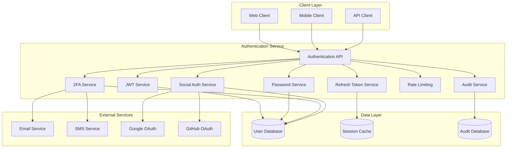
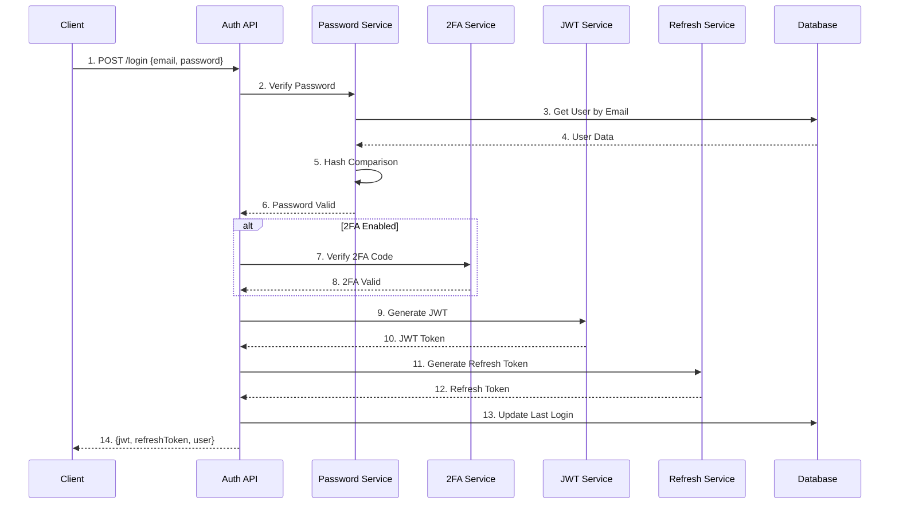
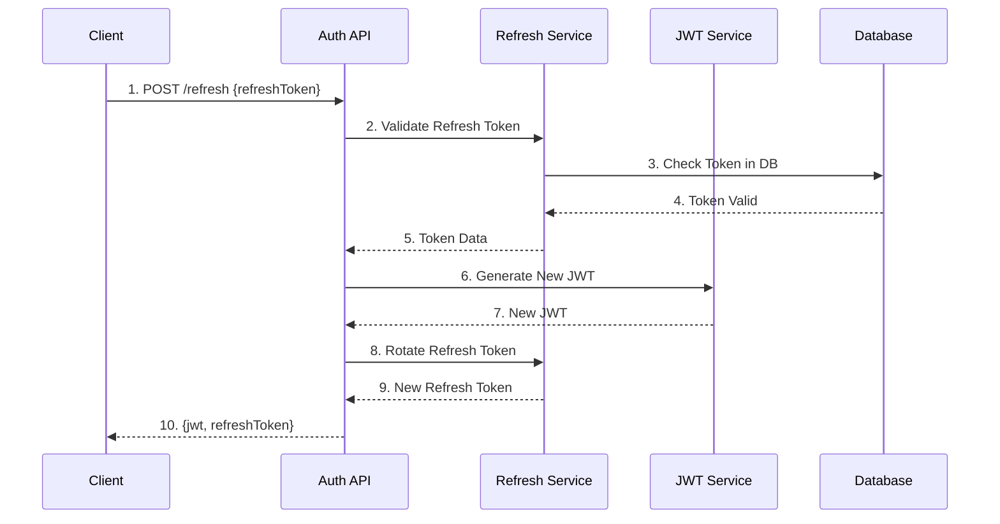

# Authentication Service - Microservice Architecture

> **Status**: Active  
> **Última Atualização**: 2025-01-26  
> **Versão**: 1.0.0  
> **Responsável**: Axisor Authentication System  

## Índice

- [Visão Geral](#visão-geral)
- [Arquitetura do Serviço](#arquitetura-do-serviço)
- [Componentes Principais](#componentes-principais)
- [Fluxo de Autenticação](#fluxo-de-autenticação)
- [Configuração](#configuração)
- [Segurança](#segurança)
- [Performance](#performance)
- [Monitoramento](#monitoramento)
- [Troubleshooting](#troubleshooting)
- [Referências](#referências)

## Visão Geral

O Authentication Service é responsável por gerenciar toda a autenticação e autorização do sistema Axisor. Ele implementa JWT tokens, refresh tokens, autenticação de dois fatores (2FA) e integração com provedores sociais.

## Arquitetura do Serviço

### Diagrama de Arquitetura



### Principais Elementos

- **Authentication API**: Interface principal do serviço
- **JWT Service**: Geração e validação de tokens JWT
- **Refresh Token Service**: Gerenciamento de refresh tokens
- **Password Service**: Hash e validação de senhas
- **2FA Service**: Autenticação de dois fatores
- **Social Auth Service**: Integração com provedores OAuth
- **Rate Limiting**: Proteção contra ataques de força bruta
- **Audit Service**: Log de atividades de segurança

## Componentes Principais

### Authentication API

**Localização**: `backend/src/routes/auth.routes.ts`

**Responsabilidades**:
- Endpoints de autenticação
- Validação de requests
- Rate limiting
- Logging de auditoria

```typescript
// Estrutura principal da API
export const authRoutes = async (fastify: FastifyInstance) => {
  // Rate limiting para endpoints sensíveis
  await fastify.register(rateLimit, {
    max: 5,
    timeWindow: '15 minutes',
    keyGenerator: (request) => request.ip
  });

  // Login endpoint
  fastify.post('/login', {
    schema: loginSchema,
    preHandler: [validateRequest, rateLimitByIP]
  }, async (request, reply) => {
    const { email, password, twoFactorCode } = request.body;
    
    try {
      const result = await authService.login({
        email,
        password,
        twoFactorCode
      });
      
      await auditService.logLogin(request, result.success);
      return result;
    } catch (error) {
      await auditService.logFailedLogin(request, error);
      throw error;
    }
  });

  // Refresh token endpoint
  fastify.post('/refresh', {
    schema: refreshSchema
  }, async (request, reply) => {
    const { refreshToken } = request.body;
    return authService.refreshToken(refreshToken);
  });

  // Logout endpoint
  fastify.post('/logout', {
    preHandler: [fastify.authenticate]
  }, async (request, reply) => {
    const userId = request.user.id;
    await authService.logout(userId);
    await auditService.logLogout(request);
    return { success: true };
  });
};
```

### JWT Service

**Localização**: `backend/src/services/auth/jwt.service.ts`

**Responsabilidades**:
- Geração de JWT tokens
- Validação de tokens
- Decodificação de claims
- Gestão de expiração

```typescript
class JWTService {
  private readonly secret: string;
  private readonly expiresIn: string;
  private readonly issuer: string;

  constructor() {
    this.secret = process.env.JWT_SECRET!;
    this.expiresIn = process.env.JWT_EXPIRES_IN || '15m';
    this.issuer = 'axisor-api';
  }

  async generateToken(payload: JWTPayload): Promise<string> {
    const tokenPayload = {
      ...payload,
      iat: Math.floor(Date.now() / 1000),
      exp: Math.floor(Date.now() / 1000) + this.getExpirationSeconds(),
      iss: this.issuer
    };

    return jwt.sign(tokenPayload, this.secret, {
      algorithm: 'HS256'
    });
  }

  async verifyToken(token: string): Promise<JWTPayload> {
    try {
      const decoded = jwt.verify(token, this.secret, {
        issuer: this.issuer,
        algorithms: ['HS256']
      }) as JWTPayload;

      // Verificar se o usuário ainda está ativo
      const user = await this.userService.findById(decoded.userId);
      if (!user || !user.is_active) {
        throw new Error('User inactive');
      }

      return decoded;
    } catch (error) {
      throw new UnauthorizedError('Invalid token');
    }
  }

  private getExpirationSeconds(): number {
    const timeValue = parseInt(this.expiresIn);
    const timeUnit = this.expiresIn.slice(-1);
    
    switch (timeUnit) {
      case 'm': return timeValue * 60;
      case 'h': return timeValue * 3600;
      case 'd': return timeValue * 86400;
      default: return 900; // 15 minutes default
    }
  }
}
```

### Refresh Token Service

**Localização**: `backend/src/services/auth/refresh-token.service.ts`

**Responsabilidades**:
- Geração de refresh tokens
- Armazenamento seguro em Redis
- Rotação de tokens
- Revogação de tokens

```typescript
class RefreshTokenService {
  private readonly redis: Redis;
  private readonly tokenLength = 64;
  private readonly ttl = 7 * 24 * 60 * 60; // 7 days

  constructor() {
    this.redis = new Redis(process.env.REDIS_URL!);
  }

  async generateRefreshToken(userId: string, deviceInfo: DeviceInfo): Promise<string> {
    const token = this.generateSecureToken();
    const key = this.getTokenKey(token);
    
    const tokenData = {
      userId,
      deviceInfo,
      createdAt: new Date().toISOString(),
      expiresAt: new Date(Date.now() + this.ttl * 1000).toISOString()
    };

    await this.redis.setex(key, this.ttl, JSON.stringify(tokenData));
    
    // Armazenar referência do token no banco
    await this.prisma.refreshToken.create({
      data: {
        user_id: userId,
        token: token,
        expires_at: new Date(Date.now() + this.ttl * 1000),
        device_info: deviceInfo
      }
    });

    return token;
  }

  async validateRefreshToken(token: string): Promise<RefreshTokenData | null> {
    const key = this.getTokenKey(token);
    const tokenData = await this.redis.get(key);
    
    if (!tokenData) {
      return null;
    }

    const parsed = JSON.parse(tokenData);
    
    // Verificar se o token não expirou
    if (new Date(parsed.expiresAt) < new Date()) {
      await this.revokeToken(token);
      return null;
    }

    return parsed;
  }

  async revokeToken(token: string): Promise<void> {
    const key = this.getTokenKey(token);
    await this.redis.del(key);
    
    // Marcar como revogado no banco
    await this.prisma.refreshToken.updateMany({
      where: { token },
      data: { is_revoked: true }
    });
  }

  async revokeAllUserTokens(userId: string): Promise<void> {
    const tokens = await this.prisma.refreshToken.findMany({
      where: { user_id: userId, is_revoked: false }
    });

    for (const tokenRecord of tokens) {
      await this.revokeToken(tokenRecord.token);
    }
  }

  private generateSecureToken(): string {
    return crypto.randomBytes(this.tokenLength).toString('hex');
  }

  private getTokenKey(token: string): string {
    return `refresh_token:${token}`;
  }
}
```

### Password Service

**Localização**: `backend/src/services/auth/password.service.ts`

**Responsabilidades**:
- Hash de senhas com bcrypt
- Validação de senhas
- Política de senhas
- Reset de senhas

```typescript
class PasswordService {
  private readonly saltRounds = 12;

  async hashPassword(password: string): Promise<string> {
    this.validatePasswordPolicy(password);
    return bcrypt.hash(password, this.saltRounds);
  }

  async verifyPassword(password: string, hashedPassword: string): Promise<boolean> {
    return bcrypt.compare(password, hashedPassword);
  }

  async resetPassword(userId: string, newPassword: string): Promise<void> {
    const hashedPassword = await this.hashPassword(newPassword);
    
    await this.prisma.user.update({
      where: { id: userId },
      data: { 
        password_hash: hashedPassword,
        password_reset_token: null,
        password_reset_expires: null
      }
    });
  }

  async generatePasswordResetToken(email: string): Promise<string> {
    const user = await this.prisma.user.findUnique({
      where: { email }
    });

    if (!user) {
      // Não revelar se o email existe ou não
      return crypto.randomBytes(32).toString('hex');
    }

    const token = crypto.randomBytes(32).toString('hex');
    const expires = new Date(Date.now() + 3600000); // 1 hour

    await this.prisma.user.update({
      where: { id: user.id },
      data: {
        password_reset_token: token,
        password_reset_expires: expires
      }
    });

    // Enviar email com token
    await this.emailService.sendPasswordReset(user.email, token);
    
    return token;
  }

  private validatePasswordPolicy(password: string): void {
    const minLength = 8;
    const hasUpperCase = /[A-Z]/.test(password);
    const hasLowerCase = /[a-z]/.test(password);
    const hasNumbers = /\d/.test(password);
    const hasSpecialChar = /[!@#$%^&*(),.?":{}|<>]/.test(password);

    if (password.length < minLength) {
      throw new ValidationError('Password must be at least 8 characters long');
    }

    if (!hasUpperCase) {
      throw new ValidationError('Password must contain at least one uppercase letter');
    }

    if (!hasLowerCase) {
      throw new ValidationError('Password must contain at least one lowercase letter');
    }

    if (!hasNumbers) {
      throw new ValidationError('Password must contain at least one number');
    }

    if (!hasSpecialChar) {
      throw new ValidationError('Password must contain at least one special character');
    }
  }
}
```

### Two-Factor Authentication Service

**Localização**: `backend/src/services/auth/two-factor.service.ts`

**Responsabilidades**:
- Geração de códigos 2FA
- Validação de códigos
- Backup codes
- Integração com apps autenticadores

```typescript
class TwoFactorService {
  private readonly issuer = 'Axisor';

  async generateSecret(userId: string): Promise<string> {
    const user = await this.prisma.user.findUnique({
      where: { id: userId }
    });

    if (!user) {
      throw new Error('User not found');
    }

    const secret = speakeasy.generateSecret({
      name: `${this.issuer} (${user.email})`,
      issuer: this.issuer,
      length: 32
    });

    // Salvar secret temporariamente para verificação
    await this.prisma.user.update({
      where: { id: userId },
      data: { two_factor_secret: secret.base32 }
    });

    return secret.base32;
  }

  async verifyCode(userId: string, token: string): Promise<boolean> {
    const user = await this.prisma.user.findUnique({
      where: { id: userId }
    });

    if (!user || !user.two_factor_secret) {
      return false;
    }

    const verified = speakeasy.totp.verify({
      secret: user.two_factor_secret,
      encoding: 'base32',
      token,
      window: 2 // Allow 2 time steps before/after
    });

    return verified;
  }

  async enable2FA(userId: string, token: string): Promise<string[]> {
    const isValid = await this.verifyCode(userId, token);
    
    if (!isValid) {
      throw new Error('Invalid verification code');
    }

    // Gerar backup codes
    const backupCodes = this.generateBackupCodes();
    
    await this.prisma.user.update({
      where: { id: userId },
      data: {
        two_factor_enabled: true,
        two_factor_backup_codes: backupCodes.map(code => 
          bcrypt.hashSync(code, 10)
        )
      }
    });

    return backupCodes;
  }

  async disable2FA(userId: string, password: string): Promise<void> {
    const user = await this.prisma.user.findUnique({
      where: { id: userId }
    });

    if (!user || !user.password_hash) {
      throw new Error('User not found');
    }

    const isValidPassword = await bcrypt.compare(password, user.password_hash);
    if (!isValidPassword) {
      throw new Error('Invalid password');
    }

    await this.prisma.user.update({
      where: { id: userId },
      data: {
        two_factor_enabled: false,
        two_factor_secret: null,
        two_factor_backup_codes: null
      }
    });
  }

  async verifyBackupCode(userId: string, code: string): Promise<boolean> {
    const user = await this.prisma.user.findUnique({
      where: { id: userId }
    });

    if (!user || !user.two_factor_backup_codes) {
      return false;
    }

    const backupCodes = user.two_factor_backup_codes as string[];
    
    for (let i = 0; i < backupCodes.length; i++) {
      if (bcrypt.compareSync(code, backupCodes[i])) {
        // Remover código usado
        backupCodes.splice(i, 1);
        await this.prisma.user.update({
          where: { id: userId },
          data: { two_factor_backup_codes: backupCodes }
        });
        return true;
      }
    }

    return false;
  }

  private generateBackupCodes(): string[] {
    const codes: string[] = [];
    for (let i = 0; i < 10; i++) {
      codes.push(crypto.randomBytes(4).toString('hex').toUpperCase());
    }
    return codes;
  }
}
```

## Fluxo de Autenticação

### Login Flow



### Token Refresh Flow



## Configuração

### Environment Variables

```bash
# JWT Configuration
JWT_SECRET=your-super-secret-jwt-key
JWT_EXPIRES_IN=15m
JWT_ISSUER=axisor-api

# Password Policy
PASSWORD_MIN_LENGTH=8
PASSWORD_REQUIRE_UPPERCASE=true
PASSWORD_REQUIRE_LOWERCASE=true
PASSWORD_REQUIRE_NUMBERS=true
PASSWORD_REQUIRE_SPECIAL=true

# 2FA Configuration
TWO_FA_ISSUER=Axisor
TWO_FA_WINDOW=2

# Rate Limiting
RATE_LIMIT_LOGIN_MAX=5
RATE_LIMIT_LOGIN_WINDOW=15m
RATE_LIMIT_RESET_MAX=3
RATE_LIMIT_RESET_WINDOW=1h

# Session Configuration
REFRESH_TOKEN_TTL=7d
SESSION_CLEANUP_INTERVAL=1h
```

### Security Headers

```typescript
// Helmet configuration for security headers
await fastify.register(helmet, {
  contentSecurityPolicy: {
    directives: {
      defaultSrc: ["'self'"],
      scriptSrc: ["'self'", "'unsafe-inline'"],
      styleSrc: ["'self'", "'unsafe-inline'"],
      imgSrc: ["'self'", "data:", "https:"],
      connectSrc: ["'self'"],
      fontSrc: ["'self'"],
      objectSrc: ["'none'"],
      mediaSrc: ["'self'"],
      frameSrc: ["'none'"],
    },
  },
  hsts: {
    maxAge: 31536000,
    includeSubDomains: true,
    preload: true
  },
  noSniff: true,
  xssFilter: true,
  referrerPolicy: { policy: "same-origin" }
});
```

## Segurança

### Rate Limiting

```typescript
// Rate limiting por IP para login
await fastify.register(rateLimit, {
  max: 5,
  timeWindow: '15 minutes',
  keyGenerator: (request) => request.ip,
  errorResponseBuilder: (request, context) => ({
    code: 429,
    error: 'Too Many Requests',
    message: 'Too many login attempts. Please try again later.',
    retryAfter: Math.round(Number(context.after) / 1000)
  })
});

// Rate limiting por usuário para operações sensíveis
await fastify.register(rateLimit, {
  max: 3,
  timeWindow: '1 hour',
  keyGenerator: (request) => request.user?.id || request.ip,
  skipSuccessfulRequests: true
});
```

### Audit Logging

```typescript
class AuditService {
  async logLogin(request: FastifyRequest, success: boolean): Promise<void> {
    await this.prisma.securityAuditLog.create({
      data: {
        user_id: request.user?.id,
        action: 'LOGIN_ATTEMPT',
        resource: 'auth',
        ip_address: request.ip,
        user_agent: request.headers['user-agent'],
        success,
        details: {
          email: request.body?.email,
          timestamp: new Date().toISOString()
        }
      }
    });
  }

  async logFailedLogin(request: FastifyRequest, error: Error): Promise<void> {
    await this.prisma.securityAuditLog.create({
      data: {
        action: 'LOGIN_FAILED',
        resource: 'auth',
        ip_address: request.ip,
        user_agent: request.headers['user-agent'],
        success: false,
        details: {
          email: request.body?.email,
          error: error.message,
          timestamp: new Date().toISOString()
        }
      }
    });
  }
}
```

## Performance

### Caching Strategy

```typescript
// Cache de sessões ativas
class SessionCache {
  private redis: Redis;
  private ttl = 15 * 60; // 15 minutes

  constructor() {
    this.redis = new Redis(process.env.REDIS_URL!);
  }

  async cacheActiveSession(userId: string, sessionData: SessionData): Promise<void> {
    const key = `active_session:${userId}`;
    await this.redis.setex(key, this.ttl, JSON.stringify(sessionData));
  }

  async getActiveSession(userId: string): Promise<SessionData | null> {
    const key = `active_session:${userId}`;
    const data = await this.redis.get(key);
    return data ? JSON.parse(data) : null;
  }

  async invalidateSession(userId: string): Promise<void> {
    const key = `active_session:${userId}`;
    await this.redis.del(key);
  }
}
```

### Database Optimization

```sql
-- Índices para otimização de queries de autenticação
CREATE INDEX CONCURRENTLY idx_user_email ON "User" (email);
CREATE INDEX CONCURRENTLY idx_user_email_verification_token ON "User" (email_verification_token);
CREATE INDEX CONCURRENTLY idx_user_password_reset_token ON "User" (password_reset_token);
CREATE INDEX CONCURRENTLY idx_refresh_token_user_id ON "RefreshToken" (user_id);
CREATE INDEX CONCURRENTLY idx_refresh_token_expires_at ON "RefreshToken" (expires_at);
CREATE INDEX CONCURRENTLY idx_security_audit_log_user_id ON "SecurityAuditLog" (user_id);
CREATE INDEX CONCURRENTLY idx_security_audit_log_created_at ON "SecurityAuditLog" (created_at);
```

## Monitoramento

### Metrics

```typescript
// Métricas de autenticação
class AuthMetrics {
  private prometheus = new PrometheusRegistry();

  private loginAttempts = new Counter({
    name: 'auth_login_attempts_total',
    help: 'Total number of login attempts',
    labelNames: ['success', 'method']
  });

  private loginDuration = new Histogram({
    name: 'auth_login_duration_seconds',
    help: 'Duration of login requests',
    labelNames: ['method']
  });

  private activeSessions = new Gauge({
    name: 'auth_active_sessions',
    help: 'Number of active user sessions'
  });

  async recordLoginAttempt(success: boolean, method: string): Promise<void> {
    this.loginAttempts.inc({ success: success.toString(), method });
  }

  async recordLoginDuration(duration: number, method: string): Promise<void> {
    this.loginDuration.observe({ method }, duration);
  }

  async updateActiveSessions(count: number): Promise<void> {
    this.activeSessions.set(count);
  }
}
```

### Health Checks

```typescript
// Health check para o serviço de autenticação
async function authHealthCheck(): Promise<HealthStatus> {
  const checks = {
    database: await checkDatabaseConnection(),
    redis: await checkRedisConnection(),
    jwt: await checkJWTService(),
    email: await checkEmailService()
  };

  const isHealthy = Object.values(checks).every(check => check.status === 'healthy');

  return {
    status: isHealthy ? 'healthy' : 'unhealthy',
    checks,
    timestamp: new Date().toISOString()
  };
}
```

## Troubleshooting

### Common Issues

#### Token Expiration Issues

```typescript
// Verificar configuração de expiração
const jwtConfig = {
  expiresIn: process.env.JWT_EXPIRES_IN || '15m',
  refreshTokenTTL: process.env.REFRESH_TOKEN_TTL || '7d'
};

// Debug token expiration
function debugTokenExpiration(token: string): void {
  try {
    const decoded = jwt.decode(token) as any;
    const now = Math.floor(Date.now() / 1000);
    const expires = decoded.exp;
    const timeLeft = expires - now;
    
    console.log(`Token expires in: ${timeLeft} seconds`);
    console.log(`Token expires at: ${new Date(expires * 1000).toISOString()}`);
  } catch (error) {
    console.error('Error decoding token:', error);
  }
}
```

#### Rate Limiting Issues

```typescript
// Debug rate limiting
async function debugRateLimit(key: string): Promise<void> {
  const redis = new Redis(process.env.REDIS_URL!);
  const rateLimitKey = `rate_limit:${key}`;
  const data = await redis.get(rateLimitKey);
  
  if (data) {
    const parsed = JSON.parse(data);
    console.log('Rate limit data:', parsed);
  } else {
    console.log('No rate limit data found');
  }
}
```

## Referências

- [Security Overview](../security/authentication/jwt-implementation.md)
- [Database Schema](../../../backend/prisma/schema.prisma)
- [Auth Routes](../../../backend/src/routes/auth.routes.ts)
- [JWT Service](../../../backend/src/services/auth/jwt.service.ts)
- [Password Service](../../../backend/src/services/auth/password.service.ts)

## Como Usar Este Documento

• **Para Desenvolvedores**: Use como referência para implementar novos recursos de autenticação seguindo os padrões estabelecidos.

• **Para DevOps**: Utilize para configurar e monitorar o serviço de autenticação em produção.

• **Para Security**: Use para entender as medidas de segurança implementadas e identificar pontos de melhoria.
