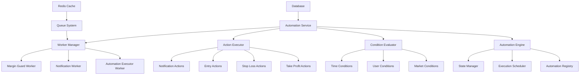

# Automation Service - Microservices

> **Status**: Active  
> **Última Atualização**: 2025-01-26  
> **Versão**: 1.0.0  
> **Responsável**: Axisor Automation Team  

## Índice

- [Visão Geral](#visão-geral)
- [Automation Engine Architecture](#automation-engine-architecture)
- [Automation Types](#automation-types)
- [Execution Flow](#execution-flow)
- [Condition Evaluation](#condition-evaluation)
- [Action Execution](#action-execution)
- [Worker Integration](#worker-integration)
- [Error Handling](#error-handling)
- [Monitoring & Logging](#monitoring--logging)
- [Troubleshooting](#troubleshooting)
- [Referências](#referências)

## Visão Geral

O Automation Service é responsável por gerenciar e executar todas as automações de trading no sistema Axisor. Ele implementa um engine flexível que suporta diferentes tipos de automações, condições complexas e ações personalizadas, com integração completa ao sistema de workers para execução assíncrona.

## Automation Engine Architecture

### Service Architecture Overview



### Core Components

```typescript
// Automation Service Core
class AutomationService {
  private prisma: PrismaClient;
  private redis: Redis;
  private logger: Logger;
  private automationEngine: AutomationEngine;
  private conditionEvaluator: ConditionEvaluator;
  private actionExecutor: ActionExecutor;
  private workerManager: WorkerManager;
  private queue: Queue;

  constructor(config: AutomationServiceConfig) {
    this.prisma = config.prisma;
    this.redis = config.redis;
    this.logger = config.logger;
    
    // Initialize core components
    this.automationEngine = new AutomationEngine(this.prisma, this.logger);
    this.conditionEvaluator = new ConditionEvaluator(this.redis, this.logger);
    this.actionExecutor = new ActionExecutor(this.prisma, this.logger);
    this.workerManager = new WorkerManager(config.workerConfig);
    
    // Initialize queue
    this.queue = new Queue('automation-execution', {
      connection: this.redis
    });
  }

  async initialize(): Promise<void> {
    this.logger.info('🚀 Initializing Automation Service');
    
    await Promise.all([
      this.automationEngine.initialize(),
      this.conditionEvaluator.initialize(),
      this.actionExecutor.initialize(),
      this.workerManager.start()
    ]);
    
    // Setup queue processing
    this.setupQueueProcessing();
    
    this.logger.info('✅ Automation Service initialized successfully');
  }

  private setupQueueProcessing(): void {
    this.queue.process('execute-automation', async (job) => {
      const { automationId, triggerData } = job.data;
      return this.executeAutomation(automationId, triggerData);
    });
  }
}
```

## Automation Types

### Take Profit Automation

```typescript
interface TakeProfitAutomation {
  id: string;
  user_id: string;
  type: 'TAKE_PROFIT';
  conditions: {
    position_type: 'LONG' | 'SHORT';
    profit_percentage: number;
    profit_amount?: number;
    min_profit?: number;
    max_profit?: number;
  };
  actions: {
    action_type: 'CLOSE_POSITION';
    close_percentage: number; // 100 = close all, 50 = close half
    send_notification: boolean;
    notification_message?: string;
  };
  is_active: boolean;
  created_at: Date;
  updated_at: Date;
}

class TakeProfitAutomationHandler {
  async evaluate(automation: TakeProfitAutomation, marketData: MarketData): Promise<boolean> {
    const position = await this.getUserPosition(automation.user_id);
    
    if (!position || position.type !== automation.conditions.position_type) {
      return false;
    }
    
    const currentPrice = marketData.price;
    const entryPrice = position.entry_price;
    const positionSize = position.size;
    
    // Calculate profit
    let profitPercentage: number;
    if (automation.conditions.position_type === 'LONG') {
      profitPercentage = ((currentPrice - entryPrice) / entryPrice) * 100;
    } else {
      profitPercentage = ((entryPrice - currentPrice) / entryPrice) * 100;
    }
    
    // Check profit conditions
    if (profitPercentage < automation.conditions.profit_percentage) {
      return false;
    }
    
    // Check min/max profit if specified
    if (automation.conditions.min_profit && profitPercentage < automation.conditions.min_profit) {
      return false;
    }
    
    if (automation.conditions.max_profit && profitPercentage > automation.conditions.max_profit) {
      return false;
    }
    
    return true;
  }

  async execute(automation: TakeProfitAutomation): Promise<AutomationResult> {
    const position = await this.getUserPosition(automation.user_id);
    const closeSize = position.size * (automation.actions.close_percentage / 100);
    
    try {
      // Execute close position
      const result = await this.closePosition({
        userId: automation.user_id,
        positionId: position.id,
        size: closeSize,
        reason: 'TAKE_PROFIT_AUTOMATION'
      });
      
      // Send notification if configured
      if (automation.actions.send_notification) {
        await this.sendNotification({
          userId: automation.user_id,
          type: 'TAKE_PROFIT_EXECUTED',
          message: automation.actions.notification_message || 
            `Take profit executed: ${automation.actions.close_percentage}% of position closed`
        });
      }
      
      return {
        success: true,
        result,
        message: 'Take profit executed successfully'
      };
      
    } catch (error) {
      this.logger.error('Take profit execution failed', { 
        automationId: automation.id, 
        error: error.message 
      });
      
      return {
        success: false,
        error: error.message
      };
    }
  }
}
```

### Stop Loss Automation

```typescript
interface StopLossAutomation {
  id: string;
  user_id: string;
  type: 'STOP_LOSS';
  conditions: {
    position_type: 'LONG' | 'SHORT';
    loss_percentage: number;
    loss_amount?: number;
    trailing_stop?: boolean;
    trailing_distance?: number;
  };
  actions: {
    action_type: 'CLOSE_POSITION' | 'REDUCE_POSITION';
    close_percentage: number;
    send_notification: boolean;
    notification_message?: string;
  };
  is_active: boolean;
  created_at: Date;
  updated_at: Date;
}

class StopLossAutomationHandler {
  async evaluate(automation: StopLossAutomation, marketData: MarketData): Promise<boolean> {
    const position = await this.getUserPosition(automation.user_id);
    
    if (!position || position.type !== automation.conditions.position_type) {
      return false;
    }
    
    const currentPrice = marketData.price;
    const entryPrice = position.entry_price;
    
    // Calculate loss
    let lossPercentage: number;
    if (automation.conditions.position_type === 'LONG') {
      lossPercentage = ((entryPrice - currentPrice) / entryPrice) * 100;
    } else {
      lossPercentage = ((currentPrice - entryPrice) / entryPrice) * 100;
    }
    
    // Check loss conditions
    if (lossPercentage < automation.conditions.loss_percentage) {
      return false;
    }
    
    // Handle trailing stop
    if (automation.conditions.trailing_stop) {
      return this.evaluateTrailingStop(automation, position, currentPrice);
    }
    
    return true;
  }

  private async evaluateTrailingStop(
    automation: StopLossAutomation, 
    position: Position, 
    currentPrice: number
  ): Promise<boolean> {
    const trailingDistance = automation.conditions.trailing_distance || 2; // 2% default
    
    // Get highest price since position opened (for LONG) or lowest (for SHORT)
    const priceHistory = await this.getPriceHistorySince(position.created_at);
    
    let referencePrice: number;
    if (automation.conditions.position_type === 'LONG') {
      referencePrice = Math.max(...priceHistory.map(p => p.high));
    } else {
      referencePrice = Math.min(...priceHistory.map(p => p.low));
    }
    
    // Calculate trailing stop level
    const trailingStopLevel = automation.conditions.position_type === 'LONG'
      ? referencePrice * (1 - trailingDistance / 100)
      : referencePrice * (1 + trailingDistance / 100);
    
    // Check if current price has hit trailing stop
    if (automation.conditions.position_type === 'LONG') {
      return currentPrice <= trailingStopLevel;
    } else {
      return currentPrice >= trailingStopLevel;
    }
  }
}
```

### Auto Entry Automation

```typescript
interface AutoEntryAutomation {
  id: string;
  user_id: string;
  type: 'AUTO_ENTRY';
  conditions: {
    entry_conditions: {
      price_above?: number;
      price_below?: number;
      volume_spike?: boolean;
      rsi_oversold?: boolean;
      rsi_overbought?: boolean;
      moving_average_cross?: 'above' | 'below';
      moving_average_period?: number;
    };
    time_conditions?: {
      start_time?: string; // HH:MM format
      end_time?: string;   // HH:MM format
      weekdays?: number[]; // 0-6, Sunday = 0
    };
    cooldown_period?: number; // minutes
  };
  actions: {
    position_type: 'LONG' | 'SHORT';
    position_size: number;
    entry_price_type: 'MARKET' | 'LIMIT';
    limit_price_offset?: number; // percentage offset for limit orders
    send_notification: boolean;
    notification_message?: string;
  };
  is_active: boolean;
  created_at: Date;
  updated_at: Date;
}

class AutoEntryAutomationHandler {
  async evaluate(automation: AutoEntryAutomation, marketData: MarketData): Promise<boolean> {
    // Check cooldown period
    if (await this.isInCooldown(automation.id)) {
      return false;
    }
    
    // Check time conditions
    if (!this.checkTimeConditions(automation.conditions.time_conditions)) {
      return false;
    }
    
    // Check entry conditions
    return this.checkEntryConditions(automation.conditions.entry_conditions, marketData);
  }

  private checkEntryConditions(conditions: any, marketData: MarketData): boolean {
    // Price conditions
    if (conditions.price_above && marketData.price <= conditions.price_above) {
      return false;
    }
    
    if (conditions.price_below && marketData.price >= conditions.price_below) {
      return false;
    }
    
    // Volume spike
    if (conditions.volume_spike) {
      const avgVolume = this.calculateAverageVolume(24); // 24 hours
      if (marketData.volume < avgVolume * 1.5) { // 50% above average
        return false;
      }
    }
    
    // RSI conditions
    if (conditions.rsi_oversold && marketData.rsi > 30) {
      return false;
    }
    
    if (conditions.rsi_overbought && marketData.rsi < 70) {
      return false;
    }
    
    // Moving average cross
    if (conditions.moving_average_cross) {
      const ma = this.calculateMovingAverage(conditions.moving_average_period || 20);
      if (conditions.moving_average_cross === 'above' && marketData.price <= ma) {
        return false;
      }
      if (conditions.moving_average_cross === 'below' && marketData.price >= ma) {
        return false;
      }
    }
    
    return true;
  }

  private checkTimeConditions(timeConditions?: any): boolean {
    if (!timeConditions) return true;
    
    const now = new Date();
    const currentTime = now.getHours() * 60 + now.getMinutes();
    const currentWeekday = now.getDay();
    
    // Check weekdays
    if (timeConditions.weekdays && !timeConditions.weekdays.includes(currentWeekday)) {
      return false;
    }
    
    // Check time range
    if (timeConditions.start_time) {
      const [startHour, startMin] = timeConditions.start_time.split(':').map(Number);
      const startTime = startHour * 60 + startMin;
      
      if (currentTime < startTime) {
        return false;
      }
    }
    
    if (timeConditions.end_time) {
      const [endHour, endMin] = timeConditions.end_time.split(':').map(Number);
      const endTime = endHour * 60 + endMin;
      
      if (currentTime > endTime) {
        return false;
      }
    }
    
    return true;
  }
}
```

## Execution Flow

### Automation Execution Pipeline

```typescript
class AutomationExecutionPipeline {
  async executeAutomation(automationId: string, triggerData: any): Promise<AutomationResult> {
    const startTime = Date.now();
    
    try {
      // 1. Load automation
      const automation = await this.loadAutomation(automationId);
      if (!automation || !automation.is_active) {
        throw new Error('Automation not found or inactive');
      }
      
      // 2. Check user permissions and limits
      await this.validateUserPermissions(automation.user_id);
      
      // 3. Evaluate conditions
      const conditionsMet = await this.evaluateConditions(automation, triggerData);
      if (!conditionsMet) {
        return { success: false, reason: 'Conditions not met' };
      }
      
      // 4. Execute actions
      const result = await this.executeActions(automation);
      
      // 5. Update automation state
      await this.updateAutomationState(automationId, 'EXECUTED', result);
      
      // 6. Log execution
      await this.logExecution(automationId, result, Date.now() - startTime);
      
      return result;
      
    } catch (error) {
      // Handle execution error
      await this.handleExecutionError(automationId, error);
      throw error;
    }
  }

  private async loadAutomation(automationId: string): Promise<Automation | null> {
    return this.prisma.automation.findUnique({
      where: { id: automationId },
      include: {
        user: {
          select: { id: true, plan_type: true, is_active: true }
        }
      }
    });
  }

  private async validateUserPermissions(userId: string): Promise<void> {
    const user = await this.prisma.user.findUnique({
      where: { id: userId },
      select: { plan_type: true, is_active: true }
    });
    
    if (!user || !user.is_active) {
      throw new Error('User not found or inactive');
    }
    
    // Check plan limits
    const planLimits = await this.getPlanLimits(user.plan_type);
    const activeAutomations = await this.getActiveAutomationsCount(userId);
    
    if (activeAutomations >= planLimits.max_automations) {
      throw new Error('Automation limit exceeded for plan');
    }
  }

  private async evaluateConditions(automation: Automation, triggerData: any): Promise<boolean> {
    const handler = this.getAutomationHandler(automation.type);
    const marketData = await this.getCurrentMarketData();
    
    return handler.evaluate(automation, { ...marketData, ...triggerData });
  }

  private async executeActions(automation: Automation): Promise<AutomationResult> {
    const handler = this.getAutomationHandler(automation.type);
    return handler.execute(automation);
  }
}
```

## Condition Evaluation

### Market Data Integration

```typescript
class ConditionEvaluator {
  private marketDataService: MarketDataService;
  private technicalIndicators: TechnicalIndicatorsService;
  private redis: Redis;

  async evaluateMarketConditions(conditions: MarketConditions, symbol: string): Promise<boolean> {
    const marketData = await this.getMarketData(symbol);
    
    // Evaluate each condition
    const results = await Promise.all([
      this.evaluatePriceConditions(conditions.price, marketData),
      this.evaluateVolumeConditions(conditions.volume, marketData),
      this.evaluateTechnicalConditions(conditions.technical, marketData),
      this.evaluateTimeConditions(conditions.time)
    ]);
    
    // All conditions must be true
    return results.every(result => result === true);
  }

  private async evaluatePriceConditions(priceConditions: any, marketData: MarketData): Promise<boolean> {
    if (!priceConditions) return true;
    
    const { price, high, low, open, close } = marketData;
    
    // Price range conditions
    if (priceConditions.min_price && price < priceConditions.min_price) {
      return false;
    }
    
    if (priceConditions.max_price && price > priceConditions.max_price) {
      return false;
    }
    
    // Price change conditions
    if (priceConditions.price_change_percentage) {
      const priceChange = ((price - open) / open) * 100;
      if (priceChange < priceConditions.price_change_percentage.min ||
          priceChange > priceConditions.price_change_percentage.max) {
        return false;
      }
    }
    
    return true;
  }

  private async evaluateTechnicalConditions(technicalConditions: any, marketData: MarketData): Promise<boolean> {
    if (!technicalConditions) return true;
    
    // RSI conditions
    if (technicalConditions.rsi) {
      const rsi = await this.technicalIndicators.calculateRSI(marketData.symbol, 14);
      if (rsi < technicalConditions.rsi.oversold || rsi > technicalConditions.rsi.overbought) {
        return false;
      }
    }
    
    // Moving average conditions
    if (technicalConditions.moving_average) {
      const ma = await this.technicalIndicators.calculateMA(
        marketData.symbol, 
        technicalConditions.moving_average.period
      );
      
      if (technicalConditions.moving_average.direction === 'above' && marketData.price <= ma) {
        return false;
      }
      
      if (technicalConditions.moving_average.direction === 'below' && marketData.price >= ma) {
        return false;
      }
    }
    
    // MACD conditions
    if (technicalConditions.macd) {
      const macd = await this.technicalIndicators.calculateMACD(marketData.symbol);
      
      if (technicalConditions.macd.signal === 'bullish' && macd.histogram <= 0) {
        return false;
      }
      
      if (technicalConditions.macd.signal === 'bearish' && macd.histogram >= 0) {
        return false;
      }
    }
    
    return true;
  }
}
```

## Action Execution

### Action Executor Implementation

```typescript
class ActionExecutor {
  private lnMarketsService: LNMarketsService;
  private notificationService: NotificationService;
  private logger: Logger;

  async executeAction(action: AutomationAction, context: ExecutionContext): Promise<ActionResult> {
    const startTime = Date.now();
    
    try {
      let result: ActionResult;
      
      switch (action.type) {
        case 'CLOSE_POSITION':
          result = await this.executeClosePosition(action, context);
          break;
          
        case 'REDUCE_POSITION':
          result = await this.executeReducePosition(action, context);
          break;
          
        case 'OPEN_POSITION':
          result = await this.executeOpenPosition(action, context);
          break;
          
        case 'SEND_NOTIFICATION':
          result = await this.executeSendNotification(action, context);
          break;
          
        case 'UPDATE_MARGIN_GUARD':
          result = await this.executeUpdateMarginGuard(action, context);
          break;
          
        default:
          throw new Error(`Unknown action type: ${action.type}`);
      }
      
      // Log execution
      await this.logActionExecution(action, result, Date.now() - startTime);
      
      return result;
      
    } catch (error) {
      this.logger.error('Action execution failed', { 
        action, 
        context, 
        error: error.message 
      });
      
      throw error;
    }
  }

  private async executeClosePosition(action: ClosePositionAction, context: ExecutionContext): Promise<ActionResult> {
    const { userId, positionId, size, reason } = action.parameters;
    
    try {
      // Get current position
      const position = await this.lnMarketsService.futures.getPosition(positionId);
      
      if (!position) {
        throw new Error('Position not found');
      }
      
      // Calculate close size
      const closeSize = size || position.size;
      
      // Execute close order
      const closeResult = await this.lnMarketsService.futures.closePosition({
        positionId,
        size: closeSize,
        reason
      });
      
      return {
        success: true,
        data: closeResult,
        message: `Position closed successfully: ${closeSize} contracts`
      };
      
    } catch (error) {
      return {
        success: false,
        error: error.message
      };
    }
  }

  private async executeOpenPosition(action: OpenPositionAction, context: ExecutionContext): Promise<ActionResult> {
    const { userId, type, size, leverage, entryPrice } = action.parameters;
    
    try {
      // Validate user balance and limits
      await this.validatePositionLimits(userId, size, leverage);
      
      // Execute open position
      const openResult = await this.lnMarketsService.futures.openPosition({
        type,
        size,
        leverage,
        entryPrice
      });
      
      return {
        success: true,
        data: openResult,
        message: `Position opened successfully: ${type} ${size} contracts`
      };
      
    } catch (error) {
      return {
        success: false,
        error: error.message
      };
    }
  }

  private async executeSendNotification(action: SendNotificationAction, context: ExecutionContext): Promise<ActionResult> {
    const { userId, type, message, channels } = action.parameters;
    
    try {
      await this.notificationService.sendNotification({
        userId,
        type,
        message,
        channels: channels || ['email', 'push']
      });
      
      return {
        success: true,
        message: 'Notification sent successfully'
      };
      
    } catch (error) {
      return {
        success: false,
        error: error.message
      };
    }
  }
}
```

## Worker Integration

### Automation Worker Implementation

```typescript
class AutomationExecutorWorker {
  private automationService: AutomationService;
  private queue: Queue;
  private logger: Logger;
  private isRunning = false;

  constructor(config: WorkerConfig) {
    this.automationService = config.automationService;
    this.queue = config.queue;
    this.logger = config.logger;
  }

  async start(): Promise<void> {
    if (this.isRunning) {
      this.logger.warn('Automation worker already running');
      return;
    }

    this.logger.info('🚀 Starting Automation Executor Worker');

    // Process automation execution jobs
    this.queue.process('execute-automation', 5, async (job) => {
      return this.processAutomationJob(job);
    });

    // Process automation evaluation jobs
    this.queue.process('evaluate-automation', 10, async (job) => {
      return this.processEvaluationJob(job);
    });

    // Schedule periodic evaluations
    this.schedulePeriodicEvaluations();

    this.isRunning = true;
    this.logger.info('✅ Automation Executor Worker started');
  }

  private async processAutomationJob(job: Job): Promise<void> {
    const { automationId, triggerData } = job.data;
    
    this.logger.info('Processing automation job', { automationId, jobId: job.id });
    
    try {
      const result = await this.automationService.executeAutomation(automationId, triggerData);
      
      if (result.success) {
        this.logger.info('Automation executed successfully', { 
          automationId, 
          result: result.message 
        });
      } else {
        this.logger.warn('Automation execution failed', { 
          automationId, 
          reason: result.reason 
        });
      }
      
      // Update job progress
      job.progress(100);
      
    } catch (error) {
      this.logger.error('Automation job failed', { 
        automationId, 
        jobId: job.id, 
        error: error.message 
      });
      
      throw error; // Let Bull handle retry logic
    }
  }

  private async processEvaluationJob(job: Job): Promise<void> {
    const { automationId, marketData } = job.data;
    
    try {
      const shouldExecute = await this.automationService.evaluateAutomation(automationId, marketData);
      
      if (shouldExecute) {
        // Queue execution job
        await this.queue.add('execute-automation', {
          automationId,
          triggerData: { marketData, triggeredBy: 'periodic_evaluation' }
        });
      }
      
    } catch (error) {
      this.logger.error('Automation evaluation failed', { 
        automationId, 
        jobId: job.id, 
        error: error.message 
      });
      
      throw error;
    }
  }

  private schedulePeriodicEvaluations(): void {
    // Evaluate all active automations every minute
    setInterval(async () => {
      try {
        const activeAutomations = await this.getActiveAutomations();
        const marketData = await this.getCurrentMarketData();
        
        // Queue evaluation jobs for all active automations
        const evaluationJobs = activeAutomations.map(automation => ({
          name: 'evaluate-automation',
          data: { automationId: automation.id, marketData },
          options: { delay: Math.random() * 10000 } // Random delay to spread load
        }));
        
        await this.queue.addBulk(evaluationJobs);
        
      } catch (error) {
        this.logger.error('Failed to schedule periodic evaluations', { error: error.message });
      }
    }, 60000); // Every minute
  }

  private async getActiveAutomations(): Promise<Automation[]> {
    return this.automationService.getActiveAutomations();
  }

  private async getCurrentMarketData(): Promise<MarketData> {
    return this.automationService.getCurrentMarketData();
  }
}
```

## Error Handling

### Error Handling Strategy

```typescript
class AutomationErrorHandler {
  private logger: Logger;
  private notificationService: NotificationService;

  async handleExecutionError(automationId: string, error: Error): Promise<void> {
    this.logger.error('Automation execution error', { 
      automationId, 
      error: error.message,
      stack: error.stack 
    });

    // Categorize error
    const errorType = this.categorizeError(error);
    
    // Handle based on error type
    switch (errorType) {
      case 'NETWORK_ERROR':
        await this.handleNetworkError(automationId, error);
        break;
        
      case 'AUTHENTICATION_ERROR':
        await this.handleAuthenticationError(automationId, error);
        break;
        
      case 'INSUFFICIENT_BALANCE':
        await this.handleInsufficientBalanceError(automationId, error);
        break;
        
      case 'MARKET_CLOSED':
        await this.handleMarketClosedError(automationId, error);
        break;
        
      default:
        await this.handleGenericError(automationId, error);
    }
  }

  private categorizeError(error: Error): string {
    const message = error.message.toLowerCase();
    
    if (message.includes('network') || message.includes('timeout')) {
      return 'NETWORK_ERROR';
    }
    
    if (message.includes('unauthorized') || message.includes('authentication')) {
      return 'AUTHENTICATION_ERROR';
    }
    
    if (message.includes('insufficient') || message.includes('balance')) {
      return 'INSUFFICIENT_BALANCE';
    }
    
    if (message.includes('market closed') || message.includes('trading hours')) {
      return 'MARKET_CLOSED';
    }
    
    return 'GENERIC_ERROR';
  }

  private async handleNetworkError(automationId: string, error: Error): Promise<void> {
    // Retry with exponential backoff
    await this.scheduleRetry(automationId, 5 * 60 * 1000); // 5 minutes
    
    // Notify user about temporary issue
    await this.notifyUser(automationId, {
      type: 'AUTOMATION_ERROR',
      message: 'Automation temporarily paused due to network issues. Will retry automatically.'
    });
  }

  private async handleAuthenticationError(automationId: string, error: Error): Promise<void> {
    // Disable automation
    await this.disableAutomation(automationId);
    
    // Notify user to reconfigure
    await this.notifyUser(automationId, {
      type: 'AUTOMATION_DISABLED',
      message: 'Automation disabled due to authentication issues. Please check your API credentials.'
    });
  }

  private async scheduleRetry(automationId: string, delay: number): Promise<void> {
    // Implementation for scheduling retry
  }

  private async notifyUser(automationId: string, notification: any): Promise<void> {
    // Implementation for user notification
  }

  private async disableAutomation(automationId: string): Promise<void> {
    // Implementation for disabling automation
  }
}
```

## Monitoring & Logging

### Automation Monitoring

```typescript
class AutomationMonitor {
  private metrics: Map<string, AutomationMetrics> = new Map();
  private logger: Logger;

  async recordExecution(automationId: string, result: AutomationResult, executionTime: number): Promise<void> {
    const metrics = this.getMetrics(automationId);
    
    metrics.totalExecutions++;
    metrics.totalExecutionTime += executionTime;
    metrics.averageExecutionTime = metrics.totalExecutionTime / metrics.totalExecutions;
    
    if (result.success) {
      metrics.successfulExecutions++;
    } else {
      metrics.failedExecutions++;
    }
    
    metrics.successRate = metrics.successfulExecutions / metrics.totalExecutions;
    metrics.lastExecution = new Date();
    
    this.metrics.set(automationId, metrics);
    
    // Log execution
    this.logger.info('Automation execution recorded', {
      automationId,
      success: result.success,
      executionTime,
      metrics: metrics
    });
  }

  async getAutomationMetrics(automationId: string): Promise<AutomationMetrics> {
    return this.getMetrics(automationId);
  }

  async getAllMetrics(): Promise<Map<string, AutomationMetrics>> {
    return new Map(this.metrics);
  }

  private getMetrics(automationId: string): AutomationMetrics {
    if (!this.metrics.has(automationId)) {
      this.metrics.set(automationId, {
        totalExecutions: 0,
        successfulExecutions: 0,
        failedExecutions: 0,
        successRate: 0,
        totalExecutionTime: 0,
        averageExecutionTime: 0,
        lastExecution: null,
        createdAt: new Date()
      });
    }
    
    return this.metrics.get(automationId)!;
  }
}
```

## Troubleshooting

### Common Automation Issues

#### Automation Not Triggering

```typescript
// Debug automation triggering
async function debugAutomationTriggering(automationId: string): Promise<void> {
  console.log(`Debugging automation ${automationId}:`);
  
  // Check automation status
  const automation = await prisma.automation.findUnique({
    where: { id: automationId }
  });
  
  if (!automation) {
    console.log('❌ Automation not found');
    return;
  }
  
  if (!automation.is_active) {
    console.log('❌ Automation is inactive');
    return;
  }
  
  // Check user status
  const user = await prisma.user.findUnique({
    where: { id: automation.user_id }
  });
  
  if (!user || !user.is_active) {
    console.log('❌ User is inactive');
    return;
  }
  
  // Check conditions
  const marketData = await getCurrentMarketData();
  const handler = getAutomationHandler(automation.type);
  const conditionsMet = await handler.evaluate(automation, marketData);
  
  console.log('Market data:', marketData);
  console.log('Conditions met:', conditionsMet);
  
  // Check worker status
  const workerStatus = await workerManager.getStatus();
  console.log('Worker status:', workerStatus);
}
```

#### Performance Issues

```typescript
// Debug automation performance
async function debugAutomationPerformance(): Promise<void> {
  console.log('Automation Performance Analysis:');
  
  // Get all metrics
  const metrics = await automationMonitor.getAllMetrics();
  
  for (const [automationId, metric] of metrics) {
    console.log(`\nAutomation ${automationId}:`);
    console.log(`- Total executions: ${metric.totalExecutions}`);
    console.log(`- Success rate: ${(metric.successRate * 100).toFixed(2)}%`);
    console.log(`- Average execution time: ${metric.averageExecutionTime.toFixed(2)}ms`);
    
    // Identify slow automations
    if (metric.averageExecutionTime > 5000) { // 5 seconds
      console.log('⚠️ Slow automation detected');
    }
    
    // Identify failing automations
    if (metric.successRate < 0.8) { // 80% success rate
      console.log('⚠️ Low success rate detected');
    }
  }
}
```

## Referências

- [System Architecture](../system-overview/system-architecture.md)
- [Component Interactions](../system-overview/component-interactions.md)
- [Margin Guard Service](./margin-guard-service.md)
- [Worker Management](../system-overview/worker-management.md)

## Como Usar Este Documento

• **Para Desenvolvedores**: Use como referência para implementar novas automações e entender o fluxo de execução.

• **Para Traders**: Utilize para configurar e gerenciar automações de trading no sistema.

• **Para DevOps**: Use para monitorar e otimizar a performance do sistema de automação.
