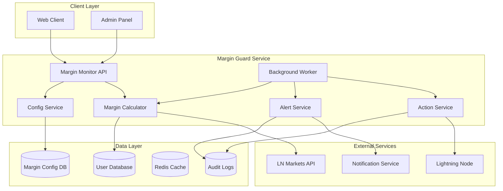
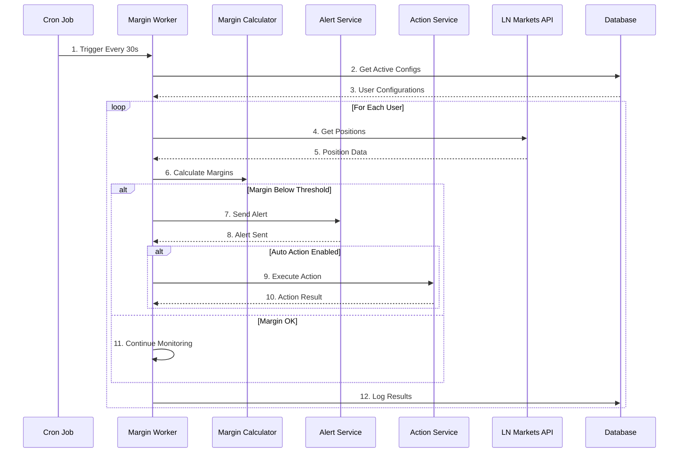
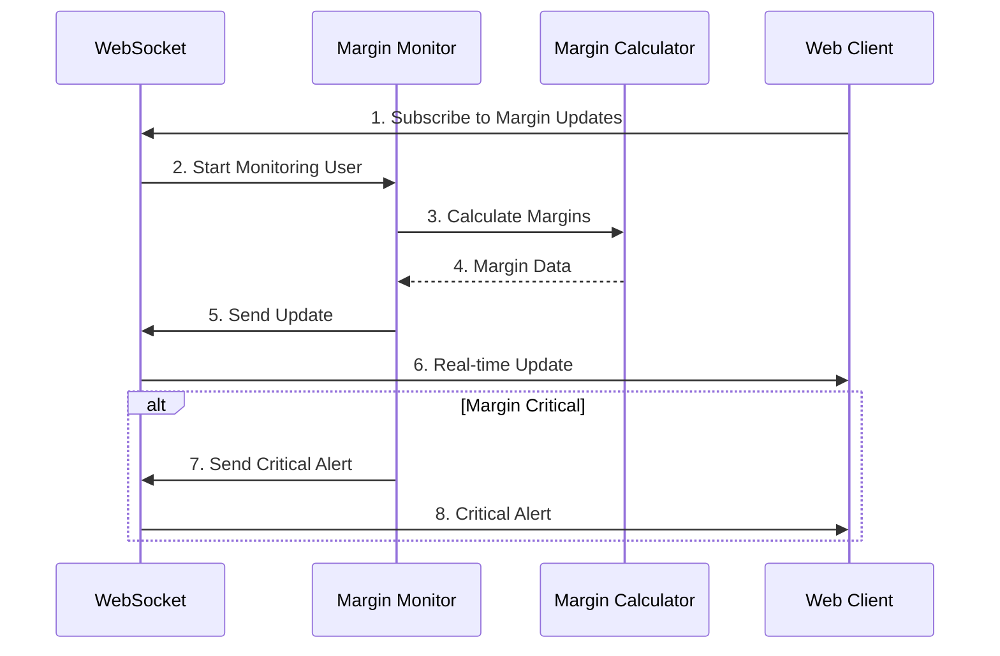

# Margin Guard Service - Microservice Architecture

> **Status**: Active  
> **Última Atualização**: 2025-01-26  
> **Versão**: 1.0.0  
> **Responsável**: Axisor Margin Guard System  

## Índice

- [Visão Geral](#visão-geral)
- [Arquitetura do Serviço](#arquitetura-do-serviço)
- [Componentes Principais](#componentes-principais)
- [Fluxo de Monitoramento](#fluxo-de-monitoramento)
- [Configuração](#configuração)
- [Performance](#performance)
- [Segurança](#segurança)
- [Monitoramento](#monitoramento)
- [Referências](#referências)

## Visão Geral

O Margin Guard Service é responsável por monitorar automaticamente as margens dos usuários e executar ações preventivas para evitar liquidações. Ele implementa monitoramento em tempo real, alertas inteligentes e ações automatizadas.

## Arquitetura do Serviço

### Diagrama de Arquitetura



## Componentes Principais

### Margin Calculator

**Localização**: `backend/src/services/margin-guard/margin-calculator.service.ts`

```typescript
class MarginCalculatorService {
  async calculateMarginDistance(position: Position, currentPrice: number): Promise<MarginDistance> {
    const {
      entryPrice,
      size,
      side,
      margin,
      leverage
    } = position;

    // Calcular PnL atual
    const pnl = this.calculatePnL(entryPrice, currentPrice, size, side);
    
    // Calcular margem atual
    const currentMargin = margin + pnl;
    
    // Calcular distância para liquidação
    const liquidationPrice = this.calculateLiquidationPrice(entryPrice, leverage, side);
    const distanceToLiquidation = Math.abs(currentPrice - liquidationPrice);
    
    // Calcular distância em porcentagem
    const distancePercentage = (distanceToLiquidation / currentPrice) * 100;
    
    return {
      currentMargin,
      pnl,
      liquidationPrice,
      distanceToLiquidation,
      distancePercentage,
      isAtRisk: distancePercentage < 10 // 10% threshold
    };
  }

  private calculatePnL(entryPrice: number, currentPrice: number, size: number, side: string): number {
    if (side === 'long') {
      return (currentPrice - entryPrice) * size;
    } else {
      return (entryPrice - currentPrice) * size;
    }
  }

  private calculateLiquidationPrice(entryPrice: number, leverage: number, side: string): number {
    if (side === 'long') {
      return entryPrice * (1 - 1 / leverage);
    } else {
      return entryPrice * (1 + 1 / leverage);
    }
  }
}
```

### Alert Service

**Localização**: `backend/src/services/margin-guard/alert.service.ts`

```typescript
class MarginAlertService {
  async checkAndSendAlerts(userId: string, positions: Position[]): Promise<void> {
    const config = await this.getUserConfig(userId);
    
    for (const position of positions) {
      const marginData = await this.calculateMarginDistance(position);
      
      if (marginData.isAtRisk) {
        await this.sendMarginAlert(userId, position, marginData, config);
      }
    }
  }

  private async sendMarginAlert(
    userId: string, 
    position: Position, 
    marginData: MarginDistance,
    config: MarginGuardConfig
  ): Promise<void> {
    const alert = {
      userId,
      positionId: position.id,
      type: 'MARGIN_RISK',
      severity: this.getSeverityLevel(marginData.distancePercentage),
      message: this.generateAlertMessage(position, marginData),
      data: marginData,
      timestamp: new Date()
    };

    // Enviar para diferentes canais baseado na configuração
    if (config.notifications?.email) {
      await this.emailService.sendMarginAlert(userId, alert);
    }
    
    if (config.notifications?.telegram) {
      await this.telegramService.sendMarginAlert(userId, alert);
    }
    
    if (config.notifications?.push) {
      await this.pushService.sendMarginAlert(userId, alert);
    }

    // Log da alerta
    await this.auditService.logMarginAlert(alert);
  }

  private getSeverityLevel(distancePercentage: number): string {
    if (distancePercentage < 2) return 'CRITICAL';
    if (distancePercentage < 5) return 'HIGH';
    if (distancePercentage < 10) return 'MEDIUM';
    return 'LOW';
  }
}
```

### Action Service

**Localização**: `backend/src/services/margin-guard/action.service.ts`

```typescript
class MarginActionService {
  async executeMarginAction(
    userId: string, 
    action: MarginAction, 
    amount: number
  ): Promise<ActionResult> {
    try {
      switch (action.type) {
        case 'ADD_MARGIN':
          return await this.addMargin(userId, amount);
        
        case 'CLOSE_POSITION':
          return await this.closePosition(userId, action.positionId);
        
        case 'REDUCE_SIZE':
          return await this.reducePositionSize(userId, action.positionId, amount);
        
        default:
          throw new Error(`Unknown action type: ${action.type}`);
      }
    } catch (error) {
      await this.auditService.logActionFailure(userId, action, error);
      throw error;
    }
  }

  private async addMargin(userId: string, amountSats: number): Promise<ActionResult> {
    // Criar invoice Lightning
    const invoice = await this.lndService.createInvoice({
      amount: amountSats,
      memo: `Margin Guard - Add ${amountSats} sats`,
      expiry: 3600 // 1 hour
    });

    // Monitorar pagamento
    const paymentResult = await this.monitorPayment(invoice.payment_hash);
    
    if (paymentResult.paid) {
      // Adicionar margem na LN Markets
      await this.lnMarketsService.addMargin(userId, amountSats);
      
      return {
        success: true,
        action: 'ADD_MARGIN',
        amount: amountSats,
        invoice: invoice.payment_request,
        transactionHash: paymentResult.txHash
      };
    }

    throw new Error('Payment not completed within timeout');
  }

  private async closePosition(userId: string, positionId: string): Promise<ActionResult> {
    const position = await this.lnMarketsService.getPosition(positionId);
    
    if (!position) {
      throw new Error('Position not found');
    }

    const closeResult = await this.lnMarketsService.closePosition(positionId);
    
    return {
      success: true,
      action: 'CLOSE_POSITION',
      positionId,
      closePrice: closeResult.price,
      pnl: closeResult.pnl
    };
  }
}
```

## Fluxo de Monitoramento

### Background Worker



### Real-time Monitoring



## Configuração

### User Configuration

```typescript
interface MarginGuardConfig {
  userId: string;
  isActive: boolean;
  mode: 'global' | 'individual' | 'unit';
  marginThreshold: number; // percentage
  autoActions: {
    enabled: boolean;
    addMargin: boolean;
    closePosition: boolean;
    reduceSize: boolean;
  };
  notifications: {
    email: boolean;
    telegram: boolean;
    push: boolean;
    inApp: boolean;
  };
  selectedPositions: string[]; // for unit mode
  individualConfigs: Record<string, PositionConfig>;
}

interface PositionConfig {
  positionId: string;
  enabled: boolean;
  threshold: number;
  autoActions: AutoActionConfig;
}
```

### Service Configuration

```typescript
const marginGuardConfig = {
  monitoring: {
    interval: 30000, // 30 seconds
    batchSize: 50,
    concurrency: 5
  },
  thresholds: {
    critical: 2,    // 2%
    high: 5,        // 5%
    medium: 10,     // 10%
    low: 15         // 15%
  },
  actions: {
    addMargin: {
      enabled: true,
      minAmount: 1000, // 1000 sats
      maxAmount: 100000 // 100k sats
    },
    closePosition: {
      enabled: true,
      confirmRequired: true
    },
    reduceSize: {
      enabled: true,
      minReduction: 0.1, // 10%
      maxReduction: 0.5  // 50%
    }
  },
  notifications: {
    cooldown: 300000, // 5 minutes between alerts
    maxAlertsPerHour: 10
  }
};
```

## Performance

### Caching Strategy

```typescript
class MarginCacheService {
  private redis: Redis;
  private ttl = 30; // 30 seconds

  async cacheMarginData(userId: string, data: MarginData): Promise<void> {
    const key = `margin:${userId}`;
    await this.redis.setex(key, this.ttl, JSON.stringify(data));
  }

  async getCachedMarginData(userId: string): Promise<MarginData | null> {
    const key = `margin:${userId}`;
    const data = await this.redis.get(key);
    return data ? JSON.parse(data) : null;
  }

  async invalidateMarginData(userId: string): Promise<void> {
    const key = `margin:${userId}`;
    await this.redis.del(key);
  }
}
```

### Batch Processing

```typescript
class BatchMarginProcessor {
  async processBatch(users: string[]): Promise<void> {
    const batches = this.chunkArray(users, 10); // Process 10 users at a time
    
    for (const batch of batches) {
      await Promise.all(
        batch.map(userId => this.processUserMargin(userId))
      );
      
      // Rate limiting between batches
      await this.sleep(100);
    }
  }

  private chunkArray<T>(array: T[], size: number): T[][] {
    const chunks: T[][] = [];
    for (let i = 0; i < array.length; i += size) {
      chunks.push(array.slice(i, i + size));
    }
    return chunks;
  }
}
```

## Segurança

### Access Control

```typescript
class MarginGuardSecurity {
  async validateUserAccess(userId: string, action: string): Promise<boolean> {
    const user = await this.userService.getUser(userId);
    
    if (!user || !user.is_active) {
      return false;
    }

    // Verificar se o usuário tem plano adequado
    if (action === 'AUTO_ACTIONS' && user.plan_type === 'free') {
      return false;
    }

    // Verificar rate limiting
    const rateLimitKey = `margin_guard:${userId}:${action}`;
    const attempts = await this.redis.incr(rateLimitKey);
    
    if (attempts === 1) {
      await this.redis.expire(rateLimitKey, 3600); // 1 hour
    }
    
    return attempts <= 100; // Max 100 actions per hour
  }
}
```

### Audit Logging

```typescript
class MarginAuditService {
  async logMarginAction(action: MarginAction): Promise<void> {
    await this.prisma.auditLog.create({
      data: {
        user_id: action.userId,
        action: action.type,
        resource: 'margin_guard',
        details: {
          positionId: action.positionId,
          amount: action.amount,
          threshold: action.threshold,
          timestamp: new Date().toISOString()
        }
      }
    });
  }
}
```

## Monitoramento

### Metrics

```typescript
class MarginGuardMetrics {
  private marginAlerts = new Counter({
    name: 'margin_guard_alerts_total',
    help: 'Total margin guard alerts sent',
    labelNames: ['severity', 'user_plan']
  });

  private marginActions = new Counter({
    name: 'margin_guard_actions_total',
    help: 'Total margin guard actions executed',
    labelNames: ['action_type', 'success']
  });

  private marginCalculationDuration = new Histogram({
    name: 'margin_guard_calculation_duration_seconds',
    help: 'Duration of margin calculations',
    labelNames: ['user_plan']
  });

  async recordMarginAlert(severity: string, userPlan: string): Promise<void> {
    this.marginAlerts.inc({ severity, user_plan: userPlan });
  }

  async recordMarginAction(actionType: string, success: boolean): Promise<void> {
    this.marginActions.inc({ action_type: actionType, success: success.toString() });
  }

  async recordCalculationDuration(duration: number, userPlan: string): Promise<void> {
    this.marginCalculationDuration.observe({ user_plan: userPlan }, duration);
  }
}
```

## Referências

- [Margin Guard Complete Guide](../../../GUIA-MARGIN-GUARD-COMPLETO.md)
- [Database Schema](../../../backend/prisma/schema.prisma)
- [Margin Guard Routes](../../../backend/src/routes/margin-guard.routes.ts)
- [Margin Guard Worker](../../../backend/src/workers/margin-monitor.ts)

## Como Usar Este Documento

• **Para Desenvolvedores**: Use como referência para implementar melhorias no sistema de monitoramento de margem.

• **Para DevOps**: Utilize para configurar e monitorar o serviço de Margin Guard em produção.

• **Para Administradores**: Use para entender como configurar e gerenciar o sistema de proteção de margem.
