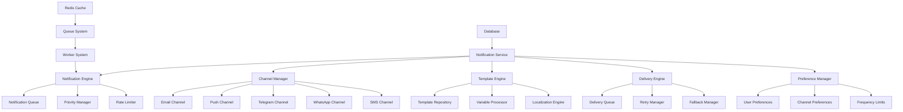

# Notification Service - Microservices

> **Status**: Active  
> **Última Atualização**: 2025-01-26  
> **Versão**: 1.0.0  
> **Responsável**: Axisor Notification Team  

## Índice

- [Visão Geral](#visão-geral)
- [Notification Engine Architecture](#notification-engine-architecture)
- [Notification Types](#notification-types)
- [Channel Management](#channel-management)
- [Template System](#template-system)
- [Delivery Engine](#delivery-engine)
- [Worker Integration](#worker-integration)
- [User Preferences](#user-preferences)
- [Error Handling](#error-handling)
- [Troubleshooting](#troubleshooting)
- [Referências](#referências)

## Visão Geral

O Notification Service é responsável por gerenciar e entregar notificações através de múltiplos canais (email, push, Telegram, WhatsApp, SMS). O serviço implementa um sistema flexível de templates, preferências de usuário, e entrega assíncrona com retry automático e fallback entre canais.

## Notification Engine Architecture

### Service Architecture Overview



### Core Components

```typescript
// Notification Service Core
class NotificationService {
  private prisma: PrismaClient;
  private redis: Redis;
  private logger: Logger;
  private notificationEngine: NotificationEngine;
  private channelManager: ChannelManager;
  private templateEngine: TemplateEngine;
  private deliveryEngine: DeliveryEngine;
  private preferenceManager: PreferenceManager;
  private workerManager: WorkerManager;
  private queue: Queue;

  constructor(config: NotificationServiceConfig) {
    this.prisma = config.prisma;
    this.redis = config.redis;
    this.logger = config.logger;
    
    // Initialize core components
    this.notificationEngine = new NotificationEngine(this.prisma, this.logger);
    this.channelManager = new ChannelManager(this.logger);
    this.templateEngine = new TemplateEngine(this.prisma, this.logger);
    this.deliveryEngine = new DeliveryEngine(this.redis, this.logger);
    this.preferenceManager = new PreferenceManager(this.prisma, this.logger);
    this.workerManager = new WorkerManager(config.workerConfig);
    
    // Initialize queue
    this.queue = new Queue('notification-processing', {
      connection: this.redis
    });
  }

  async initialize(): Promise<void> {
    this.logger.info('🚀 Initializing Notification Service');
    
    await Promise.all([
      this.notificationEngine.initialize(),
      this.channelManager.initialize(),
      this.templateEngine.initialize(),
      this.deliveryEngine.initialize(),
      this.preferenceManager.initialize(),
      this.workerManager.start()
    ]);
    
    // Setup queue processing
    this.setupQueueProcessing();
    
    this.logger.info('✅ Notification Service initialized successfully');
  }

  private setupQueueProcessing(): void {
    this.queue.process('process-notification', async (job) => {
      const { notificationId } = job.data;
      return this.processNotification(notificationId);
    });
    
    this.queue.process('deliver-notification', async (job) => {
      const { deliveryId } = job.data;
      return this.deliverNotification(deliveryId);
    });
  }
}
```

## Notification Types

### Core Notification Types

```typescript
interface Notification {
  id: string;
  user_id: string;
  type: NotificationType;
  priority: NotificationPriority;
  channels: NotificationChannel[];
  template_id: string;
  variables: Record<string, any>;
  metadata: NotificationMetadata;
  status: NotificationStatus;
  created_at: Date;
  updated_at: Date;
  scheduled_at?: Date;
  expires_at?: Date;
}

enum NotificationType {
  // Trading notifications
  TRADE_OPENED = 'TRADE_OPENED',
  TRADE_CLOSED = 'TRADE_CLOSED',
  POSITION_UPDATE = 'POSITION_UPDATE',
  MARGIN_CALL = 'MARGIN_CALL',
  MARGIN_ALERT = 'MARGIN_ALERT',
  
  // Automation notifications
  AUTOMATION_TRIGGERED = 'AUTOMATION_TRIGGERED',
  AUTOMATION_EXECUTED = 'AUTOMATION_EXECUTED',
  AUTOMATION_FAILED = 'AUTOMATION_FAILED',
  
  // System notifications
  SYSTEM_MAINTENANCE = 'SYSTEM_MAINTENANCE',
  SYSTEM_UPDATE = 'SYSTEM_UPDATE',
  SECURITY_ALERT = 'SECURITY_ALERT',
  
  // Account notifications
  ACCOUNT_VERIFIED = 'ACCOUNT_VERIFIED',
  PAYMENT_RECEIVED = 'PAYMENT_RECEIVED',
  PLAN_UPGRADED = 'PLAN_UPGRADED',
  PLAN_EXPIRING = 'PLAN_EXPIRING',
  
  // Custom notifications
  CUSTOM_MESSAGE = 'CUSTOM_MESSAGE',
  MARKET_ALERT = 'MARKET_ALERT',
  NEWS_UPDATE = 'NEWS_UPDATE'
}

enum NotificationPriority {
  LOW = 'LOW',
  NORMAL = 'NORMAL',
  HIGH = 'HIGH',
  URGENT = 'URGENT',
  CRITICAL = 'CRITICAL'
}

enum NotificationChannel {
  EMAIL = 'EMAIL',
  PUSH = 'PUSH',
  TELEGRAM = 'TELEGRAM',
  WHATSAPP = 'WHATSAPP',
  SMS = 'SMS',
  IN_APP = 'IN_APP'
}
```

### Notification Factory

```typescript
class NotificationFactory {
  private templateEngine: TemplateEngine;
  private preferenceManager: PreferenceManager;
  private logger: Logger;

  async createNotification(
    userId: string,
    type: NotificationType,
    variables: Record<string, any>,
    options: NotificationOptions = {}
  ): Promise<Notification> {
    this.logger.info('Creating notification', { userId, type, variables });

    // Get user preferences
    const preferences = await this.preferenceManager.getUserPreferences(userId);
    
    // Determine channels based on type and preferences
    const channels = this.determineChannels(type, preferences, options.channels);
    
    // Get template
    const template = await this.templateEngine.getTemplate(type, preferences.language);
    
    // Determine priority
    const priority = this.determinePriority(type, options.priority);
    
    // Create notification
    const notification: Notification = {
      id: this.generateId(),
      user_id: userId,
      type,
      priority,
      channels,
      template_id: template.id,
      variables,
      metadata: {
        source: options.source || 'SYSTEM',
        category: this.getCategory(type),
        tags: this.getTags(type),
        ...options.metadata
      },
      status: 'PENDING',
      created_at: new Date(),
      updated_at: new Date(),
      scheduled_at: options.scheduledAt,
      expires_at: options.expiresAt
    };

    // Save notification
    await this.saveNotification(notification);
    
    // Queue for processing
    await this.queueNotification(notification);
    
    return notification;
  }

  private determineChannels(
    type: NotificationType,
    preferences: UserPreferences,
    overrideChannels?: NotificationChannel[]
  ): NotificationChannel[] {
    if (overrideChannels) {
      return overrideChannels;
    }

    const channels: NotificationChannel[] = [];
    
    // Check user preferences for this notification type
    const typePreferences = preferences.notification_preferences[type];
    
    if (typePreferences?.email_enabled) {
      channels.push(NotificationChannel.EMAIL);
    }
    
    if (typePreferences?.push_enabled) {
      channels.push(NotificationChannel.PUSH);
    }
    
    if (typePreferences?.telegram_enabled && preferences.telegram_chat_id) {
      channels.push(NotificationChannel.TELEGRAM);
    }
    
    if (typePreferences?.whatsapp_enabled && preferences.whatsapp_phone) {
      channels.push(NotificationChannel.WHATSAPP);
    }
    
    if (typePreferences?.sms_enabled && preferences.phone) {
      channels.push(NotificationChannel.SMS);
    }
    
    // Always include in-app notifications for important types
    if (this.isImportantType(type)) {
      channels.push(NotificationChannel.IN_APP);
    }
    
    return channels;
  }

  private determinePriority(
    type: NotificationType,
    overridePriority?: NotificationPriority
  ): NotificationPriority {
    if (overridePriority) {
      return overridePriority;
    }

    const priorityMap: Record<NotificationType, NotificationPriority> = {
      [NotificationType.MARGIN_CALL]: NotificationPriority.CRITICAL,
      [NotificationType.SECURITY_ALERT]: NotificationPriority.CRITICAL,
      [NotificationType.AUTOMATION_FAILED]: NotificationPriority.HIGH,
      [NotificationType.MARGIN_ALERT]: NotificationPriority.HIGH,
      [NotificationType.TRADE_OPENED]: NotificationPriority.NORMAL,
      [NotificationType.TRADE_CLOSED]: NotificationPriority.NORMAL,
      [NotificationType.AUTOMATION_EXECUTED]: NotificationPriority.NORMAL,
      [NotificationType.SYSTEM_MAINTENANCE]: NotificationPriority.NORMAL,
      [NotificationType.ACCOUNT_VERIFIED]: NotificationPriority.LOW,
      [NotificationType.PAYMENT_RECEIVED]: NotificationPriority.LOW,
      [NotificationType.PLAN_UPGRADED]: NotificationPriority.LOW,
      [NotificationType.PLAN_EXPIRING]: NotificationPriority.LOW,
      [NotificationType.CUSTOM_MESSAGE]: NotificationPriority.NORMAL,
      [NotificationType.MARKET_ALERT]: NotificationPriority.NORMAL,
      [NotificationType.NEWS_UPDATE]: NotificationPriority.LOW,
      [NotificationType.POSITION_UPDATE]: NotificationPriority.LOW,
      [NotificationType.AUTOMATION_TRIGGERED]: NotificationPriority.NORMAL,
      [NotificationType.SYSTEM_UPDATE]: NotificationPriority.NORMAL
    };

    return priorityMap[type] || NotificationPriority.NORMAL;
  }

  private isImportantType(type: NotificationType): boolean {
    const importantTypes = [
      NotificationType.MARGIN_CALL,
      NotificationType.SECURITY_ALERT,
      NotificationType.AUTOMATION_FAILED,
      NotificationType.MARGIN_ALERT
    ];
    
    return importantTypes.includes(type);
  }
}
```

### Specific Notification Handlers

```typescript
// Margin Alert Notification
class MarginAlertNotificationHandler {
  async createMarginAlert(
    userId: string,
    marginLevel: number,
    alertType: 'WARNING' | 'CRITICAL'
  ): Promise<Notification> {
    const priority = alertType === 'CRITICAL' 
      ? NotificationPriority.CRITICAL 
      : NotificationPriority.HIGH;

    const variables = {
      margin_level: marginLevel,
      alert_type: alertType,
      percentage: (marginLevel * 100).toFixed(2),
      timestamp: new Date().toISOString()
    };

    return this.notificationFactory.createNotification(
      userId,
      NotificationType.MARGIN_ALERT,
      variables,
      {
        priority,
        source: 'MARGIN_GUARD',
        channels: this.getUrgentChannels(alertType)
      }
    );
  }

  private getUrgentChannels(alertType: 'WARNING' | 'CRITICAL'): NotificationChannel[] {
    const baseChannels = [NotificationChannel.IN_APP, NotificationChannel.PUSH];
    
    if (alertType === 'CRITICAL') {
      baseChannels.push(NotificationChannel.EMAIL, NotificationChannel.TELEGRAM);
    }
    
    return baseChannels;
  }
}

// Trade Notification Handler
class TradeNotificationHandler {
  async createTradeOpened(
    userId: string,
    position: Position,
    tradeDetails: TradeDetails
  ): Promise<Notification> {
    const variables = {
      position_type: position.type,
      size: position.size,
      entry_price: position.entry_price,
      leverage: position.leverage,
      symbol: position.symbol,
      timestamp: position.created_at.toISOString(),
      estimated_value: position.size * position.entry_price
    };

    return this.notificationFactory.createNotification(
      userId,
      NotificationType.TRADE_OPENED,
      variables,
      {
        priority: NotificationPriority.NORMAL,
        source: 'TRADING_SYSTEM'
      }
    );
  }

  async createTradeClosed(
    userId: string,
    position: Position,
    tradeResult: TradeResult
  ): Promise<Notification> {
    const variables = {
      position_type: position.type,
      size: position.size,
      entry_price: position.entry_price,
      exit_price: tradeResult.exit_price,
      pnl: tradeResult.pnl,
      pnl_percentage: tradeResult.pnl_percentage,
      symbol: position.symbol,
      duration: this.calculateDuration(position.created_at, new Date()),
      timestamp: new Date().toISOString()
    };

    return this.notificationFactory.createNotification(
      userId,
      NotificationType.TRADE_CLOSED,
      variables,
      {
        priority: NotificationPriority.NORMAL,
        source: 'TRADING_SYSTEM'
      }
    );
  }

  private calculateDuration(startTime: Date, endTime: Date): string {
    const diffMs = endTime.getTime() - startTime.getTime();
    const diffHours = Math.floor(diffMs / (1000 * 60 * 60));
    const diffMinutes = Math.floor((diffMs % (1000 * 60 * 60)) / (1000 * 60));
    
    if (diffHours > 0) {
      return `${diffHours}h ${diffMinutes}m`;
    }
    
    return `${diffMinutes}m`;
  }
}
```

## Channel Management

### Channel Manager Implementation

```typescript
class ChannelManager {
  private channels: Map<NotificationChannel, NotificationChannelHandler> = new Map();
  private logger: Logger;

  async initialize(): Promise<void> {
    this.logger.info('Initializing notification channels');
    
    // Initialize all channels
    this.channels.set(NotificationChannel.EMAIL, new EmailChannelHandler());
    this.channels.set(NotificationChannel.PUSH, new PushChannelHandler());
    this.channels.set(NotificationChannel.TELEGRAM, new TelegramChannelHandler());
    this.channels.set(NotificationChannel.WHATSAPP, new WhatsAppChannelHandler());
    this.channels.set(NotificationChannel.SMS, new SMSChannelHandler());
    this.channels.set(NotificationChannel.IN_APP, new InAppChannelHandler());
    
    // Initialize each channel
    for (const [channel, handler] of this.channels) {
      try {
        await handler.initialize();
        this.logger.info(`Channel initialized: ${channel}`);
      } catch (error) {
        this.logger.error(`Failed to initialize channel ${channel}:`, error);
      }
    }
  }

  async sendNotification(
    notification: Notification,
    channel: NotificationChannel,
    content: NotificationContent
  ): Promise<DeliveryResult> {
    const handler = this.channels.get(channel);
    
    if (!handler) {
      throw new Error(`Channel handler not found: ${channel}`);
    }

    try {
      this.logger.info(`Sending notification via ${channel}`, {
        notificationId: notification.id,
        userId: notification.user_id
      });

      const result = await handler.send(notification, content);
      
      this.logger.info(`Notification sent successfully via ${channel}`, {
        notificationId: notification.id,
        deliveryId: result.deliveryId
      });

      return result;
      
    } catch (error) {
      this.logger.error(`Failed to send notification via ${channel}:`, {
        notificationId: notification.id,
        error: error.message
      });
      
      throw error;
    }
  }

  async getChannelStatus(channel: NotificationChannel): Promise<ChannelStatus> {
    const handler = this.channels.get(channel);
    
    if (!handler) {
      return { status: 'DISABLED', error: 'Handler not found' };
    }

    try {
      return await handler.getStatus();
    } catch (error) {
      return { status: 'ERROR', error: error.message };
    }
  }
}
```

### Email Channel Handler

```typescript
class EmailChannelHandler implements NotificationChannelHandler {
  private emailService: EmailService;
  private logger: Logger;

  async initialize(): Promise<void> {
    this.emailService = new EmailService({
      host: process.env.SMTP_HOST,
      port: parseInt(process.env.SMTP_PORT || '587'),
      secure: process.env.SMTP_SECURE === 'true',
      auth: {
        user: process.env.SMTP_USER,
        pass: process.env.SMTP_PASS
      }
    });
    
    await this.emailService.verify();
  }

  async send(notification: Notification, content: NotificationContent): Promise<DeliveryResult> {
    const deliveryId = this.generateId();
    
    try {
      // Get user email
      const user = await this.getUser(notification.user_id);
      if (!user.email) {
        throw new Error('User email not found');
      }

      // Prepare email
      const emailData = {
        to: user.email,
        subject: content.subject,
        html: content.html,
        text: content.text,
        attachments: content.attachments || []
      };

      // Send email
      const result = await this.emailService.send(emailData);
      
      // Log delivery
      await this.logDelivery(deliveryId, notification, 'EMAIL', 'SENT', result);
      
      return {
        deliveryId,
        status: 'SENT',
        channel: 'EMAIL',
        sentAt: new Date(),
        messageId: result.messageId
      };
      
    } catch (error) {
      // Log failed delivery
      await this.logDelivery(deliveryId, notification, 'EMAIL', 'FAILED', error);
      
      throw error;
    }
  }

  async getStatus(): Promise<ChannelStatus> {
    try {
      await this.emailService.verify();
      return { status: 'ACTIVE', lastChecked: new Date() };
    } catch (error) {
      return { status: 'ERROR', error: error.message };
    }
  }
}
```

### Telegram Channel Handler

```typescript
class TelegramChannelHandler implements NotificationChannelHandler {
  private bot: TelegramBot;
  private logger: Logger;

  async initialize(): Promise<void> {
    const botToken = process.env.TELEGRAM_BOT_TOKEN;
    
    if (!botToken) {
      throw new Error('Telegram bot token not configured');
    }

    this.bot = new TelegramBot(botToken, { polling: false });
    
    // Test bot connection
    const me = await this.bot.getMe();
    this.logger.info(`Telegram bot initialized: @${me.username}`);
  }

  async send(notification: Notification, content: NotificationContent): Promise<DeliveryResult> {
    const deliveryId = this.generateId();
    
    try {
      // Get user Telegram chat ID
      const user = await this.getUser(notification.user_id);
      if (!user.telegram_chat_id) {
        throw new Error('User Telegram chat ID not found');
      }

      // Format message for Telegram
      const message = this.formatTelegramMessage(content);
      
      // Send message
      const result = await this.bot.sendMessage(user.telegram_chat_id, message, {
        parse_mode: 'HTML',
        disable_web_page_preview: true
      });
      
      // Log delivery
      await this.logDelivery(deliveryId, notification, 'TELEGRAM', 'SENT', result);
      
      return {
        deliveryId,
        status: 'SENT',
        channel: 'TELEGRAM',
        sentAt: new Date(),
        messageId: result.message_id.toString()
      };
      
    } catch (error) {
      // Log failed delivery
      await this.logDelivery(deliveryId, notification, 'TELEGRAM', 'FAILED', error);
      
      throw error;
    }
  }

  private formatTelegramMessage(content: NotificationContent): string {
    let message = '';
    
    if (content.subject) {
      message += `<b>${content.subject}</b>\n\n`;
    }
    
    if (content.text) {
      // Convert HTML to Telegram formatting
      message += content.text
        .replace(/<strong>(.*?)<\/strong>/g, '<b>$1</b>')
        .replace(/<em>(.*?)<\/em>/g, '<i>$1</i>')
        .replace(/<br\s*\/?>/g, '\n')
        .replace(/<[^>]*>/g, ''); // Remove remaining HTML tags
    }
    
    return message;
  }
}
```

## Template System

### Template Engine

```typescript
class TemplateEngine {
  private templates: Map<string, NotificationTemplate> = new Map();
  private prisma: PrismaClient;
  private logger: Logger;

  async initialize(): Promise<void> {
    this.logger.info('Loading notification templates');
    
    // Load templates from database
    const templates = await this.prisma.notificationTemplate.findMany({
      include: {
        localizations: true
      }
    });
    
    for (const template of templates) {
      this.templates.set(template.id, template);
    }
    
    this.logger.info(`Loaded ${templates.length} notification templates`);
  }

  async getTemplate(
    type: NotificationType,
    language: string = 'en-US'
  ): Promise<NotificationTemplate> {
    const templateKey = `${type}_${language}`;
    let template = this.templates.get(templateKey);
    
    if (!template) {
      // Fallback to default language
      template = this.templates.get(`${type}_en-US`);
    }
    
    if (!template) {
      throw new Error(`Template not found for type: ${type}`);
    }
    
    return template;
  }

  async processTemplate(
    template: NotificationTemplate,
    variables: Record<string, any>,
    channel: NotificationChannel
  ): Promise<NotificationContent> {
    let content = template.content;
    
    // Process variables
    for (const [key, value] of Object.entries(variables)) {
      const placeholder = `{{${key}}}`;
      content = content.replace(new RegExp(placeholder, 'g'), String(value));
    }
    
    // Process conditional blocks
    content = this.processConditionalBlocks(content, variables);
    
    // Format for specific channel
    const formattedContent = this.formatForChannel(content, channel);
    
    return {
      subject: template.subject,
      text: formattedContent.text,
      html: formattedContent.html
    };
  }

  private processConditionalBlocks(content: string, variables: Record<string, any>): string {
    // Process {{#if variable}}...{{/if}} blocks
    return content.replace(/\{\{#if\s+(\w+)\}\}(.*?)\{\{\/if\}\}/gs, (match, variable, block) => {
      if (variables[variable]) {
        return block;
      }
      return '';
    });
  }

  private formatForChannel(content: string, channel: NotificationChannel): { text: string; html: string } {
    switch (channel) {
      case NotificationChannel.EMAIL:
        return {
          text: this.stripHtml(content),
          html: content
        };
        
      case NotificationChannel.PUSH:
        return {
          text: this.stripHtml(content),
          html: this.stripHtml(content)
        };
        
      case NotificationChannel.TELEGRAM:
        return {
          text: this.formatForTelegram(content),
          html: this.formatForTelegram(content)
        };
        
      case NotificationChannel.WHATSAPP:
        return {
          text: this.stripHtml(content),
          html: this.stripHtml(content)
        };
        
      case NotificationChannel.SMS:
        return {
          text: this.stripHtml(content).substring(0, 160),
          html: this.stripHtml(content).substring(0, 160)
        };
        
      default:
        return {
          text: this.stripHtml(content),
          html: content
        };
    }
  }

  private stripHtml(html: string): string {
    return html.replace(/<[^>]*>/g, '');
  }

  private formatForTelegram(content: string): string {
    return content
      .replace(/<strong>(.*?)<\/strong>/g, '<b>$1</b>')
      .replace(/<em>(.*?)<\/em>/g, '<i>$1</i>')
      .replace(/<br\s*\/?>/g, '\n')
      .replace(/<[^>]*>/g, '');
  }
}
```

## Delivery Engine

### Delivery Queue Management

```typescript
class DeliveryEngine {
  private deliveryQueue: Queue;
  private retryManager: RetryManager;
  private fallbackManager: FallbackManager;
  private logger: Logger;

  async initialize(): Promise<void> {
    this.logger.info('Initializing delivery engine');
    
    // Initialize delivery queue
    this.deliveryQueue = new Queue('notification-delivery', {
      connection: this.redis,
      defaultJobOptions: {
        removeOnComplete: 100,
        removeOnFail: 50,
        attempts: 3,
        backoff: {
          type: 'exponential',
          delay: 2000
        }
      }
    });
    
    // Initialize retry and fallback managers
    this.retryManager = new RetryManager(this.logger);
    this.fallbackManager = new FallbackManager(this.logger);
    
    // Setup queue processing
    this.setupDeliveryProcessing();
    
    this.logger.info('Delivery engine initialized');
  }

  private setupDeliveryProcessing(): void {
    // Process delivery jobs
    this.deliveryQueue.process('deliver', 10, async (job) => {
      return this.processDeliveryJob(job);
    });
    
    // Process retry jobs
    this.deliveryQueue.process('retry', 5, async (job) => {
      return this.processRetryJob(job);
    });
  }

  async queueDelivery(
    notification: Notification,
    channel: NotificationChannel,
    content: NotificationContent
  ): Promise<string> {
    const deliveryId = this.generateId();
    
    const job = await this.deliveryQueue.add('deliver', {
      deliveryId,
      notificationId: notification.id,
      userId: notification.user_id,
      channel,
      content,
      priority: notification.priority,
      scheduledAt: notification.scheduled_at
    }, {
      priority: this.getJobPriority(notification.priority),
      delay: notification.scheduled_at ? 
        notification.scheduled_at.getTime() - Date.now() : 0
    });
    
    this.logger.info('Delivery queued', {
      deliveryId,
      notificationId: notification.id,
      channel,
      jobId: job.id
    });
    
    return deliveryId;
  }

  private getJobPriority(priority: NotificationPriority): number {
    const priorityMap = {
      [NotificationPriority.LOW]: 1,
      [NotificationPriority.NORMAL]: 5,
      [NotificationPriority.HIGH]: 10,
      [NotificationPriority.URGENT]: 15,
      [NotificationPriority.CRITICAL]: 20
    };
    
    return priorityMap[priority] || 5;
  }

  private async processDeliveryJob(job: Job): Promise<void> {
    const { deliveryId, notificationId, userId, channel, content } = job.data;
    
    this.logger.info('Processing delivery job', {
      deliveryId,
      notificationId,
      jobId: job.id
    });
    
    try {
      // Send notification
      const result = await this.channelManager.sendNotification(
        { id: notificationId, user_id: userId } as Notification,
        channel,
        content
      );
      
      // Update delivery status
      await this.updateDeliveryStatus(deliveryId, 'SENT', result);
      
      this.logger.info('Delivery completed successfully', {
        deliveryId,
        result
      });
      
    } catch (error) {
      this.logger.error('Delivery failed', {
        deliveryId,
        error: error.message
      });
      
      // Handle retry or fallback
      await this.handleDeliveryFailure(deliveryId, channel, error);
      
      throw error;
    }
  }

  private async handleDeliveryFailure(
    deliveryId: string,
    channel: NotificationChannel,
    error: Error
  ): Promise<void> {
    // Check if we should retry
    if (this.shouldRetry(error)) {
      await this.scheduleRetry(deliveryId, channel);
    } else {
      // Try fallback channel
      await this.tryFallbackChannel(deliveryId, channel);
    }
  }

  private shouldRetry(error: Error): boolean {
    // Retry on network errors, temporary failures
    const retryableErrors = [
      'ECONNRESET',
      'ETIMEDOUT',
      'ENOTFOUND',
      'temporary failure',
      'rate limit'
    ];
    
    const errorMessage = error.message.toLowerCase();
    return retryableErrors.some(retryableError => 
      errorMessage.includes(retryableError)
    );
  }

  private async tryFallbackChannel(
    deliveryId: string,
    failedChannel: NotificationChannel
  ): Promise<void> {
    const fallbackChannel = this.getFallbackChannel(failedChannel);
    
    if (fallbackChannel) {
      this.logger.info('Trying fallback channel', {
        deliveryId,
        failedChannel,
        fallbackChannel
      });
      
      // Queue for fallback delivery
      await this.deliveryQueue.add('deliver', {
        deliveryId: this.generateId(),
        originalDeliveryId: deliveryId,
        channel: fallbackChannel,
        isFallback: true
      });
    } else {
      // No fallback available, mark as failed
      await this.updateDeliveryStatus(deliveryId, 'FAILED', { error: 'No fallback available' });
    }
  }

  private getFallbackChannel(channel: NotificationChannel): NotificationChannel | null {
    const fallbackMap: Record<NotificationChannel, NotificationChannel[]> = {
      [NotificationChannel.TELEGRAM]: [NotificationChannel.EMAIL, NotificationChannel.PUSH],
      [NotificationChannel.WHATSAPP]: [NotificationChannel.TELEGRAM, NotificationChannel.EMAIL],
      [NotificationChannel.SMS]: [NotificationChannel.PUSH, NotificationChannel.EMAIL],
      [NotificationChannel.PUSH]: [NotificationChannel.EMAIL, NotificationChannel.IN_APP],
      [NotificationChannel.EMAIL]: [NotificationChannel.IN_APP],
      [NotificationChannel.IN_APP]: [] // No fallback for in-app
    };
    
    const fallbacks = fallbackMap[channel] || [];
    return fallbacks.length > 0 ? fallbacks[0] : null;
  }
}
```

## User Preferences

### Preference Manager

```typescript
class PreferenceManager {
  private prisma: PrismaClient;
  private cache: Redis;
  private logger: Logger;

  async getUserPreferences(userId: string): Promise<UserNotificationPreferences> {
    // Check cache first
    const cacheKey = `user_preferences:${userId}`;
    const cached = await this.cache.get(cacheKey);
    
    if (cached) {
      return JSON.parse(cached);
    }
    
    // Load from database
    const preferences = await this.prisma.userNotificationPreferences.findUnique({
      where: { user_id: userId },
      include: {
        channel_preferences: true
      }
    });
    
    // Set defaults if not found
    const userPreferences = preferences || await this.createDefaultPreferences(userId);
    
    // Cache for 1 hour
    await this.cache.setex(cacheKey, 3600, JSON.stringify(userPreferences));
    
    return userPreferences;
  }

  async updateUserPreferences(
    userId: string,
    preferences: Partial<UserNotificationPreferences>
  ): Promise<UserNotificationPreferences> {
    this.logger.info('Updating user notification preferences', { userId });
    
    // Update in database
    const updatedPreferences = await this.prisma.userNotificationPreferences.upsert({
      where: { user_id: userId },
      update: {
        ...preferences,
        updated_at: new Date()
      },
      create: {
        user_id: userId,
        ...preferences,
        ...this.getDefaultPreferences()
      }
    });
    
    // Clear cache
    await this.cache.del(`user_preferences:${userId}`);
    
    // Validate preferences
    await this.validatePreferences(updatedPreferences);
    
    return updatedPreferences;
  }

  private async createDefaultPreferences(userId: string): Promise<UserNotificationPreferences> {
    const defaultPrefs = this.getDefaultPreferences();
    
    return await this.prisma.userNotificationPreferences.create({
      data: {
        user_id: userId,
        ...defaultPrefs
      }
    });
  }

  private getDefaultPreferences(): UserNotificationPreferences {
    return {
      email_enabled: true,
      push_enabled: true,
      telegram_enabled: false,
      whatsapp_enabled: false,
      sms_enabled: false,
      
      // Type-specific preferences
      notification_preferences: {
        [NotificationType.MARGIN_CALL]: {
          email_enabled: true,
          push_enabled: true,
          telegram_enabled: true,
          whatsapp_enabled: false,
          sms_enabled: false,
          frequency_limit: 'IMMEDIATE'
        },
        [NotificationType.TRADE_OPENED]: {
          email_enabled: false,
          push_enabled: true,
          telegram_enabled: false,
          whatsapp_enabled: false,
          sms_enabled: false,
          frequency_limit: 'IMMEDIATE'
        },
        [NotificationType.TRADE_CLOSED]: {
          email_enabled: false,
          push_enabled: true,
          telegram_enabled: false,
          whatsapp_enabled: false,
          sms_enabled: false,
          frequency_limit: 'IMMEDIATE'
        }
        // ... other notification types with defaults
      },
      
      // Frequency limits
      frequency_limits: {
        email: { max_per_hour: 10, max_per_day: 50 },
        push: { max_per_hour: 20, max_per_day: 100 },
        telegram: { max_per_hour: 5, max_per_day: 20 },
        whatsapp: { max_per_hour: 3, max_per_day: 10 },
        sms: { max_per_hour: 2, max_per_day: 5 }
      },
      
      // Quiet hours
      quiet_hours: {
        enabled: true,
        start_time: '22:00',
        end_time: '08:00',
        timezone: 'UTC',
        override_types: [NotificationType.MARGIN_CALL, NotificationType.SECURITY_ALERT]
      }
    };
  }
}
```

## Error Handling

### Notification Error Handler

```typescript
class NotificationErrorHandler {
  private logger: Logger;
  private notificationService: NotificationService;

  async handleNotificationError(
    notificationId: string,
    error: Error,
    context: ErrorContext
  ): Promise<void> {
    this.logger.error('Notification error', {
      notificationId,
      error: error.message,
      context
    });

    // Categorize error
    const errorType = this.categorizeError(error);
    
    // Handle based on error type
    switch (errorType) {
      case 'CHANNEL_ERROR':
        await this.handleChannelError(notificationId, error, context);
        break;
        
      case 'TEMPLATE_ERROR':
        await this.handleTemplateError(notificationId, error, context);
        break;
        
      case 'USER_ERROR':
        await this.handleUserError(notificationId, error, context);
        break;
        
      case 'RATE_LIMIT_ERROR':
        await this.handleRateLimitError(notificationId, error, context);
        break;
        
      default:
        await this.handleGenericError(notificationId, error, context);
    }
  }

  private categorizeError(error: Error): string {
    const message = error.message.toLowerCase();
    
    if (message.includes('channel') || message.includes('delivery')) {
      return 'CHANNEL_ERROR';
    }
    
    if (message.includes('template') || message.includes('format')) {
      return 'TEMPLATE_ERROR';
    }
    
    if (message.includes('user') || message.includes('preference')) {
      return 'USER_ERROR';
    }
    
    if (message.includes('rate limit') || message.includes('throttle')) {
      return 'RATE_LIMIT_ERROR';
    }
    
    return 'GENERIC_ERROR';
  }

  private async handleChannelError(
    notificationId: string,
    error: Error,
    context: ErrorContext
  ): Promise<void> {
    // Try alternative channels
    const notification = await this.getNotification(notificationId);
    const availableChannels = this.getAvailableChannels(notification.channels);
    
    if (availableChannels.length > 0) {
      await this.notificationService.retryWithAlternativeChannels(
        notificationId,
        availableChannels
      );
    } else {
      // Mark as failed
      await this.markNotificationFailed(notificationId, error.message);
    }
  }

  private async handleRateLimitError(
    notificationId: string,
    error: Error,
    context: ErrorContext
  ): Promise<void> {
    // Schedule retry with backoff
    const retryDelay = this.calculateRetryDelay(error);
    
    await this.notificationService.scheduleRetry(
      notificationId,
      new Date(Date.now() + retryDelay)
    );
  }

  private calculateRetryDelay(error: Error): number {
    // Extract rate limit info from error message
    const message = error.message.toLowerCase();
    
    if (message.includes('1 hour')) {
      return 60 * 60 * 1000; // 1 hour
    }
    
    if (message.includes('1 minute')) {
      return 60 * 1000; // 1 minute
    }
    
    // Default exponential backoff
    return 5 * 60 * 1000; // 5 minutes
  }
}
```

## Troubleshooting

### Common Notification Issues

#### Notifications Not Being Sent

```typescript
// Debug notification delivery
async function debugNotificationDelivery(notificationId: string): Promise<void> {
  console.log(`Debugging notification ${notificationId}:`);
  
  // Check notification status
  const notification = await prisma.notification.findUnique({
    where: { id: notificationId }
  });
  
  if (!notification) {
    console.log('❌ Notification not found');
    return;
  }
  
  console.log('Notification status:', notification.status);
  console.log('Channels:', notification.channels);
  
  // Check user preferences
  const preferences = await prisma.userNotificationPreferences.findUnique({
    where: { user_id: notification.user_id }
  });
  
  console.log('User preferences:', preferences);
  
  // Check delivery attempts
  const deliveries = await prisma.notificationDelivery.findMany({
    where: { notification_id: notificationId }
  });
  
  console.log('Delivery attempts:', deliveries.length);
  
  for (const delivery of deliveries) {
    console.log(`- Channel: ${delivery.channel}, Status: ${delivery.status}`);
    if (delivery.error_message) {
      console.log(`  Error: ${delivery.error_message}`);
    }
  }
  
  // Check channel status
  for (const channel of notification.channels) {
    const status = await channelManager.getChannelStatus(channel);
    console.log(`Channel ${channel} status:`, status);
  }
}
```

#### Rate Limiting Issues

```typescript
// Debug rate limiting
async function debugRateLimiting(userId: string): Promise<void> {
  console.log(`Debugging rate limiting for user ${userId}:`);
  
  // Check recent notifications
  const recentNotifications = await prisma.notification.findMany({
    where: {
      user_id: userId,
      created_at: {
        gte: new Date(Date.now() - 24 * 60 * 60 * 1000) // Last 24 hours
      }
    },
    orderBy: { created_at: 'desc' },
    take: 100
  });
  
  console.log(`Recent notifications: ${recentNotifications.length}`);
  
  // Group by channel
  const byChannel = recentNotifications.reduce((acc, notif) => {
    for (const channel of notif.channels) {
      acc[channel] = (acc[channel] || 0) + 1;
    }
    return acc;
  }, {} as Record<string, number>);
  
  console.log('Notifications by channel:', byChannel);
  
  // Check rate limits
  const preferences = await preferenceManager.getUserPreferences(userId);
  console.log('Rate limits:', preferences.frequency_limits);
  
  // Check for violations
  for (const [channel, count] of Object.entries(byChannel)) {
    const limit = preferences.frequency_limits[channel]?.max_per_day;
    if (limit && count > limit) {
      console.log(`⚠️ Rate limit exceeded for ${channel}: ${count}/${limit}`);
    }
  }
}
```

## Referências

- [System Architecture](../system-overview/system-architecture.md)
- [Automation Service](./automation-service.md)
- [Margin Guard Service](./margin-guard-service.md)
- [User Management](../user-management/user-preferences.md)

## Como Usar Este Documento

• **Para Desenvolvedores**: Use como referência para implementar novos tipos de notificação e canais de entrega.

• **Para Administradores**: Utilize para configurar e gerenciar o sistema de notificações.

• **Para Usuários**: Use para entender como configurar preferências de notificação.
