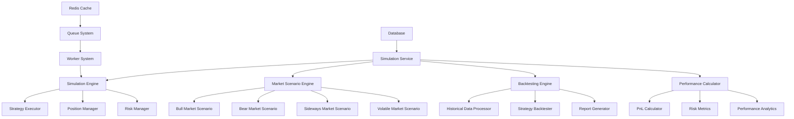

# Simulation Service - Microservices

> **Status**: Active  
> **Última Atualização**: 2025-01-26  
> **Versão**: 1.0.0  
> **Responsável**: Axisor Simulation Team  

## Índice

- [Visão Geral](#visão-geral)
- [Simulation Engine Architecture](#simulation-engine-architecture)
- [Market Scenarios](#market-scenarios)
- [Backtesting Engine](#backtesting-engine)
- [Performance Metrics](#performance-metrics)
- [Real-time Simulations](#real-time-simulations)
- [Data Management](#data-management)
- [Worker Integration](#worker-integration)
- [Error Handling](#error-handling)
- [Troubleshooting](#troubleshooting)
- [Referências](#referências)

## Visão Geral

O Simulation Service é responsável por executar simulações de trading em diferentes cenários de mercado, incluindo backtesting histórico e simulações em tempo real. O serviço implementa um engine flexível que suporta múltiplas estratégias de trading, cenários de mercado personalizados e métricas detalhadas de performance.

## Simulation Engine Architecture

### Service Architecture Overview



### Core Components

```typescript
// Simulation Service Core
class SimulationService {
  private prisma: PrismaClient;
  private redis: Redis;
  private logger: Logger;
  private simulationEngine: SimulationEngine;
  private marketScenarioEngine: MarketScenarioEngine;
  private backtestingEngine: BacktestingEngine;
  private performanceCalculator: PerformanceCalculator;
  private workerManager: WorkerManager;
  private queue: Queue;

  constructor(config: SimulationServiceConfig) {
    this.prisma = config.prisma;
    this.redis = config.redis;
    this.logger = config.logger;
    
    // Initialize core components
    this.simulationEngine = new SimulationEngine(this.prisma, this.logger);
    this.marketScenarioEngine = new MarketScenarioEngine(this.redis, this.logger);
    this.backtestingEngine = new BacktestingEngine(this.prisma, this.logger);
    this.performanceCalculator = new PerformanceCalculator(this.logger);
    this.workerManager = new WorkerManager(config.workerConfig);
    
    // Initialize queue
    this.queue = new Queue('simulation-execution', {
      connection: this.redis
    });
  }

  async initialize(): Promise<void> {
    this.logger.info('🚀 Initializing Simulation Service');
    
    await Promise.all([
      this.simulationEngine.initialize(),
      this.marketScenarioEngine.initialize(),
      this.backtestingEngine.initialize(),
      this.workerManager.start()
    ]);
    
    // Setup queue processing
    this.setupQueueProcessing();
    
    this.logger.info('✅ Simulation Service initialized successfully');
  }

  private setupQueueProcessing(): void {
    this.queue.process('execute-simulation', async (job) => {
      const { simulationId, scenarioId } = job.data;
      return this.executeSimulation(simulationId, scenarioId);
    });
    
    this.queue.process('execute-backtest', async (job) => {
      const { backtestId, strategyId } = job.data;
      return this.executeBacktest(backtestId, strategyId);
    });
  }
}
```

## Market Scenarios

### Scenario Engine Implementation

```typescript
interface MarketScenario {
  id: string;
  name: string;
  type: 'BULL' | 'BEAR' | 'SIDEWAYS' | 'VOLATILE' | 'CUSTOM';
  parameters: ScenarioParameters;
  duration: number; // minutes
  market_data: MarketDataPoint[];
  created_at: Date;
  updated_at: Date;
}

interface ScenarioParameters {
  volatility: number; // 0-1
  trend_direction: 'UP' | 'DOWN' | 'SIDEWAYS';
  trend_strength: number; // 0-1
  support_resistance_levels: number[];
  volume_profile: 'NORMAL' | 'HIGH' | 'LOW';
  news_events: NewsEvent[];
  market_conditions: MarketCondition[];
}

class MarketScenarioEngine {
  private scenarios: Map<string, MarketScenario> = new Map();
  private logger: Logger;

  async generateScenario(type: ScenarioType, parameters: ScenarioParameters): Promise<MarketScenario> {
    this.logger.info('Generating market scenario', { type, parameters });
    
    let scenario: MarketScenario;
    
    switch (type) {
      case 'BULL':
        scenario = await this.generateBullMarketScenario(parameters);
        break;
        
      case 'BEAR':
        scenario = await this.generateBearMarketScenario(parameters);
        break;
        
      case 'SIDEWAYS':
        scenario = await this.generateSidewaysMarketScenario(parameters);
        break;
        
      case 'VOLATILE':
        scenario = await this.generateVolatileMarketScenario(parameters);
        break;
        
      default:
        throw new Error(`Unknown scenario type: ${type}`);
    }
    
    // Save scenario
    await this.saveScenario(scenario);
    
    return scenario;
  }

  private async generateBullMarketScenario(parameters: ScenarioParameters): Promise<MarketScenario> {
    const marketData: MarketDataPoint[] = [];
    const duration = parameters.duration || 60; // 60 minutes default
    const volatility = parameters.volatility || 0.3;
    const trendStrength = parameters.trend_strength || 0.7;
    
    let currentPrice = 50000; // Starting price
    const priceChange = trendStrength * 0.02; // 2% max change per minute
    
    for (let minute = 0; minute < duration; minute++) {
      // Generate price with bullish trend
      const trendComponent = priceChange * (Math.random() * 0.5 + 0.5);
      const volatilityComponent = (Math.random() - 0.5) * volatility * 0.01;
      
      currentPrice *= (1 + trendComponent + volatilityComponent);
      
      // Generate volume (higher during trend)
      const volume = 1000 + (Math.random() * 2000 * trendStrength);
      
      marketData.push({
        timestamp: new Date(Date.now() + minute * 60000),
        price: currentPrice,
        high: currentPrice * (1 + Math.random() * 0.005),
        low: currentPrice * (1 - Math.random() * 0.005),
        open: minute === 0 ? currentPrice : marketData[minute - 1].price,
        close: currentPrice,
        volume: volume
      });
    }
    
    return {
      id: this.generateId(),
      name: 'Bull Market Scenario',
      type: 'BULL',
      parameters,
      duration,
      market_data: marketData,
      created_at: new Date(),
      updated_at: new Date()
    };
  }

  private async generateBearMarketScenario(parameters: ScenarioParameters): Promise<MarketScenario> {
    const marketData: MarketDataPoint[] = [];
    const duration = parameters.duration || 60;
    const volatility = parameters.volatility || 0.4;
    const trendStrength = parameters.trend_strength || 0.8;
    
    let currentPrice = 50000;
    const priceChange = -trendStrength * 0.02; // Negative for bear market
    
    for (let minute = 0; minute < duration; minute++) {
      const trendComponent = priceChange * (Math.random() * 0.5 + 0.5);
      const volatilityComponent = (Math.random() - 0.5) * volatility * 0.01;
      
      currentPrice *= (1 + trendComponent + volatilityComponent);
      
      // Higher volume during sell-offs
      const volume = 1500 + (Math.random() * 3000 * trendStrength);
      
      marketData.push({
        timestamp: new Date(Date.now() + minute * 60000),
        price: currentPrice,
        high: currentPrice * (1 + Math.random() * 0.003),
        low: currentPrice * (1 - Math.random() * 0.008),
        open: minute === 0 ? currentPrice : marketData[minute - 1].price,
        close: currentPrice,
        volume: volume
      });
    }
    
    return {
      id: this.generateId(),
      name: 'Bear Market Scenario',
      type: 'BEAR',
      parameters,
      duration,
      market_data: marketData,
      created_at: new Date(),
      updated_at: new Date()
    };
  }

  private async generateSidewaysMarketScenario(parameters: ScenarioParameters): Promise<MarketScenario> {
    const marketData: MarketDataPoint[] = [];
    const duration = parameters.duration || 60;
    const volatility = parameters.volatility || 0.2;
    const range = parameters.range || 1000; // Price range
    
    let currentPrice = 50000;
    const centerPrice = currentPrice;
    
    for (let minute = 0; minute < duration; minute++) {
      // Oscillate around center price
      const oscillation = Math.sin(minute * 0.1) * range * 0.5;
      const randomComponent = (Math.random() - 0.5) * volatility * 0.01 * centerPrice;
      
      currentPrice = centerPrice + oscillation + randomComponent;
      
      // Lower volume in sideways market
      const volume = 800 + Math.random() * 1000;
      
      marketData.push({
        timestamp: new Date(Date.now() + minute * 60000),
        price: currentPrice,
        high: currentPrice * (1 + Math.random() * 0.003),
        low: currentPrice * (1 - Math.random() * 0.003),
        open: minute === 0 ? currentPrice : marketData[minute - 1].price,
        close: currentPrice,
        volume: volume
      });
    }
    
    return {
      id: this.generateId(),
      name: 'Sideways Market Scenario',
      type: 'SIDEWAYS',
      parameters,
      duration,
      market_data: marketData,
      created_at: new Date(),
      updated_at: new Date()
    };
  }

  private async generateVolatileMarketScenario(parameters: ScenarioParameters): Promise<MarketScenario> {
    const marketData: MarketDataPoint[] = [];
    const duration = parameters.duration || 60;
    const volatility = parameters.volatility || 0.8;
    
    let currentPrice = 50000;
    
    for (let minute = 0; minute < duration; minute++) {
      // High volatility with random direction
      const direction = Math.random() > 0.5 ? 1 : -1;
      const volatilityComponent = direction * volatility * 0.02 * Math.random();
      
      currentPrice *= (1 + volatilityComponent);
      
      // High volume during volatility
      const volume = 2000 + Math.random() * 4000;
      
      marketData.push({
        timestamp: new Date(Date.now() + minute * 60000),
        price: currentPrice,
        high: currentPrice * (1 + Math.random() * 0.01),
        low: currentPrice * (1 - Math.random() * 0.01),
        open: minute === 0 ? currentPrice : marketData[minute - 1].price,
        close: currentPrice,
        volume: volume
      });
    }
    
    return {
      id: this.generateId(),
      name: 'Volatile Market Scenario',
      type: 'VOLATILE',
      parameters,
      duration,
      market_data: marketData,
      created_at: new Date(),
      updated_at: new Date()
    };
  }
}
```

### Real-time Scenario Execution

```typescript
class RealTimeSimulation {
  private scenario: MarketScenario;
  private simulationEngine: SimulationEngine;
  private currentPosition: number = 0;
  private currentPrice: number;
  private isRunning: boolean = false;
  private logger: Logger;

  async startSimulation(scenarioId: string, userId: string): Promise<SimulationResult> {
    this.logger.info('Starting real-time simulation', { scenarioId, userId });
    
    const scenario = await this.getScenario(scenarioId);
    if (!scenario) {
      throw new Error('Scenario not found');
    }
    
    this.scenario = scenario;
    this.currentPrice = scenario.market_data[0].price;
    this.isRunning = true;
    
    // Initialize simulation
    const simulation = await this.createSimulation(userId, scenarioId);
    
    // Start real-time execution
    this.executeRealTimeSimulation(simulation);
    
    return {
      simulationId: simulation.id,
      status: 'RUNNING',
      scenario: scenario.name,
      startTime: new Date(),
      currentPrice: this.currentPrice
    };
  }

  private async executeRealTimeSimulation(simulation: Simulation): Promise<void> {
    const startTime = Date.now();
    const duration = this.scenario.duration * 60000; // Convert to milliseconds
    
    // Process each minute of market data in real-time
    for (let i = 0; i < this.scenario.market_data.length && this.isRunning; i++) {
      const marketPoint = this.scenario.market_data[i];
      const elapsed = Date.now() - startTime;
      
      // Wait for the appropriate time (1 minute intervals)
      if (elapsed < i * 60000) {
        await this.sleep(i * 60000 - elapsed);
      }
      
      // Update current price
      this.currentPrice = marketPoint.price;
      
      // Execute trading logic
      await this.executeTradingLogic(simulation, marketPoint);
      
      // Update simulation progress
      await this.updateSimulationProgress(simulation, i, this.scenario.market_data.length);
      
      // Emit real-time updates
      this.emitSimulationUpdate(simulation, marketPoint);
    }
    
    // Complete simulation
    await this.completeSimulation(simulation);
  }

  private async executeTradingLogic(simulation: Simulation, marketPoint: MarketDataPoint): Promise<void> {
    // Example trading logic - can be customized
    const strategy = simulation.strategy;
    
    switch (strategy.type) {
      case 'MOMENTUM':
        await this.executeMomentumStrategy(simulation, marketPoint);
        break;
        
      case 'MEAN_REVERSION':
        await this.executeMeanReversionStrategy(simulation, marketPoint);
        break;
        
      case 'BREAKOUT':
        await this.executeBreakoutStrategy(simulation, marketPoint);
        break;
        
      default:
        await this.executeDefaultStrategy(simulation, marketPoint);
    }
  }

  private async executeMomentumStrategy(simulation: Simulation, marketPoint: MarketDataPoint): Promise<void> {
    const priceChange = (marketPoint.price - this.currentPrice) / this.currentPrice;
    
    // Buy on upward momentum
    if (priceChange > 0.01 && this.currentPosition <= 0) { // 1% increase
      await this.openPosition(simulation, 'LONG', marketPoint);
    }
    
    // Sell on downward momentum
    if (priceChange < -0.01 && this.currentPosition >= 0) { // 1% decrease
      await this.openPosition(simulation, 'SHORT', marketPoint);
    }
  }

  private async openPosition(simulation: Simulation, type: 'LONG' | 'SHORT', marketPoint: MarketDataPoint): Promise<void> {
    const positionSize = this.calculatePositionSize(simulation, marketPoint);
    
    const position = {
      id: this.generateId(),
      simulationId: simulation.id,
      type,
      size: positionSize,
      entryPrice: marketPoint.price,
      timestamp: marketPoint.timestamp,
      status: 'OPEN'
    };
    
    // Update current position
    this.currentPosition = type === 'LONG' ? positionSize : -positionSize;
    
    // Save position
    await this.savePosition(position);
    
    this.logger.info('Position opened in simulation', { 
      simulationId: simulation.id, 
      position 
    });
  }

  private calculatePositionSize(simulation: Simulation, marketPoint: MarketDataPoint): number {
    // Simple position sizing based on available capital and risk
    const capital = simulation.initialCapital;
    const riskPerTrade = simulation.riskPerTrade || 0.02; // 2% risk
    const stopLoss = simulation.stopLoss || 0.05; // 5% stop loss
    
    const riskAmount = capital * riskPerTrade;
    const positionSize = riskAmount / (marketPoint.price * stopLoss);
    
    return Math.floor(positionSize);
  }
}
```

## Backtesting Engine

### Historical Data Processing

```typescript
class BacktestingEngine {
  private prisma: PrismaClient;
  private logger: Logger;
  private dataProcessor: HistoricalDataProcessor;

  async executeBacktest(backtestConfig: BacktestConfig): Promise<BacktestResult> {
    this.logger.info('Starting backtest execution', { backtestConfig });
    
    try {
      // 1. Load historical data
      const historicalData = await this.loadHistoricalData(backtestConfig);
      
      // 2. Initialize backtest environment
      const backtestEnv = await this.initializeBacktestEnvironment(backtestConfig);
      
      // 3. Execute strategy on historical data
      const results = await this.executeStrategyOnHistoricalData(
        backtestConfig.strategy, 
        historicalData, 
        backtestEnv
      );
      
      // 4. Calculate performance metrics
      const performanceMetrics = await this.calculatePerformanceMetrics(results);
      
      // 5. Generate report
      const report = await this.generateBacktestReport(results, performanceMetrics);
      
      // 6. Save results
      await this.saveBacktestResults(backtestConfig.id, results, report);
      
      return {
        id: backtestConfig.id,
        status: 'COMPLETED',
        results,
        performanceMetrics,
        report,
        executedAt: new Date()
      };
      
    } catch (error) {
      this.logger.error('Backtest execution failed', { backtestConfig, error: error.message });
      throw error;
    }
  }

  private async loadHistoricalData(config: BacktestConfig): Promise<HistoricalData[]> {
    const { symbol, startDate, endDate, timeframe } = config.dataConfig;
    
    // Load data from database or external source
    const data = await this.prisma.historicalData.findMany({
      where: {
        symbol,
        timestamp: {
          gte: startDate,
          lte: endDate
        },
        timeframe
      },
      orderBy: { timestamp: 'asc' }
    });
    
    if (data.length === 0) {
      throw new Error('No historical data found for the specified period');
    }
    
    this.logger.info('Historical data loaded', { 
      symbol, 
      records: data.length, 
      period: `${startDate} to ${endDate}` 
    });
    
    return data;
  }

  private async executeStrategyOnHistoricalData(
    strategy: TradingStrategy,
    data: HistoricalData[],
    env: BacktestEnvironment
  ): Promise<BacktestResults> {
    const results: BacktestResults = {
      trades: [],
      positions: [],
      equity: [],
      drawdown: [],
      performance: {
        totalReturn: 0,
        sharpeRatio: 0,
        maxDrawdown: 0,
        winRate: 0,
        profitFactor: 0
      }
    };
    
    let currentPosition: Position | null = null;
    let currentEquity = env.initialCapital;
    let maxEquity = currentEquity;
    let maxDrawdown = 0;
    
    // Process each data point
    for (let i = 0; i < data.length; i++) {
      const marketData = data[i];
      
      // Update indicators
      const indicators = await this.updateIndicators(marketData, data.slice(0, i + 1));
      
      // Generate signals
      const signals = await this.generateSignals(strategy, marketData, indicators, currentPosition);
      
      // Execute trades based on signals
      for (const signal of signals) {
        if (signal.action === 'OPEN' && !currentPosition) {
          currentPosition = await this.openPosition(marketData, signal, env);
          results.positions.push(currentPosition);
        } else if (signal.action === 'CLOSE' && currentPosition) {
          const trade = await this.closePosition(currentPosition, marketData, signal);
          results.trades.push(trade);
          
          // Update equity
          currentEquity += trade.pnl;
          maxEquity = Math.max(maxEquity, currentEquity);
          maxDrawdown = Math.max(maxDrawdown, (maxEquity - currentEquity) / maxEquity);
          
          results.equity.push({
            timestamp: marketData.timestamp,
            equity: currentEquity,
            drawdown: (maxEquity - currentEquity) / maxEquity
          });
          
          currentPosition = null;
        }
      }
    }
    
    // Close any remaining position
    if (currentPosition) {
      const finalData = data[data.length - 1];
      const trade = await this.closePosition(currentPosition, finalData, { action: 'CLOSE', reason: 'END_OF_DATA' });
      results.trades.push(trade);
    }
    
    return results;
  }

  private async generateSignals(
    strategy: TradingStrategy,
    marketData: HistoricalData,
    indicators: TechnicalIndicators,
    currentPosition: Position | null
  ): Promise<TradingSignal[]> {
    const signals: TradingSignal[] = [];
    
    switch (strategy.type) {
      case 'MOVING_AVERAGE_CROSSOVER':
        signals.push(...this.generateMovingAverageSignals(marketData, indicators, currentPosition));
        break;
        
      case 'RSI_OVERSOLD_OVERBOUGHT':
        signals.push(...this.generateRSISignals(marketData, indicators, currentPosition));
        break;
        
      case 'BOLLINGER_BANDS':
        signals.push(...this.generateBollingerBandSignals(marketData, indicators, currentPosition));
        break;
        
      case 'MACD':
        signals.push(...this.generateMACDSignals(marketData, indicators, currentPosition));
        break;
        
      default:
        // Custom strategy logic
        signals.push(...await this.executeCustomStrategy(strategy, marketData, indicators, currentPosition));
    }
    
    return signals;
  }

  private generateMovingAverageSignals(
    marketData: HistoricalData,
    indicators: TechnicalIndicators,
    currentPosition: Position | null
  ): TradingSignal[] {
    const signals: TradingSignal[] = [];
    
    if (!indicators.sma20 || !indicators.sma50) {
      return signals;
    }
    
    // Bullish crossover: SMA20 crosses above SMA50
    if (indicators.sma20 > indicators.sma50 && marketData.close > indicators.sma20) {
      if (!currentPosition || currentPosition.type !== 'LONG') {
        signals.push({
          action: 'OPEN',
          type: 'LONG',
          price: marketData.close,
          timestamp: marketData.timestamp,
          reason: 'MA_BULLISH_CROSSOVER'
        });
      }
    }
    
    // Bearish crossover: SMA20 crosses below SMA50
    if (indicators.sma20 < indicators.sma50 && marketData.close < indicators.sma20) {
      if (!currentPosition || currentPosition.type !== 'SHORT') {
        signals.push({
          action: 'OPEN',
          type: 'SHORT',
          price: marketData.close,
          timestamp: marketData.timestamp,
          reason: 'MA_BEARISH_CROSSOVER'
        });
      }
    }
    
    return signals;
  }
}
```

## Performance Metrics

### Performance Calculator

```typescript
class PerformanceCalculator {
  private logger: Logger;

  async calculatePerformanceMetrics(results: BacktestResults): Promise<PerformanceMetrics> {
    const trades = results.trades;
    
    if (trades.length === 0) {
      return this.getEmptyPerformanceMetrics();
    }
    
    // Basic metrics
    const totalTrades = trades.length;
    const winningTrades = trades.filter(t => t.pnl > 0).length;
    const losingTrades = trades.filter(t => t.pnl < 0).length;
    const winRate = winningTrades / totalTrades;
    
    // PnL metrics
    const totalPnL = trades.reduce((sum, trade) => sum + trade.pnl, 0);
    const grossProfit = trades.filter(t => t.pnl > 0).reduce((sum, trade) => sum + trade.pnl, 0);
    const grossLoss = Math.abs(trades.filter(t => t.pnl < 0).reduce((sum, trade) => sum + trade.pnl, 0));
    const profitFactor = grossLoss > 0 ? grossProfit / grossLoss : 0;
    
    // Return metrics
    const initialCapital = results.initialCapital;
    const finalCapital = initialCapital + totalPnL;
    const totalReturn = (finalCapital - initialCapital) / initialCapital;
    
    // Drawdown metrics
    const maxDrawdown = this.calculateMaxDrawdown(results.equity);
    const averageDrawdown = this.calculateAverageDrawdown(results.equity);
    
    // Risk metrics
    const returns = this.calculateReturns(trades);
    const volatility = this.calculateVolatility(returns);
    const sharpeRatio = this.calculateSharpeRatio(returns, volatility);
    const sortinoRatio = this.calculateSortinoRatio(returns);
    
    // Trade statistics
    const averageWin = winningTrades > 0 ? grossProfit / winningTrades : 0;
    const averageLoss = losingTrades > 0 ? grossLoss / losingTrades : 0;
    const largestWin = Math.max(...trades.map(t => t.pnl), 0);
    const largestLoss = Math.min(...trades.map(t => t.pnl), 0);
    
    // Time-based metrics
    const holdingPeriods = trades.map(t => t.exitTime.getTime() - t.entryTime.getTime());
    const averageHoldingPeriod = holdingPeriods.reduce((sum, period) => sum + period, 0) / holdingPeriods.length;
    
    return {
      // Basic metrics
      totalTrades,
      winningTrades,
      losingTrades,
      winRate,
      
      // PnL metrics
      totalPnL,
      grossProfit,
      grossLoss,
      profitFactor,
      
      // Return metrics
      initialCapital,
      finalCapital,
      totalReturn,
      annualizedReturn: this.calculateAnnualizedReturn(totalReturn, results.period),
      
      // Drawdown metrics
      maxDrawdown,
      averageDrawdown,
      
      // Risk metrics
      volatility,
      sharpeRatio,
      sortinoRatio,
      var95: this.calculateVaR(returns, 0.95),
      cvar95: this.calculateCVaR(returns, 0.95),
      
      // Trade statistics
      averageWin,
      averageLoss,
      largestWin,
      largestLoss,
      averageHoldingPeriod,
      
      // Advanced metrics
      calmarRatio: totalReturn / maxDrawdown,
      sterlingRatio: totalReturn / averageDrawdown,
      kappaRatio: totalReturn / this.calculateKappa(returns),
      omegaRatio: this.calculateOmegaRatio(returns),
      
      calculatedAt: new Date()
    };
  }

  private calculateMaxDrawdown(equity: EquityPoint[]): number {
    if (equity.length === 0) return 0;
    
    let maxEquity = equity[0].equity;
    let maxDrawdown = 0;
    
    for (const point of equity) {
      maxEquity = Math.max(maxEquity, point.equity);
      const drawdown = (maxEquity - point.equity) / maxEquity;
      maxDrawdown = Math.max(maxDrawdown, drawdown);
    }
    
    return maxDrawdown;
  }

  private calculateSharpeRatio(returns: number[], volatility: number): number {
    if (volatility === 0) return 0;
    
    const riskFreeRate = 0.02; // 2% annual risk-free rate
    const averageReturn = returns.reduce((sum, r) => sum + r, 0) / returns.length;
    const excessReturn = averageReturn - riskFreeRate / 252; // Daily risk-free rate
    
    return excessReturn / volatility;
  }

  private calculateSortinoRatio(returns: number[]): number {
    const downsideReturns = returns.filter(r => r < 0);
    if (downsideReturns.length === 0) return 0;
    
    const downsideDeviation = Math.sqrt(
      downsideReturns.reduce((sum, r) => sum + r * r, 0) / downsideReturns.length
    );
    
    if (downsideDeviation === 0) return 0;
    
    const averageReturn = returns.reduce((sum, r) => sum + r, 0) / returns.length;
    const riskFreeRate = 0.02 / 252; // Daily risk-free rate
    
    return (averageReturn - riskFreeRate) / downsideDeviation;
  }
}
```

## Data Management

### Historical Data Service

```typescript
class HistoricalDataService {
  private prisma: PrismaClient;
  private externalDataSources: ExternalDataSource[];
  private cache: Redis;

  async loadHistoricalData(config: DataLoadConfig): Promise<HistoricalData[]> {
    const cacheKey = this.generateCacheKey(config);
    
    // Check cache first
    const cachedData = await this.getCachedData(cacheKey);
    if (cachedData) {
      return cachedData;
    }
    
    // Load from database
    let data = await this.loadFromDatabase(config);
    
    // If insufficient data, fetch from external sources
    if (data.length < config.minRecords) {
      const externalData = await this.fetchFromExternalSources(config);
      data = [...data, ...externalData];
      
      // Save to database
      await this.saveToDatabase(externalData);
    }
    
    // Cache the data
    await this.cacheData(cacheKey, data);
    
    return data;
  }

  private async fetchFromExternalSources(config: DataLoadConfig): Promise<HistoricalData[]> {
    const data: HistoricalData[] = [];
    
    for (const source of this.externalDataSources) {
      try {
        const sourceData = await source.fetchData(config);
        data.push(...sourceData);
        
        this.logger.info('Data fetched from external source', { 
          source: source.name, 
          records: sourceData.length 
        });
        
      } catch (error) {
        this.logger.error('Failed to fetch data from external source', { 
          source: source.name, 
          error: error.message 
        });
      }
    }
    
    return data;
  }

  async preloadMarketScenarios(): Promise<void> {
    this.logger.info('Preloading market scenarios');
    
    const scenarios = [
      { type: 'BULL', duration: 60, volatility: 0.3 },
      { type: 'BEAR', duration: 60, volatility: 0.4 },
      { type: 'SIDEWAYS', duration: 60, volatility: 0.2 },
      { type: 'VOLATILE', duration: 60, volatility: 0.8 }
    ];
    
    for (const scenario of scenarios) {
      try {
        await this.marketScenarioEngine.generateScenario(scenario.type, scenario);
      } catch (error) {
        this.logger.error('Failed to preload scenario', { scenario, error: error.message });
      }
    }
  }
}
```

## Worker Integration

### Simulation Worker

```typescript
class SimulationExecutorWorker {
  private simulationService: SimulationService;
  private queue: Queue;
  private logger: Logger;
  private isRunning = false;

  async start(): Promise<void> {
    if (this.isRunning) {
      this.logger.warn('Simulation worker already running');
      return;
    }

    this.logger.info('🚀 Starting Simulation Executor Worker');

    // Process simulation execution jobs
    this.queue.process('execute-simulation', 3, async (job) => {
      return this.processSimulationJob(job);
    });

    // Process backtest execution jobs
    this.queue.process('execute-backtest', 2, async (job) => {
      return this.processBacktestJob(job);
    });

    this.isRunning = true;
    this.logger.info('✅ Simulation Executor Worker started');
  }

  private async processSimulationJob(job: Job): Promise<void> {
    const { simulationId, scenarioId } = job.data;
    
    this.logger.info('Processing simulation job', { simulationId, jobId: job.id });
    
    try {
      const result = await this.simulationService.executeSimulation(simulationId, scenarioId);
      
      this.logger.info('Simulation executed successfully', { 
        simulationId, 
        result: result.status 
      });
      
      // Update job progress
      job.progress(100);
      
    } catch (error) {
      this.logger.error('Simulation job failed', { 
        simulationId, 
        jobId: job.id, 
        error: error.message 
      });
      
      throw error;
    }
  }

  private async processBacktestJob(job: Job): Promise<void> {
    const { backtestId, strategyId } = job.data;
    
    this.logger.info('Processing backtest job', { backtestId, jobId: job.id });
    
    try {
      const result = await this.simulationService.executeBacktest(backtestId, strategyId);
      
      this.logger.info('Backtest executed successfully', { 
        backtestId, 
        result: result.status 
      });
      
      job.progress(100);
      
    } catch (error) {
      this.logger.error('Backtest job failed', { 
        backtestId, 
        jobId: job.id, 
        error: error.message 
      });
      
      throw error;
    }
  }
}
```

## Error Handling

### Simulation Error Handler

```typescript
class SimulationErrorHandler {
  private logger: Logger;
  private notificationService: NotificationService;

  async handleSimulationError(simulationId: string, error: Error): Promise<void> {
    this.logger.error('Simulation error', { 
      simulationId, 
      error: error.message,
      stack: error.stack 
    });

    // Categorize error
    const errorType = this.categorizeError(error);
    
    // Handle based on error type
    switch (errorType) {
      case 'DATA_ERROR':
        await this.handleDataError(simulationId, error);
        break;
        
      case 'STRATEGY_ERROR':
        await this.handleStrategyError(simulationId, error);
        break;
        
      case 'RESOURCE_ERROR':
        await this.handleResourceError(simulationId, error);
        break;
        
      default:
        await this.handleGenericError(simulationId, error);
    }
  }

  private categorizeError(error: Error): string {
    const message = error.message.toLowerCase();
    
    if (message.includes('data') || message.includes('historical')) {
      return 'DATA_ERROR';
    }
    
    if (message.includes('strategy') || message.includes('signal')) {
      return 'STRATEGY_ERROR';
    }
    
    if (message.includes('memory') || message.includes('resource')) {
      return 'RESOURCE_ERROR';
    }
    
    return 'GENERIC_ERROR';
  }
}
```

## Troubleshooting

### Common Simulation Issues

#### Simulation Not Starting

```typescript
// Debug simulation startup
async function debugSimulationStartup(simulationId: string): Promise<void> {
  console.log(`Debugging simulation ${simulationId}:`);
  
  // Check simulation status
  const simulation = await prisma.simulation.findUnique({
    where: { id: simulationId }
  });
  
  if (!simulation) {
    console.log('❌ Simulation not found');
    return;
  }
  
  console.log('Simulation status:', simulation.status);
  
  // Check scenario
  const scenario = await prisma.marketScenario.findUnique({
    where: { id: simulation.scenario_id }
  });
  
  if (!scenario) {
    console.log('❌ Scenario not found');
    return;
  }
  
  console.log('Scenario data points:', scenario.market_data.length);
  
  // Check worker status
  const workerStatus = await workerManager.getStatus();
  console.log('Worker status:', workerStatus);
  
  // Check queue status
  const queueStatus = await queue.getJobCounts();
  console.log('Queue status:', queueStatus);
}
```

#### Performance Issues

```typescript
// Debug simulation performance
async function debugSimulationPerformance(): Promise<void> {
  console.log('Simulation Performance Analysis:');
  
  // Get active simulations
  const activeSimulations = await prisma.simulation.findMany({
    where: { status: 'RUNNING' }
  });
  
  console.log(`Active simulations: ${activeSimulations.length}`);
  
  // Check resource usage
  const memoryUsage = process.memoryUsage();
  console.log('Memory usage:', {
    rss: `${Math.round(memoryUsage.rss / 1024 / 1024)}MB`,
    heapTotal: `${Math.round(memoryUsage.heapTotal / 1024 / 1024)}MB`,
    heapUsed: `${Math.round(memoryUsage.heapUsed / 1024 / 1024)}MB`
  });
  
  // Check queue backlog
  const queueCounts = await queue.getJobCounts();
  console.log('Queue backlog:', queueCounts);
  
  if (queueCounts.waiting > 10) {
    console.log('⚠️ High queue backlog detected');
  }
}
```

## Referências

- [System Architecture](../system-overview/system-architecture.md)
- [Automation Service](./automation-service.md)
- [Margin Guard Service](./margin-guard-service.md)
- [Performance Monitoring](../monitoring/performance-monitoring.md)

## Como Usar Este Documento

• **Para Desenvolvedores**: Use como referência para implementar novas estratégias de simulação e backtesting.

• **Para Traders**: Utilize para entender como configurar e executar simulações de trading.

• **Para Analistas**: Use para interpretar resultados de backtesting e métricas de performance.
