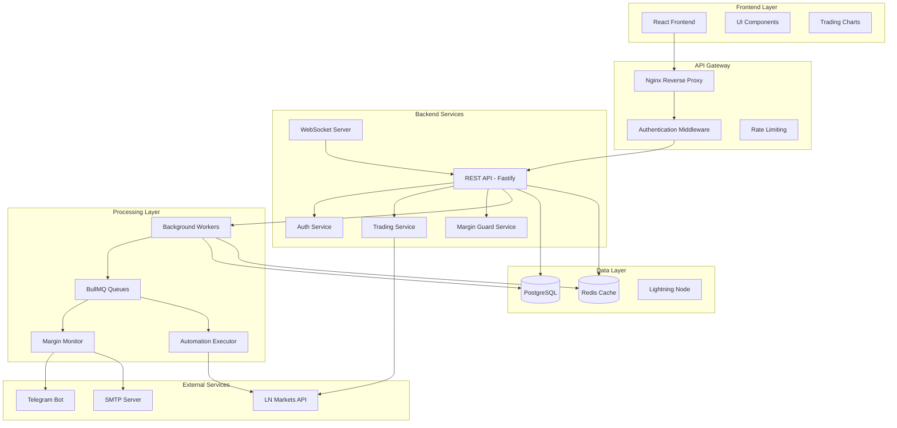

# Arquitetura de Sistema - Axisor Trading Platform

## 📋 Resumo

O Axisor é uma plataforma completa de automação de trading para LN Markets, implementando um sistema distribuído com arquitetura em camadas, processamento assíncrono e monitoramento em tempo real. A arquitetura combina componentes síncronos (API REST) com processamento assíncrono (workers/queues) para garantir escalabilidade e confiabilidade.

## 🏗️ Diagrama de Arquitetura

## 🎯 Responsabilidades por Camada

### Frontend Layer
- **Interface de Usuário**: Componentes React com shadcn/ui
- **Visualização**: Gráficos de trading com Lightweight Charts
- **Estado**: Gerenciamento com Zustand
- **Autenticação**: Integração com backend via JWT

### API Gateway
- **Proxy Reverso**: Nginx para balanceamento e SSL
- **Autenticação**: Middleware JWT para proteção de rotas
- **Rate Limiting**: Controle de taxa de requisições
- **Logs**: Centralização de logs de acesso

### Backend Services
- **API REST**: Endpoints para operações síncronas
- **WebSocket**: Comunicação em tempo real
- **Serviços de Negócio**: Lógica de trading e automação
- **Validação**: Schemas e middlewares de validação

### Processing Layer
- **Workers**: Processamento assíncrono de tarefas
- **Queues**: Gerenciamento de filas com BullMQ
- **Monitoramento**: Verificação contínua de margens
- **Execução**: Automação de estratégias de trading

### Data Layer
- **PostgreSQL**: Dados transacionais e configurações
- **Redis**: Cache e sessões
- **Lightning Node**: Integração com rede Lightning

## ⚠️ Pontos Críticos

### Segurança
- **Autenticação**: JWT com refresh tokens
- **Autorização**: Controle de acesso baseado em roles
- **Criptografia**: AES-256 para dados sensíveis
- **Rate Limiting**: Proteção contra ataques DDoS
- **Auditoria**: Logs de todas as operações críticas

### Performance
- **Cache Strategy**: Redis para dados frequentes
- **Lazy Loading**: Carregamento sob demanda de dados históricos
- **Connection Pooling**: Pool de conexões para PostgreSQL
- **Queue Processing**: Processamento paralelo de workers
- **CDN**: Assets estáticos via CDN

### Confiabilidade
- **Circuit Breaker**: Proteção contra falhas em cascata
- **Retry Logic**: Tentativas automáticas para operações falhadas
- **Health Checks**: Monitoramento de saúde dos serviços
- **Backup**: Estratégia de backup automático
- **Failover**: Redundância para componentes críticos

### Escalabilidade
- **Horizontal Scaling**: Múltiplas instâncias de workers
- **Load Balancing**: Distribuição de carga
- **Database Sharding**: Particionamento de dados
- **Microservices**: Separação de responsabilidades
- **Containerization**: Docker para deploy consistente

## ✅ Checklist de Avaliação

### Arquitetura Geral
- [ ] Separação clara entre camadas de apresentação, negócio e dados
- [ ] Implementação de padrões de design apropriados
- [ ] Documentação de interfaces entre componentes
- [ ] Definição de contratos de API
- [ ] Estratégia de versionamento de API

### Segurança
- [ ] Implementação de autenticação robusta
- [ ] Controle de acesso baseado em roles
- [ ] Criptografia de dados sensíveis
- [ ] Validação de entrada em todos os endpoints
- [ ] Logs de auditoria para operações críticas

### Performance
- [ ] Implementação de cache estratégico
- [ ] Otimização de queries de banco
- [ ] Lazy loading para dados grandes
- [ ] Compressão de responses
- [ ] Minificação de assets frontend

### Confiabilidade
- [ ] Implementação de circuit breakers
- [ ] Estratégia de retry para operações falhadas
- [ ] Health checks para todos os serviços
- [ ] Backup automático de dados
- [ ] Plano de recuperação de desastres

### Escalabilidade
- [ ] Suporte a múltiplas instâncias
- [ ] Load balancing configurado
- [ ] Estratégia de particionamento de dados
- [ ] Containerização completa
- [ ] Orquestração com Kubernetes

### Monitoramento
- [ ] Logs centralizados
- [ ] Métricas de performance
- [ ] Alertas para falhas críticas
- [ ] Dashboard de monitoramento
- [ ] Tracing distribuído

## 🔧 Como Usar Este Documento

• **Para Desenvolvedores**: Use como referência para entender a arquitetura geral e implementar novos componentes seguindo os padrões estabelecidos.

• **Para DevOps**: Utilize o checklist de avaliação para validar a implementação da arquitetura em ambientes de produção.

• **Para Arquitetos**: Use como base para evoluções arquiteturais, garantindo que mudanças mantenham a consistência do sistema.
