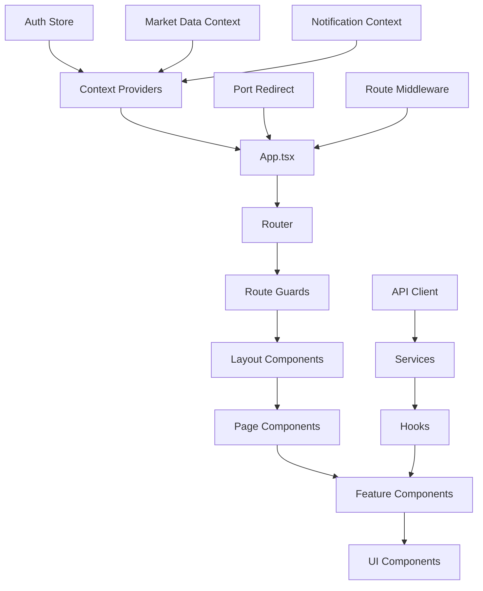
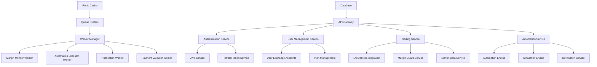

# Component Interactions - Architecture

> **Status**: Active  
> **Última Atualização**: 2025-01-26  
> **Versão**: 1.0.0  
> **Responsável**: Axisor Architecture Team  

## Índice

- [Visão Geral](#visão-geral)
- [Frontend Component Architecture](#frontend-component-architecture)
- [Backend Service Interactions](#backend-service-interactions)
- [Cross-Layer Communication](#cross-layer-communication)
- [State Management Flow](#state-management-flow)
- [Event-Driven Architecture](#event-driven-architecture)
- [Dependency Injection](#dependency-injection)
- [Error Propagation](#error-propagation)
- [Troubleshooting](#troubleshooting)
- [Referências](#referências)

## Visão Geral

O sistema Axisor implementa uma arquitetura de componentes bem definida com separação clara entre frontend e backend, comunicação baseada em eventos, e padrões de injeção de dependência para garantir baixo acoplamento e alta coesão.

## Frontend Component Architecture

### Component Interaction Flow



### Component Hierarchy

```typescript
// Main App Structure
App
├── PortRedirect (Global redirect component)
├── RouteRedirectMiddleware (Route management)
├── GlobalPageTitle (Dynamic titles)
├── GlobalDynamicFavicon (Dynamic favicons)
├── Context Providers
│   ├── ThemeProvider
│   ├── VersionProvider
│   ├── MarketDataProvider
│   ├── RealtimeDataProvider
│   ├── PositionsProvider
│   ├── NotificationProvider
│   ├── AccountProvider
│   └── TooltipProvider
├── Router
│   ├── Public Routes
│   │   ├── Login
│   │   └── Register
│   ├── Protected Routes
│   │   ├── Dashboard
│   │   ├── Trading
│   │   ├── Margin Guard
│   │   ├── Simulations
│   │   └── Profile
│   └── Admin Routes
│       ├── Admin Dashboard
│       ├── User Management
│       └── System Configuration
```

### Guard Components Interaction

```typescript
// Guard Component Hierarchy
interface GuardInteractions {
  PortRedirect: {
    triggers: ['direct_backend_access'];
    actions: ['redirect_to_frontend'];
    dependencies: ['window.location'];
  };
  
  AuthGuard: {
    triggers: ['route_access'];
    actions: ['verify_authentication', 'redirect_to_login'];
    dependencies: ['useAuthStore', 'Navigate'];
  };
  
  ProtectedRouteWrapper: {
    triggers: ['protected_route_access'];
    actions: ['verify_auth', 'check_admin_permissions', 'render_content'];
    dependencies: ['useAuthStore', 'useLocation'];
  };
  
  LNMarketsGuard: {
    triggers: ['trading_operations'];
    actions: ['verify_lnmarkets_connection', 'show_configuration'];
    dependencies: ['useLNMarketsConnectionStatus'];
  };
}
```

### Layout Component Interactions

```typescript
// Layout Component Structure
interface LayoutInteractions {
  ResponsiveLayout: {
    children: ['Sidebar', 'Header', 'MainContent', 'Footer'];
    breakpoints: ['mobile', 'tablet', 'desktop'];
    responsive_behavior: 'collapsible_sidebar';
  };
  
  Sidebar: {
    navigation_items: ['Dashboard', 'Trading', 'Margin Guard', 'Simulations'];
    state_management: ['collapsed_state', 'active_route'];
    interactions: ['toggle_collapse', 'route_navigation'];
  };
  
  Header: {
    components: ['UserMenu', 'ConnectionStatus', 'Notifications'];
    responsive_behavior: 'mobile_hamburger_menu';
  };
}
```

## Backend Service Interactions

### Service Architecture Overview



### Service Dependencies

```typescript
// Core Service Dependencies
interface ServiceDependencies {
  MarginGuardIntegrationService: {
    dependencies: [
      'MarginGuardExecutorService',
      'MarginGuardNotificationService',
      'MarginGuardPlanService',
      'AutomationService',
      'UserExchangeAccountService',
      'AutomationLoggerService'
    ];
    queues: ['margin-guard-queue', 'scheduler-queue'];
    external_services: ['LN Markets API', 'Notification Services'];
  };
  
  LNDService: {
    clients: ['testnetClient', 'mainnetClient'];
    endpoints: [
      'LNDInfoEndpoints',
      'LNDWalletEndpoints',
      'LNDInvoiceEndpoints',
      'LNDChannelEndpoints',
      'LNDPeerEndpoints',
      'LNDOnchainEndpoints'
    ];
    factory_pattern: 'network_specific_clients';
  };
  
  WorkerManagerService: {
    capabilities: [
      'margin-check',
      'automation-executor',
      'simulation',
      'notification',
      'payment-validator'
    ];
    management: ['worker_health', 'job_distribution', 'graceful_shutdown'];
    monitoring: ['heartbeat', 'health_check'];
  };
  
  UnifiedAdminOptimizationService: {
    integrations: [
      'AdvancedQueryOptimizerService',
      'SecureQueryOptimizerService',
      'DatabaseIndexOptimizerService',
      'VolatileMarketDataService',
      'IntelligentCacheService'
    ];
    unified_interface: 'admin_optimization_dashboard';
  };
}
```

### Microservice Communication Patterns

```typescript
// Service Communication Patterns
class ServiceInteractionPatterns {
  // 1. Direct Service Calls
  async directServiceCall(): Promise<void> {
    const marginGuardService = new MarginGuardIntegrationService(config);
    await marginGuardService.initialize();
    
    // Direct method calls within same process
    const result = await marginGuardService.executeMarginCheck(userId);
  }
  
  // 2. Queue-Based Communication
  async queueBasedCommunication(): Promise<void> {
    const workerManager = new WorkerManagerService(config);
    await workerManager.start();
    
    // Asynchronous job processing
    await workerManager.addJob('margin-check', {
      userId,
      timestamp: Date.now()
    });
  }
  
  // 3. Event-Driven Communication
  async eventDrivenCommunication(): Promise<void> {
    const websocketManager = new WebSocketManagerService();
    
    // Subscribe to events
    websocketManager.on('margin_alert', (data) => {
      this.handleMarginAlert(data);
    });
    
    // Emit events
    websocketManager.emit('user_action', {
      userId,
      action: 'position_opened'
    });
  }
  
  // 4. HTTP API Communication
  async httpApiCommunication(): Promise<void> {
    const lnmarketsService = new LNMarketsAPIv2Service();
    
    // REST API calls to external services
    const userInfo = await lnmarketsService.user.getInfo();
    const positions = await lnmarketsService.futures.getPositions();
  }
}
```

## Cross-Layer Communication

### Frontend-Backend Communication

```typescript
// API Communication Layer
class APIClient {
  private baseURL: string;
  private authToken: string | null = null;
  
  // Request interceptor
  private async makeRequest<T>(
    endpoint: string, 
    options: RequestInit = {}
  ): Promise<T> {
    const headers = {
      'Content-Type': 'application/json',
      ...(this.authToken && { Authorization: `Bearer ${this.authToken}` }),
      ...options.headers
    };
    
    const response = await fetch(`${this.baseURL}${endpoint}`, {
      ...options,
      headers
    });
    
    if (!response.ok) {
      throw new APIError(response.status, await response.text());
    }
    
    return response.json();
  }
  
  // Service-specific methods
  async getUserProfile(): Promise<UserProfile> {
    return this.makeRequest<UserProfile>('/api/user/profile');
  }
  
  async updateMarginGuard(config: MarginGuardConfig): Promise<void> {
    return this.makeRequest<void>('/api/automation/margin-guard', {
      method: 'PUT',
      body: JSON.stringify(config)
    });
  }
}

// Service Layer Integration
class UserService {
  constructor(private apiClient: APIClient) {}
  
  async getUserData(): Promise<UserData> {
    try {
      const [profile, preferences, accounts] = await Promise.all([
        this.apiClient.getUserProfile(),
        this.apiClient.getUserPreferences(),
        this.apiClient.getExchangeAccounts()
      ]);
      
      return { profile, preferences, accounts };
    } catch (error) {
      throw new ServiceError('Failed to fetch user data', error);
    }
  }
}
```

### WebSocket Communication

```typescript
// Real-time Communication
class WebSocketService {
  private ws: WebSocket | null = null;
  private reconnectAttempts = 0;
  private maxReconnectAttempts = 5;
  
  connect(): void {
    this.ws = new WebSocket(`${this.wsUrl}?token=${this.authToken}`);
    
    this.ws.onopen = () => {
      console.log('WebSocket connected');
      this.reconnectAttempts = 0;
    };
    
    this.ws.onmessage = (event) => {
      const data = JSON.parse(event.data);
      this.handleMessage(data);
    };
    
    this.ws.onclose = () => {
      this.handleReconnect();
    };
  }
  
  private handleMessage(data: WebSocketMessage): void {
    switch (data.type) {
      case 'market_data':
        this.emit('market_data_update', data.payload);
        break;
      case 'margin_alert':
        this.emit('margin_alert', data.payload);
        break;
      case 'position_update':
        this.emit('position_update', data.payload);
        break;
    }
  }
}
```

## State Management Flow

### Frontend State Architecture

```typescript
// Zustand Store Structure
interface AppState {
  // Authentication State
  auth: {
    isAuthenticated: boolean;
    user: User | null;
    isLoading: boolean;
    isInitialized: boolean;
  };
  
  // Market Data State
  marketData: {
    currentPrice: number;
    priceHistory: PricePoint[];
    isLoading: boolean;
    lastUpdate: Date | null;
  };
  
  // Trading State
  trading: {
    positions: Position[];
    orders: Order[];
    balance: Balance;
    isLoading: boolean;
  };
  
  // UI State
  ui: {
    sidebarCollapsed: boolean;
    theme: 'light' | 'dark';
    notifications: Notification[];
  };
}

// State Management Hooks
const useAuthStore = create<AuthState>((set, get) => ({
  isAuthenticated: false,
  user: null,
  isLoading: false,
  isInitialized: false,
  
  login: async (credentials) => {
    set({ isLoading: true });
    try {
      const user = await authService.login(credentials);
      set({ isAuthenticated: true, user, isLoading: false });
    } catch (error) {
      set({ isLoading: false });
      throw error;
    }
  },
  
  logout: async () => {
    await authService.logout();
    set({ isAuthenticated: false, user: null });
  }
}));
```

### Backend State Management

```typescript
// Service State Management
class ServiceStateManager {
  private state: Map<string, any> = new Map();
  private subscribers: Map<string, Set<Function>> = new Map();
  
  setState<T>(key: string, value: T): void {
    this.state.set(key, value);
    this.notifySubscribers(key, value);
  }
  
  getState<T>(key: string): T | undefined {
    return this.state.get(key);
  }
  
  subscribe(key: string, callback: Function): () => void {
    if (!this.subscribers.has(key)) {
      this.subscribers.set(key, new Set());
    }
    
    this.subscribers.get(key)!.add(callback);
    
    // Return unsubscribe function
    return () => {
      this.subscribers.get(key)?.delete(callback);
    };
  }
  
  private notifySubscribers(key: string, value: any): void {
    const callbacks = this.subscribers.get(key);
    if (callbacks) {
      callbacks.forEach(callback => callback(value));
    }
  }
}
```

## Event-Driven Architecture

### Event System Design

```typescript
// Event Bus Implementation
class EventBus {
  private listeners: Map<string, Set<Function>> = new Map();
  
  emit(event: string, data?: any): void {
    const callbacks = this.listeners.get(event);
    if (callbacks) {
      callbacks.forEach(callback => {
        try {
          callback(data);
        } catch (error) {
          console.error(`Error in event listener for ${event}:`, error);
        }
      });
    }
  }
  
  on(event: string, callback: Function): () => void {
    if (!this.listeners.has(event)) {
      this.listeners.set(event, new Set());
    }
    
    this.listeners.get(event)!.add(callback);
    
    return () => {
      this.listeners.get(event)?.delete(callback);
    };
  }
  
  once(event: string, callback: Function): void {
    const unsubscribe = this.on(event, (data) => {
      callback(data);
      unsubscribe();
    });
  }
}

// Event Types
interface SystemEvents {
  'user:login': { userId: string; timestamp: Date };
  'user:logout': { userId: string; timestamp: Date };
  'margin:alert': { userId: string; level: string; message: string };
  'position:opened': { userId: string; position: Position };
  'position:closed': { userId: string; position: Position; pnl: number };
  'automation:triggered': { userId: string; automation: Automation };
  'market:data_update': { symbol: string; price: number; volume: number };
}
```

### Event Flow Examples

```typescript
// Margin Guard Event Flow
class MarginGuardEventFlow {
  constructor(private eventBus: EventBus) {}
  
  async executeMarginCheck(userId: string): Promise<void> {
    // 1. Emit check started event
    this.eventBus.emit('margin:check_started', { userId, timestamp: Date.now() });
    
    try {
      // 2. Perform margin calculation
      const marginLevel = await this.calculateMarginLevel(userId);
      
      // 3. Check if alert threshold is reached
      if (marginLevel < 0.1) {
        this.eventBus.emit('margin:critical_alert', {
          userId,
          marginLevel,
          message: 'Critical margin level reached'
        });
      } else if (marginLevel < 0.3) {
        this.eventBus.emit('margin:warning_alert', {
          userId,
          marginLevel,
          message: 'Margin level warning'
        });
      }
      
      // 4. Emit check completed event
      this.eventBus.emit('margin:check_completed', { userId, marginLevel });
      
    } catch (error) {
      // 5. Emit error event
      this.eventBus.emit('margin:check_failed', { userId, error: error.message });
    }
  }
}
```

## Dependency Injection

### Service Container

```typescript
// Dependency Injection Container
class ServiceContainer {
  private services: Map<string, any> = new Map();
  private factories: Map<string, Function> = new Map();
  
  register<T>(name: string, service: T): void {
    this.services.set(name, service);
  }
  
  registerFactory<T>(name: string, factory: () => T): void {
    this.factories.set(name, factory);
  }
  
  get<T>(name: string): T {
    if (this.services.has(name)) {
      return this.services.get(name);
    }
    
    if (this.factories.has(name)) {
      const factory = this.factories.get(name)!;
      const service = factory();
      this.services.set(name, service);
      return service;
    }
    
    throw new Error(`Service ${name} not found`);
  }
}

// Service Registration
const container = new ServiceContainer();

// Register core services
container.register('prisma', new PrismaClient());
container.register('redis', new Redis(process.env.REDIS_URL));
container.register('logger', createLogger());

// Register service factories
container.registerFactory('marginGuardService', () => {
  const prisma = container.get<PrismaClient>('prisma');
  const redis = container.get<Redis>('redis');
  const logger = container.get<Logger>('logger');
  
  return new MarginGuardIntegrationService({ prisma, redis, logger });
});

container.registerFactory('lnMarketsService', () => {
  const logger = container.get<Logger>('logger');
  return new LNMarketsAPIv2Service(logger);
});
```

### Service Dependencies

```typescript
// Service with Dependency Injection
class AutomationService {
  constructor(
    private prisma: PrismaClient,
    private marginGuardService: MarginGuardIntegrationService,
    private notificationService: NotificationService,
    private logger: Logger
  ) {}
  
  async executeAutomation(automationId: string): Promise<void> {
    this.logger.info('Executing automation', { automationId });
    
    try {
      const automation = await this.prisma.automation.findUnique({
        where: { id: automationId }
      });
      
      if (!automation) {
        throw new Error('Automation not found');
      }
      
      // Execute automation logic
      const result = await this.executeAutomationLogic(automation);
      
      // Send notification if configured
      if (automation.send_notification) {
        await this.notificationService.sendNotification({
          userId: automation.user_id,
          type: 'automation_executed',
          data: result
        });
      }
      
      // Update margin guard if needed
      if (automation.affects_margin) {
        await this.marginGuardService.scheduleMarginCheck(automation.user_id);
      }
      
    } catch (error) {
      this.logger.error('Automation execution failed', { automationId, error });
      throw error;
    }
  }
}
```

## Error Propagation

### Error Handling Strategy

```typescript
// Error Propagation Chain
class ErrorPropagation {
  // 1. Service Layer Error
  async serviceError(): Promise<void> {
    try {
      await this.performOperation();
    } catch (error) {
      // Add context and re-throw
      throw new ServiceError('Operation failed', {
        originalError: error,
        context: { userId: this.userId, operation: 'performOperation' }
      });
    }
  }
  
  // 2. Controller Layer Error Handling
  async controllerErrorHandling(): Promise<void> {
    try {
      const result = await this.service.performOperation();
      return { success: true, data: result };
    } catch (error) {
      if (error instanceof ServiceError) {
        // Log and return user-friendly error
        this.logger.error('Service error', error);
        return { success: false, error: 'Operation failed' };
      }
      
      // Unexpected error
      this.logger.error('Unexpected error', error);
      return { success: false, error: 'Internal server error' };
    }
  }
  
  // 3. Frontend Error Handling
  async frontendErrorHandling(): Promise<void> {
    try {
      const response = await this.apiClient.performOperation();
      this.setState({ data: response.data });
    } catch (error) {
      if (error instanceof APIError) {
        // Handle API errors
        this.showNotification(error.message, 'error');
      } else {
        // Handle unexpected errors
        this.showNotification('An unexpected error occurred', 'error');
      }
    }
  }
}
```

## Troubleshooting

### Common Interaction Issues

#### Component Not Updating

```typescript
// Debug component update issues
function debugComponentUpdates(componentName: string): void {
  console.log(`Debugging ${componentName} updates:`);
  
  // Check state changes
  const state = useAppStore.getState();
  console.log('Current state:', state);
  
  // Check props
  console.log('Component props:', props);
  
  // Check context values
  const authContext = useContext(AuthContext);
  console.log('Auth context:', authContext);
  
  // Check event listeners
  console.log('Event listeners:', EventBus.listeners);
}
```

#### Service Communication Failures

```typescript
// Debug service communication
async function debugServiceCommunication(): Promise<void> {
  try {
    // Test service connectivity
    const healthCheck = await healthCheckerService.checkAll();
    console.log('Service health:', healthCheck);
    
    // Test queue connectivity
    const queueHealth = await queueService.checkHealth();
    console.log('Queue health:', queueHealth);
    
    // Test database connectivity
    const dbHealth = await prisma.$queryRaw`SELECT 1`;
    console.log('Database health:', dbHealth);
    
  } catch (error) {
    console.error('Service communication failed:', error);
  }
}
```

#### Event System Debugging

```typescript
// Debug event system
function debugEventSystem(): void {
  // Monitor all events
  const originalEmit = EventBus.prototype.emit;
  EventBus.prototype.emit = function(event: string, data?: any) {
    console.log(`Event emitted: ${event}`, data);
    return originalEmit.call(this, event, data);
  };
  
  // Monitor event listeners
  const originalOn = EventBus.prototype.on;
  EventBus.prototype.on = function(event: string, callback: Function) {
    console.log(`Event listener added: ${event}`);
    return originalOn.call(this, event, callback);
  };
}
```

## Referências

- [High-Level Architecture](./high-level-architecture.md)
- [Data Flow Diagrams](./data-flow-diagrams.md)
- [Technology Stack](./technology-stack.md)
- [Authentication Service](../microservices/authentication-service.md)
- [Margin Guard Service](../microservices/margin-guard-service.md)

## Como Usar Este Documento

• **Para Desenvolvedores**: Use como referência para entender como componentes e serviços interagem no sistema.

• **Para Arquitetos**: Utilize para planejar modificações na arquitetura e identificar pontos de acoplamento.

• **Para QA**: Use para criar testes de integração que validem as interações entre componentes.
