# Axisor - Data Flow Diagrams

> **Status**: Active  
> **Última Atualização**: 2025-01-26  
> **Versão**: 1.0.0  
> **Responsável**: Axisor System Architecture  

## Índice

- [Visão Geral](#visão-geral)
- [Fluxo de Dados de Autenticação](#fluxo-de-dados-de-autenticação)
- [Fluxo de Dados de Trading](#fluxo-de-dados-de-trading)
- [Fluxo de Dados de Automação](#fluxo-de-dados-de-automação)
- [Fluxo de Dados de Monitoramento](#fluxo-de-dados-de-monitoramento)
- [Fluxo de Dados de Notificação](#fluxo-de-dados-de-notificação)
- [Fluxo de Dados de Cache](#fluxo-de-dados-de-cache)
- [Fluxo de Dados de Pagamento](#fluxo-de-dados-de-pagamento)
- [Fluxo de Dados de WebSocket](#fluxo-de-dados-de-websocket)
- [Referências](#referências)

## Visão Geral

Este documento descreve os principais fluxos de dados no sistema Axisor, mostrando como as informações fluem entre diferentes componentes, desde a entrada do usuário até o processamento final e armazenamento.

## Fluxo de Dados de Autenticação

### Login e Autenticação

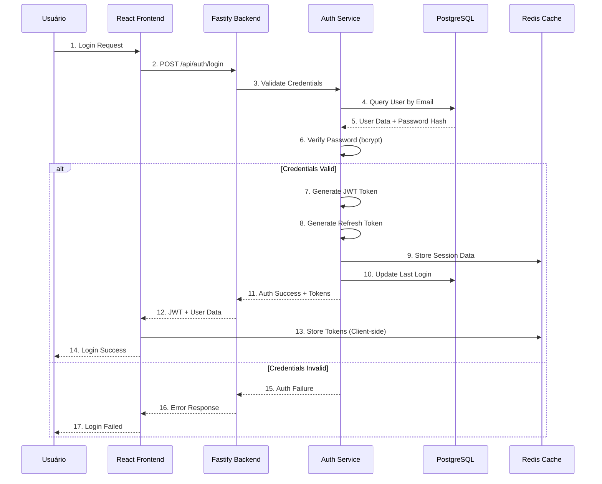

### Refresh Token Flow

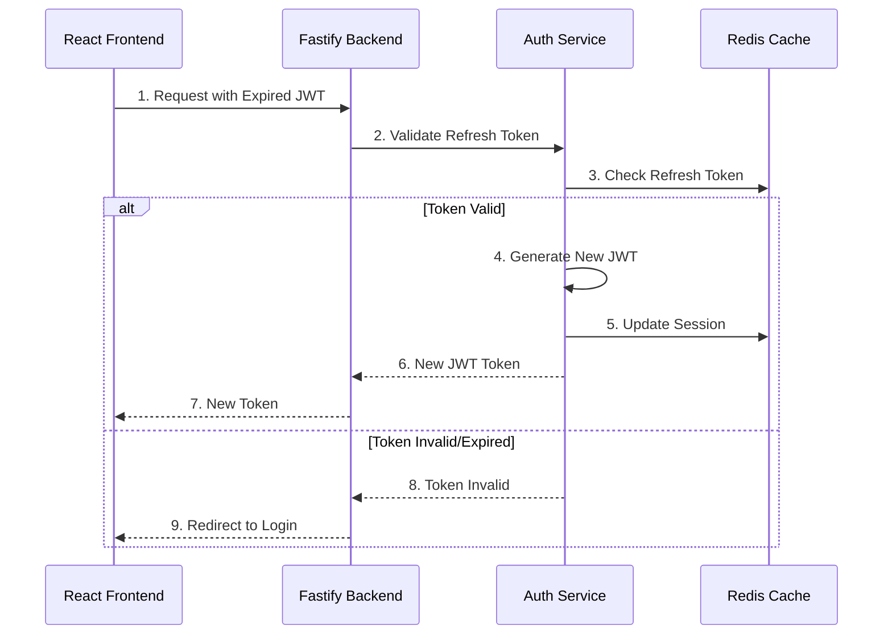

## Fluxo de Dados de Trading

### Execução de Trade

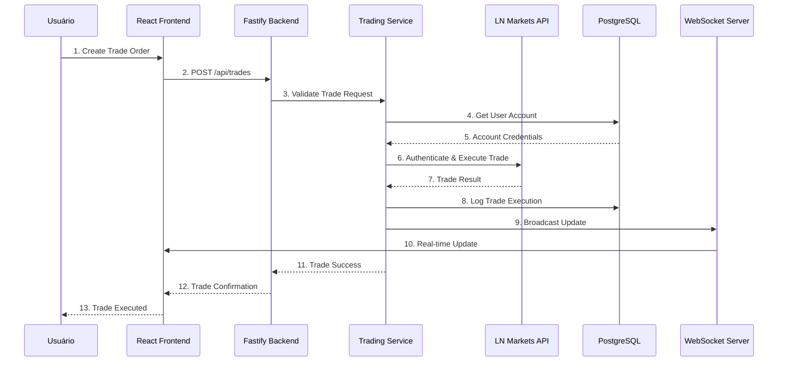

### Consulta de Posições

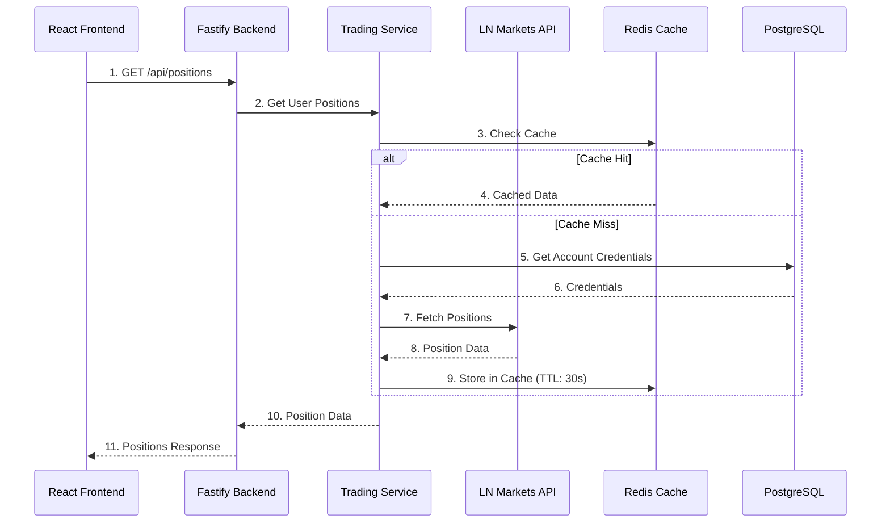

## Fluxo de Dados de Automação

### Criação de Automação

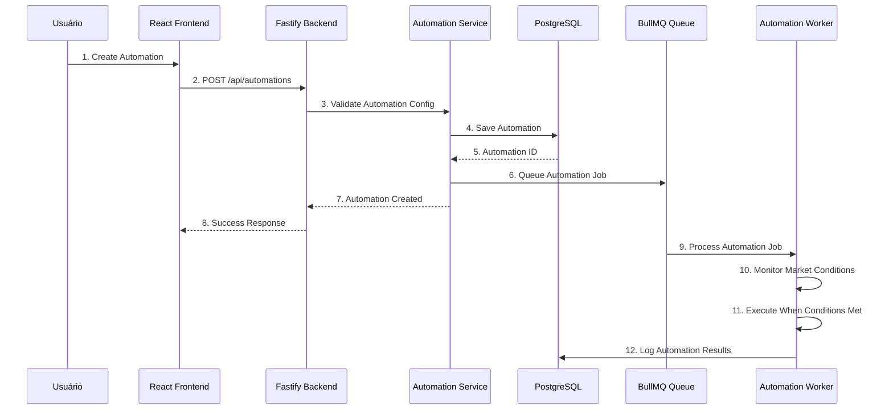

### Execução de Automação

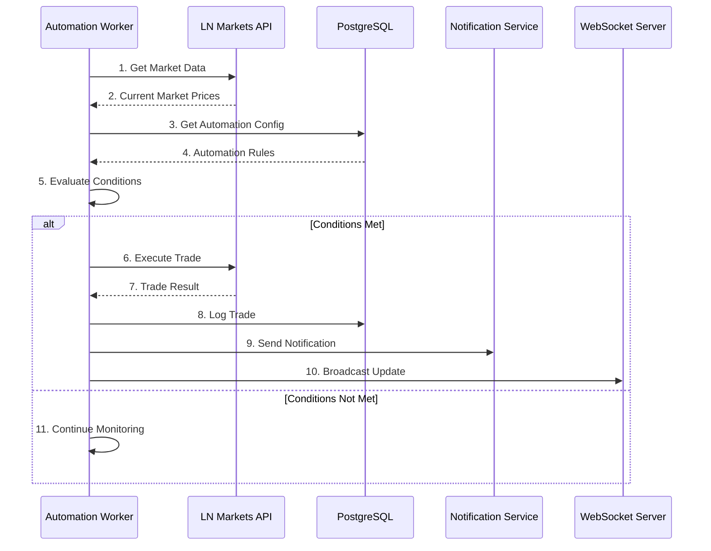

## Fluxo de Dados de Monitoramento

### Margin Guard Monitoring

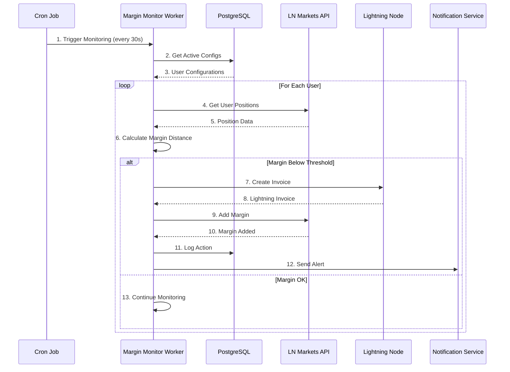

### Health Monitoring

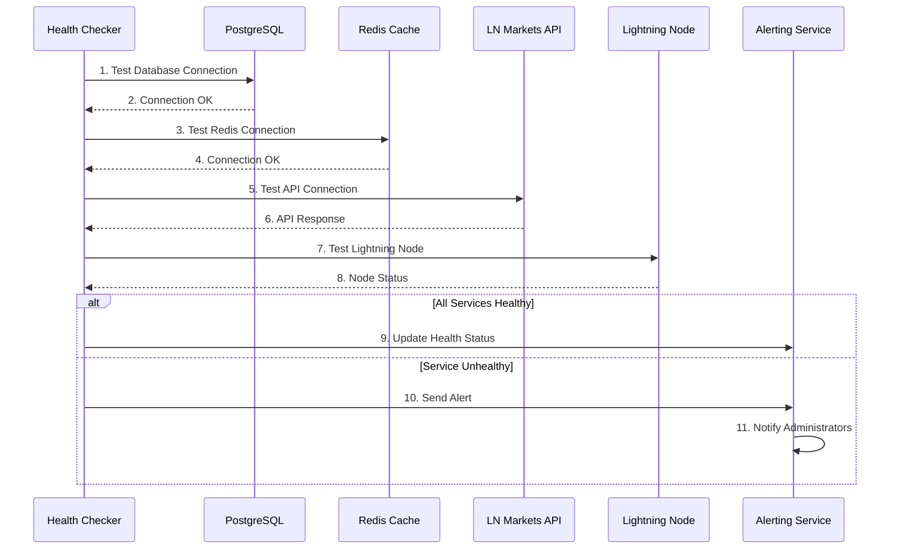

## Fluxo de Dados de Notificação

### Envio de Notificação

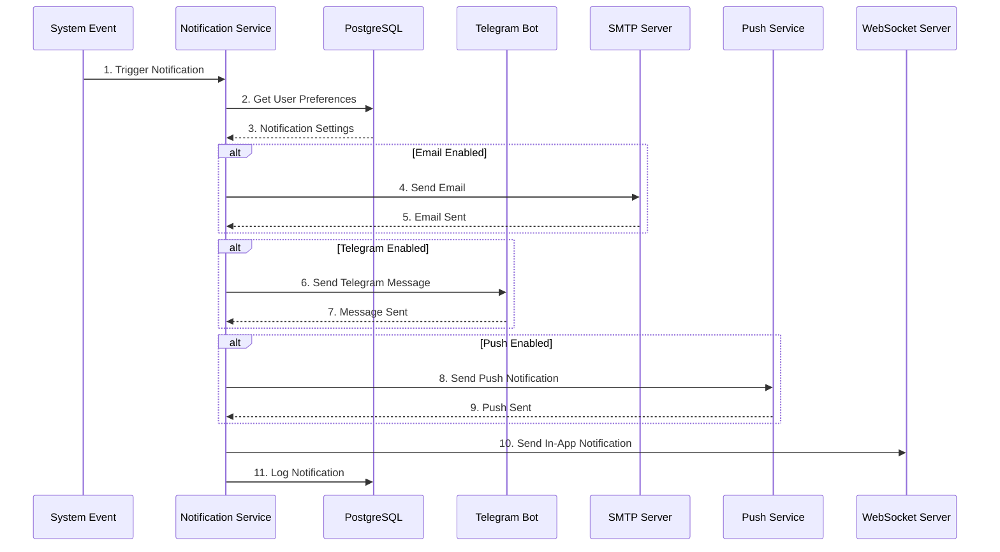

## Fluxo de Dados de Cache

### Cache Strategy

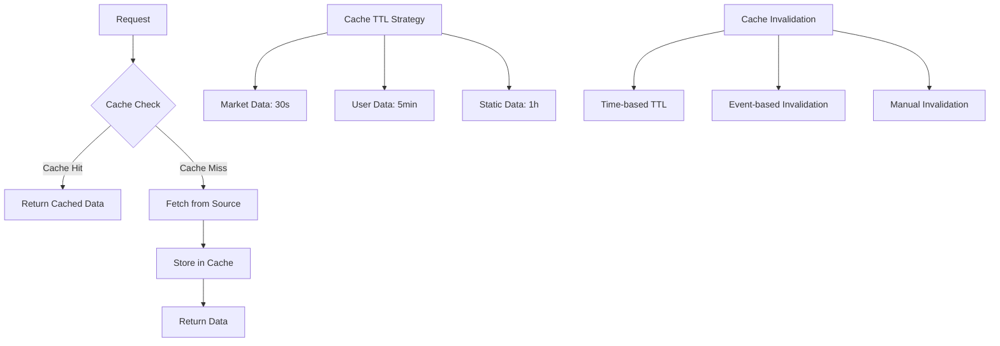

### Cache Implementation

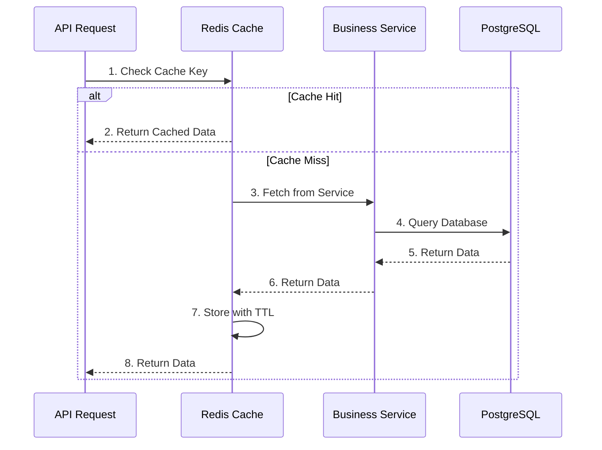

## Fluxo de Dados de Pagamento

### Lightning Payment Flow

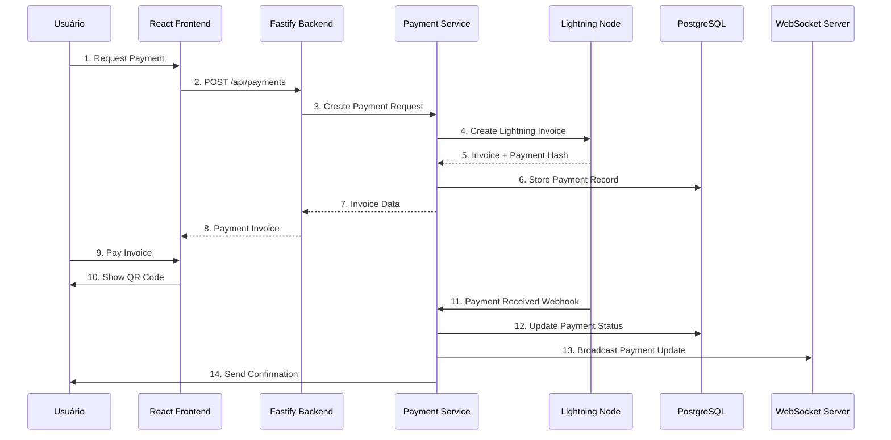

## Fluxo de Dados de WebSocket

### Real-time Data Updates

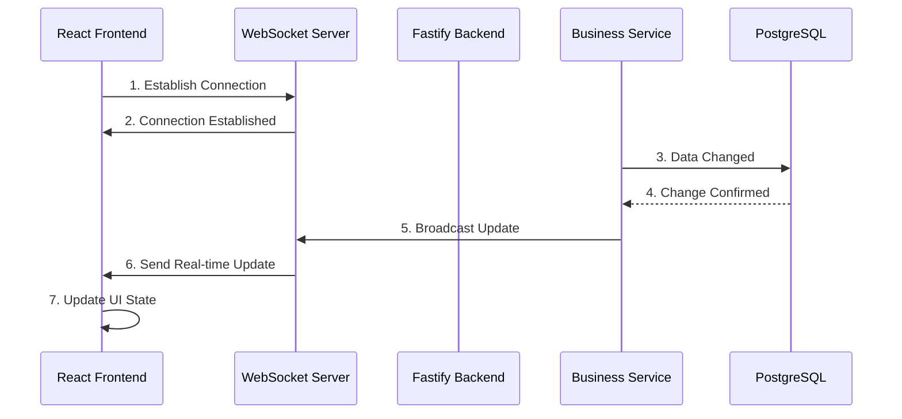

### WebSocket Message Types

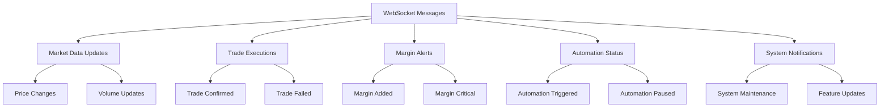

## Referências

- [High Level Architecture](./high-level-architecture.md)
- [Component Interactions](./component-interactions.md)
- [Technology Stack](./technology-stack.md)
- [Database Design](../data-architecture/database-design.md)
- [Caching Strategy](../data-architecture/caching-strategy.md)

## Como Usar Este Documento

• **Para Desenvolvedores**: Use como referência para entender como os dados fluem através do sistema e implementar novos fluxos seguindo os padrões estabelecidos.

• **Para DevOps**: Utilize para identificar gargalos e otimizar o fluxo de dados em produção.

• **Para Troubleshooting**: Use para rastrear problemas de dados e identificar onde falhas podem estar ocorrendo.
