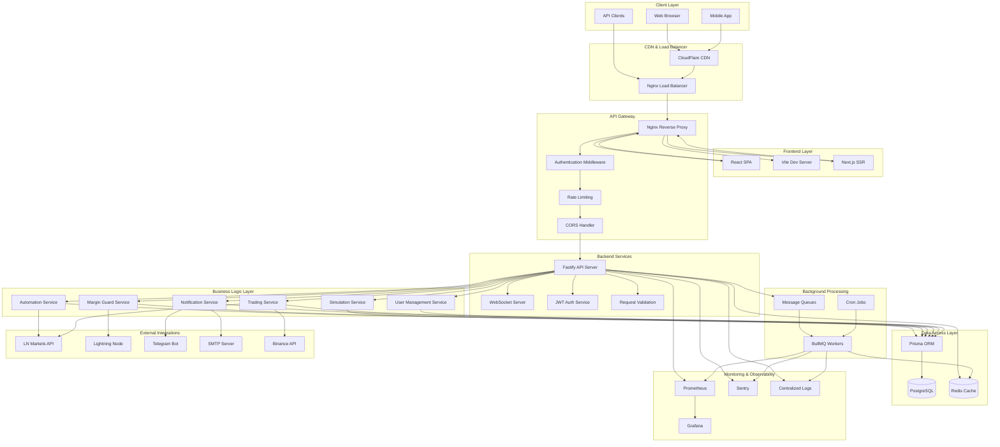
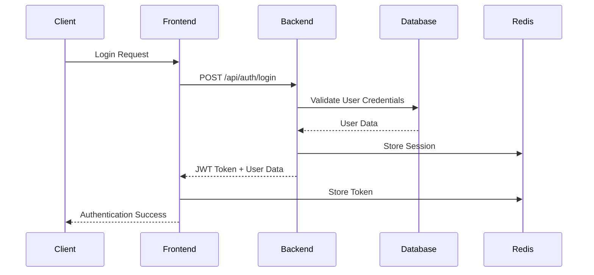
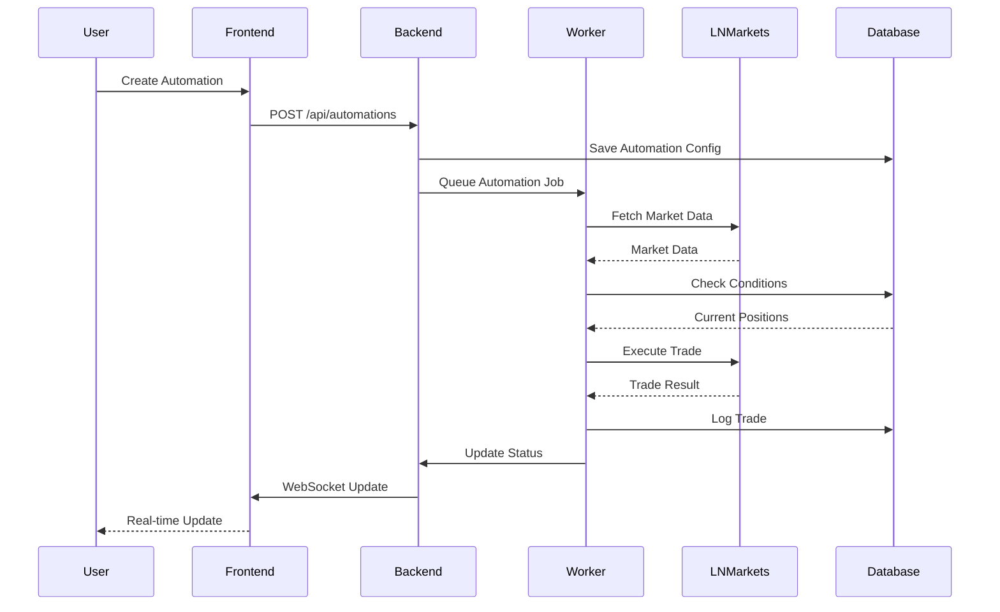
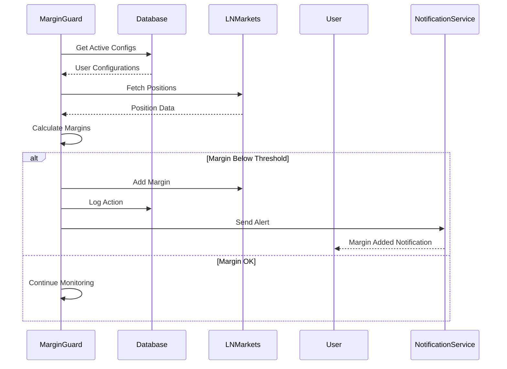

# Axisor - High Level Architecture

> **Status**: Active  
> **Última Atualização**: 2025-01-26  
> **Versão**: 1.0.0  
> **Responsável**: Axisor System Architecture  

## Índice

- [Visão Geral](#visão-geral)
- [Arquitetura do Sistema](#arquitetura-do-sistema)
- [Componentes Principais](#componentes-principais)
- [Fluxo de Dados](#fluxo-de-dados)
- [Padrões de Design](#padrões-de-design)
- [Configuração](#configuração)
- [Integração com Outros Sistemas](#integração-com-outros-sistemas)
- [Pontos Críticos](#pontos-críticos)
- [Checklist de Avaliação](#checklist-de-avaliação)
- [Referências](#referências)

## Visão Geral

O Axisor é uma plataforma completa de automação de trading para LN Markets, implementando uma arquitetura moderna baseada em microserviços, com separação clara entre frontend e backend, processamento assíncrono e monitoramento em tempo real.

## Arquitetura do Sistema

### Diagrama de Arquitetura



### Principais Elementos

- **Frontend Layer**: React SPA com Next.js, Vite para desenvolvimento
- **API Gateway**: Nginx com autenticação, rate limiting e CORS
- **Backend Services**: Fastify com WebSocket, JWT e validação
- **Business Logic**: Serviços especializados para automação, margin guard, simulações
- **Data Access**: Prisma ORM com PostgreSQL e Redis para cache
- **Background Processing**: BullMQ workers para processamento assíncrono
- **External Integrations**: LN Markets, Lightning Node, Telegram, Email
- **Monitoring**: Prometheus, Grafana, Sentry para observabilidade

## Componentes Principais

### Frontend (React/Next.js)

**Localização**: `frontend/src/`

**Responsabilidades**:
- Interface de usuário responsiva
- Gerenciamento de estado com Zustand
- Integração com WebSocket para dados em tempo real
- Autenticação e autorização
- Visualização de dados com Lightweight Charts

**Dependências**:
- React 18 com TypeScript
- Next.js para SSR
- Tailwind CSS para styling
- shadcn/ui para componentes

```typescript
// Estrutura principal do App.tsx
const App = () => {
  return (
    <QueryClientProvider client={queryClient}>
      <ThemeProvider>
        <VersionProvider autoCheck={true}>
          <MarketDataProvider refreshInterval={0}>
            <RealtimeDataProvider>
              <PositionsProvider>
                <NotificationProvider>
                  <AccountProvider>
                    <BrowserRouter>
                      <Routes>
                        {/* Rotas da aplicação */}
                      </Routes>
                    </BrowserRouter>
                  </AccountProvider>
                </NotificationProvider>
              </PositionsProvider>
            </RealtimeDataProvider>
          </MarketDataProvider>
        </VersionProvider>
      </ThemeProvider>
    </QueryClientProvider>
  );
};
```

### Backend (Fastify/Node.js)

**Localização**: `backend/src/`

**Responsabilidades**:
- API REST com Fastify
- WebSocket para comunicação em tempo real
- Autenticação JWT
- Validação de requests
- Integração com banco de dados

**Dependências**:
- Node.js 18+ com TypeScript
- Fastify como framework web
- Prisma como ORM
- PostgreSQL como banco principal
- Redis para cache e sessões

```typescript
// Estrutura principal do servidor
const fastify = Fastify({
  logger: config.isDevelopment ? {
    level: config.log.level,
    transport: {
      target: 'pino-pretty',
      options: {
        colorize: true,
        translateTime: 'HH:MM:ss Z',
        ignore: 'pid,hostname',
      },
    },
  } : {
    level: config.log.level,
  },
  trustProxy: true,
});

// Plugins registrados
await fastify.register(cors, { origin: true, credentials: true });
await fastify.register(helmet, { /* security config */ });
await fastify.register(rateLimit, { /* rate limiting */ });
await fastify.register(jwt, { secret: config.jwt.secret });
await fastify.register(websocket);
```

### Database Layer (PostgreSQL + Prisma)

**Localização**: `backend/prisma/schema.prisma`

**Responsabilidades**:
- Armazenamento persistente de dados
- Relacionamentos entre entidades
- Migrações de schema
- Queries otimizadas

**Principais Modelos**:
- User: Gestão de usuários e autenticação
- Automation: Configurações de automação
- TradeLog: Logs de trades executados
- MarginGuardConfig: Configurações do Margin Guard
- Notification: Sistema de notificações
- Payment: Processamento de pagamentos

```prisma
model User {
  id                         String                    @id @default(dbgenerated("(gen_random_uuid())::text"))
  email                      String                    @unique
  username                   String                    @unique
  password_hash              String?
  plan_type                  PlanType                  @default(free)
  is_active                  Boolean                   @default(true)
  created_at                 DateTime                  @default(now()) @db.Timestamp(6)
  updated_at                 DateTime                  @default(now()) @db.Timestamp(6)
  // ... outros campos
}

model Automation {
  id                       String                @id @default(dbgenerated("(gen_random_uuid())::text"))
  user_id                  String
  user_exchange_account_id String
  type                     String
  config                   Json
  is_active                Boolean               @default(true)
  status                   String                @default("active")
  // ... outros campos
}
```

### Background Workers (BullMQ)

**Localização**: `backend/src/workers/`

**Responsabilidades**:
- Processamento assíncrono de tarefas
- Monitoramento de margem
- Execução de automações
- Envio de notificações
- Validação de pagamentos

**Workers Principais**:
- MarginMonitor: Monitora margens em tempo real
- AutomationExecutor: Executa automações
- NotificationWorker: Envia notificações
- PaymentValidator: Valida pagamentos Lightning

```typescript
// Exemplo de worker
export const startPeriodicMonitoring = (prisma: PrismaClient) => {
  const marginMonitor = new Worker('margin-monitor', async (job) => {
    const { userId, accountId } = job.data;
    
    // Lógica de monitoramento
    const positions = await prisma.position.findMany({
      where: { userId, accountId }
    });
    
    // Verificar margens e executar ações
    for (const position of positions) {
      await checkMarginAndExecute(position);
    }
  }, {
    connection: redis,
    concurrency: 5
  });
};
```

## Fluxo de Dados

### Fluxo Principal de Autenticação



### Fluxo de Execução de Automação



### Fluxo de Monitoramento de Margem



## Padrões de Design

### Padrão 1: Repository Pattern

**Aplicação**: Camada de acesso a dados

```typescript
// Exemplo de repository
class UserRepository {
  constructor(private prisma: PrismaClient) {}
  
  async findByEmail(email: string): Promise<User | null> {
    return this.prisma.user.findUnique({
      where: { email }
    });
  }
  
  async create(userData: CreateUserData): Promise<User> {
    return this.prisma.user.create({
      data: userData
    });
  }
  
  async update(id: string, data: UpdateUserData): Promise<User> {
    return this.prisma.user.update({
      where: { id },
      data
    });
  }
}
```

### Padrão 2: Service Layer Pattern

**Aplicação**: Lógica de negócio

```typescript
// Exemplo de service
class AutomationService {
  constructor(
    private automationRepo: AutomationRepository,
    private lnMarketsService: LNMarketsService,
    private notificationService: NotificationService
  ) {}
  
  async executeAutomation(automationId: string): Promise<void> {
    const automation = await this.automationRepo.findById(automationId);
    
    if (!automation || !automation.is_active) {
      throw new Error('Automation not found or inactive');
    }
    
    const marketData = await this.lnMarketsService.getMarketData();
    const shouldExecute = this.evaluateConditions(automation.config, marketData);
    
    if (shouldExecute) {
      const result = await this.lnMarketsService.executeTrade(automation.config);
      await this.automationRepo.logTrade(automationId, result);
      await this.notificationService.sendTradeNotification(automation.user_id, result);
    }
  }
}
```

### Padrão 3: Observer Pattern

**Aplicação**: Sistema de notificações

```typescript
// Exemplo de observer pattern
class NotificationObserver {
  private subscribers: Map<string, Function[]> = new Map();
  
  subscribe(event: string, callback: Function): void {
    if (!this.subscribers.has(event)) {
      this.subscribers.set(event, []);
    }
    this.subscribers.get(event)!.push(callback);
  }
  
  notify(event: string, data: any): void {
    const callbacks = this.subscribers.get(event) || [];
    callbacks.forEach(callback => callback(data));
  }
}

// Uso
const notificationObserver = new NotificationObserver();

// Subscribe to margin alerts
notificationObserver.subscribe('margin_alert', (data) => {
  // Send Telegram notification
  telegramService.sendAlert(data);
});

// Subscribe to trade executions
notificationObserver.subscribe('trade_executed', (data) => {
  // Send email notification
  emailService.sendTradeConfirmation(data);
});
```

## Configuração

### Configuração Base

```typescript
// backend/src/config/env.ts
export const config = {
  env: {
    NODE_ENV: process.env.NODE_ENV || 'development',
    PORT: parseInt(process.env.PORT || '13010'),
    DATABASE_URL: process.env.DATABASE_URL!,
    REDIS_URL: process.env.REDIS_URL || 'redis://redis:6379',
    JWT_SECRET: process.env.JWT_SECRET!,
    ENCRYPTION_KEY: process.env.ENCRYPTION_KEY!
  },
  
  isDevelopment: process.env.NODE_ENV === 'development',
  isProduction: process.env.NODE_ENV === 'production',
  
  jwt: {
    secret: process.env.JWT_SECRET!,
    expiresIn: '15m'
  },
  
  log: {
    level: process.env.NODE_ENV === 'production' ? 'info' : 'debug'
  }
};
```

### Configuração por Ambiente

```typescript
// Desenvolvimento
const devConfig = {
  cors: { origin: true },
  rateLimit: { max: 1000000, timeWindow: '1 minute' },
  helmet: { contentSecurityPolicy: false },
  logging: { level: 'debug', pretty: true }
};

// Produção
const prodConfig = {
  cors: { origin: ['https://axisor.com'] },
  rateLimit: { max: 1000, timeWindow: '1 minute' },
  helmet: { 
    contentSecurityPolicy: {
      directives: {
        defaultSrc: ["'self'"],
        styleSrc: ["'self'", "'unsafe-inline'"],
        scriptSrc: ["'self'"]
      }
    }
  },
  logging: { level: 'info', pretty: false }
};
```

## Frontend State Management

O frontend utiliza React Context API para gerenciamento de estado global:

- **PositionsContext**: Gerencia posições do usuário e métricas derivadas
- **MarketDataContext**: Gerencia dados de mercado públicos
- **AuthStore**: Gerencia autenticação (Zustand)
- **AutomationStore**: Gerencia automações (Zustand)

Ver: [Frontend State Management](../data-architecture/frontend-state-management.md)

## Integração com Outros Sistemas

### LN Markets API

**Tipo**: REST API

**Método**: HTTPS REST

**Autenticação**: API Key + Secret + Signature

```typescript
class LNMarketsService {
  private baseUrl = 'https://api.lnmarkets.com/v2';
  
  async authenticate(apiKey: string, secret: string): Promise<void> {
    const timestamp = Date.now().toString();
    const signature = this.generateSignature(secret, timestamp);
    
    this.headers = {
      'X-API-Key': apiKey,
      'X-Timestamp': timestamp,
      'X-Signature': signature
    };
  }
  
  async getPositions(): Promise<Position[]> {
    const response = await fetch(`${this.baseUrl}/positions`, {
      headers: this.headers
    });
    return response.json();
  }
}
```

### Lightning Node (LND)

**Tipo**: gRPC API

**Método**: gRPC over HTTPS

**Autenticação**: TLS + Macaroons

```typescript
class LNDService {
  private client: LNDClient;
  
  async initialize(): Promise<void> {
    this.client = new LNDClient({
      macaroon: process.env.LND_MACAROON!,
      cert: process.env.LND_CERT!,
      socket: process.env.LND_SOCKET!
    });
  }
  
  async createInvoice(amount: number, memo: string): Promise<string> {
    const invoice = await this.client.lightning.addInvoice({
      value: amount,
      memo: memo
    });
    return invoice.payment_request;
  }
}
```

### Telegram Bot

**Tipo**: REST API

**Método**: HTTPS REST

**Autenticação**: Bot Token

```typescript
class TelegramService {
  private botToken: string;
  private baseUrl: string;
  
  constructor() {
    this.botToken = process.env.TELEGRAM_BOT_TOKEN!;
    this.baseUrl = `https://api.telegram.org/bot${this.botToken}`;
  }
  
  async sendMessage(chatId: string, text: string): Promise<void> {
    await fetch(`${this.baseUrl}/sendMessage`, {
      method: 'POST',
      headers: { 'Content-Type': 'application/json' },
      body: JSON.stringify({ chat_id: chatId, text })
    });
  }
}
```

## Pontos Críticos

### Segurança

- **Autenticação**: JWT com refresh tokens e 2FA
- **Autorização**: Role-based access control (RBAC)
- **Criptografia**: AES-256 para dados sensíveis
- **Rate Limiting**: Proteção contra ataques DDoS
- **Auditoria**: Logs de todas as operações críticas

### Performance

- **Cache Strategy**: Redis com TTL diferenciado
- **Database Optimization**: Índices otimizados e queries eficientes
- **Lazy Loading**: Carregamento sob demanda de dados
- **Connection Pooling**: Pool de conexões para PostgreSQL
- **CDN**: Assets estáticos via CloudFlare

### Confiabilidade

- **Circuit Breaker**: Proteção contra falhas em cascata
- **Retry Logic**: Tentativas automáticas para operações falhadas
- **Health Checks**: Monitoramento de saúde dos serviços
- **Backup Strategy**: Backup automático com Point-in-Time Recovery
- **Failover**: Redundância para componentes críticos

### Escalabilidade

- **Horizontal Scaling**: Múltiplas instâncias de workers
- **Load Balancing**: Distribuição de carga com Nginx
- **Database Sharding**: Particionamento por usuário
- **Microservices**: Separação de responsabilidades
- **Containerization**: Docker para deploy consistente

## Checklist de Avaliação

### Arquitetura
- [x] Separação clara entre frontend e backend
- [x] Implementação de microserviços especializados
- [x] Documentação de interfaces entre componentes
- [x] Definição de contratos de API com Swagger
- [x] Estratégia de versionamento de API

### Segurança
- [x] Implementação de autenticação JWT robusta
- [x] Controle de acesso baseado em roles
- [x] Criptografia de dados sensíveis
- [x] Validação de entrada em todos os endpoints
- [x] Logs de auditoria para operações críticas

### Performance
- [x] Implementação de cache estratégico com Redis
- [x] Otimização de queries com Prisma
- [x] Lazy loading para dados grandes
- [x] Compressão de responses
- [x] Minificação de assets frontend

### Confiabilidade
- [x] Implementação de circuit breakers
- [x] Estratégia de retry para operações falhadas
- [x] Health checks para todos os serviços
- [x] Backup automático de dados
- [x] Plano de recuperação de desastres

### Escalabilidade
- [x] Suporte a múltiplas instâncias
- [x] Load balancing configurado
- [x] Estratégia de particionamento de dados
- [x] Containerização completa com Docker
- [x] Orquestração com Kubernetes

### Monitoramento
- [x] Logs centralizados com estrutura
- [x] Métricas de performance com Prometheus
- [x] Alertas para falhas críticas
- [x] Dashboard de monitoramento com Grafana
- [x] Error tracking com Sentry

## Referências

- [Código Fonte Backend](../../../backend/src/index.ts)
- [Schema do Banco](../../../backend/prisma/schema.prisma)
- [Frontend App](../../../frontend/src/App.tsx)
- [Data Flow Documentation](../data-architecture/data-flow-diagrams.md)
- [Component Interactions](../system-overview/component-interactions.md)
- [Technology Stack](../system-overview/technology-stack.md)

## Como Usar Este Documento

• **Para Desenvolvedores**: Use como referência para entender a arquitetura geral e implementar novos componentes seguindo os padrões estabelecidos.

• **Para DevOps**: Utilize o checklist de avaliação para validar a implementação da arquitetura em ambientes de produção.

• **Para Arquitetos**: Use como base para evoluções arquiteturais, garantindo que mudanças mantenham a consistência do sistema.
