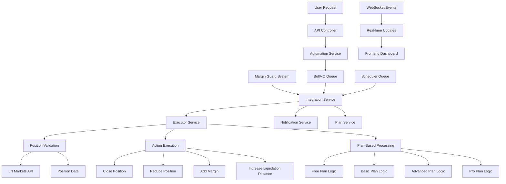
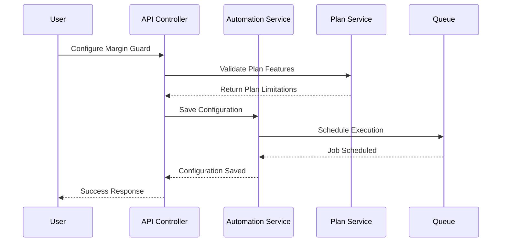
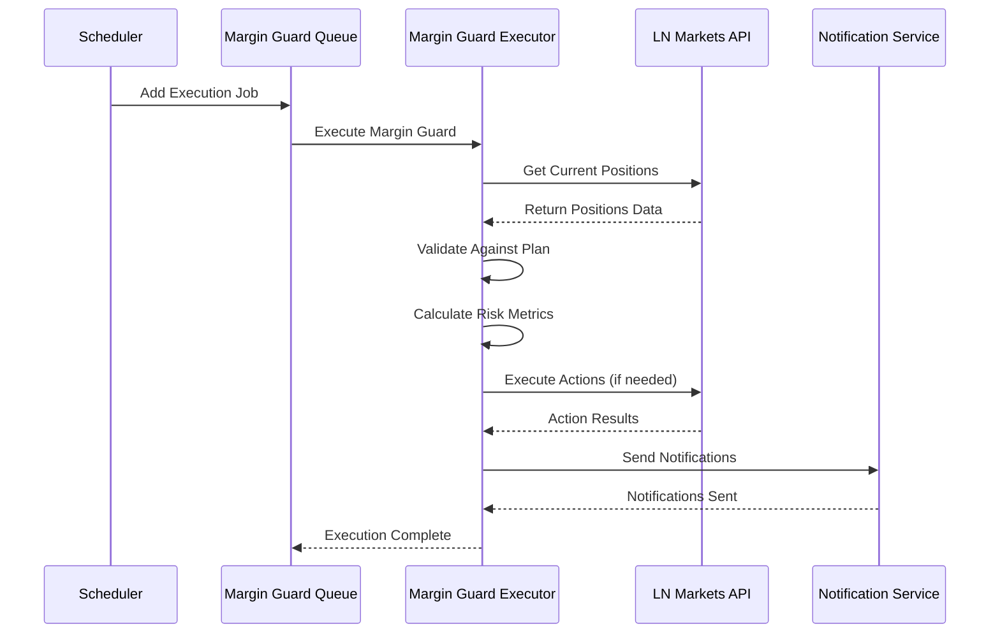
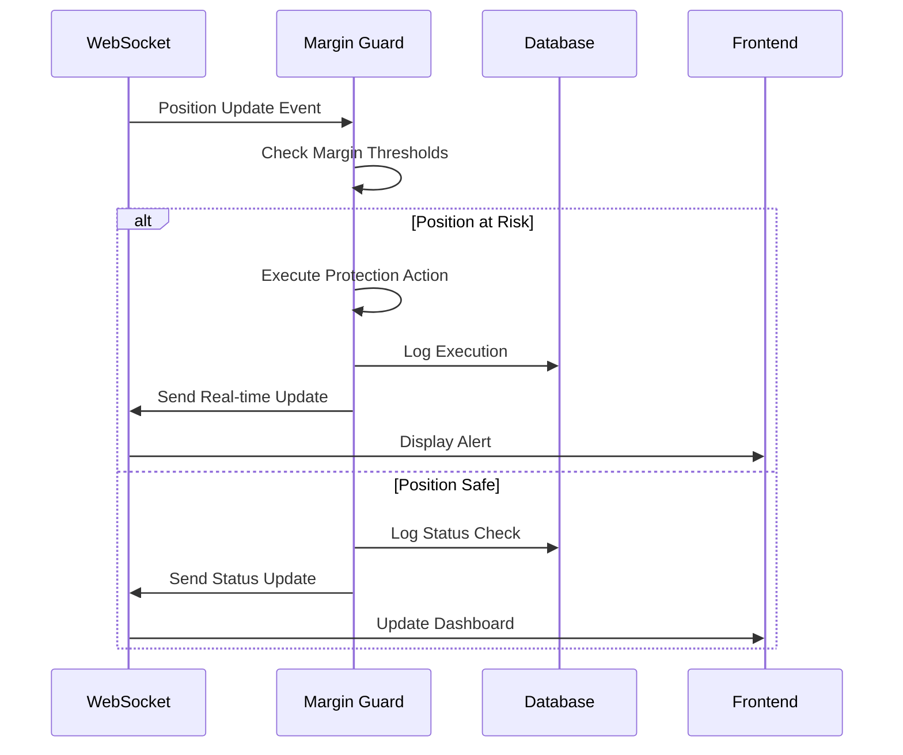

# Margin Guard Architecture

## Summary

Comprehensive architecture documentation for the Margin Guard system, a real-time risk management automation that monitors trading positions and executes protective actions based on margin thresholds. This document covers the complete system design, component interactions, and execution flow.

## Architecture



## Core Components

### 1. Margin Guard Integration Service

**Location**: `backend/src/services/margin-guard-integration.service.ts`

The main orchestrator that coordinates all Margin Guard operations:

```typescript
export class MarginGuardIntegrationService {
  private marginGuardExecutor: MarginGuardExecutorService;
  private marginGuardNotification: MarginGuardNotificationService;
  private marginGuardPlanService: MarginGuardPlanService;
  private automationService: AutomationService;
  private userExchangeAccountService: UserExchangeAccountService;
  private automationLogger: AutomationLoggerService;
  
  private marginGuardQueue: Queue;
  private schedulerQueue: Queue;
}
```

**Responsibilities**:
- Initialize and manage Margin Guard system
- Coordinate between executor, notification, and plan services
- Handle queue management for asynchronous processing
- Manage user-specific Margin Guard executions

### 2. Margin Guard Executor Service

**Location**: `backend/src/services/margin-guard-executor.service.ts`

Core execution engine that processes Margin Guard logic:

```typescript
export class MarginGuardExecutorService {
  async executeMarginGuard(data: MarginGuardExecutionData): Promise<MarginGuardExecutionResult> {
    // Get user's plan features and limitations
    const planFeatures = this.marginGuardPlanService.getPlanFeatures(data.planType);
    const planLimitations = this.marginGuardPlanService.getPlanLimitations(data.planType);

    // Validate positions based on plan
    const validPositions = await this.validatePositionsForPlan(
      data.positions,
      data.config,
      planFeatures,
      planLimitations
    );

    // Execute actions based on plan type
    switch (data.planType) {
      case 'free':
        return await this.executeFreePlan(data, validPositions);
      case 'basic':
        return await this.executeBasicPlan(data, validPositions);
      case 'advanced':
        return await this.executeAdvancedPlan(data, validPositions);
      case 'pro':
        return await this.executeProPlan(data, validPositions);
    }
  }
}
```

**Responsibilities**:
- Execute Margin Guard logic based on user plan
- Validate positions against plan limitations
- Process different execution modes (unitário, total, both)
- Execute protective actions (close, reduce, add margin)

### 3. Margin Guard Plan Service

**Location**: `backend/src/services/margin-guard-plan.service.ts`

Manages plan-specific features and limitations:

```typescript
export class MarginGuardPlanService {
  getPlanFeatures(planType: PlanType): MarginGuardFeatures {
    const features = {
      free: {
        maxPositions: 2,
        modes: ['unitario'],
        actions: ['close_position'],
        realTimeMonitoring: false,
        autoClose: true,
        advancedNotifications: false
      },
      basic: {
        maxPositions: 5,
        modes: ['unitario'],
        actions: ['close_position', 'reduce_position'],
        realTimeMonitoring: true,
        autoClose: true,
        advancedNotifications: false
      },
      advanced: {
        maxPositions: 15,
        modes: ['unitario', 'total', 'both'],
        actions: ['close_position', 'reduce_position', 'add_margin'],
        realTimeMonitoring: true,
        autoClose: true,
        advancedNotifications: true
      },
      pro: {
        maxPositions: -1, // Unlimited
        modes: ['unitario', 'total', 'both'],
        actions: ['close_position', 'reduce_position', 'add_margin', 'increase_liquidation_distance'],
        realTimeMonitoring: true,
        autoClose: true,
        advancedNotifications: true
      }
    };

    return features[planType];
  }
}
```

### 4. Margin Guard Notification Service

**Location**: `backend/src/services/margin-guard-notification.service.ts`

Handles all notification logic for Margin Guard events:

```typescript
export class MarginGuardNotificationService {
  async sendNotifications(notificationData: MarginGuardNotificationData): Promise<void> {
    const { userId, automationId, planType, actions, positions, executionTime } = notificationData;

    // Determine notification channels based on plan
    const channels = this.getNotificationChannels(planType);
    
    // Send notifications through enabled channels
    for (const channel of channels) {
      await this.sendNotificationThroughChannel(channel, notificationData);
    }
  }

  private getNotificationChannels(planType: string): string[] {
    const channels = {
      free: ['email'],
      basic: ['email', 'telegram'],
      advanced: ['email', 'telegram', 'webhook'],
      pro: ['email', 'telegram', 'webhook', 'sms']
    };

    return channels[planType] || ['email'];
  }
}
```

## Data Flow

### 1. Configuration Flow



### 2. Execution Flow



### 3. Real-time Monitoring Flow



## Plan-Specific Logic

### Free Plan Execution

```typescript
private async executeFreePlan(
  data: MarginGuardExecutionData,
  validPositions: any[]
): Promise<MarginGuardExecutionResult> {
  const result: MarginGuardExecutionResult = {
    success: false,
    actions: [],
    notifications: [],
    errors: []
  };

  // Free plan: Only 2 positions, unitario mode only
  const positions = validPositions.slice(0, 2);
  
  for (const position of positions) {
    const distanceToLiquidation = this.calculateDistanceToLiquidation(position);
    
    if (distanceToLiquidation <= data.config.marginThreshold / 100) {
      // Execute close position action
      const actionResult = await this.executeClosePosition(position, data.userId);
      
      result.actions.push({
        positionId: position.id,
        action: 'close_position',
        executed: actionResult.success,
        timestamp: new Date().toISOString()
      });
    }
  }

  result.success = result.actions.length > 0;
  return result;
}
```

### Advanced Plan Execution

```typescript
private async executeAdvancedPlan(
  data: MarginGuardExecutionData,
  validPositions: any[]
): Promise<MarginGuardExecutionResult> {
  const result: MarginGuardExecutionResult = {
    success: false,
    actions: [],
    notifications: [],
    errors: []
  };

  // Advanced plan: Up to 15 positions, multiple modes
  const positions = validPositions.slice(0, 15);
  
  switch (data.config.protectionMode) {
    case 'unitario':
      // Process each position individually
      for (const position of positions) {
        await this.processIndividualPosition(position, data, result);
      }
      break;
      
    case 'total':
      // Process all positions as a group
      await this.processTotalPositions(positions, data, result);
      break;
      
    case 'both':
      // Process both individual and total
      await this.processIndividualPositions(positions, data, result);
      await this.processTotalPositions(positions, data, result);
      break;
  }

  result.success = result.actions.length > 0;
  return result;
}
```

## Queue Management

### BullMQ Integration

```typescript
// Margin Guard Queue Configuration
const marginGuardQueue = new Queue('margin-guard-queue', {
  connection: redisConnection,
  defaultJobOptions: {
    priority: 10, // Highest priority
    removeOnComplete: 100,
    removeOnFail: 50,
    attempts: 3,
    backoff: {
      type: 'exponential',
      delay: 2000,
    },
  },
});

// Scheduler Queue for recurring executions
const schedulerQueue = new Queue('margin-guard-scheduler-queue', {
  connection: redisConnection,
  defaultJobOptions: {
    priority: 8,
    removeOnComplete: 50,
    removeOnFail: 25,
    attempts: 2,
    backoff: {
      type: 'fixed',
      delay: 5000,
    },
  },
});
```

### Worker Processing

```typescript
// Margin Guard Worker
const marginGuardWorker = new Worker(
  'margin-guard-queue',
  async (job) => {
    const { userId, automationId, config, positions } = job.data;
    
    try {
      const result = await marginGuardExecutor.executeMarginGuard({
        userId,
        automationId,
        config,
        positions,
        planType: config.plan_type
      });
      
      return result;
    } catch (error) {
      console.error('Margin Guard execution failed:', error);
      throw error;
    }
  },
  {
    connection: redisConnection,
    concurrency: 5,
  }
);
```

## Error Handling

### Error Categories

```typescript
enum MarginGuardErrorType {
  VALIDATION_ERROR = 'validation_error',
  PLAN_LIMITATION_ERROR = 'plan_limitation_error',
  API_ERROR = 'api_error',
  EXECUTION_ERROR = 'execution_error',
  NOTIFICATION_ERROR = 'notification_error'
}

class MarginGuardError extends Error {
  constructor(
    message: string,
    public type: MarginGuardErrorType,
    public details?: any
  ) {
    super(message);
    this.name = 'MarginGuardError';
  }
}
```

### Error Recovery

```typescript
private async handleExecutionError(
  error: Error,
  data: MarginGuardExecutionData
): Promise<MarginGuardExecutionResult> {
  const result: MarginGuardExecutionResult = {
    success: false,
    actions: [],
    notifications: [],
    errors: [error.message]
  };

  // Log error for debugging
  await this.automationLogger.logStateChange(
    data.automationId,
    'margin_guard_error',
    `Execution failed: ${error.message}`,
    { error: error.message, stack: error.stack }
  );

  // Attempt to send error notification
  try {
    await this.marginGuardNotification.sendErrorNotification(data.userId, error);
  } catch (notificationError) {
    console.error('Failed to send error notification:', notificationError);
  }

  return result;
}
```

## Performance Optimization

### Caching Strategy

```typescript
class MarginGuardCache {
  private redis: Redis;
  private cachePrefix = 'margin_guard:';
  private ttl = 30; // 30 seconds

  async cachePositionData(userId: string, positions: any[]): Promise<void> {
    const key = `${this.cachePrefix}positions:${userId}`;
    await this.redis.setex(key, this.ttl, JSON.stringify(positions));
  }

  async getCachedPositionData(userId: string): Promise<any[] | null> {
    const key = `${this.cachePrefix}positions:${userId}`;
    const cached = await this.redis.get(key);
    
    if (cached) {
      return JSON.parse(cached);
    }
    
    return null;
  }

  async invalidateUserCache(userId: string): Promise<void> {
    const pattern = `${this.cachePrefix}*:${userId}`;
    const keys = await this.redis.keys(pattern);
    
    if (keys.length > 0) {
      await this.redis.del(...keys);
    }
  }
}
```

### Batch Processing

```typescript
private async processBatchExecutions(
  executions: MarginGuardExecutionData[]
): Promise<MarginGuardExecutionResult[]> {
  const batchSize = 10;
  const results: MarginGuardExecutionResult[] = [];

  for (let i = 0; i < executions.length; i += batchSize) {
    const batch = executions.slice(i, i + batchSize);
    
    const batchPromises = batch.map(execution => 
      this.executeMarginGuard(execution)
    );

    const batchResults = await Promise.allSettled(batchPromises);
    
    for (const result of batchResults) {
      if (result.status === 'fulfilled') {
        results.push(result.value);
      } else {
        results.push({
          success: false,
          actions: [],
          notifications: [],
          errors: [result.reason.message]
        });
      }
    }

    // Small delay between batches to prevent overwhelming the system
    if (i + batchSize < executions.length) {
      await new Promise(resolve => setTimeout(resolve, 100));
    }
  }

  return results;
}
```

## Monitoring and Metrics

### Execution Metrics

```typescript
interface MarginGuardMetrics {
  totalExecutions: number;
  successfulExecutions: number;
  failedExecutions: number;
  averageExecutionTime: number;
  positionsProtected: number;
  actionsExecuted: number;
  notificationsSent: number;
  errorsByType: Record<string, number>;
  planDistribution: Record<string, number>;
}

class MarginGuardMetricsCollector {
  private metrics: MarginGuardMetrics = {
    totalExecutions: 0,
    successfulExecutions: 0,
    failedExecutions: 0,
    averageExecutionTime: 0,
    positionsProtected: 0,
    actionsExecuted: 0,
    notificationsSent: 0,
    errorsByType: {},
    planDistribution: {}
  };

  recordExecution(result: MarginGuardExecutionResult, executionTime: number): void {
    this.metrics.totalExecutions++;
    
    if (result.success) {
      this.metrics.successfulExecutions++;
      this.metrics.positionsProtected += result.actions.length;
      this.metrics.actionsExecuted += result.actions.length;
      this.metrics.notificationsSent += result.notifications.length;
    } else {
      this.metrics.failedExecutions++;
    }

    // Update average execution time
    this.metrics.averageExecutionTime = 
      (this.metrics.averageExecutionTime * (this.metrics.totalExecutions - 1) + executionTime) 
      / this.metrics.totalExecutions;
  }

  recordError(errorType: string): void {
    this.metrics.errorsByType[errorType] = 
      (this.metrics.errorsByType[errorType] || 0) + 1;
  }

  recordPlanUsage(planType: string): void {
    this.metrics.planDistribution[planType] = 
      (this.metrics.planDistribution[planType] || 0) + 1;
  }
}
```

## Security Considerations

### Input Validation

```typescript
const MarginGuardConfigSchema = z.object({
  margin_threshold: z.number().min(0.1).max(100),
  action: z.enum(['close_position', 'reduce_position', 'add_margin', 'increase_liquidation_distance']),
  reduce_percentage: z.number().min(1).max(100).optional(),
  add_margin_amount: z.number().min(0).optional(),
  new_liquidation_distance: z.number().min(0.1).max(100).optional(),
  enabled: z.boolean().optional().default(true),
  plan_type: z.enum(['free', 'basic', 'advanced', 'pro', 'lifetime']),
  selected_positions: z.array(z.string()).max(2).optional(),
  protection_mode: z.enum(['unitario', 'total', 'both']).optional(),
  individual_configs: z.record(z.string(), z.object({
    margin_threshold: z.number().min(0.1).max(100),
    action: z.enum(['close_position', 'reduce_position', 'add_margin', 'increase_liquidation_distance']),
    reduce_percentage: z.number().min(1).max(100).optional(),
    add_margin_amount: z.number().min(0).optional(),
    new_liquidation_distance: z.number().min(0.1).max(100).optional(),
  })).optional(),
  notifications: z.object({
    email: z.boolean().optional().default(true),
    telegram: z.boolean().optional().default(false),
    webhook: z.boolean().optional().default(false),
    sms: z.boolean().optional().default(false)
  }).optional()
});
```

### Rate Limiting

```typescript
class MarginGuardRateLimiter {
  private redis: Redis;
  private rateLimits = {
    free: { executions: 10, period: 3600 }, // 10 per hour
    basic: { executions: 50, period: 3600 }, // 50 per hour
    advanced: { executions: 200, period: 3600 }, // 200 per hour
    pro: { executions: 500, period: 3600 } // 500 per hour
  };

  async checkRateLimit(userId: string, planType: string): Promise<boolean> {
    const limit = this.rateLimits[planType];
    const key = `rate_limit:margin_guard:${userId}`;
    
    const current = await this.redis.incr(key);
    
    if (current === 1) {
      await this.redis.expire(key, limit.period);
    }
    
    return current <= limit.executions;
  }
}
```

## How to Use This Document

- **For System Understanding**: Study the architecture diagram and component relationships
- **For Implementation**: Reference the code examples for each service component
- **For Integration**: Follow the data flow diagrams for proper system integration
- **For Troubleshooting**: Use the error handling patterns and monitoring sections
- **For Performance**: Apply the optimization strategies for better system performance

