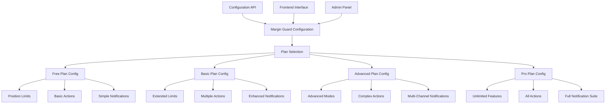

# Margin Guard Configuration Guide

## Summary

Complete configuration guide for the Margin Guard system, covering setup procedures, plan-specific parameters, configuration options, and best practices for different user plans. This document provides step-by-step instructions for configuring Margin Guard across all plan types.

## Configuration Overview



## Plan-Specific Configuration

### Free Plan Configuration

**Limitations**:
- Maximum 2 positions
- Unitário mode only
- Close position action only
- Email notifications only

**Configuration Schema**:
```typescript
interface FreePlanMarginGuardConfig {
  margin_threshold: number; // 0.1-100 (e.g., 85 for 85%)
  action: 'close_position';
  enabled: boolean;
  plan_type: 'free';
  selected_positions: string[]; // Max 2 position IDs
  notifications: {
    email: boolean;
  };
}
```

**Example Configuration**:
```json
{
  "margin_threshold": 85,
  "action": "close_position",
  "enabled": true,
  "plan_type": "free",
  "selected_positions": ["pos_123", "pos_456"],
  "notifications": {
    "email": true
  }
}
```

**Setup Steps**:
1. Select up to 2 positions to monitor
2. Set margin threshold (default: 85%)
3. Enable email notifications
4. Save configuration

### Basic Plan Configuration

**Features**:
- Maximum 5 positions
- Unitário mode only
- Close and reduce position actions
- Email and Telegram notifications
- Real-time monitoring

**Configuration Schema**:
```typescript
interface BasicPlanMarginGuardConfig {
  margin_threshold: number; // 0.1-100
  action: 'close_position' | 'reduce_position';
  reduce_percentage?: number; // 1-100 (for reduce_position)
  enabled: boolean;
  plan_type: 'basic';
  selected_positions: string[]; // Max 5 position IDs
  protection_mode: 'unitario';
  notifications: {
    email: boolean;
    telegram: boolean;
  };
}
```

**Example Configuration**:
```json
{
  "margin_threshold": 80,
  "action": "reduce_position",
  "reduce_percentage": 50,
  "enabled": true,
  "plan_type": "basic",
  "selected_positions": ["pos_123", "pos_456", "pos_789"],
  "protection_mode": "unitario",
  "notifications": {
    "email": true,
    "telegram": true
  }
}
```

**Setup Steps**:
1. Select up to 5 positions to monitor
2. Choose action type (close or reduce)
3. If reducing, set reduction percentage
4. Configure notification channels
5. Save and activate

### Advanced Plan Configuration

**Features**:
- Maximum 15 positions
- Unitário, Total, and Both modes
- Close, reduce, and add margin actions
- Multi-channel notifications
- Advanced monitoring features

**Configuration Schema**:
```typescript
interface AdvancedPlanMarginGuardConfig {
  margin_threshold: number; // 0.1-100
  action: 'close_position' | 'reduce_position' | 'add_margin';
  reduce_percentage?: number; // 1-100
  add_margin_amount?: number; // Satoshis
  enabled: boolean;
  plan_type: 'advanced';
  selected_positions: string[]; // Max 15 position IDs
  protection_mode: 'unitario' | 'total' | 'both';
  notifications: {
    email: boolean;
    telegram: boolean;
    webhook: boolean;
  };
}
```

**Example Configuration**:
```json
{
  "margin_threshold": 75,
  "action": "add_margin",
  "add_margin_amount": 10000,
  "enabled": true,
  "plan_type": "advanced",
  "selected_positions": ["pos_123", "pos_456", "pos_789", "pos_101"],
  "protection_mode": "both",
  "notifications": {
    "email": true,
    "telegram": true,
    "webhook": true
  }
}
```

**Setup Steps**:
1. Select up to 15 positions
2. Choose protection mode
3. Configure action parameters
4. Set up notification channels
5. Configure webhook endpoint (if enabled)
6. Test and activate

### Pro Plan Configuration

**Features**:
- Unlimited positions
- All protection modes
- All action types
- Full notification suite
- Individual position configuration

**Configuration Schema**:
```typescript
interface ProPlanMarginGuardConfig {
  margin_threshold: number; // 0.1-100 (global default)
  action: 'close_position' | 'reduce_position' | 'add_margin' | 'increase_liquidation_distance';
  reduce_percentage?: number;
  add_margin_amount?: number;
  new_liquidation_distance?: number;
  enabled: boolean;
  plan_type: 'pro';
  protection_mode: 'unitario' | 'total' | 'both';
  individual_configs?: Record<string, {
    margin_threshold: number;
    action: string;
    reduce_percentage?: number;
    add_margin_amount?: number;
    new_liquidation_distance?: number;
  }>;
  notifications: {
    email: boolean;
    telegram: boolean;
    webhook: boolean;
    sms: boolean;
  };
}
```

**Example Configuration**:
```json
{
  "margin_threshold": 70,
  "action": "increase_liquidation_distance",
  "new_liquidation_distance": 80,
  "enabled": true,
  "plan_type": "pro",
  "protection_mode": "both",
  "individual_configs": {
    "pos_123": {
      "margin_threshold": 60,
      "action": "close_position"
    },
    "pos_456": {
      "margin_threshold": 75,
      "action": "reduce_position",
      "reduce_percentage": 30
    },
    "pos_789": {
      "margin_threshold": 85,
      "action": "add_margin",
      "add_margin_amount": 5000
    }
  },
  "notifications": {
    "email": true,
    "telegram": true,
    "webhook": true,
    "sms": false
  }
}
```

## Configuration API

### Create/Update Configuration

**Endpoint**: `POST /api/user/margin-guard`

**Request Body**:
```typescript
interface MarginGuardConfigRequest {
  margin_threshold: number;
  action: string;
  reduce_percentage?: number;
  add_margin_amount?: number;
  new_liquidation_distance?: number;
  enabled: boolean;
  plan_type: string;
  protection_mode?: string;
  selected_positions?: string[];
  individual_configs?: Record<string, any>;
  notifications: {
    email?: boolean;
    telegram?: boolean;
    webhook?: boolean;
    sms?: boolean;
  };
}
```

**Response**:
```json
{
  "success": true,
  "config": {
    "id": "mg_config_123",
    "isEnabled": true,
    "settings": {
      "margin_threshold": 80,
      "action": "reduce_position",
      "reduce_percentage": 50,
      "protection_mode": "unitario",
      "notifications": {
        "email": true,
        "telegram": true
      }
    },
    "planFeatures": {
      "maxPositions": 5,
      "realTimeMonitoring": true,
      "autoClose": true,
      "advancedNotifications": false
    },
    "updatedAt": "2025-01-06T10:35:00Z"
  }
}
```

### Get Configuration

**Endpoint**: `GET /api/user/margin-guard`

**Response**:
```json
{
  "success": true,
  "config": {
    "id": "mg_config_123",
    "isEnabled": true,
    "settings": {
      "margin_threshold": 80,
      "action": "reduce_position",
      "reduce_percentage": 50,
      "protection_mode": "unitario",
      "notifications": {
        "email": true,
        "telegram": true
      }
    },
    "planFeatures": {
      "maxPositions": 5,
      "realTimeMonitoring": true,
      "autoClose": true,
      "advancedNotifications": false
    },
    "lastExecution": {
      "timestamp": "2025-01-06T10:30:00Z",
      "action": "notification_sent",
      "positionsChecked": 3,
      "positionsAtRisk": 1
    },
    "createdAt": "2024-12-01T00:00:00Z",
    "updatedAt": "2025-01-06T10:25:00Z"
  }
}
```

### Validate Configuration

**Endpoint**: `POST /api/user/margin-guard/validate`

**Request Body**:
```json
{
  "margin_threshold": 85,
  "action": "reduce_position",
  "reduce_percentage": 50,
  "plan_type": "basic"
}
```

**Response**:
```json
{
  "success": true,
  "validation": {
    "isValid": true,
    "warnings": [],
    "recommendations": [
      "Consider enabling Telegram notifications for faster alerts"
    ]
  }
}
```

## Protection Modes

### Unitário Mode

Processes each position individually based on its own margin threshold.

**Configuration**:
```json
{
  "protection_mode": "unitario",
  "margin_threshold": 80,
  "action": "close_position"
}
```

**Behavior**:
- Each position is evaluated independently
- Actions are executed per position
- Suitable for diversified portfolios

### Total Mode

Processes all positions as a group based on total portfolio margin.

**Configuration**:
```json
{
  "protection_mode": "total",
  "margin_threshold": 75,
  "action": "reduce_position",
  "reduce_percentage": 30
}
```

**Behavior**:
- Portfolio margin is calculated as sum of all positions
- Actions affect the entire portfolio
- Suitable for concentrated positions

### Both Mode

Combines both unitário and total modes for comprehensive protection.

**Configuration**:
```json
{
  "protection_mode": "both",
  "margin_threshold": 80,
  "action": "close_position"
}
```

**Behavior**:
- Individual positions are monitored
- Portfolio margin is also monitored
- Actions can be triggered by either condition
- Maximum protection level

## Action Types

### Close Position

Completely closes the position when margin threshold is reached.

**Configuration**:
```json
{
  "action": "close_position"
}
```

**Use Cases**:
- High-risk positions
- Emergency protection
- Simple risk management

### Reduce Position

Reduces position size by a specified percentage.

**Configuration**:
```json
{
  "action": "reduce_position",
  "reduce_percentage": 50
}
```

**Use Cases**:
- Gradual risk reduction
- Maintaining partial exposure
- Conservative approach

### Add Margin

Adds additional margin to increase liquidation distance.

**Configuration**:
```json
{
  "action": "add_margin",
  "add_margin_amount": 10000
}
```

**Use Cases**:
- Maintaining position size
- Temporary market volatility
- High-conviction positions

### Increase Liquidation Distance

Adjusts position parameters to increase liquidation distance.

**Configuration**:
```json
{
  "action": "increase_liquidation_distance",
  "new_liquidation_distance": 85
}
```

**Use Cases**:
- Pro plan feature
- Advanced position management
- Custom risk parameters

## Notification Configuration

### Email Notifications

```json
{
  "notifications": {
    "email": true
  }
}
```

**Features**:
- Immediate delivery
- Detailed position information
- Action confirmation
- Available on all plans

### Telegram Notifications

```json
{
  "notifications": {
    "telegram": true
  }
}
```

**Features**:
- Real-time delivery
- Mobile-friendly format
- Quick action buttons
- Available on Basic+ plans

### Webhook Notifications

```json
{
  "notifications": {
    "webhook": true,
    "webhook_url": "https://your-app.com/margin-guard-webhook"
  }
}
```

**Features**:
- Custom integration
- Structured JSON payload
- Retry mechanism
- Available on Advanced+ plans

### SMS Notifications

```json
{
  "notifications": {
    "sms": true
  }
}
```

**Features**:
- Emergency alerts
- Offline delivery
- High priority
- Available on Pro plan only

## Best Practices

### Threshold Selection

**Conservative Approach (75-85%)**:
- Suitable for volatile markets
- Provides early warning
- Reduces false positives
- Recommended for beginners

**Moderate Approach (70-80%)**:
- Balanced risk management
- Good for experienced traders
- Allows for market volatility
- Most common configuration

**Aggressive Approach (60-75%)**:
- Maximum position utilization
- Requires active monitoring
- Higher risk tolerance
- Advanced users only

### Action Selection Guidelines

**For Beginners**:
- Start with "close_position"
- Simple and effective
- No complex parameters
- Easy to understand

**For Intermediate Users**:
- Use "reduce_position"
- Maintain partial exposure
- Gradual risk reduction
- More flexible approach

**For Advanced Users**:
- Combine multiple actions
- Use individual configurations
- Leverage all features
- Custom risk management

### Notification Setup

**Essential Notifications**:
- Always enable email
- Add Telegram for speed
- Configure webhook for integration
- Use SMS for critical alerts

**Notification Timing**:
- Immediate for close actions
- 5-minute delay for reduce actions
- 15-minute delay for add margin
- Custom timing for webhooks

## Troubleshooting

### Common Configuration Issues

**Invalid Position IDs**:
```json
{
  "error": "Invalid position IDs",
  "details": ["pos_999", "pos_888"],
  "solution": "Verify position IDs exist and are accessible"
}
```

**Plan Limitation Exceeded**:
```json
{
  "error": "Plan limitation exceeded",
  "details": {
    "maxPositions": 5,
    "providedPositions": 7
  },
  "solution": "Reduce number of positions or upgrade plan"
}
```

**Invalid Threshold Value**:
```json
{
  "error": "Invalid threshold value",
  "details": {
    "provided": 150,
    "validRange": "0.1-100"
  },
  "solution": "Use threshold between 0.1% and 100%"
}
```

### Configuration Validation

**Pre-Save Validation**:
```typescript
async function validateMarginGuardConfig(config: MarginGuardConfigRequest): Promise<ValidationResult> {
  const errors: string[] = [];
  const warnings: string[] = [];

  // Validate threshold
  if (config.margin_threshold < 0.1 || config.margin_threshold > 100) {
    errors.push('Margin threshold must be between 0.1% and 100%');
  }

  // Validate action parameters
  if (config.action === 'reduce_position' && !config.reduce_percentage) {
    errors.push('Reduce percentage is required for reduce_position action');
  }

  // Validate plan limitations
  const planFeatures = getPlanFeatures(config.plan_type);
  if (config.selected_positions.length > planFeatures.maxPositions) {
    errors.push(`Maximum ${planFeatures.maxPositions} positions allowed for ${config.plan_type} plan`);
  }

  return {
    isValid: errors.length === 0,
    errors,
    warnings
  };
}
```

## Migration Between Plans

### Upgrading Configuration

When upgrading from a lower plan to a higher plan:

1. **Preserve Existing Settings**:
   - Keep current threshold and action
   - Maintain notification preferences
   - Preserve enabled status

2. **Add New Features**:
   - Enable additional protection modes
   - Configure new action types
   - Set up additional notifications

3. **Expand Position Coverage**:
   - Add more positions (up to plan limit)
   - Configure individual settings (Pro plan)
   - Enable advanced features

### Downgrading Configuration

When downgrading to a lower plan:

1. **Remove Excess Features**:
   - Reduce position count to plan limit
   - Disable unavailable actions
   - Remove premium notifications

2. **Simplify Configuration**:
   - Use only available protection modes
   - Remove individual configurations
   - Keep only basic notifications

3. **Validate Compatibility**:
   - Ensure all settings are valid
   - Test configuration thoroughly
   - Verify notifications work

## How to Use This Document

- **For Setup**: Follow the plan-specific configuration examples
- **For API Integration**: Use the API endpoint documentation
- **For Troubleshooting**: Reference the common issues and solutions
- **For Best Practices**: Apply the recommended configurations
- **For Migration**: Follow the plan upgrade/downgrade procedures
