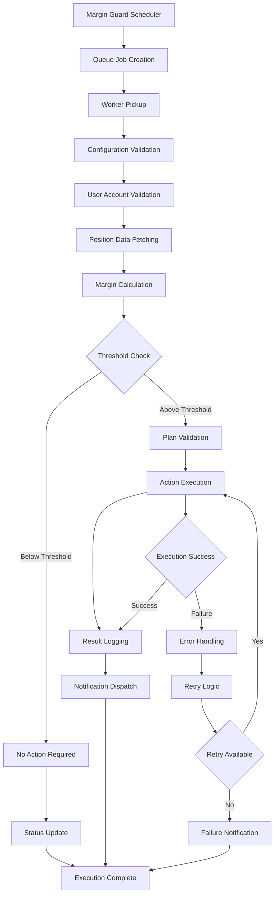

# Margin Guard Execution Flow

## Summary

Detailed documentation of the Margin Guard execution flow, from initialization to completion. This document explains the step-by-step process of how Margin Guard automations are executed, including scheduling, validation, execution, and notification phases.

## Execution Flow Overview



## Phase 1: Scheduling and Initialization

### Scheduler Configuration

```typescript
interface MarginGuardSchedulerConfig {
  executionInterval: number; // Default: 30 seconds
  maxConcurrentJobs: number; // Default: 10
  retryAttempts: number; // Default: 3
  retryDelay: number; // Default: 5000ms
  timeoutMs: number; // Default: 30000ms
}

class MarginGuardScheduler {
  private config: MarginGuardSchedulerConfig;
  private queue: Queue;
  private worker: Worker;

  constructor(config: MarginGuardSchedulerConfig) {
    this.config = config;
    this.queue = new Queue('margin-guard-execution', {
      connection: redisConnection,
      defaultJobOptions: {
        removeOnComplete: 100,
        removeOnFail: 50,
        attempts: this.config.retryAttempts,
        backoff: {
          type: 'exponential',
          delay: this.config.retryDelay
        }
      }
    });
  }

  async scheduleExecution(userId: string, automationId: string): Promise<void> {
    const jobData = {
      userId,
      automationId,
      timestamp: Date.now(),
      executionId: generateExecutionId()
    };

    await this.queue.add('execute-margin-guard', jobData, {
      priority: this.getJobPriority(userId),
      delay: this.calculateDelay(userId),
      jobId: `mg-${userId}-${automationId}-${Date.now()}`
    });
  }

  private getJobPriority(userId: string): number {
    const userPlan = getUserPlan(userId);
    const priorityMap = {
      'free': 1,
      'basic': 2,
      'advanced': 3,
      'pro': 4,
      'lifetime': 5
    };
    return priorityMap[userPlan] || 1;
  }
}
```

### Job Creation Process

```typescript
async function createMarginGuardJob(userId: string, automationId: string): Promise<Job> {
  const jobData = {
    userId,
    automationId,
    timestamp: Date.now(),
    executionId: generateExecutionId(),
    metadata: {
      userAgent: 'MarginGuard-Scheduler',
      version: '2.0',
      source: 'automation'
    }
  };

  const job = await marginGuardQueue.add('execute-margin-guard', jobData, {
    priority: getJobPriority(userId),
    delay: calculateExecutionDelay(userId),
    jobId: `mg-${userId}-${automationId}-${Date.now()}`,
    removeOnComplete: 100,
    removeOnFail: 50,
    attempts: 3,
    backoff: {
      type: 'exponential',
      delay: 5000
    }
  });

  return job;
}
```

## Phase 2: Worker Processing

### Worker Initialization

```typescript
class MarginGuardWorker {
  private queue: Queue;
  private config: WorkerConfig;
  private logger: Logger;

  constructor(config: WorkerConfig) {
    this.config = config;
    this.queue = new Queue('margin-guard-execution', {
      connection: redisConnection
    });
    this.logger = new Logger('MarginGuardWorker');
  }

  async start(): Promise<void> {
    this.queue.process('execute-margin-guard', this.config.maxConcurrentJobs, 
      async (job: Job) => {
        return await this.processMarginGuardExecution(job);
      }
    );

    this.setupEventHandlers();
  }

  private setupEventHandlers(): void {
    this.queue.on('completed', (job: Job) => {
      this.logger.info(`Margin Guard execution completed for job ${job.id}`);
      this.updateExecutionMetrics('completed', job.data);
    });

    this.queue.on('failed', (job: Job, error: Error) => {
      this.logger.error(`Margin Guard execution failed for job ${job.id}:`, error);
      this.updateExecutionMetrics('failed', job.data);
      this.handleExecutionFailure(job, error);
    });

    this.queue.on('stalled', (job: Job) => {
      this.logger.warn(`Margin Guard execution stalled for job ${job.id}`);
      this.handleStalledJob(job);
    });
  }
}
```

### Job Processing

```typescript
async function processMarginGuardExecution(job: Job): Promise<ExecutionResult> {
  const { userId, automationId, executionId } = job.data;
  
  try {
    // Step 1: Validate configuration
    const config = await validateMarginGuardConfig(userId, automationId);
    if (!config.isValid) {
      throw new Error(`Invalid configuration: ${config.error}`);
    }

    // Step 2: Fetch user account data
    const userAccount = await fetchUserAccountData(userId);
    if (!userAccount.isValid) {
      throw new Error(`Invalid user account: ${userAccount.error}`);
    }

    // Step 3: Execute margin guard logic
    const result = await executeMarginGuardLogic(config, userAccount, executionId);
    
    // Step 4: Log execution result
    await logExecutionResult(executionId, result);
    
    // Step 5: Send notifications
    await sendExecutionNotifications(userId, result);
    
    return result;
  } catch (error) {
    await logExecutionError(executionId, error);
    throw error;
  }
}
```

## Phase 3: Configuration Validation

### Configuration Retrieval

```typescript
async function validateMarginGuardConfig(userId: string, automationId: string): Promise<ConfigValidationResult> {
  try {
    // Fetch automation configuration
    const automation = await prisma.automation.findUnique({
      where: { id: automationId, userId },
      include: {
        user: {
          include: {
            plan: true
          }
        }
      }
    });

    if (!automation) {
      return {
        isValid: false,
        error: 'Automation not found',
        code: 'AUTOMATION_NOT_FOUND'
      };
    }

    // Validate configuration schema
    const configValidation = MarginGuardConfigSchema.safeParse(automation.config);
    if (!configValidation.success) {
      return {
        isValid: false,
        error: 'Invalid configuration schema',
        details: configValidation.error.errors,
        code: 'INVALID_CONFIG_SCHEMA'
      };
    }

    // Validate plan-specific limitations
    const planValidation = await validatePlanLimitations(
      automation.user.plan.type,
      configValidation.data
    );

    if (!planValidation.isValid) {
      return {
        isValid: false,
        error: 'Plan limitations exceeded',
        details: planValidation.details,
        code: 'PLAN_LIMITATIONS_EXCEEDED'
      };
    }

    return {
      isValid: true,
      config: configValidation.data,
      user: automation.user,
      automation
    };
  } catch (error) {
    return {
      isValid: false,
      error: error.message,
      code: 'VALIDATION_ERROR'
    };
  }
}
```

### Plan Limitations Validation

```typescript
async function validatePlanLimitations(planType: string, config: MarginGuardConfig): Promise<PlanValidationResult> {
  const planLimits = await planLimitsService.getMarginGuardFeatures(planType);
  
  // Validate position count
  if (config.selected_positions.length > planLimits.maxPositions) {
    return {
      isValid: false,
      details: {
        positionCount: {
          current: config.selected_positions.length,
          limit: planLimits.maxPositions,
          exceeded: true
        }
      }
    };
  }

  // Validate protection mode
  if (!planLimits.availableModes.includes(config.protection_mode)) {
    return {
      isValid: false,
      details: {
        protectionMode: {
          current: config.protection_mode,
          available: planLimits.availableModes,
          supported: false
        }
      }
    };
  }

  // Validate action type
  if (!planLimits.availableActions.includes(config.action)) {
    return {
      isValid: false,
      details: {
        action: {
          current: config.action,
          available: planLimits.availableActions,
          supported: false
        }
      }
    };
  }

  // Validate margin threshold
  if (config.margin_threshold < planLimits.minThreshold) {
    return {
      isValid: false,
      details: {
        marginThreshold: {
          current: config.margin_threshold,
          minimum: planLimits.minThreshold,
          belowMinimum: true
        }
      }
    };
  }

  return { isValid: true };
}
```

## Phase 4: User Account Validation

### Account Data Fetching

```typescript
async function fetchUserAccountData(userId: string): Promise<AccountValidationResult> {
  try {
    // Fetch user exchange accounts
    const exchangeAccounts = await prisma.userExchangeAccount.findMany({
      where: { userId },
      include: {
        credentials: true,
        exchange: true
      }
    });

    if (exchangeAccounts.length === 0) {
      return {
        isValid: false,
        error: 'No exchange accounts found',
        code: 'NO_EXCHANGE_ACCOUNTS'
      };
    }

    // Validate account credentials
    const credentialValidation = await validateAccountCredentials(exchangeAccounts);
    if (!credentialValidation.isValid) {
      return {
        isValid: false,
        error: 'Invalid account credentials',
        details: credentialValidation.details,
        code: 'INVALID_CREDENTIALS'
      };
    }

    // Check account status
    const statusValidation = await validateAccountStatus(exchangeAccounts);
    if (!statusValidation.isValid) {
      return {
        isValid: false,
        error: 'Account status validation failed',
        details: statusValidation.details,
        code: 'INVALID_ACCOUNT_STATUS'
      };
    }

    return {
      isValid: true,
      accounts: exchangeAccounts,
      validatedCredentials: credentialValidation.validatedCredentials
    };
  } catch (error) {
    return {
      isValid: false,
      error: error.message,
      code: 'ACCOUNT_FETCH_ERROR'
    };
  }
}
```

### Credential Validation

```typescript
async function validateAccountCredentials(accounts: UserExchangeAccount[]): Promise<CredentialValidationResult> {
  const validationResults = await Promise.all(
    accounts.map(async (account) => {
      try {
        // Test API connection
        const apiService = new LNMarketsAPIv2({
          apiKey: account.credentials.apiKey,
          apiSecret: account.credentials.apiSecret,
          environment: account.exchange.environment
        });

        // Test API access with a simple call
        const testResult = await apiService.user.getInfo();
        
        if (testResult.success) {
          return {
            accountId: account.id,
            isValid: true,
            lastValidated: new Date()
          };
        } else {
          return {
            accountId: account.id,
            isValid: false,
            error: testResult.error,
            lastValidated: new Date()
          };
        }
      } catch (error) {
        return {
          accountId: account.id,
          isValid: false,
          error: error.message,
          lastValidated: new Date()
        };
      }
    })
  );

  const validAccounts = validationResults.filter(result => result.isValid);
  const invalidAccounts = validationResults.filter(result => !result.isValid);

  return {
    isValid: validAccounts.length > 0,
    validatedCredentials: validAccounts,
    invalidCredentials: invalidAccounts,
    details: {
      total: accounts.length,
      valid: validAccounts.length,
      invalid: invalidAccounts.length
    }
  };
}
```

## Phase 5: Position Data Fetching

### Position Data Retrieval

```typescript
async function fetchPositionData(accounts: UserExchangeAccount[], config: MarginGuardConfig): Promise<PositionDataResult> {
  try {
    const positionPromises = accounts.map(async (account) => {
      try {
        const apiService = new LNMarketsAPIv2({
          apiKey: account.credentials.apiKey,
          apiSecret: account.credentials.apiSecret,
          environment: account.exchange.environment
        });

        // Fetch current positions
        const positionsResponse = await apiService.futures.getPositions();
        
        if (!positionsResponse.success) {
          throw new Error(`Failed to fetch positions: ${positionsResponse.error}`);
        }

        // Filter positions based on configuration
        const filteredPositions = positionsResponse.data.filter(position => 
          config.selected_positions.includes(position.id)
        );

        return {
          accountId: account.id,
          positions: filteredPositions,
          success: true
        };
      } catch (error) {
        return {
          accountId: account.id,
          positions: [],
          success: false,
          error: error.message
        };
      }
    });

    const positionResults = await Promise.all(positionPromises);
    const successfulResults = positionResults.filter(result => result.success);
    const failedResults = positionResults.filter(result => !result.success);

    // Aggregate all positions
    const allPositions = successfulResults.flatMap(result => result.positions);

    return {
      success: successfulResults.length > 0,
      positions: allPositions,
      accountResults: positionResults,
      details: {
        totalAccounts: accounts.length,
        successfulAccounts: successfulResults.length,
        failedAccounts: failedResults.length,
        totalPositions: allPositions.length
      }
    };
  } catch (error) {
    return {
      success: false,
      positions: [],
      error: error.message
    };
  }
}
```

### Market Data Fetching

```typescript
async function fetchMarketData(positions: Position[]): Promise<MarketDataResult> {
  try {
    // Get unique symbols from positions
    const symbols = [...new Set(positions.map(pos => pos.symbol))];
    
    // Fetch current market prices
    const pricePromises = symbols.map(async (symbol) => {
      try {
        const marketData = await marketDataService.getCurrentPrice(symbol);
        return {
          symbol,
          price: marketData.price,
          timestamp: marketData.timestamp,
          success: true
        };
      } catch (error) {
        return {
          symbol,
          price: null,
          timestamp: null,
          success: false,
          error: error.message
        };
      }
    });

    const priceResults = await Promise.all(pricePromises);
    const successfulPrices = priceResults.filter(result => result.success);
    const failedPrices = priceResults.filter(result => !result.success);

    return {
      success: successfulPrices.length > 0,
      prices: successfulPrices,
      failedPrices,
      details: {
        totalSymbols: symbols.length,
        successfulPrices: successfulPrices.length,
        failedPrices: failedPrices.length
      }
    };
  } catch (error) {
    return {
      success: false,
      prices: [],
      error: error.message
    };
  }
}
```

## Phase 6: Margin Calculation and Threshold Check

### Margin Calculation

```typescript
async function calculateMarginLevels(positions: Position[], marketData: MarketData[]): Promise<MarginCalculationResult> {
  try {
    const marginCalculations = positions.map(position => {
      const marketPrice = marketData.find(md => md.symbol === position.symbol);
      
      if (!marketPrice) {
        return {
          positionId: position.id,
          symbol: position.symbol,
          success: false,
          error: 'Market data not available'
        };
      }

      // Calculate current margin level
      const currentMargin = calculateCurrentMargin(position, marketPrice.price);
      const liquidationPrice = calculateLiquidationPrice(position, marketPrice.price);
      const marginLevel = (currentMargin / position.margin) * 100;

      return {
        positionId: position.id,
        symbol: position.symbol,
        currentMargin,
        marginLevel,
        liquidationPrice,
        currentPrice: marketPrice.price,
        success: true
      };
    });

    const successfulCalculations = marginCalculations.filter(calc => calc.success);
    const failedCalculations = marginCalculations.filter(calc => !calc.success);

    return {
      success: successfulCalculations.length > 0,
      calculations: successfulCalculations,
      failedCalculations,
      details: {
        totalPositions: positions.length,
        successfulCalculations: successfulCalculations.length,
        failedCalculations: failedCalculations.length
      }
    };
  } catch (error) {
    return {
      success: false,
      calculations: [],
      error: error.message
    };
  }
}

function calculateCurrentMargin(position: Position, currentPrice: number): number {
  const { side, quantity, entryPrice, margin } = position;
  
  if (side === 'long') {
    return margin + ((currentPrice - entryPrice) * quantity);
  } else {
    return margin + ((entryPrice - currentPrice) * quantity);
  }
}

function calculateLiquidationPrice(position: Position, currentPrice: number): number {
  const { side, quantity, entryPrice, margin } = position;
  
  if (side === 'long') {
    return entryPrice - (margin / quantity);
  } else {
    return entryPrice + (margin / quantity);
  }
}
```

### Threshold Check

```typescript
async function checkMarginThresholds(
  marginCalculations: MarginCalculation[],
  config: MarginGuardConfig
): Promise<ThresholdCheckResult> {
  try {
    const thresholdChecks = marginCalculations.map(calc => {
      const isAboveThreshold = calc.marginLevel >= config.margin_threshold;
      
      return {
        positionId: calc.positionId,
        symbol: calc.symbol,
        marginLevel: calc.marginLevel,
        threshold: config.margin_threshold,
        isAboveThreshold,
        actionRequired: isAboveThreshold,
        riskLevel: getRiskLevel(calc.marginLevel)
      };
    });

    const positionsRequiringAction = thresholdChecks.filter(check => check.actionRequired);
    const positionsBelowThreshold = thresholdChecks.filter(check => !check.actionRequired);

    return {
      success: true,
      thresholdChecks,
      positionsRequiringAction,
      positionsBelowThreshold,
      actionRequired: positionsRequiringAction.length > 0,
      details: {
        totalPositions: marginCalculations.length,
        positionsRequiringAction: positionsRequiringAction.length,
        positionsBelowThreshold: positionsBelowThreshold.length
      }
    };
  } catch (error) {
    return {
      success: false,
      thresholdChecks: [],
      positionsRequiringAction: [],
      positionsBelowThreshold: [],
      actionRequired: false,
      error: error.message
    };
  }
}

function getRiskLevel(marginLevel: number): RiskLevel {
  if (marginLevel >= 95) return 'critical';
  if (marginLevel >= 90) return 'high';
  if (marginLevel >= 80) return 'medium';
  if (marginLevel >= 70) return 'low';
  return 'safe';
}
```

## Phase 7: Action Execution

### Action Execution Logic

```typescript
async function executeMarginGuardActions(
  positionsRequiringAction: ThresholdCheck[],
  config: MarginGuardConfig,
  userPlan: string
): Promise<ActionExecutionResult> {
  try {
    const executionResults = await Promise.all(
      positionsRequiringAction.map(async (position) => {
        try {
          const actionResult = await executeActionForPosition(position, config, userPlan);
          
          return {
            positionId: position.positionId,
            symbol: position.symbol,
            action: config.action,
            success: actionResult.success,
            result: actionResult.result,
            error: actionResult.error
          };
        } catch (error) {
          return {
            positionId: position.positionId,
            symbol: position.symbol,
            action: config.action,
            success: false,
            error: error.message
          };
        }
      })
    );

    const successfulExecutions = executionResults.filter(result => result.success);
    const failedExecutions = executionResults.filter(result => !result.success);

    return {
      success: successfulExecutions.length > 0,
      executionResults,
      successfulExecutions,
      failedExecutions,
      details: {
        totalPositions: positionsRequiringAction.length,
        successfulExecutions: successfulExecutions.length,
        failedExecutions: failedExecutions.length
      }
    };
  } catch (error) {
    return {
      success: false,
      executionResults: [],
      successfulExecutions: [],
      failedExecutions: [],
      error: error.message
    };
  }
}
```

### Position-Specific Action Execution

```typescript
async function executeActionForPosition(
  position: ThresholdCheck,
  config: MarginGuardConfig,
  userPlan: string
): Promise<PositionActionResult> {
  try {
    const apiService = await getAPIServiceForPosition(position.positionId);
    
    switch (config.action) {
      case 'close_position':
        return await executeClosePosition(apiService, position, config);
      
      case 'reduce_position':
        return await executeReducePosition(apiService, position, config);
      
      case 'add_margin':
        return await executeAddMargin(apiService, position, config);
      
      case 'increase_liquidation_distance':
        return await executeIncreaseLiquidationDistance(apiService, position, config);
      
      default:
        throw new Error(`Unsupported action: ${config.action}`);
    }
  } catch (error) {
    return {
      success: false,
      error: error.message
    };
  }
}

async function executeClosePosition(
  apiService: LNMarketsAPIv2,
  position: ThresholdCheck,
  config: MarginGuardConfig
): Promise<PositionActionResult> {
  try {
    const closeResult = await apiService.futures.closePosition({
      positionId: position.positionId,
      reason: 'margin_guard_protection'
    });

    if (closeResult.success) {
      return {
        success: true,
        result: {
          action: 'close_position',
          positionId: position.positionId,
          orderId: closeResult.data.orderId,
          closedAt: new Date(),
          reason: 'margin_guard_protection'
        }
      };
    } else {
      return {
        success: false,
        error: closeResult.error
      };
    }
  } catch (error) {
    return {
      success: false,
      error: error.message
    };
  }
}

async function executeReducePosition(
  apiService: LNMarketsAPIv2,
  position: ThresholdCheck,
  config: MarginGuardConfig
): Promise<PositionActionResult> {
  try {
    const reduceResult = await apiService.futures.reducePosition({
      positionId: position.positionId,
      reducePercentage: config.reduce_percentage || 50,
      reason: 'margin_guard_protection'
    });

    if (reduceResult.success) {
      return {
        success: true,
        result: {
          action: 'reduce_position',
          positionId: position.positionId,
          orderId: reduceResult.data.orderId,
          reducedAt: new Date(),
          reducePercentage: config.reduce_percentage || 50,
          reason: 'margin_guard_protection'
        }
      };
    } else {
      return {
        success: false,
        error: reduceResult.error
      };
    }
  } catch (error) {
    return {
      success: false,
      error: error.message
    };
  }
}
```

## Phase 8: Result Logging and Notification

### Execution Result Logging

```typescript
async function logExecutionResult(executionId: string, result: ExecutionResult): Promise<void> {
  try {
    const logEntry = {
      executionId,
      timestamp: new Date(),
      status: result.success ? 'completed' : 'failed',
      details: {
        totalPositions: result.details?.totalPositions || 0,
        positionsRequiringAction: result.details?.positionsRequiringAction || 0,
        successfulExecutions: result.details?.successfulExecutions || 0,
        failedExecutions: result.details?.failedExecutions || 0
      },
      executionResults: result.executionResults || [],
      error: result.error || null
    };

    await prisma.automationLog.create({
      data: {
        automationId: result.automationId,
        userId: result.userId,
        executionId,
        status: logEntry.status,
        details: logEntry.details,
        result: logEntry.executionResults,
        error: logEntry.error,
        executedAt: logEntry.timestamp
      }
    });

    // Update automation statistics
    await updateAutomationStatistics(result.automationId, logEntry);
  } catch (error) {
    console.error('Failed to log execution result:', error);
  }
}
```

### Notification Dispatch

```typescript
async function sendExecutionNotifications(userId: string, result: ExecutionResult): Promise<void> {
  try {
    const user = await prisma.user.findUnique({
      where: { id: userId },
      include: { preferences: true }
    });

    if (!user) {
      throw new Error('User not found');
    }

    const notificationData = {
      userId,
      executionId: result.executionId,
      status: result.success ? 'completed' : 'failed',
      details: result.details,
      executionResults: result.executionResults,
      timestamp: new Date()
    };

    // Send notifications based on user preferences
    const notificationPromises = [];

    if (user.preferences.emailNotifications) {
      notificationPromises.push(
        sendEmailNotification(user, notificationData)
      );
    }

    if (user.preferences.telegramNotifications) {
      notificationPromises.push(
        sendTelegramNotification(user, notificationData)
      );
    }

    if (user.preferences.webhookNotifications) {
      notificationPromises.push(
        sendWebhookNotification(user, notificationData)
      );
    }

    await Promise.allSettled(notificationPromises);
  } catch (error) {
    console.error('Failed to send notifications:', error);
  }
}
```

## Error Handling and Retry Logic

### Error Classification

```typescript
enum ErrorType {
  CONFIGURATION_ERROR = 'CONFIGURATION_ERROR',
  ACCOUNT_ERROR = 'ACCOUNT_ERROR',
  API_ERROR = 'API_ERROR',
  NETWORK_ERROR = 'NETWORK_ERROR',
  EXECUTION_ERROR = 'EXECUTION_ERROR',
  NOTIFICATION_ERROR = 'NOTIFICATION_ERROR'
}

class ErrorHandler {
  static classifyError(error: Error): ErrorType {
    if (error.message.includes('configuration') || error.message.includes('validation')) {
      return ErrorType.CONFIGURATION_ERROR;
    }
    
    if (error.message.includes('account') || error.message.includes('credential')) {
      return ErrorType.ACCOUNT_ERROR;
    }
    
    if (error.message.includes('API') || error.message.includes('endpoint')) {
      return ErrorType.API_ERROR;
    }
    
    if (error.message.includes('network') || error.message.includes('timeout')) {
      return ErrorType.NETWORK_ERROR;
    }
    
    if (error.message.includes('execution') || error.message.includes('action')) {
      return ErrorType.EXECUTION_ERROR;
    }
    
    if (error.message.includes('notification') || error.message.includes('webhook')) {
      return ErrorType.NOTIFICATION_ERROR;
    }
    
    return ErrorType.EXECUTION_ERROR;
  }

  static shouldRetry(error: Error, attemptCount: number): boolean {
    const errorType = this.classifyError(error);
    const maxAttempts = 3;
    
    if (attemptCount >= maxAttempts) {
      return false;
    }
    
    // Don't retry configuration or account errors
    if (errorType === ErrorType.CONFIGURATION_ERROR || errorType === ErrorType.ACCOUNT_ERROR) {
      return false;
    }
    
    // Retry network and API errors
    if (errorType === ErrorType.NETWORK_ERROR || errorType === ErrorType.API_ERROR) {
      return true;
    }
    
    // Retry execution errors once
    if (errorType === ErrorType.EXECUTION_ERROR && attemptCount < 2) {
      return true;
    }
    
    return false;
  }
}
```

### Retry Logic Implementation

```typescript
class RetryManager {
  private maxAttempts: number;
  private baseDelay: number;
  private maxDelay: number;

  constructor(maxAttempts: number = 3, baseDelay: number = 1000, maxDelay: number = 10000) {
    this.maxAttempts = maxAttempts;
    this.baseDelay = baseDelay;
    this.maxDelay = maxDelay;
  }

  async executeWithRetry<T>(
    operation: () => Promise<T>,
    context: string
  ): Promise<T> {
    let lastError: Error;
    
    for (let attempt = 1; attempt <= this.maxAttempts; attempt++) {
      try {
        return await operation();
      } catch (error) {
        lastError = error;
        
        if (!ErrorHandler.shouldRetry(error, attempt)) {
          throw error;
        }
        
        if (attempt < this.maxAttempts) {
          const delay = this.calculateDelay(attempt);
          await this.sleep(delay);
        }
      }
    }
    
    throw lastError;
  }

  private calculateDelay(attempt: number): number {
    const delay = this.baseDelay * Math.pow(2, attempt - 1);
    return Math.min(delay, this.maxDelay);
  }

  private sleep(ms: number): Promise<void> {
    return new Promise(resolve => setTimeout(resolve, ms));
  }
}
```

## Performance Monitoring

### Execution Metrics

```typescript
class ExecutionMetrics {
  private metrics: Map<string, number> = new Map();
  private timers: Map<string, number> = new Map();

  startTimer(key: string): void {
    this.timers.set(key, Date.now());
  }

  endTimer(key: string): number {
    const startTime = this.timers.get(key);
    if (!startTime) {
      throw new Error(`Timer ${key} not found`);
    }
    
    const duration = Date.now() - startTime;
    this.timers.delete(key);
    return duration;
  }

  incrementCounter(key: string, value: number = 1): void {
    const current = this.metrics.get(key) || 0;
    this.metrics.set(key, current + value);
  }

  setGauge(key: string, value: number): void {
    this.metrics.set(key, value);
  }

  getMetrics(): Record<string, number> {
    return Object.fromEntries(this.metrics);
  }

  reset(): void {
    this.metrics.clear();
    this.timers.clear();
  }
}
```

### Performance Tracking

```typescript
async function trackExecutionPerformance<T>(
  operation: () => Promise<T>,
  operationName: string
): Promise<T> {
  const metrics = new ExecutionMetrics();
  metrics.startTimer(`${operationName}_total`);
  
  try {
    const result = await operation();
    const duration = metrics.endTimer(`${operationName}_total`);
    
    metrics.setGauge(`${operationName}_duration_ms`, duration);
    metrics.incrementCounter(`${operationName}_success`);
    
    return result;
  } catch (error) {
    const duration = metrics.endTimer(`${operationName}_total`);
    
    metrics.setGauge(`${operationName}_duration_ms`, duration);
    metrics.incrementCounter(`${operationName}_failure`);
    
    throw error;
  } finally {
    // Send metrics to monitoring system
    await sendMetricsToMonitoring(metrics.getMetrics());
  }
}
```

## How to Use This Document

- **For Understanding Flow**: Follow the execution phases step by step
- **For Implementation**: Use the code examples as implementation guides
- **For Debugging**: Reference the error handling and retry logic sections
- **For Monitoring**: Implement the performance tracking mechanisms
- **For Optimization**: Analyze the execution flow for performance bottlenecks

