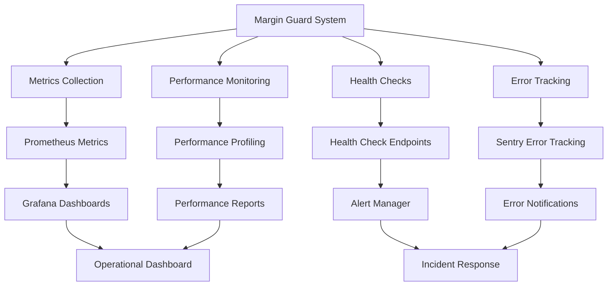

# Margin Guard Monitoring

## Summary

Comprehensive monitoring and observability system for the Margin Guard automation. This document covers metrics collection, alerting, health checks, performance monitoring, and operational dashboards for maintaining the reliability and performance of the Margin Guard system.

## Monitoring Architecture



## Metrics Collection

### Core Metrics

```typescript
interface MarginGuardMetrics {
  // Execution Metrics
  executions_total: Counter;
  executions_successful: Counter;
  executions_failed: Counter;
  execution_duration_seconds: Histogram;
  
  // Position Metrics
  positions_monitored: Gauge;
  positions_requiring_action: Gauge;
  positions_processed: Counter;
  
  // Action Metrics
  actions_executed: Counter;
  actions_successful: Counter;
  actions_failed: Counter;
  action_duration_seconds: Histogram;
  
  // User Metrics
  active_users: Gauge;
  users_with_automations: Gauge;
  users_by_plan: Gauge;
  
  // System Metrics
  queue_size: Gauge;
  worker_health: Gauge;
  api_response_time: Histogram;
  database_connection_pool: Gauge;
}

class MarginGuardMetricsCollector {
  private metrics: MarginGuardMetrics;
  private prometheus: PrometheusClient;

  constructor() {
    this.prometheus = new PrometheusClient();
    this.initializeMetrics();
  }

  private initializeMetrics(): void {
    this.metrics = {
      executions_total: new this.prometheus.Counter({
        name: 'margin_guard_executions_total',
        help: 'Total number of Margin Guard executions',
        labelNames: ['user_plan', 'status', 'automation_type']
      }),

      executions_successful: new this.prometheus.Counter({
        name: 'margin_guard_executions_successful',
        help: 'Number of successful Margin Guard executions',
        labelNames: ['user_plan', 'automation_type']
      }),

      executions_failed: new this.prometheus.Counter({
        name: 'margin_guard_executions_failed',
        help: 'Number of failed Margin Guard executions',
        labelNames: ['user_plan', 'automation_type', 'error_type']
      }),

      execution_duration_seconds: new this.prometheus.Histogram({
        name: 'margin_guard_execution_duration_seconds',
        help: 'Duration of Margin Guard executions',
        labelNames: ['user_plan', 'automation_type'],
        buckets: [0.1, 0.5, 1, 2, 5, 10, 30, 60, 120]
      }),

      positions_monitored: new this.prometheus.Gauge({
        name: 'margin_guard_positions_monitored',
        help: 'Number of positions currently being monitored',
        labelNames: ['user_plan']
      }),

      positions_requiring_action: new this.prometheus.Gauge({
        name: 'margin_guard_positions_requiring_action',
        help: 'Number of positions requiring action',
        labelNames: ['user_plan', 'action_type']
      }),

      positions_processed: new this.prometheus.Counter({
        name: 'margin_guard_positions_processed',
        help: 'Number of positions processed',
        labelNames: ['user_plan', 'action_type', 'status']
      }),

      actions_executed: new this.prometheus.Counter({
        name: 'margin_guard_actions_executed',
        help: 'Number of actions executed',
        labelNames: ['user_plan', 'action_type', 'status']
      }),

      actions_successful: new this.prometheus.Counter({
        name: 'margin_guard_actions_successful',
        help: 'Number of successful actions',
        labelNames: ['user_plan', 'action_type']
      }),

      actions_failed: new this.prometheus.Counter({
        name: 'margin_guard_actions_failed',
        help: 'Number of failed actions',
        labelNames: ['user_plan', 'action_type', 'error_type']
      }),

      action_duration_seconds: new this.prometheus.Histogram({
        name: 'margin_guard_action_duration_seconds',
        help: 'Duration of actions',
        labelNames: ['user_plan', 'action_type'],
        buckets: [0.1, 0.5, 1, 2, 5, 10, 30, 60]
      }),

      active_users: new this.prometheus.Gauge({
        name: 'margin_guard_active_users',
        help: 'Number of active users',
        labelNames: ['user_plan']
      }),

      users_with_automations: new this.prometheus.Gauge({
        name: 'margin_guard_users_with_automations',
        help: 'Number of users with automations',
        labelNames: ['user_plan']
      }),

      users_by_plan: new this.prometheus.Gauge({
        name: 'margin_guard_users_by_plan',
        help: 'Number of users by plan',
        labelNames: ['plan_type']
      }),

      queue_size: new this.prometheus.Gauge({
        name: 'margin_guard_queue_size',
        help: 'Size of the Margin Guard queue',
        labelNames: ['queue_name']
      }),

      worker_health: new this.prometheus.Gauge({
        name: 'margin_guard_worker_health',
        help: 'Health status of workers',
        labelNames: ['worker_id', 'worker_type']
      }),

      api_response_time: new this.prometheus.Histogram({
        name: 'margin_guard_api_response_time_seconds',
        help: 'API response time',
        labelNames: ['endpoint', 'method', 'status_code'],
        buckets: [0.1, 0.5, 1, 2, 5, 10, 30, 60]
      }),

      database_connection_pool: new this.prometheus.Gauge({
        name: 'margin_guard_database_connection_pool',
        help: 'Database connection pool status',
        labelNames: ['pool_type']
      })
    };
  }

  // Metric recording methods
  recordExecution(userPlan: string, automationType: string, status: string, duration: number): void {
    this.metrics.executions_total.inc({ user_plan: userPlan, status, automation_type: automationType });
    this.metrics.execution_duration_seconds.observe({ user_plan: userPlan, automation_type: automationType }, duration);
    
    if (status === 'success') {
      this.metrics.executions_successful.inc({ user_plan: userPlan, automation_type: automationType });
    } else {
      this.metrics.executions_failed.inc({ user_plan: userPlan, automation_type: automationType, error_type: 'execution_error' });
    }
  }

  recordAction(userPlan: string, actionType: string, status: string, duration: number): void {
    this.metrics.actions_executed.inc({ user_plan: userPlan, action_type: actionType, status });
    this.metrics.action_duration_seconds.observe({ user_plan: userPlan, action_type: actionType }, duration);
    
    if (status === 'success') {
      this.metrics.actions_successful.inc({ user_plan: userPlan, action_type: actionType });
    } else {
      this.metrics.actions_failed.inc({ user_plan: userPlan, action_type: actionType, error_type: 'action_error' });
    }
  }

  updatePositionMetrics(userPlan: string, monitored: number, requiringAction: number, actionType: string): void {
    this.metrics.positions_monitored.set({ user_plan: userPlan }, monitored);
    this.metrics.positions_requiring_action.set({ user_plan: userPlan, action_type: actionType }, requiringAction);
  }

  updateUserMetrics(userPlan: string, activeUsers: number, usersWithAutomations: number): void {
    this.metrics.active_users.set({ user_plan: userPlan }, activeUsers);
    this.metrics.users_with_automations.set({ user_plan: userPlan }, usersWithAutomations);
  }

  updateSystemMetrics(queueSize: number, workerHealth: number, apiResponseTime: number): void {
    this.metrics.queue_size.set({ queue_name: 'margin_guard_execution' }, queueSize);
    this.metrics.worker_health.set({ worker_id: 'margin_guard_worker', worker_type: 'execution' }, workerHealth);
    this.metrics.api_response_time.observe({ endpoint: 'margin_guard', method: 'POST', status_code: '200' }, apiResponseTime);
  }
}
```

### Custom Metrics

```typescript
interface CustomMarginGuardMetrics {
  // Business Metrics
  margin_level_distribution: Histogram;
  threshold_breach_frequency: Counter;
  liquidation_risk_score: Gauge;
  
  // Performance Metrics
  cache_hit_rate: Gauge;
  database_query_time: Histogram;
  external_api_latency: Histogram;
  
  // Quality Metrics
  false_positive_rate: Gauge;
  false_negative_rate: Gauge;
  accuracy_score: Gauge;
}

class CustomMetricsCollector {
  private metrics: CustomMarginGuardMetrics;
  private prometheus: PrometheusClient;

  constructor() {
    this.prometheus = new PrometheusClient();
    this.initializeCustomMetrics();
  }

  private initializeCustomMetrics(): void {
    this.metrics = {
      margin_level_distribution: new this.prometheus.Histogram({
        name: 'margin_guard_margin_level_distribution',
        help: 'Distribution of margin levels',
        labelNames: ['user_plan', 'symbol'],
        buckets: [0, 10, 20, 30, 40, 50, 60, 70, 80, 90, 95, 100]
      }),

      threshold_breach_frequency: new this.prometheus.Counter({
        name: 'margin_guard_threshold_breach_frequency',
        help: 'Frequency of threshold breaches',
        labelNames: ['user_plan', 'threshold_level', 'symbol']
      }),

      liquidation_risk_score: new this.prometheus.Gauge({
        name: 'margin_guard_liquidation_risk_score',
        help: 'Liquidation risk score',
        labelNames: ['user_plan', 'symbol', 'risk_level']
      }),

      cache_hit_rate: new this.prometheus.Gauge({
        name: 'margin_guard_cache_hit_rate',
        help: 'Cache hit rate',
        labelNames: ['cache_type']
      }),

      database_query_time: new this.prometheus.Histogram({
        name: 'margin_guard_database_query_time_seconds',
        help: 'Database query time',
        labelNames: ['query_type', 'table'],
        buckets: [0.001, 0.005, 0.01, 0.05, 0.1, 0.5, 1, 2, 5]
      }),

      external_api_latency: new this.prometheus.Histogram({
        name: 'margin_guard_external_api_latency_seconds',
        help: 'External API latency',
        labelNames: ['api_name', 'endpoint'],
        buckets: [0.1, 0.5, 1, 2, 5, 10, 30, 60]
      }),

      false_positive_rate: new this.prometheus.Gauge({
        name: 'margin_guard_false_positive_rate',
        help: 'False positive rate',
        labelNames: ['user_plan', 'time_period']
      }),

      false_negative_rate: new this.prometheus.Gauge({
        name: 'margin_guard_false_negative_rate',
        help: 'False negative rate',
        labelNames: ['user_plan', 'time_period']
      }),

      accuracy_score: new this.prometheus.Gauge({
        name: 'margin_guard_accuracy_score',
        help: 'Accuracy score',
        labelNames: ['user_plan', 'time_period']
      })
    };
  }

  recordMarginLevel(userPlan: string, symbol: string, marginLevel: number): void {
    this.metrics.margin_level_distribution.observe({ user_plan: userPlan, symbol }, marginLevel);
  }

  recordThresholdBreach(userPlan: string, thresholdLevel: number, symbol: string): void {
    this.metrics.threshold_breach_frequency.inc({ user_plan: userPlan, threshold_level: thresholdLevel.toString(), symbol });
  }

  updateLiquidationRisk(userPlan: string, symbol: string, riskLevel: string, score: number): void {
    this.metrics.liquidation_risk_score.set({ user_plan: userPlan, symbol, risk_level: riskLevel }, score);
  }

  updateCacheHitRate(cacheType: string, hitRate: number): void {
    this.metrics.cache_hit_rate.set({ cache_type: cacheType }, hitRate);
  }

  recordDatabaseQuery(queryType: string, table: string, duration: number): void {
    this.metrics.database_query_time.observe({ query_type: queryType, table }, duration);
  }

  recordExternalAPICall(apiName: string, endpoint: string, latency: number): void {
    this.metrics.external_api_latency.observe({ api_name: apiName, endpoint }, latency);
  }

  updateQualityMetrics(userPlan: string, timePeriod: string, falsePositiveRate: number, falseNegativeRate: number, accuracyScore: number): void {
    this.metrics.false_positive_rate.set({ user_plan: userPlan, time_period: timePeriod }, falsePositiveRate);
    this.metrics.false_negative_rate.set({ user_plan: userPlan, time_period: timePeriod }, falseNegativeRate);
    this.metrics.accuracy_score.set({ user_plan: userPlan, time_period: timePeriod }, accuracyScore);
  }
}
```

## Health Checks

### System Health Checks

```typescript
interface HealthCheckResult {
  status: 'healthy' | 'unhealthy' | 'degraded';
  timestamp: Date;
  checks: {
    database: HealthCheck;
    redis: HealthCheck;
    queue: HealthCheck;
    workers: HealthCheck;
    external_apis: HealthCheck;
    notifications: HealthCheck;
  };
  overall_health: number; // 0-100
}

interface HealthCheck {
  status: 'healthy' | 'unhealthy' | 'degraded';
  response_time: number;
  error?: string;
  details?: any;
}

class MarginGuardHealthChecker {
  private prisma: PrismaClient;
  private redis: Redis;
  private queue: Queue;
  private workerManager: WorkerManagerService;
  private notificationService: MarginGuardNotificationService;
  private logger: Logger;

  constructor(
    prisma: PrismaClient,
    redis: Redis,
    queue: Queue,
    workerManager: WorkerManagerService,
    notificationService: MarginGuardNotificationService
  ) {
    this.prisma = prisma;
    this.redis = redis;
    this.queue = queue;
    this.workerManager = workerManager;
    this.notificationService = notificationService;
    this.logger = new Logger('MarginGuardHealthChecker');
  }

  async performHealthCheck(): Promise<HealthCheckResult> {
    const startTime = Date.now();
    
    try {
      const checks = await Promise.allSettled([
        this.checkDatabase(),
        this.checkRedis(),
        this.checkQueue(),
        this.checkWorkers(),
        this.checkExternalAPIs(),
        this.checkNotifications()
      ]);

      const healthChecks = {
        database: this.processCheckResult(checks[0], 'database'),
        redis: this.processCheckResult(checks[1], 'redis'),
        queue: this.processCheckResult(checks[2], 'queue'),
        workers: this.processCheckResult(checks[3], 'workers'),
        external_apis: this.processCheckResult(checks[4], 'external_apis'),
        notifications: this.processCheckResult(checks[5], 'notifications')
      };

      const overallHealth = this.calculateOverallHealth(healthChecks);
      const status = this.determineOverallStatus(overallHealth);

      return {
        status,
        timestamp: new Date(),
        checks: healthChecks,
        overall_health: overallHealth
      };
    } catch (error) {
      this.logger.error('Health check failed:', error);
      return {
        status: 'unhealthy',
        timestamp: new Date(),
        checks: {} as any,
        overall_health: 0
      };
    }
  }

  private async checkDatabase(): Promise<HealthCheck> {
    const startTime = Date.now();
    
    try {
      await this.prisma.$queryRaw`SELECT 1`;
      const responseTime = Date.now() - startTime;
      
      return {
        status: responseTime < 1000 ? 'healthy' : 'degraded',
        response_time: responseTime,
        details: {
          connection_pool: await this.getDatabaseConnectionPoolStatus()
        }
      };
    } catch (error) {
      return {
        status: 'unhealthy',
        response_time: Date.now() - startTime,
        error: error.message
      };
    }
  }

  private async checkRedis(): Promise<HealthCheck> {
    const startTime = Date.now();
    
    try {
      await this.redis.ping();
      const responseTime = Date.now() - startTime;
      
      return {
        status: responseTime < 100 ? 'healthy' : 'degraded',
        response_time: responseTime,
        details: {
          memory_usage: await this.redis.memory('usage'),
          connected_clients: await this.redis.client('list')
        }
      };
    } catch (error) {
      return {
        status: 'unhealthy',
        response_time: Date.now() - startTime,
        error: error.message
      };
    }
  }

  private async checkQueue(): Promise<HealthCheck> {
    const startTime = Date.now();
    
    try {
      const queueStats = await this.queue.getJobCounts();
      const responseTime = Date.now() - startTime;
      
      const isHealthy = queueStats.waiting < 1000 && queueStats.failed < 100;
      
      return {
        status: isHealthy ? 'healthy' : 'degraded',
        response_time: responseTime,
        details: {
          waiting: queueStats.waiting,
          active: queueStats.active,
          completed: queueStats.completed,
          failed: queueStats.failed
        }
      };
    } catch (error) {
      return {
        status: 'unhealthy',
        response_time: Date.now() - startTime,
        error: error.message
      };
    }
  }

  private async checkWorkers(): Promise<HealthCheck> {
    const startTime = Date.now();
    
    try {
      const workerStatus = await this.workerManager.getWorkerStatus();
      const responseTime = Date.now() - startTime;
      
      const healthyWorkers = workerStatus.filter(w => w.status === 'healthy').length;
      const totalWorkers = workerStatus.length;
      const healthRatio = healthyWorkers / totalWorkers;
      
      return {
        status: healthRatio > 0.8 ? 'healthy' : healthRatio > 0.5 ? 'degraded' : 'unhealthy',
        response_time: responseTime,
        details: {
          total_workers: totalWorkers,
          healthy_workers: healthyWorkers,
          health_ratio: healthRatio,
          workers: workerStatus
        }
      };
    } catch (error) {
      return {
        status: 'unhealthy',
        response_time: Date.now() - startTime,
        error: error.message
      };
    }
  }

  private async checkExternalAPIs(): Promise<HealthCheck> {
    const startTime = Date.now();
    
    try {
      const apiChecks = await Promise.allSettled([
        this.checkLNMarketsAPI(),
        this.checkLNDAPI(),
        this.checkNotificationAPIs()
      ]);

      const successfulChecks = apiChecks.filter(result => result.status === 'fulfilled').length;
      const totalChecks = apiChecks.length;
      const successRatio = successfulChecks / totalChecks;
      
      return {
        status: successRatio > 0.8 ? 'healthy' : successRatio > 0.5 ? 'degraded' : 'unhealthy',
        response_time: Date.now() - startTime,
        details: {
          total_apis: totalChecks,
          successful_apis: successfulChecks,
          success_ratio: successRatio,
          api_results: apiChecks.map((result, index) => ({
            api: ['ln_markets', 'lnd', 'notifications'][index],
            status: result.status === 'fulfilled' ? 'healthy' : 'unhealthy',
            error: result.status === 'rejected' ? result.reason : null
          }))
        }
      };
    } catch (error) {
      return {
        status: 'unhealthy',
        response_time: Date.now() - startTime,
        error: error.message
      };
    }
  }

  private async checkNotifications(): Promise<HealthCheck> {
    const startTime = Date.now();
    
    try {
      const notificationStatus = await this.notificationService.getStatus();
      const responseTime = Date.now() - startTime;
      
      return {
        status: notificationStatus.healthy ? 'healthy' : 'degraded',
        response_time: responseTime,
        details: {
          channels: notificationStatus.channels,
          queue_size: notificationStatus.queueSize,
          error_rate: notificationStatus.errorRate
        }
      };
    } catch (error) {
      return {
        status: 'unhealthy',
        response_time: Date.now() - startTime,
        error: error.message
      };
    }
  }

  private processCheckResult(result: PromiseSettledResult<HealthCheck>, checkName: string): HealthCheck {
    if (result.status === 'fulfilled') {
      return result.value;
    } else {
      return {
        status: 'unhealthy',
        response_time: 0,
        error: result.reason
      };
    }
  }

  private calculateOverallHealth(checks: any): number {
    const weights = {
      database: 0.25,
      redis: 0.20,
      queue: 0.20,
      workers: 0.15,
      external_apis: 0.15,
      notifications: 0.05
    };

    let totalScore = 0;
    let totalWeight = 0;

    Object.entries(checks).forEach(([checkName, check]) => {
      const weight = weights[checkName] || 0;
      const score = this.getCheckScore(check);
      
      totalScore += score * weight;
      totalWeight += weight;
    });

    return totalWeight > 0 ? (totalScore / totalWeight) * 100 : 0;
  }

  private getCheckScore(check: HealthCheck): number {
    switch (check.status) {
      case 'healthy': return 100;
      case 'degraded': return 50;
      case 'unhealthy': return 0;
      default: return 0;
    }
  }

  private determineOverallStatus(overallHealth: number): 'healthy' | 'unhealthy' | 'degraded' {
    if (overallHealth >= 80) return 'healthy';
    if (overallHealth >= 50) return 'degraded';
    return 'unhealthy';
  }
}
```

### Health Check Endpoints

```typescript
class HealthCheckController {
  private healthChecker: MarginGuardHealthChecker;

  constructor(healthChecker: MarginGuardHealthChecker) {
    this.healthChecker = healthChecker;
  }

  async getHealthStatus(req: FastifyRequest, reply: FastifyReply): Promise<void> {
    try {
      const healthResult = await this.healthChecker.performHealthCheck();
      
      const statusCode = healthResult.status === 'healthy' ? 200 : 
                        healthResult.status === 'degraded' ? 200 : 503;
      
      reply.code(statusCode).send(healthResult);
    } catch (error) {
      reply.code(503).send({
        status: 'unhealthy',
        timestamp: new Date(),
        error: error.message
      });
    }
  }

  async getLivenessCheck(req: FastifyRequest, reply: FastifyReply): Promise<void> {
    try {
      // Simple liveness check
      await this.healthChecker.checkDatabase();
      reply.code(200).send({ status: 'alive' });
    } catch (error) {
      reply.code(503).send({ status: 'dead', error: error.message });
    }
  }

  async getReadinessCheck(req: FastifyRequest, reply: FastifyReply): Promise<void> {
    try {
      // Check if system is ready to serve requests
      const healthResult = await this.healthChecker.performHealthCheck();
      
      if (healthResult.status === 'healthy' || healthResult.status === 'degraded') {
        reply.code(200).send({ status: 'ready' });
      } else {
        reply.code(503).send({ status: 'not_ready' });
      }
    } catch (error) {
      reply.code(503).send({ status: 'not_ready', error: error.message });
    }
  }
}
```

## Alerting System

### Alert Rules

```typescript
interface AlertRule {
  id: string;
  name: string;
  description: string;
  condition: string;
  severity: 'critical' | 'warning' | 'info';
  enabled: boolean;
  cooldown: number; // seconds
  lastTriggered?: Date;
  recipients: string[];
}

class MarginGuardAlertManager {
  private alertRules: AlertRule[];
  private notificationService: NotificationService;
  private logger: Logger;

  constructor(notificationService: NotificationService) {
    this.notificationService = notificationService;
    this.logger = new Logger('MarginGuardAlertManager');
    this.initializeAlertRules();
  }

  private initializeAlertRules(): void {
    this.alertRules = [
      {
        id: 'high_failure_rate',
        name: 'High Execution Failure Rate',
        description: 'Margin Guard execution failure rate exceeds 10%',
        condition: 'rate(margin_guard_executions_failed[5m]) / rate(margin_guard_executions_total[5m]) > 0.1',
        severity: 'critical',
        enabled: true,
        cooldown: 300, // 5 minutes
        recipients: ['admin@axisor.com', 'ops@axisor.com']
      },
      {
        id: 'queue_backlog',
        name: 'Queue Backlog Warning',
        description: 'Margin Guard queue size exceeds 1000 jobs',
        condition: 'margin_guard_queue_size > 1000',
        severity: 'warning',
        enabled: true,
        cooldown: 600, // 10 minutes
        recipients: ['ops@axisor.com']
      },
      {
        id: 'worker_unhealthy',
        name: 'Worker Health Issue',
        description: 'Margin Guard worker is unhealthy',
        condition: 'margin_guard_worker_health == 0',
        severity: 'critical',
        enabled: true,
        cooldown: 180, // 3 minutes
        recipients: ['admin@axisor.com', 'ops@axisor.com']
      },
      {
        id: 'database_connection_issue',
        name: 'Database Connection Issue',
        description: 'Database connection pool is exhausted',
        condition: 'margin_guard_database_connection_pool < 5',
        severity: 'critical',
        enabled: true,
        cooldown: 300, // 5 minutes
        recipients: ['admin@axisor.com', 'ops@axisor.com']
      },
      {
        id: 'api_response_time_high',
        name: 'High API Response Time',
        description: 'External API response time exceeds 30 seconds',
        condition: 'histogram_quantile(0.95, margin_guard_api_response_time_seconds) > 30',
        severity: 'warning',
        enabled: true,
        cooldown: 600, // 10 minutes
        recipients: ['ops@axisor.com']
      },
      {
        id: 'notification_delivery_failure',
        name: 'Notification Delivery Failure',
        description: 'Notification delivery failure rate exceeds 20%',
        condition: 'rate(notification_delivery_failed[5m]) / rate(notification_delivery_total[5m]) > 0.2',
        severity: 'warning',
        enabled: true,
        cooldown: 900, // 15 minutes
        recipients: ['ops@axisor.com']
      }
    ];
  }

  async evaluateAlerts(metrics: any): Promise<void> {
    for (const rule of this.alertRules) {
      if (!rule.enabled) continue;
      
      try {
        const shouldTrigger = await this.evaluateCondition(rule.condition, metrics);
        
        if (shouldTrigger) {
          await this.triggerAlert(rule);
        }
      } catch (error) {
        this.logger.error(`Failed to evaluate alert rule ${rule.id}:`, error);
      }
    }
  }

  private async evaluateCondition(condition: string, metrics: any): Promise<boolean> {
    // Simple condition evaluation - in production, use a proper expression evaluator
    if (condition.includes('margin_guard_executions_failed') && condition.includes('> 0.1')) {
      const failureRate = metrics.executions_failed / metrics.executions_total;
      return failureRate > 0.1;
    }
    
    if (condition.includes('margin_guard_queue_size > 1000')) {
      return metrics.queue_size > 1000;
    }
    
    if (condition.includes('margin_guard_worker_health == 0')) {
      return metrics.worker_health === 0;
    }
    
    // Add more condition evaluations as needed
    return false;
  }

  private async triggerAlert(rule: AlertRule): Promise<void> {
    // Check cooldown
    if (rule.lastTriggered) {
      const timeSinceLastTrigger = Date.now() - rule.lastTriggered.getTime();
      if (timeSinceLastTrigger < rule.cooldown * 1000) {
        return; // Still in cooldown period
      }
    }

    // Update last triggered time
    rule.lastTriggered = new Date();

    // Send alert notification
    const alertMessage = {
      title: `🚨 ${rule.name}`,
      message: rule.description,
      severity: rule.severity,
      timestamp: new Date(),
      rule_id: rule.id
    };

    for (const recipient of rule.recipients) {
      try {
        await this.notificationService.sendAlert(recipient, alertMessage);
      } catch (error) {
        this.logger.error(`Failed to send alert to ${recipient}:`, error);
      }
    }

    this.logger.warn(`Alert triggered: ${rule.name}`, { rule_id: rule.id, severity: rule.severity });
  }
}
```

## Performance Monitoring

### Performance Profiler

```typescript
class MarginGuardPerformanceProfiler {
  private metrics: Map<string, PerformanceMetric>;
  private logger: Logger;

  constructor() {
    this.metrics = new Map();
    this.logger = new Logger('MarginGuardPerformanceProfiler');
  }

  async profileExecution<T>(
    operation: () => Promise<T>,
    operationName: string,
    metadata?: any
  ): Promise<T> {
    const startTime = Date.now();
    const startMemory = process.memoryUsage();
    
    try {
      const result = await operation();
      const endTime = Date.now();
      const endMemory = process.memoryUsage();
      
      this.recordPerformanceMetric(operationName, {
        duration: endTime - startTime,
        memoryDelta: endMemory.heapUsed - startMemory.heapUsed,
        success: true,
        metadata
      });
      
      return result;
    } catch (error) {
      const endTime = Date.now();
      const endMemory = process.memoryUsage();
      
      this.recordPerformanceMetric(operationName, {
        duration: endTime - startTime,
        memoryDelta: endMemory.heapUsed - startMemory.heapUsed,
        success: false,
        error: error.message,
        metadata
      });
      
      throw error;
    }
  }

  private recordPerformanceMetric(operationName: string, metric: PerformanceMetric): void {
    if (!this.metrics.has(operationName)) {
      this.metrics.set(operationName, {
        operation: operationName,
        totalExecutions: 0,
        successfulExecutions: 0,
        failedExecutions: 0,
        totalDuration: 0,
        averageDuration: 0,
        minDuration: Infinity,
        maxDuration: 0,
        totalMemoryDelta: 0,
        averageMemoryDelta: 0,
        lastExecuted: new Date()
      });
    }

    const existingMetric = this.metrics.get(operationName)!;
    
    existingMetric.totalExecutions++;
    existingMetric.totalDuration += metric.duration;
    existingMetric.totalMemoryDelta += metric.memoryDelta;
    existingMetric.lastExecuted = new Date();
    
    if (metric.success) {
      existingMetric.successfulExecutions++;
    } else {
      existingMetric.failedExecutions++;
    }
    
    existingMetric.averageDuration = existingMetric.totalDuration / existingMetric.totalExecutions;
    existingMetric.averageMemoryDelta = existingMetric.totalMemoryDelta / existingMetric.totalExecutions;
    existingMetric.minDuration = Math.min(existingMetric.minDuration, metric.duration);
    existingMetric.maxDuration = Math.max(existingMetric.maxDuration, metric.duration);
  }

  getPerformanceReport(): PerformanceReport {
    const operations = Array.from(this.metrics.values());
    
    return {
      timestamp: new Date(),
      totalOperations: operations.length,
      operations: operations.sort((a, b) => b.totalExecutions - a.totalExecutions),
      summary: {
        totalExecutions: operations.reduce((sum, op) => sum + op.totalExecutions, 0),
        successfulExecutions: operations.reduce((sum, op) => sum + op.successfulExecutions, 0),
        failedExecutions: operations.reduce((sum, op) => sum + op.failedExecutions, 0),
        averageDuration: operations.reduce((sum, op) => sum + op.averageDuration, 0) / operations.length,
        totalMemoryDelta: operations.reduce((sum, op) => sum + op.totalMemoryDelta, 0)
      }
    };
  }
}
```

## Operational Dashboards

### Grafana Dashboard Configuration

```typescript
interface GrafanaDashboard {
  dashboard: {
    id: number;
    title: string;
    tags: string[];
    timezone: string;
    panels: GrafanaPanel[];
    time: {
      from: string;
      to: string;
    };
    refresh: string;
  };
}

interface GrafanaPanel {
  id: number;
  title: string;
  type: string;
  targets: GrafanaTarget[];
  gridPos: {
    h: number;
    w: number;
    x: number;
    y: number;
  };
  options?: any;
}

const MARGIN_GUARD_DASHBOARD: GrafanaDashboard = {
  dashboard: {
    id: 1,
    title: 'Margin Guard Monitoring',
    tags: ['margin-guard', 'automation', 'trading'],
    timezone: 'browser',
    refresh: '30s',
    time: {
      from: 'now-1h',
      to: 'now'
    },
    panels: [
      {
        id: 1,
        title: 'Execution Rate',
        type: 'graph',
        gridPos: { h: 8, w: 12, x: 0, y: 0 },
        targets: [
          {
            expr: 'rate(margin_guard_executions_total[5m])',
            legendFormat: 'Total Executions'
          },
          {
            expr: 'rate(margin_guard_executions_successful[5m])',
            legendFormat: 'Successful Executions'
          },
          {
            expr: 'rate(margin_guard_executions_failed[5m])',
            legendFormat: 'Failed Executions'
          }
        ]
      },
      {
        id: 2,
        title: 'Execution Duration',
        type: 'graph',
        gridPos: { h: 8, w: 12, x: 12, y: 0 },
        targets: [
          {
            expr: 'histogram_quantile(0.50, margin_guard_execution_duration_seconds)',
            legendFormat: '50th percentile'
          },
          {
            expr: 'histogram_quantile(0.95, margin_guard_execution_duration_seconds)',
            legendFormat: '95th percentile'
          },
          {
            expr: 'histogram_quantile(0.99, margin_guard_execution_duration_seconds)',
            legendFormat: '99th percentile'
          }
        ]
      },
      {
        id: 3,
        title: 'Positions Monitored',
        type: 'singlestat',
        gridPos: { h: 4, w: 6, x: 0, y: 8 },
        targets: [
          {
            expr: 'margin_guard_positions_monitored',
            legendFormat: 'Positions Monitored'
          }
        ]
      },
      {
        id: 4,
        title: 'Positions Requiring Action',
        type: 'singlestat',
        gridPos: { h: 4, w: 6, x: 6, y: 8 },
        targets: [
          {
            expr: 'margin_guard_positions_requiring_action',
            legendFormat: 'Positions Requiring Action'
          }
        ]
      },
      {
        id: 5,
        title: 'Queue Size',
        type: 'singlestat',
        gridPos: { h: 4, w: 6, x: 12, y: 8 },
        targets: [
          {
            expr: 'margin_guard_queue_size',
            legendFormat: 'Queue Size'
          }
        ]
      },
      {
        id: 6,
        title: 'Worker Health',
        type: 'singlestat',
        gridPos: { h: 4, w: 6, x: 18, y: 8 },
        targets: [
          {
            expr: 'margin_guard_worker_health',
            legendFormat: 'Worker Health'
          }
        ]
      },
      {
        id: 7,
        title: 'Actions by Type',
        type: 'piechart',
        gridPos: { h: 8, w: 12, x: 0, y: 12 },
        targets: [
          {
            expr: 'sum by (action_type) (margin_guard_actions_executed)',
            legendFormat: '{{action_type}}'
          }
        ]
      },
      {
        id: 8,
        title: 'Users by Plan',
        type: 'piechart',
        gridPos: { h: 8, w: 12, x: 12, y: 12 },
        targets: [
          {
            expr: 'sum by (plan_type) (margin_guard_users_by_plan)',
            legendFormat: '{{plan_type}}'
          }
        ]
      }
    ]
  }
};
```

## How to Use This Document

- **For Metrics Setup**: Use the metrics collection examples to implement monitoring
- **For Health Checks**: Implement the health check system for system reliability
- **For Alerting**: Configure alert rules based on the provided examples
- **For Performance Monitoring**: Use the performance profiler to track system performance
- **For Dashboards**: Use the Grafana dashboard configuration for operational visibility

