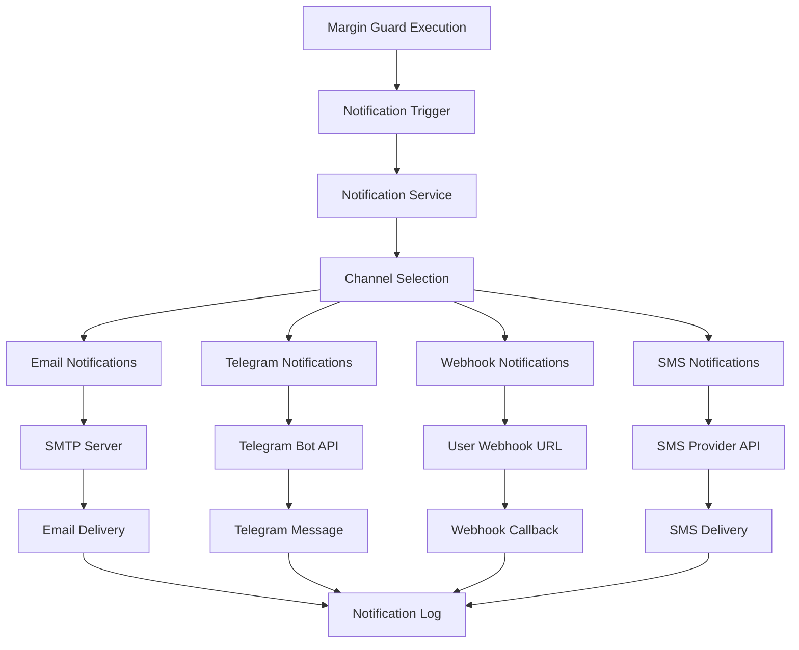

# Margin Guard Notifications

## Summary

Comprehensive documentation of the Margin Guard notification system. This document covers notification channels, templates, delivery mechanisms, user preferences, and integration with external services for alerting users about Margin Guard executions and status changes.

## Notification System Overview



## Notification Channels

### Email Notifications

#### Configuration

```typescript
interface EmailNotificationConfig {
  smtp: {
    host: string;
    port: number;
    secure: boolean;
    auth: {
      user: string;
      pass: string;
    };
  };
  templates: {
    executionSuccess: string;
    executionFailure: string;
    thresholdAlert: string;
    accountWarning: string;
  };
  from: string;
  replyTo: string;
}

class EmailNotificationService {
  private config: EmailNotificationConfig;
  private transporter: nodemailer.Transporter;

  constructor(config: EmailNotificationConfig) {
    this.config = config;
    this.transporter = nodemailer.createTransporter({
      host: config.smtp.host,
      port: config.smtp.port,
      secure: config.smtp.secure,
      auth: config.smtp.auth
    });
  }

  async sendMarginGuardNotification(
    user: User,
    notificationData: MarginGuardNotificationData
  ): Promise<NotificationResult> {
    try {
      const template = this.getTemplate(notificationData.type);
      const htmlContent = this.renderTemplate(template, notificationData);
      const textContent = this.renderTextTemplate(template, notificationData);

      const mailOptions = {
        from: this.config.from,
        to: user.email,
        replyTo: this.config.replyTo,
        subject: this.getSubject(notificationData.type),
        html: htmlContent,
        text: textContent,
        attachments: this.getAttachments(notificationData)
      };

      const result = await this.transporter.sendMail(mailOptions);
      
      return {
        success: true,
        messageId: result.messageId,
        channel: 'email',
        deliveredAt: new Date()
      };
    } catch (error) {
      return {
        success: false,
        error: error.message,
        channel: 'email'
      };
    }
  }
}
```

#### Email Templates

```typescript
const EMAIL_TEMPLATES = {
  executionSuccess: {
    subject: 'Margin Guard Execution Successful - {{symbol}}',
    html: `
      <!DOCTYPE html>
      <html>
      <head>
        <style>
          .container { max-width: 600px; margin: 0 auto; font-family: Arial, sans-serif; }
          .header { background-color: #10b981; color: white; padding: 20px; text-align: center; }
          .content { padding: 20px; background-color: #f9fafb; }
          .success { color: #10b981; font-weight: bold; }
          .details { background-color: white; padding: 15px; border-radius: 5px; margin: 10px 0; }
          .footer { text-align: center; padding: 20px; color: #6b7280; }
        </style>
      </head>
      <body>
        <div class="container">
          <div class="header">
            <h1>Margin Guard Execution Successful</h1>
          </div>
          <div class="content">
            <p>Hello {{userName}},</p>
            <p class="success">Your Margin Guard automation has been executed successfully.</p>
            
            <div class="details">
              <h3>Execution Details:</h3>
              <ul>
                <li><strong>Symbol:</strong> {{symbol}}</li>
                <li><strong>Action:</strong> {{action}}</li>
                <li><strong>Margin Level:</strong> {{marginLevel}}%</li>
                <li><strong>Executed At:</strong> {{executedAt}}</li>
                <li><strong>Order ID:</strong> {{orderId}}</li>
              </ul>
            </div>
            
            <p>Your position has been protected according to your Margin Guard configuration.</p>
          </div>
          <div class="footer">
            <p>This is an automated message from Axisor Margin Guard.</p>
            <p><a href="{{dashboardUrl}}">View Dashboard</a> | <a href="{{settingsUrl}}">Manage Settings</a></p>
          </div>
        </div>
      </body>
      </html>
    `,
    text: `
      Margin Guard Execution Successful
      
      Hello {{userName}},
      
      Your Margin Guard automation has been executed successfully.
      
      Execution Details:
      - Symbol: {{symbol}}
      - Action: {{action}}
      - Margin Level: {{marginLevel}}%
      - Executed At: {{executedAt}}
      - Order ID: {{orderId}}
      
      Your position has been protected according to your Margin Guard configuration.
      
      View Dashboard: {{dashboardUrl}}
      Manage Settings: {{settingsUrl}}
      
      This is an automated message from Axisor Margin Guard.
    `
  },

  executionFailure: {
    subject: 'Margin Guard Execution Failed - {{symbol}}',
    html: `
      <!DOCTYPE html>
      <html>
      <head>
        <style>
          .container { max-width: 600px; margin: 0 auto; font-family: Arial, sans-serif; }
          .header { background-color: #ef4444; color: white; padding: 20px; text-align: center; }
          .content { padding: 20px; background-color: #f9fafb; }
          .error { color: #ef4444; font-weight: bold; }
          .details { background-color: white; padding: 15px; border-radius: 5px; margin: 10px 0; }
          .footer { text-align: center; padding: 20px; color: #6b7280; }
        </style>
      </head>
      <body>
        <div class="container">
          <div class="header">
            <h1>Margin Guard Execution Failed</h1>
          </div>
          <div class="content">
            <p>Hello {{userName}},</p>
            <p class="error">Your Margin Guard automation failed to execute.</p>
            
            <div class="details">
              <h3>Error Details:</h3>
              <ul>
                <li><strong>Symbol:</strong> {{symbol}}</li>
                <li><strong>Action:</strong> {{action}}</li>
                <li><strong>Error:</strong> {{error}}</li>
                <li><strong>Failed At:</strong> {{failedAt}}</li>
                <li><strong>Retry Count:</strong> {{retryCount}}</li>
              </ul>
            </div>
            
            <p>Please check your account settings and try again. If the problem persists, contact support.</p>
          </div>
          <div class="footer">
            <p>This is an automated message from Axisor Margin Guard.</p>
            <p><a href="{{dashboardUrl}}">View Dashboard</a> | <a href="{{supportUrl}}">Contact Support</a></p>
          </div>
        </div>
      </body>
      </html>
    `,
    text: `
      Margin Guard Execution Failed
      
      Hello {{userName}},
      
      Your Margin Guard automation failed to execute.
      
      Error Details:
      - Symbol: {{symbol}}
      - Action: {{action}}
      - Error: {{error}}
      - Failed At: {{failedAt}}
      - Retry Count: {{retryCount}}
      
      Please check your account settings and try again. If the problem persists, contact support.
      
      View Dashboard: {{dashboardUrl}}
      Contact Support: {{supportUrl}}
      
      This is an automated message from Axisor Margin Guard.
    `
  }
};
```

### Telegram Notifications

#### Configuration

```typescript
interface TelegramNotificationConfig {
  botToken: string;
  apiUrl: string;
  templates: {
    executionSuccess: string;
    executionFailure: string;
    thresholdAlert: string;
    accountWarning: string;
  };
  parseMode: 'HTML' | 'Markdown';
}

class TelegramNotificationService {
  private config: TelegramNotificationConfig;
  private bot: TelegramBot;

  constructor(config: TelegramNotificationConfig) {
    this.config = config;
    this.bot = new TelegramBot(config.botToken, {
      polling: false
    });
  }

  async sendMarginGuardNotification(
    user: User,
    notificationData: MarginGuardNotificationData
  ): Promise<NotificationResult> {
    try {
      const chatId = user.telegramChatId;
      
      if (!chatId) {
        return {
          success: false,
          error: 'Telegram chat ID not found',
          channel: 'telegram'
        };
      }

      const template = this.getTemplate(notificationData.type);
      const message = this.renderTemplate(template, notificationData);
      const keyboard = this.getInlineKeyboard(notificationData);

      const result = await this.bot.sendMessage(chatId, message, {
        parse_mode: this.config.parseMode,
        reply_markup: keyboard
      });

      return {
        success: true,
        messageId: result.message_id.toString(),
        channel: 'telegram',
        deliveredAt: new Date()
      };
    } catch (error) {
      return {
        success: false,
        error: error.message,
        channel: 'telegram'
      };
    }
  }
}
```

#### Telegram Templates

```typescript
const TELEGRAM_TEMPLATES = {
  executionSuccess: {
    message: `
      🟢 <b>Margin Guard Execution Successful</b>
      
      Hello {{userName}},
      
      Your Margin Guard automation has been executed successfully.
      
      📊 <b>Execution Details:</b>
      • Symbol: <code>{{symbol}}</code>
      • Action: <code>{{action}}</code>
      • Margin Level: <code>{{marginLevel}}%</code>
      • Executed At: <code>{{executedAt}}</code>
      • Order ID: <code>{{orderId}}</code>
      
      Your position has been protected according to your Margin Guard configuration.
      
      <i>This is an automated message from Axisor Margin Guard.</i>
    `,
    keyboard: {
      inline_keyboard: [
        [
          { text: '📊 View Dashboard', url: '{{dashboardUrl}}' },
          { text: '⚙️ Manage Settings', url: '{{settingsUrl}}' }
        ]
      ]
    }
  },

  executionFailure: {
    message: `
      🔴 <b>Margin Guard Execution Failed</b>
      
      Hello {{userName}},
      
      Your Margin Guard automation failed to execute.
      
      ❌ <b>Error Details:</b>
      • Symbol: <code>{{symbol}}</code>
      • Action: <code>{{action}}</code>
      • Error: <code>{{error}}</code>
      • Failed At: <code>{{failedAt}}</code>
      • Retry Count: <code>{{retryCount}}</code>
      
      Please check your account settings and try again. If the problem persists, contact support.
      
      <i>This is an automated message from Axisor Margin Guard.</i>
    `,
    keyboard: {
      inline_keyboard: [
        [
          { text: '📊 View Dashboard', url: '{{dashboardUrl}}' },
          { text: '🆘 Contact Support', url: '{{supportUrl}}' }
        ]
      ]
    }
  }
};
```

### Webhook Notifications

#### Configuration

```typescript
interface WebhookNotificationConfig {
  timeout: number;
  retryAttempts: number;
  retryDelay: number;
  signatureSecret?: string;
}

class WebhookNotificationService {
  private config: WebhookNotificationConfig;
  private httpClient: AxiosInstance;

  constructor(config: WebhookNotificationConfig) {
    this.config = config;
    this.httpClient = axios.create({
      timeout: config.timeout,
      headers: {
        'Content-Type': 'application/json',
        'User-Agent': 'Axisor-MarginGuard-Webhook/2.0'
      }
    });
  }

  async sendMarginGuardNotification(
    user: User,
    notificationData: MarginGuardNotificationData
  ): Promise<NotificationResult> {
    try {
      const webhookUrl = user.webhookUrl;
      
      if (!webhookUrl) {
        return {
          success: false,
          error: 'Webhook URL not configured',
          channel: 'webhook'
        };
      }

      const payload = this.buildWebhookPayload(notificationData);
      const headers = this.buildWebhookHeaders(payload);

      const response = await this.httpClient.post(webhookUrl, payload, {
        headers,
        timeout: this.config.timeout
      });

      return {
        success: true,
        messageId: response.data.id || response.headers['x-request-id'],
        channel: 'webhook',
        deliveredAt: new Date(),
        statusCode: response.status
      };
    } catch (error) {
      return {
        success: false,
        error: error.message,
        channel: 'webhook',
        statusCode: error.response?.status
      };
    }
  }
}
```

#### Webhook Payload Structure

```typescript
interface WebhookPayload {
  id: string;
  timestamp: string;
  type: 'margin_guard_execution';
  version: string;
  data: {
    executionId: string;
    userId: string;
    automationId: string;
    status: 'success' | 'failure';
    details: {
      symbol: string;
      action: string;
      marginLevel: number;
      threshold: number;
      executedAt: string;
      orderId?: string;
      error?: string;
      retryCount?: number;
    };
    positions: Array<{
      positionId: string;
      symbol: string;
      side: 'long' | 'short';
      quantity: number;
      entryPrice: number;
      currentPrice: number;
      marginLevel: number;
      liquidationPrice: number;
    }>;
    account: {
      accountId: string;
      exchange: string;
      environment: 'testnet' | 'mainnet';
    };
  };
  signature?: string;
}

function buildWebhookPayload(notificationData: MarginGuardNotificationData): WebhookPayload {
  return {
    id: generateWebhookId(),
    timestamp: new Date().toISOString(),
    type: 'margin_guard_execution',
    version: '2.0',
    data: {
      executionId: notificationData.executionId,
      userId: notificationData.userId,
      automationId: notificationData.automationId,
      status: notificationData.status,
      details: {
        symbol: notificationData.symbol,
        action: notificationData.action,
        marginLevel: notificationData.marginLevel,
        threshold: notificationData.threshold,
        executedAt: notificationData.executedAt,
        orderId: notificationData.orderId,
        error: notificationData.error,
        retryCount: notificationData.retryCount
      },
      positions: notificationData.positions,
      account: notificationData.account
    }
  };
}
```

### SMS Notifications

#### Configuration

```typescript
interface SMSNotificationConfig {
  provider: 'twilio' | 'aws-sns' | 'custom';
  credentials: {
    accountSid?: string;
    authToken?: string;
    fromNumber?: string;
    accessKeyId?: string;
    secretAccessKey?: string;
    region?: string;
    apiKey?: string;
    apiSecret?: string;
  };
  templates: {
    executionSuccess: string;
    executionFailure: string;
    thresholdAlert: string;
    accountWarning: string;
  };
}

class SMSNotificationService {
  private config: SMSNotificationConfig;
  private client: any;

  constructor(config: SMSNotificationConfig) {
    this.config = config;
    this.client = this.initializeClient();
  }

  private initializeClient(): any {
    switch (this.config.provider) {
      case 'twilio':
        return twilio(this.config.credentials.accountSid, this.config.credentials.authToken);
      
      case 'aws-sns':
        return new AWS.SNS({
          accessKeyId: this.config.credentials.accessKeyId,
          secretAccessKey: this.config.credentials.secretAccessKey,
          region: this.config.credentials.region
        });
      
      default:
        throw new Error(`Unsupported SMS provider: ${this.config.provider}`);
    }
  }

  async sendMarginGuardNotification(
    user: User,
    notificationData: MarginGuardNotificationData
  ): Promise<NotificationResult> {
    try {
      const phoneNumber = user.phoneNumber;
      
      if (!phoneNumber) {
        return {
          success: false,
          error: 'Phone number not configured',
          channel: 'sms'
        };
      }

      const template = this.getTemplate(notificationData.type);
      const message = this.renderTemplate(template, notificationData);

      const result = await this.sendSMS(phoneNumber, message);

      return {
        success: true,
        messageId: result.messageId || result.MessageId,
        channel: 'sms',
        deliveredAt: new Date()
      };
    } catch (error) {
      return {
        success: false,
        error: error.message,
        channel: 'sms'
      };
    }
  }
}
```

#### SMS Templates

```typescript
const SMS_TEMPLATES = {
  executionSuccess: `
    🟢 Margin Guard Success
    {{symbol}} - {{action}}
    Margin: {{marginLevel}}%
    Order: {{orderId}}
    {{dashboardUrl}}
  `,

  executionFailure: `
    🔴 Margin Guard Failed
    {{symbol}} - {{action}}
    Error: {{error}}
    Retry: {{retryCount}}
    {{supportUrl}}
  `,

  thresholdAlert: `
    ⚠️ Margin Alert
    {{symbol}} at {{marginLevel}}%
    Threshold: {{threshold}}%
    Action: {{action}}
    {{dashboardUrl}}
  `,

  accountWarning: `
    ⚠️ Account Warning
    {{message}}
    Check: {{dashboardUrl}}
    Support: {{supportUrl}}
  `
};
```

## User Preferences Management

### Preference Configuration

```typescript
interface UserNotificationPreferences {
  email: {
    enabled: boolean;
    executionSuccess: boolean;
    executionFailure: boolean;
    thresholdAlert: boolean;
    accountWarning: boolean;
  };
  telegram: {
    enabled: boolean;
    chatId?: string;
    executionSuccess: boolean;
    executionFailure: boolean;
    thresholdAlert: boolean;
    accountWarning: boolean;
  };
  webhook: {
    enabled: boolean;
    url?: string;
    secret?: string;
    executionSuccess: boolean;
    executionFailure: boolean;
    thresholdAlert: boolean;
    accountWarning: boolean;
  };
  sms: {
    enabled: boolean;
    phoneNumber?: string;
    executionSuccess: boolean;
    executionFailure: boolean;
    thresholdAlert: boolean;
    accountWarning: boolean;
  };
  frequency: {
    maxPerHour: number;
    maxPerDay: number;
    quietHours: {
      enabled: boolean;
      start: string;
      end: string;
      timezone: string;
    };
  };
}

class UserNotificationPreferencesService {
  async updatePreferences(
    userId: string,
    preferences: Partial<UserNotificationPreferences>
  ): Promise<void> {
    await prisma.userNotificationPreferences.upsert({
      where: { userId },
      update: preferences,
      create: {
        userId,
        ...preferences
      }
    });
  }

  async getPreferences(userId: string): Promise<UserNotificationPreferences> {
    const preferences = await prisma.userNotificationPreferences.findUnique({
      where: { userId }
    });

    return preferences || this.getDefaultPreferences();
  }

  private getDefaultPreferences(): UserNotificationPreferences {
    return {
      email: {
        enabled: true,
        executionSuccess: true,
        executionFailure: true,
        thresholdAlert: true,
        accountWarning: true
      },
      telegram: {
        enabled: false,
        executionSuccess: true,
        executionFailure: true,
        thresholdAlert: true,
        accountWarning: true
      },
      webhook: {
        enabled: false,
        executionSuccess: true,
        executionFailure: true,
        thresholdAlert: true,
        accountWarning: true
      },
      sms: {
        enabled: false,
        executionSuccess: false,
        executionFailure: true,
        thresholdAlert: false,
        accountWarning: true
      },
      frequency: {
        maxPerHour: 10,
        maxPerDay: 50,
        quietHours: {
          enabled: false,
          start: '22:00',
          end: '08:00',
          timezone: 'UTC'
        }
      }
    };
  }
}
```

### Rate Limiting

```typescript
class NotificationRateLimiter {
  private redis: Redis;
  private config: RateLimitConfig;

  constructor(redis: Redis, config: RateLimitConfig) {
    this.redis = redis;
    this.config = config;
  }

  async checkRateLimit(
    userId: string,
    channel: string,
    preferences: UserNotificationPreferences
  ): Promise<RateLimitResult> {
    const key = `notification_rate_limit:${userId}:${channel}`;
    const now = Date.now();
    const hourWindow = Math.floor(now / (1000 * 60 * 60));
    const dayWindow = Math.floor(now / (1000 * 60 * 60 * 24));

    // Check hourly limit
    const hourlyKey = `${key}:hour:${hourWindow}`;
    const hourlyCount = await this.redis.get(hourlyKey);
    
    if (hourlyCount && parseInt(hourlyCount) >= preferences.frequency.maxPerHour) {
      return {
        allowed: false,
        reason: 'hourly_limit_exceeded',
        resetTime: (hourWindow + 1) * (1000 * 60 * 60)
      };
    }

    // Check daily limit
    const dailyKey = `${key}:day:${dayWindow}`;
    const dailyCount = await this.redis.get(dailyKey);
    
    if (dailyCount && parseInt(dailyCount) >= preferences.frequency.maxPerDay) {
      return {
        allowed: false,
        reason: 'daily_limit_exceeded',
        resetTime: (dayWindow + 1) * (1000 * 60 * 60 * 24)
      };
    }

    // Check quiet hours
    if (preferences.frequency.quietHours.enabled) {
      const isQuietTime = this.isQuietTime(preferences.frequency.quietHours);
      if (isQuietTime) {
        return {
          allowed: false,
          reason: 'quiet_hours',
          resetTime: this.getNextQuietHoursEnd(preferences.frequency.quietHours)
        };
      }
    }

    return { allowed: true };
  }

  async incrementRateLimit(
    userId: string,
    channel: string
  ): Promise<void> {
    const key = `notification_rate_limit:${userId}:${channel}`;
    const now = Date.now();
    const hourWindow = Math.floor(now / (1000 * 60 * 60));
    const dayWindow = Math.floor(now / (1000 * 60 * 60 * 24));

    const hourlyKey = `${key}:hour:${hourWindow}`;
    const dailyKey = `${key}:day:${dayWindow}`;

    await Promise.all([
      this.redis.incr(hourlyKey),
      this.redis.expire(hourlyKey, 3600), // 1 hour
      this.redis.incr(dailyKey),
      this.redis.expire(dailyKey, 86400) // 24 hours
    ]);
  }
}
```

## Notification Orchestration

### Main Notification Service

```typescript
class MarginGuardNotificationService {
  private emailService: EmailNotificationService;
  private telegramService: TelegramNotificationService;
  private webhookService: WebhookNotificationService;
  private smsService: SMSNotificationService;
  private preferencesService: UserNotificationPreferencesService;
  private rateLimiter: NotificationRateLimiter;
  private logger: Logger;

  constructor(
    emailService: EmailNotificationService,
    telegramService: TelegramNotificationService,
    webhookService: WebhookNotificationService,
    smsService: SMSNotificationService,
    preferencesService: UserNotificationPreferencesService,
    rateLimiter: NotificationRateLimiter
  ) {
    this.emailService = emailService;
    this.telegramService = telegramService;
    this.webhookService = webhookService;
    this.smsService = smsService;
    this.preferencesService = preferencesService;
    this.rateLimiter = rateLimiter;
    this.logger = new Logger('MarginGuardNotificationService');
  }

  async sendNotification(
    userId: string,
    notificationData: MarginGuardNotificationData
  ): Promise<NotificationResult[]> {
    try {
      const user = await this.getUser(userId);
      const preferences = await this.preferencesService.getPreferences(userId);
      
      const results: NotificationResult[] = [];
      const notificationPromises: Promise<NotificationResult>[] = [];

      // Check each channel
      if (preferences.email.enabled && preferences.email[notificationData.type]) {
        const rateLimitResult = await this.rateLimiter.checkRateLimit(
          userId,
          'email',
          preferences
        );
        
        if (rateLimitResult.allowed) {
          notificationPromises.push(
            this.sendEmailNotification(user, notificationData)
          );
        } else {
          this.logger.warn(`Email rate limit exceeded for user ${userId}: ${rateLimitResult.reason}`);
        }
      }

      if (preferences.telegram.enabled && preferences.telegram[notificationData.type]) {
        const rateLimitResult = await this.rateLimiter.checkRateLimit(
          userId,
          'telegram',
          preferences
        );
        
        if (rateLimitResult.allowed) {
          notificationPromises.push(
            this.sendTelegramNotification(user, notificationData)
          );
        } else {
          this.logger.warn(`Telegram rate limit exceeded for user ${userId}: ${rateLimitResult.reason}`);
        }
      }

      if (preferences.webhook.enabled && preferences.webhook[notificationData.type]) {
        const rateLimitResult = await this.rateLimiter.checkRateLimit(
          userId,
          'webhook',
          preferences
        );
        
        if (rateLimitResult.allowed) {
          notificationPromises.push(
            this.sendWebhookNotification(user, notificationData)
          );
        } else {
          this.logger.warn(`Webhook rate limit exceeded for user ${userId}: ${rateLimitResult.reason}`);
        }
      }

      if (preferences.sms.enabled && preferences.sms[notificationData.type]) {
        const rateLimitResult = await this.rateLimiter.checkRateLimit(
          userId,
          'sms',
          preferences
        );
        
        if (rateLimitResult.allowed) {
          notificationPromises.push(
            this.sendSMSNotification(user, notificationData)
          );
        } else {
          this.logger.warn(`SMS rate limit exceeded for user ${userId}: ${rateLimitResult.reason}`);
        }
      }

      // Execute all notifications in parallel
      const notificationResults = await Promise.allSettled(notificationPromises);
      
      // Process results
      notificationResults.forEach((result, index) => {
        if (result.status === 'fulfilled') {
          results.push(result.value);
          
          // Increment rate limit counter
          if (result.value.success) {
            const channel = result.value.channel;
            this.rateLimiter.incrementRateLimit(userId, channel);
          }
        } else {
          this.logger.error(`Notification failed: ${result.reason}`);
          results.push({
            success: false,
            error: result.reason,
            channel: 'unknown'
          });
        }
      });

      // Log notification results
      await this.logNotificationResults(userId, notificationData, results);

      return results;
    } catch (error) {
      this.logger.error(`Failed to send notifications for user ${userId}:`, error);
      throw error;
    }
  }
}
```

### Notification Logging

```typescript
class NotificationLogger {
  private prisma: PrismaClient;

  constructor(prisma: PrismaClient) {
    this.prisma = prisma;
  }

  async logNotificationResults(
    userId: string,
    notificationData: MarginGuardNotificationData,
    results: NotificationResult[]
  ): Promise<void> {
    try {
      const logEntries = results.map(result => ({
        userId,
        executionId: notificationData.executionId,
        channel: result.channel,
        status: result.success ? 'delivered' : 'failed',
        messageId: result.messageId,
        error: result.error,
        deliveredAt: result.deliveredAt,
        createdAt: new Date()
      }));

      await this.prisma.notificationLog.createMany({
        data: logEntries
      });
    } catch (error) {
      console.error('Failed to log notification results:', error);
    }
  }

  async getNotificationHistory(
    userId: string,
    limit: number = 100
  ): Promise<NotificationLogEntry[]> {
    return await this.prisma.notificationLog.findMany({
      where: { userId },
      orderBy: { createdAt: 'desc' },
      take: limit
    });
  }

  async getNotificationStatistics(
    userId: string,
    startDate: Date,
    endDate: Date
  ): Promise<NotificationStatistics> {
    const stats = await this.prisma.notificationLog.groupBy({
      by: ['channel', 'status'],
      where: {
        userId,
        createdAt: {
          gte: startDate,
          lte: endDate
        }
      },
      _count: {
        id: true
      }
    });

    return this.formatNotificationStatistics(stats);
  }
}
```

## Error Handling and Retry Logic

### Notification Error Handling

```typescript
class NotificationErrorHandler {
  private maxRetries: number;
  private retryDelay: number;

  constructor(maxRetries: number = 3, retryDelay: number = 5000) {
    this.maxRetries = maxRetries;
    this.retryDelay = retryDelay;
  }

  async handleNotificationError(
    error: Error,
    channel: string,
    userId: string,
    notificationData: MarginGuardNotificationData
  ): Promise<void> {
    const errorType = this.classifyError(error);
    
    switch (errorType) {
      case 'TEMPORARY_ERROR':
        await this.scheduleRetry(channel, userId, notificationData);
        break;
      
      case 'PERMANENT_ERROR':
        await this.logPermanentError(channel, userId, notificationData, error);
        break;
      
      case 'RATE_LIMIT_ERROR':
        await this.scheduleDelayedRetry(channel, userId, notificationData);
        break;
      
      default:
        await this.logUnknownError(channel, userId, notificationData, error);
    }
  }

  private classifyError(error: Error): string {
    if (error.message.includes('timeout') || error.message.includes('ECONNRESET')) {
      return 'TEMPORARY_ERROR';
    }
    
    if (error.message.includes('rate limit') || error.message.includes('429')) {
      return 'RATE_LIMIT_ERROR';
    }
    
    if (error.message.includes('invalid') || error.message.includes('not found')) {
      return 'PERMANENT_ERROR';
    }
    
    return 'UNKNOWN_ERROR';
  }

  private async scheduleRetry(
    channel: string,
    userId: string,
    notificationData: MarginGuardNotificationData
  ): Promise<void> {
    // Implementation for scheduling retry
  }

  private async scheduleDelayedRetry(
    channel: string,
    userId: string,
    notificationData: MarginGuardNotificationData
  ): Promise<void> {
    // Implementation for scheduling delayed retry
  }
}
```

## How to Use This Document

- **For Channel Setup**: Reference the configuration examples for each notification channel
- **For Template Customization**: Use the template examples to customize notification content
- **For User Preferences**: Implement the preference management system
- **For Rate Limiting**: Use the rate limiting mechanisms to prevent spam
- **For Error Handling**: Implement the error handling and retry logic

