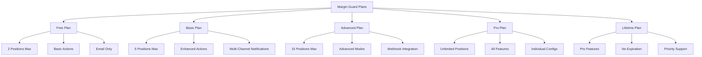

# Margin Guard Plan Limitations

## Summary

Comprehensive documentation of plan-specific limitations and features for the Margin Guard system. This document details the capabilities, restrictions, and upgrade paths for each plan tier, helping users understand what features are available at their current subscription level.

## Plan Overview



## Free Plan

### Features Included

- **Position Monitoring**: Up to 2 positions
- **Protection Mode**: Unitário only
- **Actions**: Close position only
- **Notifications**: Email notifications
- **Monitoring**: Basic monitoring (no real-time)
- **Execution**: Manual execution only

### Limitations

| Feature | Free Plan Limit |
|---------|-----------------|
| Maximum Positions | 2 positions |
| Protection Modes | Unitário only |
| Available Actions | Close position |
| Notification Channels | Email only |
| Real-time Monitoring | ❌ Disabled |
| Auto-execution | ❌ Disabled |
| Individual Configs | ❌ Not available |
| Webhook Integration | ❌ Not available |
| SMS Notifications | ❌ Not available |
| Advanced Analytics | ❌ Not available |
| Priority Support | ❌ Not available |

### Configuration Example

```json
{
  "plan_type": "free",
  "margin_threshold": 85,
  "action": "close_position",
  "selected_positions": ["pos_123", "pos_456"],
  "notifications": {
    "email": true
  },
  "protection_mode": "unitario",
  "real_time_monitoring": false,
  "auto_execution": false
}
```

### Upgrade Benefits

Upgrading to Basic Plan provides:
- 3 additional positions (5 total)
- Reduce position action
- Telegram notifications
- Real-time monitoring
- Auto-execution capability

## Basic Plan

### Features Included

- **Position Monitoring**: Up to 5 positions
- **Protection Modes**: Unitário
- **Actions**: Close and reduce position
- **Notifications**: Email and Telegram
- **Monitoring**: Real-time monitoring
- **Execution**: Auto-execution enabled
- **Analytics**: Basic execution reports

### Limitations

| Feature | Basic Plan Limit |
|---------|------------------|
| Maximum Positions | 5 positions |
| Protection Modes | Unitário only |
| Available Actions | Close, reduce position |
| Notification Channels | Email, Telegram |
| Real-time Monitoring | ✅ Enabled |
| Auto-execution | ✅ Enabled |
| Individual Configs | ❌ Not available |
| Webhook Integration | ❌ Not available |
| SMS Notifications | ❌ Not available |
| Advanced Analytics | ❌ Limited |
| Priority Support | ❌ Not available |

### Configuration Example

```json
{
  "plan_type": "basic",
  "margin_threshold": 80,
  "action": "reduce_position",
  "reduce_percentage": 50,
  "selected_positions": ["pos_123", "pos_456", "pos_789", "pos_101", "pos_102"],
  "notifications": {
    "email": true,
    "telegram": true
  },
  "protection_mode": "unitario",
  "real_time_monitoring": true,
  "auto_execution": true
}
```

### Upgrade Benefits

Upgrading to Advanced Plan provides:
- 10 additional positions (15 total)
- Total and Both protection modes
- Add margin action
- Webhook notifications
- Advanced analytics

## Advanced Plan

### Features Included

- **Position Monitoring**: Up to 15 positions
- **Protection Modes**: Unitário, Total, Both
- **Actions**: Close, reduce, and add margin
- **Notifications**: Email, Telegram, Webhook
- **Monitoring**: Advanced real-time monitoring
- **Execution**: Full auto-execution
- **Analytics**: Comprehensive execution reports
- **Integration**: Webhook support

### Limitations

| Feature | Advanced Plan Limit |
|---------|-------------------|
| Maximum Positions | 15 positions |
| Protection Modes | Unitário, Total, Both |
| Available Actions | Close, reduce, add margin |
| Notification Channels | Email, Telegram, Webhook |
| Real-time Monitoring | ✅ Advanced |
| Auto-execution | ✅ Full |
| Individual Configs | ❌ Not available |
| SMS Notifications | ❌ Not available |
| Advanced Analytics | ✅ Comprehensive |
| Priority Support | ❌ Not available |

### Configuration Example

```json
{
  "plan_type": "advanced",
  "margin_threshold": 75,
  "action": "add_margin",
  "add_margin_amount": 10000,
  "selected_positions": ["pos_123", "pos_456", "pos_789", "pos_101", "pos_102", "pos_103", "pos_104", "pos_105", "pos_106", "pos_107", "pos_108", "pos_109", "pos_110", "pos_111", "pos_112"],
  "notifications": {
    "email": true,
    "telegram": true,
    "webhook": true
  },
  "protection_mode": "both",
  "real_time_monitoring": true,
  "auto_execution": true,
  "webhook_url": "https://your-app.com/margin-guard-webhook"
}
```

### Upgrade Benefits

Upgrading to Pro Plan provides:
- Unlimited positions
- Individual position configurations
- Increase liquidation distance action
- SMS notifications
- Priority support

## Pro Plan

### Features Included

- **Position Monitoring**: Unlimited positions
- **Protection Modes**: All modes available
- **Actions**: All actions available
- **Notifications**: All notification channels
- **Monitoring**: Premium real-time monitoring
- **Execution**: Full auto-execution with priority
- **Analytics**: Premium analytics and insights
- **Integration**: Full webhook and API access
- **Support**: Priority support

### Limitations

| Feature | Pro Plan Limit |
|---------|---------------|
| Maximum Positions | Unlimited |
| Protection Modes | All available |
| Available Actions | All available |
| Notification Channels | All available |
| Real-time Monitoring | ✅ Premium |
| Auto-execution | ✅ Priority |
| Individual Configs | ✅ Available |
| SMS Notifications | ✅ Available |
| Advanced Analytics | ✅ Premium |
| Priority Support | ✅ Available |

### Configuration Example

```json
{
  "plan_type": "pro",
  "margin_threshold": 70,
  "action": "increase_liquidation_distance",
  "new_liquidation_distance": 85,
  "selected_positions": ["unlimited"],
  "individual_configs": {
    "pos_123": {
      "margin_threshold": 60,
      "action": "close_position"
    },
    "pos_456": {
      "margin_threshold": 75,
      "action": "reduce_position",
      "reduce_percentage": 30
    },
    "pos_789": {
      "margin_threshold": 85,
      "action": "add_margin",
      "add_margin_amount": 5000
    }
  },
  "notifications": {
    "email": true,
    "telegram": true,
    "webhook": true,
    "sms": true
  },
  "protection_mode": "both",
  "real_time_monitoring": true,
  "auto_execution": true,
  "priority_execution": true
}
```

## Lifetime Plan

### Features Included

- **All Pro Features**: Complete feature set
- **No Expiration**: Permanent access
- **Priority Support**: Highest priority
- **Exclusive Features**: Lifetime-only features
- **No Renewal**: One-time payment

### Special Benefits

| Feature | Lifetime Plan Benefit |
|---------|----------------------|
| Feature Access | All Pro features |
| Expiration | Never expires |
| Support Priority | Highest priority |
| Exclusive Features | Lifetime-only features |
| Renewal | No renewal required |
| Updates | All future updates included |

## Plan Comparison Matrix

| Feature | Free | Basic | Advanced | Pro | Lifetime |
|---------|------|-------|----------|-----|----------|
| **Positions** | 2 | 5 | 15 | Unlimited | Unlimited |
| **Protection Modes** | Unitário | Unitário | All | All | All |
| **Actions** | Close | Close, Reduce | Close, Reduce, Add Margin | All | All |
| **Notifications** | Email | Email, Telegram | Email, Telegram, Webhook | All | All |
| **Real-time Monitoring** | ❌ | ✅ Basic | ✅ Advanced | ✅ Premium | ✅ Premium |
| **Auto-execution** | ❌ | ✅ | ✅ | ✅ Priority | ✅ Priority |
| **Individual Configs** | ❌ | ❌ | ❌ | ✅ | ✅ |
| **Webhook Integration** | ❌ | ❌ | ✅ | ✅ | ✅ |
| **SMS Notifications** | ❌ | ❌ | ❌ | ✅ | ✅ |
| **Advanced Analytics** | ❌ | ❌ Basic | ✅ Comprehensive | ✅ Premium | ✅ Premium |
| **Priority Support** | ❌ | ❌ | ❌ | ✅ | ✅ Highest |
| **API Access** | Basic | Basic | Standard | Full | Full |

## Plan Validation Logic

### Position Limit Validation

```typescript
function validatePositionLimit(planType: string, positionCount: number): ValidationResult {
  const limits = {
    free: 2,
    basic: 5,
    advanced: 15,
    pro: -1, // Unlimited
    lifetime: -1 // Unlimited
  };

  const limit = limits[planType];
  
  if (limit === -1) {
    return { isValid: true, message: 'Unlimited positions allowed' };
  }

  if (positionCount > limit) {
    return {
      isValid: false,
      message: `Maximum ${limit} positions allowed for ${planType} plan`,
      suggestedUpgrade: getSuggestedUpgrade(planType, positionCount)
    };
  }

  return { isValid: true };
}

function getSuggestedUpgrade(currentPlan: string, requiredPositions: number): string {
  if (requiredPositions <= 5) return 'basic';
  if (requiredPositions <= 15) return 'advanced';
  return 'pro';
}
```

### Feature Availability Validation

```typescript
function validateFeatureAvailability(planType: string, feature: string): boolean {
  const featureMatrix = {
    free: ['close_position', 'email_notifications', 'unitario_mode'],
    basic: ['close_position', 'reduce_position', 'email_notifications', 'telegram_notifications', 'unitario_mode', 'real_time_monitoring'],
    advanced: ['close_position', 'reduce_position', 'add_margin', 'email_notifications', 'telegram_notifications', 'webhook_notifications', 'unitario_mode', 'total_mode', 'both_mode', 'real_time_monitoring', 'auto_execution'],
    pro: ['all_features'],
    lifetime: ['all_features']
  };

  const availableFeatures = featureMatrix[planType];
  
  if (availableFeatures.includes('all_features')) {
    return true;
  }

  return availableFeatures.includes(feature);
}
```

### Action Type Validation

```typescript
function validateActionType(planType: string, action: string): ValidationResult {
  const actionLimits = {
    free: ['close_position'],
    basic: ['close_position', 'reduce_position'],
    advanced: ['close_position', 'reduce_position', 'add_margin'],
    pro: ['close_position', 'reduce_position', 'add_margin', 'increase_liquidation_distance'],
    lifetime: ['close_position', 'reduce_position', 'add_margin', 'increase_liquidation_distance']
  };

  const allowedActions = actionLimits[planType];
  
  if (!allowedActions.includes(action)) {
    return {
      isValid: false,
      message: `Action '${action}' not available for ${planType} plan`,
      availableActions: allowedActions,
      suggestedUpgrade: getUpgradeForAction(action)
    };
  }

  return { isValid: true };
}

function getUpgradeForAction(action: string): string {
  const actionUpgrades = {
    'reduce_position': 'basic',
    'add_margin': 'advanced',
    'increase_liquidation_distance': 'pro'
  };

  return actionUpgrades[action] || 'pro';
}
```

## Upgrade Paths

### Free to Basic

**Trigger Conditions**:
- User tries to add more than 2 positions
- User tries to use reduce_position action
- User tries to enable Telegram notifications

**Upgrade Process**:
```typescript
async function upgradeToBasic(userId: string): Promise<UpgradeResult> {
  // Validate current configuration
  const currentConfig = await getMarginGuardConfig(userId);
  
  // Check if upgrade is needed
  const needsUpgrade = (
    currentConfig.selected_positions.length > 2 ||
    currentConfig.action === 'reduce_position' ||
    currentConfig.notifications.telegram
  );

  if (needsUpgrade) {
    return {
      canUpgrade: true,
      upgradeRequired: true,
      newFeatures: [
        'Up to 5 positions',
        'Reduce position action',
        'Telegram notifications',
        'Real-time monitoring',
        'Auto-execution'
      ],
      upgradeUrl: '/upgrade?plan=basic'
    };
  }

  return { canUpgrade: false, upgradeRequired: false };
}
```

### Basic to Advanced

**Trigger Conditions**:
- User tries to add more than 5 positions
- User tries to use add_margin action
- User tries to enable webhook notifications
- User tries to use total or both protection modes

**Upgrade Process**:
```typescript
async function upgradeToAdvanced(userId: string): Promise<UpgradeResult> {
  const currentConfig = await getMarginGuardConfig(userId);
  
  const needsUpgrade = (
    currentConfig.selected_positions.length > 5 ||
    currentConfig.action === 'add_margin' ||
    currentConfig.notifications.webhook ||
    ['total', 'both'].includes(currentConfig.protection_mode)
  );

  if (needsUpgrade) {
    return {
      canUpgrade: true,
      upgradeRequired: true,
      newFeatures: [
        'Up to 15 positions',
        'Add margin action',
        'Webhook notifications',
        'Total and Both protection modes',
        'Advanced analytics',
        'Enhanced monitoring'
      ],
      upgradeUrl: '/upgrade?plan=advanced'
    };
  }

  return { canUpgrade: false, upgradeRequired: false };
}
```

### Advanced to Pro

**Trigger Conditions**:
- User tries to add more than 15 positions
- User tries to use increase_liquidation_distance action
- User tries to configure individual position settings
- User tries to enable SMS notifications

**Upgrade Process**:
```typescript
async function upgradeToPro(userId: string): Promise<UpgradeResult> {
  const currentConfig = await getMarginGuardConfig(userId);
  
  const needsUpgrade = (
    currentConfig.selected_positions.length > 15 ||
    currentConfig.action === 'increase_liquidation_distance' ||
    currentConfig.individual_configs ||
    currentConfig.notifications.sms
  );

  if (needsUpgrade) {
    return {
      canUpgrade: true,
      upgradeRequired: true,
      newFeatures: [
        'Unlimited positions',
        'Individual position configurations',
        'Increase liquidation distance action',
        'SMS notifications',
        'Priority support',
        'Premium analytics'
      ],
      upgradeUrl: '/upgrade?plan=pro'
    };
  }

  return { canUpgrade: false, upgradeRequired: false };
}
```

## Plan Enforcement

### Real-time Enforcement

```typescript
class PlanEnforcementService {
  async enforcePlanLimits(userId: string, action: string, data: any): Promise<EnforcementResult> {
    const userPlan = await getUserPlan(userId);
    const planLimits = getPlanLimits(userPlan);

    // Check position limits
    if (data.positions && data.positions.length > planLimits.maxPositions) {
      return {
        allowed: false,
        reason: 'position_limit_exceeded',
        message: `Maximum ${planLimits.maxPositions} positions allowed for ${userPlan} plan`,
        upgradeRequired: true
      };
    }

    // Check action availability
    if (!planLimits.allowedActions.includes(action)) {
      return {
        allowed: false,
        reason: 'action_not_available',
        message: `Action '${action}' not available for ${userPlan} plan`,
        upgradeRequired: true
      };
    }

    // Check notification channels
    if (data.notifications) {
      for (const channel of Object.keys(data.notifications)) {
        if (!planLimits.allowedNotifications.includes(channel)) {
          return {
            allowed: false,
            reason: 'notification_channel_not_available',
            message: `Notification channel '${channel}' not available for ${userPlan} plan`,
            upgradeRequired: true
          };
        }
      }
    }

    return { allowed: true };
  }
}
```

### Graceful Degradation

```typescript
class GracefulDegradationService {
  async downgradeConfiguration(userId: string, newPlan: string): Promise<DowngradeResult> {
    const currentConfig = await getMarginGuardConfig(userId);
    const newPlanLimits = getPlanLimits(newPlan);

    const downgradedConfig = { ...currentConfig };

    // Reduce position count if necessary
    if (currentConfig.selected_positions.length > newPlanLimits.maxPositions) {
      downgradedConfig.selected_positions = 
        currentConfig.selected_positions.slice(0, newPlanLimits.maxPositions);
    }

    // Change action if not available
    if (!newPlanLimits.allowedActions.includes(currentConfig.action)) {
      downgradedConfig.action = newPlanLimits.allowedActions[0]; // Use first available action
    }

    // Remove unavailable notification channels
    const allowedChannels = newPlanLimits.allowedNotifications;
    downgradedConfig.notifications = Object.fromEntries(
      Object.entries(currentConfig.notifications).filter(([channel]) => 
        allowedChannels.includes(channel)
      )
    );

    // Remove individual configs if not supported
    if (!newPlanLimits.supportsIndividualConfigs) {
      delete downgradedConfig.individual_configs;
    }

    return {
      success: true,
      downgradedConfig,
      removedFeatures: this.getRemovedFeatures(currentConfig, downgradedConfig),
      warnings: this.generateWarnings(currentConfig, downgradedConfig)
    };
  }
}
```

## How to Use This Document

- **For Plan Selection**: Compare features and limitations across all plans
- **For Configuration**: Reference plan-specific configuration examples
- **For Validation**: Use the validation logic for plan compliance
- **For Upgrades**: Follow the upgrade paths and processes
- **For Enforcement**: Implement the plan enforcement mechanisms

